# Mini-GRUB：从零写 GRUB 课程

参照 GNU GRUB 2.x 源码、从零动手复刻一个能启动 TinyOS 主线的引导器（i386-pc / BIOS
路径）。与 TinyOS 主线的「GRUB 源码研读支线」（`lessons/lesson-0.1-stable` … 0.10）
互补：0.x 只读源码、只观察产物；本课程则**真正写出每一行引导代码**，并让产物在
QEMU 上可见验证。每课保留自己的源码与提交的 `build/` 产物（与
`lessons/lesson-XX-stable/` 的单一 stable 约定一致）。

- 汇编：AT&T 语法（与 TinyOS 主线一致），GNU `as`。
- 运行时约束：无 libc（无 `printf`/`malloc`），freestanding。
- 目标平台：BIOS + i386-pc 路径（实模式 → 保护模式 → Multiboot2 交接）；UEFI 仅在
  研读层面涉及，不在实现范围。
- 规范权威：Multiboot2 规范、Intel SDM、GNU GRUB 源码（版本固定 2.14，已下载到
  本机 `~/grub-src/grub-2.14`，gpg 签名验证通过）；Linux 源码仅作工程对照。
- 验证：每课在 QEMU 的 VGA 上可见验证；自动化冒烟复用 TinyOS 主线的
  `pmemsave 0xB8000` VGA 文本校验手法。

## 课程位置

```text
TinyOS 主线 Lesson 00（启动链总览）
        ↓
0.1 → … → 0.10（GRUB 源码研读支线，只读观察）
        ↓
本课程 B01 → B02 → … → B23（从零写 GRUB）
        ↓  (B12/B21 checkpoint)
反向启动 TinyOS 主线 lessons/lesson-0X-stable/build/kernel.elf（替代真 GRUB）
```

## AI 编写与验证声明

本课程的引导器代码、课程说明、Makefile 与验证脚本由 AI 辅助编写，并由维护者审阅、
整理和验收。B01–B19 已执行逐课 `make`、`make check` 与 QEMU 启动冒烟 + VGA 文本
专项验证；其中 B12 已用自写引导器启动 TinyOS 主线 L01/L05（含交互式 mmap 验收），
B13 已从 El Torito 光盘启动并解析 ISO9660 卷（PVD/目录记录/extent，文件字节与
xorriso 抽取一致）；B14 已实现四层文件抽象并按路径打开 `/BOOT/KERNEL.ELF`；
B15 完成 core image 模型（stage1 读 BIF + CD 读 core）并按路径装载启动测试内核；
B16 实现命令注册表、`set` 环境变量与 PS/2 键盘驱动的 `grub>` 交互命令行；
B17 实现 grub.cfg 解析执行并自动启动内核；
B18 实现 menuentry 菜单（timeout/default/方向键选择）；
B19 实现模块系统（ET_REL `.mod` 加载、核心导出符号表、insmod/lsmod，hexdump
命令按需加载闭环）；
B20 实现 VBE framebuffer（INT 10 4F00/4F01/4F02、800x600x32 LFB、LFB 测试
图案，QEMU screendump 像素探针验收）；
B21 实现 type-8 framebuffer tag 交接，启动 TinyOS L61 GUI 内核（交互 shell）；
B22 实现故障调试与 rescue（错误分类/错误消息/FAULT 注入/`rescue>` 降级）；
B23 终课验收：`validate-course.sh all check/qemu` 全课程回归 + source-to-screen
时序文档。自动化模型测试可以证明确定性状态机和静态断言，但不等同于每一种真实
硬件、磁盘几何或 BIOS 固件的人工验收。

## 课程清单（23 课）

| 课次 | 主题 | 对照 GRUB 源码 | 状态 |
|---|---|---|---|
| B01 | 512 字节引导扇区 Hello（0x55AA、INT 10、INT 13 读盘原理） | `grub-core/boot/i386/pc/boot.S` | 已实现 |
| B02 | 两段式引导：stage1 用 INT 13 读 stage2 并远跳 | `grub-core/boot/i386/pc/diskboot.S` | 已实现 |
| B03 | 保护模式切换：A20、GDT、CR0.PE、直接写 0xB8000 | `grub-core/kern/i386/pc/startup.S` | 已实现 |
| B04 | 保护模式 C 运行时与 VGA 文本库（loader 主体转 C） | `grub-core/kern/main.c` 初始化序 | 已实现 |
| B05 | 实模式回调磁盘读：prot_to_real / real_to_prot + INT 13 封装 | `grub_bios_interrupt`（startup.S） | 已实现 |
| B06 | ELF32 解析：header、program headers、PT_LOAD 校验 | `grub-core/kern/elf.c` | 已实现 |
| B07 | Multiboot2 header 校验：首 32 KiB、8 对齐、magic/checksum | `grub-core/loader/multiboot.c` | 已实现 |
| B08 | PT_LOAD 装载、bss 清零、首个 Multiboot2 内核交接 | `multiboot_elfxx.c` + `commands/boot.c` | 已实现 |
| B09 | MBI 结构：total_size、tag 布局、end tag | `multiboot_mbi2.c`（make_mbi 框架） | 已实现 |
| B10 | E820 内存图 → type-6 mmap tag | `grub_machine_mmap_iterate`（INT 15 E820） | 已实现 |
| B11 | 装载框架：load 注册与 boot 执行分离 | `grub-core/kern/loader.c`（grub_loader_set/boot） | 已实现 |
| B12 | 综合 checkpoint：自写引导器启动 TinyOS L01/L05 | TinyOS `lessons/lesson-0X-stable` | 已实现 |
| B13 | ISO9660 基础读取：PVD、目录记录、extent | `grub-core/fs/iso9660.c` | 已实现 |
| B14 | 路径查找与文件抽象（device→disk→fs→file 四层） | `kern/{device,disk,file}.c` + `include/grub/fs.h` | 已实现 |
| B15 | El Torito 光盘引导：自建 boot image + xorriso 打包 | `eltorito.img` / `util/grub-mkrescue.c` | 已实现 |
| B16 | 命令注册表 + set 环境变量 + 极简 grub> 命令行 | `include/grub/command.h` + `kern/env.c` | 已实现 |
| B17 | grub.cfg 解析执行：tokenizer 与语句执行 | `grub-core/script/` | 已实现 |
| B18 | menuentry 菜单与 timeout/default 选择 | `commands/menuentry.c` + `normal/main.c` | 已实现 |
| B19 | 模块系统：自定义 .mod 格式与按需加载 | grub-mkimage 模块模型 | 已实现 |
| B20 | VBE framebuffer：INT 10 4F01/4F02、LFB | `grub-core/video/i386_pc/vbe.c` | 已实现 |
| B21 | type-8 framebuffer tag → 启动 TinyOS L61/62 GUI | `multiboot_mbi2.c` framebuffer tag | 已实现 |
| B22 | 故障调试与 rescue：坏 ELF/坏 header/缺文件/缺模块 | 研读支线 0.9 故障分类 | 已实现 |
| B23 | 端到端综合验收：source-to-screen 与回归验证 | 研读支线 0.10 | 已实现 |

## 课程前后关系

```mermaid
flowchart LR
  subgraph S1[阶段一 实模式与保护模式引导链]
    B01 --> B02 --> B03 --> B04 --> B05
  end
  subgraph S2[阶段二 ELF 与 Multiboot2 装载]
    B06 --> B07 --> B08 --> B09 --> B10 --> B11 --> B12
  end
  subgraph S3[阶段三 光盘与文件系统]
    B13 --> B14 --> B15
  end
  subgraph S4[阶段四 配置与交互]
    B16 --> B17 --> B18
  end
  subgraph S5[阶段五 模块系统与图形]
    B19 --> B20 --> B21
  end
  subgraph S6[阶段六 故障与验收]
    B22 --> B23
  end
  B05 --> B06
  B12 --> B13
  B15 --> B16
  B18 --> B19
  B21 --> B22
  B23 --> L01[TinyOS Lesson 01…162 主线]
```



## 构建与运行（以 B01 为例）

```bash
cd bootloader-course/lessons/b01-stable
make clean && make -j"$(nproc)"
make check     # 静态断言：512 字节、0x55AA、符号存在
make run       # 打开 QEMU 窗口，VGA 可见验证
```

克隆后可直接验证单课（脚本拷贝到临时目录，不改写提交的 `build/`）：

```bash
bootloader-course/scripts/validate-course.sh b01 check
bootloader-course/scripts/validate-course.sh b01 qemu   # 构建 + QEMU 冒烟 + VGA 文本校验
```

终课（B23）验收——全课程回归：

```bash
bootloader-course/scripts/validate-course.sh all check   # 23 课快速矩阵（~2 分钟）
bootloader-course/scripts/validate-course.sh all qemu    # 23 课完整 QEMU 电池（~10 分钟）
```

时序文档：[`docs/source-to-screen.md`](docs/source-to-screen.md)。

## 课程验证分层

1. **结构检查**：课程目录、Makefile 目标、README 与「设计中/已实现」标记完整。
2. **build**：生成引导扇区 / stage2 / floppy 镜像，检查汇编、编译、链接错误。
3. **`make check`**：静态断言（扇区大小、0x55AA、符号表、二进制布局）。
4. **QEMU 冒烟**：镜像可启动、无 triple fault 或异常退出。
5. **VGA 文本专项**：`pmemsave 753664 4000` 读取 0xB8000 文本内存，grep 期望字符串。

## 证据边界

- 不自动下载、解压或执行第三方 GRUB 源码；学习者从 GNU 官方渠道自行取得，版本固定
  GRUB 2.14（与研读支线一致），详见 [`docs/grub-implementation-guide.md`](docs/grub-implementation-guide.md)。
- 只读观察工具（`readelf`/`objdump`/`grub-file`/`xorriso`）可用于对照，不执行未知脚本。
- 故障实验一律在临时副本中进行，绝不覆盖提交的 stable 产物。
- Linux 源码仅作工程对照，不作为 GNU GRUB 实现来源。

## 学习路径

- 共享参照文档：[`docs/grub-implementation-guide.md`](docs/grub-implementation-guide.md)
  （版本固定、源码地图、证据边界、构建/验证约定）。
- 一致性声明：[`docs/consistency.md`](docs/consistency.md)（三层一致性：
  契约级字节布局 / 结构级流程对应 / 文本级逐字复刻）。
- 逐字复刻层：[`reference/grub-2.14/`](reference/grub-2.14/)（26 个 GRUB 2.14
  核心文件原样归档，`reference/verify-reference.sh` 两层 sha256 校验）。
- 每课文档模板：[`docs/lesson-lecture-template.md`](docs/lesson-lecture-template.md)
  （已实现课为「精讲文档」，设计中课为「课程规划文档」）。
- 每课文档：[`lessons/b01-stable/README.md`](lessons/b01-stable/README.md) →
  [`b02`](lessons/b02-stable/README.md) → … → [`b23`](lessons/b23-stable/README.md)。
