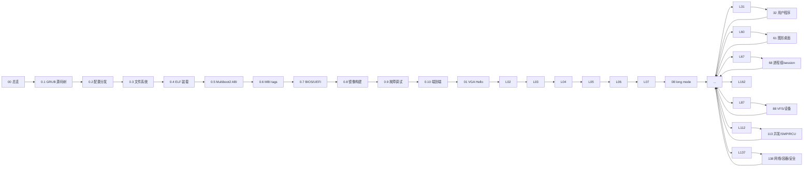

# TinyOS 从零操作系统课程 · 学习文档

> 本学习文档面向**零基础起步的操作系统学习者**，配套仓库中 Lesson 00–162 的统一课程编写。
> 目标：让初学者沿「由简到难」的路径，把每一课的源码**逐行读懂**、把每个验证步骤**亲手跑通**，
> 最终建立起对「操作系统如何从加电到跑起用户程序」的完整、有证据支撑的心智模型。

目录：

1. [这份文档怎么用](#1-这份文档怎么用)
2. [课程总览：你将要写一个什么](#2-课程总览你将要写一个什么)
3. [学习三部曲与验证铁律](#3-学习三部曲与验证铁律)
4. [学习路线总览](#4-学习路线总览)
5. [第 0 阶段：GRUB 源码研读（0.1–0.10）](#5-第-0-阶段grub-源码研读支线-01--010)
6. [第 1 阶段精讲：启动链与基础输出（00–07）](#6-第-1-阶段精讲启动链与基础输出-00--07)
7. [Lesson 08 精讲：从 32 位交接进入 x86_64 long mode](#7-lesson-08-精讲从-32-位交接进入-x8664-long-mode)
8. [第 2 阶段指引：异常、中断与调度（09–31）](#8-第-2-阶段指引异常中断与调度-09--31)
9. [第 3 阶段指引：用户程序、进程、虚拟内存与用户空间（32–60）](#9-第-3-阶段指引用户程序进程虚拟内存与用户空间-32--60)
10. [第 4 阶段指引：图形桌面主线（61–67）](#10-第-4-阶段指引图形桌面主线-61--67)
11. [第 5 阶段指引：进程组/session/调度/COW（68–87）](#11-第-5-阶段指引进程组session调度cow-68--87)
12. [第 6 阶段指引：VFS/设备/epoll/服务（88–112）](#12-第-6-阶段指引vfs设备epoll服务-88--112)
13. [第 7 阶段指引：并发/SMP/RCU/诊断（113–137）](#13-第-7-阶段指引并发smprcu诊断-113--137)
14. [第 8 阶段指引：网络/namespace/cgroup/安全（138–162）](#14-第-8-阶段指引网络namespacecgroup安全-138--162)
15. [学习节奏与常见误区](#15-学习节奏与常见误区)
16. [附录](#16-附录)

---

## 1. 这份文档怎么用

这份文档不是课程的替代品，而是课程的**导游图 + 精讲笔记**：

- **精讲部分**（第 1 阶段 Lesson 00–07 与 Lesson 08）：把源码逐行注释、把每一步「为什么这么做」讲清楚，
  适合第一遍学习时对照阅读。
- **指引部分**（第 2–8 阶段）：给出每个阶段的学习目标、每课的核心概念与验证要点，
  适合在学完精讲、掌握了「读源码→跑验证」的方法后，作为自学地图使用。
- **附录**：环境搭建、命令速查、术语表、排错速查，随时回来查阅。

建议的使用方式（文中所有命令均在**仓库根目录**执行）：

1. 先读完第 1–4 节，知道这门课在讲什么、怎么学。
2. 打开 `lessons/lesson-00-stable/README.md`，跟着第 6 节把 Lesson 00–01 精讲读完，
   并实际运行 `make -C lessons/lesson-01-stable run`。
3. 从 Lesson 02 开始，自己动手：**先试着读源码，再回来对照本精讲**。
4. 进入第 2 阶段后，按「学习三部曲」（见第 3 节）独立完成每课，指引部分只做定位与查漏。

---

## 2. 课程总览：你将要写一个什么

这个仓库是一整套**从零开始、逐课增量构建的教学操作系统**，名为 TinyOS。它的关键事实：

- **引导方式**：GRUB + Multiboot2（i386 交接 ABI），随后 TinyOS 自己进入 x86_64 long mode。
- **汇编语法**：AT&T 语法（`movl %eax, %ebx` 这种目标在右的风格）。
- **运行环境**：QEMU 虚拟机（TCG 软件模拟），Linux 主机。
- **运行时约束（最重要的一条）**：**无 libc**——没有 `printf`、没有 `malloc`、没有 `memcpy`、
  `memset`、`strlen`。每一课都要自己实现最小替代品。这正是「理解操作系统」的价值所在：
  你能看到每个字符、每个字节、每个页表项是怎么被内核亲手放进去的。
- **验证方式**：每课都在 QEMU 的 **VGA 图形窗口**上可见验证，**不以串口为准**。
- **权威边界**：CPU 行为以 Intel SDM 为准；引导协议以 Multiboot2 规范为准；loader 行为以 GNU GRUB 为准；
  **Linux 内核源码只作为工程对照**，帮助理解「真实内核怎么做」，但不定义本课程的硬件/协议事实。

课程总计 **163 个正式课号（00–162）**，分 7 大阶段；另外在 Lesson 00 与 01 之间有 10 个
**GRUB 源码研读支线小节（0.1–0.10）**。全部课程只保留 `lesson-XX-stable/` 一个可学习版本，
目录内含源码、Makefile、GRUB/linker 配置、构建产物与验证说明。

> **给初学者的第一个认知**：你不必先读完 163 课。课程是按「每个新概念单独成课、可独立验证」
> 的原则设计的——前一课是可运行的最小系统，下一课只在前一课之上加一个可见的小功能。
> 学完 Lesson 08，你就拥有了一个真实运行在 long mode 下的 64 位内核 + VGA shell，
> 这本身就是一个完整的里程碑。

---

## 3. 学习三部曲与验证铁律

每学一课，固定做三件事：

### 第 1 步：读 README，明确「这一课交付什么」

每课 `README.md` 的固定结构（以精讲阶段的课程为例）：

| 部分 | 内容 | 学习时问自己的问题 |
|---|---|---|
| 第一部分 使命与源码索引 | 一句话目标、权威来源边界 | 「这课到底要让我看到什么？」 |
| 第二部分 核心设计解剖 | 设计图、概念分层 | 「为什么这么设计？和 Linux 对照点在哪？」 |
| 第三部分 增量代码交付 | 新增/修改的文件清单 | 「相比上一课，新增了哪些文件/函数？」 |
| 第四部分 编译与运行验证 | 构建、check、QEMU 步骤 | 「成功的标准画面是什么样？」 |
| 第五部分 调试地图 | 现象 → 对照来源 → 检查 | 「出问题时该查哪里？」 |
| 第六部分 课后源码阅读作业 | 与 Linux 源码对照的任务 | 「我能用自己的话解释原理吗？」 |

### 第 2 步：读源码，按「数据 → 函数 → 控制流」顺序

- 先看全局数据结构（`#define`、`struct`、静态全局变量）：它们定义了「系统里有什么」。
- 再看每个函数：输入、输出、边界检查。
- 最后顺着 `kernel_main` / 主循环把控制流走一遍。

### 第 3 步：跑验证，并**亲手观察证据**

```bash
cd lessons/lesson-XX-stable
make clean && make -j"$(nproc)"     # 编译内核 + 生成 ISO
make check                          # Multiboot2 协议等静态检查
make run                            # 在 QEMU VGA 窗口里交互验证
```

### 验证铁律（每条都对应课程源码里的真实机制）

1. **成功画面在 QEMU 图形窗口，不在终端**：内核写的是 VGA 内存 `0xb8000`，不是串口。
   运行 `make run` 时**不要加 `-display none`**。
2. **`make check` 通过 ≠ 能启动**：`grub-file --is-x86-multiboot2` 只证明 header 合法，
   完整的启动证据是 QEMU 里看到 TinyOS 的输出。
3. **不要绕过 GRUB**：用 `-cdrom build/kernel.iso` 启动，不要用 `qemu -kernel kernel.elf`，
   否则验证的不是课程定义的 Multiboot2 路径。
4. **稳定目录只读**：`lesson-XX-stable/` 是冻结证据。想改代码做实验时，把目录复制成
   自己的学习版再改；本课程所有验证脚本都只在临时副本上运行，不覆盖 stable 产物。
5. **对照权威来源，不猜**：每个「现象」都要回到 README 第五部分给出的权威来源
   （Intel SDM / Multiboot2 规范 / GRUB / Linux 源码）去解释。

---

## 4. 学习路线总览

### 4.1 完整流程图（仓库 README 的课程关系图）



### 4.2 七大阶段总览

| 阶段 | 课号 | 主题 | 学完后你能说清 |
|---|---|---|---|
| 阶段 0 | 0.1–0.10 | GRUB 源码研读（文档课） | GRUB 如何把 ELF 变成 Multiboot2 交接 |
| 阶段 1 | 00–07 | 启动链与基础输出 | 加电 → BIOS → GRUB → 32 位保护模式 → VGA/键盘/shell/内存图/页分配/分页 |
| 阶段 2 | 08–31 | 64 位内核、异常、中断与调度 | 自己写 long mode 切换、IDT、PIC/PIT、物理内存、线程调度、CPL3 与 syscall |
| 阶段 3 | 32–60 | 用户程序、进程、虚拟内存与用户空间 | 加载用户程序、进程/线程模型、Linux 风格核心对象、shell runtime |
| 阶段 4 | 61–67 | 图形桌面主线 | framebuffer、canvas、鼠标键盘、桌面对象、compositor、图形 Terminal |
| 阶段 5 | 68–87 | 进程组/session/调度/COW | job control、调度元数据、写时复制、fork 一致性 |
| 阶段 6 | 88–112 | VFS/设备/epoll/服务 | 文件系统层次、字符/块设备、poll/epoll、服务管理 |
| 阶段 7 | 113–137 | 并发/SMP/RCU/诊断 | 锁与内存序、per-CPU、SMP、RCU、tracing 与死锁检测 |
| 阶段 8 | 138–162 | 网络/namespace/cgroup/安全 | 网络栈、namespace 隔离、cgroup、capability 与安全边界 |

### 4.3 建议节奏

- **第一遍（1–2 周）**：精读阶段 1（本文档第 6、7 节）+ 阶段 2 的前几课（08–14），
  把「启动链 → 中断 → 内存管理」的骨架建立起来。这是最密集、也最值得精读的部分。
- **第二遍（3–6 周）**：按指引完成阶段 2 剩余课程与阶段 3（08–60），
  养成「先读 README → 再读源码 → 最后跑验证」的节奏。
- **第三遍（后续）**：按兴趣与时间推进阶段 4–8。这些阶段以「固定元数据 + 确定性验证」
  的教学模型展开（详见第 10–14 节），每课增量小、对照点明确，可以零散时间推进。

> **重要提醒**：阶段 4–8 的大多数课程是「教学模型（bounded metadata model）」——
> 用有界的数据结构 + 确定性命令验证**复刻 Linux 对应机制的结构与语义**，
> 而不是完整实现真实内核的每条路径。学习时重点抓「结构对、边界对、验证对」，
> 不要期待看到完整的 ext4 或完整 TCP 协议栈实现。

---

## 5. 第 0 阶段：GRUB 源码研读支线（0.1–0.10）

**位置**：Lesson 00 与 Lesson 01 之间，10 个文档型小节，只读源码与工具输出，不生成内核。

**目的**：在写第一行 TinyOS 代码前，先搞清「是谁把我们的内核装进内存并跳到 `_start` 的」。

**学习建议**：这一阶段对初学者可能偏难（涉及真实 GRUB 源码树），可以**先粗读一遍建立概念**，
学完 Lesson 08 之后再回来精读——那时你会真正理解 `multiboot2 /boot/kernel.elf` 这条命令意味着什么。

| 小节 | 主题 | 学习要点 |
|---|---|---|
| 0.1 | 源码树 | `grub-core/` 与 `include/`、`util/` 的职责划分；`grub-file --version` 确认本机版本 |
| 0.2 | 配置分发 | grub.cfg → menuentry → 命令执行链路 |
| 0.3 | 文件系统 | GRUB 如何读 ISO9660、设备枚举与路径查找 |
| 0.4 | ELF 装载 | header 校验、PT_LOAD 段装载、entry point |
| 0.5 | Multiboot2 ABI | i386 交接状态：EAX=magic、EBX=MBI 地址 |
| 0.6 | MBI tags | MBI 结构、tag 遍历、8 字节对齐 |
| 0.7 | BIOS/UEFI | 两条平台路径与差异 |
| 0.8 | 镜像构建 | grub-mkimage / grub-mkrescue 生成什么 |
| 0.9 | 故障调试 | GRUB 启动失败的观察手段 |
| 0.10 | 端到端 | 用 Lesson 01 的 ISO 把整条链走一遍 |

共享说明见 `docs/grub-source-study.md`。关键观察命令（只读，不改动任何产物）：

```bash
K=lessons/lesson-01-stable/build/kernel.elf
ISO=lessons/lesson-01-stable/build/kernel.iso
grub-file --is-x86-multiboot2 "$K"
readelf -h -l -S -W "$K"            # ELF 头部、段、节
readelf -x .multiboot "$K"          # 看 header 原始字节（magic 0xe85250d6）
objdump -d -Mintel --disassemble=_start "$K"
xorriso -indev "$ISO" -report_el_torito plain   # ISO 的 BIOS 启动记录
```

---

## 6. 第 1 阶段精讲：启动链与基础输出（00–07）

本阶段是你从「什么都不会」到「拥有一个 32 位保护模式下的可交互 TinyOS」的过程。
请严格按照顺序学，每一课都是下一课的地基。

### 6.1 Lesson 00：加电 → GRUB → 保护模式交接（概念课）

**一句话目标**：在写第一行内核代码前，准确划清 CPU、QEMU/SeaBIOS、GRUB、Multiboot2、TinyOS 的责任。

先建立一个不可动摇的**责任分层**：

```text
CPU 加电复位（Intel SDM 定义 CPU 状态）
  → QEMU 默认 SeaBIOS（本实验固件）
  → GRUB（独立 bootloader：读 ISO、读 grub.cfg、装载内核）
  → Multiboot2（loader 与内核之间的协议：header + i386 交接状态）
  → TinyOS _start（我们自己的 32 位保护模式入口）
```

三个关键结论（也是初学者最容易混的三点）：

1. **保护模式不是 TinyOS 切进去的**。GRUB 按 Multiboot2 规范完成 i386 交接时，CPU
   已经在 32 位保护模式。所以第一课的 `_start` 第一条指令就可以是 `cli` + 设置栈 + 调 C，
   而不是自己写「实模式 → 保护模式」切换。
2. **`.code32` 不切换模式**。它只是告诉汇编器「按 32 位指令编码」。真正改变 CPU 模式的
   是控制寄存器/EFER 与指令序列——那要等到 Lesson 08。
3. **保护模式 ≠ long mode**。Lesson 01–07 都是 32 位保护模式；long mode 是 TinyOS 自己在
   Lesson 08 完成的独立里程碑。

**验证**：本课没有内核可编译，验证是「只读检查」冻结的 Lesson 01 产物（见第 0 阶段的命令清单）。
最后 `make -C lessons/lesson-01-stable run`，亲眼看到三行 VGA 文字。

### 6.2 Lesson 01：第一个 VGA Hello（精讲）

**一句话目标**：让 GRUB 按 Multiboot2 装载内核，TinyOS 直接写 VGA text buffer 显示第一句问候。

这是重启后的第一课，全部 5 个文件从零建立。我们逐个精读。

#### 6.2.1 `grub.cfg`——GRUB 的菜单配置

```cfg
set timeout=0                    # 菜单不等待，直接启动默认项
set default=0                    # 默认启动第 0 个 menuentry

menuentry "TinyOS lesson 1" {   # 定义一个启动项
    multiboot2 /boot/kernel.elf # 用 Multiboot2 loader 装载 /boot/kernel.elf
    boot                       # 跳转到内核入口
}
```

要点：`multiboot2` 表示**协议是 Multiboot2**；`boot` 才真正把控制权交给内核。
GRUB 在跳转前会做三件事：在内核镜像前 32 KiB 内找 8 字节对齐的 Multiboot2 header、
按 ELF 程序段装载、准备 EAX/EBX 交接寄存器。

#### 6.2.2 `boot.S`——Multiboot2 header 与 32 位入口（逐行注释版）

```asm
/* 第一课：GRUB 的 Multiboot2 32 位交接和可见 VGA 文本输出。 */

/* ---- Multiboot2 header 常量 ---- */
.set MB2_HEADER_MAGIC,       0xe85250d6   /* 协议魔数：header 以此开头识别 */
.set MB2_ARCHITECTURE_I386,  0            /* architecture=0 表示 i386 交接 */
.set MB2_HEADER_LENGTH,      mb2_header_end - mb2_header  /* header 总长 */
.set MB2_CHECKSUM,           -(MB2_HEADER_MAGIC + MB2_ARCHITECTURE_I386 + MB2_HEADER_LENGTH)
                                          /* 校验和：magic+arch+len+checksum ≡ 0 (mod 2^32) */

.section .multiboot, "a"     /* 专门节：链接脚本必须保留并置于镜像前 32 KiB */
.align 8                     /* 规范要求 8 字节对齐 */
mb2_header:
	.long MB2_HEADER_MAGIC            /* [0]  魔数 0xe85250d6 */
	.long MB2_ARCHITECTURE_I386       /* [4]  i386 交接架构 */
	.long MB2_HEADER_LENGTH           /* [8]  header 长度 */
	.long MB2_CHECKSUM                /* [12] 校验和 */
	.short 0                          /* [16] 附加 tag 的类型=0：结束 tag（End Tag） */
	.short 0                          /* [18] 该 tag 的标志 */
	.long 8                           /* [20] 结束 tag 长度=8（符合 8 字节对齐） */
mb2_header_end:

.section .text
.code32                    /* 以下按 32 位指令编码 */
.globl _start
.type _start, @function
.extern kernel_main32      /* C 函数在别的编译单元 */

_start:
	cli                    /* 关中断：GRUB 交接后的早期环境先保持受控 */
	movl $stack_top, %esp  /* 建立 TinyOS 自己的临时栈（16 KiB，.bss 中） */
	xorl %ebp, %ebp        /* 栈帧指针清零：ABI 要求，也便于栈回溯 */
	call kernel_main32     /* 进入 C：第一课只做 VGA 输出 */
1:
	hlt                    /* 内核输出完成后停机（暂停 CPU） */
	jmp 1b                 /* 被唤醒就回到 hlt，保持挂起 */

.section .bss
.align 16
stack_bottom:
.skip 16384               /* 16 KiB 栈空间 */
stack_top:
```

**逐条解释**：

- header 里的 4 个 `.long` 是 Multiboot2 规范强制要求的基础字段。校验和的算法保证
  `magic + architecture + length + checksum` 低 32 位等于 0，GRUB 用这个验证 header 有效。
- 后面的 `short/short/long` 是一个**结束 tag**（type=0, size=8）。本课 header 不含
  信息请求 tag；Lesson 08 会加上「请求内存图」的 tag。
- `cli` 对应 Linux `arch/x86/kernel/head_64.S:119` 的早期入口原则：在建立完整执行环境前，
  中断必须先关掉，否则任何异步 IRQ 都可能在你尚未就绪时到达。
- `%esp = stack_top`：bootloader 没有义务给你可用的栈，必须自己建。栈在 `.bss` 里，
  链接器把它放到可写段；`stack_top` 是栈顶（向下增长，所以 `%esp` 指向高地址端）。
- 为什么 `_start` 是 32 位？因为 Multiboot2 的 i386 交接状态就是 32 位保护模式；
  64 位是 TinyOS 自己的事（Lesson 08）。

#### 6.2.3 `kernel.c`——无 libc 的 VGA 输出（逐行注释版）

```c
/* 第一课：最小 VGA 文本 printk，不依赖 libc。 */

#define VGA_TEXT_BUFFER ((volatile unsigned short *)0xb8000)  /* VGA 文本显存 */
#define VGA_COLUMNS     80       /* 文本模式每行 80 个字符 */
#define VGA_ATTRIBUTE   0x0f     /* 属性：高 4 位背景(0=黑)、低 4 位前景(f=亮白) */

static unsigned short cursor;    /* 软件光标：当前写入位置（单元序号，0..1999） */

static void vga_putc(char c)
{
    if (c == '\n') {
        /* 换行：前进到下一行行首；80*25=2000 是边界，本课不滚屏 */
        cursor += VGA_COLUMNS - cursor % VGA_COLUMNS;
        return;
    }

    /* 每个单元 16 位：高 8 位属性，低 8 位 ASCII 字符 */
    VGA_TEXT_BUFFER[cursor++] = ((unsigned short)VGA_ATTRIBUTE << 8) |
                              (unsigned char)c;
}

/* 教学级 printk：逐字符调用 vga_putc，绝不调用 printf */
static void printk(const char *text)
{
    while (*text != '\0')
        vga_putc(*text++);
}

void kernel_main32(void)
{
    printk("TinyOS lesson 1\n");
    printk("Hello from the VGA text console!\n");
    printk("Multiboot2 boot succeeded.\n");
}
```

**逐条解释**：

- `0xb8000` 是 legacy VGA 文本模式的显存物理地址。每个「字符单元」是 16 位：
  `bit15..bit8` 是属性（前景色/背景色/闪烁），`bit7..bit0` 是 ASCII。
  所以 `0x0f << 8 | 'T'` = 亮白字符 T。
- 为什么用 `volatile`？因为硬件寄存器/显存的值会被显示器硬件改变或被外部观察，
  `volatile` 防止编译器把它优化掉或合并写入。
- 为什么没有 `printf`？因为 freestanding（无宿主）环境没有 libc。这是本课程一贯的约束，
  后续你会自己写出十六进制打印、格式化打印，最终才会理解 `printf` 到底做了什么。
- 换行只做「跳到下一行首」，不做滚屏——这是 Lesson 02 的增量。

#### 6.2.4 `linker.ld`——布局控制（逐行注释版）

```ld
/* Multiboot2 header 必须在镜像最初 32768 字节内，且按 8 字节对齐。 */
ENTRY(_start)              /* 入口点 = _start */

SECTIONS
{
	. = 1M;                /* 内核从物理 1 MiB 开始（避开 0~1MiB 传统区） */

	.multiboot ALIGN(8) : {      /* 让 header 按 8 对齐 */
		KEEP(*(.multiboot))      /* KEEP：即使没人引用也不被垃圾回收 */
	}

	.text ALIGN(16) : { *(.text .text.*) }      /* 代码段 */
	.rodata ALIGN(16) : { *(.rodata .rodata.*) } /* 只读数据 */

	/* 把可写段移到新页，避免生成 RWX 的 PT_LOAD 段（防御性布局） */
	. = ALIGN(CONSTANT(MAXPAGESIZE));
	.data ALIGN(16) : { *(.data .data.*) }      /* 可写数据 */
	.bss ALIGN(16) : {
		*(.bss .bss.*)                          /* 零初始化数据（含我们的栈） */
		*(COMMON)
	}
}
```

**逐条解释**：

- 内核放在 1 MiB：`0x00000000–0x000FFFFF` 是传统 BIOS 区（实模式中断向量表、IVT、
  BDA、`0x7c00` 引导扇区等），Multiboot2 也建议内核用 1 MiB 以上。
- `.multiboot` 用 `KEEP()`：现代链接器默认会丢弃「未被引用」的节；header 没有引用者，
  必须显式保留。且 `readelf` 会验证它在镜像前 32 KiB 内（GRUB 只搜索这一段）。
- `ALIGN(CONSTANT(MAXPAGESIZE))`：把可写段与只读段之间按页（4 KiB）对齐，
  这样最终的 LOAD 段能保持「RX 段」与「RW 段」分离，不会出现既可读又可写又可执行的
  RWX 段（现代系统/工具会告警）。Lesson 08 的验证记录里专门检查了这一点。
- 这段布局的思路对照 Linux 的 `arch/x86/kernel/vmlinux.lds.S`：内核必须显式、可控地
  决定镜像布局，不能交给默认链接规则。

#### 6.2.5 `Makefile`——构建管线（逐行注释版）

```make
CC := gcc
LD := ld
CFLAGS := -m32 -ffreestanding -fno-pie -fno-stack-protector -fno-asynchronous-unwind-tables -Wall -Wextra -Werror
LDFLAGS := -m elf_i386 -T linker.ld -nostdlib
BUILD := build
ISO_ROOT := $(BUILD)/iso

.PHONY: all check run clean

all: $(BUILD)/kernel.iso            # 最终产物是可直接启动的 GRUB ISO

$(BUILD):
	mkdir -p $@

$(BUILD)/boot.o: boot.S | $(BUILD)
	$(CC) $(CFLAGS) -c $< -o $@

$(BUILD)/kernel.o: kernel.c | $(BUILD)
	$(CC) $(CFLAGS) -c $< -o $@

$(BUILD)/kernel.elf: $(BUILD)/boot.o $(BUILD)/kernel.o linker.ld
	$(LD) $(LDFLAGS) -o $@ $(BUILD)/boot.o $(BUILD)/kernel.o

# ISO 内部目录：/boot/grub/grub.cfg 与 /boot/kernel.elf
$(ISO_ROOT)/boot/grub/grub.cfg: grub.cfg
	mkdir -p $(ISO_ROOT)/boot/grub
	cp $< $@
$(ISO_ROOT)/boot/kernel.elf: $(BUILD)/kernel.elf
	mkdir -p $(ISO_ROOT)/boot
	cp $< $@

$(BUILD)/kernel.iso: $(ISO_ROOT)/boot/kernel.elf $(ISO_ROOT)/boot/grub/grub.cfg
	grub-mkrescue -o $@ $(ISO_ROOT)   # 打包成 El Torito 可启动 ISO

check: $(BUILD)/kernel.elf
	grub-file --is-x86-multiboot2 $(BUILD)/kernel.elf   # 验证 Multiboot2 header
	@printf '%s\n' 'Multiboot2 header check passed.'

run: $(BUILD)/kernel.iso
	qemu-system-x86_64 -accel tcg -boot order=d -cdrom $(BUILD)/kernel.iso -serial stdio -no-reboot -no-shutdown

clean:
	rm -rf $(BUILD)
```

**逐条解释**：

- `-m32` / `-m elf_i386`：本阶段仍是 32 位（对应 GRUB 的 i386 交接）；`-nostdlib` 强制无 libc；
  `-ffreestanding` 告诉编译器「无宿主环境」（不假设 `main`、不自动链接启动代码）。
- `-fno-pie` / `-fno-stack-protector`：内核代码没有动态加载需求、不引入金丝雀等
  运行库设施，保持生成的代码简单可预测。
- `-Wall -Wextra -Werror`：任何警告都视为错误。**这条纪律贯穿全课程**，
  它逼着初学者写出无未定义行为的代码（例如忘记 `volatile`、隐式类型转换等都会暴露）。
- `grub-mkrescue` 是 GRUB 工具链的一部分：把 iso 目录做成带 El Torito BIOS 启动记录的镜像。
- `-serial stdio` 把 QEMU 串口接到终端——但本课内核**不写串口**，这只是为了将来调试；
  成功画面在 VGA 窗口里。
- `-no-reboot -no-shutdown`：内核 triple fault 时 QEMU 不会自动重启/关闭，便于观察崩溃现场。

**验证记录**（课程官方实测，2026-07-31）：构建无警告通过，`make check` 输出
`Multiboot2 header check passed.`；QEMU 图形窗口（720×400）截图逐字核验了三行文字。
你应该看到：

```text
TinyOS lesson 1
Hello from the VGA text console!
Multiboot2 boot succeeded.
```

**调试地图（本课高频坑）**：

| 现象 | 先查 |
|---|---|
| `grub-file` 失败 | `.multiboot` 是否 `ALIGN(8)`、`KEEP()`、仍在镜像前 32 KiB；checksum 是否算对 |
| 调用 C 后卡死/重启 | `_start` 是否先 `cli`；`%esp` 是否指向有效的 `.bss` 栈 |
| QEMU 能启动但窗口没字 | 写地址是否 `0xb8000`；每个 cell 是否同时写属性；是否误加 `-display none` |
| 字符错位/颜色不对 | cursor 是否按单元递增；属性是否在高 8 位 |

### 6.3 Lesson 02：VGA 控制台——清屏、定位、换行、滚屏

**一句话目标**：把上一课「只会输出」的 `vga_putc`，升级成完整的 80×25 文本控制台。

新概念：**软件光标**（一个 `static unsigned short cursor`，不是硬件 CRTC 光标）、
**滚动**（把 24 行整体上移一行，末行清空）。

新函数精讲（都在 `kernel.c`）：

```c
#define VGA_ROWS 25
#define VGA_CELLS (VGA_COLUMNS * VGA_ROWS)   /* 2000 个单元 */

static unsigned short vga_make_cell(char c) {
    /* 组装一个 VGA 单元：高 8 位属性 + 低 8 位字符 */
    return ((unsigned short)VGA_ATTRIBUTE << 8) | (unsigned char)c;
}

static void vga_clear_row(unsigned short row) {
    /* 把一整行 80 个单元填成空格 */
    unsigned short start = row * VGA_COLUMNS;
    for (unsigned short column = 0; column < VGA_COLUMNS; column++)
        VGA_TEXT_BUFFER[start + column] = vga_make_cell(' ');
}

static void vga_scroll_one_line(void) {
    /* 滚动：第 1~24 行内容复制到第 0~23 行，末行清空，光标移到末行行首 */
    for (unsigned short cell = 0; cell < VGA_CELLS - VGA_COLUMNS; cell++)
        VGA_TEXT_BUFFER[cell] = VGA_TEXT_BUFFER[cell + VGA_COLUMNS];
    vga_clear_row(VGA_ROWS - 1);
    cursor = (VGA_ROWS - 1) * VGA_COLUMNS;
}

static void vga_set_cursor(unsigned short row, unsigned short column) {
    /* 定位：越界时钳制到合法范围（这是「有界」风格的第一次体现） */
    if (row >= VGA_ROWS) row = VGA_ROWS - 1;
    if (column >= VGA_COLUMNS) column = VGA_COLUMNS - 1;
    cursor = row * VGA_COLUMNS + column;
}

static void vga_newline(void) {
    cursor += VGA_COLUMNS - cursor % VGA_COLUMNS;  /* 前进到下一行行首 */
    if (cursor >= VGA_CELLS) vga_scroll_one_line(); /* 到底了就滚动 */
}
```

**要点**：`vga_putc` 现在每次写完都要检查 `cursor >= VGA_CELLS`，越界即滚动。
对照 Linux：`drivers/tty/vt/vt.c` 的 `gotoxy()/lf()/con_scroll()`、`drivers/video/console/vgacon.c`
的 `vga_con_putc()/vga_con_scroll()`——本课只提取了字符、清屏、定位、滚屏四种语义。

**验证**：`make run` 后窗口应显示：标题行、`scroll line A/B/C`（位置在 23 行，触发滚动后
三行上移）、`positioned text`（从第 2 行第 10 列开始）。

### 6.4 Lesson 03：PS/2 键盘轮询

**一句话目标**：从键盘控制器读出扫描码，翻译成 ASCII 并回显到 VGA。

新概念：**x86 I/O 端口**（`inb`/`outb` 指令访问的地址空间，与内存地址无关）、
**扫描码**（按键的硬件编码，按下=make code，松开=break code=make|0x80）、
**轮询**（循环里主动查状态位，无中断）。

新代码精讲：

```c
#define I8042_DATA_PORT   0x60   /* PS/2 控制器数据端口 */
#define I8042_STATUS_PORT 0x64   /* PS/2 控制器状态端口 */
#define I8042_STATUS_OBF  0x01   /* OBF=Output Buffer Full：有数据可读 */

/* 内联汇编读一个 I/O 端口字节：inb %dx, %al */
static unsigned char inb(unsigned short port)
{
    unsigned char value;
    __asm__ volatile ("inb %1, %0" : "=a" (value) : "Nd" (port));
    return value;
}

/* 对应 Linux i8042_interrupt()：OBF 置位才说明键盘送来数据 */
static unsigned char keyboard_poll_scancode(void)
{
    if ((inb(I8042_STATUS_PORT) & I8042_STATUS_OBF) == 0)
        return 0;                       /* 无数据 */
    return inb(I8042_DATA_PORT);        /* 读走扫描码 */
}

/* QEMU 默认 translated Set-1 make code 的教学子集 */
static char scancode_set1_to_ascii(unsigned char scancode)
{
    switch (scancode) {
    case 0x02: return '1';  ...  case 0x1c: return '\n';
    case 0x1e: return 'a';  ...  case 0x39: return ' ';
    default:   return 0;    /* 不支持的键：返回 0，主循环忽略 */
    }
}
```

主循环：

```c
for (;;) {
    scancode = keyboard_poll_scancode();
    if (scancode == 0 || (scancode & 0x80) != 0)  /* 无数据或 break code → 跳过 */
        continue;
    character = scancode_set1_to_ascii(scancode);
    if (character != 0)
        vga_putc(character);
}
```

**要点**：

- 为什么 `(scancode & 0x80) != 0` 要跳过？Set-1 的 break code 是 make code | 0x80
  （例如 `q` 按下是 0x10，松开是 0x90）。本课不区分按下/松开，只关心按下。
- 对照 Linux：`drivers/input/serio/i8042.c` 的 `i8042_read_status()/i8042_read_data()`
  与 `i8042_interrupt()`（我们轮询，Linux 用中断，语义相同：OBF 检查），
  `drivers/input/keyboard/atkbd.c` 的 `atkbd_receive_byte()`。
- 轮询的代价：CPU 在循环里忙转。Lesson 11–13 会引入中断驱动（IRQ1、PIC、PIT），
  那是「外设主动通知内核」的里程碑。

**验证**：`make run` 后**先点击 QEMU 窗口让它获得焦点**，再输入 `a-z 0-9` 空格和回车，
应看到回显；不支持的键被忽略。

### 6.5 Lesson 04：最小命令 shell

**一句话目标**：把键盘输入累积成一行命令，按回车解析执行（help/about/clear）。

新概念：**命令缓冲区**（固定大小 `char command[COMMAND_MAX]`，`COMMAND_MAX=64`）、
**行编辑**（回车执行、退格删除）、**字符串比较**（无 libc，自己写 `command_equals`）。

关键代码：

```c
#define COMMAND_MAX 64
static char command[COMMAND_MAX];
static unsigned short command_length;

/* 仅删除刚刚回显的最后一个字符（不做复杂行编辑） */
static void vga_backspace(void) {
    cursor--;
    VGA_TEXT_BUFFER[cursor] = vga_make_cell(' ');
}

/* 无 libc 的字符串相等比较：逐字符比对，同时处理「一长一短」 */
static int command_equals(const char *expected)
{
    unsigned short index;
    for (index = 0; command[index] != '\0' && expected[index] != '\0'; index++) {
        if (command[index] != expected[index])
            return 0;
    }
    return command[index] == expected[index];   /* 结尾也必须相同 */
}

static int execute_command(void) {
    if (command_length == 0) return 0;
    if (command_equals("help"))  { printk("commands: help about clear\n"); return 0; }
    if (command_equals("about")) { printk("TinyOS lesson 4: minimal command loop\n"); return 0; }
    if (command_equals("clear")) { vga_clear(); print_prompt(); return 1; } /* 已打印新 prompt */
    printk("unknown command: ");
    printk(command);           /* 注意：把命令内容原样打出来 */
    vga_putc('\n');
    return 0;
}

static void handle_input_character(char character)
{
    if (character == '\n') {           /* 回车：执行 → 清缓冲 → 打 prompt */
        vga_putc('\n');
        if (!execute_command())        /* clear 命令自己打了 prompt */
            print_prompt();
        reset_command();
        return;
    }
    if (character == '\b') {           /* 退格：只在有内容时删 */
        if (command_length != 0) {
            command_length--;
            command[command_length] = '\0';
            vga_backspace();
        }
        return;
    }
    if (command_length < COMMAND_MAX - 1) {  /* 有界：留一个位置放 '\0' */
        command[command_length++] = character;
        command[command_length] = '\0';
        vga_putc(character);           /* 回显输入字符 */
    }
}
```

**要点**：

- `command_equals` 的结尾比较是很多初学者会漏的：`"about"` 与 `"aboutx"` 前 5 个字符相等，
  必须比较第 6 个（`'\0'` vs `'x'`）才能区分。这是**边界检查**意识的第一次实战。
- 「有界」原则贯穿全课程：缓冲区永远不会越界写（`< COMMAND_MAX - 1`）。
- 对照 Linux：TTY 层的 `kbd_event()/fn_enter()/put_queue()` 语义——真实内核的 shell
  输入经过终端驱动、line discipline 等若干层，本课只保留「缓冲 + 回车执行」。

**验证**：输入 `help` → 列出命令；`about` → 课程信息；`clear` → 清屏重打 prompt；
输入其它 → `unknown command: xxx`；退格可删错字。

### 6.6 Lesson 05：Multiboot2 内存图解析

**一句话目标**：从 GRUB 交接的 MBI（Multiboot Information）里遍历 tag，找到 type-6
内存图并显示内存区域。这是后续一切内存管理的地基。

新概念：**MBI 结构**与 **tag 遍历**；`kernel_main32` 的签名从 `(void)` 变为
`(u32 magic, u32 mbi_address)`，由 `boot.S` 把 `EAX`、`EBX` 压栈传入
（`pushl %ebx; pushl %eax; call kernel_main32; addl $8, %esp`）。

先记住三个硬事实（Multiboot2 规范）：

1. **交接寄存器**：进入 `_start` 时 `EAX = 0x36d76289`（Multiboot2 magic），`EBX = MBI 物理地址`。
2. **MBI 布局**：偏移 0 是 `total_size`（u32），偏移 4 是保留字段（u32），
   偏移 8 开始是 tag 序列，末尾是 end tag。每个 tag 都是 **8 字节对齐**。
3. **tag 头部**：`type`(u32) + `size`(u32)。type=6 是内存图 tag：
   header 之后是 `entry_size`(u32) + `entry_version`(u32)，然后是若干 entry，
   每个 entry 是 `addr`(u64) + `len`(u64) + `type`(u32) + `reserved`(u32)（至少 24 字节，
   实际以 `entry_size` 为步长）。内存类型：1=可用、2=保留、3=ACPI 可回收、4=ACPI NVS（休眠）、5=坏块。

```c
#define MB2_BOOT_MAGIC 0x36d76289
#define MB2_TAG_END 0
#define MB2_TAG_MMAP 6

/* 三个 packed 结构：packed 保证与规范字节布局完全一致，没有对齐填充 */
struct mb2_tag { u32 type; u32 size; } __attribute__((packed));
struct mb2_mmap_tag { u32 type; u32 size; u32 entry_size; u32 entry_version; } __attribute__((packed));
struct mb2_mmap_entry { u64 addr; u64 len; u32 type; u32 reserved; } __attribute__((packed));
```

遍历核心（`show_memory_map` 的骨架，Lesson 06 会把它整理成可复用的 `prepare_memory_map`）：

```c
/* 先做合法性检查：magic 必须正确，MBI 地址必须 8 字节对齐 */
if (multiboot_magic != MB2_BOOT_MAGIC) { printk("mmap error: bad multiboot2 magic\n"); return; }
if ((multiboot_address & 7) != 0)      { printk("mmap error: unaligned mbi address\n"); return; }

total_size = *(const u32 *)(unsigned long)multiboot_address;   /* MBI 总长度 */
if (total_size < 16 || total_size > 0x100000 ||                /* 有界：合理范围 */
    multiboot_address + total_size < multiboot_address) {      /* 溢出检查 */
    printk("mmap error: bad mbi size\n"); return;
}

pos = multiboot_address + 8;            /* 第一个 tag 在偏移 8 */
end = multiboot_address + total_size;
while (pos < end) {
    const struct mb2_tag *tag;
    u32 rounded;
    if (end - pos < 8) { printk("mmap error: short tag\n"); return; }
    tag = (const struct mb2_tag *)(unsigned long)pos;
    if (tag->size < 8 || tag->size > end - pos) { printk("mmap error: bad tag size\n"); return; }
    if (tag->type == MB2_TAG_END) { ... break; }
    if (tag->type == MB2_TAG_MMAP) {
        /* 从 mmap tag 里按 entry_size 步长遍历内存区域 */
    }
    rounded = (tag->size + 7) & ~7U;    /* tag 按 8 字节对齐：向上取整 */
    if (rounded < tag->size || rounded > end - pos) { ...; return; }
    pos += rounded;                     /* 跳到下一个 tag */
}
```

**要点**：

- 为什么有这么多边界检查？因为 MBI 是 **GRUB 写在内存里的外部数据**。内核从不会
  「信任」外部输入，必须先验证再使用——这是操作系统安全意识的起点，也是后续
  Lesson 41/42 用户指针校验、Lesson 158–161 安全边界的同一套思想。
- `(tag->size + 7) & ~7U` 是「8 字节向上对齐」的经典写法；同时检查溢出
  （`rounded < tag->size`）和越界（`rounded > end - pos`）。
- 对照 Linux：`e820.h/e820.c` 是真实内核把固件内存信息规范化的工程对照；
  MBI tag 布局本身以 Multiboot2 规范为准。

**验证**：`make run` 后输入 `mmap`，应看到若干 `地址 +长度 类型` 行与
`shown X of Y entries` 统计。

### 6.7 Lesson 06：早期物理页分配器

**一句话目标**：在「可用内存」区域里，挑出**没有被保留**的 4 KiB 页来分配（只记地址，不写入）。

新概念：**页（page）**= 4 KiB（`PAGE_SIZE 0x1000`）、**保留区（reserved）**、
**分配历史**（防重复分配）。

需要保留的区域（`page_is_reserved`）：

```c
static int page_is_reserved(u64 page)
{
    u64 page_end = page + PAGE_SIZE;
    /* 低 1 MiB：IVT/BDA/引导区等传统区，永远不碰 */
    if (page_end < page || ranges_overlap(page, page_end, 0, LOW_MEMORY_END)) return 1;
    /* 内核自身镜像 */
    if (ranges_overlap(page, page_end, kernel_start, kernel_end)) return 1;
    /* 我们的启动栈 */
    if (ranges_overlap(page, page_end, stack_start, stack_end)) return 1;
    /* GRUB 的 MBI */
    if (ranges_overlap(page, page_end, mbi_start, mbi_end)) return 1;
    /* 已分配的页：history 最后一项作为游标剪枝，全部历史做去重 */
    if (allocated_pages != 0 && page <= allocation_history[allocated_pages - 1]) return 1;
    return page_was_allocated(page);
}
```

分配核心（`phys_alloc_page` 的简化逻辑）：

```c
/* 扫描 type-1（available）区域，逐页检查是否保留 */
for (offset = 0; offset < memory_map->size - 16; offset += memory_map->entry_size) {
    entry = map_entry_at(offset);
    if (entry->type != 1 || entry->addr + entry->len < entry->addr) continue;  /* 溢出检查 */
    page = align_up_page(entry->addr);    /* 起始地址向上取整到页边界 */
    end  = align_down_page(entry->addr + entry->len);  /* 结束地址向下取整 */
    while (page != 0 && page < end) {
        if (!page_is_reserved(page)) {
            allocation_history[allocated_pages++] = page;  /* 记账 */
            allocation_cursor = page + PAGE_SIZE;          /* 快路径游标 */
            allocation_end = end;
            return page;
        }
        page += PAGE_SIZE;
    }
}
return 0;   /* 无可用页 */
```

**要点**：

- `align_up_page`/`align_down_page`：内存区域边界往往不在页边界上，必须向内取整，
  保证分配的整页都落在可用区内。
- `ranges_overlap(a,b,c,d) = a < d && c < b`：**半开区间** [a,b) 与 [c,d) 相交判定，
  是区间运算的基本功。
- 「只记地址、绝不写入返回页」：分配器此刻不做任何内容初始化（Lesson 07 的页表
  会用到这些页做清零与填写）。
- 对照 Linux：`memblock.c` 的早期分配与 reservation 思想；`e820.c` 的范围规范化。

**验证**：`pinfo` 显示页大小、内核/栈/MBI 范围与可用/已分配页数；连续 `palloc`
分配出的地址互不重复，且都不落在保留区。

### 6.8 Lesson 07：最小 32 位 identity paging

**一句话目标**：用自己分配的两页物理内存搭一个最小页表，开启分页（CR0.PG），
让物理地址 = 虚拟地址（identity mapping），内核继续照常运行。

新概念：**页目录（PD）/页表（PT）**、**页表项（PTE）**、**CR3/CR0 控制寄存器**、
**identity mapping**。

x86 32 位分页（非 PAE）：虚拟地址拆成 10 位 PD 索引 + 10 位 PT 索引 + 12 位页内偏移。
一个 PD 有 1024 项，一项指向一个 PT；一个 PT 有 1024 项，一项映射一页（4 KiB）。
所以 **1 个 PD + 1 个 PT = 1024 × 4 KiB = 4 MiB 映射空间**。

```c
#define PAGE_TABLE_ENTRIES 1024
#define PAGE_PRESENT_WRITABLE 0x003U   /* Present(1) | Writable(2) */
#define CR0_PG 0x80000000U             /* 开启分页的控制位 */
#define IDENTITY_MAP_END 0x00400000U   /* 本课只映射前 4 MiB */

static int enable_identity_paging(void)
{
    volatile u32 *directory, *table;
    u32 index;

    /* 从分配器拿两页：一页做 PD，一页做 PT */
    page_directory_page = phys_alloc_page();
    page_table_page = phys_alloc_page();
    if (!page_is_32bit(page_directory_page) || !page_is_32bit(page_table_page)) {
        printk("paging error: cannot allocate tables\n");
        return 0;
    }

    zero_page(page_directory_page);   /* 未用项必须清零：否则全是无效垃圾 */
    zero_page(page_table_page);

    directory = (volatile u32 *)(unsigned long)(u32)page_directory_page;
    table     = (volatile u32 *)(unsigned long)(u32)page_table_page;

    /* PT 第 index 项映射物理页 index*4KiB，全部 Present|Writable */
    for (index = 0; index < PAGE_TABLE_ENTRIES; index++)
        table[index] = (index * (u32)PAGE_SIZE) | PAGE_PRESENT_WRITABLE;

    /* PD 第 0 项指向这个 PT（覆盖虚拟 0x00000000~0x003fffff） */
    directory[0] = (u32)page_table_page | PAGE_PRESENT_WRITABLE;

    /* 关键序列：先装载 CR3（页表基址），再开启 CR0.PG */
    write_cr3((u32)page_directory_page);
    write_cr0(read_cr0() | CR0_PG);
    paging_enabled = 1;
    return 1;
}
```

**要点**：

- **为什么开启分页后代码还能跑？** 因为 identity mapping：虚拟地址 = 物理地址。
  内核在 1 MiB、栈在 1 MiB 附近、VGA 在 `0xb8000`，全部落在 0–4 MiB 映射窗口内。
  这是「先分页、后高半区」教学顺序的关键一步——Lesson 08 会换成 64 位四级页表。
- `write_cr3`/`write_cr0` 是内联汇编；开启分页的**顺序**（先 CR3 后 CR0.PG）由
  Intel SDM 规定，顺序错了会 #PF/triple fault。
- 页表必须清零再填：`Present` 位为 0 的项表示「未映射」，访问会触发缺页异常；
  不清零的话残留垃圾会被当成真实映射。
- 对照 Linux：`head_64.S` 早期页表、`memblock.c` 的物理页管理——结构思想相同，
  规模天差地别（真实内核要覆盖整个物理内存并建立高半区映射）。

**验证**：`pginfo` 显示 paging on、PD/PT 页地址、identity 窗口 0–4 MiB；
`palloc` 之后 `pginfo` 的 allocated pages 增加。开启分页后 shell 照常响应，
就是「分页切换成功」的最直接证据。

---

## 7. Lesson 08 精讲：从 32 位交接进入 x86_64 long mode

**一句话目标**：保持「GRUB 按 Multiboot2 i386 交接」不变，TinyOS 在自己的早期代码里
搭建 x86_64 四级页表、按规范顺序开启 PAE/long mode，**真正用 `-m64` 编译的 C** 跑起
64 位 VGA shell。

**先想清楚一个看似矛盾的事实**：最终镜像仍是 ELF32（GRUB 用 i386 交接装载它），
但 CPU 最终运行在 64 位 long mode。关键点：**ELF loader ABI ≠ 最终执行模式**。
TinyOS 把「-m64 编译的 continuation」以 raw binary 内嵌在 ELF32 镜像里，由汇编
在 far transfer 后进入。

### 7.1 四级页表（`kernel.c` 的 `setup_long_mode_tables`）

64 位分页是四级：`PML4 → PDPT → PD → PT → 4 KiB 页`。每级 512 项，每项 8 字节。
本课分配 5 个物理页，映射前 4 MiB：

```c
/* 映射结构：PML4[0]->PDPT[0]->PD[0]->PT0 覆盖 0~2MiB；PD[1]->PT1 覆盖 2~4MiB */
pml4[0]  = pdpt | PTE_PRESENT_WRITABLE;
pdpt[0]  = pd   | PTE_PRESENT_WRITABLE;
pd[0]    = pt0  | PTE_PRESENT_WRITABLE;
pd[1]    = pt1  | PTE_PRESENT_WRITABLE;
for (i = 0; i < 512; i++) {
    pt0[i] = ((u64)i * PAGE_SIZE)        | PTE_PRESENT_WRITABLE;  /* 0x000000~0x1fffff */
    pt1[i] = ((u64)(i + 512) * PAGE_SIZE) | PTE_PRESENT_WRITABLE; /* 0x200000~0x3fffff */
}
return (u32)pml4;   /* 把 PML4 物理地址返回给汇编（经由 EAX） */
```

为什么是两个 PT？一个 PT 只有 512 项 = 2 MiB；本课窗口 4 MiB 需要两个。
为什么窗口恰好 4 MiB？因为内核、栈、VGA（`0xb8000`）、MBI、五张页表都要被映射，
4 MiB 足够且简单（无 huge page、无 NX、无高半区——这些是后续课程的增量）。

### 7.2 模式切换汇编（`boot.S` 的 `enter_long_mode`）

`kernel_main32` 返回 PML4 物理地址（非 0 表示成功），`boot.S` 随后执行规范规定的顺序：

```asm
enter_long_mode:
    lgdt gdt64_pointer      /* 1. 装载 64 位 GDT（含 L=1 的代码段描述符） */
    movl %ebx, %cr3         /* 2. CR3 = PML4 物理地址 */
    movl %cr4, %eax
    orl $CR4_PAE, %eax      /* 3. CR4.PAE = 1（long mode 的前提） */
    movl %eax, %cr4
    movl $IA32_EFER, %ecx   /* 4. EFER.LME = 1（启用 long mode） */
    rdmsr
    orl $EFER_LME, %eax
    wrmsr
    movl %cr0, %eax
    orl $CR0_PG, %eax       /* 5. CR0.PG = 1（打开分页；long mode 同时生效） */
    movl %eax, %cr0
    ljmp $CODE64_SELECTOR, $long_mode_start   /* 6. 远跳转重载 CS → 进入 64 位 */
```

**顺序为什么必须如此？** Intel SDM 规定：`CR4.PAE → EFER.LME → CR0.PG` 的顺序是
进入 IA-32e 模式的必要序列；`LGDT` 必须发生在启用分页之前（否则指令读取都分页了）。
`ljmp` 用 64 位代码段选择子重载 `CS`，CPU 从此以 64 位模式执行。

**64 位入口的手工编码**（因为外层仍是 ELF32，汇编器默认不生成 64 位指令，
所以用 `.byte` 直接写机器码）：

```asm
long_mode_start:
    .byte 0x66, 0xb8, DATA_SELECTOR, 0x00   /* mov ax, 0x10（先载 16 位选择子） */
    .byte 0x8e, 0xd8, 0x8e, 0xc0, 0x8e, 0xd0 /* mov ds,ax; mov es,ax; mov ss,ax */
    .byte 0x48, 0xc7, 0xc4                   /* REX.W + C7 /0：mov rsp, imm32 */
    .long stack_top                          /*   → rsp = stack_top（新 64 位栈） */
    .byte 0x48, 0x83, 0xe4, 0xf0             /* and rsp, -16：按 ABI 16 字节对齐 */
    .byte 0x48, 0x31, 0xed                   /* xor rbp, rbp：帧指针清零 */
    .byte 0x48, 0xc7, 0xc7                   /* REX.W + C7 /7：mov rdi, imm32 */
    .long long_mode_handoff                  /*   → rdi = handoff 块（第一个参数） */
    .byte 0xe8                               /* call rel32 */
    .long kernel_main64 - . - 4              /*   → 调用内嵌 64 位 C 入口 */
1:  .byte 0xf4, 0xeb, 0xfd                   /* hlt; jmp 1b：C 返回则停机 */
```

- `mov ax, 0x10` 用 16 位立即数配合 66 前缀，是因为 64 位模式下 `mov ds, r64` 不合法，
  规范做法是先装 16 位段寄存器再 mov 到 DS/ES/SS。
- 为什么 `RDI` 传 handoff？SysV x86_64 调用约定：第一个整数参数在 `RDI`。
  而 handoff 块（`long_mode_handoff`）是 ELF32 里的全局结构体，地址是链接期常量，
  落在 identity 窗口内——这样内嵌的 64 位二进制**完全不需要重定位**。

### 7.3 handoff 块与内嵌 64 位 C（`kernel.c` + `kernel64.c` + `kernel64.ld`）

handoff 块把 32 位阶段收集的「启动资源」传给 64 位阶段：

```c
struct long_mode_handoff {
    u64 pml4, pdpt, pd, pt0, pt1;                    /* 五张页表地址 */
    u64 allocation_cursor, allocation_end,
        allocation_history[ALLOCATION_HISTORY_MAX];  /* 分配器状态 */
    u64 kernel_start, kernel_end, stack_start, stack_end;  /* 保留区边界 */
    u32 mbi_address, mbi_size, allocated_pages;      /* MBI 与记账 */
};
```

构建管线（Makefile 的新步骤，也是理解「内嵌二进制」的关键）：

```make
CFLAGS64 := -m64 -ffreestanding -fpie -fno-stack-protector -mno-red-zone -Wall -Wextra -Werror

$(BUILD)/kernel64.o: kernel64.c | $(BUILD)
	$(CC) $(CFLAGS64) -c $< -o $@
$(BUILD)/kernel64.bin: $(BUILD)/kernel64.o kernel64.ld
	$(LD) -m elf_x86_64 -T kernel64.ld -nostdlib -o $(BUILD)/kernel64.elf $(BUILD)/kernel64.o
	$(OBJCOPY) -O binary $(BUILD)/kernel64.elf $@      # ELF64 → raw binary
$(BUILD)/boot.o: boot.S $(BUILD)/kernel64.bin | $(BUILD)
	$(CC) $(CFLAGS) -c $< -o $@                        # boot.S 里 .incbin 它
```

`kernel64.ld` 的关键作用：强制入口函数位于 raw binary 的偏移 0：

```ld
SECTIONS {
    . = 0;
    .text64 : { *(.text64.entry) *(.text64 .text64.*) }
    .rodata  : { *(.rodata .rodata.*) }
}
```

外层 `linker.ld` 里 `.text64` 被放在 `.text` 之后；`boot.S` 用
`.incbin "build/kernel64.bin"` 把 64 位代码作为字节流嵌进去，`kernel_main64` 标签
正好指向 binary 开头 = `kernel_main64_binary`。**这就是「-m64 的 C 在 ELF32 容器里运行」的机制。**

为什么 `-mno-red-zone`？SysV ABI 允许叶子函数用栈指针下方的 128 字节（red zone），
但内核里中断/异常会立刻使用栈，red zone 内容会被破坏——所以内核代码必须禁用它。

**验证**（课程实测记录）：`-Werror` 构建通过、`grub-file` 通过；ELF32 有 RX 与 RW
两个 LOAD 段（无 RWX）；`nm -u` 无未定义符号；内嵌 ELF64 无重定位；
QEMU monitor `info registers` 确认 `CS64`、`CR0=0x80000011`、`CR4=0x20`、`EFER=0x500`
（LME+LMA 均置位）；VGA 显示 64 位 banner 且 `lminfo`/`palloc`/`mmap` 全部可用。

**调试地图（Long mode 高频坑）**：

| 现象 | 先查 |
|---|---|
| 开启 PG 后重启 | CR3 是否正确、PAE 是否先于 LME、LME 是否先于 PG |
| far jump 后 fault | 64 位 GDT 描述符是否 `L=1, D=0`；跳转目标是否在 identity 窗口内 |
| 64 位 C 没执行 | `kernel64.bin` 里入口是否在偏移 0（`readelf -rW kernel64.elf` 必须无重定位） |
| shell 缺字/花屏 | PT 是否覆盖 `0xb8000` |
| 崩溃在 call 之前 | `stack_top` 是否 < 4 MiB、RSP 是否 16 字节对齐 |

---

## 8. 第 2 阶段指引：异常、中断与调度（09–31）

**阶段目标**：把「能跑的 64 位 shell」升级成「有异常处理、有硬件中断、有内存管理、
有线程调度、能进用户态的最小完整内核」。这是整个课程技术含量最高的一段，建议慢读精读。

### 8.1 学习地图

| 课号 | 主题 | 核心概念与学习重点 |
|---|---|---|
| 09 | 最小异常 IDT：#UD/#PF 终止诊断 | IDT gate、`lidt`、exception frame、`ud2` 触发 #UD；先做「terminate+报告」 |
| 10 | 可恢复 #BP：int3 → report → iretq | `iretq` 返回、CPL 与 gate 权限；中断与异常的**返回路径** |
| 11 | 8259A PIC 重映射 + IRQ1 | 两个级联 PIC、ICW/OCW 重映射到 0x20/0x28，避免与 CPU 异常向量冲突 |
| 12 | IRQ 驱动 PS/2 键盘 + ring buffer | 中断驱动替代轮询；生产者（IRQ handler）→ 消费者（shell）的 ring buffer |
| 13 | 8254 PIT 周期 tick | 定时器初始化、频率设置、IRQ0 周期中断 |
| 14 | bitmap 物理页管理器 | 位图记账 alloc/free/reserve；比 Lesson 06 的历史数组完整得多 |
| 15 | 受控单槽动态页映射/解除映射 | 页表项的运行时改/改回，验证 map/unmap 正确性 |
| 16 | 双映射高半区运行时别名 | 同一物理页出现在两个虚拟地址（高半区 aliasing） |
| 17 | 协作式线程调度 | TCB、`yield`、round-robin；**切换只在主动 yield 时发生** |
| 18 | PIT 抢占式调度 | IRQ0 里的上下文切换；保存/恢复所有通用寄存器 |
| 19 | PIT 定时休眠、阻塞与唤醒 | 时间片之外的 sleep；阻塞队列 |
| 20 | 有界键盘阻塞等待队列 | 键盘事件等待队列（wake_one） |
| 21 | 有界通用等待队列 | wake_one / wake_all 两种唤醒语义 |
| 22 | 固定 event/计数信号量 + 生产者—消费者 | 经典同步原语；用「生产者—消费者」验证 |
| 23 | 独立 idle context | 无 runnable 时 IRQ0 回到 idle 而不是空转 |
| 24 | 运行时 GDT/TSS、rsp0 与 #PF IST 异常栈 | TSS 提供内核栈切换；IST 给 #PF 独立栈 |
| 25 | 高别名静态栈 guard page | 栈溢出检测（guard page + 高别名映射窗口） |
| 26 | 16 MiB 映射范围内 PMM 扩展 | 更大物理范围的内存管理 |
| 27 | final-PT 16 槽双别名注册表 | 受控 map/unmap 注册表与 PMM 所有权 |
| 28 | 首次 CPL3 进入 + TSS rsp0 证明 | **用户态**：特权级 0→3 的 iret 返回、syscall 栈切换 |
| 29 | CPL3 int 0x80 最小 syscall ABI | 用户态进内核的约定：向量号、寄存器参数、返回 |
| 30 | 有界 syscall dispatcher 与错误返回 | syscall 分发与错误码语义 |
| 31 | 受控用户返回与 SYS_EXIT 终止路径 | 用户程序退出、回收、回到内核 |

### 8.2 阶段主线（建议按四条线学）

1. **异常线（09–10）**：IDT 是什么、gate 长什么样、异常怎么把控制权交给内核、
   `iretq` 怎么返回。学完这两课，你应该能亲手画出「#UD 从 CPU 到 reporter 再返回」的全过程。
2. **中断线（11–13）**：PIC 重映射解决「IRQ 与 CPU 异常向量冲突」，IRQ 驱动的键盘
   与 PIT 定时器让「外设主动通知」成为现实。学完应能解释：为什么 IRQ0 是
   `0x20`（PIC 重映射后），以及 ring buffer 怎么解耦中断上下文与 shell。
3. **内存线（14–16, 24–27）**：bitmap 分配器 → 页映射/解除 → 高半区别名 →
   TSS/IST → guard page。学完应能解释「内核为什么要有两张页表视角
   （物理视角 + 高半区虚拟视角）」。
4. **调度线（17–23）**：协作 → 抢占 → 睡眠 → 等待队列 → 信号量 → idle。
   学完应能解释「上下文切换到底保存/恢复了什么」。

### 8.3 阶段验收

每课 README 的第四部分都给出明确的 VGA 验证画面（例如 Lesson 10 的
`int3` → report → 返回 shell 后仍能输入；Lesson 18 的多个线程在 PIT 驱动下轮流打印）。
如果你学完 08–31，能亲手说清「一次键盘按下，从 IRQ 到 ring buffer 到 shell 回显」
的完整路径，本阶段就算真正掌握了。

---

## 9. 第 3 阶段指引：用户程序、进程、虚拟内存与用户空间（32–60）

**阶段目标**：让 TinyOS 从「内核自己在跑」变成「内核加载并运行用户程序」——
这是操作系统概念上的最大跨越：**地址空间隔离**与 **进程模型**。

### 9.1 学习地图

| 课号 | 主题 | 核心概念与学习重点 |
|---|---|---|
| 32 | 校验后的内置用户程序镜像 + 最小加载器 | 内核内置用户镜像；ELF 段校验与装载 |
| 33 | 有界 address-space 对象 | 地址空间抽象：内核/用户映射所有权分离 |
| 34 | 有界 process/thread 对象 | PID/TID、保存的用户上下文、受控生命周期（READY/RUNNING/EXITED） |
| 35 | CPL3-origin IRQ0 抢占 | 用户线程被 PIT 抢占：完整保存恢复 RIP/CS/RFLAGS/RSP/SS |
| 36 | 有界多用户程序运行时与退出回收 | 多程序共存与退出资源回收 |
| 37 | Linux 风格 task_struct 教学模型 | **Linux 任务模型总览**：状态机、父子关系、调度归属 |
| 38 | Linux 风格有界等待队列 + scheduling-class | waitqueue、wake_one/wake_all、调度类抽象 |
| 39 | Linux 风格 fork/clone | PID/TID/parent、资源复制/共享边界 |
| 40 | 有界 execve/ELF 段校验 | 对照 `fs/exec.c`、`fs/binfmt_elf.c`：替换地址空间 |
| 41 | 固定 VMA + demand page-fault 分类 | 对照 `mm/mmap.c`、`mm/memory.c`：虚拟内存区域与缺页分类 |
| 42 | user-pointer 校验 + copy_to/from_user | 对照 `include/linux/uaccess.h`：canonical/范围/溢出/VMA 权限校验 |
| 43 | 页缓存、匿名页、脏页元数据 | 页回收接口的教学模型 |
| 44 | 文件描述符表、file/inode/dentry 引用 | fd 表、引用计数、偏移模型 |
| 45 | ramfs/initramfs + 最小 VFS 路径查找 | 第一个真实文件系统与路径解析 |
| 46 | 管道、阻塞 I/O 与 poll/wait | 进程间通信；读端阻塞/写端唤醒 |
| 47 | 信号、异常通知与用户态返回语义 | 信号递送、handler 入口/返回 |
| 48 | 时间系统、timerfd-like 模型 | 时钟抽象、睡眠与超时 |
| 49 | 软中断、tasklet 与 workqueue 模型 | 下半部机制：延迟工作 |
| 50 | 锁、原子操作、per-CPU 数据与内存序 | 并发基础（阶段 7 的前置） |
| 51 | 模块边界、导出符号与启动初始化 | 模块化边界与初始化序列 |
| 52 | 综合用户空间：init/shell/文件/进程/管道 | 里程碑：**完整用户环境协同工作** |
| 53 | 受控 shell runtime + 有界命令执行 | 用户态 shell 运行命令 |
| 54 | shell wait、exit status 与 zombie 回收 | 子进程终止与父进程收割 |
| 55 | 阻塞 wait/wake 与 WNOHANG | wait 语义的两种模式 |
| 56 | init adoption 与有界父进程重挂接 | 孤儿进程被 init 收养 |
| 57 | 进程退出资源清理账本 | 资源回收的确定性记账 |
| 58 | 有界多子进程 waitpid 选择 | 从多个子进程中选择等待 |
| 59 | fork → exec → exit 完整元数据生命周期 | 进程全生命周期闭环 |
| 60 | 受控用户空间 job/session 模型 | job control 前身（阶段 5 的前置） |

### 9.2 学习方法建议

- **34–37 是本阶段的枢纽**：进程/线程对象与 Linux 任务模型，必须能画出
  「READY → RUNNING → EXITED」状态图，并说清 `SYS_EXIT` 的回收路径。
- **39–42 是「Linux 对照最密集」的四课**：`fork`、`execve`、VMA、uaccess。
  每课 README 都标注了对照的 Linux 文件，请**同时打开两边读**：
  先读 TinyOS 教学模型，再在 Linux 源码里找到对应的结构/函数，理解「教学模型简化了什么」。
- **52 是一个里程碑**：init + shell + 文件 + 进程 + 管道协同工作。
  学到这里你应该能完整叙述「用户敲一条命令，从键盘中断到 fork/exec 到输出到回收」。
- 阶段末（60）的 job/session 模型直接衔接第 5 阶段（68–87）。

### 9.3 阶段验收

用 shell 完成「运行一条命令 → 输出 → 退出 → 父进程收割」的完整循环；
`processinfo`/`processtest` 类命令输出可验证的确定性状态。

---

## 10. 第 4 阶段指引：图形桌面主线（61–67）

**阶段目标**：从文本终端切换到图形输出：framebuffer → 像素绘制 → 鼠标键盘输入 →
桌面对象 → 合成器 → 图形 Terminal，最后做整体验收。GUI 主线在 67 结课。

### 10.1 学习地图

| 课号 | 主题 | 核心概念与学习重点 |
|---|---|---|
| 61 | 可靠 framebuffer handoff | Multiboot2 framebuffer tag 校验、低地址与高半区映射、PMM 保留、VGA fallback |
| 62 | backbuffer、像素格式、bitmap font、canvas | 双缓冲、像素格式转换、位图字体、绘图画布 |
| 63 | 键盘、PS/2 AUX 鼠标与输入事件队列 | 鼠标协议（PS/2 AUX）、输入事件统一队列 |
| 64 | 桌面对象模型与事件分发 | 窗口/控件对象、命中测试、事件路由 |
| 65 | scene/compositor 与 Xfce 风格桌面 | 场景树、脏矩形合成、任务栏/面板 |
| 66 | 图形 Terminal 与安全命令 dispatcher | 图形 shell；命令白名单式安全分发 |
| 67 | 图形桌面综合验收（结课） | 全功能桌面验收：窗口、输入、Terminal、回归 |

### 10.2 学习方法建议

- **61 是最重要的前置**：framebuffer 来源不可靠，后面一切绘制都是无源之水。
  学完要能说清：GRUB 给的 framebuffer 信息在 MBI 的哪个 tag 里、地址为何要映射到
  高半区、映射失败时怎么回退到 VGA。
- **验证走专项流程**：普通 `make check` 不够，GUI 课程使用
  `scripts/qemu-vga-check.sh`（详见 `docs/gui-debugging-playbook.md` 与附录 A）。
  GUI 视觉、真实鼠标轨迹仍建议在 QEMU 图形窗口中人工验收。
- 图形参考了 LVGL/uGUI 的「显示驱动 → 输入设备 → 控件树 → 脏区域」分层思想，
  但 TinyOS 保持 freestanding、无 libc、固定容量，不引入宿主 GUI 库。
- **VGA 文本仍是权威诊断通道**：图形出问题时，先看 VGA 文本层的标记输出。

### 10.3 阶段验收

`qemu-vga-check.sh lessons/lesson-67-stable guiinfo drawtest fonttest canvastest
inputtest windowtest desktest shellgui` 全过，且真实窗口/鼠标交互正常。

---

## 11. 第 5 阶段指引：进程组/session/调度/COW（68–87）

**阶段目标**：回到文本内核主线，把进程模型升级到 Linux 风格的 job control
（进程组/session/控制终端），并深化调度与内存（COW）元数据。

### 11.1 学习地图

| 课号 | 主题 | 核心概念与学习重点 |
|---|---|---|
| 68 | 进程组与 session 元数据 | 组 ID、成员链表、session 归属 |
| 69 | session 首领与控制终端所有权 | session leader、ctty 所有权 |
| 70 | 前台进程组切换与停止组保护 | tcsetpgrp 语义、不能停止前台组 |
| 71 | 进程组/调度/COW 元数据 checkpoint | 三段元数据一致性综合验证 |
| 72 | 进程元数据 checkpoint | 进程状态机回归 |
| 73 | 孤儿进程组检测与安全 reparent | POSIX 孤儿组规则；reparent 到 init |
| 74 | job-control 信号路由 | SIGTSTP/SIGCONT 等信号在组内路由 |
| 75 | 终端 stop/continue 状态转换 | 前台组停止/恢复的状态机 |
| 76 | 调度策略元数据 | scheduling policy 字段 |
| 77 | priority/nice 优先级状态 | 静态/动态优先级、nice |
| 78 | runqueue 运行队列统计 | 队列深度、运行统计 |
| 79 | voluntary preemption | 主动让出 vs 抢占 |
| 80 | 定时器驱动调度 | 时间片与定时器结合 |
| 81 | context switch 上下文切换元数据 | 切换记录与状态账本 |
| 82 | Copy-on-Write 基础元数据 | fork 时页共享 + 写时复制标志 |
| 83 | COW 写时复制缺页统计 | 缺页触发的复制路径 |
| 84 | 共享页生命周期 | 引用计数与页共享状态 |
| 85 | fork 内存屏障与一致性 | 父子地址空间一致性语义 |
| 86 | 调度公平性验证 | 公平性指标与确定性验证 |
| 87 | 负载均衡 + 进程组调度综合 checkpoint | 阶段综合验收 |

### 11.2 学习方法建议

- 68–75 一条线：**job control**。建议对照你日常使用的 shell：`Ctrl+Z` 挂起、
  `fg`/`bg`、孤儿进程——本阶段把它们变成内核里的元数据与状态机。
- 76–87 一条线：**调度与内存深化**。COW（82–85）是重点：理解「fork 不复制、
  写时复制」的机制，对照 Linux `mm/memory.c` 的 `copy_page_range`/COW 概念。

### 11.3 阶段验收

每课 `pginfo`/`pgtest`/`cowtest` 等确定性命令通过；GUI 与早期阶段的回归命令仍通过。

---

## 12. 第 6 阶段指引：VFS/设备/epoll/服务（88–112）

**阶段目标**：建立文件系统与设备抽象层，引入 I/O 事件（poll/epoll）与服务管理，
完成「VFS/设备/epoll/服务」综合验证。

### 12.1 学习地图

| 课号 | 主题 | 核心概念与学习重点 |
|---|---|---|
| 88 | VFS 层次与 mount 元数据 | 文件系统抽象、挂载点 |
| 89 | 超级块与文件系统注册 | superblock、文件系统类型注册表 |
| 90 | inode 生命周期与引用 | inode 缓存、引用计数 |
| 91 | dentry 缓存与路径组件 | 目录项缓存、路径分量 |
| 92 | 路径解析与遍历边界 | `lookup` 流程、`..`/`.` 边界 |
| 93 | mount namespace 元数据 | 挂载命名空间（阶段 8 namespace 的前置） |
| 94 | 文件权限与访问检查 | mode/owner 检查 |
| 95 | 文件打开与 file_operations | `open` 路径、操作函数表 |
| 96 | 文件偏移与引用计数 | `f_pos`、file 引用 |
| 97 | 目录读取与固定缓冲区 | `readdir` 与固定缓冲 |
| 98 | 字符设备注册 | cdev 注册 |
| 99 | 设备节点与 major/minor | dev_t、设备号 |
| 100 | 设备打开与 ioctl 元数据 | `open` 分发、ioctl |
| 101 | 块设备请求队列 | 请求队列与下发 |
| 102 | 设备生命周期与卸载 | 注销与资源回收 |
| 103 | poll 就绪队列 | 可读/可写就绪状态 |
| 104 | epoll 实例与固定 watch 表 | epoll 对象、关注列表 |
| 105 | epoll 边沿触发 | ET 语义 |
| 106 | epoll 水平触发 | LT 语义 |
| 107 | epoll wait/wake 集成 | 就绪事件唤醒等待者 |
| 108 | 服务状态机 | 服务生命周期（stopped/running/…） |
| 109 | 服务依赖拓扑 | 依赖图与启动顺序 |
| 110 | 服务启动与失败回滚 | 失败处理与回滚 |
| 111 | 守护进程生命周期 | daemon 化与常驻 |
| 112 | VFS/设备/epoll/服务综合验证 | 阶段验收 checkpoint |

### 12.2 学习方法建议

- **VFS 四件套（89–91）**：superblock / inode / dentry / file 是 Linux VFS 的核心，
  必须能画出它们之间的关系图（超级块挂 inode 树，dentry 做路径缓存，file 是打开实例）。
- **poll/epoll（103–107）**：先理解 poll 的「就绪队列」，再理解 epoll 在它之上的
  实例与 watch 表，最后区分 ET/LT 两种触发语义——这是真实服务器编程的基础。
- 课程以**有界固定容量**实现这些元数据：`epoll_watch` 表、`inode` 槽位都是定长的，
  学习时注意「有界」如何保证确定性验证。

---

## 13. 第 7 阶段指引：并发/SMP/RCU/诊断（113–137）

**阶段目标**：进入并发世界：锁与内存序、per-CPU、SMP 启动、负载均衡、RCU，
以及 tracing/死锁检测/崩溃诊断。

### 13.1 学习地图

| 课号 | 主题 | 核心概念与学习重点 |
|---|---|---|
| 113 | mutex 与 spinlock 竞争 | 睡眠锁 vs 自旋锁；竞争窗口 |
| 114 | 原子操作与内存序 | atomic、acquire/release 语义 |
| 115 | 信号量与等待队列并发 | 计数原语 + 等待队列的并发正确性 |
| 116 | per-CPU 数据访问 | 无锁读 CPU 本地数据 |
| 117 | 竞态窗口与屏障 | 内存屏障与临界区 |
| 118 | SMP CPU 状态 | 多 CPU 拓扑元数据 |
| 119 | SMP 启动元数据 | AP 启动与初始化状态 |
| 120 | 跨 CPU 唤醒 | 目标 CPU 的唤醒路径 |
| 121 | per-CPU runqueue | 每 CPU 运行队列 |
| 122 | SMP 负载均衡 | 迁移与均衡策略 |
| 123 | RCU reader 临界区 | RCU 读端（无锁读） |
| 124 | RCU grace period | 宽限期语义 |
| 125 | RCU callback 队列 | 延迟回收回调 |
| 126 | RCU 对象回收 | 安全释放时机 |
| 127 | RCU 与调度集成 | RCU 在调度路径中的使用 |
| 128 | tracing ring buffer | 事件记录环 |
| 129 | 事件过滤与采样 | 过滤与采样策略 |
| 130 | 锁依赖图 | 锁顺序关系图 |
| 131 | 死锁检测元数据 | 环检测（ABBA 死锁） |
| 132 | 崩溃诊断快照 | panic 时的寄存器/状态快照 |
| 133 | 异常路径与故障分类 | 异常类型归类 |
| 134 | 内存压力诊断 | 分配失败与回收指标 |
| 135 | 调度与并发综合诊断 | 调度/并发指标诊断 |
| 136 | SMP/RCU 回归验证 | 并发基础设施回归 |
| 137 | 并发、SMP、RCU、诊断综合 checkpoint | 阶段验收 |

### 13.2 学习方法建议

- **113–117 是并发基础**：spinlock 为什么不能睡眠、原子操作与内存序（acquire/release）、
  per-CPU 如何避免锁。这是本阶段最难也最值得精读的部分。
- **118–122 是 SMP**：理解「多 CPU 各自的 runqueue」与「跨 CPU 唤醒」后，
  再学负载均衡。
- **123–127 是 RCU**：RCU 的「读端永远无锁、写端延迟回收」思想，
  关键在 grace period 的判定。
- **128–137 是诊断**：tracing、锁依赖图/死锁环检测、崩溃快照。
  建议每课都亲自触发一次故障路径（如故意制造 ABBA 锁顺序），观察诊断输出。

---

## 14. 第 8 阶段指引：网络/namespace/cgroup/安全（138–162）

**阶段目标**：加入网络栈、进程/挂载/网络/PID/用户 namespace、cgroup 层级与
capability/审计/安全策略，最后做综合 checkpoint。

### 14.1 学习地图

| 课号 | 主题 | 核心概念与学习重点 |
|---|---|---|
| 138 | 网络 buffer pool | 包缓冲区池 |
| 139 | 网络接口与链路状态 | netdev、链路 up/down |
| 140 | 收发队列与包记账 | TX/RX 队列、统计 |
| 141 | loopback 接口 | lo 设备路径 |
| 142 | IPv4 地址元数据 | 地址与子网 |
| 143 | UDP socket 状态 | 无连接 socket |
| 144 | socket 端口分配 | 端口绑定与冲突 |
| 145 | 连接状态机 | TCP 状态（教学模型） |
| 146 | socket poll/epoll 集成 | 网络事件接入事件框架 |
| 147 | 网络错误与超时 | 错误码与超时语义 |
| 148 | 进程 namespace | ns 抽象入口 |
| 149 | mount namespace 隔离 | 各进程独立挂载视图 |
| 150 | network namespace | 各进程独立网络栈 |
| 151 | PID namespace | 各 namespace 独立 PID 视图 |
| 152 | user namespace | 用户/组 ID 映射与权限隔离 |
| 153 | cgroup 层级 | cgroup 树与子系统 |
| 154 | cgroup CPU 统计 | CPU 账目 |
| 155 | cgroup 内存限制 | 内存上限与回收 |
| 156 | cgroup 设备策略 | 设备访问控制 |
| 157 | 资源限制与回收 | 配额与 OOM 语义 |
| 158 | capability 权限检查 | 细粒度权限位 |
| 159 | syscall 安全边界 | 系统调用面收窄 |
| 160 | 审计事件缓冲区 | 安全审计记录 |
| 161 | 安全策略决策 | 策略判定模型 |
| 162 | 网络/namespace/cgroup/安全综合 checkpoint | 全课程最终验收 |

### 14.2 学习方法建议

- **148–152 的 namespace**：核心思想是「同一个资源，不同进程看到不同视图」。
  建议对照容器（Docker/namespace 命令）理解——TinyOS 用有界元数据复刻了这套结构。
- **153–157 的 cgroup**：层级树 + 子系统（CPU/内存/设备）控制。
- **158–161 的安全**：capability 位、syscall 边界、审计、策略决策——四课连起来就是
  「最小权限 + 可审计 + 可决策」的安全模型。
- 本阶段多数课程是 **checkpoint 式元数据课程**：`lXXXtest` 命令做确定性验证，
  注意每课 README 声明的「保留的回归层」。

### 14.3 全课程最终验收

```bash
scripts/validate-course.sh 162 check     # build + make check
scripts/validate-course.sh 162 qemu      # 隔离副本 QEMU 启动冒烟
```

---

## 15. 学习节奏与常见误区

### 15.1 节奏建议

| 阶段 | 建议投入 | 方法 |
|---|---|---|
| 0.1–0.10 | 2–4 天（可先粗读） | 先建概念，08 之后再精读 |
| 00–08 | 4–6 天 | **精读**（本文档 6–7 节全程对照） |
| 09–31 | 3–5 周 | 按四条主线推进，每条线学完画一张图 |
| 32–60 | 4–6 周 | Linux 对照阅读（重点 39–42） |
| 61–67 | 1–2 周 | 专项 GUI 验证 |
| 68–162 | 按兴趣持续 | 每课独立、增量小，可零散时间推进 |

### 15.2 常见误区（对照纠正）

1. **「printf 不香吗？」**——这门课没有 libc。遇到输出需求，先想「我自己能不能写」。
2. **「看 README 就够了吧？」**——README 是地图，源码才是地形。验证命令的输出
   必须能在源码里找到依据。
3. **「make check 过了就成功了」**——协议检查 ≠ 运行成功。真正的成功是
   QEMU 图形窗口里的可见输出。
4. **「稳定目录随便改」**——`lesson-XX-stable/` 是冻结证据，实验请复制到自己的目录。
5. **「直接跳到大课」**——课程设计是逐课可验证的，跳课会失去地基。
   至少 00–31 不要跳。
6. **「把 Linux 当硬件规范」**——Linux 源码只是工程对照；CPU 行为查 Intel SDM，
   协议查 Multiboot2 规范，loader 行为查 GRUB。这是课程反复强调的「权威边界铁律」。
7. **「以为学完 162 课就精通 Linux 内核」**——本课程是**教学模型**：
   复刻结构与语义、保证确定性验证，不等于完整实现真实内核的全部路径。
   它是你读真实 Linux 源码的**脚手架**。

---

## 16. 附录

### 16.1 附录 A：环境搭建与命令速查

**依赖安装（Ubuntu/Debian）**：

```bash
sudo apt install build-essential gcc-multilib binutils grub-pc-bin grub-common \
  xorriso mtools qemu-system-x86 python3 socat
```

**单课标准流程**：

```bash
cd lessons/lesson-XX-stable
make clean && make -j"$(nproc)"   # 构建内核 + ISO
make check                        # Multiboot2 等静态检查
make run                          # QEMU VGA 交互验证
```

**仓库级验证脚本**（自动复制到临时副本，不改 stable 产物）：

```bash
scripts/validate-course.sh 34 check    # build + make check
scripts/validate-course.sh 162 qemu    # + 无图形 QEMU 启动冒烟
scripts/validate-course.sh 0.1 check   # GRUB 研读小节
```

**GUI 专项验收**：

```bash
scripts/qemu-vga-check.sh lessons/lesson-67-stable \
  guiinfo drawtest fonttest canvastest inputtest windowtest desktest shellgui
```

**观察工具速查**：

```bash
grub-file --is-x86-multiboot2 build/kernel.elf      # Multiboot2 header 检查
readelf -h -l -S -W build/kernel.elf                # ELF 头/段/节
readelf -x .multiboot build/kernel.elf              # header 原始字节
objdump -d -Mintel build/kernel.elf                 # 反汇编
nm -u build/kernel.elf                              # 未定义符号
xorriso -indev build/kernel.iso -report_el_torito plain   # ISO 启动记录
```

**QEMU 调试技巧**：

```bash
# 手动启动并保持监控台：Ctrl-a c 进 monitor，info registers 查看寄存器
qemu-system-x86_64 -accel tcg -boot order=d -cdrom build/kernel.iso \
  -serial stdio -no-reboot -no-shutdown
```

### 16.2 附录 B：初学者术语表

| 术语 | 一句话解释 | 首次出现 |
|---|---|---|
| Multiboot2 | bootloader 与内核之间的协议（header + i386 交接） | 00 |
| MBI | Multiboot Information：GRUB 交接给内核的信息块（EAX=magic, EBX=地址） | 05 |
| 保护模式 | x86 32 位受保护执行模式（分段+可选分页） | 00 |
| long mode | x86_64 64 位模式（IA-32e：四级分页） | 08 |
| VGA text buffer | `0xb8000` 处的 80×25 文本显存，每单元 16 位 | 01 |
| I/O 端口 | `inb`/`outb` 访问的独立地址空间（如 PS/2 的 0x60/0x64） | 03 |
| 扫描码 | 键盘按键的硬件编码（make/break） | 03 |
| IDT | 中断描述符表：向量 → 处理入口的映射 | 09 |
| GDT | 全局描述符表：段描述符（含 64 位代码段） | 08 |
| TSS | 任务状态段：提供特权级切换时的内核栈（rsp0） | 24 |
| PIC / PIT | 8259A 可编程中断控制器 / 8254 定时器 | 11 / 13 |
| IRQ | 硬件中断请求（重映射后 IRQ0→0x20, IRQ1→0x21） | 11 |
| CR3 | 保存页表基址（PML4/PD）的控制寄存器 | 07/08 |
| CPL3 | 用户态特权级（ring 3）；内核是 CPL0 | 28 |
| syscall | 用户程序请求内核服务的入口（int 0x80） | 29 |
| 进程 / 线程 | 资源容器（地址空间等）/ 调度单元 | 34 |
| VFS | 虚拟文件系统层（superblock/inode/dentry/file） | 88 |
| epoll | 大批量 fd 事件通知机制（ET/LT） | 104 |
| spinlock / mutex | 自旋等待锁 / 可睡眠锁 | 113 |
| per-CPU | 每 CPU 一份的数据（免锁读） | 116 |
| SMP | 对称多处理器 | 118 |
| RCU | Read-Copy-Update：读端无锁、写端延迟回收 | 123 |
| namespace | 让不同进程看到不同的资源视图 | 148 |
| cgroup | 对进程组做资源限制与账目 | 153 |
| capability | 细粒度的权限位（替代一刀切的 root） | 158 |

### 16.3 附录 C：课程文件地图

```text
COURSE-MANIFEST.md        # 163 课主题索引（最重要的索引文件）
README.md                 # 完整流程图、阶段划分、构建说明
docs/
├── learning-guide.md     # 本学习文档
├── grub-source-study.md  # GRUB 源码研读支线共享说明
├── gui-debugging-playbook.md   # GUI 课程调试经验
├── learning-stable-diff-report.md  # 历史 learning/stable 差异报告
└── local-validation.md   # 本地验证流程
lessons/
├── lesson-00-stable/     # 概念课（只有 README）
├── lesson-0.1-stable/ … lesson-0.10-stable/   # GRUB 研读文档课
├── lesson-01-stable/ … lesson-162-stable/     # 可执行课程
│   ├── README.md  Makefile  boot.S  kernel.c  linker.ld  grub.cfg
│   ├── build/     # 构建产物：kernel.elf、kernel.iso
│   └── （部分课程）kernel64.c / kernel64.ld / 更多源码
scripts/
├── validate-course.sh    # 单课/全量验证入口
├── qemu-vga-check.sh     # GUI 专项验收
├── check-grub-lessons.py # GRUB 小节结构检查
└── compare-course-variants.py  # 历史变体对比
```

### 16.4 附录 D：排错速查

| 症状 | 快速定位 |
|---|---|
| `grub-file` 失败 | `.multiboot` 对齐/保留/位置；checksum |
| QEMU 启动即重启 | triple fault：用 `-no-reboot` 观察崩溃现场，`info registers` 查 CR0/CR3/CR4/EFER |
| VGA 无输出 | 是否 `-display none`；地址是否 `0xb8000`；属性高 8 位是否写入 |
| 字符乱/错位 | cursor 按单元递增；行宽 80 |
| 键盘无响应 | 先点 QEMU 窗口取焦点；检查 OBF 检查与 make code 映射 |
| 进入 long mode 后 fault | GDT `L=1`；远跳转目标在 identity 窗口；RSP 对齐；内嵌 binary 无重定位 |
| 图形课程花屏/黑屏 | 先查 VGA 文本层标记；再查 framebuffer tag 校验与高半区映射（`docs/gui-debugging-playbook.md`） |
| 不确定该查什么 | 回到该课 README 第五部分「调试地图」，按「现象 → 权威来源 → 检查」找答案 |

---

> 祝你学习愉快。记住课程的起点：**每个能跑的画面背后，都有一行你能读懂、能修改、
> 能验证的代码。** 遇到问题时的第一反应，不是去搜答案，而是打开源码和权威文档，
> 亲手找到证据——这就是这门课真正要教你的能力。
