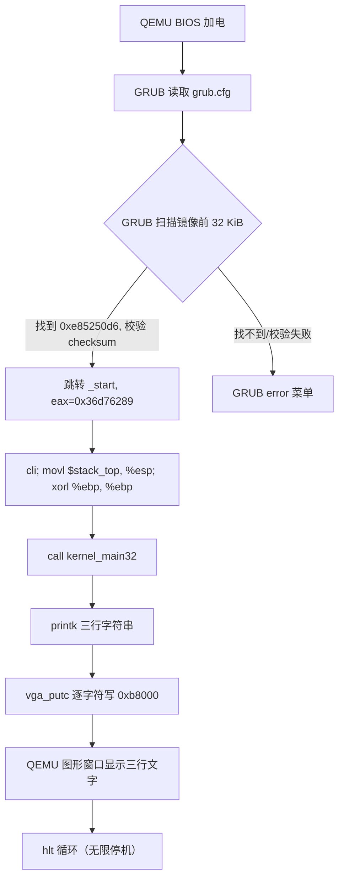

# Lesson 01: 从 GRUB 启动并在 VGA 显示 TinyOS — 精讲文档

> **课号**：Lesson 01（可执行课）
> **本课主题**：让 GRUB 按 Multiboot2 规范装载内核，由教学内核直接写 VGA text buffer，在 QEMU 图形窗口显示 TinyOS 的第一批文字。
> **课程主线位置**：第一阶段「启动链与基础输出」（Lesson 00 → 01 → 02 → … → 07）的第 1 个可执行内核课；之前是文档课 Lesson 00 与 GRUB 源码研读支线 0.1–0.10。
> **前置课程**：[`../lesson-00-stable/README.md`](../lesson-00-stable/README.md)、[`../lesson-0.10-stable/README.md`](../lesson-0.10-stable/README.md)
> **后续课程**：[`../lesson-02-stable/README.md`](../lesson-02-stable/README.md)
> **本课一句话目标**：写出不依赖任何 libc 的最小 Multiboot2 内核，在 VGA 文本模式屏幕显示三行 TinyOS 问候语。

## 1. 课程定位（Mission）

- **一句话目标**：学完本课你能从零写出一套「Multiboot2 header + 32 位入口 + 无 libc 的 VGA 输出」最小内核，并在 QEMU 图形窗口看到 `TinyOS lesson 1` 等三行文字。
- **课程主线中的位置**：属于第一阶段「启动链与基础输出」的第一个可执行内核课。前身是文档课 Lesson 00（加电 → BIOS → GRUB → Multiboot2 → 保护模式交接的总览）与 GRUB 源码研读支线 0.1–0.10。本课把这些背景知识固化成可运行代码；后续 Lesson 02–07 全部在本课的启动链上叠加功能（VGA 控制台、键盘、shell、内存图、页分配器、分页、long mode）。
- **前置知识清单**：
  1. 保护模式与实模式、段寄存器、`eip`/`esp` 的基本概念（Lesson 00）；
  2. Multiboot2 header 的 magic 值、arch 字段、checksum 计算方式（0.5–0.6）；
  3. GRUB 启动菜单与 `multiboot2` 命令的写法（0.8）；
  4. C 指针、位运算（`<<`、`|`）、ASCII 字符编码；
  5. AT&T 汇编语法与 Makefile 基本规则（`gcc -m32` 交叉编译的目的）。
- **本课交付（可见结果）**：QEMU 图形窗口显示三行 VGA 文字：
  `TinyOS lesson 1`、`Hello from the VGA text console!`、`Multiboot2 boot succeeded.`，之后内核停在 `hlt` 循环。

## 2. 核心概念精讲

### 2.1 Multiboot2 启动协议

**定义**：Multiboot2 是 GNU GRUB 采用的开放启动协议（规范由 GNU 维护）。内核把自己的配置信息放在镜像开头的 Multiboot2 header 中，GRUB 解析该 header 后把内核装载到内存，再按约定转入内核入口。

**为什么需要（动机）**：在没有任何自举手段的前提下，内核必须先告诉 bootloader「我是谁、在哪、以什么方式接管」。直接写 BIOS 中断的程序要处理各种硬件差异；借助 GRUB，内核只需要满足 header 布局约定，就能拿到「已被装载、CPU 已进入 32 位保护模式」的干净起点。

**工作机制**：
- header 必须在镜像**最初 32768 字节（32 KiB）内**，且按 **8 字节对齐**；
- header 首个字段是 magic 值 `0xe85250d6`，GRUB 通过它识别「这是 Multiboot2 内核」；
- `architecture = 0` 表示「i386 32 位保护模式交接」；
- `header_length` 与 `checksum` 共同校验 header 自身完整性：`checksum + magic + architecture + header_length == 0`；
- GRUB 跳入入口时，`%eax = 0x36d76289`（Multiboot2 引导 magic），`%ebx = Multiboot2 info 结构物理地址`。本课不用这两个寄存器，但 Lesson 05 会正式接收它们。

```text
镜像文件（kernel.elf）
┌──────────────────────────────┐
│  .multiboot 段（前 32 KiB 内）│  ← GRUB 在这里找到 0xe85250d6
│  .text 段（_start 入口）      │  ← GRUB 跳转到 _start（%eax/%ebx 传交接信息）
│  .rodata / .data / .bss      │
└──────────────────────────────┘
```

### 2.2 VGA 文本模式（legacy VGA text mode）

**定义**：x86 体系里一块从物理地址 `0xb8000` 开始、映射在内存中的 VGA 文本显存。每个屏幕单元（cell）占用 2 字节：低 8 位是 ASCII 字符，高 8 位是颜色属性。标准文本模式是 80 列 × 25 行，一屏共 2000 个单元、4000 字节。

**为什么需要（动机）**：它是「写内存就能出文字」的最小输出设备，不需要初始化任何控制器，非常适合作为第一课的可观察输出。现代 Linux 的显示栈（DRM/KMS、framebuffer、VT、字体、滚屏）远比它复杂，但教学模型刻意先选这条最短路。

**工作机制**：

```text
bit 15                     bit 8 bit 7                    bit 0
┌──────────────────────────────┬──────────────────────────────┐
│ 属性：0x0f（亮白前景/黑背景） │ ASCII 字符                    │
└──────────────────────────────┴──────────────────────────────┘
        每个单元 2 字节，第 N 个单元地址 = 0xb8000 + N * 2
```

行跨距是 160 字节（80 单元 × 2），所以第 1 行从 `0xb8000` 开始、第 2 行从 `0xb8000 + 160` 开始，以此类推。本课只把字符写进 buffer，不做光标硬件控制、不做滚屏。

### 2.3 无 libc 的 freestanding 环境

**定义**：内核运行在没有任何操作系统托管的裸机上，因此不能依赖 `printf`、`malloc`、`memcpy` 等标准库函数，也不能假定标准启动代码（crt0）存在。编译器用 `-ffreestanding` 告知「这里没有宿主库」，代码里所有工具函数必须自己写。

**为什么需要（动机）**：链接器脚本的入口是 `_start`，函数名、地址、段布局全部由我们自己掌控；`printk` 在这里只是「逐字符写 VGA buffer」的薄封装，而不是 glibc 的格式化版本。这样每个字节都可见、可调试。

## 3. 源码精讲

### 3.1 文件清单与职责

| 文件 | 职责 | 本课增量（相对上一课） |
|---|---|---|
| `boot.S` | Multiboot2 header、`_start` 入口、16 KiB 临时栈 | 本课新建（重启后第一课，无上一课代码） |
| `kernel.c` | 无 libc 的 VGA `printk` 与 `kernel_main32` 主函数 | 本课新建 |
| `linker.ld` | 镜像段布局：`ENTRY(_start)`、`.multiboot` 保留、`. = 1M` | 本课新建 |
| `Makefile` | 编译/链接/ISO 制作/check/run/clean | 本课新建 |
| `grub.cfg` | GRUB 菜单项，用 `multiboot2` 命令装载内核 | 本课新建 |

### 3.2 boot.S — 启动入口精讲

#### 3.2.1 常量与 header 结构

```asm
.set MB2_HEADER_MAGIC,       0xe85250d6
.set MB2_ARCHITECTURE_I386,  0
.set MB2_HEADER_LENGTH,      mb2_header_end - mb2_header
.set MB2_CHECKSUM,           -(MB2_HEADER_MAGIC + MB2_ARCHITECTURE_I386 + MB2_HEADER_LENGTH)
```
- 第 1 行：Multiboot2 规范规定的 magic 值 `0xe85250d6`，GRUB 凭它在镜像前 32 KiB 内识别本内核。
- 第 2 行：`0` 表示 i386 32 位保护模式交接（本课还不需要 64 位 ABI）。
- 第 3 行：header 总长度由两个标签相减得到（汇编器在汇编时算出常量），保证长度恒等于 header 实际字节数。
- 第 4 行：checksum 取三者之和的相反数，使 `magic + arch + length + checksum == 0`，这是 Multiboot2 规范的校验公式。

```asm
.section .multiboot, "a"
.align 8
mb2_header:
	.long MB2_HEADER_MAGIC
	.long MB2_ARCHITECTURE_I386
	.long MB2_HEADER_LENGTH
	.long MB2_CHECKSUM
	.short 0
	.short 0
	.long 8
mb2_header_end:
```
- `.section .multiboot, "a"`：开辟独立节，`"a"` 标记为 allocatable（需要装载进内存）。独立成节是为了让链接脚本用 `KEEP()` 精准保留它。
- `.align 8`：满足 Multiboot2 的 8 字节对齐要求。**对齐必须写在节内**，否则链接器重排后可能破坏。
- 前 4 个 `.long`：magic / architecture / header_length / checksum，共 16 字节。
- 后面 `.short 0 .short 0 .long 8` 是 **end tag**：type=0（end）、flags=0、size=8。它让 header 总长度正好 24 字节，`header_length` 用标签差自动得到这个值。header 必须至少以 end tag 收尾，GRUB 才会认为 header 结构完整。

#### 3.2.2 _start 入口

```asm
.section .text
.code32
.globl _start
.type _start, @function
.extern kernel_main32
_start:
	/* Linux v6.12/arch/x86/kernel/head_64.S:119 的受控入口原则。 */
	cli
	movl $stack_top, %esp
	xorl %ebp, %ebp
	call kernel_main32
1:
	hlt
	jmp 1b
.size _start, . - _start
```
- `.code32`：显式声明 32 位指令编码。虽然 `gcc -m32` 已把汇编目标定为 32 位，双保险能防止未来课程在 `.code64` 上下文中复用本文件时出错。
- `cli`：关闭中断。GRUB 虽已保证入口处 IF 标志通常已清，但显式 `cli` 把「无中断」变成受控入口的明确不变式（对照 Linux `head_64.S` 早期入口原则）。
- `movl $stack_top, %esp`：把栈指针指向 `.bss` 段里 16 KiB 栈的顶端。**进入 C 之前必须有有效栈**，否则第一次 `call`/函数调用就会写坏内存。
- `xorl %ebp, %ebp`：`%ebp = 0`。既为 `kernel_main32` 建立干净的帧指针链（深度回溯/调试工具可辨认栈底），也为后续 long mode 切换时 `%ebp` 传递「0 表示无旧帧」做铺垫。
- `call kernel_main32`：压入返回地址并转入 C 主函数；返回后落到下面的停机循环。
- `1: hlt / jmp 1b`：`hlt` 让 CPU 暂停直到中断到来；由于 IF 已清、无中断源，CPU 会一直停在这里，`jmp 1b` 是防止将来出现 NMI 等意外唤醒后死循环重试。内核「输出完就停」是本课的终止设计。

#### 3.2.3 临时栈

```asm
.section .bss
.align 16
stack_bottom:
.skip 16384
stack_top:
```
- `.bss` 段不占镜像文件空间，只在装载时被清零并分配内存，栈内容无需持久化，放这里最省空间。
- `stack_bottom` 是栈底（低地址），`stack_top` 是栈顶（高地址），栈向下增长，所以 `%esp` 指向 `stack_top`。16 KiB 对本课两层调用绰绰有余。
- `.align 16` 保证栈顶 16 字节对齐，满足 GCC 32 位 ABI 对 `%esp` 对齐的要求。

### 3.3 kernel.c — VGA 输出精讲

#### 3.3.1 常量与全局状态

```c
#define VGA_TEXT_BUFFER ((volatile unsigned short *)0xb8000)
#define VGA_COLUMNS     80
#define VGA_ATTRIBUTE   0x0f

static unsigned short cursor;
```
- `VGA_TEXT_BUFFER`：把 `0xb8000` 映射成 `volatile unsigned short *` 指针。**`volatile` 必不可少**——VGA 显存是内存映射 I/O，值会被显卡实时改写/消费，编译器若把连续写入优化合并，就会漏字符。
- `VGA_COLUMNS`：每行 80 个字符单元。
- `VGA_ATTRIBUTE`：`0x0f` = 亮白前景（`0xf`）+ 黑色背景（`0x0`），即白字黑底。
- `cursor`：静态全局，记录下一个字符要写的位置（以单元为单位，0 表示左上角）。它是「屏幕上的隐性光标」，本课不写硬件光标寄存器。

#### 3.3.2 vga_putc — 逐字符输出

```c
static void vga_putc(char c)
{
    if (c == '\n') {
        cursor += VGA_COLUMNS - cursor % VGA_COLUMNS;
        return;
    }

    VGA_TEXT_BUFFER[cursor++] = ((unsigned short)VGA_ATTRIBUTE << 8) |
                              (unsigned char)c;
}
```
- **签名与职责**：`static void vga_putc(char c)`，接收一个字符，把它的可见形式写到屏幕并推进光标；只处理普通字符和 `\n`。
- **算法步骤**：(1) 若是 `\n`，把 `cursor` 推进到下一行行首（见下）；(2) 否则把 `(属性 << 8) | 字符` 写进 `VGA_TEXT_BUFFER[cursor]`，再 `cursor++`。
- **`\n` 行首计算**：`cursor += VGA_COLUMNS - cursor % VGA_COLUMNS`。`cursor % 80` 是当前行内列号，`80 - 列号` 是到本行末尾还要前进多少单元，加完正好落在下一行第 0 列。这是「只换行不滚屏」的最小实现。
- **属性与字符的位组合**：`(unsigned short)VGA_ATTRIBUTE << 8` 把 `0x0f` 抬到高 8 位，`| (unsigned char)c` 把 ASCII 放低 8 位，两段拼成一个 16 位 cell，正好匹配 2.2 的单元布局。
- **边界与错误处理**：本课刻意不处理 `\r`、退格、制表符；若一直输出导致 `cursor` 超过 2000（第 25 行之后），新字符会写到显存 0xb8000 之外的区域而不显示——**没有滚屏**。这是留给 Lesson 02 的明确缺口，教学上先让「越界行为」可见。

#### 3.3.3 printk — 教学级字符串输出

```c
/* 教学级 printk：后续课程会增加定位、清屏和滚屏。 */
static void printk(const char *text)
{
    while (*text != '\0')
        vga_putc(*text++);
}
```
- **签名与职责**：`static void printk(const char *text)`，输出一个以 `\0` 结尾的字符串，不自带换行（调用方在字符串里写 `\n`）。
- **算法**：循环读取 `*text`，非 `\0` 就交给 `vga_putc` 处理并前进指针。它等价于「字符串的每字节都是 vga_putc 的一个输入」。
- **为什么这样设计**：真实 `printf` 要做格式解析、变参、整数转字符串，本课只需固定文本；名字沿用 `printk` 是向 Linux 内核日志函数致敬，但签名刻意简化为 `const char *`，不承诺格式化能力，注释里也明确「后续课程会增加定位、清屏和滚屏」。

#### 3.3.4 kernel_main32 — 入口主函数

```c
void kernel_main32(void)
{
    printk("TinyOS lesson 1\n");
    printk("Hello from the VGA text console!\n");
    printk("Multiboot2 boot succeeded.\n");
}
```
- **签名与职责**：`void kernel_main32(void)`，C 层入口。注意它**没有参数**——Multiboot2 通过 `%eax`/`%ebx` 传递的交接信息（magic 与 MBI 地址）本课完全忽略；Lesson 05 会把签名改成 `(u32 magic, u32 mbi_address)` 并让 boot.S 用 `pushl %ebx; pushl %eax` 传参。
- **算法**：按顺序输出三行字符串，每行以 `\n` 结尾。三行正好铺满屏幕左上角，构成可肉眼核验的「三段式」验证目标。
- **边界**：三行总长分别为 14、33、29 个字符，都在单行 80 列之内，不会触发行尾回绕，输出完全确定。

### 3.4 linker.ld — 链接脚本精讲

```ld
/* 参考 Linux v6.12/arch/x86/kernel/vmlinux.lds.S：显式控制镜像段布局。
 * Multiboot2 header 必须在镜像最初 32768 字节内，且按 8 字节对齐。
 */
ENTRY(_start)

SECTIONS
{
	. = 1M;

	.multiboot ALIGN(8) : {
		KEEP(*(.multiboot))
	}

	.text ALIGN(16) : { *(.text .text.*) }
	.rodata ALIGN(16) : { *(.rodata .rodata.*) }

	/* 把可写段移到新页，避免生成 RWX 的 PT_LOAD 段。 */
	. = ALIGN(CONSTANT(MAXPAGESIZE));
	.data ALIGN(16) : { *(.data .data.*) }
	.bss ALIGN(16) : {
		*(.bss .bss.*)
		*(COMMON)
	}
}
```
- `ENTRY(_start)`：告诉链接器/GRUB 入口符号是 `_start`，也决定 ELF `e_entry` 字段。
- `. = 1M`：内核装载地址从 1 MiB 开始。这是传统「内核起点」约定，避开低于 1 MiB 的实模式/BIOS 区域与 GRUB 自身占用区。
- `.multiboot ALIGN(8)` + `KEEP(*(.multiboot))`：把 boot.S 的 `.multiboot` 节放在镜像最前面（`1M` 起始处，天然满足 32 KiB 内限制），`KEEP()` 阻止链接器以「未被引用」为由丢弃它——这是 Multiboot2 header 能被 GRUB 找到的关键。
- `.text`/`.rodata` 按 16 字节对齐；`*(.text .text.*)` 覆盖同名节及其子节。
- `. = ALIGN(CONSTANT(MAXPAGESIZE))`：把可写段推到**新的对齐页**，避免只读段与可写段合并成一个同时带 R、W、X 权限的 `PT_LOAD` 段（RWX 段既不符合安全惯例，也会让加载器行为不一致）。
- `.bss` 里同时收集 `*(COMMON)`，保证编译器生成的 common 符号（如未初始化全局）也进入 BSS 而非数据段。

### 3.5 构建管线（Makefile / grub.cfg）

#### 3.5.1 Makefile 目标逐一解读

| 目标 | 命令要点 | 作用 |
|---|---|---|
| `all` | 依赖 `$(BUILD)/kernel.iso` | 默认目标，产出可启动 ISO |
| `$(BUILD)/boot.o` | `$(CC) $(CFLAGS) -c boot.S` | 汇编 boot.S（gcc 驱动 as，`.set`/标签全在汇编期解析） |
| `$(BUILD)/kernel.o` | `$(CC) $(CFLAGS) -c kernel.c` | 编译 C 源文件 |
| `$(BUILD)/kernel.elf` | `$(LD) $(LDFLAGS) -o kernel.elf boot.o kernel.o` | 按 `linker.ld` 链接出 ELF |
| `$(BUILD)/kernel.iso` | `grub-mkrescue -o kernel.iso $(ISO_ROOT)` | 把 ELF + grub.cfg 打成 GRUB 启动光盘镜像 |
| `check` | `grub-file --is-x86-multiboot2 kernel.elf` | 静态验证 header 符合 Multiboot2，通过后打印 `Multiboot2 header check passed.` |
| `run` | `qemu-system-x86_64 -accel tcg -boot order=d -cdrom kernel.iso -serial stdio -no-reboot -no-shutdown` | 启动 QEMU 图形窗口运行 ISO |
| `clean` | `rm -rf $(BUILD)` | 清空构建产物 |

**关键编译/链接标志**：
- `-m32`：生成 32 位代码；`-m elf_i386`：以 i386 ELF 格式链接。两者配套，保证本课「32 位保护模式」形态一致。
- `-ffreestanding`：声明无宿主环境，编译器不引入 `main`/libc 假设。
- `-fno-pie`：禁用位置无关可执行，保证符号地址是固定绝对地址（内核需要知道自己在哪）。
- `-fno-stack-protector`：不插 canary，因为裸机没有 libc 支持（且我们不调用任何外部函数）。
- `-fno-asynchronous-unwind-tables`：不生成 `.eh_frame` 展开表，缩小 ELF。
- `-Wall -Wextra -Werror`：所有警告视为错误，保证源码无告警即可构建。

#### 3.5.2 grub.cfg

```cfg
set timeout=0
set default=0

menuentry "TinyOS lesson 1" {
    multiboot2 /boot/kernel.elf
    boot
}
```
- `timeout=0` / `default=0`：启动菜单不等待、直接选第 0 项，便于自动化验证。
- `menuentry`：菜单项名 `TinyOS lesson 1`。
- `multiboot2 /boot/kernel.elf`：用 Multiboot2 协议装载 ISO 里 `/boot/kernel.elf`；`boot` 命令把控制权交给内核。GRUB 会检查 kernel.elf 的 header，跳转时按 2.1 约定设置寄存器。

### 3.6 主控制流



## 4. 数据流与运行逻辑

启动 → 显示的最小路径：

1. `make run` 让 QEMU 从光盘引导，BIOS 找 GRUB；
2. GRUB 读 `grub.cfg`，执行 `multiboot2 /boot/kernel.elf`，在 kernel.elf 前 32 KiB 内找到 `.multiboot` header（magic `0xe85250d6`），校验 checksum 通过；
3. GRUB 把控制权交给 `_start`（`%eax = 0x36d76289`，本课忽略），`cli` 后建立 16 KiB 栈并调用 `kernel_main32`；
4. `kernel_main32` 依次调用 `printk` 三次；
5. 每个 `printk` 把字符串逐字节交给 `vga_putc`；普通字符写成 `(0x0f << 8) | char` 的 16 位 cell 放入 `VGA_TEXT_BUFFER[cursor]`，`\n` 让 `cursor` 跳到下一行行首；
6. 三行 cell 落到物理显存 `0xb8000` 起 4000 字节内，QEMU 把它渲染到图形窗口；
7. `kernel_main32` 返回 `_start`，执行 `hlt; jmp` 无限停机。

具体对应关系：`kernel.c` 第 32–34 行的三个字符串 → 屏幕上第 0、1、2 行的内容；`vga_putc` 的 `\n` 分支 → 第 0 行末尾跳到第 1 行行首。

## 5. 构建、运行与验证

### 5.1 依赖

Ubuntu/Debian 需要：`build-essential gcc-multilib grub-pc-bin xorriso mtools qemu-system-x86`。`gcc-multilib` 提供 32 位库支持（虽然本课不链接 libc，但 `-m32` 需要 32 位工具链存在）。

### 5.2 构建与静态检查

```bash
make clean && make -j"$(nproc)"
make check
```

- 预期：`gcc -m32`、`ld -m elf_i386`、`grub-mkrescue` 均无警告完成（`-Werror` 保证有警告即失败）；
- `make check` 预期输出（来自 Makefile 第 37 行，逐字抄录）：

```text
Multiboot2 header check passed.
```

### 5.3 运行与画面验证

```bash
make run
```

**成功画面在 QEMU 图形窗口，勿加 `-display none`**。窗口应显示三行文字：

```text
TinyOS lesson 1
Hello from the VGA text console!
Multiboot2 boot succeeded.
```

（三行字符串逐字抄录自 `kernel.c` 第 32–34 行的 `printk` 参数。）输出完成后内核进入 `hlt` 循环，用窗口关闭按钮或 `Ctrl-a x` 退出 QEMU。`make run` 里 `-serial stdio` 只是保留串口通道，本课并不在串口输出任何东西——文字来自 VGA 窗口这一事实本身就是验证点。

### 5.4 自动化 GUI 验收

仓库提供 [`scripts/qemu-vga-check.sh`](../../scripts/qemu-vga-check.sh)，它用 QEMU monitor 抓取物理 VGA 显存并逐字符核验；GUI 主线（Lesson 61–67）必须走该脚本专项流程，本课也允许用它辅助验证三行字符的存在。

### 5.5 实际验证记录（保留自旧 README）

> **本次实际验证记录（2026-07-31）**：已执行 `make clean && make -j$(nproc)`，`gcc -m32`、`ld -m elf_i386` 和 `grub-mkrescue` 无警告完成。`make check` 输出 `Multiboot2 header check passed.`。随后以 QEMU 正常 VGA 显示启动 ISO，通过 monitor `screendump` 捕获画面；截图为 720×400，逐个核验三行中全部非空字符的 VGA glyph 均已出现。该图形验证没有使用 `-display none`，证明文字来自 VGA 窗口而非串口。内核按设计在输出后进入 `hlt` 循环。

## 6. 调试地图

| 现象 | 首先对照的来源 | 基于来源的检查 |
|---|---|---|
| `grub-file` 失败或 GRUB 说没有 header | `arch/x86/boot/header.S` 的启动镜像布局背景 | 检查 `.multiboot` 是否 `ALIGN(8)`、`KEEP()` 是否保留它、header 是否仍在镜像前 32 KiB（链接后 `readelf -S kernel.elf` 看节偏移）。 |
| 调用 C 后卡死或重启 | `head_64.S:119` 的受控早期入口原则 | 检查 `_start` 是否先 `cli`，是否先把 `%esp` 指向有效的 `.bss` 临时栈（`stack_top` 是否在 `.bss` 内）。 |
| QEMU 能启动但窗口无 TinyOS 文本 | VGA 文本单元布局；现代 Linux video stack 的复杂性边界 | 检查写入地址是否为 `0xb8000`，每个 cell 是否同时写字符和属性，运行命令是否错误地加入 `-display none`。 |
| 字符横向错位或颜色异常 | VGA 80×25 文本单元布局 | 检查 `cursor` 以字符单元为单位递增，属性必须位于高 8 位（`VGA_ATTRIBUTE << 8`）。 |
| 换行位置不对 | 本课 `vga_putc()` 的行尾计算 | `cursor += VGA_COLUMNS - cursor % VGA_COLUMNS` 只前进到下一行首；本课尚不滚屏。 |
| 编译报错提示 32 位工具链缺失 | 构建管线 | 确认已安装 `gcc-multilib`；`-m32` 与 `-m elf_i386` 必须成对出现。 |
| 想在本课提前进入 long mode | `head_64.S` 的分阶段启动设计 | 保持本课为可见启动最小阶段；long mode 需要 GDT、页表和有序 CR/MSR 状态转换，应独立讲解和验证。 |

## 7. 与 Linux 源码对照

- **启动镜像布局**：TinyOS 用 `linker.ld` + `boot.S` 显式排布 header 与段；Linux 在 `arch/x86/boot/header.S` 里用 `#define BOOT_LOADER_SIG`、setup header 魔数（`0xAA55`/`0x53726448`）等字段描述 boot protocol。共同点：bootloader 都要在镜像头部约定位置读 magic 与偏移。教学模型简化了 setup header 的全部实模式启动代码，因为 GRUB 替我们完成了 BIOS 阶段。
- **早期入口受控原则**：TinyOS `_start` 先 `cli` 再建栈；Linux `arch/x86/kernel/head_64.S:119` 同样在早期入口保持中断关闭、先建立可控执行环境（`startup_64` 中 `cld`/`lgdt`/栈设置都在开启任何中断之前）。
- **VGA 输出 vs Linux 显示栈**：TinyOS 直接写 `0xb8000`；Linux 的 runtime console 涉及 framebuffer、DRM/KMS、VT、字体与滚屏，见 Linux x86 boot video/console 相关源码。教学模型刻意选择 legacy VGA text mode 作为最小可观察设备，并明确不准备复刻现代 Linux 显示栈。
- **权威来源**：Intel SDM（内存映射 I/O 与 `volatile` 语义、`0xb8000` 文本显存）、Multiboot2 规范（header 字段、32 KiB/8 字节限制、checksum 公式）、GNU GRUB（`grub-file --is-x86-multiboot2`、`grub-mkrescue`）。Linux 源码仅作工程对照，不是本课接口的权威定义。

## 8. 思考题与练习

1. **概念理解**：Multiboot2 的 checksum 公式为什么是 `-(magic + arch + length)` 而不是别的形式？如果把 header 放到镜像的第 40 KiB 处，GRUB 会怎样反应？
2. **源码定位**：在 `kernel.c` 中，如果把 `VGA_ATTRIBUTE << 8` 改成 `VGA_ATTRIBUTE`（不左移），屏幕上会出现什么现象？为什么？
3. **动手实验**：在 `kernel_main32` 里再加一行 `printk("...")`，使输出超过 25 行，观察第 25 行之后的字符发生了什么（提示：本课没有滚屏）。
4. **动手实验**：把 `boot.S` 中 `movl $stack_top, %esp` 注释掉再构建运行，观察现象，并用 `-Werror` 之外的调试手段定位原因。
5. **Linux 对照**：阅读 `linux-v6.12/arch/x86/boot/header.S`，比较 Linux setup header 的魔数发现机制与 Multiboot2 header 的发现机制有何异同。

## 9. 本课小结与下一课预告

- 本课从零写出了第一个可运行内核：`boot.S` 提供 Multiboot2 header 与 `_start` 入口，`kernel.c` 提供无 libc 的 VGA `printk`，`linker.ld`/`Makefile`/`grub.cfg` 组成可验证的构建管线。
- 理解了 Multiboot2 header 的 magic/arch/length/checksum 四字段与 32 KiB、8 字节对齐约束。
- 理解了 VGA text mode 的 16 位单元结构（低 8 位 ASCII、高 8 位属性）与 `0xb8000` 物理地址。
- 理解了 `volatile` 对内存映射 I/O 的重要性，以及 `cli`、栈初始化、帧指针清零组成的受控启动序列。
- 明确了本课的简化边界：没有定位、没有清屏、没有滚屏、忽略 Multiboot2 交接参数、停留 32 位保护模式。
- 下一课 [**Lesson 02**](../lesson-02-stable/README.md) 将把 `vga_putc` 升级为完整的 VGA 控制台：清屏、定位（`set_cursor`/`gotoxy`）、换行与滚屏，在本课启动链不变的前提下补齐输出基础设施。
