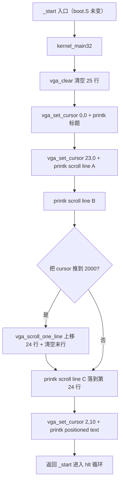

# Lesson 02: VGA 控制台：清屏、定位、换行、滚屏 — 精讲文档

> **课号**：Lesson 02（可执行课）
> **本课主题**：不改变第一课已验证的 GRUB → Multiboot2 → 32 位 C 入口链，把无边界的 `vga_putc()` 升级为有边界的 80×25 VGA 文本控制台：清屏、软件定位、换行、自动折行、底部滚屏。
> **课程主线位置**：第一阶段「启动链与基础输出」（Lesson 00 → 01 → 02 → … → 07）的第 2 个可执行内核课，VGA 输出基础设施由本课补齐，供后续键盘/shell 复用。
> **前置课程**：[`../lesson-01-stable/README.md`](../lesson-01-stable/README.md)
> **后续课程**：[`../lesson-03-stable/README.md`](../lesson-03-stable/README.md)
> **本课一句话目标**：学完本课你能用清屏、`vga_set_cursor` 定位、换行与滚屏四条原语，在 QEMU 图形窗口还原出一个「先滚动、再定位打印」的确定性演示画面。

## 1. 课程定位（Mission）

- **一句话目标**：学完本课你能理解 80×25 VGA 文本控制台的「cell 下标 + 行跨距」模型，并实现清屏、软件光标定位、行尾折行与最后一行滚屏四个互不依赖的原语。
- **课程主线中的位置**：第一课的 `printk` 只会往屏幕右上角写、不会滚屏、没有边界检查；本课在**同一启动链上零改动**（`boot.S`/`linker.ld`/`Makefile`/`grub.cfg` 与第一课完全相同），只重写 `kernel.c`，把输出设施变成「可被任何后续功能调用的控制台」。Lesson 03（键盘回显）、Lesson 04（shell）将直接站在这个控制台之上。
- **前置知识清单**：
  1. Lesson 01 的 Multiboot2 header、`_start` 入口、`0xb8000` 16 位 cell 布局（属性高 8 位 + ASCII 低 8 位）；
  2. 行跨距概念：80 列 × 2 字节 = 160 字节，行内第 N 个 cell 地址 = 行首 + N×2；
  3. `static` 函数与文件内全局变量 `cursor` 的作用域；
  4. 位移/位或运算组合 `(attr << 8) | char`；
  5. 数组下标越界的后果（本课用 clamp 与滚屏来避免越界写显存）。
- **本课交付（可见结果）**：QEMU 窗口最终显示 `positioned text`（第 2 行第 10 列）、`scroll line A/B/C`（第 22/23/24 行），第 0 行空白——一次画面同时证明清屏、定位、换行与滚屏。

## 2. 核心概念精讲

### 2.1 从「无边界 cursor」到「80×25 有界控制台」

**定义**：本课把屏幕建模为 `cursor ∈ [0, VGA_CELLS)` 的一维 cell 下标空间，其中 `VGA_CELLS = 80 × 25 = 2000`，下标与行列的关系是 `cursor = row * VGA_COLUMNS + column`。

**为什么需要（动机）**：第一课 `vga_putc` 对 `cursor` 完全没有上界约束，连续输出超过 2000 个单元后字符会写到 `0xb8000 + 4000` 之外（不可见，甚至越界写内存）。控制台必须给出确定性的越界响应：行尾自动折行、第 25 行之后再写就滚屏。

**工作机制**：

```text
row 0:  cursor 0      ... cursor 79
row 1:  cursor 80     ... cursor 159
...
row 24: cursor 1920   ... cursor 1999

cursor = row * VGA_COLUMNS + column
```

所有原语都围绕这个一维下标工作：定位即「算出下标并写入 `cursor`」；换行即「推进到下一行行首」；滚屏即「把下标 80..1999 的内容搬到 0..1919，再清空最后一行」。

### 2.2 滚屏的两种触发点（自动折行 + 换行越界）

**定义**：本课的 `vga_scroll_one_line()` 有两个调用者：`vga_putc()`（普通字符写完后若 `cursor >= VGA_CELLS`）与 `vga_newline()`（`\n` 把光标推出最后一行时）。

**为什么需要（动机）**：`\n` 会跳行，普通字符也能在最后一行的最后一个 cell 写完后自然越界。两处都必须检查边界，否则「最后一行写满」时会发生越界写或内容损坏。

**滚屏算法**：

```text
滚动前                         滚动后
row 0   [旧内容 0]              row 0   [旧内容 1]
row 1   [旧内容 1]      ───►    ...
...                              row 23  [旧内容 24]
row 24  [旧内容 24]             row 24  [空白，继续输出]
```

复制方向是**从低下标往高下标读取**（`dst = src + 80`），保证覆盖安全；复制范围是 `[0, VGA_CELLS - VGA_COLUMNS)`，正好 24 行，最后一行单独清空。

### 2.3 软件光标 vs 硬件 CRTC 光标

**定义**：本课 `cursor` 只是一个 `static unsigned short` 软件变量，只决定「下一个字符写到哪里」；它不控制 VGA 硬件的光标闪烁位置。硬件光标在 CRTC 端口（本课不动端口 I/O）。

**为什么需要（动机）**：`vga_set_cursor()` 只维护写入位置，代价是 QEMU 画面上没有可见的插入光标——但这让「定位」与「硬件光标编程」两个概念解耦，先解决逻辑输出位置，硬件光标留给后续课程（对照 Linux `vgacon.c:vga_con_cursor()` 的真实 CRTC 路径）。

## 3. 源码精讲

### 3.1 文件清单与职责

| 文件 | 职责 | 本课增量（相对上一课） |
|---|---|---|
| `boot.S` | Multiboot2 header、`_start` 入口、16 KiB 临时栈 | 未变化 |
| `kernel.c` | 80×25 VGA 控制台原语 + 演示主流程 | **唯一增量**：新增 3 个宏、6 个函数，重写 `vga_putc`/`kernel_main32` |
| `linker.ld` | 镜像段布局、`.multiboot` 保留、`. = 1M` | 未变化 |
| `Makefile` | 编译/链接/ISO/check/run/clean | 未变化 |
| `grub.cfg` | GRUB `multiboot2` 菜单项 | 未变化 |

### 3.2 kernel.c — 控制台原语精讲

#### 3.2.1 宏与全局状态

```c
#define VGA_TEXT_BUFFER ((volatile unsigned short *)0xb8000)
#define VGA_COLUMNS     80
#define VGA_ROWS        25
#define VGA_CELLS       (VGA_COLUMNS * VGA_ROWS)
#define VGA_ATTRIBUTE   0x0f

static unsigned short cursor;
```
- `VGA_TEXT_BUFFER`、`VGA_COLUMNS`、`VGA_ATTRIBUTE` 沿袭第一课（`volatile` 防止编译器优化掉内存映射 I/O 写入）。
- `VGA_ROWS 25`：**本课新增**，屏幕行数，与 `VGA_COLUMNS` 一起定义控制台的物理尺寸。
- `VGA_CELLS (VGA_COLUMNS * VGA_ROWS)`：**本课新增**，2000 个单元，作为所有边界检查的上限；用宏而不是魔法数字 2000，让「80×25 一屏」这个约束可读、可改。
- `cursor`：软件写入位置，取值域从第一课的「无界」收紧为本课约定 `[0, VGA_CELLS)`。

#### 3.2.2 vga_make_cell — 组成一个 cell

```c
static unsigned short vga_make_cell(char c)
{
    return ((unsigned short)VGA_ATTRIBUTE << 8) | (unsigned char)c;
}
```
- **签名与职责**：`static unsigned short vga_make_cell(char c)`，把一个字符包装成 16 位 VGA 单元（属性高 8 位 + ASCII 低 8 位）。
- **为什么抽出**：第一课把这段位运算内联在 `vga_putc` 里，本课清空一行（`vga_clear_row`）也要构造「空格 cell」，因此提取成共享原语，避免两处重复。
- **细节**：`(unsigned char)c` 保证 `c` 的符号位不会被扩展进高字节；`VGA_ATTRIBUTE << 8` 是 `int` 运算后截断回 `unsigned short`，低位 8 位恒为 0，与字符或运算正好占满 16 位。

#### 3.2.3 vga_clear_row — 清空一行

```c
static void vga_clear_row(unsigned short row)
{
    unsigned short column;
    unsigned short start = row * VGA_COLUMNS;

    for (column = 0; column < VGA_COLUMNS; column++)
        VGA_TEXT_BUFFER[start + column] = vga_make_cell(' ');
}
```
- **签名与职责**：`static void vga_clear_row(unsigned short row)`，把第 `row` 行的 80 个 cell 全部写成空格 cell。
- **算法**：`start = row * VGA_COLUMNS` 求行首下标，然后循环 `column = 0..79` 逐 cell 写 `vga_make_cell(' ')`。
- **边界**：调用方保证 `row < 25`（本课所有调用点的行号都是常量或由滚屏固定传入 `VGA_ROWS - 1`）；显式循环而非 `memset`，是 freestanding 约束下的刻意选择。
- **为什么是空格**：空格 cell 含属性 `0x0f`，清屏后新输出与空白区域的属性一致，避免「清屏后残留黑块」的观感问题。

#### 3.2.4 vga_scroll_one_line — 上滚一行

```c
static void vga_scroll_one_line(void)
{
    unsigned short cell;

    for (cell = 0; cell < VGA_CELLS - VGA_COLUMNS; cell++)
        VGA_TEXT_BUFFER[cell] = VGA_TEXT_BUFFER[cell + VGA_COLUMNS];

    vga_clear_row(VGA_ROWS - 1);
    cursor = (VGA_ROWS - 1) * VGA_COLUMNS;
}
```
- **签名与职责**：`static void vga_scroll_one_line(void)`，把第 1..24 行内容上移到第 0..23 行，清空第 24 行，并把 `cursor` 放到最后一行行首。
- **算法步骤**：(1) `for cell = 0; cell < VGA_CELLS - VGA_COLUMNS; cell++`（即 `cell < 1920`，覆盖 24 行）逐个 cell 执行 `dst[cell] = src[cell + 80]`；(2) 清空第 24 行；(3) `cursor = 24 * 80 = 1920`。
- **边界安全**：因为总是「从低到高」遍历且读取的是 `cell + 80 > cell` 的旧值，不会出现「读完已经被覆盖的新值」的问题（对比 `memmove` 需要区分方向；这里的源区间整体高于目标区间，单向低到高遍历即安全）。
- **为什么搬 24 行而不是 25 行**：第 0 行被第 1 行覆盖即「滚出屏幕」，最后一行必须腾空给新内容，所以只有 24 行参与搬移、1 行清空，正好一屏。

#### 3.2.5 vga_set_cursor — 软件定位（clamp）

```c
/* 教学级软件 cursor；硬件 CRTC cursor 留给后续课程。 */
static void vga_set_cursor(unsigned short row, unsigned short column)
{
    if (row >= VGA_ROWS)
        row = VGA_ROWS - 1;
    if (column >= VGA_COLUMNS)
        column = VGA_COLUMNS - 1;

    cursor = row * VGA_COLUMNS + column;
}
```
- **签名与职责**：`static void vga_set_cursor(unsigned short row, unsigned short column)`，把 `cursor` 设为指定行列对应的 cell 下标。
- **边界处理（clamp 而非报错）**：越界行/列被钳制到最后一行的最后一个 cell（`row=24`、`column=79`）。教学内核没有用户态错误报告机制，选择「安全收敛」而不是越界写显存。
- **为什么不用硬件光标**：注释明确「硬件 CRTC cursor 留给后续课程」。只改软件变量意味着 QEMU 画面不会出现闪烁的硬件插入光标，这是刻意的简化边界。

#### 3.2.6 vga_clear — 清屏

```c
static void vga_clear(void)
{
    unsigned short row;

    for (row = 0; row < VGA_ROWS; row++)
        vga_clear_row(row);

    cursor = 0;
}
```
- **签名与职责**：`static void vga_clear(void)`，清空全部 25 行并把 `cursor` 归零。
- **算法**：复用 `vga_clear_row` 循环 25 次，然后 `cursor = 0` 让下一个字符回到左上角。
- **为什么复用**：清屏 = 25 次「清一行」，是行原语的最直接组合；两处 `for` 循环（一个按行、一个按列）各司其职，没有重复的清屏逻辑。

#### 3.2.7 vga_newline — 换行（含越界滚屏）

```c
static void vga_newline(void)
{
    cursor += VGA_COLUMNS - cursor % VGA_COLUMNS;
    if (cursor >= VGA_CELLS)
        vga_scroll_one_line();
}
```
- **签名与职责**：`static void vga_newline(void)`，把 `cursor` 推进到下一行行首，若越过第 25 行则滚屏。
- **算法步骤**：(1) `cursor % VGA_COLUMNS` 是当前列号，`VGA_COLUMNS - 列号` 是到下一行行首的步长，累加后正好落在下一行第 0 列；(2) 若新 `cursor >= 2000`，说明被推到了第 25 行（下标 2000），调用 `vga_scroll_one_line()` 让内容上移一行、`cursor` 回到第 24 行行首。
- **与第一课的区别**：第一课的 `\n` 分支只有 `cursor += 80 - cursor % 80`，越界直接丢弃；本课把越界响应变成「滚屏」，这是本课最核心的行为增量。

#### 3.2.8 vga_putc — 逐字符输出（重写）

```c
static void vga_putc(char c)
{
    if (c == '\n') {
        vga_newline();
        return;
    }

    VGA_TEXT_BUFFER[cursor++] = vga_make_cell(c);
    if (cursor >= VGA_CELLS)
        vga_scroll_one_line();
}
```
- **签名与职责**：`static void vga_putc(char c)`，输出一个字符；`\n` 交给 `vga_newline()`，普通字符写入后若越界则滚屏。
- **与第一课的三处变化**：(1) `\n` 分支从内联计算改为调用 `vga_newline()`；(2) 位组合改为调用 `vga_make_cell(c)`；(3) **新增**写完普通字符后的 `cursor >= VGA_CELLS` 检查——这是「最后一行的最后一个 cell 被写满」时的自动折行 + 滚屏。
- **为什么普通字符也要检查边界**：`\n` 能跳行，但一行写满 80 个字符、第 25 行再写第 81 个字符时 `cursor` 同样会到 2000；不检查就会越界写显存。两处触发点（`vga_putc` 与 `vga_newline`）共享同一滚屏函数，保证行为一致。

#### 3.2.9 printk 与 kernel_main32 — 演示主流程

```c
/* 教学级 printk：逐字符写入，不调用 printf 或 libc。 */
static void printk(const char *text)
{
    while (*text != '\0')
        vga_putc(*text++);
}

void kernel_main32(void)
{
    vga_clear();

    vga_set_cursor(0, 0);
    printk("TinyOS lesson 2: VGA printk\n");

    vga_set_cursor(23, 0);
    printk("scroll line A\n");
    printk("scroll line B\n");
    printk("scroll line C");

    vga_set_cursor(2, 10);
    printk("positioned text");
}
```
- `printk` 逻辑与第一课相同（逐字符 `vga_putc`），仅注释更新，因为控制台语义已全部下沉到 `vga_putc`。
- `kernel_main32` 的演示序列设计成**一次画面证明四个能力**：
  1. `vga_clear()`：清屏，屏幕全空；
  2. `vga_set_cursor(0, 0)` + 标题：证明定位与普通输出，标题在 (0,0)；
  3. `vga_set_cursor(23, 0)` 起连续三条文本：`scroll line A` 落在第 23 行；`scroll line B` 写在第 24 行，其 `\n` 把 `cursor` 推到 2000，**触发第一次滚屏**——所有内容上移一行（标题被滚出第 0 行），`A` 到第 22 行、`B` 到第 23 行，第 24 行清空；
  4. `scroll line C`（无 `\n`）：落在新第 24 行；
  5. `vga_set_cursor(2, 10)` + `positioned text`：证明任意位置定位。
- **最终可见布局**（逐行对应）：

```text
row 0   空白（标题已经被滚出屏幕）
row 1   空白
row 2   positioned text          ← 从第 10 列开始
row 3..21   空白
row 22  scroll line A
row 23  scroll line B
row 24  scroll line C
```

### 3.3 构建管线（Makefile / linker）

本课四个构建文件与第一课**逐字节相同**，因此构建管线完全沿用：

- `CFLAGS := -m32 -ffreestanding -fno-pie -fno-stack-protector -fno-asynchronous-unwind-tables -Wall -Wextra -Werror`：32 位 freestanding 编译、禁 PIE、禁 canary、禁异常展开表、警告即错误。
- `LDFLAGS := -m elf_i386 -T linker.ld -nostdlib`：i386 ELF 链接、显式脚本、无 libc。
- 目标链 `kernel.o` → `kernel.elf` → `kernel.iso`（`grub-mkrescue`）；`check` 用 `grub-file --is-x86-multiboot2` 静态验证 header；`run` 用 `qemu-system-x86_64 -accel tcg -boot order=d -cdrom ... -serial stdio -no-reboot -no-shutdown` 打开图形窗口。
- 本课**没有新增**任何编译标志、链接步骤或目标——增量只在 `kernel.c` 内部，这正是「输出设施升级不触碰启动链」的设计意图。

### 3.4 主控制流



## 4. 数据流与运行逻辑

- 启动链与第一课完全相同：GRUB 认 header → 跳 `_start` → `cli` + 临时栈 → `call kernel_main32`。
- 本课的数据流核心是**「cell 下标运算」**：每个原语都是 `cursor` 与 `VGA_COLUMNS`/`VGA_ROWS`/`VGA_CELLS` 之间的算术。
- 具体命令到画面：`vga_set_cursor(row, col)` 计算 `row*80 + col` 写入 `cursor` → `printk` 逐字符调 `vga_putc` → 普通字符以 `vga_make_cell` 写 `VGA_TEXT_BUFFER[cursor]` → `cursor` 自增 → 若 `cursor >= 2000` 滚屏。
- 滚屏时刻（可从画面验证）：`scroll line B` 的 `\n` 是唯一一次滚屏触发点，它让标题「TinyOS lesson 2: VGA printk」从第 0 行消失——这是理解本课最终画面布局的关键。

## 5. 构建、运行与验证

### 5.1 依赖

同第一课：`build-essential gcc-multilib grub-pc-bin xorriso mtools qemu-system-x86`。GUI 自动化验收另需 `socat`（脚本见 [`scripts/qemu-vga-check.sh`](../../scripts/qemu-vga-check.sh)）。

### 5.2 构建与静态检查

```bash
make clean && make -j"$(nproc)"
make check
```

- 预期：`gcc -m32`、`ld -m elf_i386`、`grub-mkrescue` 无警告完成；`make check` 输出（抄录自 Makefile）：

```text
Multiboot2 header check passed.
```

### 5.3 运行与画面验证

```bash
make run
```

**成功画面在 QEMU 图形窗口，勿加 `-display none`**。核对最终布局：

```text
第 0 行没有 "TinyOS lesson 2"，因为它已在滚动后离开屏幕。
第 2 行第 10 列开始：positioned text
第 22 行：scroll line A
第 23 行：scroll line B
第 24 行：scroll line C
```

（三行 `scroll line` 文本逐字抄录自 `kernel.c` 第 96–98 行的 `printk` 参数；`positioned text` 抄录自第 101 行。内核输出后进入 `hlt` 循环，用窗口关闭按钮或 `Ctrl-a x` 退出。）

### 5.4 实际验证记录（保留自旧 README）

> **本次实际验证记录（2026-08-01）**：已执行 `make clean && make -j$(nproc)`；`gcc -m32`、`ld -m elf_i386` 与 `grub-mkrescue` 均无警告完成。`make check` 输出 `Multiboot2 header check passed.`。随后以 QEMU 正常 VGA 显示启动 ISO，并用 monitor `screendump` 捕获 720×400 画面；按 80 列、每 cell 9×16 像素核验：`positioned text` 的全部非空 glyph 位于第 2 行第 10 列开始，`scroll line A/B/C` 分别位于第 22/23/24 行，滚动后的第 0 行为空白。该图形验证未使用 `-display none`，证明清屏、定位和单行滚屏均来自 VGA 窗口。

## 6. 调试地图

| 现象 | 首先对照的 Linux / 本课来源 | 基于来源的检查 |
|---|---|---|
| `grub-file` 失败或 GRUB 找不到 header | `arch/x86/boot/header.S`、本课 `linker.ld` | `.multiboot` 必须 `ALIGN(8)`、由 `KEEP()` 保留，并位于镜像前 32 KiB。 |
| 调用 C 后卡死或重启 | `head_64.S:119`、本课 `boot.S` | `_start` 必须先 `cli`，再把 `%esp` 放到有效临时栈。 |
| 文字乱码、颜色不对或横向错位 | `vgacon.c` 的 cell 输出职责、本课 `vga_make_cell()` | 地址必须是 `0xb8000`，一个 cell 必须同时写属性高字节与 ASCII 低字节，`cursor` 必须按 cell 而非字节递增。 |
| 清屏后仍残留旧字符 | `vgacon.c:vga_con_clear()`、本课 `vga_clear()` | 必须覆盖所有 25 行、每行 80 个 cell；清屏后 `cursor` 必须回到 0。 |
| 定位超出屏幕后出现异常位置 | `vt.c:gotoxy()`、本课 `vga_set_cursor()` | 行必须限制到 `0..24`，列必须限制到 `0..79`；本课采取 clamp，而不是访问越界 cell。 |
| 行尾第 80 个字符后覆盖下一行或越界 | `vt.c:lf()`、本课 `vga_putc()` / `vga_newline()` | 普通字符写完后也要检查 `cursor >= VGA_CELLS`；`\n` 必须前进到下一行首。 |
| 到最后一行时文字消失或屏幕内容损坏 | `vgacon.c:vga_con_scroll()`、本课 `vga_scroll_one_line()` | 复制方向必须从低 cell 到高 cell 读取 `cell + 80`，复制范围只能是前 24 行；最后一行需清空。 |
| 链接出现 `memcpy`、`memset` 或未定义 libc 符号 | 本课的 freestanding 约束 | 不要用 libc；清除、滚动均使用显式 `for` 循环，保持 `-ffreestanding`。 |
| 期望看到硬件文本插入光标却没有 | `vgacon.c:vga_con_cursor()` | 这是有意省略的 CRTC I/O；`vga_set_cursor()` 只维护软件写入位置，不能当作硬件光标编程。 |
| QEMU 图形窗口没有画面 | 第一课 VGA 验收路径 | 检查是否错误加入 `-display none`；本课可视结果只在 QEMU VGA 窗口中验证。 |

## 7. 与 Linux 源码对照

- **字符输出与清除**：TinyOS 的 `vga_putc`/`vga_clear_row` 对应 Linux `drivers/video/console/vgacon.c` 的 `vga_con_putc()`（写字符）与 `vga_con_clear()`（清显示区）。Linux 版本还要处理颜色映射、光标回绕、区域裁剪等；本课只保留 cell 写入与行清除的语义。
- **逻辑定位**：TinyOS 的 `vga_set_cursor`（clamp）对应 `drivers/tty/vt/vt.c` 的 `gotoxy()`。Linux 的 `gotoxy` 维护 `vc_x`/`vc_y` 与滚动区域、行首偏移（`vc_origin`）等多个状态，并处理多虚拟终端；本课只有单个 `cursor` 下标。
- **换行与滚动**：TinyOS 的 `vga_newline`/`vga_scroll_one_line` 对应 `vt.c` 的 `lf()`（换行到下一行并处理底部边界）与 `con_scroll()`（终端层滚动请求）、`vgacon.c` 的 `vga_con_scroll()`（实际搬移显存）。Linux 把「终端语义」与「VGA 硬件写入」分在不同层，本课把两者合并成直接操作显存的原语。
- **光标**：Linux `vgacon.c:vga_con_cursor()` 会写 CRTC 端口移动硬件光标；本课 `cursor` 只是软件写入位置，不做端口 I/O——这是明确的简化边界。
- **权威来源**：Intel SDM（`0xb8000` 文本显存、内存映射 I/O）、Multiboot2 规范（header 校验）、GNU GRUB（`grub-file`/`grub-mkrescue`）；Linux v6.12 源码仅作对照。

## 8. 思考题与练习

1. **概念理解**：`vga_scroll_one_line` 为什么用「低到高」单向遍历搬移 cell？如果反着遍历（`cell` 从 1919 递减到 0），会出现什么问题？
2. **源码定位**：本课里滚屏一共可能有哪两个触发点？请分别在 `vga_putc` 与 `vga_newline` 中指出对应检查。
3. **动手实验**：把 `kernel_main32` 中 `vga_set_cursor(23, 0)` 改为 `vga_set_cursor(24, 0)`，预测最终画面会有什么变化并运行验证。
4. **动手实验**：把 `vga_set_cursor` 的 clamp 分支删掉，再用 `vga_set_cursor(50, 200)` 调用一次，观察越界写会造成什么现象。
5. **Linux 对照**：阅读 `linux-v6.12/drivers/tty/vt/vt.c` 的 `gotoxy()` 与 `lf()`，列出它们维护的、本课 `cursor` 没有维护的至少两个状态。

## 9. 本课小结与下一课预告

- 本课在启动链零改动的前提下，把 `kernel.c` 升级成有边界的 80×25 VGA 控制台。
- 新增 `VGA_ROWS`、`VGA_CELLS` 两个宏，把屏幕建模为 2000 个 cell 的一维下标空间。
- 新增 `vga_make_cell`（属性+ASCII 组合）、`vga_clear_row`（清行）、`vga_scroll_one_line`（上滚 24 行 + 清末行）、`vga_set_cursor`（clamp 定位）、`vga_clear`（清屏）、`vga_newline`（换行）六个原语。
- `vga_putc` 重写为「普通字符折行检查 + `\n` 换行」，两个越界触发点共享滚屏，保证最后一行之后的行为确定。
- 演示序列用一次滚屏让标题离开屏幕，从而同时证明清屏、定位、换行与滚屏四条能力。
- 明确了软件光标与硬件 CRTC 光标的边界：本课只维护逻辑写入位置。
- 下一课 [**Lesson 03**](../lesson-03-stable/README.md) 将保持本课控制台输出，加入 **PS/2 键盘轮询与按键回显**——届时文字不再只来自固定字符串，而开始响应用户输入。
