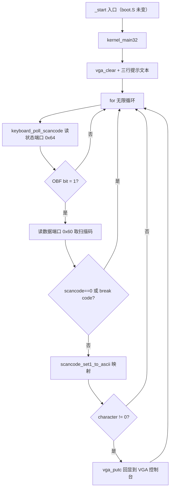

# Lesson 03: PS/2 轮询键盘回显 — 精讲文档

> **课号**：Lesson 03（可执行课）
> **本课主题**：在第二课可清屏/定位/换行/滚屏的 VGA 控制台之上，增加最小 PS/2 键盘轮询与字符回显，让系统第一次响应用户输入。
> **课程主线位置**：第一阶段「启动链与基础输出」（Lesson 00 → 01 → … → 07）的第 3 个可执行内核课，是「输入设备」的起点；后续 shell（Lesson 04）与中断驱动键盘（Lesson 12）都建立在「取到可读字符」这个能力上。
> **前置课程**：[`../lesson-02-stable/README.md`](../lesson-02-stable/README.md)
> **后续课程**：[`../lesson-04-stable/README.md`](../lesson-04-stable/README.md)
> **本课一句话目标**：学完本课你能用 `inb` 访问 x86 I/O 端口，按 OBF 标志轮询 PS/2 控制器，把 QEMU 的 Set-1 make code 小规模映射成 ASCII 并回显到 VGA 控制台。

## 1. 课程定位（Mission）

- **一句话目标**：学完本课你能理解 x86 端口 I/O（`inb`）、i8042 状态/数据端口、Set-1 扫描码与 break code，并写出一个「按下即回显」的轮询键盘循环。
- **课程主线中的位置**：前两课建立了「输出」侧（VGA 控制台）；本课建立「输入」侧的第一块砖。它刻意选择**轮询**而非中断：先学会「读设备字节」与「扫描码 → 字符」的语义，IRQ 路径在 Lesson 11–12 再引入，避免一次课同时承担两个新概念。
- **前置知识清单**：
  1. Lesson 02 的 VGA 控制台原语（`vga_putc` 的换行/折行/滚屏）——回显直接复用它们；
  2. C 内联汇编的基本语法（`__asm__ volatile`、约束 `"=a"`/`"Nd"`）；
  3. 端口 I/O 与内存映射 I/O 的区别：`0x60`/`0x64` 不是可解引用的地址；
  4. 十六进制、位运算 `& 0x80`（判断 break code）、`switch` 语句；
  5. GRUB → Multiboot2 → `_start` → `kernel_main32` 的启动链（前两课）。
- **本课交付（可见结果）**：点击 QEMU 窗口后输入 `tinyos 3`、`keyboard echo`，两行文字在提示文本下方逐字回显；空格与 Enter 生效，不支持的键被忽略。

## 2. 核心概念精讲

### 2.1 x86 端口 I/O 与 i8042 控制器

**定义**：x86 有一个独立于内存地址空间的 I/O 地址空间，通过 `in`/`out` 指令访问。IBM PC 兼容机上的 PS/2 键盘控制器（i8042，QEMU 模拟）占用两个端口：

- `0x60`（数据端口）：读它拿到一个键盘数据字节；
- `0x64`（状态端口）：读它拿到控制器状态，bit 0 是 **OBF（Output Buffer Full）**。

**为什么需要（动机）**：键盘数据不会主动送进内存；CPU 必须「主动问」控制器是否有新字节。而数据是否就绪必须看 OBF：`OBF = 1` 表示输出缓冲里有新数据可读，`OBF = 0` 表示还没有。**若 OBF 为 0 就盲目读 `0x60`，读到的不是可靠的新键盘事件**——这正是 Linux `i8042_interrupt()` 先查 `I8042_STR_OBF` 再读数据的原因。

**工作机制**：

```text
用户按下按键
        │
        ▼
QEMU PS/2 keyboard / i8042 controller
        │  状态端口 0x64：bit 0 = OBF（数据是否已到）
        ▼
keyboard_poll_scancode()
        │  OBF = 1 时才读数据端口 0x60
        ▼
Set-1 make code
        │  例如 a = 0x1e，Enter = 0x1c
        ▼
scancode_set1_to_ascii()
        │  仅 a-z、0-9、空格、Enter
        ▼
vga_putc()
        │  使用第二课的换行、自动折行和滚屏
        ▼
VGA text memory 0xb8000 → QEMU 图形窗口
```

### 2.2 Set-1 扫描码：make code 与 break code

**定义**：键盘每次按下/松开一个键都会产生扫描码。本课假定 QEMU 的 conventional translated **Set-1**（XT 扫描码集）：按下（make）时产生 1 字节码；松开（break）时产生 `码 | 0x80`（bit 7 置 1）。

**为什么需要（动机）**：如果不区分 make/break，一次按键会同时收到「按下码 + 松开码」，导致每个字符回显两次。忽略 break code（`scancode & 0x80` 非 0）就保证一次按键只输出一次。

**本课映射表**（`scancode_set1_to_ascii` 中的 `switch`）：

| 扫描码 | 输出 | 扫描码 | 输出 |
|---|---|---|---|
| `0x02..0x0b` | `'1'..'9','0'` | `0x1c` | `'\n'`（Enter） |
| `0x10..0x19` | `'q'..'p'` | `0x39` | `' '`（空格） |
| `0x1e..0x26` | `'a'..'l'` | 其余 | `0`（忽略） |
| `0x2c..0x32` | `'z'..'m'` | — | — |

**简化边界**：Shift/Ctrl/Alt/Caps Lock、Backspace、方向键、功能键、keypad、`0xe0` 扩展序列、鼠标（AUX）数据均未实现；这张小映射表只对 QEMU translated Set-1 make code 有效，不能直接套用到 Set-2 或真实硬件。

### 2.3 轮询（busy loop）vs 中断

**定义**：本课用无限 `for (;;)` 循环反复问控制器「有没有数据」。只要有数据就处理，否则继续循环。

**为什么需要（动机）**：这是引入输入系统的最短路径——不需要 IDT、不需要 PIC，三行循环就能拿到按键。代价是 CPU 被完全占住（QEMU 里表现为高占用率）；Linux 生产实现用 `i8042_interrupt()` + 输入子系统，CPU 空闲时能 `hlt`。中断与调度在后续课程单独建立。

## 3. 源码精讲

### 3.1 文件清单与职责

| 文件 | 职责 | 本课增量（相对上一课） |
|---|---|---|
| `boot.S` | Multiboot2 header、`_start`、16 KiB 临时栈 | 未变化 |
| `kernel.c` | VGA 控制台（保留）+ PS/2 键盘轮询/映射/回显 | **主增量**：新增 3 个宏、3 个函数，重写 `kernel_main32` |
| `linker.ld` | 镜像段布局 | 未变化 |
| `Makefile` | 编译/链接/ISO/check/run/clean | 未变化 |
| `grub.cfg` | GRUB 菜单项 | 微小变化：菜单标题改为 `TinyOS lesson 3` |

### 3.2 kernel.c — 输入原语精讲

#### 3.2.1 新增宏

```c
#define I8042_DATA_PORT   0x60
#define I8042_STATUS_PORT 0x64
#define I8042_STATUS_OBF  0x01
```
- `I8042_DATA_PORT 0x60`：**新增**，i8042 数据端口，读它取得键盘字节。
- `I8042_STATUS_PORT 0x64`：**新增**，i8042 状态端口，读它判断数据是否就绪。
- `I8042_STATUS_OBF 0x01`：**新增**，状态寄存器的 bit 0（Output Buffer Full）。注意这些是 **I/O 端口号**，不是内存地址，绝不能 `*(volatile unsigned char *)0x60` 解引用。

#### 3.2.2 inb — 端口读一个字节

```c
/* x86 I/O 端口访问；0x60/0x64 不是内存映射地址。 */
static unsigned char inb(unsigned short port)
{
    unsigned char value;

    __asm__ volatile ("inb %1, %0" : "=a" (value) : "Nd" (port));
    return value;
}
```
- **签名与职责**：`static unsigned char inb(unsigned short port)`，对指定 I/O 端口执行一次 8 位 `in` 指令并返回读到的字节。
- **内联汇编解读**：`inb %1, %0` 中 `%0` 是输出操作数（约束 `"=a"` → 必须用 `%al`/`%eax`），`%1` 是输入操作数（约束 `"Nd"` → 8 位立即数或 `%dx`，`in` 指令的端口寻址只支持这两种形式）。`volatile` 阻止编译器把 `in` 当纯函数优化掉或乱序移动——端口读可能有副作用。
- **为什么需要**：`0x60`/`0x64` 在 I/O 地址空间，C 指针解引用访问不到；必须走 `in` 指令。对应 Linux `i8042_read_status()`/`i8042_read_data()` 的「从 I/O port 取 byte」行为。

#### 3.2.3 keyboard_poll_scancode — 按 OBF 轮询

```c
/* 对应 Linux i8042_interrupt()：仅在 OBF 表示有数据时读取数据端口。 */
static unsigned char keyboard_poll_scancode(void)
{
    if ((inb(I8042_STATUS_PORT) & I8042_STATUS_OBF) == 0)
        return 0;

    return inb(I8042_DATA_PORT);
}
```
- **签名与职责**：`static unsigned char keyboard_poll_scancode(void)`，非阻塞地取一个键盘扫描码：有数据返回该字节，无数据返回 0。
- **算法步骤**：(1) 读状态端口 `0x64`，用 `& I8042_STATUS_OBF` 取 bit 0；(2) 若 OBF 为 0，返回 0 表示「本轮无数据」；(3) 否则读数据端口 `0x60` 返回扫描码。
- **为什么先读状态**：与 Linux `i8042_interrupt()` 一致——OBF 才代表「数据端口内容有效」，跳过 OBF 直接读会拿到陈旧/无效字节，产生幽灵按键。
- **边界**：返回 0 的歧义（「无数据」与「无效码」）由调用方消解：主循环把 `scancode == 0` 直接视为无事发生，两种含义在行为上等价。

#### 3.2.4 scancode_set1_to_ascii — 扫描码映射表

```c
/* QEMU 默认 translated Set-1 make code 的教学子集。 */
static char scancode_set1_to_ascii(unsigned char scancode)
{
    switch (scancode) {
    case 0x02: return '1';
    case 0x03: return '2';
    ...
    case 0x1c: return '\n';
    ...
    case 0x39: return ' ';
    default:   return 0;
    }
}
```
- **签名与职责**：`static char scancode_set1_to_ascii(unsigned char scancode)`，把 Set-1 make code 映射为 ASCII 字符；未知码返回 0。
- **算法**：一张显式 `switch` 表，覆盖数字行（`0x02..0x0b` → `'1'..'0'`）、主键盘字母区（`0x10..0x19` → `q..p`、`0x1e..0x26` → `a..l`、`0x2c..0x32` → `z..m`）、`0x1c` → `'\n'`、`0x39` → `' '`，`default` 返回 0。
- **为什么显式列出**：不查表不猜码——每个码值都对应真实按键；`default: return 0` 是「不支持键静默忽略」的单一出口，与主循环的 `character != 0` 检查配套。
- **边界**：它只接受 make code；break code（bit 7）在本层之外被主循环拦截。映射范围刻意只覆盖「小写字母 + 数字 + 空格 + Enter」，对应 QEMU 默认 translated Set-1。

#### 3.2.5 kernel_main32 — 无限轮询主循环

```c
void kernel_main32(void)
{
    unsigned char scancode;
    char character;

    vga_clear();
    vga_set_cursor(0, 0);
    printk("TinyOS lesson 3: PS/2 keyboard polling\n");
    printk("Click this QEMU window, then type a-z, 0-9, space, or Enter.\n");
    printk("Unsupported keys are ignored; input starts below:\n\n");

    for (;;) {
        scancode = keyboard_poll_scancode();
        if (scancode == 0 || (scancode & 0x80) != 0)
            continue;

        character = scancode_set1_to_ascii(scancode);
        if (character != 0)
            vga_putc(character);
    }
}
```
- **签名与职责**：`void kernel_main32(void)`，C 层入口：打印提示后进入**永不返回**的键盘轮询循环。
- **提示文本布局**：第 0 行标题（37 字符）；第 1 行操作说明（59 字符）；第 2 行提示语，末尾 `\n\n` 产生一个空行，让用户输入从**第 4 行**开始。
- **主循环算法步骤**：(1) `keyboard_poll_scancode()` 取码；(2) `scancode == 0`（无数据）或 `scancode & 0x80`（break code）→ `continue`，即忽略；(3) 映射成 ASCII，`character != 0` 才 `vga_putc(character)` 回显。
- **为什么不返回**：boot.S 在 `call kernel_main32` 之后是 `hlt; jmp`，但键盘必须持续被询问；一旦返回，系统就永远停住不再响应输入。轮询占满一个 CPU 是本课接受的代价。
- **回显复用**：`vga_putc` 直接沿用第二课的换行/折行/滚屏——Enter 回显 `'\n'` 触发换行，超出 25 行自动滚屏。

### 3.3 构建管线（Makefile / linker）

与第二课相比**无任何构建改动**：`Makefile`、`linker.ld` 逐字节相同；`grub.cfg` 仅 `menuentry` 名称从 `TinyOS lesson 1` 改为 `TinyOS lesson 3`（第一课开始就沿用的字符串被更新以匹配课程号）。`inb` 用内联汇编，不引入任何新库或链接依赖，`-ffreestanding` 约束保持不变。构建链：`kernel.o` → `kernel.elf` → `grub-mkrescue` → `kernel.iso`；`check` 仍为 `grub-file --is-x86-multiboot2`。

### 3.4 主控制流



## 4. 数据流与运行逻辑

- 用户按键 → i8042 控制器把 Set-1 make code 放进输出缓冲并置 OBF。
- `keyboard_poll_scancode` 读 `0x64` 见 OBF=1，读 `0x60` 得到码（如 `a` → `0x1e`）。
- 主循环过滤 `0` 与 break code（bit 7），把 make code 交给 `scancode_set1_to_ascii`。
- 映射得到字符（如 `'a'`、`'\n'`、`' '`）后调 `vga_putc`；非 0 才输出，未知键（`return 0`）静默丢弃。
- `vga_putc` 走第二课控制台：普通字符写 `0xb8000`，Enter 触发换行，满屏自动滚屏 → QEMU 图形窗口可见回显。
- 具体到输入序列：`tinyos 3` 显示在第 4 行，Enter 换到第 5 行，`keyboard echo` 显示在第 5 行——与验证记录逐行对应。

## 5. 构建、运行与验证

### 5.1 依赖

同前两课：`build-essential gcc-multilib grub-pc-bin xorriso mtools qemu-system-x86`（GUI 自动化验收另需 `socat` 与 [`scripts/qemu-vga-check.sh`](../../scripts/qemu-vga-check.sh)）。

### 5.2 构建与静态检查

```bash
make clean && make -j"$(nproc)"
make check
```

预期：`gcc -m32`、`ld -m elf_i386`、`grub-mkrescue` 无警告完成；`make check` 输出（抄录自 Makefile）：

```text
Multiboot2 header check passed.
```

### 5.3 图形窗口中的人工键盘测试

```bash
make run
```

**输入与验收都必须发生在 QEMU 图形窗口，勿加 `-display none`**：

1. 点击 QEMU VGA 窗口，使它拥有键盘焦点；
2. 输入 `tinyos 3`，按 Enter；
3. 输入 `keyboard echo`，按 Enter。

预期：两行文字从提示文本下方（第 4、5 行）开始回显；空格与 Enter 生效。按住一个支持按键时可能出现重复字符——这代表键盘/QEMU 继续产生 make event，本课尚未实现软件层重复抑制。屏幕提示文本（抄录自 `kernel.c` 第 93–95 行）：

```text
TinyOS lesson 3: PS/2 keyboard polling
Click this QEMU window, then type a-z, 0-9, space, or Enter.
Unsupported keys are ignored; input starts below:
```

### 5.4 实际验证记录（保留自旧 README）

> **本次实际验证记录（2026-08-01）**：已执行 `make clean && make -j$(nproc)`；`gcc -m32`、`ld -m elf_i386` 和 `grub-mkrescue` 均无警告完成。`make check` 输出 `Multiboot2 header check passed.`。随后以正常 QEMU VGA 显示启动 ISO（未使用 `-display none`），通过 QEMU monitor 的 `sendkey` 向该图形实例注入 `tinyos 3`、Enter、`keyboard echo`、Enter，并在 monitor `screendump` 捕获 720×400 画面。按 80 列、每 cell 9×16 像素核验：固定标题位于第 0 行，`tinyos 3` 位于第 4 行，`keyboard echo` 位于第 5 行；证明 PS/2 轮询、Set-1 make-code 映射、空格、Enter 和 VGA 回显均已生效。

## 6. 调试地图

| 现象 | 首先对照的 Linux / 本课来源 | 基于来源的检查 |
|---|---|---|
| GRUB 找不到内核 header | `arch/x86/boot/header.S`、`linker.ld` | `.multiboot` 必须 8 字节对齐、被 `KEEP()` 保留且位于镜像前 32 KiB。 |
| 标题出现但按键没有回显 | `i8042.c:i8042_interrupt()`、本课 `keyboard_poll_scancode()` | 先点击 QEMU 窗口取得焦点；检查状态端口为 `0x64`、数据端口为 `0x60`，并且仅 OBF 为 1 时读取。 |
| 编译器把端口读写当作普通内存，或代码根本不读设备 | `i8042_read_status()` / `i8042_read_data()` | 端口必须使用 `inb`，不能将 `0x60`/`0x64` 强制转换成指针。 |
| 每个字符输出两次 | `atkbd_receive_byte()` 的 make/break 处理背景 | 检查 `scancode & 0x80` 的 break code 是否先被忽略。 |
| 键盘按下后输出乱码 | `atkbd.c` 的协议和转换层 | 本课仅接受 QEMU translated Set-1 make code；不要将 Set-2 的 `0xf0` break 约定与 Set-1 的 bit 7 break 约定混用。 |
| Shift 后仍是小写、退格或方向键无效 | `keyboard.c:kbd_event()` 的修饰键/键码层 | 这是本课边界；没有 modifier 状态、编辑缓冲或 `0xe0` 前缀状态机。 |
| 移动鼠标后偶发异常字符 | `i8042_interrupt()` 的 AUX/mouse 分发 | 本课没有读取 `I8042_STR_AUXDATA`；避免鼠标交互，未知 byte 会尽量静默忽略。 |
| QEMU CPU 占用较高 | Linux 的 `i8042_interrupt()` | 这是轮询 busy loop 的必然结果；中断、`hlt` 和调度将在后续课程单独建立。 |
| 没有闪烁文本插入光标 | `vgacon.c:vga_con_cursor()` | 本课仍只有软件写入位置，未进行 CRTC 端口编程。 |

## 7. 与 Linux 源码对照

- **OBF 检查与数据读取**：TinyOS `keyboard_poll_scancode` 对应 Linux `drivers/input/serio/i8042.c` 的 `i8042_interrupt()`。Linux 在读取前后还检查 `I8042_STR_AUXDATA`（区分鼠标）、奇偶校验与超时，并分发到不同 serio port；本课只做「OBF=1 就读 `0x60`」。
- **扫描码协议解析**：TinyOS 的 `scancode_set1_to_ascii` 对应 `drivers/input/keyboard/atkbd.c` 的 `atkbd_receive_byte()` 与 `atkbd_unxlate_table[128]`。Linux 维护前缀/协议状态、把 make/break 组合成 input keycode，再经 `drivers/tty/vt/keyboard.c` 的 `kbd_event()`/`kbd_keycode()`（配合 `x86_keycodes[256]`）映射到终端动作——修饰键、组合、重复抑制都在这两层。本课用一张静态 switch 表直接「扫描码 → ASCII」，省略了全部中间状态。
- **中断 vs 轮询**：Linux 由 IRQ1 触发 `i8042_interrupt()`，CPU 空闲可 `hlt`；本课 `for (;;)` 忙等。中断、PIC、IDT 是后续课程的独立主题。
- **权威来源**：Intel SDM（`in`/`out` 指令、I/O 地址空间、OBF 语义）、IBM PS/2 键盘接口约定（Set-1 扫描码）、Multiboot2 规范与 GNU GRUB（启动校验）；Linux v6.12 源码仅作工程对照。

## 8. 思考题与练习

1. **概念理解**：为什么不能直接把 `0x60` 当作内存地址解引用读键盘？`inb` 的 `"Nd"` 约束为什么是必要的？
2. **源码定位**：`kernel_main32` 的无限循环里，`scancode == 0` 和 `scancode & 0x80` 分别过滤了什么？去掉其中一行，分别会出现什么可观察现象？
3. **动手实验**：在 `scancode_set1_to_ascii` 的 `switch` 里加入 `case 0x0e: return '\b';` 并让回显支持退格（提示：需要修改 `vga_putc` 处理 `\b`），运行验证。
4. **动手实验**：把 `keyboard_poll_scancode` 改成「不查 OBF 直接读 `0x60`」，运行观察是否出现幽灵字符。
5. **Linux 对照**：阅读 `linux-v6.12/drivers/input/serio/i8042.c` 的 `i8042_interrupt()`，列出 Linux 在读取一个 byte 前后额外检查的两类状态。

## 9. 本课小结与下一课预告

- 本课在 VGA 控制台基础上引入了第一个输入设备：PS/2 键盘轮询回显。
- 学会了 `inb` 内联汇编与 x86 端口 I/O：`0x64` 状态端口、`0x60` 数据端口、OBF 标志。
- 掌握了「先查 OBF 再读数据」的设备访问纪律，避免读到无效字节。
- 学会了 Set-1 扫描码的 make/break 区分（bit 7），以及用显式 switch 表做小规模扫描码 → ASCII 映射。
- 主循环用 `for (;;)` 轮询并过滤「无数据」「break code」「不支持键」三类事件，只回显有效字符。
- 明确了简化边界：无修饰键、无编辑键、无 `0xe0` 前缀、无鼠标分发、无中断——全部留给后续课程。
- 下一课 [**Lesson 04**](../lesson-04-stable/README.md) 将在本课键盘回显之上增加**最小命令 shell**：接收一行有限长度的文本、识别少量固定命令（help/about/clear）并在 VGA 上显示回应。
