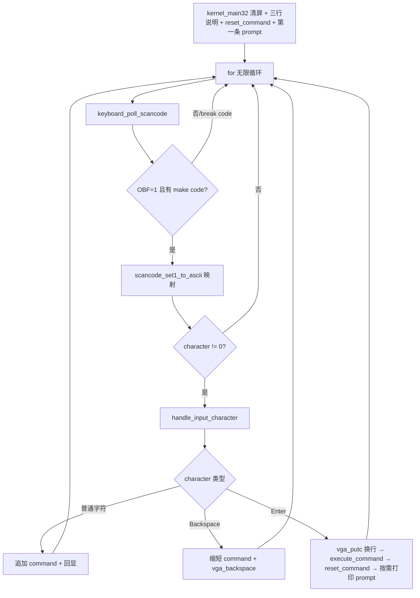

# Lesson 04: 最小命令 shell：help/about/clear — 精讲文档

> **课号**：Lesson 04（可执行课）
> **本课主题**：把第三课「按键即回显」升级为完整的 **键盘 → 行缓冲 → 命令分发 → VGA 回应 → prompt** 回路，实现最小命令 shell：`help`/`about`/`clear`。
> **课程主线位置**：第一阶段「启动链与基础输出」（Lesson 00 → 01 → … → 07）的第 4 个可执行内核课；这是 TinyOS 第一个「交互式命令环境」，此后每课都以「新命令 + 回显」的方式在 shell 里验证新功能。
> **前置课程**：[`../lesson-03-stable/README.md`](../lesson-03-stable/README.md)
> **后续课程**：[`../lesson-05-stable/README.md`](../lesson-05-stable/README.md)
> **本课一句话目标**：学完本课你能写出一条「行长缓冲 + 精确命令匹配 + 固定输出」的最小命令行回路，并让 Backspace 与 `clear` 单 prompt 语义在 QEMU 窗口里可验证。

## 1. 课程定位（Mission）

- **一句话目标**：学完本课你能实现一个无 libc、单核、轮询式的命令循环：逐键收集到 `command[64]` 缓冲，Enter 提交，`help`/`about`/`clear` 分发，未知命令回显原样。
- **课程主线中的位置**：第三课给了「一次按键 → 一个字符」；本课把「字符」聚合成「一行文本」，并把「行」映射为「命令 + 回应」。这个模式是后续所有「可交互功能课」的验收入口（Lesson 05 的内存图、Lesson 06 的页分配器都会在 shell 里打印结果）。
- **前置知识清单**：
  1. Lesson 03 的 PS/2 轮询（`keyboard_poll_scancode`）、`inb`、Set-1 扫描码与 break code；
  2. Lesson 02 的 VGA 控制台原语（`vga_putc`、`vga_clear`、`vga_make_cell`）——Backspace 要按 cell 擦除；
  3. C 的 `char[]` 缓冲、`'\0'` 终止、数组边界意识；
  4. 函数返回值作为「行为契约」的用法（`execute_command` 返回是否已打印 prompt）。
- **本课交付（可见结果）**：输入 `help`/`about`/`clear` 分别得到命令表、版本行、清屏单 prompt；输入其他内容得到 `unknown command: <输入>`。

## 2. 核心概念精讲

### 2.1 行长缓冲（line buffer）

**定义**：一个固定 64 字节的 `static char command[COMMAND_MAX]` 加上计数器 `command_length`，共同表示「当前正在编辑的这一行命令」。约定：

```text
[ command[0] ... command[command_length - 1] ][ '\0' ]
0 <= command_length <= 63
```

最后一个字节永远保留给 `'\0'`，所以最多存 63 个字符。

**为什么需要（动机）**：第三课每按一键就输出一个字符，无法区分「字符序列的边界」，也就无法把 `help` 识别成一个命令。必须先收集整行，Enter 到来时才提交解析。

**工作机制**：普通字符在 `command_length < COMMAND_MAX - 1` 时追加到 `command[command_length]` 并立即补 `'\0'`；超限的字符静默忽略，直到 Backspace 腾出空间或 Enter 提交。这保证任何时刻 `command` 都是合法 C 字符串。

### 2.2 命令分发（dispatch）与「是否已打印 prompt」契约

**定义**：`execute_command()` 按精确、无参数、全小写匹配 `command` 内容，决定打印什么回应。它的返回值是一个教学契约：返回 1 表示「clear 已经自己清屏并打印了下一条 prompt，调用方不要再打印」。

**为什么需要（动机）**：`clear` 的特殊性在于它必须先清屏再打印 prompt；如果走「execute_command 之后统一打印 prompt」的公共路径，`clear` 之后就会出现两条 prompt。用一个返回值显式区分，是最小的无状态解决方案。

**命令表**（输出串逐字抄录自 `kernel.c`）：

| 输入 | 行为 |
|---|---|
| `help` | 输出 `commands: help about clear` |
| `about` | 输出 `TinyOS lesson 4: minimal command loop` |
| `clear` | 清屏并只显示一条新 prompt（返回 1） |
| 空行 | 只显示一条新 prompt |
| 其他 | 输出 `unknown command: <输入>` |

### 2.3 Backspace 的教学契约

**定义**：`vga_backspace()` 只做一件事：`cursor--` 后把当前 cell 写成空格，视觉上「吃掉」屏幕上刚回显的最后一个字符。

**为什么需要（动机）**：编辑命令必须能改错。但本课的契约极小：仅当 `command_length != 0` 时，从缓冲删除一个字符并擦除一个 cell；它**不能**删除 `tinyos> ` 提示符、不支持跨行编辑、箭头键或历史。把「单行尾部删除」做成确定行为，避免越界写显存。

## 3. 源码精讲

### 3.1 文件清单与职责

| 文件 | 职责 | 本课增量（相对上一课） |
|---|---|---|
| `boot.S` | Multiboot2 header、`_start`、16 KiB 临时栈 | 未变化 |
| `kernel.c` | 行缓冲、Backspace、命令分发、prompt 回路 | **主增量**：新增 1 宏、2 全局、6 函数；`scancode_set1_to_ascii` 增补 Backspace 码；重写 `kernel_main32` |
| `linker.ld` | 镜像段布局 | 未变化 |
| `Makefile` | 编译/链接/ISO/check/run/clean | 未变化 |
| `grub.cfg` | GRUB 菜单项 | 微小变化：菜单标题改为 `TinyOS lesson 4` |

### 3.2 kernel.c — 命令回路精讲

#### 3.2.1 新增宏与全局状态

```c
#define COMMAND_MAX       64
...
static char command[COMMAND_MAX];
static unsigned short command_length;
```
- `COMMAND_MAX 64`：**新增**，行缓冲容量。64 是有意的小常量——足够容纳本课命令，同时强迫学习者感受「固定容量」约束。
- `command[64]`：**新增**，当前命令的字符缓冲，始终以 `'\0'` 结尾。
- `command_length`：**新增**，缓冲里有效字符数，域为 `[0, 63]`。

#### 3.2.2 vga_backspace — 按 cell 擦除

```c
/* 仅删除当前命令刚刚回显的最后一个字符。 */
static void vga_backspace(void)
{
    cursor--;
    VGA_TEXT_BUFFER[cursor] = vga_make_cell(' ');
}
```
- **签名与职责**：`static void vga_backspace(void)`，把光标回退一格并把那个 cell 写成空格 cell。
- **算法**：`cursor--` 回到「刚回显的最后一个字符」位置，再写 `vga_make_cell(' ')` 覆盖为空格。光标停在擦除后的空位上，后续输入从该位置继续。
- **边界**：调用方 `handle_input_character` 只在 `command_length != 0` 时调用它，因此 `cursor` 不会越过行首（不会删到 prompt）。它不处理 `\n` 后的跨行退格，这是刻意的单行契约。
- **为什么写空格 cell 而不是只回退**：只回退 `cursor` 不擦除，屏幕会残留旧字形；写空格 cell 同时携带属性 `0x0f`，擦除后区域与空白一致。

#### 3.2.3 print_prompt / reset_command

```c
static void print_prompt(void)
{
    printk("tinyos> ");
}

static void reset_command(void)
{
    command_length = 0;
    command[0] = '\0';
}
```
- `print_prompt`：**新增**，输出提示符 `tinyos> `（含结尾空格，让输入与提示符分开）。集中定义使「提示符」只有一处。
- `reset_command`：**新增**，把 `command_length` 清零并写 `command[0] = '\0'`，即「空命令」状态。为什么两个都做：`command_length` 是逻辑长度，`'\0'` 是 C 字符串契约，`command_equals`/`execute_command` 都依赖后者。

#### 3.2.4 command_equals — 精确字符串比较

```c
static int command_equals(const char *expected)
{
    unsigned short index;

    for (index = 0; command[index] != '\0' && expected[index] != '\0'; index++) {
        if (command[index] != expected[index])
            return 0;
    }

    return command[index] == expected[index];
}
```
- **签名与职责**：`static int command_equals(const char *expected)`，判断 `command` 是否与期望字符串**完全相等**（不含前缀匹配、无大小写折叠）。
- **算法**：逐字符比较，只要两边任一先到 `'\0'` 就停止；退出循环后，`command[index] == expected[index]` 成立当且仅当**两者同时到达 `'\0'`**——这同时排除了「`hel` 被当作 `help`」和「`help` 被当作 `helpx`」两类误判。
- **为什么手写**：无 libc，不能调 `strcmp`；这个 6 行循环是 `strcmp` 语义的精确教学子集。
- **边界**：`command` 始终有终止符（见 `handle_input_character`/`reset_command`），因此循环不会越界读。

#### 3.2.5 execute_command — 命令分发

```c
/* 返回 1 表示 clear 已显示了下一条 prompt。 */
static int execute_command(void)
{
    if (command_length == 0)
        return 0;
    if (command_equals("help")) {
        printk("commands: help about clear\n");
        return 0;
    }
    if (command_equals("about")) {
        printk("TinyOS lesson 4: minimal command loop\n");
        return 0;
    }
    if (command_equals("clear")) {
        vga_clear();
        print_prompt();
        return 1;
    }

    printk("unknown command: ");
    printk(command);
    vga_putc('\n');
    return 0;
}
```
- **签名与职责**：`static int execute_command(void)`，根据 `command` 内容分发：`help`/`about`/`clear` 有定义行为，空命令静默，其余回显 `unknown command:`。返回值是「是否已打印下一条 prompt」。
- **算法步骤**：(1) `command_length == 0`（空行）直接返回 0，让公共路径打印 prompt；(2) `help` → 打印命令表并返回 0；(3) `about` → 打印版本行并返回 0；(4) `clear` → 清屏 + 自己打印 prompt，返回 1；(5) 兜底 → 打印 `unknown command: ` 加原样输入加换行，返回 0。
- **为什么返回 1 只在 clear**：`clear` 之后屏幕已清空，公共路径再打一次 `tinyos> ` 就会出现双 prompt；返回 1 让 `handle_input_character` 跳过公共打印。
- **边界**：`printk(command)` 打印用户原文，但 `command` 被约束为可打印字符（a-z/0-9/空格），不会注入控制序列。

#### 3.2.6 handle_input_character — 字符事件处理

```c
static void handle_input_character(char character)
{
    int prompt_printed;

    if (character == '\n') {
        vga_putc('\n');
        prompt_printed = execute_command();
        reset_command();
        if (!prompt_printed)
            print_prompt();
        return;
    }
    if (character == '\b') {
        if (command_length != 0) {
            command_length--;
            command[command_length] = '\0';
            vga_backspace();
        }
        return;
    }
    if (command_length < COMMAND_MAX - 1) {
        command[command_length++] = character;
        command[command_length] = '\0';
        vga_putc(character);
    }
}
```
- **签名与职责**：`static void handle_input_character(char character)`，处理一个已映射为字符的按键事件，分三类：Enter、Backspace、普通字符。
- **Enter 分支**：先 `vga_putc('\n')` 把光标带到下一行，再 `execute_command()` 执行命令并记录是否已打 prompt，随后 `reset_command()` 清空缓冲，最后按返回值决定是否打印新 prompt。顺序很重要：**先换行、后执行、再复位、最后 prompt**，保证回应与 prompt 各行就位。
- **Backspace 分支**：仅当 `command_length != 0`：先缩短缓冲（`command_length--`）并把新尾部补 `'\0'`，再 `vga_backspace()` 擦屏。缓冲与屏幕必须同步删除同一个字符。
- **普通字符分支**：仅当 `command_length < COMMAND_MAX - 1`（预留终止符位）：追加字符、补 `'\0'`、`vga_putc` 回显。超限字符被静默丢弃——这就是 64 字节边界的实现点。

#### 3.2.7 scancode_set1_to_ascii — 增补 Backspace

```c
case 0x0b: return '0'; case 0x0e: return '\b';
```
- 第三课的映射表整体保留，格式压缩为每行 3 个 case，并**新增** `case 0x0e: return '\b';`。扫描码 `0x0e` 是 Backspace 键的 Set-1 make code，映射为 `'\b'` 后进入 `handle_input_character` 的 Backspace 分支。

#### 3.2.8 kernel_main32 — 初始化与主循环

```c
    vga_clear();
    vga_set_cursor(0, 0);
    printk("TinyOS lesson 4: minimal command loop\n");
    printk("Commands: help about clear. Type lowercase a-z, 0-9, space, Enter.\n");
    printk("Backspace removes the last input character.\n\n");
    reset_command();
    print_prompt();

    for (;;) {
        scancode = keyboard_poll_scancode();
        if (scancode == 0 || (scancode & 0x80) != 0)
            continue;

        character = scancode_set1_to_ascii(scancode);
        if (character != 0)
            handle_input_character(character);
    }
```
- **初始化序列**：清屏 → 打印三行说明（第 0–2 行，`\n\n` 留空第 3 行）→ `reset_command()` 建立空命令 → `print_prompt()` 显示第一条 `tinyos> `。输入从第 4 行开始。
- **主循环**：与第三课同构（轮询 → 过滤 `0` 与 break code → 映射），但最后一步从「直接 `vga_putc`」改为「`handle_input_character(character)`」——字符不再直接上屏，而先进入行缓冲逻辑。这个改动是本课唯一的数据流变化。

### 3.3 构建管线（Makefile / linker）

与第三课相比无任何构建改动：`Makefile`、`linker.ld` 逐字节相同；`grub.cfg` 仅菜单标题改为 `TinyOS lesson 4`。本课所有新代码都是纯 C 数组/字符串操作，不引入 libc 链接依赖，`-ffreestanding` 约束保持。构建链 `kernel.o` → `kernel.elf` → `kernel.iso`、`check` 用 `grub-file --is-x86-multiboot2`、`run` 打开 QEMU 图形窗口均不变。

### 3.4 主控制流



## 4. 数据流与运行逻辑

- 用户按键 → `keyboard_poll_scancode`（OBF 轮询）→ `scancode_set1_to_ascii`（Set-1 → ASCII）→ `handle_input_character`。
- 普通字符：写入 `command[command_length]`、补 `'\0'`、`vga_putc` 回显 → 缓冲与屏幕同步增长。
- Backspace（`0x0e` → `'\b'`）：仅非空时缩短缓冲并擦除一个 cell。
- Enter：`vga_putc('\n')` 换行 → `execute_command()` 分发：
  - `help` → `commands: help about clear`；`about` → `TinyOS lesson 4: minimal command loop`；未知 → `unknown command: <原文>`；空 → 无输出；
  - `clear` → `vga_clear()` + `print_prompt()` 并返回 1；
- 随后 `reset_command()` 清空缓冲，若 `execute_command` 未打 prompt（返回 0）则 `print_prompt()` 打新 prompt。
- 具体输入序列 → 画面（逐行对应验证记录）：`cleax`+Backspace+`r` → `clear` 执行 → 屏幕清空、第 0 行仅一条 `tinyos> `；随后 `help`/`about`/`nonsense`/空行各占两行，prompt 出现在第 6、7 行。

## 5. 构建、运行与验证

### 5.1 依赖

同前三课：`build-essential gcc-multilib grub-pc-bin xorriso mtools qemu-system-x86`（GUI 自动化验收另需 `socat` 与 [`scripts/qemu-vga-check.sh`](../../scripts/qemu-vga-check.sh)）。

### 5.2 构建与静态检查

```bash
make clean && make -j"$(nproc)"
make check
```

预期：`gcc -m32`、`ld -m elf_i386`、`grub-mkrescue` 无警告完成；`make check` 输出（抄录自 Makefile）：

```text
Multiboot2 header check passed.
```

### 5.3 图形窗口中的人工命令测试

```bash
make run
```

**输入和验收都发生在 QEMU 图形窗口，勿加 `-display none`**。点击窗口获得焦点后输入：

```text
help<Enter>
about<Enter>
cleax<Backspace>r<Enter>
nonsense<Enter>
<Enter>
```

- `cleax` 经 Backspace 和 `r` 后成为 `clear`，执行后屏幕清空并只留下一条 `tinyos> ` prompt（第 0 行）；
- 超过 63 个支持字符应被安全忽略；
- 窗口顶部固定提示（抄录自 `kernel.c` 第 222–224 行）：

```text
TinyOS lesson 4: minimal command loop
Commands: help about clear. Type lowercase a-z, 0-9, space, Enter.
Backspace removes the last input character.
```

命令回应的输出串（逐字抄录自 `execute_command`）：`commands: help about clear`、`TinyOS lesson 4: minimal command loop`、`unknown command: <输入>`。

可为相同 VGA 配置附加 QEMU monitor，用 `sendkey` 注入确定性输入、用 `screendump` 截图；先发送 `clear`，再测试 `help`/`about`/`nonsense`/空行，避免 clear 擦除待验收输出。截图按 80×25、每 cell 9×16 像素核验。

### 5.4 实际验证记录（保留自旧 README）

> **本次实际验证记录（2026-08-01）**：已执行 `make clean && make -j$(nproc)`；`gcc -m32`、`ld -m elf_i386` 和 `grub-mkrescue` 均无警告完成，`make check` 输出 `Multiboot2 header check passed.`。随后以正常 QEMU VGA 显示启动 ISO（未使用 `-display none`），通过 monitor `sendkey` 注入 `cleax`、Backspace、`r`、Enter，截图核验清屏后仅第 0 行存在一条 `tinyos> ` prompt。接着注入 `help`、`about`、`nonsense` 和空行并捕获第二张 720×400 VGA 画面；按 80 列、每 cell 9×16 像素核验：第 0/1 行为 help 与命令表，第 2/3 行为 about 与回应，第 4/5 行为 unknown 命令与回应，第 6/7 行各有一条 prompt。这证明 Backspace、clear 单 prompt、命令分发和空行处理均已生效。

## 6. 调试地图

| 现象 | 首先对照的来源 | 检查方法 |
|---|---|---|
| 标题出现但按键没响应 | `i8042.c:i8042_interrupt()` | 点击 QEMU 窗口；确认 `0x64` OBF 后才读 `0x60`。 |
| 一个按键输出两次 | `atkbd_receive_byte()` 的 make/break 背景 | 忽略 `scancode & 0x80` 的 break code。 |
| Backspace 擦掉 prompt 或越界 | `handle_input_character()` | 仅 `command_length != 0` 时调用 `vga_backspace()`。 |
| 64 字符后破坏内存 | 固定 buffer 边界 | 只在 `command_length < COMMAND_MAX - 1` 时追加，始终补 `\0`。 |
| `help` 无法识别或 unknown 内容乱码 | `command_equals()` / `reset_command()` | 精确比较到双方 `\0`；每次提交/删除均保持终止符。 |
| `clear` 后有两个 prompt | `execute_command()` 返回契约 | clear 已打印 prompt，必须返回 1。 |
| 跨行退格不正确 | `vt.c:lf()` 与本课边界 | 本课只承诺当前单行命令尾部删除。 |
| Shift、箭头、Tab 或大写无效 | `keyboard.c:kbd_event()` | 有意不实现 modifier、`0xe0`、历史和补全。 |
| CPU 占用高 | `i8042_interrupt()` | 本课是忙轮询；IRQ、`hlt`、PIC/IDT 后续独立建立。 |

## 7. 与 Linux 源码对照

- **输入队列分层**：TinyOS 的 `handle_input_character` → `execute_command` 对应 Linux `drivers/tty/vt/keyboard.c` 的 `kbd_event()`/`kbd_keycode()`/`fn_enter()`/`put_queue()`。Linux 把按键、Enter 与终端输入队列（TTY line discipline）分层：`fn_enter()` 调用 `put_queue()` 把字节送进 tty buffer，随后由 line discipline 做缓冲/编辑/回显；本课直接在一个静态 `command[]` 上完成全部编辑语义。
- **Backspace/行编辑**：Linux 的 backspace 由 line discipline（`drivers/tty/n_tty.c` 的 `n_tty_receive_char`）配合 `ECHO`/`ERASE` 实现，支持跨行、kill、word 删除；本课 `vga_backspace` 只做「单行尾部删一个 cell」。
- **行缓冲边界**：Linux tty buffer 是动态、带流量控制的环形缓冲；本课 `command[64]` 是固定教学缓冲，超出即丢弃。
- **权威来源**：Intel SDM（端口 I/O、OBF）、IBM PS/2 约定（Set-1 扫描码，Backspace `0x0e`）、Multiboot2 规范与 GNU GRUB（启动校验）；Linux v6.12 源码仅作工程对照。

## 8. 思考题与练习

1. **概念理解**：`execute_command` 为什么需要返回值？如果 `clear` 分支也返回 0，会出现什么现象？
2. **源码定位**：`command_equals("help")` 是如何排除 `hel` 与 `helpx` 这两个误判的？请结合退出循环后的 `command[index] == expected[index]` 说明。
3. **动手实验**：在 `handle_input_character` 里把 `command_length < COMMAND_MAX - 1` 改成 `command_length < COMMAND_MAX`，输入 64 个字符后按 Enter，观察发生了什么。
4. **动手实验**：给 shell 增加新命令 `version`（输出 `tinyos 0.4`），并在 `help` 的命令表中加入 `version`，运行验证。
5. **Linux 对照**：阅读 `linux-v6.12/drivers/tty/vt/keyboard.c` 的 `fn_enter()` 与 `put_queue()`，说明真实 Linux 为何不直接在键盘驱动里调用 VGA 写函数。

## 9. 本课小结与下一课预告

- 本课把「按键回显」升级为「行长缓冲 + 命令分发 + prompt」完整回路。
- 新增 `COMMAND_MAX` 宏与 `command[64]`/`command_length` 状态，确立了「固定容量、始终 `\0` 终止」的缓冲纪律。
- 新增 `vga_backspace`（cell 级擦除）、`print_prompt`、`reset_command`、`command_equals`（手写 strcmp 语义）、`execute_command`（返回「是否已打印 prompt」）、`handle_input_character`（三路事件处理）六个函数。
- `scancode_set1_to_ascii` 增补 Backspace（`0x0e` → `'\b'`），使行编辑成为可能。
- 明确了空行、未知命令、超长输入、双 prompt 等边界行为，并用验证记录逐行核验了屏幕布局。
- 没有 `printf`/`strcmp`/`memcpy`/`malloc`，所有字符串操作手写，保持 freestanding。
- 下一课 [**Lesson 05**](../lesson-05-stable/README.md) 将读取并显示 **Multiboot2 内存图（type-6 描述符）**，让 TinyOS 开始认识可用物理内存；届时 `kernel_main32` 签名将变为 `(u32 magic, u32 mbi_address)`，正式接收 GRUB 的交接参数。
