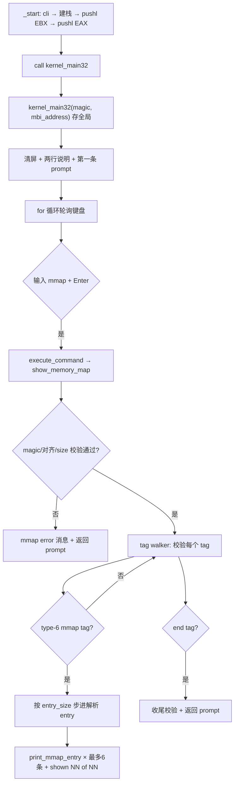

# Lesson 05: Multiboot2 type-6 内存图解析 — 精讲文档

> **课号**：Lesson 05（可执行课）
> **本课主题**：首次让 TinyOS 认识机器的物理内存布局：接收 GRUB 在 Multiboot2 交接时给的 `(magic, mbi_address)`，解析 type-6 memory-map tag，用新 `mmap` 命令在 VGA 上显示原始物理内存范围。
> **课程主线位置**：第一阶段「启动链与基础输出」的第 5 个可执行内核课；从「交互 shell」跨入「认识硬件资源」。解析出的内存图是 Lesson 06 物理页分配器的输入。
> **前置课程**：[`../lesson-04-stable/README.md`](../lesson-04-stable/README.md)
> **后续课程**：[`../lesson-06-stable/README.md`](../lesson-06-stable/README.md)
> **本课一句话目标**：学完本课你能按 Multiboot2 规范安全地遍历 boot-information structure 的 tag 链，解析 type-6 内存图，并以 64 位十六进制完整显示 addr/len。

## 1. 课程定位（Mission）

- **一句话目标**：学完本课你能把 `EAX/EBX` 交接参数传入 C，识别 end tag 与 mmap tag，按运行时 `entry_size` 步进解析内存条目，并知道「原始可用内存 ≠ 立即可分配内存」。
- **课程主线中的位置**：前面四课的输出/输入/交互层已经齐备（VGA 控制台 + 键盘 + shell）；本课第一次把「内核之外的世界」——物理内存布局——变成可见数据。没有它，后续一切内存管理（页分配器、分页、用户空间）都只能凭空假设 RAM 大小。
- **前置知识清单**：
  1. Lesson 04 的 shell 回路（`execute_command` 分发、prompt、行缓冲）——`mmap` 命令挂在上面；
  2. Multiboot2 规范：EAX magic `0x36d76289`、EBX = boot-information physical address、Basic tags structure、end tag、tag 8 字节对齐；
  3. i386 cdecl 调用约定：参数从右到左压栈；
  4. C 结构体与 `__attribute__((packed))`、指针解引用与对齐；
  5. 位运算（`& 7` 判对齐、`~7U` 做 8 字节向上取整）。
- **本课交付（可见结果）**：输入 `mmap` 后，VGA 显示 `Multiboot2 memory map:` 标题、若干条 `addr +len type` 行与 `shown NN of NN entries` 汇总行。

## 2. 核心概念精讲

### 2.1 Multiboot2 交接参数：EAX/EBX

**定义**：GRUB 通过 `multiboot2` 命令把内核装入内存、进入入口 `_start` 时，按 i386 ABI 设置：`%eax = 0x36d76289`（Multiboot2 引导 magic），`%ebx = boot-information structure（MBI）的物理地址`。

**为什么需要（动机）**：内核自己不知道机器有多少内存、GRUB 用了哪些范围；这些信息由 bootloader 通过 MBI 提供。本课之前一直忽略 EAX/EBX，现在必须接收并用它定位内存图。

**工作机制**：

```text
GRUB Multiboot2 i386 handoff
  EAX = bootloader magic 0x36d76289
  EBX = MBI physical address
          │
          ▼
boot.S: 建栈后按 cdecl 把 (magic, mbi_address) 传给 C
          │
          ▼
kernel_main32(u32 magic, u32 mbi_address)
```

`_start` 里 `pushl %ebx; pushl %eax; call kernel_main32`：i386 cdecl 从右到左压参，先压 `%ebx`（第二参数 mbi_address），再压 `%eax`（第一参数 magic）；返回后 `addl $8, %esp` 清掉两个 4 字节参数。

### 2.2 MBI 布局与 Basic tags structure

**定义**：MBI 起始是：

```text
u32 total_size        # MBI 总字节数
u32 reserved          # 规范保留，恒为 0
随后每个 tag：u32 type | u32 size | payload | padding 到 8-byte 边界
最后必须有：type=0, size=8 的 end tag
```

每个 tag 的前 8 字节是 `{u32 type, u32 size}`，`size` 含这 8 字节头；`(size + 7) & ~7` 是下一个 tag 的对齐偏移。

**为什么需要（动机）**：MBI 里可以带多种信息（bootloader 名称、模块、framebuffer、内存图……），格式不固定。内核必须用 tag walker 遍历并只挑自己认识的 type。

### 2.3 type-6 memory-map tag 与 entry

**定义**：type=6 的 tag 在 8 字节头后紧跟：

```text
u32 entry_size     # 每个 entry 的字节数（运行时可变）
u32 entry_version  # 当前恒为 0
之后按 entry_size 步进排列若干 entry：
  u64 addr | u64 len | u32 type | u32 reserved
```

entry 的 `type` 语义（对应 Linux e820）：`1` = available（可用 RAM）、`3` = acpi（ACPI 可回收）、`4` = hibernation（NVS）、`5` = bad（坏块）、其余 = reserved。

**为什么需要（动机）**：entry 结构必须从 tag 运行时读出 `entry_size` 再按它步进——不能写死 C 结构体步长，因为不同 GRUB/固件给出的 entry_size 可能不同。`addr`/`len` 都是 64 位，必须用 64 位显示避免截断。

### 2.4 「原始可用内存 ≠ 立即可分配内存」

**定义**：type=1 的 entry 只是「这段内存没有硬件占用」。内核镜像、`_start` 临时栈、MBI 本身、GRUB/固件、模块、framebuffer 和未来页表所占的范围都还**没有**从 map 里扣除。

**为什么需要（动机）**：这是本课最重要的概念边界——`mmap` 只是「看地图」；「谁可以分配」是下一课早期保留感知的物理页分配器要解决的事。把二者分开，本课就不需要维护任何分配状态。

## 3. 源码精讲

### 3.1 文件清单与职责

| 文件 | 职责 | 本课增量（相对上一课） |
|---|---|---|
| `boot.S` | Multiboot2 header（新增 information-request tag）、`_start`（新增传参） | **增量**：2 个新常量、header 中新增 type-1 tag 与对齐、`pushl %ebx; pushl %eax` 传参 |
| `kernel.c` | MBI/tag/entry 解析 + `mmap` 命令 + 64 位十六进制输出 | **主增量**：4 宏、2 类型、3 结构体、2 全局、6 新函数；`kernel_main32` 签名变化 |
| `linker.ld` | 镜像段布局 | 未变化 |
| `Makefile` | 编译/链接/ISO/check/run/clean | 未变化 |
| `grub.cfg` | GRUB 菜单项 | 微小变化：菜单标题改为 `TinyOS lesson 5` |

### 3.2 boot.S — 交接参数精讲

#### 3.2.1 新常量

```asm
.set MB2_HEADER_TAG_INFO_REQUEST, 1
.set MB2_BOOT_TAG_MMAP,      6
```
- `MB2_HEADER_TAG_INFO_REQUEST 1`：**新增**，header 内部 tag 的 type 1 = information-request（向 GRUB 索取指定 boot 信息）。
- `MB2_BOOT_TAG_MMAP 6`：**新增**，boot-information tag 的 type 6 = memory-map。两个 6 分属 header tag 与 MBI tag 两个命名空间，用不同符号名避免混淆。

#### 3.2.2 header 中新增 information-request tag

```asm
	/* Multiboot2 information-request tag：显式请求 type 6 memory map。 */
	.short MB2_HEADER_TAG_INFO_REQUEST
	.short 0
	.long 12
	.long MB2_BOOT_TAG_MMAP
	.align 8

	.short 0
	.short 0
	.long 8
mb2_header_end:
```
- 前 8 字节仍是 magic/arch/length/checksum 四字段（沿用第一课）。
- **新增**的 information-request tag：`.short 1`（type=1）、`.short 0`（flags=0）、`.long 12`（tag 大小：4+4+4=12 字节）、`.long 6`（请求的 boot 信息类型 = memory map）。它的作用是对 GRUB 说「请务必提供 type-6 内存图」。
- `.align 8`：把下一个 tag（end tag）对齐到 8 字节——tag 链整体必须 8 字节对齐。
- end tag（type=0、flags=0、size=8）仍以 `.short 0 .short 0 .long 8` 收尾。header 总长度 0x28 = 40 字节（16 头 + 12 request tag + 4 padding + 8 end tag），可由 `readelf -x .multiboot` 核对。

#### 3.2.3 _start 传参

```asm
	/* i386 cdecl：从右到左传入 (magic, mbi_address)。 */
	pushl %ebx
	pushl %eax
	call kernel_main32
	addl $8, %esp
```
- `pushl %ebx`：把 MBI 物理地址压栈（cdecl 的第二参数，先压）。
- `pushl %eax`：把 magic 压栈（第一参数，后压，位于栈顶，C 侧读到的是 `magic`）。
- `call kernel_main32`：C 侧 `kernel_main32(u32 magic, u32 mbi_address)` 正好从栈取出这两个值。
- `addl $8, %esp`：返回后回收 8 字节参数，保持栈平衡。对比第一课 `call kernel_main32` 无参数、无 `addl`。

### 3.3 kernel.c — MBI 解析精讲

#### 3.3.1 新增宏、类型与结构体

```c
#define MB2_BOOT_MAGIC 0x36d76289
#define MB2_TAG_END 0
#define MB2_TAG_MMAP 6
#define MB2_MMAP_DISPLAY_MAX 6

typedef unsigned int u32;
typedef unsigned long long u64;
struct mb2_tag { u32 type; u32 size; } __attribute__((packed));
struct mb2_mmap_tag { u32 type; u32 size; u32 entry_size; u32 entry_version; } __attribute__((packed));
struct mb2_mmap_entry { u64 addr; u64 len; u32 type; u32 reserved; } __attribute__((packed));
```
- `MB2_BOOT_MAGIC 0x36d76289`：**新增**，GRUB 跳入 `_start` 时 `%eax` 的值，用于校验「交接确实来自 Multiboot2 引导」。
- `MB2_TAG_END 0` / `MB2_TAG_MMAP 6`：**新增**，MBI tag type 常量。
- `MB2_MMAP_DISPLAY_MAX 6`：**新增**，最多打印 6 条 entry（一屏内可读），但统计照常进行。
- `u32`/`u64`：**新增**，无 libc 下的定宽类型，保证 32 位/64 位字段精确对应规范。
- 三个 `__attribute__((packed))` 结构体：**新增**，取消结构体填充，让内存布局与规范字节一致（否则 `u64 addr` 会插入 4 字节对齐填充，把字段读错）。

#### 3.3.2 新全局

```c
static u32 multiboot_magic, multiboot_address;
```
- **新增**，保存 `kernel_main32` 收到的两个交接参数，供 `show_memory_map` 在任意时刻使用。

#### 3.3.3 十六进制/十进制输出原语

```c
static void print_hex32(u32 value) { static const char hex[] = "0123456789abcdef"; int shift; for (shift = 28; shift >= 0; shift -= 4) vga_putc(hex[(value >> shift) & 0xf]); }
static void print_hex64(u64 value) { print_hex32((u32)(value >> 32)); print_hex32((u32)value); }
static void print_two_digits(u32 value) { vga_putc('0' + (value / 10) % 10); vga_putc('0' + value % 10); }
```
- `print_hex32`：**新增**，固定输出 8 位小写十六进制。`shift` 从 28 递减到 0，每次取 4 bit 查 `hex[]` 表。输出固定宽度对「逐字符比对验证」很重要。
- `print_hex64`：**新增**，先打高 32 位再打低 32 位，得到 16 位十六进制——**避免 32 位截断**，这是 64 位内存地址显示的前提。
- `print_two_digits`：**新增**，输出两位十进制数（`0` 补齐），用于 `shown NN of NN entries` 与条目序号，保证画面宽度确定。

#### 3.3.4 mmap_type_name / print_mmap_entry

```c
static const char *mmap_type_name(u32 type) { if (type == 1) return "available"; if (type == 3) return "acpi"; if (type == 4) return "hibernation"; if (type == 5) return "bad"; return "reserved"; }
static void print_mmap_entry(u32 index, const struct mb2_mmap_entry *entry) { print_two_digits(index); vga_putc(' '); print_hex64(entry->addr); printk(" +"); print_hex64(entry->len); vga_putc(' '); printk(mmap_type_name(entry->type)); vga_putc('\n'); }
```
- `mmap_type_name`：**新增**，把 entry type 映射为可读名称；`type==1` 显示 `available`，`3`→`acpi`，`4`→`hibernation`，`5`→`bad`，其余归为 `reserved`（含 `2` 等未用值，也覆盖未知值）。
- `print_mmap_entry`：**新增**，按 `NN aaaaaaaa aaaaaaaa +llllllll llllllll type` 格式输出一条。`addr` 与 `len` 用 `print_hex64` 输出完整 16 位十六进制，中间加号紧贴 len 前缀。

#### 3.3.5 show_memory_map — 受边界约束的 tag walker

```c
static void show_memory_map(void)
{
    u32 total_size, pos, end, displayed = 0, entries = 0;
    int found = 0, ended = 0;
    if (multiboot_magic != MB2_BOOT_MAGIC) { printk("mmap error: bad multiboot2 magic\n"); return; }
    if ((multiboot_address & 7) != 0) { printk("mmap error: unaligned mbi address\n"); return; }
    total_size = *(const u32 *)(unsigned long)multiboot_address;
    if (total_size < 16 || total_size > 0x100000 || multiboot_address + total_size < multiboot_address) { printk("mmap error: bad mbi size\n"); return; }
    pos = multiboot_address + 8; end = multiboot_address + total_size;
    printk("Multiboot2 memory map:\n");
    while (pos < end) {
        const struct mb2_tag *tag;
        u32 rounded;
        if (end - pos < 8) { printk("mmap error: short tag\n"); return; }
        tag = (const struct mb2_tag *)(unsigned long)pos;
        if (tag->size < 8 || tag->size > end - pos) { printk("mmap error: bad tag size\n"); return; }
        if (tag->type == MB2_TAG_END) { if (tag->size != 8) { printk("mmap error: bad end tag\n"); return; } ended = 1; break; }
        if (tag->type == MB2_TAG_MMAP && !found) {
            const struct mb2_mmap_tag *map = (const struct mb2_mmap_tag *)tag;
            u32 entry_pos, map_end;
            if (tag->size < 16 || map->entry_version != 0 || map->entry_size < 24 || (map->entry_size & 7) != 0 || ((tag->size - 16) % map->entry_size) != 0) { printk("mmap error: unsupported map tag\n"); return; }
            found = 1; entry_pos = pos + 16; map_end = pos + tag->size;
            while (entry_pos < map_end) {
                const struct mb2_mmap_entry *entry = (const struct mb2_mmap_entry *)(unsigned long)entry_pos;
                if (displayed < MB2_MMAP_DISPLAY_MAX) { print_mmap_entry(entries, entry); displayed++; }
                entries++; entry_pos += map->entry_size;
            }
        }
        rounded = (tag->size + 7) & ~7U;
        if (rounded < tag->size || rounded > end - pos) { printk("mmap error: bad tag alignment\n"); return; }
        pos += rounded;
    }
    if (!ended) { printk("mmap error: missing end tag\n"); return; }
    if (!found) { printk("mmap error: memory map missing\n"); return; }
    printk("shown "); print_two_digits(displayed); printk(" of "); print_two_digits(entries); printk(" entries\n");
}
```
- **签名与职责**：`static void show_memory_map(void)`，校验交接参数后遍历 MBI tag 链，打印 type-6 内存图。这是本课最长的函数，也是边界检查最密集的部分。
- **进入循环前的四道校验**：(1) magic 必须等于 `0x36d76289`；(2) MBI 地址 8 字节对齐（`& 7`）；(3) `total_size` 在 `[16, 1M]` 且 `total_size` 加法不溢出——防恶意/损坏 MBI；(4) `pos = mbi + 8`（跳过 total_size + reserved）作为首个 tag 起点，`end = mbi + total_size` 作为终点。
- **tag walker 主循环**，每一步五道检查：
  1. `end - pos < 8`：剩余不足一个 tag 头 → `short tag`；
  2. `tag->size < 8 || tag->size > end - pos`：声明大小不合法 → `bad tag size`；
  3. `type == 0`（end tag）：必须 `size == 8`，然后置 `ended` 并跳出——**end tag 后不再解析**；
  4. `type == 6` 且尚未找到 mmap：校验 `entry_version == 0`、`entry_size >= 24`、`entry_size & 7 == 0`（8 对齐）、`(tag->size - 16) % entry_size == 0`（条目数整除），然后 `entry_pos = pos + 16` 起步，按 `map->entry_size` 步进内层循环读 entry；只打印前 `MB2_MMAP_DISPLAY_MAX` 条但继续数全量 `entries`；
  5. `rounded = (tag->size + 7) & ~7U` 计算对齐后步长，检查 `rounded < tag->size`（溢出）与 `rounded > end - pos`（越界）后才 `pos += rounded`。
- **收尾**：`!ended` → `missing end tag`；`!found` → `memory map missing`；都通过则打印 `shown NN of NN entries`。
- **为什么全部检查都带错误消息**：教学内核没有异常机制，解析失败必须「报错返回」而不是继续解引用不确定地址——每条 `mmap error: ...` 都对应一个「绝不解引用边界外地址」的承诺。

#### 3.3.6 execute_command — 新增 mmap 命令

```c
    if (command_equals("help")) { printk("commands: help about clear mmap\n"); return 0; }
    if (command_equals("about")) { printk("TinyOS lesson 5: Multiboot2 memory map\n"); return 0; }
    if (command_equals("clear")) { vga_clear(); print_prompt(); return 1; }
    if (command_equals("mmap")) { show_memory_map(); return 0; }
```
- **新增** `mmap` 分支：调用 `show_memory_map()`，返回 0（由公共路径打印下一条 prompt）。
- `help` 命令表改为 `commands: help about clear mmap`；`about` 更新为 `TinyOS lesson 5: Multiboot2 memory map`。其余（空行、`clear` 返回 1、unknown）沿用第四课契约。

#### 3.3.7 kernel_main32 — 签名变化

```c
void kernel_main32(u32 magic, u32 mbi_address)
{
    unsigned char scancode; char character;
    multiboot_magic = magic; multiboot_address = mbi_address;
    ...
    printk("TinyOS lesson 5: Multiboot2 memory map\n");
    printk("Commands: help about clear mmap. Type mmap to inspect GRUB memory.\n\n");
    ...
}
```
- **签名变化是本课接口级增量**：从 `void kernel_main32(void)` 变为 `(u32 magic, u32 mbi_address)`，与 boot.S 的 `pushl %ebx; pushl %eax` 严格配套。
- 入口先把两个参数存入全局（`multiboot_magic`/`multiboot_address`），之后 `show_memory_map` 任意时刻可用。
- 顶部说明文本更新为 Lesson 5 内容并提示 `Type mmap to inspect GRUB memory.`。

### 3.4 构建管线（Makefile / linker）

与第四课相比无任何构建改动：`Makefile`、`linker.ld` 逐字节相同；`grub.cfg` 仅菜单标题改为 `TinyOS lesson 5`。本课全部新代码是纯 C 指针/位运算与内联汇编（沿用 `inb`），不引入 libc。构建链、`check`（`grub-file --is-x86-multiboot2`）、`run`（QEMU 图形窗口）均不变。header 长度因 information-request tag 从 24 字节变为 40 字节（0x28），可用 `readelf -x .multiboot build/kernel.elf` 核对。

### 3.5 主控制流



## 4. 数据流与运行逻辑

- GRUB 装载内核后跳 `_start`，EAX=magic、EBX=MBI 地址；boot.S 按 cdecl 压栈传参。
- `kernel_main32` 存入全局；shell 循环正常轮询键盘。
- 输入 `mmap` → `execute_command` 分发给 `show_memory_map`。
- `show_memory_map` 校验 magic → 对齐 → total_size；然后从 `mbi+8` 开始逐 tag：验证 tag 大小与边界 → 遇到 type-6 则解析 entry（`entry_pos = pos+16`，按 `entry_size` 步进）→ 遇到 end tag 停止 → 按 `(size+7)&~7U` 推进到下一 tag。
- 每条 entry 输出 `NN +addr +len type` 一行；最后 `shown NN of NN entries`。
- 具体到 QEMU `-m 128M` 的典型 MBI（验证记录）：首条 `0000000000000000 +000000000009fc00 available`（低端 RAM），随后按固件报告继续列出 ACPI/保留区，共 6 条。

## 5. 构建、运行与验证

### 5.1 依赖

同前四课：`build-essential gcc-multilib grub-pc-bin xorriso mtools qemu-system-x86`。

### 5.2 构建与静态检查

```bash
make clean && make -j"$(nproc)"
make check
readelf -x .multiboot build/kernel.elf
```

- `make check` 必须输出（抄录自 Makefile）：`Multiboot2 header check passed.`
- `readelf -x .multiboot` 应显示：header 长度 `0x28`，随后有 type-1 / size-12 / requested-type-6 的 information-request tag、4 字节 padding 与 end tag。

### 5.3 运行与画面验证

```bash
make run
```

**成功画面在 QEMU 图形窗口，勿加 `-display none`**。点击窗口后输入：

```text
mmap<Enter>
help<Enter>
about<Enter>
```

- `mmap` 预期显示 `Multiboot2 memory map:` 标题、至少一条 16-hex-digit base/length、至少一条 `available`、`shown ... entries` 与返回 prompt；
- `help` 输出 `commands: help about clear mmap`，`about` 输出 `TinyOS lesson 5: Multiboot2 memory map`（输出串逐字抄录自 `kernel.c`）；
- 具体地址、类型与条目数由 QEMU/GRUB 实际 MBI 决定，**不能硬编码**。

为得到确定性 map，可用固定内存大小启动（这是旧 README 的推荐验证方式）：

```bash
qemu-system-x86_64 -accel tcg -m 128M -boot order=d \
  -cdrom build/kernel.iso -serial stdio -no-reboot -no-shutdown
```

若 map 缺失，可用 QEMU `-S -s` 与 GDB 在 `_start` 检查 `$eax == 0x36d76289`、`$ebx` 8 字节对齐、`x/4wx $ebx` 第一个 word 为合理 `total_size`；**不要用 QEMU `-kernel` 绕过 GRUB**（没有 MBI 就没有 mmap）。

### 5.4 实际验证记录（保留自旧 README）

> **本次实际验证记录（2026-08-01）**：已执行 `make clean && make -j$(nproc)`；`gcc -m32`、`ld -m elf_i386` 和 `grub-mkrescue` 均无警告完成，`make check` 输出 `Multiboot2 header check passed.`。`readelf -x .multiboot` 显示 header length `0x28`，其后有 type-1 / size-12 / requested-type-6 information-request tag、4-byte padding 和 end tag。随后以 `-m 128M` 的正常 QEMU VGA 显示启动 ISO（未使用 `-display none`），通过 monitor `sendkey` 注入 `mmap`、`help`、`about` 并捕获 720×400 画面。按 80 列、每 cell 9×16 像素核验：`mmap` 解析出六条实际条目，首项为 `0000000000000000 +000000000009fc00 available`，随后显示 `shown 06 of 06 entries`、返回 prompt，且 help/about 回归路径均正确。具体 map 来自该次 QEMU/GRUB MBI，课程未将它作为跨平台常量。

## 6. 调试地图

| 现象 | 对照来源 | 检查 |
|---|---|---|
| `mmap error: bad multiboot2 magic` | Multiboot2 i386 entry ABI | `_start` 必须在任何调用前保存 EAX 并按 cdecl 传给 C。 |
| MBI 地址无效 | Multiboot2 ABI | EBX 是 physical address；本课只因未分页 identity mapping 才可直接读。 |
| map missing | information-request tag / GRUB | 检查 header type-1 request 是否请求 `6`，运行必须经过 GRUB `multiboot2`。 |
| tag walker 卡死或越界 | Basic tags structure | 每 tag 验证 size、remaining bytes、8-byte round-up 与 end tag。 |
| 条目错位 | Memory-map tag | 用 runtime `entry_size` 步进，不能写死 struct stride。 |
| 高内存显示截断 | 64-bit map fields | base/length 用 `print_hex64()`，不能只输出 u32。 |
| 把 available 当 allocator | Linux `e820.c` | map 是原始报告；内核和 MBI 等保留范围下一课处理。 |
| 固定地址测试偶尔失败 | QEMU platform boundary | `-m`、设备、GRUB/firmware 都会改变 map；只验证结构。 |
| `-kernel` 启动后无 map | GRUB/Multiboot2 boundary | ISO + `multiboot2` 是本课 ABI 前提。 |
| 进入分页后读 MBI 崩溃 | `head_64.S` 早期映射原则 | long mode 前后必须显式映射该 physical address。 |

## 7. 与 Linux 源码对照

- **内存图类型语义**：entry `type` 常量对应 Linux `arch/x86/include/uapi/asm/e820.h` 的 `E820_TYPE_RAM == 1`、`E820_TYPE_ACPI == 3`、`E820_TYPE_NVS == 4`、`E820_TYPE_UNUSABLE == 5`。Linux 的 `arch/x86/kernel/e820.c` 还会对 firmware ranges 排序、合并、裁剪后才交给 `e820_table`，本课只做原始展示。
- **引导协议差异**：Linux 用自己的 boot protocol（`arch/x86/boot/header.S` 的 setup header），不是 Multiboot2；本课严格按 Multiboot2 规范接收 EAX/EBX 与 MBI。
- **受控早期入口**：`_start` 先 `cli`、建栈再读交接参数，对照 Linux `arch/x86/kernel/head_64.S:119` 的受控早期入口原则。
- **权威来源**：Multiboot2 官方规范 / GNU GRUB Multiboot2 manual（EAX/EBX、tag 对齐、end tag、type-6 memory-map tag、type-1 information-request tag）；Linux v6.12 源码仅作工程对照。

## 8. 思考题与练习

1. **概念理解**：为什么 tag 之间要 8 字节对齐？`(tag->size + 7) & ~7U` 在 `tag->size` 恰好是 8 的倍数时结果是什么？
2. **源码定位**：`show_memory_map` 里 `map->entry_size < 24`、`(map->entry_size & 7) != 0`、`((tag->size - 16) % map->entry_size) != 0` 三行分别防御什么问题？
3. **动手实验**：把 `print_hex64(entry->addr)` 改成 `print_hex32((u32)entry->addr)`，运行 `mmap` 观察 64 位地址的截断现象。
4. **动手实验**：在 `show_memory_map` 里删掉 `multiboot_magic != MB2_BOOT_MAGIC` 校验再运行，思考为什么这是危险的。
5. **Linux 对照**：阅读 `linux-v6.12/arch/x86/kernel/e820.c`，列出 Linux 为什么不能直接把 firmware RAM map 交给分配器（至少 3 个原因）。

## 9. 本课小结与下一课预告

- 本课第一次把 Multiboot2 交接参数接入内核：boot.S 用 `pushl %ebx; pushl %eax` 传参，`kernel_main32` 签名变为 `(u32 magic, u32 mbi_address)`。
- header 新增 information-request tag（type 1、size 12、请求 type 6），header 总长变为 0x28。
- 定义了与规范逐字节一致的 packed 结构体与 `u32`/`u64` 定宽类型。
- 学会了带全套边界检查的 MBI tag walker：magic、对齐、total_size、tag size、end tag、对齐步长逐项校验，任何失败打印 `mmap error: ...` 并返回。
- 学会了按运行时 `entry_size` 步进解析 type-6 entry，并用 `print_hex64` 完整显示 64 位地址。
- 明确了「原始 available ≠ 立即可分配」的概念边界，为下一课保留感知的分配器做铺垫。
- 下一课 [**Lesson 06**](../lesson-06-stable/README.md) 将在这张原始内存图上建立**早期保留感知的物理页分配器**：从 type-1 范围扣除内核镜像、栈、MBI 与 firmware 保留区后再分配页。
