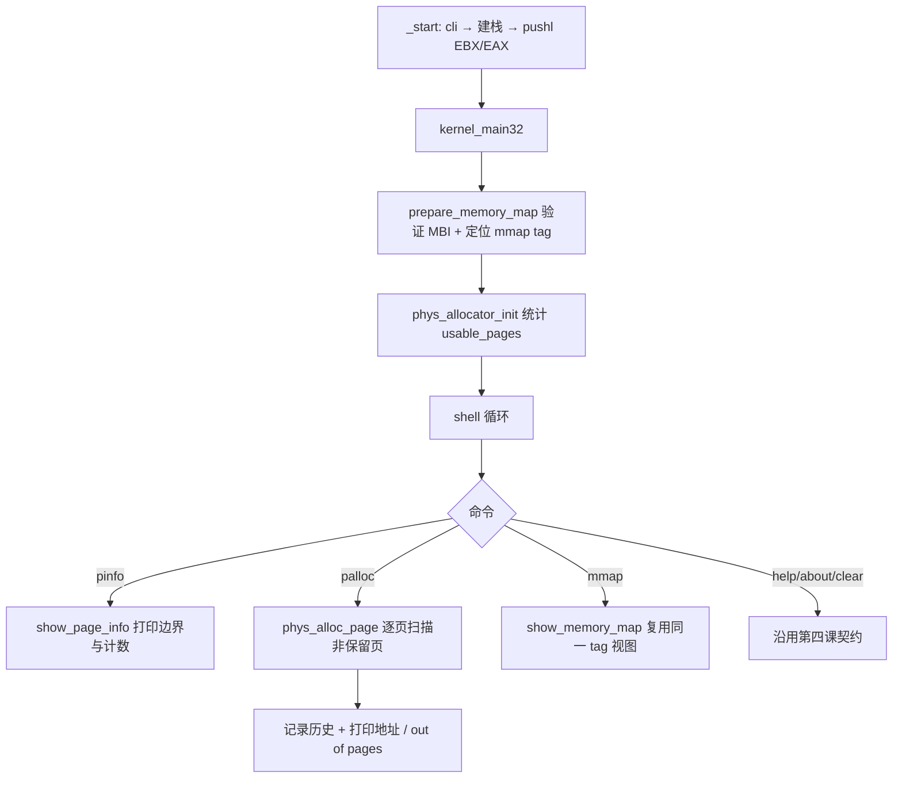

# Lesson 06: 早期保留感知的物理页分配器 — 精讲文档

> **课号**：Lesson 06（可执行课）
> **本课主题**：在第五课的原始 Multiboot2 memory map 上，实现 reservation-aware 的 4 KiB 物理页选择器：从 type-1 `available` 范围里排除低端平台、内核镜像、临时栈与 MBI 所占页，用 `palloc` 命令返回可见的物理页地址。
> **课程主线位置**：第一阶段「启动链与基础输出」的第 6 个可执行内核课，是「内存管理」的第一课；分页（Lesson 07）、long mode（Lesson 08）所需的页表内存都将用本课的分配规则获得。
> **前置课程**：[`../lesson-05-stable/README.md`](../lesson-05-stable/README.md)
> **后续课程**：[`../lesson-07-stable/README.md`](../lesson-07-stable/README.md)
> **本课一句话目标**：学完本课你能从原始内存图中选出「确定未被使用」的 4 KiB 物理页，并理解为什么 type-1 只是候选、保留集合才是真相。

## 1. 课程定位（Mission）

- **一句话目标**：学完本课你能实现一个只分配、不 free、只记账、绝不写返回页的最小物理页分配器，并让 `palloc`/`pinfo` 在 VGA 上证明「每次返回的页都在所有已知保留范围之外」。
- **课程主线中的位置**：第五课让 TinyOS「看到了地图」；本课让 TinyOS「拥有了地图的使用权规则」。内核、栈、MBI 这类自占内存第一次显式进入一个统一保留谓词（reservation predicate），这是所有后续内存管理的基石——页表、堆、用户空间的内存都从这里来。
- **前置知识清单**：
  1. Lesson 05 的 MBI 校验与 tag walker（`prepare_memory_map` 直接沿用其检查逻辑）；
  2. Multiboot2 type-1 `available` 语义与 entry 布局（`u64 addr, u64 len, u32 type, u32 reserved`）；
  3. 4 KiB 页与地址对齐：`(x + 0xfff) & ~0xfff` 向上对齐、`x & ~0xfff` 向下对齐；
  4. 半开区间 `[start, end)` 与区间相交判断；
  5. 链接脚本符号导出（`_kernel_start`/`_kernel_end`/`stack_bottom`/`stack_top`）与 C 侧 `extern char name[]`。
- **本课交付（可见结果）**：`pinfo` 显示页大小、kernel/stack/MBI 三个保留边界与 usable/allocated 计数；连续多次 `palloc` 返回非零、4 KiB 对齐、严格递增、位于 1 MiB 之上且不落在保留区间的地址。

## 2. 核心概念精讲

### 2.1 半开区间与保留谓词（reservation predicate）

**定义**：所有物理范围一律用半开区间 `[start, end)` 表示：起点属于该范围，终点不属于。两个区间相交当且仅当 `first_start < second_end && second_start < first_end`。保留谓词 `page_is_reserved(page)` 用这个判定检查「一页 `[page, page+0x1000)` 是否与下列任一保留范围重叠」：

```text
[0, 1 MiB)                            ← 低端平台/实模式/BIOS 区域
[_kernel_start, _kernel_end)          ← 内核镜像（含 Multiboot2 header、代码、rodata、data、bss）
[stack_bottom, stack_top)             ← _start 的 16 KiB 引导栈
[MBI address, MBI address + total_size)  ← GRUB 的 boot-information structure
已返回的历史页                        ← 防 raw map 未排序/重叠时重复分配
```

**为什么需要（动机）**：第五课的「available」只是「没有硬件占用」，内核自己却正占用着 1 MiB 起的镜像与栈、MBI 也占着一块 RAM。不排除这些页，`palloc` 就可能把内核正在执行的代码页或栈页交出去，第一次写新页就会崩溃。低 1 MiB 的保守保留还顺带保证了 VGA 文本缓冲页 `0xb8000` 永远不会被分配。

### 2.2 页对齐：向上与向下收缩候选范围

**定义**：`align_up_page(x)` 把 `x` 向上对齐到 4 KiB 边界，`align_down_page(x)` 向下对齐。对每个 type-1 entry，候选范围被向内收缩为 `[align_up(addr), align_down(addr + len))`。

**为什么需要（动机）**：返回给调用者的页必须「完整落在 available 范围内」，而不是只占一部分。收缩保证任何返回页的所有 4096 字节都属于可分配区域；同时对对齐加法做溢出防护（`align_up_page` 在 `value > ~0ULL - 0xfff` 时返回 0）。

### 2.3 只分配、绝不写入（address-only contract）

**定义**：本课分配器返回的是「页的地址」本身，而不是被初始化的内存。`palloc` 只把地址记录进 `allocation_history` 并打印，**绝不写入该页的任何字节**。

**为什么需要（动机）**：教学上把「拥有地址」与「使用内存」分离：在还没有页表、不知道物理地址在虚拟地址空间里的映射位置之前，贸然写入物理地址是危险的。这个契约也允许分配器自身安全地维护 `allocation_history` 这样的元数据——它记的是地址，不碰返回页。

### 2.4 链接脚本导出边界符号

**定义**：`linker.ld` 在 `1M` 起点放 `_kernel_start = .`，在 `.bss`/`COMMON` 之后放 `_kernel_end = .`；`boot.S` 用 `.globl stack_bottom/.globl stack_top` 导出栈边界。C 侧 `extern char _kernel_start[], _kernel_end[], stack_bottom[], stack_top[];` 取它们的地址。

**为什么需要（动机）**：分配器必须知道「内核到底占了哪一段物理内存」，但这只能由链接器在布局完成后确定。把符号导出给 C，`page_is_reserved` 就能在运行时读真实边界——不用硬编码地址，镜像布局变化时保留逻辑自动跟随。

## 3. 源码精讲

### 3.1 文件清单与职责

| 文件 | 职责 | 本课增量（相对上一课） |
|---|---|---|
| `boot.S` | Multiboot2 header、`_start` 传参、16 KiB 引导栈 | **小增量**：新增 `.globl stack_bottom` / `.globl stack_top` 导出 |
| `kernel.c` | 共享 MBI 校验 + 保留谓词 + 页分配器 + `palloc`/`pinfo` | **主增量**：3 宏、4 extern、6 全局、10 新函数；重构 `prepare_memory_map` |
| `linker.ld` | 镜像段布局 | **增量**：新增 `_kernel_start = .` 与 `_kernel_end = .` |
| `Makefile` | 编译/链接/ISO/check/run/clean | 未变化 |
| `grub.cfg` | GRUB 菜单项 | 微小变化：菜单标题改为 `TinyOS lesson 6` |

### 3.2 kernel.c — 分配器精讲

#### 3.2.1 新增宏与 extern

```c
#define PAGE_SIZE 0x1000ULL
#define LOW_MEMORY_END 0x00100000ULL
#define ALLOCATION_HISTORY_MAX 64

extern char _kernel_start[], _kernel_end[], stack_bottom[], stack_top[];
```
- `PAGE_SIZE 0x1000ULL`：**新增**，4 KiB 页大小；用 `ULL` 保证与 `u64` 运算不截断。
- `LOW_MEMORY_END 0x00100000ULL`：**新增**，低端保留区终点 1 MiB（legacy reservation）。
- `ALLOCATION_HISTORY_MAX 64`：**新增**，分配历史数组容量，也是本课分配次数上限（无 free）。
- 四个 extern：**新增**，从链接脚本/boot.S 引入镜像与栈边界符号（`_kernel_start` 覆盖 Multiboot2 header、`.text`、`.rodata`、`.data`、`.bss` 全程）。

#### 3.2.2 新增全局状态

```c
static u32 multiboot_magic, multiboot_address, multiboot_total_size;
static const struct mb2_mmap_tag *memory_map;
static int memory_map_ready;
static u64 allocation_cursor, allocation_end, allocation_history[ALLOCATION_HISTORY_MAX];
static u32 allocated_pages, usable_pages;
```
- `multiboot_total_size`：**新增**，MBI 总大小，用于算 MBI 保留区间终点。
- `memory_map`（指向 type-6 tag 的指针）与 `memory_map_ready`：**新增**，一次验证后缓存 mmap tag 与就绪标志，供 `mmap` 命令和分配器共用。
- `allocation_cursor`/`allocation_end`：**新增**，当前扫描 entry 内「下一候选页」的位置与终点。
- `allocation_history[64]`/`allocated_pages`：**新增**，已分配页地址账本与计数。
- `usable_pages`：**新增**，启动时统计的可分配页总数（仅 type-1、页对齐、非保留）。

#### 3.2.3 prepare_memory_map — 共享的 MBI 验证

```c
static int prepare_memory_map(void)
{
    u32 pos, end;
    if (memory_map_ready) return 1;
    if (multiboot_magic != MB2_BOOT_MAGIC || (multiboot_address & 7) != 0) return 0;
    multiboot_total_size = *(const u32 *)(unsigned long)multiboot_address;
    if (multiboot_total_size < 16 || multiboot_total_size > 0x100000 || multiboot_address + multiboot_total_size < multiboot_address) return 0;
    pos = multiboot_address + 8; end = multiboot_address + multiboot_total_size;
    while (pos < end) {
        const struct mb2_tag *tag; u32 rounded;
        if (end - pos < 8) return 0;
        tag = (const struct mb2_tag *)(unsigned long)pos;
        if (tag->size < 8 || tag->size > end - pos) return 0;
        if (tag->type == MB2_TAG_END) { if (tag->size != 8 || memory_map == 0) return 0; memory_map_ready = 1; return 1; }
        if (tag->type == MB2_TAG_MMAP && memory_map == 0) {
            const struct mb2_mmap_tag *map = (const struct mb2_mmap_tag *)tag;
            if (tag->size < 16 || map->entry_version != 0 || map->entry_size < 24 || (map->entry_size & 7) != 0 || ((tag->size - 16) % map->entry_size) != 0) return 0;
            memory_map = map;
        }
        rounded = (tag->size + 7) & ~7U;
        if (rounded < tag->size || rounded > end - pos) return 0;
        pos += rounded;
    }
    return 0;
}
```
- **签名与职责**：`static int prepare_memory_map(void)`，把第五课 `show_memory_map` 里的整套校验提取为共享路径：成功返回 1 并缓存 `memory_map` 指针与 `multiboot_total_size`，任何失败返回 0。
- **幂等性**：`if (memory_map_ready) return 1;` 保证整条 tag 链只完整走一次；后续 `mmap`/`palloc`/`pinfo`/`phys_allocator_init` 共用同一已验证视图，避免「两份不一致的解析器」。
- **保留的检查**：magic、MBI 8 字节对齐、`total_size ∈ [16, 1M]` 且不溢出、每 tag 的剩余字节/size 合法性、end tag 必须 `size == 8` 且之前已找到 mmap、mmap tag 的 `entry_version == 0`/`entry_size >= 24`/8 对齐/整除、对齐步长不溢出不越界。失败不再打印错误（调用方按各自命令打印），返回 0。

#### 3.2.4 几何与查询助手

```c
static u64 align_up_page(u64 value) { if (value > ~0ULL - (PAGE_SIZE - 1)) return 0; return (value + PAGE_SIZE - 1) & ~(PAGE_SIZE - 1); }
static u64 align_down_page(u64 value) { return value & ~(PAGE_SIZE - 1); }
static int ranges_overlap(u64 first_start, u64 first_end, u64 second_start, u64 second_end) { return first_start < second_end && second_start < first_end; }
static int page_was_allocated(u64 page) { u32 index; for (index = 0; index < allocated_pages; index++) if (allocation_history[index] == page) return 1; return 0; }
```
- `align_up_page`：**新增**。`(value + 0xfff) & ~0xfff` 向上取整到页；前置溢出检查：若 `value > ~0ULL - 0xfff`，加法会回绕，返回 0（0 被分配器当作「非法页」哨兵）。
- `align_down_page`：**新增**。`value & ~0xfff` 向下取整，无溢出风险。
- `ranges_overlap`：**新增**。半开区间相交公式 `first_start < second_end && second_start < first_end`，是 `page_is_reserved` 的核心判断。
- `page_was_allocated`：**新增**。线性扫描历史数组，判某页是否已被分配。`ALLOCATION_HISTORY_MAX = 64` 使其代价可接受；它也服务于「raw map 未排序/重叠时防重复返回」这一边界情况。

#### 3.2.5 page_is_reserved — 保留谓词

```c
static int page_is_reserved(u64 page)
{
    u64 page_end = page + PAGE_SIZE;
    u64 kernel_start = (u64)(u32)(unsigned long)_kernel_start, kernel_end = (u64)(u32)(unsigned long)_kernel_end;
    u64 stack_start = (u64)(u32)(unsigned long)stack_bottom, stack_end = (u64)(u32)(unsigned long)stack_top;
    u64 mbi_start = multiboot_address, mbi_end = mbi_start + multiboot_total_size;
    if (page_end < page || ranges_overlap(page, page_end, 0, LOW_MEMORY_END)) return 1;
    if (ranges_overlap(page, page_end, kernel_start, kernel_end)) return 1;
    if (ranges_overlap(page, page_end, stack_start, stack_end)) return 1;
    if (ranges_overlap(page, page_end, mbi_start, mbi_end)) return 1;
    if (allocated_pages != 0 && page <= allocation_history[allocated_pages - 1]) return 1;
    return page_was_allocated(page);
}
```
- **签名与职责**：`static int page_is_reserved(u64 page)`，回答「这页能分吗」。返回 1 = 保留（不可分），0 = 可分配。
- **四条硬保留**：`page + PAGE_SIZE` 溢出、与 `[0, 1 MiB)` 相交（顺带保护 `0xb8000` VGA 页）；与内核镜像相交；与引导栈相交；与 MBI 相交。边界符号/变量全部在运行时解析，不写死地址。
- **两条分配历史规则**：(1) `page <= allocation_history[allocated_pages - 1]`——本课单调向上扫描，任何「低于等于最近一次分配页」的候选都不可能是新页；(2) `page_was_allocated(page)` 全表复查，兜底未排序/重叠 map。
- **为什么这样设计**：对照 Linux，memblock 会先把 map 排序合并再维护「reserved regions」数组；本课不排序、不建表，用「每候选页 × 每个保留区间」的逐页判断，配合小历史数组达到同等安全。

#### 3.2.6 map_entry_at / phys_allocator_init

```c
static const struct mb2_mmap_entry *map_entry_at(u32 offset) { return (const struct mb2_mmap_entry *)((const unsigned char *)memory_map + 16 + offset); }
static void phys_allocator_init(void)
{
    u32 offset;
    if (!prepare_memory_map()) return;
    for (offset = 0; offset < memory_map->size - 16; offset += memory_map->entry_size) {
        const struct mb2_mmap_entry *entry = map_entry_at(offset); u64 page, end;
        if (entry->type != 1 || entry->addr + entry->len < entry->addr) continue;
        page = align_up_page(entry->addr); end = align_down_page(entry->addr + entry->len);
        while (page != 0 && page < end) { if (!page_is_reserved(page)) usable_pages++; page += PAGE_SIZE; }
    }
}
```
- `map_entry_at`：**新增**，按 `memory_map + 16 + offset` 定位第 `offset/entry_size` 个 entry——所有后续访问都以此前进，**绝不用 `sizeof(struct mb2_mmap_entry)` 步进**（延续第五课的纪律）。
- `phys_allocator_init`：**新增**，启动时统计 `usable_pages`。遍历每个 type-1 entry（`addr + len < addr` 的溢出 entry 跳过），把范围向内对齐后逐页调用 `page_is_reserved` 计数。`usable_pages` 是 `pinfo` 的输出项，也为「是否有页可分」提供全局视野。

#### 3.2.7 phys_alloc_page — 分配一页

```c
static u64 phys_alloc_page(void)
{
    u32 offset;
    if (!prepare_memory_map() || allocated_pages == ALLOCATION_HISTORY_MAX) return 0;
    if (allocation_cursor != 0) {
        while (allocation_cursor < allocation_end) {
            u64 page = allocation_cursor; allocation_cursor += PAGE_SIZE;
            if (!page_is_reserved(page)) { allocation_history[allocated_pages++] = page; return page; }
        }
    }
    for (offset = 0; offset < memory_map->size - 16; offset += memory_map->entry_size) {
        const struct mb2_mmap_entry *entry = map_entry_at(offset); u64 page, end;
        if (entry->type != 1 || entry->addr + entry->len < entry->addr) continue;
        page = align_up_page(entry->addr); end = align_down_page(entry->addr + entry->len);
        while (page != 0 && page < end) {
            if (!page_is_reserved(page)) { allocation_cursor = page + PAGE_SIZE; allocation_end = end; allocation_history[allocated_pages++] = page; return page; }
            page += PAGE_SIZE;
        }
    }
    return 0;
}
```
- **签名与职责**：`static u64 phys_alloc_page(void)`，返回一个新的非保留 4 KiB 页地址；失败（map 无效或历史满）返回 0。
- **快速路径**：`allocation_cursor != 0` 时从上次停留处继续向上扫描，命中即记录并返回——保证连续 `palloc` 单调递增。
- **完整扫描**：快速路径耗尽当前 entry 后，从头遍历所有 type-1 entry，找到第一个非保留页就把 `allocation_cursor`/`allocation_end` 锚定在该 entry 并返回。
- **记账**：每次成功都 `allocation_history[allocated_pages++] = page`，使后续调用能通过 `page_is_reserved` 的历史规则拒绝重复。
- **边界**：`allocated_pages == ALLOCATION_HISTORY_MAX` 时返回 0（`palloc: out of pages`）——本课无 free，64 次即上限；地址 0 作为哨兵，绝不被分配（低 1 MiB 已整段保留）。

#### 3.2.8 show_memory_map / show_page_info

```c
static void show_memory_map(void)
{
    u32 offset, displayed = 0, entries = 0;
    if (!prepare_memory_map()) { printk("mmap error: invalid multiboot2 map\n"); return; }
    printk("Multiboot2 memory map:\n");
    for (offset = 0; offset < memory_map->size - 16; offset += memory_map->entry_size) {
        const struct mb2_mmap_entry *entry = map_entry_at(offset);
        if (displayed < MB2_MMAP_DISPLAY_MAX) { print_mmap_entry(entries, entry); displayed++; }
        entries++;
    }
    printk("shown "); print_two_digits(displayed); printk(" of "); print_two_digits(entries); printk(" entries\n");
}
static void show_page_info(void)
{
    if (!prepare_memory_map()) { printk("pinfo error: invalid multiboot2 map\n"); return; }
    printk("page size: "); print_hex32((u32)PAGE_SIZE); vga_putc('\n');
    printk("kernel: "); print_hex64((u64)(u32)(unsigned long)_kernel_start); printk(" - "); print_hex64((u64)(u32)(unsigned long)_kernel_end); vga_putc('\n');
    printk("stack:  "); print_hex64((u64)(u32)(unsigned long)stack_bottom); printk(" - "); print_hex64((u64)(u32)(unsigned long)stack_top); vga_putc('\n');
    printk("mbi:    "); print_hex64(multiboot_address); printk(" - "); print_hex64((u64)multiboot_address + multiboot_total_size); vga_putc('\n');
    printk("usable pages: "); print_hex32(usable_pages); vga_putc('\n');
    printk("allocated pages: "); print_hex32(allocated_pages); vga_putc('\n');
}
```
- `show_memory_map`：第五课的显示逻辑改为调用 `prepare_memory_map()` + `map_entry_at(offset)` 遍历；失败统一报 `mmap error: invalid multiboot2 map`。展示路径与分配路径共用同一 tag 视图。
- `show_page_info`：**新增**，`pinfo` 命令的输出：页大小（`00001000`）、kernel 起止、stack 起止、mbi 起止（均为 16 位十六进制）、`usable pages` 与 `allocated pages`（8 位十六进制计数）。它把「分配器看到的世界」完整摊开在屏幕上，是核验保留逻辑的主要手段。

#### 3.2.9 execute_command 与 kernel_main32

```c
    if (command_equals("help")) { printk("commands: help about clear mmap pinfo palloc\n"); return 0; }
    if (command_equals("about")) { printk("TinyOS lesson 6: early physical page allocator\n"); return 0; }
    if (command_equals("clear")) { vga_clear(); print_prompt(); return 1; }
    if (command_equals("mmap")) { show_memory_map(); return 0; }
    if (command_equals("pinfo")) { show_page_info(); return 0; }
    if (command_equals("palloc")) { page = phys_alloc_page(); if (page == 0) printk("palloc: out of pages\n"); else { printk("palloc: "); print_hex64(page); vga_putc('\n'); } return 0; }
```
- **新增** `pinfo`、`palloc` 两个命令分支；`help` 命令表改为 `commands: help about clear mmap pinfo palloc`；`about` 更新为 `TinyOS lesson 6: early physical page allocator`。
- `palloc` 用哨兵 0 区分「成功/失败」：成功打印 `palloc: <16 位十六进制地址>`，失败打印 `palloc: out of pages`。
- `kernel_main32` 启动时先 `if (prepare_memory_map()) phys_allocator_init(); else printk("warning: Multiboot2 map is invalid\n");`——进入 shell 前就把 map 验证好、usable 计数算好；顶部说明更新为 `TinyOS lesson 6: early physical page allocator` 与 `Commands: help about clear mmap pinfo palloc. Allocations are address-only.`。

### 3.3 boot.S — 栈边界导出

```asm
.section .bss
.align 16
.globl stack_bottom
.globl stack_top
stack_bottom:
.skip 16384
stack_top:
```
- **新增** `.globl stack_bottom` / `.globl stack_top`：把引导栈的物理地址范围导出为全局符号，供 C 侧 `extern char stack_bottom[], stack_top[]` 引用并加入保留谓词。
- 其余（header、information-request tag、`pushl %ebx; pushl %eax` 传参、`hlt` 循环）与第五课逐字节相同。

### 3.4 linker.ld — 镜像边界导出

```ld
	. = 1M;
	_kernel_start = .;

	.multiboot ALIGN(8) : {
		KEEP(*(.multiboot))
	}

	.text ALIGN(16) : { *(.text .text.*) }
	.rodata ALIGN(16) : { *(.rodata .rodata.*) }

	/* 把可写段移到新页，避免生成 RWX 的 PT_LOAD 段。 */
	. = ALIGN(CONSTANT(MAXPAGESIZE));
	.data ALIGN(16) : { *(.data .data.*) }
	.bss ALIGN(16) : {
		*(.bss .bss.*)
		*(COMMON)
	}
	_kernel_end = .;
```
- `_kernel_start = .`：**新增**，赋值在 `. = 1M` 之后、`.multiboot` 段之前，即镜像物理起点。
- `_kernel_end = .`：**新增**，放在 `.bss` 与 `*(COMMON)` 收尾之后，因此 `[_kernel_start, _kernel_end)` 覆盖 header、代码、只读/可写数据与 BSS（含 16 KiB 引导栈）。
- 两处符号都只定义不参与布局，链接器把它们解析为可寻址地址，C 侧取址即得物理边界。

### 3.5 构建管线（Makefile / linker）

`Makefile` 与 `grub.cfg` 之外构建文件无变化；`grub.cfg` 仅菜单标题改为 `TinyOS lesson 6`。本课新增代码全部是纯 C 运算，无 libc。构建后可用如下只读命令核验符号与段权限（抄录自旧 README）：

```bash
readelf -sW build/kernel.elf | grep -E '_kernel_(start|end)|stack_(bottom|top)'
readelf -lW build/kernel.elf
```

- 符号表应含 `_kernel_start`、`_kernel_end`、`stack_bottom`、`stack_top`；
- program headers 应为分离的 `R E` 与 `RW` LOAD 段，**不应**重新出现 RWX 段（`linker.ld` 中 `. = ALIGN(CONSTANT(MAXPAGESIZE))` 分隔可写段的作用）。

### 3.6 主控制流



## 4. 数据流与运行逻辑

- GRUB 传 `(magic, mbi_address)` → `prepare_memory_map` 校验并缓存 `memory_map`/`multiboot_total_size` → `phys_allocator_init` 逐 entry 统计可用页。
- `palloc` 请求到达 `phys_alloc_page`：优先从 `allocation_cursor` 继续向上扫描，否则全 map 扫描；每页过 `page_is_reserved`（低 1 MiB / 内核 / 栈 / MBI / 历史页五类判断），命中即入账返回。
- `pinfo` 把 `_kernel_start.._kernel_end`、`stack_bottom..stack_top`、`mbi..mbi+size` 三个保留区间与两个计数打上屏幕——它们正是 `page_is_reserved` 前四条判断的真实边界。
- 具体到验证记录：`_kernel_start=0x00100000`、`stack_bottom=0x00102000`、`stack_top=0x00106000`、`_kernel_end=0x001062a8`；MBI 终点落在 0x117000 之前的某个页边界，因此第一次 `palloc` 返回 `0000000000117000`，其后每次 `+0x1000`（`118000`、`119000`），单调递增且全部高于 1 MiB、避开全部保留区间。

## 5. 构建、运行与验证

### 5.1 依赖

同前五课：`build-essential gcc-multilib grub-pc-bin xorriso mtools qemu-system-x86`。

### 5.2 构建与静态检查

```bash
make clean && make -j"$(nproc)"
make check
readelf -sW build/kernel.elf | grep -E '_kernel_(start|end)|stack_(bottom|top)'
readelf -lW build/kernel.elf
```

- `make check` 必须输出（抄录自 Makefile）：`Multiboot2 header check passed.`
- 符号检查：四个边界符号必须存在；`readelf -lW` 不应出现 RWX LOAD 段。

### 5.3 运行与画面验证

```bash
make run
```

**成功画面在 QEMU 图形窗口，勿加 `-display none`**。为确定性可固定内存大小（旧 README 推荐方式）：

```bash
qemu-system-x86_64 -accel tcg -m 128M -boot order=d \
  -cdrom build/kernel.iso -serial stdio -no-reboot -no-shutdown
```

输入：

```text
pinfo<Enter>
palloc<Enter>
palloc<Enter>
palloc<Enter>
mmap<Enter>
help<Enter>
about<Enter>
```

- 三个 `palloc` 地址必须：非零、16 位十六进制、4 KiB 对齐、递增，且都不低于 1 MiB、不与 `pinfo` 显示的 kernel/stack/MBI 区间相交；
- 第一次 `pinfo` 的 `allocated pages` 应为 `00000000`，三次 `palloc` 成功后应为 `00000003`；
- `mmap`、`help`、`about` 必须仍正常工作。`help` 输出 `commands: help about clear mmap pinfo palloc`，`about` 输出 `TinyOS lesson 6: early physical page allocator`（逐字抄录自 `kernel.c`）。

### 5.4 实际验证记录（保留自旧 README）

> **本次实际验证记录（2026-08-01）**：已执行零警告 `make clean && make -j$(nproc)` 与 `make check`，后者输出 `Multiboot2 header check passed.`。符号检查得到 `_kernel_start=0x00100000`、`stack_bottom=0x00102000`、`stack_top=0x00106000`、`_kernel_end=0x001062a8`；`readelf -lW` 显示分离的 `R E` 与 `RW` LOAD segments，未出现 RWX。以 `-m 128M` 启动正常 QEMU VGA，依次执行 `pinfo`、三次 `palloc`、`mmap`、`help`、`about`；三次返回 `0000000000117000`、`0000000000118000`、`0000000000119000`，均为 4 KiB 对齐，按 `0x1000` 单调递增，位于 1 MiB 以上且不在上述 kernel、stack、MBI reservation 中；兼容命令输出正常。

## 6. 调试地图

| 现象 | 对照来源 | 检查 |
|---|---|---|
| 返回 `0x000b8000` 或小于 1 MiB | legacy platform reservation | `page_is_reserved()` 必须拒绝 `[0, 0x00100000)`。 |
| 覆盖自己后随机崩溃 | linker / early stack ownership | 检查 `_kernel_start/_kernel_end` 与 `stack_bottom/stack_top` 是否导出且参与 predicate。 |
| `mmap` 后 `palloc` 失效 | Multiboot2 MBI lifetime | 保留完整 `[mbi, mbi + total_size)`，并共用已验证 tag walker。 |
| 地址不是 `0x1000` 对齐 | page allocation rule | range start 上对齐、end 下对齐；返回前不应丢失低 12 bits。 |
| 高地址 wrap 成低地址 | u64 range arithmetic | 检查 `addr + len < addr` 和对齐加法溢出。 |
| 重叠 map 中重复返回一页 | raw firmware-map boundary | 历史页拒绝重复；Linux 会先在 `e820.c` 规范化，TinyOS 尚未做。 |
| available 直接当作安全页 | `e820.c` / `memblock.c` | type-1 只是候选；必须扣除所有已知 reservation。 |
| `palloc: out of pages` | allocator capacity | 可用页耗尽或超过本课 64 条历史记录；本课无 free。 |
| 把地址当虚拟地址写入 | paging boundary | 本课未分页，且刻意不写新页；未来 paging 后必须区分 physical/virtual。 |
| future module/framebuffer 被覆盖 | reservation model boundary | 请求/使用新 Multiboot2 tag 前先将它的物理范围加入 predicate。 |
| MBI tag 错位 | Multiboot2 map format | 必须以 runtime `entry_size` 步进，不能用 `sizeof(struct mb2_mmap_entry)`。 |

## 7. 与 Linux 源码对照

- **map 规范化**：TinyOS 直接扫描 raw firmware map；Linux `arch/x86/kernel/e820.c` 的 `e820__update_table()`/`e820__range_update()`/`e820__range_remove()` 会先排序、合并、裁剪重叠，`e820__memblock_setup()` 再交 memblock。本课靠 `page_is_reserved` 的历史检查兜底未排序/重叠。
- **保留机制**：TinyOS 的 `page_is_reserved` 对应 `mm/memblock.c` 的 `memblock_reserve()`；TinyOS 的 `phys_alloc_page` 对应 `memblock_alloc_range_nid()`。memblock 用「按 4 KiB（或更大对齐）搜索空闲区、分配后立即标记 reserved」的模型，与「每候选页过保留谓词」在语义上等价；本课无 free、无 bitmap、无 NUMA/DMA zone。
- **镜像边界**：`_kernel_start`/`_kernel_end` 对照 Linux `arch/x86/kernel/vmlinux.lds.S` 导出的镜像布局边界；TinyOS 用它们做物理保留，Linux 用它生成内核镜像映射。
- **权威来源**：Multiboot2 规范 / GNU GRUB（type-6 memory-map tag、type-1 usable range、EAX/EBX ABI）；Linux v6.12 源码仅作工程对照。

## 8. 思考题与练习

1. **概念理解**：为什么 `phys_alloc_page` 里 `allocated_pages == ALLOCATION_HISTORY_MAX` 时直接返回 0（`out of pages`），而不是继续分配？
2. **源码定位**：`page_is_reserved` 中有四类「范围保留」和两类「历史保留」；分别指出它们防御哪些具体故障（对照调试地图中的行）。
3. **动手实验**：把 `LOW_MEMORY_END` 改为 `0x000a0000ULL` 再运行 `palloc`，观察是否可能返回 `0xb8000` 附近的页，说明为什么这是危险的。
4. **动手实验**：给 `palloc` 连续分配 65 次（超过 `ALLOCATION_HISTORY_MAX`），确认第 65 次打印 `palloc: out of pages`。
5. **Linux 对照**：阅读 `linux-v6.12/mm/memblock.c` 的 `memblock_reserve()` 与 `memblock_alloc_range_nid()`，列出它们比本课单一谓词多出来的至少 3 种能力。

## 9. 本课小结与下一课预告

- 本课建立了早期物理页分配器：4 KiB 页、单调扫描、只分配不 free、绝不写入返回页。
- 用 `PAGE_SIZE`/`LOW_MEMORY_END`/`ALLOCATION_HISTORY_MAX` 三个宏与 `allocation_history` 账本把「页所有权」变成可验证状态。
- `prepare_memory_map` 把第五课校验重构为共享路径，`mmap`/`palloc`/`pinfo` 共用同一 tag 视图。
- `page_is_reserved` 用半开区间相交统一处理低 1 MiB、内核镜像、引导栈、MBI 与历史页五类保留，链接脚本/boot.S 导出的四个边界符号让保留逻辑随布局自动更新。
- 新增 `pinfo`/`palloc` 命令与 `phys_allocator_init`/`phys_alloc_page`/`show_page_info` 等函数，验证记录逐项核验了三次分配的地址、对齐与单调性。
- 明确了与 Linux memblock 的边界：无 free、无 bitmap、无排序合并、无 NUMA/DMA zone。
- 下一课 [**Lesson 07**](../lesson-07-stable/README.md) 将建立最小 32 位 identity paging：页目录/页表本身的物理页就用本课的分配规则获得，再映射到明确的虚拟地址——届时「物理地址」与「虚拟地址」正式分开。
