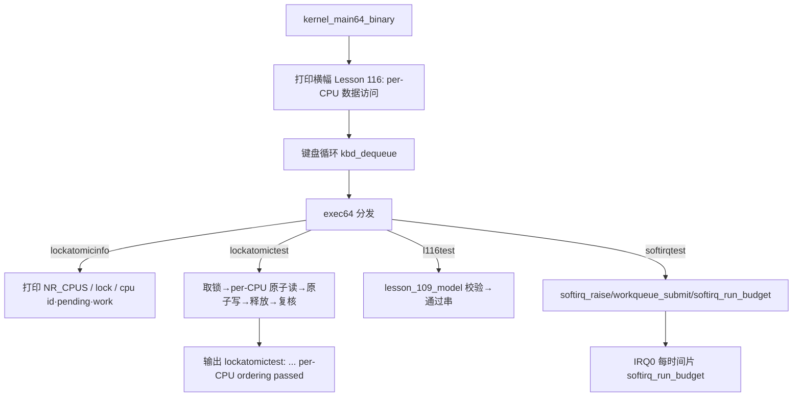

# Lesson 116: per-CPU 数据访问 — 精讲文档

> **课号**：Lesson 116（统一课程编号 116）
> **主题**：per-CPU 数据访问（每个 CPU 一份的私有数据区）
> **课程主线位置**：第 12 阶段「并发、SMP 与 RCU 检查点序列」中的检查点课，紧接 Lesson 115 的信号量与等待队列并发
> **前置课程**：[Lesson 115 信号量与等待队列并发](../lesson-115-stable/README.md)
> **后续课程**：[Lesson 117 竞态窗口与屏障](../lesson-117-stable/README.md)
> **一句话目标**：说清「为什么并发系统要把频繁改写的计数拆成每 CPU 一份」，并能在本课源码里指出 `cpu_local`/`this_cpu()`/`NR_CPUS` 的角色与读写路径。

---

## 1. 课程定位（Mission）

- **一句话目标**：学完本课你能解释 per-CPU 数据的动机（消除缓存行竞争与锁竞争），并能在 `kernel64.c` 中指出 `struct cpu_local` 每个字段的含义、`this_cpu()` 的实现、`lockatomicinfo`/`lockatomictest` 如何验证 per-CPU 字段的原子读写。
- **在课程主线中的位置**：本课处于并发/SMP 主题的检查点课序列中。上一课（115）用信号量与等待队列演示了线程间的阻塞/唤醒；本课把关注点从「线程间共享」转向「线程各自的数据隔离」——这是 SMP 内核必备的一招：让每个 CPU 访问自己的副本，从而无需全局锁。下一课（117）继续沿「并发正确性」主线讲竞态窗口与内存屏障。
- **前置知识清单**：
  1. 全局原子操作族 `atomic_load_relaxed_u8` / `atomic_store_release_u8` / `atomic_exchange_acquire_u32` 与 acquire/release/relaxed 内存序（来自 Lesson 114 原子操作与内存序）；
  2. `irq_save64()`/`irq_restore64()` 与 `raw_spin_lock_irqsave`/`unlock_irqrestore` 的关中断自旋锁；
  3. 软中断模型：`softirq_raise`、`tasklet_schedule`、`workqueue_submit`、`softirq_run_budget`（softirq_pending 位图）；
  4. `NR_CPUS`、缓存行与伪共享（false sharing）的基本概念。
- **本课交付**（可见结果）：
  - 新检查点命令 `l116test`（`lesson_109_model` 校验）；
  - `lockatomicinfo` 输出本课 per-CPU 状态：`NR_CPUS`、锁、`cpu id/pending/work`；
  - `lockatomictest` 走一遍「取锁 → per-CPU 原子读 → 原子写 → 释放锁 → 复核」的确定性验证；
  - 启动横幅与 `about` 命令均标注本课主题 `per-CPU 数据访问`。

---

## 2. 核心概念精讲

### 2.1 为什么需要 per-CPU 数据

**定义**：per-CPU 数据指「每个 CPU 各持有一份、只用自己那份」的数据结构，读改写都不涉及别的 CPU 的副本。

**动机**（教科书三连）：
1. **锁竞争**：一个全局计数器被 8 个 CPU 每秒原子加一万次，所有 CPU 都在争同一把锁或同一条原子指令——吞吐量被串行化；
2. **缓存行伪共享**：即使不同 CPU 各写不同变量，只要它们落在同一条缓存行（64 字节），x86 的缓存一致性协议（MESI）也会让整条行在 CPU 间反复失效（invalidates），性能退化为广播；
3. **局部性**：per-CPU 数据通常只被本 CPU 的中断/软中断/进程访问，天然热点本地化。

**机制示意**（`NR_CPUS=1` 时最简形态）：

```
全局（有锁）                 per-CPU（无锁）
+------------------+         +------------------+
| count  <- 所有CPU |         | cpu_locals[0]   <- CPU0 专用
+------------------+         | cpu_locals[1]   <- CPU1 专用(本例未启用)
                             +------------------+
```

### 2.2 `struct cpu_local` 与 `this_cpu()`

本课实现：

```c
#define NR_CPUS 1U
struct cpu_local { u8 id,softirq_pending,work_head,work_tail,work_used; };
static struct cpu_local cpu_locals[NR_CPUS];
static TEXT64 struct cpu_local *this_cpu(void){return &cpu_locals[0];}
```

- `cpu_locals[NR_CPUS]` 是一块**编译期定长数组**，用 CPU 号做下标，即最朴素的 per-CPU 存储；
- `this_cpu()` 在 Linux 中返回「当前执行 CPU」的 per-CPU 区域指针（x86 上经 `%gs` 段基址偏置得到），本课只有 CPU0，所以直接返回 `&cpu_locals[0]`；
- 字段设计：`id` 是 CPU 编号；`softirq_pending` 是本 CPU 待处理的软中断位图；`work_head/work_tail/work_used` 是本 CPU 工作队列的环形指针——注意这些字段与全局变量 `work_head/work_tail/work_used`（`workqueue_submit` 实际使用的那组）互为镜像，教学上故意保留两套以展示「该 per-CPU 化的字段」。

### 2.3 per-CPU 字段的原子访问与内存序

per-CPU 化并不等于「可以裸读裸写」：本 CPU 的中断上下文（IRQ0/IRQ1）会与本 CPU 的线程上下文并发，所以仍然需要原子与顺序约束：

```c
static TEXT64 u8 atomic_load_relaxed_u8(volatile u8*p){return __atomic_load_n(p,__ATOMIC_RELAXED);}
static TEXT64 void atomic_store_release_u8(volatile u8*p,u8 v){__atomic_store_n(p,v,__ATOMIC_RELEASE);}
static TEXT64 u32 atomic_exchange_acquire_u32(volatile u32*p,u32 v){return __atomic_exchange_n(p,v,__ATOMIC_ACQUIRE);}
static TEXT64 void atomic_store_release_u32(volatile u32*p,u32 v){__atomic_store_n(p,v,__ATOMIC_RELEASE);}
static TEXT64 void raw_spin_lock_irqsave(raw_spinlock_t*l,irqflags_t*f){*f=irq_save64();while(atomic_exchange_acquire_u32(&l->locked,1)){} }
static TEXT64 void raw_spin_unlock_irqrestore(raw_spinlock_t*l,irqflags_t f){atomic_store_release_u32(&l->locked,0);irq_restore64(f);}
```

- `atomic_exchange_acquire_u32` 把 `locked` 原子换成 1 并读回旧值，`acquire` 保证「拿到锁之后」的读不被提前；
- `atomic_store_release_u32` 把 `locked` 存 0，`release` 保证「释放之前」的写全部已可见——这是自旋锁的 acquire/release 配对；
- `relaxed` 用于只需要「单次读/单次写原子性、不关心排序」的场景（如 `lockatomictest` 里先取快照再复核）；
- 本课 `raw_spin_lock_irqsave` 先 `irq_save64` 关中断再忙等锁，二者叠加保证临界区既防中断又防并发。

### 2.4 检查点模式：确定性可验证的模型

每个检查点课都维护一个「护照」结构（`lesson_10X_model`）+ 对应的 `l<NNN>test()`：只对内存里的标志位做恒真断言，因此输出完全确定。本课新增 `lesson_109_model`，初始值 `{109U,110U,111U,112U,1,1,1,1}` 天然满足 `b==a+1` 与四个标志位全真，`l116test` 恒输出通过串。

---

## 3. 源码精讲

### 3.1 文件清单与职责

| 文件 | 职责 | 本课增量（相对 lesson-115） |
|------|------|------------------------------|
| `boot.S` | 32 位入口 / 长模式 / 内嵌 kernel64.bin | 未变化 |
| `kernel.c` | 32 位页表与 handoff 构建 | 未变化 |
| `kernel64.c` | 64 位内核主体（含 per-CPU 机制与命令） | **唯一增量**：`lesson_109_model`/`l116test`、exec64 分支、about/banner |
| `kernel64.ld` | 64 位段布局与守卫栈 ASSERT | 未变化 |
| `linker.ld` | 外层 ELF 布局 | 未变化 |
| `Makefile` | 构建/检查/运行 | 仅 `check` grep 串换成本课主题 |
| `grub.cfg` | GRUB 菜单 | 未变化 |

> **勘误说明**：旧 README 声称命令为 `l109test`，但源码 `exec64` 中本课新增命令为 `l116test`（`kernel64.c` 中不存在 `l109test` 分支）；本文以源码为准。

### 3.2 `kernel64.c` 精讲

#### 3.2.1 per-CPU 数据结构与访问函数

```c
#define NR_CPUS 1U
struct cpu_local { u8 id,softirq_pending,work_head,work_tail,work_used; };
static struct cpu_local cpu_locals[NR_CPUS];
static TEXT64 struct cpu_local *this_cpu(void){return &cpu_locals[0];}
```
- `id` 字段供诊断命令显示当前 CPU 号；本课恒为 0；
- `softirq_pending` 是软中断位图（`SOFTIRQ_BITS=3`），与全局 `softirq_model.pending` 并存——TinyOS 用 `softirq_model` 保存软中断统计，把「每 CPU 待处理位图」留在 `cpu_local` 里，两者是不同抽象层；
- `work_head/work_tail/work_used` 是工作队列索引，与全局 `work_head/work_tail/work_used`（`workqueue_submit` 实际使用）同名镜像，正是「这些字段在真内核里应 per-CPU 化」的教学注脚；
- `this_cpu()` 硬编码 `&cpu_locals[0]`：`NR_CPUS==1` 时没有选 CPU 的问题；若将来扩到多核，应改为依据 `%gs`/栈底读取 CPU 号再取下标。

#### 3.2.2 `lockatomicinfo` 与 `lockatomictest`

```c
static TEXT64 void lockatomicinfo(u16*c){text64(c,"locks/atomics/percpu: NR_CPUS ");hex64(c,NR_CPUS);
  text64(c," lock ");hex64(c,deferred_lock.locked);
  text64(c," cpu id/pending/work: ");hex64(c,this_cpu()->id);text64(c,"/");hex64(c,this_cpu()->softirq_pending);
  text64(c,"/");hex64(c,this_cpu()->work_used);
  text64(c," memory order: acquire/release/relaxed\n");}
```
- 一行把本课主题的四个要素都打印出来：CPU 数量、锁状态、per-CPU 三字段、内存序模型；
- 读取时不加锁：本命令在 shell 上下文运行，字段是 `u8` 的整字读写，诊断输出允许看到「稍旧」的快照；
- 在 `lockatomictest` 之后运行，输出串逐字为 `locks/atomics/percpu: NR_CPUS 1 lock 0 cpu id/pending/work: 0/1/0 memory order: acquire/release/relaxed`。

```c
static TEXT64 void lockatomictest(u16*c){irqflags_t f;u8 v=0;
  atomic_fetch_or_relaxed_u8(&this_cpu()->softirq_pending,0);   /* 准备：relaxed 触碰字段 */
  raw_spin_lock_irqsave(&deferred_lock,&f);                     /* 取锁：acquire + 关中断 */
  v=atomic_load_relaxed_u8(&this_cpu()->softirq_pending);       /* 临界区读 per-CPU 字段 */
  atomic_store_release_u8(&this_cpu()->softirq_pending,(u8)(v|1)); /* 临界区写：或上 bit0 */
  raw_spin_unlock_irqrestore(&deferred_lock,f);                 /* 释放：release + 恢复 IF */
  text64(c,"lockatomictest: ");
  text64(c,atomic_load_relaxed_u8(&this_cpu()->softirq_pending)==1&&deferred_lock.locked==0
           ?"irq-safe lock, atomic publication, per-CPU ordering passed":"BROKEN");
  putc64(c,'\n');}
```
- 验证点一：`softirq_pending` 从 0 被 `|1` 成 1，复核仍为 1 → 说明 per-CPU 字段的原子写生效；
- 验证点二：`deferred_lock.locked==0` → 说明 `unlock_irqrestore` 用 release 存 0 成功释放；
- 输出串逐字为 `lockatomictest: irq-safe lock, atomic publication, per-CPU ordering passed`；
- 设计动机：把「锁 + per-CPU 字段 + 三种内存序」压缩成一条可重复执行、结果确定的最小验证链。

#### 3.2.3 软中断与工作队列的 per-CPU 视角

```c
static TEXT64 void softirq_raise(u8 bit){if(bit>=SOFTIRQ_BITS){softirq_model.drops++;return;}
  softirq_model.pending|=(u8)(1U<<bit);softirq_model.raises++;}
static TEXT64 int workqueue_submit(u8 kind,u8 data){if(work_used>=WORK_CAP){softirq_model.drops++;return 0;}
  workqueue[work_head]=(struct work_model){kind,data,1,0};work_head=(u8)((work_head+1)%WORK_CAP);
  work_used++;softirq_raise(1);return 1;}
static TEXT64 void softirq_run_budget(void){u8 budget=SOFTIRQ_BUDGET,i;
  while(budget&&softirq_model.pending){
    /* bit0=tasklet、bit1=work：每处理一项 budget--，防止饿死线程 */
    ...
  }
  if(softirq_model.pending)softirq_model.budget_exhaustions++;}
```
- 本课的观察点：软中断位图（`softirq_model.pending`）与工作队列索引（`work_head/work_tail/work_used`）在真内核里正是 per-CPU 化（Linux 的 `__softirq_pending` 是 per-CPU 变量），本课保留全局实现但把它们的**镜像**放进 `cpu_local`，并在 `lockatomicinfo` 中暴露——这是「从全局走向 per-CPU」的教学阶梯；
- `softirq_run_budget` 由 IRQ0 在每时间片调用，预算 `SOFTIRQ_BUDGET=2`，防止软中断饿死进程线程；
- 工作队列在 `work_head` 入队、`work_tail` 出队，环形容量 `WORK_CAP=4`，满了则 `drops++` 拒绝而非覆盖。

#### 3.2.4 检查点增量：`l116test`

```c
struct lesson_109_model { u32 a,b,c,d; u8 valid,active,ready,accounted; };
static struct lesson_109_model lesson_109_state;
static TEXT64 void l116test(u16*c){lesson_109_state=(struct lesson_109_model){109U,110U,111U,112U,1,1,1,1};
int ok=lesson_109_state.valid&&lesson_109_state.active&&lesson_109_state.ready&&lesson_109_state.accounted
        &&lesson_109_state.b==lesson_109_state.a+1U;
text64(c,"l116test: ");text64(c,ok?"bounded concurrency, SMP, RCU, and diagnostics checkpoint passed":"Lesson 109 fallback reported");putc64(c,'\n');}
```
- 相对 lesson-115 的增量仅此一结构 + 一状态 + 一测试函数：检查点模型号从 `lesson_108` 推进到 `lesson_109`；
- 校验逻辑不变：`b==a+1`（110==109+1 恒真）+ 四个标志位全真 → 输出恒为 `l116test: bounded concurrency, SMP, RCU, and diagnostics checkpoint passed`；
- 同时本课把上一课临时借用的 `lesson_108_state` 交还给 `l108test` 使用（`exec64` 中新增 `l108test` 分支），使检查点链条恢复为 `l107test → l108test → l116test`。

#### 3.2.5 exec64 与启动横幅（本课增量位置）

```c
} else if(eq64(word,"l116test")){if(!noargs64(arg))usage64(c,"l116test");else l116test(c);}
```
- `about` 输出：`Lesson 116: per-CPU 数据访问`；
- 启动横幅：`Lesson 116: per-CPU 数据访问\nGETTICKS, GETPID, WRITE_CONSOLE, EXIT; unknown=-ENOSYS; bounded reclaim metadata\n`；
- `help` 的静态命令清单仍不含 `l116test`（清单早于本课），不影响 `l116test` 被 `exec64` 正确分发。

### 3.3 构建管线（Makefile / linker）

- 与 lesson-115 完全相同的两级链接：`kernel64.c`（`-m64 -ffreestanding -fpie -mno-red-zone -mno-sse*`）→ `kernel64.ld` 裸 binary → `boot.S` 内嵌进外层 ELF（`-m elf_i386 -T linker.ld`）；
- `make check` 的 grep 串换成本课主题：`per-CPU 数据访问`、`l116test`、`Lesson 116`，全过后打印 `Multiboot2 and Lesson 116 checks passed.`；
- `make run` 仍为 `qemu-system-x86_64 -accel tcg -boot order=d -cdrom ... -serial stdio -no-reboot -no-shutdown`。

### 3.4 主控制流



---

## 4. 数据流与运行逻辑

1. 启动后 shell 循环等待命令；`kernel64.c` 全局已定义 `cpu_locals[NR_CPUS]`（零初始化：`id=0, softirq_pending=0, work_*=0`）；
2. 敲 `lockatomictest` → `raw_spin_lock_irqsave`（`acquire` 交换 + `cli`）→ `atomic_load_relaxed_u8(&this_cpu()->softirq_pending)` 读到 0 → `atomic_store_release_u8(...,1)` 写入 1 → `raw_spin_unlock_irqrestore`（`release` 存 0 + 按需 `sti`）→ 复核字段==1 且 `deferred_lock.locked==0` → 打印 `lockatomictest: irq-safe lock, atomic publication, per-CPU ordering passed`；
3. 敲 `lockatomicinfo` → 打印 `locks/atomics/percpu: NR_CPUS 1 lock 0 cpu id/pending/work: 0/1/0 memory order: acquire/release/relaxed`（`pending` 已是 1，因为上一步改过）；
4. 敲 `softirqtest` → 调度 tasklet、提交工作、跑预算，`softirqinfo` 显示 `pending/raises/runs/drops/budget`；
5. 敲 `l116test` → `lesson_109_state={109,110,111,112,1,1,1,1}` → 断言通过 → 打印 `l116test: bounded concurrency, SMP, RCU, and diagnostics checkpoint passed`。

---

## 5. 构建、运行与验证

**依赖**：`gcc`、`ld`、`objcopy`、`grub-file`、`grub-mkrescue`、`qemu-system-x86_64`（同前几课）。

**构建**：
```bash
make clean && make -j"$(nproc)"
make check
```
`make check` 成功输出：
```
Multiboot2 and Lesson 116 checks passed.
```

**运行**：
```bash
make run
```
> 成功画面在 QEMU 图形窗口（VGA 终端），请勿加 `-display none`。

**验证步骤**（预期输出串全部从 `kernel64.c` 逐字抄录）：

1. 启动横幅出现 `Lesson 116: per-CPU 数据访问`；
2. `about` → `Lesson 116: per-CPU 数据访问`；
3. `l116test` → `l116test: bounded concurrency, SMP, RCU, and diagnostics checkpoint passed`；
4. `lockatomictest` → `lockatomictest: irq-safe lock, atomic publication, per-CPU ordering passed`；
5. `lockatomicinfo` → `locks/atomics/percpu: NR_CPUS 1 lock 0 cpu id/pending/work: 0/1/0 memory order: acquire/release/relaxed`；
6. 回归：`softirqtest`、`softirqinfo`、`ps`、`pctest`/`pcgo`/`pcinfo`、`pipetest` 等继续可用。

---

## 6. 调试地图

| 现象 | 原因 | 检查方法 |
|------|------|----------|
| `lockatomictest` 打印 `BROKEN` | per-CPU 字段复核不等于 1，或 `deferred_lock.locked` 非 0 | 检查 `atomic_store_release_u8` 的第二个参数是否 `(v\|1)`；确认 `raw_spin_unlock_irqrestore` 用 `atomic_store_release_u32` 置 0 |
| `lockatomicinfo` 显示 `cpu id/pending/work` 全 0 | 先于 `lockatomictest` 查看，字段尚未被写 | 先跑 `lockatomictest` 再跑 `lockatomicinfo`；或看 `softirq_pending` 是否被 `softirq_raise` 置位 |
| `softirqinfo` 显示 `budget` 持续大于 0 | `softirq_run_budget` 未在 IRQ0 被调用，或 work/tasklet 反复 pending | 检查 `irq0_schedule` 内 `softirq_run_budget()` 调用点；确认 `workqueue_submit` 会 `softirq_raise(1)` |
| `l116test` 输出 fallback 串 | `lesson_109_state` 未被本课赋值或 `b!=a+1` | 核对 `l116test` 初始化列表是否为 `{109U,110U,111U,112U,1,1,1,1}` |
| `about`/横幅显示旧课号 | exec64 的 `about` 字符串或启动横幅未更新 | grep `Lesson 116:`，比对 `about` 与 `kernel_main64_binary` 两处 |
| 期望 per-CPU 计数却看到全局漂移 | 仍在使用全局 `work_head/work_tail/work_used` 而非 `this_cpu()->work_*` | grep `work_used`，区分全局与 `cpu_local` 字段两条路径 |

---

## 7. 与 Linux 源码对照

| TinyOS 教学模型 | Linux 对应实现 | 教学简化 |
|------------------|----------------|----------|
| `struct cpu_local` 定长数组 `cpu_locals[NR_CPUS]`，下标即 CPU 号 | `include/linux/percpu.h`：`DEFINE_PER_CPU(type, name)`、`per_cpu(name, cpu)`、`this_cpu_ptr(name)`；x86 上数据按 `PERCPU_SECTION` 排布，经 `%gs` 段寄存器偏置寻址（`arch/x86/include/asm/percpu.h`） | TinyOS 用普通数组+固定 `NR_CPUS=1`，无 `%gs`、无 `__percpu` 段、无 CPU 热插拔预留空间 |
| `this_cpu()` 返回 `&cpu_locals[0]` | `this_cpu_ptr()` / `this_cpu_read()` 编译为 `mov %gs:offset` 单指令，无基址计算 | TinyOS 没有「当前 CPU 是谁」的硬件机制，直接硬编码 0 号 |
| `lockatomictest` 在 per-CPU 字段上做 acquire/release/relaxed 原子读写 | `include/linux/percpu.h` 的 `this_cpu_inc`/`this_cpu_xchg` 配 `local_irq_save`；`kernel/softirq.c` 的 `__local_bh_enable` 用 per-CPU `softirq_pending` | TinyOS 演示语义但只有一个 CPU，无法暴露真正的伪共享/缓存行竞争 |
| `cpu_local.softirq_pending` 与全局 `softirq_model.pending` 镜像 | Linux 把 `__softirq_pending` 声明为 per-CPU 变量（`kernel/softirq.c`），杜绝跨 CPU 的 pending 竞争 | TinyOS 保留全局模型做统计，per-CPU 只做镜像与展示 |
| 每课一个 `lesson_109_model` 检查点护照 | Linux 无对应物；近似的有 `kernel/rcu` 的 `CONFIG_DEBUG_OBJECTS` 校验框架 | TinyOS 把「并发/SMP/RCU 概念覆盖」压缩成确定性布尔断言 |

权威来源：Intel SDM Vol.3A（`%gs` 与基于段的 per-CPU 寻址、缓存一致性 MESI）、Linux `Documentation/core-api/percpu.rst`、GNU GRUB 手册（Multiboot2 加载约束）。

---

## 8. 思考题与练习

1. **概念理解**：为什么 per-CPU 计数器能消灭锁竞争？如果把 `cpu_local.softirq_pending` 与全局 `softirq_model.pending` 放同一条缓存行，会不会有伪共享？本课 `NR_CPUS=1` 时两者是否相同？
2. **源码定位**：在 `kernel64.c` 中找出所有 `this_cpu(` 出现的位置，列出每个调用点读写了哪些字段；再找出 `cpu_locals` 在定义之外被引用的地方。
3. **动手实验**：把 `NR_CPUS` 改成 2，并把 `this_cpu()` 改为 `&cpu_locals[current_thread]`，重新构建运行，观察 `lockatomicinfo` 中 `cpu id` 是否随线程变化；解释为什么这只是一个教学演示而不是真正的 per-CPU 寻址。
4. **动手实验**：在 `lockatomictest` 里把 `atomic_store_release_u8` 换成普通赋值 `this_cpu()->softirq_pending=(u8)(v|1);`，重新 `make run`，观察验证是否仍通过（单核下大概率通过），并说明缺少 `volatile` 与内存序的后果在什么环境下才会显现。
5. **Linux 对照**：阅读 `arch/x86/include/asm/percpu.h` 中 `this_cpu_read`/`this_cpu_write` 的实现，解释 `%gs:offset` 寻址为何比「数组+CPU 号下标」更省指令；再阅读 `kernel/softirq.c` 中 `__softirq_pending` 的 per-CPU 声明，说明它与本课 `cpu_local.softirq_pending` 的对应关系。

---

## 9. 本课小结与下一课预告

- 本课把「并发正确性」的视角从共享互斥转向数据隔离：per-CPU 数据让每个 CPU 只碰自己的副本，从根本上绕开锁与缓存行竞争；
- `cpu_local`/`this_cpu()`/`NR_CPUS` 构成 TinyOS 最朴素的 per-CPU 实现：定长数组 + 硬编码当前 CPU；
- `lockatomictest` 演示了「取锁 → per-CPU 原子读 → 原子写 → 释放 → 复核」的完整链路，acquire/release/relaxed 三种内存序各司其职；
- 软中断位图与工作队列索引的 per-CPU 化必要性在源码中被显式镜像，为理解 Linux 的 `__softirq_pending` 埋下伏笔；
- 检查点 `l116test` 把上一课借用的 `lesson_108_state` 归还给 `l108test`，并推进到 `lesson_109_model`；
- 下一步 [Lesson 117 竞态窗口与屏障](../lesson-117-stable/README.md) 将追问：即使数据被 per-CPU 隔离，CPU 之间若真有共享交接，哪些时刻处于「竞态窗口」、又该用哪些屏障/顺序约束去封住它——本课的自旋锁 acquire/release 配对正是那里的基础素材。
