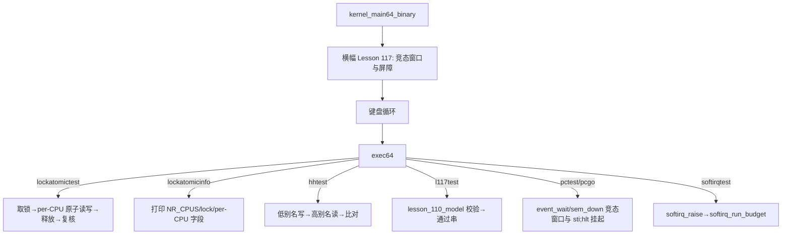

# Lesson 117: 竞态窗口与屏障 — 精讲文档

> **课号**：Lesson 117（统一课程编号 117）
> **主题**：竞态窗口与屏障（race window / barrier）
> **课程主线位置**：第 12 阶段「并发、SMP 与 RCU 检查点序列」中的检查点课
> **前置课程**：[Lesson 116 per-CPU 数据访问](../lesson-116-stable/README.md)
> **后续课程**：[Lesson 118 SMP CPU 状态](../lesson-118-stable/README.md)
> **一句话目标**：学会识别代码里的「检查-动作」竞态窗口，并说清本课用什么「屏障」（关中断、编译器内存屏障、acquire/release 原子序）把它关死。

---

## 1. 课程定位（Mission）

- **一句话目标**：学完本课你能在 `kernel64.c` 里圈出至少 4 处「检查-动作」竞态窗口，指出每一处是用 `irq_save64` 临界区、acquire/release 原子序、还是 `for(;;)` 重试循环来消除的；并解释编译器屏障 `__asm__ volatile("":::"memory")` 与 `cli` 硬件屏障的区别。
- **在课程主线中的位置**：本课是并发正确性三连问的中场：上一课（116）解决「数据归谁管」（per-CPU 隔离），本课解决「交接瞬间会不会出错」（竞态窗口与屏障），下一课（118）回答「CPU 的状态怎么刻画」（SMP CPU 状态）。三者共同为后续的 SMP 启动与跨 CPU 唤醒做铺垫。
- **前置知识清单**：
  1. `irq_save64`/`irq_restore64` 与自旋锁 `raw_spin_lock_irqsave`/`unlock_irqrestore`（acquire/release 配对）；
  2. 原子内建 `__atomic_load_n/__atomic_store_n/__atomic_exchange_n/__atomic_fetch_or` 与 relaxed/acquire/release 内存序；
  3. 信号量 `sem_down/sem_up`、事件 `event_wait/event_set`、管道 `pipe_try_write/pipe_try_read` 的检查-阻塞/检查-写入路径；
  4. 编译器的乱序优化与 `volatile` 的作用边界（`volatile` 只保证原子访问，不保证重排）。
- **本课交付**（可见结果）：
  - 新检查点命令 `l117test`（`lesson_110_model` 校验）；
  - `lockatomictest`/`lockatomicinfo` 展示锁 + per-CPU 字段 + 内存序；
  - `hhtest`/`hhinfo` 展示低/高地址别名下同一物理内存的读写一致性；
  - 启动横幅与 `about` 均标注本课主题 `竞态窗口与屏障`。

---

## 2. 核心概念精讲

### 2.1 竞态窗口（Race Window）

**定义**：一段「先检查条件、后基于条件做动作」的代码区间。若在这两个步骤之间插入另一个执行上下文（中断、另一个线程）的修改，条件可能已经失效，动作却仍按旧条件执行——这就是竞态窗口。

**直觉**：你在窗口排队时先看一眼「前面还有几个人」（检查），正要迈步时有人插队（窗口期被插队），你的判断就错了。

**本课源码里的典型竞态窗口**：

| 位置 | 检查 | 动作 | 防竞态手段 |
|------|------|------|------------|
| `sem_down` | `s->count>0`？ | `count--` 或入队阻塞 | 全程 `irq_save64` 包住检查+动作 |
| `event_wait` | `e->signaled`？ | 返回 或 入队阻塞 | 全程 `irq_save64` 包住；配合 `for(;;)` 重试 |
| `pipe_try_write` | `used>=PIPE_CAP`？ | 写缓冲并 `used++` | 教学演示里只由 shell 单线程调用；真内核必须加锁（见 §7） |
| `kbd_wait_char` | `mailbox_ready`？ | 取走字符 或 入队 | 全程 `irq_save64` 包住 |
| `waitq_wake_one` | `threads[id].state==state`？ | 置 `THREAD_RUNNABLE` | 由 `sem_up`/`irq1_record` 等持锁或中断上下文调用 |

**关键观察**：窗口本身不可完全消灭（任何「先读后写」都有窗口），消灭的是「窗口内被其他上下文破坏」的可能性——手段就是把窗口放进临界区或原子操作里。

### 2.2 屏障（Barrier）的两层含义

**编译器屏障（compiler barrier）**：`__asm__ volatile("":::"memory")` 阻止编译器把两侧的读写跨过该点重排，但不产生任何 CPU 指令，也不影响硬件乱序执行。本课 `busy_delay` 每个自旋都执行一次，既保证循环不被优化掉，也作为编译器级序列点。

**硬件/中断屏障**：`cli`/`sti` 是 x86 的中断门控，`pushfq; popq` 保存旧 IF。关中断后，本 CPU 不会再被 IRQ0/IRQ1 打断，单核下等于把「并发执行体」降为一个——这是单核内核最常用的「屏障」。

**内存序（memory ordering）**：acquire/release/relaxed 是 C11 原子操作的内存序等级：
- `relaxed`：只保证单次访问原子、不保证与其他访问的先后；
- `acquire`：该操作之后的读写不能被重排到它之前（「拿到锁」语义）；
- `release`：该操作之前的读写不能被重排到它之后（「放开锁」语义）。

**示意**（自旋锁的 acquire/release 配对联）：

```
写 数据1          →     写 数据2        →   atomic_exchange(lock,1)   ← acquire：数据写必须先于取锁
临界区…
atomic_store(lock,0) ← release：先于任何后续读
```

### 2.3 丢失唤醒（Lost Wakeup）与重试循环

**定义**：等待者先检查条件（不满足）再入队阻塞；若「检查」与「入队」之间信号已置位，等待者将永远阻塞——信号丢了。

**本课解法**：`sem_down`/`event_wait`/`kbd_wait_char` 都是
```c
for(;;){
  flags=irq_save64();            /* 关中断：检查与入队成为不可分割的原子步骤 */
  if(条件满足){ 动作; irq_restore64(flags); return; }
  入队; 置阻塞态;
  irq_restore64(flags);
  while(状态==阻塞) sti; hlt;    /* 挂起；唤醒者把状态改为 RUNNABLE */
}
```
被唤醒后回到 `for(;;)` **重新检查条件**——即使唤醒时刻条件再次被抢走，也只是再等一轮，绝不会「醒来即放行」造成计数错误。这正是对「检查-动作」竞态窗口的标准解法：**原子化检查+入队**。

### 2.4 低/高地址别名（hhtest 的背景）

内核正文同时映射在低地址（物理地址）与高地址（`KERNEL_VMA_BASE+物理`），`hhtest` 通过低地址指针写、高地址指针读来验证两条别名路径看到同一物理内容。别名一致性是「屏障必须作用在物理内存上」的前提——若两级页表各自缓存，写低别名却读高别名就会不一致。

---

## 3. 源码精讲

### 3.1 文件清单与职责

| 文件 | 职责 | 本课增量（相对 lesson-116） |
|------|------|------------------------------|
| `boot.S` | 32 位入口 / 长模式 / 内嵌 kernel64.bin | 未变化 |
| `kernel.c` | 32 位页表与 handoff 构建 | 未变化 |
| `kernel64.c` | 64 位内核主体（竞态窗口/屏障机制与命令） | **唯一增量**：`lesson_110_model`/`l117test`、exec64 分支、about/banner |
| `kernel64.ld` | 64 位段布局与守卫栈 ASSERT | 未变化 |
| `linker.ld` | 外层 ELF 布局 | 未变化 |
| `Makefile` | 构建/检查/运行 | 仅 `check` grep 串换成本课主题 |
| `grub.cfg` | GRUB 菜单 | 未变化 |

> **勘误说明**：旧 README 声称命令为 `l110test`，但源码 `exec64` 中本课新增命令为 `l117test`（`kernel64.c` 中不存在 `l110test` 分支）；本文以源码为准。

### 3.2 `kernel64.c` 精讲

#### 3.2.1 屏障与原子操作原语（本课主题核心）

```c
static TEXT64 u8 atomic_load_relaxed_u8(volatile u8*p){return __atomic_load_n(p,__ATOMIC_RELAXED);}
static TEXT64 void atomic_store_release_u8(volatile u8*p,u8 v){__atomic_store_n(p,v,__ATOMIC_RELEASE);}
static TEXT64 u8 atomic_fetch_or_relaxed_u8(volatile u8*p,u8 v){return __atomic_fetch_or(p,v,__ATOMIC_RELAXED);}
static TEXT64 u32 atomic_exchange_acquire_u32(volatile u32*p,u32 v){return __atomic_exchange_n(p,v,__ATOMIC_ACQUIRE);}
static TEXT64 void atomic_store_release_u32(volatile u32*p,u32 v){__atomic_store_n(p,v,__ATOMIC_RELEASE);}
static TEXT64 void raw_spin_lock_irqsave(raw_spinlock_t*l,irqflags_t*f){*f=irq_save64();while(atomic_exchange_acquire_u32(&l->locked,1)){} }
static TEXT64 void raw_spin_unlock_irqrestore(raw_spinlock_t*l,irqflags_t f){atomic_store_release_u32(&l->locked,0);irq_restore64(f);}
```
- `raw_spin_lock_irqsave` 的取锁循环 `while(atomic_exchange_acquire_u32(&l->locked,1)){}` 是自旋：`exchange` 原子地把 `locked` 换成 1 并返回旧值，旧值 1 说明已被他人持有，继续转圈；acquire 保证取锁成功后临界区读不会提前；
- `raw_spin_unlock_irqrestore` 用 `atomic_store_release_u32` 置 0：release 保证临界区的所有写已在「解锁可见」之前完成；随后 `irq_restore64(f)` 恢复中断——**先释放锁、再开中断**，避免开着中断自旋；
- `atomic_store_release_u8` 被 `lockatomictest` 用来发布 per-CPU 字段，release 语义保证「发布者此前对字段的构造」对观察者可见。

#### 3.2.2 `irq_save64` / `irq_restore64`：中断级屏障

```c
static TEXT64 u64 irq_save64(void){u64 flags;__asm__ volatile("pushfq; popq %0; cli":"=r"(flags)::"memory");return flags;}
static TEXT64 void irq_restore64(u64 flags){if(flags&(1ULL<<9))__asm__ volatile("sti":::"memory");}
```
- `pushfq` 把 RFLAGS 压栈、`popq %0` 取出到 `flags`，随后 `cli` 关中断——`flags` 里第 9 位（IF）记录进入前的中断状态；
- `:"memory"` clobber 是**编译器屏障**：告诉 GCC 内联汇编可能改内存，两侧的全局读写不得跨过此处重排；
- `irq_restore64` 只在旧 IF=1 时 `sti`：**不盲目开中断**，保证嵌套调用的中断状态原样归还（例如在已关中断的上下文里调用 `sem_up` 不会被错误开中断）；
- 这是单核上「把竞态窗口原子化」的基石：窗口内没有第二个执行体，检查-动作天然不可分割。

#### 3.2.3 竞态窗口的解剖：`sem_down` / `event_wait`

```c
static TEXT64 void sem_down(struct semaphore*s){u8 id=current_thread;
  for(;;){u64 flags=irq_save64();                 /* 关中断：窗口起点 */
    if(s->count){s->count--;s->downs++;irq_restore64(flags);return;}  /* 动作1：拿资源 */
    if(id&&threads[id].state==THREAD_RUNNING&&waitq_enqueue(&s->waitq,id)){ /* 动作2：入队 */
      s->blocks++;threads[id].state=THREAD_BLOCKED_SEM;}
    irq_restore64(flags);                          /* 窗口终点：两者都已原子完成 */
    while(threads[id].state==THREAD_BLOCKED_SEM)__asm__ volatile("sti; hlt");}}  /* 挂起 */
```
- 「检查 `s->count` + 减一」之间不允许被打断：若检查到 `count==1` 后开中断，另一个线程可能已拿走这最后 1 个资源，导致两线程都认为有货——这就是典型的竞态窗口；
- 入队失败（队满）时不置阻塞态，循环重试；`count` 检查在关中断区里，与唤醒者（同样在 `irq_save64` 里 `count++` 后再唤醒）互斥，因此没有 lost wakeup；
- `sti; hlt` 是「开中断再停机」组合：`hlt` 等下一个中断唤醒 CPU，若停机时中断仍关闭会永久卡死，所以先 `sti`。

```c
static TEXT64 void event_wait(struct event*e){u8 id=current_thread;
  for(;;){u64 flags=irq_save64();
    if(e->signaled){irq_restore64(flags);return;}  /* 先置位后等待：立即放行 */
    if(id&&threads[id].state==THREAD_RUNNING&&waitq_enqueue(&e->waitq,id)){e->waits++;threads[id].state=THREAD_BLOCKED_EVENT;}
    irq_restore64(flags);
    while(threads[id].state==THREAD_BLOCKED_EVENT)__asm__ volatile("sti; hlt");}}
```
- `event_set` 在同一把 `irq_save64` 屏障内先 `signaled=1` 再 `wake_all`，所以「检查 signaled」与「入队」之间的窗口被关闭：要么线程在置位前完成入队（等广播唤醒），要么在置位后看到 `signaled` 直接返回——两种结果都不会丢事件；
- 这解释了 `pcgo` 为什么先置位再广播：即使等待者尚未入队，`signaled` 已持久，等待者到达时直接放行。

#### 3.2.4 `lockatomictest` / `lockatomicinfo`

```c
static TEXT64 void lockatomictest(u16*c){irqflags_t f;u8 v=0;
  atomic_fetch_or_relaxed_u8(&this_cpu()->softirq_pending,0);
  raw_spin_lock_irqsave(&deferred_lock,&f);                /* 取锁：acquire + cli */
  v=atomic_load_relaxed_u8(&this_cpu()->softirq_pending);
  atomic_store_release_u8(&this_cpu()->softirq_pending,(u8)(v|1));  /* 发布：release */
  raw_spin_unlock_irqrestore(&deferred_lock,f);            /* 释放：release + 恢复 IF */
  text64(c,"lockatomictest: ");
  text64(c,atomic_load_relaxed_u8(&this_cpu()->softirq_pending)==1&&deferred_lock.locked==0
           ?"irq-safe lock, atomic publication, per-CPU ordering passed":"BROKEN");
  putc64(c,'\n');}
```
- 验证「取锁（acquire）→ 写数据（release 发布）→ 释放锁（release）→ 复核」的完整屏障链是否自洽；
- 若任何一环被替换成普通赋值或错误内存序，单核 QEMU 下可能仍通过（因为 TCG 是顺序执行）——这正是本课想强调的：**屏障的正确性必须在多核/重排环境下才暴露**；
- `lockatomicinfo` 则把 `NR_CPUS`、锁状态、per-CPU `id/pending/work` 一次性打印，输出串逐字为 `locks/atomics/percpu: NR_CPUS 1 lock 0 cpu id/pending/work: 0/1/0 memory order: acquire/release/relaxed`（在 `lockatomictest` 之后运行）。

#### 3.2.5 别名一致性：`hhtest` / `hhinfo`

```c
static TEXT64 void hhtest(u16*c){volatile u64 *low=(volatile u64 *)(unsigned long)((u64)(unsigned long)&hh_test_word-KERNEL_VMA_BASE);
  volatile u64 *high=&hh_test_word;
  *low=0x4849474848414c46ULL;
  if(*high==0x4849474848414c46ULL)text64(c,"hhtest: low/high aliases agree\n");
  else text64(c,"hhtest: alias mismatch\n");}
```
- `hh_test_word` 是高地址（`KERNEL_VMA_BASE+`）上的变量，`low` 指针由它减去 `KERNEL_VMA_BASE` 得到对应的低地址别名；
- 先写低别名 `0x4849474848414c46`，再读高别名比对：通过则说明低/高两条页表路径命中同一物理页、且写后立即可见；
- 屏障意义：别名一致性检验是「写可见性」的最小验证——真实内核里同物理页的多别名写入也需要缓存一致性与内存序保证。

#### 3.2.6 检查点增量：`l117test`

```c
struct lesson_110_model { u32 a,b,c,d; u8 valid,active,ready,accounted; };
static struct lesson_110_model lesson_110_state;
static TEXT64 void l117test(u16*c){lesson_110_state=(struct lesson_110_model){110U,111U,112U,113U,1,1,1,1};
int ok=lesson_110_state.valid&&lesson_110_state.active&&lesson_110_state.ready&&lesson_110_state.accounted
        &&lesson_110_state.b==lesson_110_state.a+1U;
text64(c,"l117test: ");text64(c,ok?"bounded concurrency, SMP, RCU, and diagnostics checkpoint passed":"Lesson 110 fallback reported");putc64(c,'\n');}
```
- 模型号从 `lesson_109` 推进到 `lesson_110`；`lesson_109_state` 交还给 `l109test`；
- `{110U,111U,112U,113U,1,1,1,1}` 保证 `b==a+1` 恒真，输出恒为 `l117test: bounded concurrency, SMP, RCU, and diagnostics checkpoint passed`；
- exec64 新增 `l117test` 分支；`about`/横幅文本为 `Lesson 117: 竞态窗口与屏障`。

### 3.3 构建管线（Makefile / linker）

- 构建链路与 lesson-115/116 完全一致（`-m64 -ffreestanding -fpie -mno-red-zone -mno-sse*` → `kernel64.ld` 裸 binary → `boot.S` 内嵌 → `-m elf_i386 -T linker.ld` 外层 ELF → `grub-mkrescue`）；
- `make check` grep 串换成本课主题：`竞态窗口与屏障`、`l117test`、`Lesson 117`，全过后打印 `Multiboot2 and Lesson 117 checks passed.`。

### 3.4 主控制流



---

## 4. 数据流与运行逻辑

1. 启动打印横幅后，shell 在 `sti; hlt` 等待键盘；任意命令经 `exec64` 分发；
2. `lockatomictest`：`cli` 关中断 → acquire 自旋取锁 → relaxed 读 `this_cpu()->softirq_pending` → release 写回 `(v|1)` → release 解锁 → `sti` → 复核字段与锁 → 打印 `lockatomictest: irq-safe lock, atomic publication, per-CPU ordering passed`；
3. `hhtest`：`&hh_test_word - KERNEL_VMA_BASE` 得到低地址别名，写 `0x4849474848414c46`，再从高地址读回比对，打印 `hhtest: low/high aliases agree`；
4. `pctest`+`pcgo`：两个 worker 在 `event_wait` 的关中断窗口内入队/置位，`event_set` 广播唤醒；随后 `sem_down/sem_up` 用同一屏障模式交换空位与货物，`pcinfo` 显示 `P errors/ok`；
5. `l117test`：填充 `lesson_110_state` 并断言，打印 `l117test: bounded concurrency, SMP, RCU, and diagnostics checkpoint passed`。

---

## 5. 构建、运行与验证

**依赖**：`gcc`、`ld`、`objcopy`、`grub-file`、`grub-mkrescue`、`qemu-system-x86_64`。

**构建**：
```bash
make clean && make -j"$(nproc)"
make check
```
`make check` 成功输出：
```
Multiboot2 and Lesson 117 checks passed.
```

**运行**：
```bash
make run
```
> 成功画面在 QEMU 图形窗口（VGA 终端），请勿加 `-display none`。

**验证步骤**（预期输出串全部从 `kernel64.c` 逐字抄录）：

1. 启动横幅：`Lesson 117: 竞态窗口与屏障`；
2. `about` → `Lesson 117: 竞态窗口与屏障`；
3. `l117test` → `l117test: bounded concurrency, SMP, RCU, and diagnostics checkpoint passed`；
4. `lockatomictest` → `lockatomictest: irq-safe lock, atomic publication, per-CPU ordering passed`；
5. `lockatomicinfo` → `locks/atomics/percpu: NR_CPUS 1 lock 0 cpu id/pending/work: 0/1/0 memory order: acquire/release/relaxed`；
6. `hhtest` → `hhtest: low/high aliases agree`；
7. 回归：`pctest`/`pcgo`/`pcinfo`、`softirqtest`、`sleeptest`、`ps`。

---

## 6. 调试地图

| 现象 | 原因 | 检查方法 |
|------|------|----------|
| `lockatomictest` 打印 `BROKEN` | 锁释放后 `locked` 非 0，或 per-CPU 字段复核非 1 | 检查 `raw_spin_unlock_irqrestore` 是否在 `irq_restore64` **之前** `atomic_store_release_u32(...,0)`；确认 `v\|1` 写入的是 `this_cpu()->softirq_pending` |
| 启动后 shell 不响应按键 | `sti` 与 `hlt` 顺序颠倒：`hlt` 时中断关闭则永远沉睡 | 检查键盘循环里的 `__asm__ volatile("sti; hlt")`；确认 `install_idt` 在开中断前完成 |
| `pctest` 后 `pcgo` 仍不跑 | `event_set` 与 `event_wait` 的窗口未关死，或 `wake_all` 计数为 0 | 用 `pcinfo` 看 `E sig/wait` 与 `E waits/all`；确认 `waitq_wake_all` 第三参为 `THREAD_BLOCKED_EVENT` |
| `pcinfo` 显示 `P errors/ok: 非0 no` | 生产/消费序被破坏：环形缓冲写未在 `irq_save64` 内 | 检查 `pc_producer/pc_consumer` 的临界区是否包住 `pc_buffer`/`head/tail/used` |
| `hhtest` 打印 alias mismatch | 低/高地址映射未指向同一物理页 | 用 `hhinfo` 查看 `kernel_vma_base` 与页表；确认 `boot.S` 的低/高别名都在长模式页表里 |
| `make check` 失败 | README/源码缺主题串 | 确认 README 含 `竞态窗口与屏障` 与 `Lesson 117`，kernel64.c 含 `l117test` |

---

## 7. 与 Linux 源码对照

| TinyOS 教学模型 | Linux 对应实现 | 教学简化 |
|------------------|----------------|----------|
| `raw_spin_lock_irqsave`（exchange acquire + cli） | `include/linux/spinlock.h` 的 `spin_lock_irqsave`，底层 `arch_spin_lock`（x86 `LOCK XCHG`/`LOCK BTS`）+ `local_irq_save` | Linux 需区分 irq/softirq 三种禁用，TinyOS 只有一种中断门控 |
| `irq_save64`/`irq_restore64`（pushfq/popq + cli/sti + memory clobber） | `arch/x86/include/asm/irqflags.h` 的 `local_irq_save`/`local_irq_restore`（同样 pushfq/popq） | Linux 还维护 per-CPU 的 `irq_count` 与 `preempt_count`；TinyOS 不追踪嵌套深度 |
| `__asm__ volatile("":::"memory")` 编译器屏障（`busy_delay`） | `include/linux/compiler.h` 的 `barrier()`；RCU 中的 `rcu_read_lock` 也依赖编译器屏障 | 教学上只在 `busy_delay` 与内联汇编里出现，无 `mb()`/`smp_mb()` 层级 |
| acquire/release 原子内建 | `include/linux/atomic.h` 的 `atomic_xchg`/`atomic_store_release`；x86 上 acquire=普通读+屏障、release=store+屏障 | TinyOS 直接用 `__atomic_*` 内建，不做 x86 指令级手工屏障 |
| `sem_down` 检查-入队窗口原子化 + `for(;;)` 重试 | `kernel/locking/semaphore.c`：`down()` 里取 `raw_spin_lock_irqsave` 后重试 `__down_common`，同样防止 lost wakeup | TinyOS 单核下无 `smp_cond_load_acquire` 之类高级等待，也无超时/信号分支 |
| `hhtest` 低/高别名一致性 | x86 上内核正文同样双映射（`__PAGE_KERNEL` 高地址 + 低地址临时映射）；别名一致性依赖缓存一致性协议 | TinyOS 用单个 64 位魔数做写后读验，Linux 无需专门测试（硬件保证 WB 语义） |

权威来源：Intel SDM Vol.3A（`CLI/STI` 与 IF、`PUSHFQ/POPFQ`、MESI 缓存一致性）、GCC 文档（`__atomic_*` 内建与 memory order）、Linux `Documentation/memory-barriers.txt`。

---

## 8. 思考题与练习

1. **概念理解**：解释为什么 `volatile` 不能替代屏障。若把 `sem_down` 的 `irq_save64` 删掉而只保留 `volatile`，竞态窗口还存在吗？
2. **源码定位**：在 `kernel64.c` 中找出至少 5 处 `__asm__ volatile("":::"memory")` 或带 `:"memory"` 的内联汇编，说明每一处的编译器屏障用途。
3. **动手实验**：把 `raw_spin_lock_irqsave` 改成先 `cli` 再 `while(atomic_exchange_relaxed...)`（把 acquire 换成 relaxed），重新运行 `lockatomictest`，解释为什么 TCG 单核下仍可能通过、多核下为何会翻车。
4. **动手实验**：在 `pipe_try_write` 里加 `irq_save64/irq_restore64` 包裹「检查 `used` 与写入」，然后修改 `pipetest` 断言仍通过；思考：如果不加锁而让两个线程同时 `pipe_try_write`，`used` 会怎么错？
5. **Linux 对照**：阅读 `Documentation/memory-barriers.txt` 中关于 acquire/release 的部分，以及 `kernel/locking/semaphore.c` 的 `down()` 实现，比较其「取锁-重试」循环与本课 `sem_down` 的 `for(;;)` 结构的异同。

---

## 9. 本课小结与下一课预告

- 本课把「并发正确性」聚焦到最细粒度：检查-动作之间的竞态窗口，以及关闭窗口的三种屏障（关中断、编译器屏障、acquire/release 原子序）；
- `sem_down`/`event_wait`/`kbd_wait_char` 展示了「原子化检查+入队 + `for(;;)` 重试」的反丢失唤醒模式；
- `lockatomictest` 把「取锁-写-释放-复核」压缩成一条可重复的确定性验证链，并提醒单核 TCG 环境未必能暴露错误序；
- `hhtest` 验证了低/高地址别名的一致性，为理解屏障作用在物理内存上提供直观实验；
- 检查点推进到 `lesson_110_model`，命令 `l117test` 恒输出通过串；
- 下一步 [Lesson 118 SMP CPU 状态](../lesson-118-stable/README.md) 将把「屏障」的成果应用到描述多 CPU 上：每个 CPU 的在线/运行/空闲状态如何用元数据刻画、调度器如何读这些状态——竞态窗口的分析方法在那里依然是主角。
