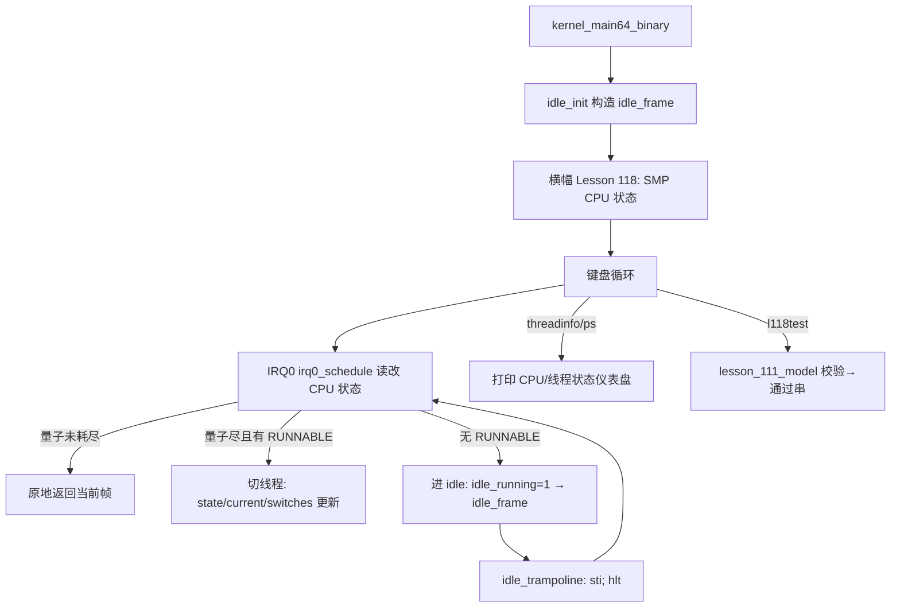

# Lesson 118: SMP CPU 状态 — 精讲文档

> **课号**：Lesson 118（统一课程编号 118）
> **主题**：SMP CPU 状态（每个 CPU 在线/运行/空闲状态的元数据刻画）
> **课程主线位置**：第 12 阶段「并发、SMP 与 RCU 检查点序列」中的检查点课
> **前置课程**：[Lesson 117 竞态窗口与屏障](../lesson-117-stable/README.md)
> **后续课程**：[Lesson 119 SMP 启动元数据](../lesson-119-stable/README.md)
> **一句话目标**：说清在 TinyOS 教学模型里「一个 CPU 处于什么状态」由哪些变量刻画（`cpu_locals[].id`、`current_thread`、`idle_running`、`threads[].state`），以及调度器 IRQ0 如何读改这些状态。

---

## 1. 课程定位（Mission）

- **一句话目标**：学完本课你能画出「CPU 状态」在 TinyOS 中的完整数据视图：per-CPU 区（`cpu_local.id`）、CPU 级运行指针（`current_thread`）、CPU 级空闲标志（`idle_running`/`idle_frame`）、线程级调度状态（`enum thread_state`），并解释 `threadinfo`/`ps` 命令输出的每个字段。
- **在课程主线中的位置**：前三课依次解决了「线程间怎么排队（115）、数据怎么隔离（116）、窗口怎么关门（117）」，本课把它们汇总到「一个 CPU 的状态机」：CPU 要么在跑某个线程，要么空闲；这个二元状态在 Linux 里由 per-CPU 的 `current`、idle 线程与 `cpu_online_mask` 共同刻画。下一课（119）讲 SMP 启动时这些状态最初是怎么被装配出来的。
- **前置知识清单**：
  1. `struct cpu_local`/`this_cpu()`/`NR_CPUS` 与 per-CPU 数据（Lesson 116）；
  2. 竞态窗口与 `irq_save64`/acquire-release 屏障（Lesson 117）；
  3. 线程状态机 `enum thread_state` 与 `irq0_schedule` 的 PIT 抢占调度、`rr_pick_next` 轮转；
  4. `idle_init` 构造的 idle 线程与 `idle_trampoline` 汇编（`sti; hlt` 循环）。
- **本课交付**（可见结果）：
  - 新检查点命令 `l118test`（`lesson_111_model` 校验）；
  - `threadinfo` 输出本课 CPU/调度状态全景：current、idle、round_robin、quantum、ticks、preempt/idle 切换计数；
  - `ps` 输出每个线程的状态/切换次数/进度/唤醒计数，并显示 idle 的 running/ready；
  - 启动横幅与 `about` 均标注本课主题 `SMP CPU 状态`。

---

## 2. 核心概念精讲

### 2.1 什么是「CPU 状态」

**定义**：在 SMP 内核里，「CPU 状态」指描述**一个物理执行核心当前处境**的全部元数据，至少包括：它是否在线（online）、它是忙还是闲（running/idle）、它正在执行哪个任务（current）、它的调度现场（栈/帧/量子）。

**动机**：单核时代「CPU」是隐式的（只有一颗），多核时代必须显式回答「我在哪颗 CPU 上、这颗 CPU 在干什么」——调度器、中断控制器、时钟设备都要按 CPU 号分发工作。

**Linux 侧的状态分层**（本课对照基准）：
- 生命周期态：`cpu_online_mask` / `cpu_active_mask`（是否可调度任务）；
- 运行态：per-CPU 的 `current`（当前任务）、idle 任务（`swapper`）；
- 上下文态：per-CPU 的 `irq_count`、`preempt_count`、内核栈底指针。

### 2.2 TinyOS 的 CPU 状态数据视图

TinyOS 用四个层次的变量拼出「CPU 状态」：

```
CPU 状态 = cpu_locals[].id         ← 我是几号 CPU（per-CPU 区）
        + current_thread           ← 我当前在跑哪个线程（0=shell）
        + idle_running/idle_frame  ← 我是否空闲、空闲现场在哪
        + threads[].state          ← 所有线程的可调度性（调度器的输入）
```

```c
#define NR_CPUS 1U
struct cpu_local { u8 id,softirq_pending,work_head,work_tail,work_used; };
static struct cpu_local cpu_locals[NR_CPUS];
static struct thread threads[THREAD_COUNT];
static u8 current_thread,round_robin,threads_started,...;
static u8 idle_running;
```
- `cpu_locals[].id`：CPU 的「身份状态」，`lockatomicinfo` 通过 `this_cpu()->id` 读出；
- `current_thread`：CPU 的「执行焦点」，调度器切换时就改它；
- `idle_running`：CPU 的「空闲标志」，为 1 表示 CPU 正跑 idle 线程；
- `threads[].state`：每个线程的可调度状态，是 `rr_pick_next` 的唯一下发依据。

### 2.3 线程状态机：调度器眼中的 CPU 负载

```c
enum thread_state { THREAD_EMPTY, THREAD_RUNNING, THREAD_RUNNABLE, THREAD_SLEEPING,
                    THREAD_BLOCKED_KBD, THREAD_BLOCKED_EVENT, THREAD_BLOCKED_SEM, THREAD_FINISHED };
```
- `THREAD_RUNNING`/`THREAD_RUNNABLE`：CPU 可立即或稍后执行；
- `THREAD_SLEEPING`/`THREAD_BLOCKED_*`：CPU 不该选它，直到被 `wake_sleepers`/`waitq_wake_one/all` 置回 `THREAD_RUNNABLE`；
- `THREAD_FINISHED`：等待 `reap_finished_threads` 回收栈；
- **要点**：CPU 的「空闲」不是一种线程状态，而是「所有线程都不可调度」的结果——`rr_pick_next` 返回 `0xff` 时 CPU 进入 idle。

### 2.4 idle 线程：CPU 的默认归宿

```c
static TEXT64 void idle_init(void){struct irq0_frame*f=(struct irq0_frame *)(void *)(__idle_stack_end-sizeof(*f));
  /* 清零全部 GPR、R12=栈顶、rip=idle_trampoline、cs=0x08、rflags=0x202 */
  f->r12=(u64)(unsigned long)__idle_stack_end;f->rip=runtime_idle_trampoline_address();
  f->cs=0x08;f->rflags=0x202;idle_frame=f;idle_running=0;idle_switches=idle_ticks=0;}
```
```
.global idle_trampoline
idle_trampoline:
  movq %r12,%rsp
1: sti
   hlt
   jmp 1b
```
- idle 线程是**静态栈**（`kernel64.ld` 里的 `__idle_stack_end`），不占 PMM 页；
- `sti; hlt` 循环：开中断停机，等下一个 IRQ0 唤醒 CPU，醒来检查一次有没有活可干；
- 调度器切到 idle 时用 `idle_frame` 恢复现场（`idle_switches++` 记账），从 idle 切回真实线程时 `idle_running=0` 并恢复该线程的 frame。

---

## 3. 源码精讲

### 3.1 文件清单与职责

| 文件 | 职责 | 本课增量（相对 lesson-117） |
|------|------|------------------------------|
| `boot.S` | 32 位入口 / 长模式 / 内嵌 kernel64.bin | 未变化 |
| `kernel.c` | 32 位页表与 handoff 构建 | 未变化 |
| `kernel64.c` | 64 位内核主体（CPU 状态与调度元数据） | **唯一增量**：`lesson_111_model`/`l118test`、exec64 分支、about/banner |
| `kernel64.ld` | 64 位段布局与守卫栈 ASSERT | 未变化 |
| `linker.ld` | 外层 ELF 布局 | 未变化 |
| `Makefile` | 构建/检查/运行 | 仅 `check` grep 串换成本课主题 |
| `grub.cfg` | GRUB 菜单 | 未变化 |

> **勘误说明**：旧 README 声称命令为 `l111test`，但源码 `exec64` 中本课新增命令为 `l118test`（`kernel64.c` 中不存在 `l111test` 分支）；本文以源码为准。

### 3.2 `kernel64.c` 精讲

#### 3.2.1 CPU 状态相关数据与访问

```c
#define NR_CPUS 1U
struct cpu_local { u8 id,softirq_pending,work_head,work_tail,work_used; };
static struct cpu_local cpu_locals[NR_CPUS];
static TEXT64 struct cpu_local *this_cpu(void){return &cpu_locals[0];}
static struct thread threads[THREAD_COUNT];
static u8 current_thread,round_robin,threads_started,sleep_test,kbd_wait_test,pc_test;
static u8 idle_running;
static struct irq0_frame *idle_frame;
```
- `current_thread` 是 CPU 级「正在执行的线程 id」，与 Linux per-CPU 的 `current` 一一对应；
- `round_robin` 是轮转扫描游标，`rr_pick_next` 从它之后开始环形扫描，保证公平；
- `idle_running` + `idle_frame` 是 CPU 的「空闲态」；`idle_frame` 保存 idle 上下文以便 IRQ0 中断后恢复；
- `threads_started` 防止 `start_threads` 重复建线程（重复返回 0 并提示 already started）。

#### 3.2.2 `irq0_schedule`：CPU 状态的读改写中枢

```c
TEXT64 struct irq0_frame *irq0_schedule(struct irq0_frame *f){
  u8 old,next;ticks++;softirq_run_budget();outb64(PIC1_COMMAND,PIC_EOI);
  if(f&&f->cs==USER_CS){user_irq0_save_restore(f);return f;}   /* CPL3 用户帧：只保存恢复不调度 */
  if(idle_running){idle_frame=f;idle_ticks++;}                 /* CPU 正空闲：记录 idle 现场 */
  else threads[current_thread].frame=(u64)(unsigned long)f;    /* 否则保存当前线程现场 */
  wake_sleepers();reap_finished_threads();                     /* 睡眠到期置 RUNNABLE；回收 FINISHED */
  if(!idle_running&&quantum_left){quantum_left--;if(quantum_left)return f;}  /* 量子未耗尽：原地返回 */
  old=current_thread;next=next_runnable();quantum_left=TIME_SLICE_TICKS;   /* 新量子；选下一个 */
  if(next==0xff){                                               /* 无 RUNNABLE：CPU 进入空闲 */
    if(idle_running)return f;
    if(threads[old].state==THREAD_RUNNING){threads[old].state=THREAD_RUNNABLE;rr_enqueue(old);}
    idle_running=1;idle_switches++;return idle_frame;}          /* 切到 idle_frame */
  if(idle_running){idle_running=0;threads[next].state=THREAD_RUNNING;current_thread=next;
    threads[next].switches++;preempt_switches++;return (struct irq0_frame *)(unsigned long)threads[next].frame;}
  if(next==old){if(old==0)idle_worker_ticks++;return f;}        /* 就选了自己：继续 */
  if(threads[old].state==THREAD_RUNNING){threads[old].state=THREAD_RUNNABLE;rr_enqueue(old);}
  rr_dequeue(next);threads[next].state=THREAD_RUNNING;current_thread=next;
  threads[next].switches++;preempt_switches++;return (struct irq0_frame *)(unsigned long)threads[next].frame;}
```
- 该函数在 IRQ0 中断上下文执行，返回的帧指针就是 IRQ0 出口 `iretq` 要恢复的现场——**读改 CPU 状态**（current/state/idle）与**现场切换**在一处完成；
- 三条分支对应 CPU 三种处境：忙且量子足（原地续跑）、忙且量子尽（换线程）、无事可做（进 idle）；
- `next==0xff` 是 CPU 状态的「空闲判定」：`rr_pick_next` 扫完所有线程都不可调度时返回 `0xff`，CPU 状态翻转为 idle；
- 从 idle 恢复时把目标线程 `state=RUNNING`、`current_thread=next`，CPU 状态从空闲回到忙。

#### 3.2.3 `rr_pick_next` / `next_runnable`：可调度性扫描

```c
static TEXT64 u8 rr_pick_next(void){u32 n;for(n=1;n<=THREAD_COUNT;n++){
  u8 i=(u8)((round_robin+n)%THREAD_COUNT);
  if(threads[i].state==THREAD_RUNNABLE||threads[i].state==THREAD_RUNNING){round_robin=i;return i;}}
  return 0xff;}
static TEXT64 u8 next_runnable(void){sched_picks++;return rr_pick_next();}
```
- 只认 `THREAD_RUNNABLE` 或 `THREAD_RUNNING`：被信号量/事件/键盘阻塞或睡眠的线程不会被选中——这就是「阻塞线程让出 CPU」的机械实现；
- 从 `round_robin+1` 起环形扫描 `THREAD_COUNT` 项，命中即更新游标，保证轮转公平；
- 全部不可调度返回 `0xff`（256），触发 `irq0_schedule` 的 idle 分支。

#### 3.2.4 状态查看命令：`threadinfo` 与 `ps`

```c
static TEXT64 void threadinfo(u16*c){text64(c,"scheduler: PIT preemptive independent idle\ncurrent: ");
  text64(c,idle_running?"idle":"thread");text64(c," ");hex64(c,current_thread);
  text64(c,"\nnext scan: ");hex64(c,round_robin);
  text64(c,"\nstarted: ");text64(c,threads_started?"yes":"no");
  text64(c,"\nmode: ");text64(c,pc_test?"pctest":kbd_wait_test?"kbdwaittest":sleep_test?"sleeptest":"preempttest");
  text64(c,"\nquantum left: ");hex64(c,quantum_left);text64(c,"\nPIT ticks: ");hex64(c,ticks);
  text64(c,"\npreempt switches: ");hex64(c,preempt_switches);
  text64(c,"\nidle switches/ticks: ");hex64(c,idle_switches);text64(c," ");hex64(c,idle_ticks);
  text64(c,"\nsleep wakeups: ");hex64(c,sleep_wakeups);
  text64(c,"\nkbd waiters: ");hex64(c,kbd_waitq.count);
  text64(c,"\nkbd enqueue/one/all: ");hex64(c,kbd_waitq.enqueues);text64(c," ");hex64(c,kbd_waitq.wake_one);text64(c," ");hex64(c,kbd_waitq.wake_all);
  text64(c,"\nworker steps: ");hex64(c,threads[1].progress);text64(c," ");hex64(c,threads[2].progress);
  text64(c,"\nIRQ0 schedules: yes\n");}
```
- 这是本课的「CPU 状态仪表盘」：current、idle、round_robin、quantum、ticks、preempt/idle 切换、睡眠唤醒、键盘等待队列、worker 进度；
- `ps` 进一步逐线程打印 `id state frame stack-pa stack-high switches progress wake-tick received last`，并以 `idle running/ready frame ... stack static` 收尾——把 CPU 状态拆到「每线程 + idle」两级视图；
- 这些命令只读不写状态，方便在调度进行中观察「CPU 此刻在忙还是闲」。

#### 3.2.5 检查点增量：`l118test`

```c
struct lesson_111_model { u32 a,b,c,d; u8 valid,active,ready,accounted; };
static struct lesson_111_model lesson_111_state;
static TEXT64 void l118test(u16*c){lesson_111_state=(struct lesson_111_model){111U,112U,113U,114U,1,1,1,1};
int ok=lesson_111_state.valid&&lesson_111_state.active&&lesson_111_state.ready&&lesson_111_state.accounted
        &&lesson_111_state.b==lesson_111_state.a+1U;
text64(c,"l118test: ");text64(c,ok?"bounded concurrency, SMP, RCU, and diagnostics checkpoint passed":"Lesson 111 fallback reported");putc64(c,'\n');}
```
- 模型号推进到 `lesson_111`，`lesson_110_state` 交还给 `l110test`；初始值 `{111,112,113,114,1,1,1,1}` 恒满足 `b==a+1`；
- 输出恒为 `l118test: bounded concurrency, SMP, RCU, and diagnostics checkpoint passed`；
- `about`/横幅为 `Lesson 118: SMP CPU 状态`。

### 3.3 构建管线（Makefile / linker）

- 构建链路与 lesson-115~117 一致（`-m64 -ffreestanding -fpie -mno-red-zone -mno-sse*` → `kernel64.ld` → `boot.S` 内嵌 → 外层 ELF → `grub-mkrescue`）；
- `make check` grep 串换成本课主题：`SMP CPU 状态`、`l118test`、`Lesson 118`，全过后打印 `Multiboot2 and Lesson 118 checks passed.`；
- `kernel64.ld` 中的 `.data.stack.idle` 段定义 idle 静态栈，`__idle_stack_end` 是 idle 帧顶。

### 3.4 主控制流



---

## 4. 数据流与运行逻辑

1. 启动：`idle_init` 用静态栈构造 idle 上下文（`idle_frame`），`idle_running=0`；shell 线程 id 0 置 `THREAD_RUNNING`；
2. 敲 `sleeptest` → `start_threads(1)` 建两个 worker 为 `THREAD_RUNNABLE`；下一个 IRQ0 时间片 `irq0_schedule` 看到 shell 量子耗尽、有可调度线程，把 shell 置 `THREAD_RUNNABLE`、选 worker 置 `THREAD_RUNNING`、`current_thread=1`、`preempt_switches++`；
3. worker 睡眠 120/270 tick 时 `thread_sleep_ticks` 置 `THREAD_SLEEPING`；`wake_sleepers` 在 IRQ0 里到期置回 `THREAD_RUNNABLE`（`sleep_wakeups++`）；
4. 若两个 worker 都睡眠/阻塞而 shell 也在睡，`rr_pick_next` 返回 `0xff`，`idle_running=1`，CPU 切到 `idle_frame` 跑 `sti; hlt`；有活后 `idle_running=0` 切回；
5. 敲 `threadinfo`/`ps` 观察上述状态的当前快照；敲 `l118test` 打印检查点通过串。

---

## 5. 构建、运行与验证

**依赖**：`gcc`、`ld`、`objcopy`、`grub-file`、`grub-mkrescue`、`qemu-system-x86_64`。

**构建**：
```bash
make clean && make -j"$(nproc)"
make check
```
`make check` 成功输出：
```
Multiboot2 and Lesson 118 checks passed.
```

**运行**：
```bash
make run
```
> 成功画面在 QEMU 图形窗口（VGA 终端），请勿加 `-display none`。

**验证步骤**（预期输出串全部从 `kernel64.c` 逐字抄录）：

1. 启动横幅：`Lesson 118: SMP CPU 状态`；
2. `about` → `Lesson 118: SMP CPU 状态`；
3. `l118test` → `l118test: bounded concurrency, SMP, RCU, and diagnostics checkpoint passed`；
4. `threadinfo` 显示 `scheduler: PIT preemptive independent idle`、`current: thread 0`、`IRQ0 schedules: yes` 等；
5. `sleeptest` → `sleeptest: two timed workers started`；期间多次 `threadinfo`，可看到 `idle switches/ticks` 增长、`sleep wakeups` 增长；
6. `ps` 显示 `thread 0 running`、`thread 1 sleeping`/`runnable`、`thread 2 ...`，以及 `idle ready frame ... stack static`；
7. 回归：`pctest`/`pcgo`/`pcinfo`、`lockatomictest`、`hhtest`。

---

## 6. 调试地图

| 现象 | 原因 | 检查方法 |
|------|------|----------|
| `threadinfo` 显示 `current: idle` 但无线程可恢复 | 所有线程都睡眠/阻塞，`rr_pick_next` 返回 `0xff`；属于正常 idle 状态 | 用 `ps` 看各线程状态；`idle ticks` 应增长 |
| 敲 `sleeptest` 后 worker 永不醒来 | `wake_sleepers` 的 `tick_due` 判断错误，或 `wake_tick` 未被设置 | 检查 `thread_sleep_ticks` 是否置 `wake_tick=ticks+delta`；`threadinfo` 看 `sleep wakeups` |
| `ps` 显示 `thread 1 finished` 但栈未回收 | `reap_finished_threads` 在 idle_running 或 `i==current_thread` 时跳过 | 检查 `reap_finished_threads` 条件；观察 `meminfo` 的 free 页数 |
| 一切正常但 `preempt switches` 不变 | 量子耗尽逻辑：`quantum_left` 一直 >0 或 `next==old` 分支命中 | `threadinfo` 看 `quantum left`；确认 `TIME_SLICE_TICKS=2` 的递减路径 |
| `threadinfo` 显示 `current: thread 0` 恒不变 | 两个 worker 从没被建（`threads_started` 未置位） | 先敲 `sleeptest`/`pctest`；`threadinfo` 看 `started: yes` 与 `mode` |
| `make check` 失败 | README/源码缺主题串 | 确认 README 含 `SMP CPU 状态` 与 `Lesson 118`，kernel64.c 含 `l118test` |

---

## 7. 与 Linux 源码对照

| TinyOS 教学模型 | Linux 对应实现 | 教学简化 |
|------------------|----------------|----------|
| `cpu_locals[].id` + `this_cpu()` | `arch/x86/include/asm/smp.h` 的 `smp_processor_id()`，per-CPU 变量 `cpu_number`；`include/linux/smp.h` 提供 `raw_smp_processor_id` | TinyOS 单核硬编码 0 号，无 `%gs` 偏置 |
| `current_thread` 全局变量 | 每 CPU 的 `current` 宏 → `this_cpu_read_stable(current_task)`（`include/linux/sched.h`） | TinyOS 只有一条 `u8`；Linux 指向 `task_struct*` 且与栈底互相定位 |
| `idle_running`/`idle_frame` + `idle_trampoline(sti;hlt)` | 每 CPU 的 idle 任务（`swapper/0`），`arch/x86/kernel/process_64.c` 的 `cpu_startup_entry` 循环 `do_idle()` | TinyOS idle 是静态栈帧；Linux idle 是完整任务且参与 cpuidle 状态机 |
| `threads[].state` 八态枚举 | `include/linux/sched.h` 的 `task_state` 位掩码（TASK_RUNNING/INTERRUPTIBLE/UNINTERRUPTIBLE/ZOMBIE/STOPPED/TRACED） | TinyOS 无 `TASK_STOPPED/TRACED/DEAD` 位，`BLOCKED_KBD/EVENT/SEM` 是三套教学阻塞态 |
| `irq0_schedule` 读改 current/state 并返回帧 | `kernel/sched/core.c` 的 `schedule()`/`__schedule()`，`pick_next_task` 选下一个、`context_switch` 切现场 | TinyOS 只在 IRQ0 里切，无主动 `schedule()`、无 per-CPU 运行队列（`rq`） |
| `rr_pick_next` 返回 `0xff` 表示无可调度 → idle | Linux 调度器发现 `rq->nr_running==0` 时 `schedule_idle` → `pick_next_task_fair` 返回 idle 调度类 | TinyOS 用哨兵值，Linux 用运行队列计数 + 调度类层级 |
| `threadinfo`/`ps` 状态仪表盘 | `proc/sched_debug`、`sysrq-t`、`ps`/`top` 的内核侧来源（`/proc` 下 per-task 状态） | TinyOS 直接在 VGA 上打印，无 `/proc` 文件系统 |

权威来源：Intel SDM Vol.3A（中断/任务切换）、Linux `include/linux/smp.h`、`arch/x86/include/asm/smp.h`、`kernel/sched/core.c`。

---

## 8. 思考题与练习

1. **概念理解**：为什么「CPU 空闲」不能建模成线程状态，而必须由调度器在「没有可调度线程」时显式切换？如果 `rr_pick_next` 返回 `0xff` 时直接死循环自旋而不是切 idle，会有什么问题？
2. **源码定位**：在 `irq0_schedule` 中找出所有写入 `current_thread`、`idle_running`、`threads[i].state` 的位置，整理成「谁在何时把 CPU 状态改成什么」的时序表。
3. **动手实验**：把 `TIME_SLICE_TICKS` 从 2 改成 8，重新构建运行 `sleeptest`，观察 `threadinfo` 中 `preempt switches` 的增速变化；解释量子长度与切换开销的关系。
4. **动手实验**：修改 `rr_pick_next` 让它跳过 `THREAD_SLEEPING`（原本就跳过），再让 `thread_sleep_ticks` 故意不设置 `wake_tick`，观察 CPU 是否永久 idle——验证 `wake_sleepers` 是唯一唤醒通道。
5. **Linux 对照**：阅读 `kernel/sched/core.c` 的 `__schedule()`，比较它先 `pick_next_task` 后 `context_switch` 的流程与本课 `irq0_schedule` 的「选 next → 改状态 → 返回帧」流程；Linux 为什么需要 `preempt_count` 而 TinyOS 不需要？

---

## 9. 本课小结与下一课预告

- 本课把「CPU 状态」拆成四个可观测层面：per-CPU 身份（`id`）、CPU 运行焦点（`current_thread`）、空闲标志（`idle_running`/`idle_frame`）、线程可调度性（`threads[].state`）；
- `irq0_schedule` 是 CPU 状态的唯一写入口：量子续跑、换线程、进 idle 三条分支覆盖 CPU 的全部处境；
- `rr_pick_next` 的 `0xff` 哨兵是「空闲判定」的机械实现，idle 线程用静态栈 + `sti; hlt` 循环承接无活可干的时间；
- `threadinfo`/`ps` 把上述状态可视化，是排查调度问题的第一手工具；
- 检查点推进到 `lesson_111_model`，命令 `l118test` 恒输出通过串；
- 下一步 [Lesson 119 SMP 启动元数据](../lesson-119-stable/README.md) 将回答这些 CPU 状态在系统启动那一刻是如何被装配的：`long_mode_handoff` 里携带的页表、栈、MBI 等启动元数据如何决定每个 CPU 的初始处境——本课的 `idle_init`/`start_threads` 正是那些元数据的消费者。
