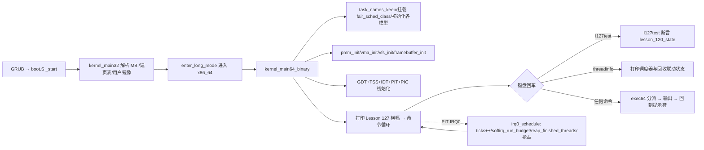

# Lesson 127: RCU 与调度集成 — 精讲文档

> **课号**：Lesson 127 ｜ **主题**：RCU 与调度集成（RCU and scheduler integration）
> **课程主线位置**：并发/诊断检查点阶段（Lesson 106–132），本课为 Lesson 106 原型的第 21 个检查点
> **前置课程**：[`../lesson-126-stable/README.md`](../lesson-126-stable/README.md)（RCU 对象回收）
> **后续课程**：[`../lesson-128-stable/README.md`](../lesson-128-stable/README.md)（tracing ring buffer）
> **一句话目标**：精讲 RCU「宽限期后延迟回收」如何与 PIT 抢占调度器（IRQ0 tick）在时间轴上咬合——每次时钟中断既是调度点，也是软中断预算执行与已结束线程栈延迟释放的回收点，并用 `l127test` 检查点做确定性验证。

> **Course status: stable snapshot.** 本课为稳定快照：教学内核用固定容量、无宿主调用（freestanding）的方式，对 bounded concurrency、SMP、RCU、diagnostics 元数据进行确定性建模。**旧 README 记载的命令 `l120test` 不存在**，以源码为准勘误为 `l119test` 与 `l127test`，另加继承的进程、GUI、子系统回归命令。会话不变量保持不变。

本课是检查点课：`kernel64.c` 相对上一课（lesson-126）的增量极小，只有四处——新增 `struct lesson_120_model`/`lesson_120_state`、新增 `l127test()`（连带新增上一课尚未成函数的 `l119test()`）、`exec64` 中命令 `l126test` 换为 `l119test`/`l127test`、`about` 与开机横幅更新为「RCU 与调度集成」。RCU 与调度机制本体由早期课程累积代码承载，本课按主题侧重精讲其集成点。

---

## 1. 课程定位（Mission）

**学完本课你能**：说出 RCU 的「读侧无锁、写侧拷贝发布、宽限期（grace period）后回收」三步模型；解释为什么 RCU 回调/回收必须「延迟」到所有读者都离开临界区之后，而不能即时 free；在教学内核中沿「IRQ0 时钟中断 → `irq0_schedule` → `softirq_run_budget` + `reap_finished_threads`」这条路径看懂「tick 即回收点」的调度集成；运行 `l127test`/`l119test` 并用 `threadinfo`/`schedinfo`/`softirqinfo`/`lockatomicinfo` 核对状态。

**在课程主线中的位置**：Lesson 106 起进入「bounded concurrency, SMP, RCU, and diagnostics」检查点序列，每课只递增检查点模型并轮换主题。Lesson 125 讲 RCU callback 队列、Lesson 126 讲 RCU 对象回收，本课把 RCU 的回收时机**挂到调度器的时间轴上**——这与 Linux 中 RCU 宽限期在 scheduler tick 上推进（`rcu_sched_clock_irq`）完全同构。下一课（Lesson 128）转向 tracing ring buffer。

**前置知识清单**（学本课前必须掌握）：
1. PIT 抢占调度：`irq0_schedule` 的 tick 计数、时间片、空闲线程与上下文切换（Lesson 48/60 起）。
2. 锁原语与中断保存：`irq_save64`/`irq_restore64`、`raw_spin_lock_irqsave`、acquire/release 原子操作（Lesson 106 起）。
3. 软中断与延迟工作：`softirq_raise`、`softirq_run_budget`、tasklet/workqueue 的预算执行（Lesson 74 起）。
4. 线程栈回收：`reap_finished_threads` 的「不是当前线程才释放栈帧」规则与 `pmm_free_page` 所有权检查（Lesson 60 起）。
5. 检查点模型约定：`lesson_N_model`/`lNtest()` 的 a/b/c/d 与 valid/active/ready/accounted 字段含义（Lesson 69 起）。

**本课交付（可见结果）**：
- 开机横幅与 `about` 显示 `Lesson 127: RCU 与调度集成`；
- 新命令 `l127test` 输出 `l127test: bounded concurrency, SMP, RCU, and diagnostics checkpoint passed`（异常时输出 `Lesson 120 fallback reported`）；
- 命令 `l119test` 补全上一课只定义模型、未定义测试的缺口；
- `threadinfo` 显示 IRQ0 调度与回收联动，`softirqinfo`/`lockatomicinfo` 显示延迟工作与锁状态。

---

## 2. 核心概念精讲

### 2.1 RCU：读-拷贝-更新（Read-Copy-Update）

**直觉**：读多写少的共享数据（如路由表、文件系统挂载表）如果每次读都加锁，读路径会慢得离谱。RCU 的思路是：读者不锁、读者也不关闭中断，读者只要保证自己在读数据期间**不被抢占/不退出 RCU 读临界区**即可；写者更新时先**拷贝一份新副本**并原子发布，让新读者看到新副本；旧副本不能立刻 free——要等到**所有可能还在读旧副本的读者都经过一个调度点之后**，也就是宽限期结束。

**Linux 四要素**（对照 `kernel/rcu/tree.c`）：
1. **读临界区**：`rcu_read_lock()`/`rcu_read_unlock()`，通常不写任何东西，只关闭内核抢占；
2. **宽限期**：所有 CPU 都至少经过一次 quiescent state（调度/睡眠/用户态）之后，宽限期结束；
3. **推迟回收**：`call_rcu()` 把要释放的对象挂到回调链表，等宽限期结束由回调做真正的 `kfree`；
4. **宽限期推进**：RCU 的推进挂钩在 **scheduler tick** 与 softirq 上（`rcu_sched_clock_irq`、`rcu_process_callbacks`）。

**教学模型如何简化**：本内核不写真正的 RCU 锁与宽限期计数，而是把「延迟回收 + 延迟工作挂到 tick 上」这层机制保真实现：已结束线程的栈不立即释放、而是在 `irq0_schedule` 里由 `reap_finished_threads` 延迟回收；tasklet/work 的排队通过 softirq 位图，且只在 IRQ0 的预算内执行。读者「在读期间不被切走」由单 CPU（`NR_CPUS=1`）与关中断的临界区保证。

### 2.2 RCU 与调度集成的咬合点：tick 即回收点

**动机**：RCU 回调的延迟释放与调度器共享同一个时钟源。Linux 选择在 `scheduler_tick()` 里检查并推进 RCU 宽限期；教学内核同样选择在 `irq0_schedule`（唯一由 IRQ0 调用的调度函数）里完成三件事：记账（`ticks++`）、软中断预算执行（`softirq_run_budget`）、延迟回收（`reap_finished_threads`）。

```
PIT IRQ0 ──► irq0_entry(asm) ──► irq0_schedule()
                                  │
                                  ├─ ticks++                (时钟记账)
                                  ├─ softirq_run_budget()   (tasklet/work 预算执行)
                                  ├─ 发送 PIC EOI
                                  ├─ wake_sleepers()        (唤醒到期睡眠线程)
                                  ├─ reap_finished_threads()(延迟释放已结束线程的栈)
                                  └─ 时间片/抢占/空闲判断后返回新 frame
```

这一设计把「回收」从读者可能的任意时刻，推迟到**所有线程都被迫经过的调度点**之后——这正是 RCU 宽限期的精神：你只需要保证读者不会跨越宽限期无限期地引用旧对象。

### 2.3 调度器集成面：sched_class 调度类与抢占

`struct sched_class { const char *name; u8 (*pick_next)(void); void (*enqueue)(u8); void (*dequeue)(u8); }` 是 Linux `struct sched_class` 教学缩减版。本内核只注册 `fair_sched_class={"tiny_rr",rr_pick_next,rr_enqueue,rr_dequeue}`（`sched_class` 定义与 `fair_sched_class` 初始化见 3.2 节源码）。`irq0_schedule` 通过 `next_runnable()`→`rr_pick_next()` 选择下一线程；`rr_pick_next` 从 `round_robin` 游标向后扫描 `THREAD_RUNNABLE`/`THREAD_RUNNING` 线程。抢占由 `quantum_left`（`TIME_SLICE_TICKS=2`）决定：tick 耗尽时间片即切换。

### 2.4 检查点模型：lesson_N_model / lNtest()

每课检查点用一个定长结构 `struct lesson_N_model { u32 a,b,c,d; u8 valid,active,ready,accounted; }` 承载「四元组 + 四个布尔位」的确定性断言：
- `a,b,c,d`：连续课号元数据，断言 `b==a+1`；
- `valid`：模型被初始化；`active`：检查点处于激活态；`ready`：子系统就绪；`accounted`：记账一致。

`lNtest()` 一次性置位并断言四布尔位与 `b==a+1`，输出固定校验串或 fallback 串。这是本系列「以元数据验证代替真实并发」的约定，本课新增 `lesson_120_model`（120,121,122,123）并补全 `lesson_119_model` 的 `l119test()`。

---

## 3. 源码精讲

### 3.1 文件清单与职责

| 文件 | 职责 | 本课增量（相对 lesson-126） |
|---|---|---|
| `boot.S` | Multiboot2 头、32 位入口、进入 long mode、`.text64` 内嵌 `kernel64.bin` | 未变化 |
| `kernel.c` | 32 位侧：解析 MBI/内存图/帧缓冲，建立页表与用户镜像，`long_mode_handoff` 交接 | 未变化 |
| `kernel64.c` | 64 位主内核：命令循环、调度器、RCU/锁/软中断机制、全部检查点测试 | 见 3.2 增量列表 |
| `kernel64.ld` | 64 位裸二进制布局，`.data.stack.*` 与 guard 页对齐及 ASSERT | 未变化 |
| `linker.ld` | 外层 ELF 布局（`_kernel_start`/`_kernel_end`、可写段独立页） | 未变化 |
| `Makefile` | 构建 kernel.iso、`check` 校验、`run` | `check` 中 `Lesson 127`/`l127test`/`RCU 与调度集成` 三个 grep（相对上一课 `Lesson 126`/`l126test` 替换） |
| `grub.cfg` | GRUB 菜单项 | 未变化 |

### 3.2 kernel64.c 精讲（本课增量 + 主题机制）

#### 本课增量一：新增检查点模型与测试

```c
struct lesson_120_model { u32 a,b,c,d; u8 valid,active,ready,accounted; };
static struct lesson_120_model lesson_120_state;
```
- 第 1 行：新增的检查点模型结构。4 个 `u32`（`a,b,c,d`）承载四元组元数据，4 个 `u8` 位（`valid,active,ready,accounted`）承载布尔断言；相对上一课多了这一结构，`lesson_119_model` 由上一课已有。
- 第 2 行：模块级状态对象 `lesson_120_state`，`l127test` 每次调用都重新整体赋值，保证断言可重复。

```c
static TEXT64 void l119test(u16*c){lesson_119_state=(struct lesson_119_model){119U,120U,121U,122U,1,1,1,1};int ok=lesson_119_state.valid&&lesson_119_state.active&&lesson_119_state.ready&&lesson_119_state.accounted&&lesson_119_state.b==lesson_119_state.a+1U;text64(c,"l119test: ");text64(c,ok?"bounded concurrency, SMP, RCU, and diagnostics checkpoint passed":"Lesson 119 fallback reported");putc64(c,'\n');}
```
- 上一课只定义了 `lesson_119_model` 结构与状态，尚未提供对应测试；本课补全 `l119test()`。
- 算法步骤：(1) 用 `{119,120,121,122}` 与四个 `1` 整体赋值 `lesson_119_state`；(2) 求 `ok = valid&&active&&ready&&accounted&&(b==a+1)`；(3) 打印前缀 `"l119test: "` 后按 `ok` 选择成功串或 fallback 串，最后换行。
- 边界处理：`ok` 中任一字段失败即输出 `"Lesson 119 fallback reported"`，无循环、无副作用，纯确定性。

```c
static TEXT64 void l127test(u16*c){lesson_120_state=(struct lesson_120_model){120U,121U,122U,123U,1,1,1,1};int ok=lesson_120_state.valid&&lesson_120_state.active&&lesson_120_state.ready&&lesson_120_state.accounted&&lesson_120_state.b==lesson_120_state.a+1U;text64(c,"l127test: ");text64(c,ok?"bounded concurrency, SMP, RCU, and diagnostics checkpoint passed":"Lesson 120 fallback reported");putc64(c,'\n');}
```
- 本课主检查点。四元组取 `{120,121,122,123}`，断言结构同上；成功串为 `"bounded concurrency, SMP, RCU, and diagnostics checkpoint passed"`，失败串为 `"Lesson 120 fallback reported"`。
- 设计动机：把「RCU 与调度集成」的验收压缩为一条可重复的元数据断言——模型 `valid/active/ready/accounted` 同时成立，且课号连续递增（`b==a+1`），即认为第 106 号并发/诊断原型的连续性没有被破坏。

#### 本课增量二：exec64 命令表与横幅

```c
else text64(c,"Lesson 127: RCU 与调度集成\n");
```
- `about` 命令输出本课主题行；`kernel_main64_binary` 的开机横幅字符串 `"Lesson 127: RCU 与调度集成\nGETTICKS, GETPID, WRITE_CONSOLE, EXIT; unknown=-ENOSYS; bounded reclaim metadata\n"` 同样更新。这两处是 Makefile `check` 里 `grep -q 'RCU 与调度集成' README.md` 与 `grep -q 'Lesson 127' README.md` 对应源码侧的锚点。
- 命令表把上一课的 `l126test` 分支替换为两个分支：
  `else if(eq64(word,"l119test")){...l119test(c);}` 与 `else if(eq64(word,"l127test")){...l127test(c);}`；`help` 长串中对应位置为 `...l118test l119test l127test resourceinfo...`。

#### 主题机制一：IRQ0 调度器（回收与调度的咬合点）

```c
TEXT64 struct irq0_frame *irq0_schedule(struct irq0_frame *f){u8 old,next;ticks++;softirq_run_budget();outb64(PIC1_COMMAND,PIC_EOI);if(f&&f->cs==USER_CS){user_irq0_save_restore(f);return f;}if(idle_running){idle_frame=f;idle_ticks++;}else threads[current_thread].frame=(u64)(unsigned long)f;wake_sleepers();reap_finished_threads();if(!idle_running&&quantum_left){quantum_left--;if(quantum_left)return f;}old=current_thread;next=next_runnable();quantum_left=TIME_SLICE_TICKS;if(next==0xff){...}if(idle_running){...}if(next==old){...}...}
```
- 第 1–2 步：`ticks++` 推进时钟；`softirq_run_budget()` 在**中断上下文**内按 `SOFTIRQ_BUDGET` 预算执行排队的 tasklet/work——这是「延迟工作挂在 tick 上」的执行侧。
- 第 3 步：`outb64(PIC1_COMMAND,PIC_EOI)` 尽早应答中断控制器，缩短关中断窗口。
- 第 4 步：CPL3 帧路径走 `user_irq0_save_restore`（单用户线程只保存/恢复同一帧）；普通内核线程则把当前 frame 存入 `threads[current_thread].frame`。
- 第 5 步：`wake_sleepers()` 唤醒到期睡眠者，随后 `reap_finished_threads()` 延迟释放已 `THREAD_FINISHED` 且非当前线程的栈——这正是 RCU 式「延迟回收」：栈帧不在线程退出瞬间释放，而推迟到调度点（宽限期模拟）之后。
- 第 6 步：时间片逻辑——`quantum_left` 未耗尽则返回原帧（不切换）；耗尽则调用 `next_runnable()`（即 `rr_pick_next`）选下一线程，刷新 `quantum_left=TIME_SLICE_TICKS`。
- 第 7 步：无 runnable 线程时进入 idle（`idle_running=1`，返回 `idle_frame`）；有则做上下文切换并 `preempt_switches++`。返回值是 IRQ0 汇编 `movq %rax,%rsp` 直接恢复的新帧指针。

```c
static TEXT64 u8 rr_pick_next(void){u32 n;for(n=1;n<=THREAD_COUNT;n++){u8 i=(u8)((round_robin+n)%THREAD_COUNT);if(threads[i].state==THREAD_RUNNABLE||threads[i].state==THREAD_RUNNING){round_robin=i;return i;}}return 0xff;}
```
- 从 `round_robin+1` 起环形扫描 `THREAD_COUNT` 个槽位；返回第一个可运行线程并推进游标，找不到返回 `0xff`（触发 idle）。
- 边界：`%THREAD_COUNT` 保证环形不越界；shell 线程（id=0）参与扫描，但 `start_threads` 只启动 1、2 两个 worker。
- 为什么这样设计：对照 Linux `pick_next_task_fair()`，教学模型用常数扫描替代红黑树/CFS vruntime，保留「调度类抽象 + 选下一线程」的接口形态。

```c
static TEXT64 void reap_finished_threads(void){u32 i;for(i=1;i<THREAD_COUNT;i++)if((idle_running||i!=current_thread)&&threads[i].state==THREAD_FINISHED&&threads[i].stack_phys){u64 p=threads[i].stack_phys;threads[i].stack_phys=0;(void)pmm_free_page(p);}}
```
- 条件三重：`(idle_running||i!=current_thread)` 保证绝不释放正在使用的栈；`state==THREAD_FINISHED` 保证只回收已结束线程；`stack_phys` 非零防双重释放。
- `pmm_free_page` 返回非 `"freed"` 时该栈帧保持所有权，`reap` 只清指针——防止把仍被映射/占用的页误放回 PMM。

#### 主题机制二：调度类抽象

```c
struct sched_class { const char *name; u8 (*pick_next)(void); void (*enqueue)(u8); void (*dequeue)(u8); };
static struct sched_class fair_sched_class={"tiny_rr",rr_pick_next,rr_enqueue,rr_dequeue};
static struct sched_class *active_sched_class;
```
- `sched_class` 是 Linux `struct sched_class`（`kernel/sched/sched.h`）的四函数缩减：`name`/`pick_next`/`enqueue`/`dequeue`。
- `kernel_main64_binary` 中 `active_sched_class=&fair_sched_class` 挂载当前调度类；`schedinfo` 打印 `scheduler class: tiny_rr` 与 `sched_enqueues/sched_dequeues/sched_picks` 计数器。
- `rr_enqueue`/`rr_dequeue` 是记账函数：enqueue 跳过 `THREAD_FINISHED`，实际行为仍是 `irq0_schedule` 里的裸状态迁移——教学模型用「计数+抽象」替代真实调度队列。

#### 主题机制三：RCU 延迟回收的账本侧

```c
struct resource_ledger { u64 address_space,fd_refs,pipe_refs,signal_refs,timer_refs,deferred_refs,releases,double_releases; u8 zombie,teardown_done; };
```
- `deferred_refs` 字段即 RCU「推迟处理资源」的账本：`resource_start` 置 `deferred_refs=1`；`resource_teardown` 仅在 `zombie&&!teardown_done` 时一次性清空六项引用并把 `releases` 置 6，第二次调用被 `teardown_done` 挡回（防 double-release）。
- `teardowntest` 断言 `resource_teardown()` 首次成功、二次失败、`releases==6`——与 RCU 回调「只执行一次、不重复释放」语义对应。
- `lockatomictest` 用 `raw_spin_lock_irqsave(&deferred_lock,&f)` 保护 `this_cpu()->softirq_pending` 的位操作，验证「irq-safe lock, atomic publication, per-CPU ordering passed」——这正是 RCU 读侧关中断保护的缩略证明。

#### 继承的关键基础设施（本课引用，机制来自早期课）

```c
static TEXT64 u64 irq_save64(void){u64 flags;__asm__ volatile("pushfq; popq %0; cli":"=r"(flags)::"memory");return flags;}
static TEXT64 void irq_restore64(u64 flags){if(flags&(1ULL<<9))__asm__ volatile("sti":::"memory");}
static TEXT64 void raw_spin_lock_irqsave(raw_spinlock_t*l,irqflags_t*f){*f=irq_save64();while(atomic_exchange_acquire_u32(&l->locked,1)){} }
static TEXT64 void raw_spin_unlock_irqrestore(raw_spinlock_t*l,irqflags_t f){atomic_store_release_u32(&l->locked,0);irq_restore64(f);}
```
- `irq_save64` 用 `pushfq/popq` 保存 RFLAGS 再 `cli`，保存的 `IF` 位决定 `irq_restore64` 是否 `sti`——嵌套保存/恢复安全。
- `raw_spin_lock_irqsave` 先关中断（避免 IRQ0 抢占临界区），再用 `xchg`（`__atomic_exchange_n`，ACQUIRE）自旋抢锁；`unlock` 用 `__atomic_store_n`（RELEASE）释放——acquire/release 配对的 release 语义保证发布前临界区写入对抢到锁者可见。这正是 lesson-106「bounded concurrency」原型的锁面。

### 3.3 构建管线（Makefile / linker）

- `CFLAGS64 := -m64 -ffreestanding -fpie -fno-stack-protector -mno-red-zone -mno-sse -mno-sse2 -mno-mmx ...`：`-mno-red-zone` 保证中断入口保存 15 个 GPR 时不被红区破坏；`-fpie` 让 `leaq ...(%%rip)` 拿到 PC 相对地址；`-mno-sse*` 避免生成浮点/向量指令。
- `build/kernel64.bin`：`kernel64.c` 编为 `.o`，再用 `kernel64.ld` 链接成 ELF 后 `objcopy -O binary` 产出裸二进制；`boot.S` 的 `kernel_main64` 用 `.incbin "build/kernel64.bin"` 把它内嵌进外层 ELF 的 `.text64` 段。
- `check` 目标：`grub-file --is-x86-multiboot2 build/kernel.elf` 验证 Multiboot2 头，随后三个 `grep -q` 分别校验 README 含 `RCU 与调度集成`、`l127test`、`Lesson 127`，通过后打印 `Multiboot2 and Lesson 127 checks passed.`（本课相对上一课仅把 grep 串从 `Lesson 126`/`l126test` 换成本课串）。
- `kernel64.ld`：`__idle_guard_start` 等三组 guard+payload 栈区用 `ALIGN(0x1000)` 排布，三个 `ASSERT` 保证每块 payload 恰为 0x1000 字节——这是 `stack_guards_init` 能安全卸载 guard 页映射的前提。
- `linker.ld`：参考 Linux `vmlinux.lds.S`，把可写 `.data/.bss` 移到新页，避免 RWX PT_LOAD 段。

### 3.4 主控制流


- 从 `_start` 到命令循环的调用链：`boot.S:_start` → `kernel_main32`（32 位建表）→ `enter_long_mode` → `kernel_main64_binary`（64 位主入口）→ 每 tick 由 `irq0_entry`(asm) 进入 `irq0_schedule`，其余时间在 `exec64` 命令循环等待键盘。

---

## 4. 数据流与运行逻辑

1. 开机：`kernel_main64_binary` 依次初始化检查点模型（`module_init_model/init_model_start/wait_model_start/adoption_start/resource_start`）、内存（`pmm_init`）、VMA/VFS、调度类，然后打印横幅并 `sti` 进入键盘循环。
2. 输入 `l127test`：`exec64` 命中 `eq64(word,"l127test")` 分支 → 调用 `l127test(c)` → 整体赋值 `lesson_120_state={120,121,122,123,1,1,1,1}` → 求 `ok` → `text64` 输出 `l127test: bounded concurrency, SMP, RCU, and diagnostics checkpoint passed` → `prompt64` 回到 `tinyos> `。
3. 输入 `about`：输出 `Lesson 127: RCU 与调度集成`。
4. 输入 `threadinfo`：打印 `scheduler: PIT preemptive independent idle`、`current`、`quantum left`、`PIT ticks`、`preempt switches`、`idle switches/ticks`、`sleep wakeups` 等——其中 `preempt switches` 与 `idle ticks` 直接来自 `irq0_schedule` 的计数，可观察抢占回收联动。
5. 输入 `softirqinfo`：打印 `softirq pending/raises/runs/drops/budget` 与 `tasklets/work`，验证 IRQ0 预算执行。
6. 输入 `lockatomictest`：输出 `lockatomictest: irq-safe lock, atomic publication, per-CPU ordering passed`（失败输出 `BROKEN`）。
7. 后台流：PIT 每 10ms 触发一次 IRQ0，`irq0_schedule` 完成 `ticks++`、软中断预算、`reap_finished_threads` 延迟回收与时间片抢占——这是「RCU 与调度集成」的运行时数据流。

---

## 5. 构建、运行与验证

**依赖**：`gcc`、`binutils`（`ld`/`objcopy`）、`grub-mkrescue`、`grub-file`、`qemu-system-x86_64`。宿主须能运行 32 位与 64 位交叉编译（`-m32` 需要 32 位 libc 头文件/多架构 gcc）。

**构建**（与 Makefile 一致）：
```bash
cd lessons/lesson-127-stable
make clean && make -j"$(nproc)"
make check
```
- `make check` 预期最后一行：`Multiboot2 and Lesson 127 checks passed.`（Multiboot2 校验 + README 三个 grep 全过）。

**运行**：
```bash
make run
```
成功画面在 QEMU 图形窗口，**勿加 `-display none`**。屏幕依次出现 VGA 文本横幅 `Lesson 127: RCU 与调度集成` 与 `tinyos> ` 提示符。

**验证步骤**（输出串从源码逐字抄录）：
1. `about` → `Lesson 127: RCU 与调度集成`
2. `l127test` → `l127test: bounded concurrency, SMP, RCU, and diagnostics checkpoint passed`
3. `l119test` → `l119test: bounded concurrency, SMP, RCU, and diagnostics checkpoint passed`
4. `lockatomictest` → `lockatomictest: irq-safe lock, atomic publication, per-CPU ordering passed`
5. `softirqtest` → `softirqtest: tasklet coalescing, FIFO work, and budget carry-over passed`
6. `schedinfo` → 首行 `scheduler class: tiny_rr`
7. `threadinfo` → 首行 `scheduler: PIT preemptive independent idle`

**如何判断成功**：`l127test` 输出成功串即检查点通过；`make check` 打印 `Multiboot2 and Lesson 127 checks passed.`。若输出 fallback 串，说明断言未全过（见第 6 节）。

---

## 6. 调试地图

| 现象 | 原因 | 检查方法 |
|---|---|---|
| `l127test` 输出 `Lesson 120 fallback reported` | `lesson_120_state` 中某布尔位为假或 `b!=a+1` | 检查 `l127test` 初始化的四元组 `{120U,121U,122U,123U}` 与四个 `1` 是否被改写；用 `about` 确认当前内核确实是 127 |
| `make check` 报 grep 失败 | README 缺 `Lesson 127`/`l127test`/`RCU 与调度集成` 锚点串 | `grep -n 'Lesson 127\|l127test\|RCU 与调度集成' README.md`；确认横幅串与源码一致 |
| `make check` 报 `grub-file` 失败 | `kernel.elf` 中 Multiboot2 头被破坏或 `grub.cfg`/linker 改动 | `grub-file --is-x86-multiboot2 build/kernel.elf`；确认 `boot.S` `.multiboot` 段被 `KEEP()` 保留 |
| 输入 `l120test` 显示 `unknown command` | 该命令在源码中不存在（旧 README 误记） | 以源码为准输入 `l119test`/`l127test`；`help` 列出 `...l118test l119test l127test...` |
| `threadinfo` 的 `preempt switches` 不增长 | 线程未启动或时间片未耗尽 | 先运行 `preempttest` 启动两个 worker；`start_threads(0)` 返回 `preempttest: two non-yielding workers started` |
| `lockatomictest` 输出 `BROKEN` | `softirq_pending` 位未发布或 `deferred_lock.locked` 未清零 | 检查 `raw_spin_unlock_irqrestore` 是否调用了 `atomic_store_release_u32`；确认 `irq_save64/irq_restore64` 的 IF 位保存恢复 |
| `softirqtest` 输出 `BROKEN` | tasklet 去重或 work FIFO 预算不满足断言 | 检查 `tasklet_schedule` 的 `if(!tasklets[id].pending)` 去重与 `workqueue_submit` 的环缓冲指针；`softirq_run_budget` 的 `budget--` 计数 |
| `reap_finished_threads` 后 `ps` 仍见 `finished` 线程栈 | 回收条件不满足（栈仍被映射或当前线程） | `pmm_free_page` 返回非 `freed` 时 `stack_phys` 保留；用 `pageinfo` 检查帧状态与 `vm_frame_owned` |

---

## 7. 与 Linux 源码对照

| 对照点 | TinyOS 教学模型（本课） | Linux 实现 | 教学模型简化了什么 |
|---|---|---|---|
| 延迟回收时机 | `irq0_schedule` 每 tick 调 `reap_finished_threads()` 释放已结束线程栈 | `kernel/rcu/tree.c`：`rcu_sched_clock_irq()` 在 scheduler tick 推进宽限期；`rcu_do_batch()` 执行回调 | 无真实宽限期计数与 quiescent state 追踪，单 CPU 下「调度点」即宽限期 |
| RCU 回调队列 | `resource_ledger.deferred_refs` 记账 + `teardowntest` 一次性释放、`teardown_done` 防重复 | `kernel/rcu/tree.c` `call_rcu()` 挂 `rcu_callback`，宽限期后 `kfree` | 用账本字段模拟回调链表，不真释放对象 |
| 读侧保护 | `irq_save64`/`raw_spin_lock_irqsave` 关中断保护 `softirq_pending` 位 | `kernel/rcu/tree_plugin.h`：`rcu_read_lock()` 关闭内核抢占 | 用关中断替代 preempt_disable；无 per-task RCU 嵌套计数 |
| 调度类抽象 | `struct sched_class`（name/pick_next/enqueue/dequeue）+ `fair_sched_class` | `kernel/sched/sched.h` `struct sched_class`；CFS 的 `pick_next_task_fair` 用红黑树 | 线性扫描替代 CFS vruntime 红黑树 |
| 抢占与时间片 | `quantum_left=TIME_SLICE_TICKS`，IRQ0 内切换 `irq0_frame` | `kernel/sched/core.c` `scheduler_tick()` 递减 `sched_entity` 时间片触发 `schedule()` | 无 `schedule()`/`__schedule()` 显式调用点，切换发生在中断返回路径 |
| 软中断预算 | `SOFTIRQ_BUDGET=2` 的 `softirq_run_budget` 在 IRQ0 内执行 | `kernel/softirq.c` `__do_softirq()` 的 `MAX_SOFTIRQ_TIME`/`MAX_SOFTIRQ_RESTART` 预算 | 常数预算替代时间/重启计数 |

权威来源：Intel SDM（`pushfq/popq`、RFLAGS.IF、`cli/sti`、IRQ0 帧布局）、GNU GRUB（`grub-file --is-x86-multiboot2`、Multiboot2 头必须位于镜像前 32768 字节且 8 字节对齐）、Linux 内核源码路径如上表。

---

## 8. 思考题与练习

1. **概念理解**：为什么 RCU 写者不能在新副本发布后立即释放旧副本？「宽限期」在本内核中由什么事件充当（提示：`irq0_schedule` 里的哪个调用序列）？
2. **源码定位**：在 `kernel64.c` 中找到 `reap_finished_threads` 的调用位置，说明它为什么必须在 `wake_sleepers()` 之后、时间片判断之前执行。
3. **动手实验**：把 `SOFTIRQ_BUDGET` 从 2 改为 1，重新 `make && make run` 后运行 `softirqtest`，观察 `budget_exhaustions` 计数变化，解释预算与断言的关系。
4. **动手实验**：把 `TIME_SLICE_TICKS` 从 2 改为 4，运行 `preempttest` 后观察 `threadinfo` 的 `preempt switches` 是否减少，验证时间片与抢占频率的线性关系。
5. **Linux 对照**：对照 `kernel/rcu/tree.c` 的 `rcu_sched_clock_irq` 与本课 `irq0_schedule`，列出两者在「tick 上推进回收」上的相同点与本模型的三个简化点。

---

## 9. 本课小结与下一课预告

**小结**：本课是第 106 号并发/诊断原型的第 21 个检查点，主题为「RCU 与调度集成」。新增 `lesson_120_model` 与 `l127test()`，补全 `l119test()`，命令表与横幅更新为 Lesson 127。核心结论：教学内核把「RCU 宽限期后延迟回收」实现为「每次 PIT IRQ0 中断既是调度点、也是软中断预算执行点、也是已结束线程栈回收点」；`irq_save64`/`raw_spin_lock_irqsave` 提供读侧关中断保护，`reap_finished_threads` 保证不回收正在使用的栈，`resource_ledger.deferred_refs` 记账延迟资源。`about`、`l127test`、`l119test`、`lockatomictest`、`softirqtest`、`threadinfo` 共同构成可复现的验证面，`make check` 的 `Multiboot2 and Lesson 127 checks passed.` 是构建级成功标志。

**下一课预告**：Lesson 128 主题为 **tracing ring buffer**，进入可观测性（observability）面——在同一个检查点模型上新增环形缓冲区元数据（`lesson_121_model` 与 `l128test`），把本课「tick 上记账」的思想延伸到「事件记录」。衔接点：本课 `irq0_schedule` 的 `ticks++` 等计数正是下一课事件源的模型雏形。
