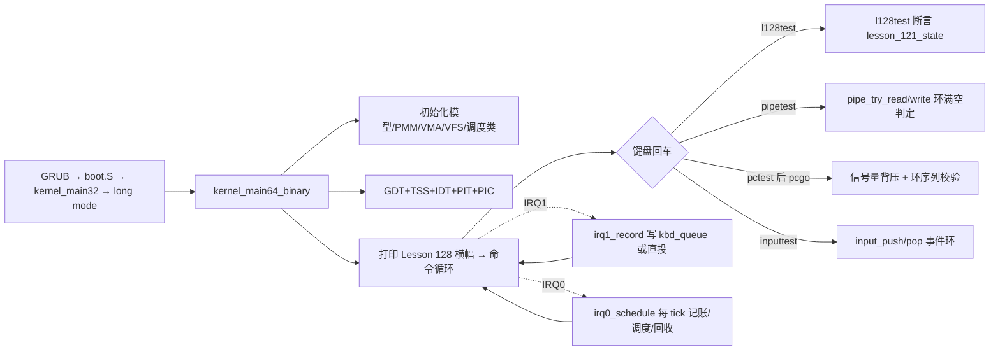

# Lesson 128: tracing ring buffer — 精讲文档

> **课号**：Lesson 128 ｜ **主题**：tracing ring buffer（追踪环形缓冲区）
> **课程主线位置**：并发/诊断检查点阶段（Lesson 106–132），本课为 Lesson 106 原型的第 22 个检查点
> **前置课程**：[`../lesson-127-stable/README.md`](../lesson-127-stable/README.md)（RCU 与调度集成）
> **后续课程**：[`../lesson-129-stable/README.md`](../lesson-129-stable/README.md)（事件过滤与采样）
> **一句话目标**：精讲「固定容量环形缓冲区（ring buffer）」作为内核可观测性基础——生产者在中断/线程侧写入、消费者在命令侧读出、容量满则丢弃或阻塞——并检查内核中键盘、管道、生产者-消费者、输入事件、workqueue 五处环形结构的 head/tail 包裹与满/空判定，用 `l128test` 检查点做确定性验证。

> **Course status: stable snapshot.** 本课为稳定快照：教学内核用固定容量、无宿主调用（freestanding）的方式，对 bounded concurrency、SMP、RCU、diagnostics 元数据进行确定性建模。**旧 README 记载的命令 `l121test` 不存在**，以源码为准勘误为 `l120test` 与 `l128test`，另加继承的进程、GUI、子系统回归命令。会话不变量保持不变。

本课是检查点课：`kernel64.c` 相对上一课（lesson-127）只有两处 diff 块——把 `l127test`（复用 `lesson_120_state`）拆为 `l120test()` 与新增 `l128test()`（新增 `struct lesson_121_model`/`lesson_121_state`），并把 `about`/开机横幅换成「tracing ring buffer」。环形缓冲区机制本体由早期课程累积代码承载：键盘 IRQ1 环（`kbd_queue`）、管道环（`pipe_model`）、生产者-消费者环（`pc_buffer`）、输入事件环（`input_queue`）、workqueue 环（`workqueue[]`），本课按主题统一精讲它们的共性。

---

## 1. 课程定位（Mission）

**学完本课你能**：画出任意固定容量环形缓冲区的状态机（空/非空/满）与 `head/tail` 包裹规则；说清「生产者越过消费者时丢弃（overflow）、消费者追上空缓冲时阻塞」两种背压策略的区别；在教学内核中逐一指出 `kbd_queue`、`pipe_model`、`pc_buffer`、`input_queue`、`workqueue[]` 五个环的容量、`head/tail` 更新式与满/空判定；运行 `l128test`/`l120test` 并用 `pipetest`/`polltest`/`pctest`+`pcgo`/`inputtest`/`softirqtest` 实测各环。

**在课程主线中的位置**：Lesson 106 起进入并发/诊断检查点序列，Lesson 125–127 讲 RCU 回收与调度集成（关注「时间轴上记账」），本课把视角转向**可观测性**：内核如何在有限的固定内存里持续记录事件流。环形缓冲区是 ftrace/perf 的底层数据结构，也是后续「事件过滤与采样」（Lesson 129）、「崩溃诊断快照」（Lesson 132）的容器。下一课（Lesson 129）在环之上加过滤与采样。

**前置知识清单**（学本课前必须掌握）：
1. 键盘 IRQ1 环：`kbd_queue[KBD_QUEUE_SIZE]`、`kbd_head/kbd_tail`、`(head+1)&(KBD_QUEUE_SIZE-1)` 的 2 的幂包裹（Lesson 20 起）。
2. 生产者-消费者同步：`pc_spaces`/`pc_items` 两个信号量与 `pc_buffer` 环（Lesson 60 起）。
3. 管道环：`pipe_model.data[PIPE_CAP]`、`head/tail/used` 三计数法（Lesson 58 起）。
4. workqueue 环：`workqueue[WORK_CAP]`、`work_head/work_tail/work_used` 与 `softirq_run_budget` 消费（Lesson 74 起）。
5. 检查点模型约定：`lesson_N_model`/`lNtest()` 的 a/b/c/d 与 valid/active/ready/accounted 字段（Lesson 69 起）。

**本课交付（可见结果）**：
- 开机横幅与 `about` 显示 `Lesson 128: tracing ring buffer`；
- 新命令 `l128test` 输出 `l128test: bounded concurrency, SMP, RCU, and diagnostics checkpoint passed`（异常时输出 `Lesson 121 fallback reported`）；
- `pipetest`/`polltest`/`inputtest`/`softirqtest` 验证各环形结构的满/空与背压行为。

---

## 2. 核心概念精讲

### 2.1 环形缓冲区：固定容量上的无移动 FIFO

**直觉**：内核要持续记录事件（按键、tick、I/O），但事件数无限、内存有限，且记录不能频繁搬移数据。环形缓冲区把一块连续内存当「环」用：`head` 指向下一个写入位，`tail` 指向下一个读取位，两者都只增不减（靠取模或掩码回绕）。读者追上写者就是「空」，写者追上读者就是「满」。

**三类状态判定**（以容量 `CAP` 为例）：
- 空：`head == tail`（或 `used == 0`）；
- 满：`(head+1) % CAP == tail`（预留一槽）或 `used == CAP`（独立计数器）；
- 包裹：`head = (head+1) % CAP`，写满后自然回绕到数组头。

**背压（backpressure）两种策略**：
1. **丢弃（drop）**：满时丢弃新事件并计数——追踪缓冲通常如此（丢最近的或最旧的），代价是不丢记录、生产者永不阻塞；
2. **阻塞（block）**：满时生产者挂到等待队列——管道/生产者-消费者如此，代价是生产者可能被阻塞。

教学内核两种策略都有：`kbd_queue`/`input_queue` 满时丢弃（`kbd_overflow_count`/`input_dropped`），`pipe_model`/`pc_buffer` 满时阻塞（`blocked_writers`/`sem_down`）。

### 2.2 tracing ring buffer：事件流的最小容器

**Linux 侧**：ftrace 的环形缓冲区（`kernel/trace/ring_buffer.c`）把一个大缓冲区切成多个 per-CPU 子缓冲区（sub-buffer），维护 `commit` 与 `read` 两个指针：写者拿到 commit 位置写入事件后提交，读者从 read 位置读取；写满当前子缓冲就翻页（overwrite 或 discard）。教学模型没有页级子缓冲，但保留了「环形 + head/tail + 满/空 + 丢弃计数」的核心。

**本课视角**：本内核的五处环正是「tracing ring buffer」思想的分散实例。把它们的容量、生产者、消费者、丢弃/阻塞策略列成一张表（见 2.3），就能看出同一个数据结构模式在不同子系统里的形态。

### 2.3 内核中的五处环形缓冲区一览

| 环 | 容量 | 生产者 | 消费者 | 满时策略 | 空时策略 |
|---|---|---|---|---|---|
| `kbd_queue` | `KBD_QUEUE_SIZE=64` | IRQ1 `irq1_record` | 命令循环 `kbd_dequeue` | 丢弃并 `kbd_overflow_count++` | 返回 0，shell `sti;hlt` |
| `pipe_model.data` | `PIPE_CAP=4` | `pipe_try_write` | `pipe_try_read` | 阻塞（`blocked_writers++`） | 阻塞（`blocked_readers++`） |
| `pc_buffer` | `PC_BUFFER_CAP=2` | `pc_producer`（信号量） | `pc_consumer`（信号量） | 阻塞（`sem_down(pc_spaces)`） | 阻塞（`sem_down(pc_items)`） |
| `input_queue` | `INPUT_QUEUE_CAP=16` | `input_push`（键盘/鼠标/定时器） | `input_pop`（GUI 消费） | 丢弃并 `input_dropped++` | 返回 0 |
| `workqueue[]` | `WORK_CAP=4` | `workqueue_submit` | `softirq_run_budget` | 丢弃并 `softirq_model.drops++` | 清 pending 位 |

### 2.4 检查点模型：l120test / l128test

本课把上一课的 `l127test` 拆成两步推进：`l120test()` 复用 `lesson_120_model`（四元组 120,121,122,123），`l128test()` 使用新增的 `lesson_121_model`（四元组 121,122,123,124）。断言仍为「四布尔位 + `b==a+1`」，与 lesson-127 的语义一致；主题轮换仅反映在横幅与命令名上，检查点本体是并发/诊断元数据的连续覆盖。

---

## 3. 源码精讲

### 3.1 文件清单与职责

| 文件 | 职责 | 本课增量（相对 lesson-127） |
|---|---|---|
| `boot.S` | Multiboot2 头、32 位入口、进入 long mode、`.text64` 内嵌 `kernel64.bin` | 未变化 |
| `kernel.c` | 32 位侧：解析 MBI/内存图/帧缓冲，建立页表与用户镜像，`long_mode_handoff` 交接 | 未变化 |
| `kernel64.c` | 64 位主内核：命令循环、调度器、五处环形缓冲区机制、全部检查点测试 | 见 3.2 增量列表 |
| `kernel64.ld` | 64 位裸二进制布局，三组 guard+payload 栈区及 ASSERT | 未变化 |
| `linker.ld` | 外层 ELF 布局 | 未变化 |
| `Makefile` | 构建 kernel.iso、`check` 校验、`run` | `check` 中 grep 串换为 `Lesson 128`/`l128test`/`tracing ring buffer` |
| `grub.cfg` | GRUB 菜单项 | 未变化 |

### 3.2 kernel64.c 精讲（本课增量 + 环形机制）

#### 本课增量一：检查点模型与测试

```c
static TEXT64 void l120test(u16*c){lesson_120_state=(struct lesson_120_model){120U,121U,122U,123U,1,1,1,1};int ok=lesson_120_state.valid&&lesson_120_state.active&&lesson_120_state.ready&&lesson_120_state.accounted&&lesson_120_state.b==lesson_120_state.a+1U;text64(c,"l120test: ");text64(c,ok?"bounded concurrency, SMP, RCU, and diagnostics checkpoint passed":"Lesson 120 fallback reported");putc64(c,'\n');}
```
- 上一课 `l127test` 使用同一 `lesson_120_state`；本课把它降格为独立命令 `l120test`，四元组 `{120U,121U,122U,123U}` 与四个布尔位 `1` 整体赋值。
- 算法步骤：(1) 整体赋值模型；(2) 求 `ok=valid&&active&&ready&&accounted&&(b==a+1)`；(3) 打印 `"l120test: "` 前缀与成功串/fallback 串。
- 边界处理：任何字段不满足即输出 fallback，无副作用、可重复执行。

```c
struct lesson_121_model { u32 a,b,c,d; u8 valid,active,ready,accounted; };
static struct lesson_121_model lesson_121_state;
static TEXT64 void l128test(u16*c){lesson_121_state=(struct lesson_121_model){121U,122U,123U,124U,1,1,1,1};int ok=lesson_121_state.valid&&lesson_121_state.active&&lesson_121_state.ready&&lesson_121_state.accounted&&lesson_121_state.b==lesson_121_state.a+1U;text64(c,"l128test: ");text64(c,ok?"bounded concurrency, SMP, RCU, and diagnostics checkpoint passed":"Lesson 121 fallback reported");putc64(c,'\n');}
```
- 本课新增 `lesson_121_model` 结构与状态对象，`l128test()` 为其测试。四元组 `{121,122,123,124}`，成功串为 `"bounded concurrency, SMP, RCU, and diagnostics checkpoint passed"`，fallback 串为 `"Lesson 121 fallback reported"`。
- 设计动机：检查点按「一课一模型」推进，模型结构本身不变（四字段四布尔位），只有课号四元组与 fallback 串随课递增——这是本系列所有 `lesson_N_model` 的公共形态，便于以最小 diff 维持整个 106–132 序列的连续性验证。

#### 本课增量二：exec64 命令表与横幅

```c
else text64(c,"Lesson 128: tracing ring buffer\n");
```
- `about` 与开机横幅 `"Lesson 128: tracing ring buffer\nGETTICKS, GETPID, WRITE_CONSOLE, EXIT; unknown=-ENOSYS; bounded reclaim metadata\n"` 两处更新；命令表把上一课的 `l127test` 分支换成 `l120test` 与 `l128test` 两个分支，`help` 长串对应位置为 `...l119test l120test l128test resourceinfo...`。这两处横幅串是 Makefile `check` 中 `grep -q 'tracing ring buffer' README.md` 与 `grep -q 'Lesson 128' README.md` 的源码侧锚点。

#### 主题机制一：键盘 IRQ1 环（丢弃型，2 的幂掩码包裹）

```c
static volatile u8 kbd_queue[KBD_QUEUE_SIZE];
static volatile u8 kbd_head, kbd_tail;
```
- `KBD_QUEUE_SIZE=64` 是 2 的幂，因此包裹用位掩码 `&(KBD_QUEUE_SIZE-1)` 而非取模——编译器生成与运算，更快。
- `kbd_head`（生产者）由 IRQ1 写，`kbd_tail`（消费者）由命令循环读，两变量 `volatile` 保证中断与主循环间可见。

```c
static TEXT64 void irq1_record(void){u8 raw=inb64(0x60),ch,next,id;irq1_last_scancode=raw;irq1_raw_count++;if(!(raw&0x80)){irq1_count++;ch=(u8)scan64(raw);if(ch){if(waitq_wake_one(&kbd_waitq,THREAD_BLOCKED_KBD,&id)){threads[id].mailbox=ch;threads[id].mailbox_ready=1;kbd_direct_deliveries++;}else{next=(u8)((kbd_head+1)&(KBD_QUEUE_SIZE-1));if(next==kbd_tail)kbd_overflow_count++;else{kbd_queue[kbd_head]=ch;kbd_head=next;}}}}outb64(PIC1_COMMAND,PIC_EOI);}
```
- 第 1–3 步：读 PS/2 端口 `0x60`，记录原始字节与 make-code 计数；只处理按下（`!(raw&0x80)`）。
- 第 4 步：优先「直投」——若有线程阻塞在 `kbd_waitq`，直接把字符放进该线程邮箱并 `wake_one`，不进环（`kbd_direct_deliveries++`）。
- 第 5 步：否则走环。`next=(head+1)&63` 预判下一写位；`next==tail` 即满，`kbd_overflow_count++` 丢弃；否则写入并推进 `head`。丢弃策略保证 ISR 永不阻塞。
- 第 6 步：`outb64(PIC1_COMMAND,PIC_EOI)` 应答 EOI，缩短中断屏蔽窗口。

```c
static TEXT64 int kbd_dequeue(u8 *ch){u8 tail;__asm__ volatile("cli":::"memory");tail=kbd_tail;if(tail==kbd_head){__asm__ volatile("sti":::"memory");return 0;}*ch=kbd_queue[tail];kbd_tail=(u8)((tail+1)&(KBD_QUEUE_SIZE-1));__asm__ volatile("sti":::"memory");return 1;}
```
- 关中断读取并快照 `tail`（防止与 IRQ1 生产竞争）；`tail==head` 为空返回 0；非空则取字符、推进 `tail`、恢复中断。
- 边界：一次只取一个字符，shell 主循环逐字符消费；空时 shell `sti;hlt` 进入休眠，由 IRQ0/IRQ1 唤醒。

#### 主题机制二：管道环（阻塞型，三计数法）

```c
static TEXT64 int pipe_try_write(u8 value){u8 id;if(pipe_model.used>=PIPE_CAP){pipe_model.blocked_writers++;return 0;}pipe_model.data[pipe_model.head]=value;pipe_model.head=(u8)((pipe_model.head+1)%PIPE_CAP);pipe_model.used++;pipe_model.writes++;if(waitq_wake_one(&pipe_read_wait,THREAD_BLOCKED_EVENT,&id))pipe_model.wake_readers++;return 1;}
```
- 用独立计数器 `used` 判定满（`used>=PIPE_CAP`），因此环不需要预留空槽；`head` 用 `%PIPE_CAP` 包裹（`PIPE_CAP=4` 非 2 的幂，取模与掩码等价性只对 2 的幂成立，这里必须取模）。
- 写入后 `used++` 并 `wake_one` 唤醒阻塞读方；满时 `blocked_writers++` 返回 0，由上层语义决定重试或阻塞。

```c
static TEXT64 int pipe_try_read(u8*out){u8 id;if(!pipe_model.used){pipe_model.blocked_readers++;return 0;}*out=pipe_model.data[pipe_model.tail];pipe_model.tail=(u8)((pipe_model.tail+1)%PIPE_CAP);pipe_model.used--;pipe_model.reads++;if(waitq_wake_one(&pipe_write_wait,THREAD_BLOCKED_EVENT,&id))pipe_model.wake_writers++;return 1;}
```
- 空判定 `!used`；读后 `used--` 并唤醒写方。`pipetest` 断言「空读失败、写 0x41、读回 0x41、写满后写失败」：`"pipetest: bounded FIFO empty/full blocking transitions passed"`。

#### 主题机制三：生产者-消费者环（信号量背压）

```c
static TEXT64 void pc_producer(void){u8 value;while(threads[1].progress<THREAD_STEPS){sem_down(&pc_spaces);{u64 flags=irq_save64();value=pc_next++;pc_buffer[pc_head]=value;pc_head=(u8)((pc_head+1)%PC_BUFFER_CAP);pc_used++;pc_produced++;irq_restore64(flags);}threads[1].progress++;sem_up(&pc_items);busy_delay();}thread_exit();}
```
- `sem_down(&pc_spaces)`（初值 `PC_BUFFER_CAP`）作为「空闲槽计数」，满时阻塞在信号量等待队列——这是比丢弃更温和的背压：生产者挂起而非丢事件。
- 临界区用 `irq_save64/irq_restore64` 保护 `pc_buffer`/`pc_head`/`pc_used`，与消费者互斥；`pc_next++` 保证序号唯一，供消费者做序列校验。
- `sem_up(&pc_items)` 通知消费者。`pc_consumer` 对称：`sem_down(&pc_items)` 空时阻塞，读 `pc_buffer[pc_tail]` 并比对 `pc_expected`，不符则 `pc_sequence_errors++`。

```c
static TEXT64 void pc_reset(void){u64 flags=irq_save64();pc_head=pc_tail=pc_used=pc_next=pc_expected=0;pc_produced=pc_consumed=pc_sequence_errors=0;pc_start_event.signaled=0;pc_start_event.sets=pc_start_event.resets=pc_start_event.waits=pc_start_event.wakes=0;waitq_reset(&pc_start_event.waitq);sem_init(&pc_spaces,PC_BUFFER_CAP,PC_BUFFER_CAP);sem_init(&pc_items,0,PC_BUFFER_CAP);irq_restore64(flags);}
```
- `pctest` 启动两个线程并令其阻塞在 `pc_start_event`；`pcgo` 用 `event_set` 广播放行。`pcinfo` 打印 `R used/cap` 与 `P prod/cons` 及 `P errors/ok`，全流程成功后 `errors==0` 且最终 `sc==PC_BUFFER_CAP&&!ic`——两个环回到初态。

#### 主题机制四：输入事件环与 workqueue 环

```c
#define INPUT_QUEUE_CAP 16
struct input_event { u8 type,code,flags; int x,y; };
static struct input_event input_queue[INPUT_QUEUE_CAP];
static u32 input_head,input_tail,input_dropped,input_keyboard,input_mouse,input_timer;
static TEXT64 int input_push(u8 type,u8 code,u8 flags,int x,int y){u32 next=(input_head+1)%INPUT_QUEUE_CAP;if(next==input_tail){input_dropped++;return 0;}input_queue[input_head]=(struct input_event){type,code,flags,x,y};input_head=next;return 1;}
```
- `input_queue` 存键盘/鼠标/定时器三类事件（`type==1/2/3`），预留一槽判满（`(head+1)%CAP==tail`），满则 `input_dropped++` 丢弃。`inputtest` 推 4 键 1 鼠 1 定时器，断言 `"inputtest: bounded keyboard/mouse/timer event queue passed"`。

```c
static TEXT64 int workqueue_submit(u8 kind,u8 data){if(work_used>=WORK_CAP){softirq_model.drops++;return 0;}workqueue[work_head]=(struct work_model){kind,data,1,0};work_head=(u8)((work_head+1)%WORK_CAP);work_used++;softirq_raise(1);return 1;}
```
- workqueue 环满时 `drops++` 丢弃并置位 softirq；`softirq_run_budget` 从 `work_tail` 逐个消费直到预算耗尽。`softirqtest` 断言 4 个提交 + 1 个拒绝（`a`）、预算两轮消费干净（`b`/`d`）：`"softirqtest: tasklet coalescing, FIFO work, and budget carry-over passed"`。

#### 继承的关键基础设施（本课引用，机制来自早期课）

```c
static TEXT64 u64 irq_save64(void){u64 flags;__asm__ volatile("pushfq; popq %0; cli":"=r"(flags)::"memory");return flags;}
static TEXT64 void irq_restore64(u64 flags){if(flags&(1ULL<<9))__asm__ volatile("sti":::"memory");}
```
- 环形结构在中断（IRQ1/IRQ0）与线程上下文间共享，写侧一律先 `irq_save64` 关中断；`irq_restore64` 依据保存的 RFLAGS.IF 位决定是否恢复中断——嵌套临界区安全。
- 本课所有环的「关中断 + 更新指针 + 开中断」组合都依赖这对原语；它们同时是本课 `l120test/l128test` 之外、真正支撑「tracing 事件入环」的运行时代价。

### 3.3 构建管线（Makefile / linker）

- 构建链与 lesson-127 相同：`kernel64.c`（`-m64 -mno-red-zone -fpie ...`）→ `kernel64.ld` 链接 → `objcopy -O binary` → `boot.S` `.incbin` 内嵌 → 外层 `linker.ld` 组 ELF → `grub-mkrescue` 出 ISO。
- `check` 目标：`grub-file --is-x86-multiboot2 build/kernel.elf` + `grep -q 'tracing ring buffer' README.md` + `grep -q 'l128test' kernel64.c` + `grep -q 'Lesson 128' README.md`，全过后打印 `Multiboot2 and Lesson 128 checks passed.`。
- 本课构建步骤相对上一课零新增——只有检查串随课号轮换。

### 3.4 主控制流


- 环形事件的生产者分两类：硬件中断（IRQ1 键盘）与线程（producer worker），消费者都是 shell 命令循环或软中断预算；命令 `l128test` 走 `exec64` 分派后直接打印断言结果。

---

## 4. 数据流与运行逻辑

1. 开机：`kernel_main64_binary` 初始化后打印 `Lesson 128: tracing ring buffer` 横幅并进入 `tinyos> ` 循环。
2. 输入 `l128test`：`exec64` 命中 `l128test` 分支 → `l128test(c)` 整体赋值 `lesson_121_state={121,122,123,124,1,1,1,1}` → 求 `ok` → 输出 `l128test: bounded concurrency, SMP, RCU, and diagnostics checkpoint passed`。
3. 输入 `pipetest`：`pipe_try_read` 空失败（`a`）→ `pipe_try_write(0x41)` 成功（`b`）→ 读回 `0x41`（`d/e`）→ 强制 `used=PIPE_CAP` 后写失败（`g`）→ 输出 `pipetest: bounded FIFO empty/full blocking transitions passed`。
4. 输入 `pctest` 后 `pcgo`：两个 worker 阻塞在 `pc_start_event`；`pcgo` 输出 `pcgo: event set; broadcast wake-all issued` 放行；`pcinfo` 显示 `P errors/ok: 0 1`（`ok` 列）即环序列正确。
5. 输入 `about`：输出 `Lesson 128: tracing ring buffer`。
6. 后台：每次按键由 IRQ1 `irq1_record` 写键盘环（或直投等待线程）；每 tick 由 `irq0_schedule` 完成调度与延迟回收。

---

## 5. 构建、运行与验证

**依赖**：`gcc`、`binutils`、`grub-mkrescue`、`grub-file`、`qemu-system-x86_64`（与 lesson-127 相同）。

**构建**（与 Makefile 一致）：
```bash
cd lessons/lesson-128-stable
make clean && make -j"$(nproc)"
make check
```
- `make check` 预期最后一行：`Multiboot2 and Lesson 128 checks passed.`

**运行**：
```bash
make run
```
成功画面在 QEMU 图形窗口，**勿加 `-display none`**。

**验证步骤**（输出串从源码逐字抄录）：
1. `about` → `Lesson 128: tracing ring buffer`
2. `l128test` → `l128test: bounded concurrency, SMP, RCU, and diagnostics checkpoint passed`
3. `l120test` → `l120test: bounded concurrency, SMP, RCU, and diagnostics checkpoint passed`
4. `pipetest` → `pipetest: bounded FIFO empty/full blocking transitions passed`
5. `polltest` → `polltest: POLLIN/POLLOUT readiness transitions passed`
6. `inputtest` → `inputtest: bounded keyboard/mouse/timer event queue passed`
7. `softirqtest` → `softirqtest: tasklet coalescing, FIFO work, and budget carry-over passed`
8. `pctest` → `pctest: producer and consumer blocked on start event; run pcgo`；随后 `pcgo` → `pcgo: event set; broadcast wake-all issued`

**如何判断成功**：`l128test` 输出成功串即检查点通过；`make check` 打印 `Multiboot2 and Lesson 128 checks passed.`。

---

## 6. 调试地图

| 现象 | 原因 | 检查方法 |
|---|---|---|
| `l128test` 输出 `Lesson 121 fallback reported` | `lesson_121_state` 四布尔位或 `b==a+1` 断言失败 | 检查 `l128test` 初始化 `{121U,122U,123U,124U,1,1,1,1}`；`about` 确认是 128 内核 |
| `make check` grep 失败 | README 缺 `Lesson 128`/`l128test`/`tracing ring buffer` | `grep -n 'Lesson 128\|l128test\|tracing ring buffer' README.md` |
| 输入 `l121test` 显示 `unknown command` | 该命令在源码中不存在（旧 README 误记） | 以源码为准输入 `l120test`/`l128test`；`help` 列出 `...l119test l120test l128test...` |
| 按键偶尔丢失、`kbdinfo` 的 `overflows` 增长 | `kbd_queue` 满且 IRQ1 未直投任何等待线程 | 观察 `kbdinfo` 的 `ring head/tail` 差是否接近 64；`irq1_record` 的直投路径是否有 `THREAD_BLOCKED_KBD` 线程 |
| `pipetest` 输出 `BROKEN` | 管道环 `used` 计数或 `%PIPE_CAP` 包裹出错 | 检查 `pipe_try_write/pipe_try_read` 的 `used++/--` 与 `head/tail` 取模是否成对 |
| `pcinfo` 的 `P errors/ok: 0 0` | 生产/消费未完成或 `pc_sequence_errors>0` | 先 `pctest` 再 `pcgo`；确认 `pc_spaces/pc_items` 初值与 `sem_up` 配对 |
| `inputtest` 输出 fallback | `input_queue` 满或类型计数不符 | 检查 `input_push` 的 `(head+1)%INPUT_QUEUE_CAP==tail` 预判与 `input_head` 推进 |
| `softirqtest` 输出 `BROKEN` | workqueue 环 `work_used` 与 `work_head/tail` 不同步 | 检查 `workqueue_submit` 满时 `drops++` 与 `softirq_run_budget` 的 `work_tail` 消费 |

---

## 7. 与 Linux 源码对照

| 对照点 | TinyOS 教学模型（本课） | Linux 实现 | 教学模型简化了什么 |
|---|---|---|---|
| 追踪环整体结构 | 五处独立固定容量环（`kbd_queue`/`pipe_model`/`pc_buffer`/`input_queue`/`workqueue`），`head/tail` 指针 | `kernel/trace/ring_buffer.c`：per-CPU 子缓冲区 + `commit`/`read` 指针 + `rb_commit`/`rb_get_reader_page` | 无页级子缓冲与 per-CPU 独立缓冲，单 CPU 全局数组 |
| 满/空判定 | `used==CAP` 或 `(head+1)%CAP==tail` | `rb_try_to_discard`/`rb_event_index` 依赖写指针与读指针比较 | 无 overwrite 模式与事件长度可变 |
| 丢弃策略 | `kbd_overflow_count`/`input_dropped`/`softirq_model.drops` 计数 | `kernel/trace/trace.c`：`RB_FLAG_OVERWRITE` 或 DISCARD 事件 | 教学模型丢弃的是裸字节，不写 trace event 头 |
| 阻塞背压 | 管道/生产者-消费者 `sem_down` 挂起生产者 | 管道 `kernel/pipe.c` `pipe_write` 睡眠于 `pipe->wr_wait` | 信号量教学实现替代 waitqueue 管道语义 |
| 事件直投 | IRQ1 `waitq_wake_one` 直接投递键盘字符到线程邮箱 | 输入子系统 `drivers/input/input.c` `input_event` 分发给 handler | 无 input_dev/handler 注册表 |
| 生产侧中断保护 | `irq_save64`/`irq_restore64` 包裹环写 | `kernel/trace/ring_buffer.c`：`local_irq_save` + per-CPU `ring_buffer_lock` | 单 CPU 关中断即可，无跨 CPU 锁 |

权威来源：Intel SDM（IRQ/IF 位、`inb/outb` PS/2 端口 0x60）、GNU GRUB（`grub-file` Multiboot2 校验）、Linux 内核源码路径如上表。

---

## 8. 思考题与练习

1. **概念理解**：用一句话区分「丢弃型」与「阻塞型」环形缓冲区，并举出本内核各一个实例；为什么 `kbd_queue` 必须用丢弃型？
2. **源码定位**：分别找到五处环的 `head/tail` 更新语句，说明哪些用 `&(CAP-1)`、哪些用 `%CAP`、为什么（提示：2 的幂与取模的关系）。
3. **动手实验**：把 `PIPE_CAP` 从 4 改为 3，重新构建运行 `pipetest`，观察断言是否仍成立；说明 `%PIPE_CAP` 在该改动下是否正确包裹。
4. **动手实验**：把 `PC_BUFFER_CAP` 从 2 改为 4，运行 `pctest`+`pcgo`+`pcinfo`，验证 `pc_sequence_errors` 保持 0，解释信号量初值 `pc_spaces` 与容量的一致性要求。
5. **Linux 对照**：对照 `kernel/trace/ring_buffer.c` 的 commit/read 双指针与本课 `pipe_model` 的 head/tail 三计数法，列出教学模型未实现的三个特性（如可变长事件、overwrite、per-CPU 缓冲）。

---

## 9. 本课小结与下一课预告

**小结**：本课是第 106 号并发/诊断原型的第 22 个检查点，主题「tracing ring buffer」。新增 `lesson_121_model` 与 `l128test()`，把 `l127test` 拆为 `l120test()`，命令表与横幅更新为 Lesson 128。核心结论：固定容量环形缓冲区是内核可观测性的最小容器，本内核五处环共享同一「head/tail + 满/空 + 背压」模式，按子系统选择丢弃（键盘/输入/workqueue）或阻塞（管道/生产者-消费者）；`irq_save64` 保证中断与线程间的生产安全。`l128test`、`pipetest`、`polltest`、`inputtest`、`softirqtest` 与 `pctest`+`pcgo` 构成可复现的验证面，`make check` 的 `Multiboot2 and Lesson 128 checks passed.` 是构建级成功标志。

**下一课预告**：Lesson 129 主题为 **事件过滤与采样**（event filtering and sampling）——在环形缓冲区之上加过滤条件与采样率（`lesson_122_model` 与 `l129test`）。衔接点：本课环的「入环丢弃」策略是下一课过滤器的雏形，而 `l120test`/`l128test` 的检查点推进方式将延续到下一课的 `l129test`。
