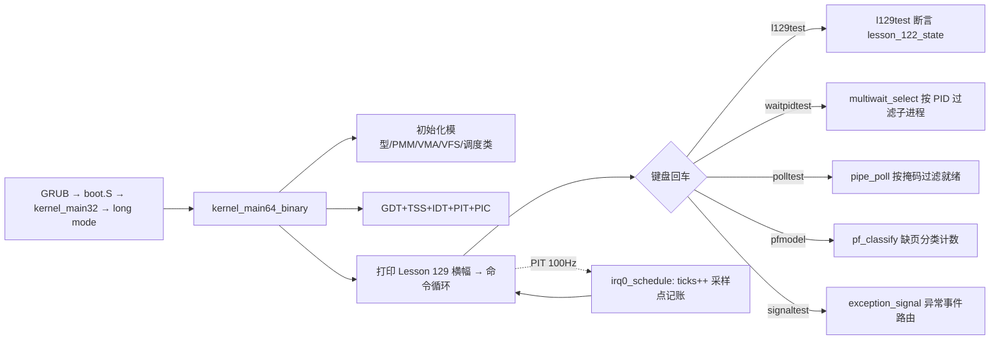

# Lesson 129: 事件过滤与采样 — 精讲文档

> **课号**：Lesson 129 ｜ **主题**：事件过滤与采样（event filtering and sampling）
> **课程主线位置**：并发/诊断检查点阶段（Lesson 106–132），本课为 Lesson 106 原型的第 23 个检查点
> **前置课程**：[`../lesson-128-stable/README.md`](../lesson-128-stable/README.md)（tracing ring buffer）
> **后续课程**：[`../lesson-130-stable/README.md`](../lesson-130-stable/README.md)（锁依赖图）
> **一句话目标**：精讲可观测性的两条降噪路径——**过滤**（按谓词丢弃不关心的事件，如 `multiwait_select` 按 PID 选子进程、`pipe_poll` 按掩码查就绪、`pf_classify` 对缺页分类）与**采样**（按固定节拍抽取事件子集，如 PIT 100 Hz 时钟对状态做周期性快照）——用 `l129test` 检查点做确定性验证。

> **Course status: stable snapshot.** 本课为稳定快照：教学内核用固定容量、无宿主调用（freestanding）的方式，对 bounded concurrency、SMP、RCU、diagnostics 元数据进行确定性建模。**旧 README 记载的命令 `l122test` 不存在**，以源码为准勘误为 `l120test`/`l121test`/`l129test`，另加继承的进程、GUI、子系统回归命令。会话不变量保持不变。

本课是检查点课：`kernel64.c` 相对上一课（lesson-128）只有两处 diff 块——补全 `l121test()`、新增 `struct lesson_122_model`/`lesson_122_state` 与 `l129test()`，并把 `about`/开机横幅换成「事件过滤与采样」。过滤与采样机制本体由早期课程累积代码承载：`multiwait_select`/`waitpidtest`（PID 过滤）、`pipe_poll`/`polltest`（就绪掩码过滤）、`pf_classify`/`pfmodel`（缺页分类）、`exception_signal`（异常到信号的事件路由）、PIT 100 Hz 时钟与 `irq0_schedule`（tick 采样），本课按主题统一精讲。

---

## 1. 课程定位（Mission）

**学完本课你能**：区分「过滤（filtering）」与「采样（sampling）」两种事件降噪手段——过滤靠**谓词**决定事件是否保留，采样靠**节拍**决定事件是否被抽取；在教学内核中沿 `multiwait_select`（PID 精确过滤）、`pipe_poll`（POLL_IN/POLL_OUT 就绪过滤）、`pf_classify`（缺页三类分类）、`exception_signal`（异常事件路由到信号）看懂过滤路径，沿 PIT 100 Hz→`ticks`→`irq0_schedule`/`clock_update` 看懂采样路径；运行 `l129test`/`l120test`/`l121test` 与 `waitpidtest`/`multichildtest`/`polltest`/`pfmodel`/`signaltest` 验证。

**在课程主线中的位置**：Lesson 128 讲环形缓冲区（事件**容器**），本课在容器之上讲事件**选择**——内核不能记录所有事件，必须过滤与采样。这是 ftrace/perf 事件子系统的核心思想（`kernel/trace/trace_events_filter.c`、`kernel/events/core.c` 采样周期）。下一课（Lesson 130）转向锁依赖图，从「事件观测」进入「锁序分析」。

**前置知识清单**（学本课前必须掌握）：
1. 环形缓冲区与事件流：`kbd_queue`/`pipe_model`/`pc_buffer`/`input_queue`（Lesson 128）。
2. wait/多子进程过滤：`multiwait_model`/`multiwait_select`/`waitpidtest`（Lesson 50 起）。
3. poll 就绪语义：`POLL_IN`/`POLL_OUT` 与 `pipe_poll`（Lesson 58 起）。
4. 缺页分类与异常路由：`pf_classify` 的 PF_NOT_PRESENT/PF_PROTECTION/PF_UNMAPPED 与 `exception_signal`（Lesson 42/45 起）。
5. PIT 时钟与调度 tick：`PIT_RATE_HZ=100`、`ticks`、`clock_update`（Lesson 20/88 起）。

**本课交付（可见结果）**：
- 开机横幅与 `about` 显示 `Lesson 129: 事件过滤与采样`；
- 新命令 `l129test` 输出 `l129test: bounded concurrency, SMP, RCU, and diagnostics checkpoint passed`（异常时输出 `Lesson 122 fallback reported`）；
- `waitpidtest`/`multichildtest`/`polltest`/`pfmodel`/`signaltest` 从五个角度实测过滤与分类。

---

## 2. 核心概念精讲

### 2.1 过滤（Filtering）：用谓词选择事件

**直觉**：追踪一个系统会产生海量事件，但排查问题时往往只关心「某个进程的退出」或「读端就绪的管道」。过滤就是在事件**入环之前**或**被消费时**应用一个谓词（predicate）：谓词为真保留，为假丢弃（或标记）。丢弃得越早，开销越小。

**三个层面**（Linux 侧）：
1. **事件过滤器**：`kernel/trace/trace_events_filter.c` 把用户写的过滤表达式（如 `pid == 123`）编译成谓词树，在 `ftrace` 事件触发时求值，不匹配的事件不入缓冲；
2. **通知过滤**：`epoll`/`select`/`poll` 按文件描述符的就绪掩码（`POLLIN`/`POLLOUT`）过滤出「用户关心的可操作事件」；
3. **错误分类**：异常/错误码本身是一种分类过滤——`#PF` 的 error code 区分 not-present/write/protection，驱动决定是否修复。

**教学内核实例**：`multiwait_select(pid)` 是「按 PID 精确过滤子进程」；`pipe_poll(mask)` 是「按掩码过滤就绪条件」；`pf_classify(va,write)` 是「对缺页地址分类」；`exception_signal(f)` 是「把异常事件路由为信号」。

### 2.2 采样（Sampling）：按节拍抽取事件

**直觉**：过滤靠条件、采样靠**概率或节拍**。当事件量太大、谓词也无法压实时，每隔 N 个事件（或每 N 个 tick）抽取一个代表即可——统计上足够还原系统的分布特征。CPU 性能分析器（perf）默认就是这么工作的：按固定周期触发 PMU 中断，记录「此刻正在执行什么」，叠加起来就是热点分布。

**采样与过滤的本质区别**：
```
过滤: 对每个事件求谓词 → 保留(真) / 丢弃(假)      —— 保真但不保量
采样: 对事件流数拍 → 第 N 个保留，其余跳过        —— 保量(上限)但不保真(代表)
```

**教学内核实例**：PIT 通道 0 以 `PIT_RATE_HZ=100`（`PIT_DIVISOR=11932`）每 10ms 触发一次 IRQ0——这就是一个 100 Hz 的采样时钟；`irq0_schedule` 里 `ticks++`、`clock_update` 用 `ticks` 换算单调时钟，`timer_poll` 按 `deadline_tick` 判到期，`softirq_run_budget` 按预算执行延迟工作。调度器对线程状态、软中断、睡眠者的检查都**只在采样点上进行**，而不是逐指令连续监控——这是内核能承受「每 10ms 记账一次」的关键。

### 2.3 检查点模型：l120test / l121test / l129test

本课把上一课的 `l128test` 拆成两步推进：`l121test()` 补全 `lesson_121_model` 的测试（四元组 121,122,123,124），`l129test()` 使用新增的 `lesson_122_model`（四元组 122,123,124,125）。断言仍为「四布尔位 + `b==a+1`」；主题轮换反映在横幅与命令名上，检查点本体是并发/诊断元数据的连续覆盖。

---

## 3. 源码精讲

### 3.1 文件清单与职责

| 文件 | 职责 | 本课增量（相对 lesson-128） |
|---|---|---|
| `boot.S` | Multiboot2 头、32 位入口、进入 long mode、`.text64` 内嵌 `kernel64.bin` | 未变化 |
| `kernel.c` | 32 位侧：解析 MBI/内存图/帧缓冲，建立页表与用户镜像，`long_mode_handoff` 交接 | 未变化 |
| `kernel64.c` | 64 位主内核：命令循环、调度器、过滤/采样机制、全部检查点测试 | 见 3.2 增量列表 |
| `kernel64.ld` | 64 位裸二进制布局，三组 guard+payload 栈区及 ASSERT | 未变化 |
| `linker.ld` | 外层 ELF 布局 | 未变化 |
| `Makefile` | 构建 kernel.iso、`check` 校验、`run` | `check` 中 grep 串换为 `Lesson 129`/`l129test`/`事件过滤与采样` |
| `grub.cfg` | GRUB 菜单项 | 未变化 |

### 3.2 kernel64.c 精讲（本课增量 + 过滤/采样机制）

#### 本课增量一：检查点模型与测试

```c
static TEXT64 void l121test(u16*c){lesson_121_state=(struct lesson_121_model){121U,122U,123U,124U,1,1,1,1};int ok=lesson_121_state.valid&&lesson_121_state.active&&lesson_121_state.ready&&lesson_121_state.accounted&&lesson_121_state.b==lesson_121_state.a+1U;text64(c,"l121test: ");text64(c,ok?"bounded concurrency, SMP, RCU, and diagnostics checkpoint passed":"Lesson 121 fallback reported");putc64(c,'\n');}
```
- 上一课 `l128test` 使用 `lesson_121_state`；本课把它降格为独立命令 `l121test`，四元组 `{121U,122U,123U,124U}` 与四个布尔位整体赋值。
- 算法步骤：(1) 整体赋值模型；(2) 求 `ok=valid&&active&&ready&&accounted&&(b==a+1)`；(3) 打印 `"l121test: "` 前缀与成功/fallback 串。失败即输出 `"Lesson 121 fallback reported"`，无副作用、可重复。

```c
struct lesson_122_model { u32 a,b,c,d; u8 valid,active,ready,accounted; };
static struct lesson_122_model lesson_122_state;
static TEXT64 void l129test(u16*c){lesson_122_state=(struct lesson_122_model){122U,123U,124U,125U,1,1,1,1};int ok=lesson_122_state.valid&&lesson_122_state.active&&lesson_122_state.ready&&lesson_122_state.accounted&&lesson_122_state.b==lesson_122_state.a+1U;text64(c,"l129test: ");text64(c,ok?"bounded concurrency, SMP, RCU, and diagnostics checkpoint passed":"Lesson 122 fallback reported");putc64(c,'\n');}
```
- 本课新增 `lesson_122_model` 结构与状态对象，`l129test()` 为其测试。四元组 `{122,123,124,125}`，成功串 `"bounded concurrency, SMP, RCU, and diagnostics checkpoint passed"`，fallback 串 `"Lesson 122 fallback reported"`。
- 设计动机：检查点按「一课一模型」推进，结构形态不变、仅课号四元组与 fallback 串递增——这是 106–132 序列公共的最小 diff 约定。

#### 本课增量二：exec64 命令表与横幅

```c
else text64(c,"Lesson 129: 事件过滤与采样\n");
```
- `about` 与开机横幅 `"Lesson 129: 事件过滤与采样\nGETTICKS, GETPID, WRITE_CONSOLE, EXIT; unknown=-ENOSYS; bounded reclaim metadata\n"` 更新；命令表把上一课的 `l128test` 分支换成 `l121test` 与 `l129test` 两个分支，`help` 长串对应位置为 `...l120test l121test l129test resourceinfo...`。横幅串是 Makefile `check` 中 `grep -q '事件过滤与采样' README.md` 与 `grep -q 'Lesson 129' README.md` 的源码侧锚点。

#### 主题机制一：按 PID 过滤子进程（multiwait_select）

```c
static TEXT64 int multiwait_select(u64 pid){u32 i;multiwait.waits++;for(i=0;i<3;i++)if(multiwait.states[i]==WAIT_ZOMBIE&&(pid==(u64)-1||pid==multiwait.children[i])){multiwait.selected=multiwait.children[i];return 1;}return 0;}
```
- 这是一个**谓词过滤循环**：对 3 个子进程逐一求「状态为 ZOMBIE 且（`pid==-1` 通配 或 `pid==该子进程`）」；首个命中者被选中。
- `pid==(u64)-1` 是 Linux `waitpid(-1,...)` 的「任意子进程」约定；精确 PID 时只放行目标进程——这就是 `waitpidtest` 里 `a=!multiwait_select(children[0])`（子 0 未退出被滤掉）与 `b=multiwait_select(children[2])`（子 2 已退出被选中）的依据。
- 边界：`states[i]==WAIT_ZOMBIE` 防止重复 reap；`multichildtest` 先让子 1 退出再让子 0 退出，通配选择按数组序取子 0，`reaps==2` 断言顺序性。

#### 主题机制二：按掩码过滤就绪（pipe_poll）

```c
static TEXT64 u8 pipe_poll(u8 mask){u8 ready=0;pipe_model.poll_registrations++;if((mask&POLL_IN)&&pipe_model.used)ready|=POLL_IN;if((mask&POLL_OUT)&&pipe_model.used<PIPE_CAP)ready|=POLL_OUT;return ready;}
```
- 过滤逻辑：只对 `mask` 里**用户请求**的位做检查——`mask&POLL_IN` 时才看 `used>0`（可读），`mask&POLL_OUT` 时才看 `used<PIPE_CAP`（可写）。
- 返回值 `ready` 是「用户请求 ∩ 实际就绪」的交集：没请求的位绝不出现在结果里，这就是 poll 语义的「按需过滤」。
- `polltest` 断言：空管道 `POLL_IN` 不就绪、`POLL_OUT` 就绪（`a/b`）；写入后 `POLL_IN` 就绪（`d`）；写满后 `POLL_OUT` 不成立（`f`）；读出一个后 `POLL_OUT` 恢复（`h`）。对应 Linux `select`/`epoll` 的 `f_op->poll` 回调。

#### 主题机制三：缺页分类（pf_classify）

```c
static TEXT64 enum pf_class pf_classify(u64 va,u8 write){const struct vma_model*v=vma_lookup(va);if(!v){fault_unmapped++;return PF_UNMAPPED;}if((write&&!(v->prot&VMA_W))||(!write&&!(v->prot&VMA_R))){fault_protection++;return PF_PROTECTION;}if(!page_present(va)){fault_not_present++;return PF_NOT_PRESENT;}return PF_NOT_PRESENT;}
```
- 三级过滤链：先查 VMA 是否覆盖该地址（`PF_UNMAPPED` 段错误），再查访问权限是否违反 `prot`（`PF_PROTECTION`），最后查页是否在场（`PF_NOT_PRESENT` 可修复）。
- 每次分类都更新对应计数器（`fault_unmapped/fault_protection/fault_not_present`），供 `vmainfo`/`pfmodel` 展示——分类计数本身是诊断事件的聚合采样。
- `pfmodel` 断言 `pf_classify(VMA_DATA_START,1)==PF_NOT_PRESENT`（可写未映射）、`pf_classify(VMA_CODE_START,1)==PF_PROTECTION`（代码段不可写）、`pf_classify(0x00100000,0)==PF_UNMAPPED`（无 VMA）。对照 Linux `arch/x86/mm/fault.c` 的 `fault_in_kernel_space`/`vmalloc_fault` 分级处理。

#### 主题机制四：异常事件路由为信号（exception_signal）

```c
static TEXT64 int exception_signal(const struct exception_frame *f){u32 signo;u32 i;u64 cr2=0;if(!f||f->cs!=USER_CS)return 0;if(f->vector==3)signo=SIGTRAP;else if(f->vector==6)signo=SIGILL;else if(f->vector==14){signo=SIGSEGV;__asm__ volatile("mov %%cr2,%0":"=r"(cr2));}else return 0;for(i=0;i<SIG_PENDING_MAX;i++)if(!user_process.signals[i].pending){user_process.signals[i]=(struct signal_record){signo,f->vector,f->error,cr2,f->rip,1,0};user_process.signal_queued++;user_process.return_pending=1;if(signo!=SIGTRAP){user_process.state=PROCESS_EXITED;user_thread.state=USER_THREAD_EXITED;}return 1;}user_process.signal_dropped++;return 0;}
```
- 过滤链：只有 CPL3 异常（`f->cs==USER_CS`）才路由；向量 3/6/14 映射到 `SIGTRAP/SIGILL/SIGSEGV`，其余向量直接丢弃。
- 采样的另一形态：`cr2`（缺页地址）只在向量 14 时采样读入，减少不必要的寄存器读。
- 满槽（`SIG_PENDING_MAX=2`）时 `signal_dropped++` 丢弃——与环形缓冲的丢弃策略同构。`signaltest` 断言队列两个信号后 `PROCESS_EXITED` 的默认动作。

#### 主题机制五：100 Hz 采样时钟（PIT → ticks → clock_update）

```c
static TEXT64 void clock_update(void){clock_model.monotonic_ticks=ticks;clock_model.monotonic_ns=ticks*(1000000000ULL/PIT_RATE_HZ);clock_model.realtime_ns=clock_model.monotonic_ns;}
```
- `ticks` 由 IRQ0 每 10ms 递增一次——这是系统唯一的采样源；`clock_update` 把「采样计数」换算成纳秒单调时钟，`realtime_ns` 简化为同源。
- `clocktest` 断言单调不降且换算精确（`b==ticks*(1000000000ULL/PIT_RATE_HZ)`），验证采样时钟的确定性。
- `timer_poll` 用 `tick_due(ticks,deadline_tick)` 在采样点上判断到期；`irq0_schedule` 在采样点上做调度、软中断预算与延迟回收——整个内核的「每 10ms 观察一次」模型都以该采样时钟为锚。

#### 继承的关键基础设施（本课引用，机制来自早期课）

```c
static TEXT64 void irq0_schedule(struct irq0_frame *f){u8 old,next;ticks++;softirq_run_budget();outb64(PIC1_COMMAND,PIC_EOI);...}
static TEXT64 u64 irq_save64(void){u64 flags;__asm__ volatile("pushfq; popq %0; cli":"=r"(flags)::"memory");return flags;}
```
- `irq0_schedule` 的 `ticks++` 是采样时钟的写入侧；过滤/分类函数（`multiwait_select` 等）运行在 shell 上下文，读共享状态时仍依赖 `irq_save64/irq_restore64` 的关中断配对，保证采样点内数据一致。

### 3.3 构建管线（Makefile / linker）

- 构建链与 lesson-127/128 相同：`kernel64.c`（`-m64 -mno-red-zone -fpie ...`）→ `kernel64.ld` → `objcopy -O binary` → `boot.S` `.incbin` 内嵌 → 外层 `linker.ld` → `grub-mkrescue`。
- `check` 目标：`grub-file --is-x86-multiboot2 build/kernel.elf` + `grep -q '事件过滤与采样' README.md` + `grep -q 'l129test' kernel64.c` + `grep -q 'Lesson 129' README.md`，全过后打印 `Multiboot2 and Lesson 129 checks passed.`。
- 本课构建步骤相对上一课零新增——只有检查串随课号轮换。

### 3.4 主控制流


- 过滤路径的消费者都是 shell 命令；采样路径的消费者是 IRQ0 调度器本身。两者共享同一 `ticks` 采样时钟。

---

## 4. 数据流与运行逻辑

1. 开机：`kernel_main64_binary` 初始化后打印 `Lesson 129: 事件过滤与采样` 横幅并进入 `tinyos> ` 循环。
2. 输入 `l129test`：`exec64` 命中 `l129test` 分支 → 整体赋值 `lesson_122_state={122,123,124,125,1,1,1,1}` → 求 `ok` → 输出 `l129test: bounded concurrency, SMP, RCU, and diagnostics checkpoint passed`。
3. 输入 `waitpidtest`：`multiwait_start` + `multiwait_exit(2,9)` 让子 2 退出 → `multiwait_select(children[0])` 因非 ZOMBIE 被滤掉（`a`）→ `multiwait_select(children[2])` 选中（`b`）→ `multiwait_reap`（`d`）→ 输出 `waitpidtest: exact PID selection and one-shot waitpid reap passed`。
4. 输入 `polltest`：`pipe_poll` 按掩码逐次返回就绪位 → 输出 `polltest: POLLIN/POLLOUT readiness transitions passed`。
5. 输入 `pfmodel`：`pf_classify` 三次分类分别命中 NOT_PRESENT/PROTECTION/UNMAPPED → 输出 `pfmodel: not-present/protection/unmapped classified; bounded page inserted`。
6. 输入 `about`：输出 `Lesson 129: 事件过滤与采样`。
7. 后台：PIT 每 10ms 触发 IRQ0，`irq0_schedule` 在采样点 `ticks++` 并做调度/软中断/回收；`clock_update`/`timer_poll` 依赖该采样计数。

---

## 5. 构建、运行与验证

**依赖**：`gcc`、`binutils`、`grub-mkrescue`、`grub-file`、`qemu-system-x86_64`（与 lesson-128 相同）。

**构建**（与 Makefile 一致）：
```bash
cd lessons/lesson-129-stable
make clean && make -j"$(nproc)"
make check
```
- `make check` 预期最后一行：`Multiboot2 and Lesson 129 checks passed.`

**运行**：
```bash
make run
```
成功画面在 QEMU 图形窗口，**勿加 `-display none`**。

**验证步骤**（输出串从源码逐字抄录）：
1. `about` → `Lesson 129: 事件过滤与采样`
2. `l129test` → `l129test: bounded concurrency, SMP, RCU, and diagnostics checkpoint passed`
3. `l121test` → `l121test: bounded concurrency, SMP, RCU, and diagnostics checkpoint passed`
4. `waitpidtest` → `waitpidtest: exact PID selection and one-shot waitpid reap passed`
5. `multichildtest` → `multichildtest: bounded three-child exit filtering and aggregate selection passed`
6. `polltest` → `polltest: POLLIN/POLLOUT readiness transitions passed`
7. `pfmodel` → `pfmodel: not-present/protection/unmapped classified; bounded page inserted`
8. `signaltest` → `signaltest: exception notifications queued with bounded default actions passed`
9. `clocktest` → `clocktest: monotonic PIT clock conversion passed`

**如何判断成功**：`l129test` 输出成功串即检查点通过；`make check` 打印 `Multiboot2 and Lesson 129 checks passed.`。

---

## 6. 调试地图

| 现象 | 原因 | 检查方法 |
|---|---|---|
| `l129test` 输出 `Lesson 122 fallback reported` | `lesson_122_state` 四布尔位或 `b==a+1` 断言失败 | 检查 `l129test` 初始化 `{122U,123U,124U,125U,1,1,1,1}`；`about` 确认是 129 内核 |
| `make check` grep 失败 | README 缺 `Lesson 129`/`l129test`/`事件过滤与采样` | `grep -n 'Lesson 129\|l129test\|事件过滤与采样' README.md` |
| 输入 `l122test` 显示 `unknown command` | 该命令在源码中不存在（旧 README 误记） | 以源码为准输入 `l120test`/`l121test`/`l129test`；`help` 列出 `...l120test l121test l129test...` |
| `waitpidtest` 输出 `BROKEN` | `multiwait_select` 的 PID 过滤或状态机错误 | 检查 `states[i]==WAIT_ZOMBIE` 前置与 `pid==(u64)-1` 通配分支；`multiwait_start` 是否先于 exit 调用 |
| `polltest` 输出 `BROKEN` | `pipe_poll` 的掩码交集或 `used` 计数错误 | 检查 `mask&POLL_IN`/`mask&POLL_OUT` 分支与 `pipe_try_write/read` 的 `used` 增减 |
| `pfmodel` 输出 `BROKEN` | `pf_classify` 分类顺序或 VMA 表不匹配 | 检查 `vma_table` 三项的 `prot`（r-x/rw-）与 `fault_not_present/protection/unmapped` 计数 |
| `clocktest` 输出 `BROKEN` | 单调时钟换算或 `ticks` 采样不一致 | 检查 `clock_update` 的 `ticks*(1000000000ULL/PIT_RATE_HZ)` 与 `clock_model.monotonic_ns` 更新时机 |
| `signaltest` 输出 `BROKEN` | `exception_signal` 的向量映射或槽位管理错误 | 检查 `SIG_PENDING_MAX=2` 槽位与 `vector==14` 时 `cr2` 采样、`PROCESS_EXITED` 默认动作 |

---

## 7. 与 Linux 源码对照

| 对照点 | TinyOS 教学模型（本课） | Linux 实现 | 教学模型简化了什么 |
|---|---|---|---|
| 事件过滤器 | `multiwait_select(pid)` 逐子进程谓词求值 | `kernel/trace/trace_events_filter.c`：过滤表达式编译为谓词树，`filter_pred_pid` 等原子谓词 | 单谓词、固定 3 子进程，无表达式解析与 AND/OR 树 |
| 就绪过滤 | `pipe_poll(mask)` 返回 `mask ∩ 就绪` | `kernel/select.c`/`kernel/eventpoll.c`：`f_op->poll` 聚合 + `poll_wait` 唤醒 | 单管道、无 fd 表聚合与回调注册 |
| 缺页分类 | `pf_classify` 三态枚举与计数 | `arch/x86/mm/fault.c` `do_user_addr_fault`/`bad_area`：按 error code 与 VMA 分级 | 只分类不修复、不执行真实缺页处理 |
| 异常到信号 | `exception_signal` 向量 3/6/14 → SIGTRAP/SIGILL/SIGSEGV | `arch/x86/kernel/traps.c`：`do_trap`/`do_general_protection` → `force_sig_fault` | 固定 3 向量、2 槽信号队列、无 handler 执行 |
| 采样时钟 | PIT 100 Hz → `ticks` → `clock_update` | `kernel/time/tick-common.c` `tick_periodic`；`kernel/events/core.c` 采样周期 | 单固定频率、无 NMI 硬件事件与自适应周期 |
| 采样点记账 | `irq0_schedule` 在 tick 上做调度/软中断/回收 | `kernel/sched/core.c` `scheduler_tick` + `rcu_sched_clock_irq` | 单 CPU 线性执行，无 per-CPU 采样域 |

权威来源：Intel SDM（PIT 8254 通道 0、`PIT_DIVISOR=11932` → 约 100 Hz、IRQ0 中断向量 0x20）、GNU GRUB（`grub-file` Multiboot2 校验）、Linux 内核源码路径如上表。

---

## 8. 思考题与练习

1. **概念理解**：用一句话区分「过滤」与「采样」，并各举本内核一个实例；为什么采样能控制事件量上限而过滤不能？
2. **源码定位**：找出 `multiwait_select` 与 `pipe_poll` 的谓词部分，说明它们在「丢弃了什么、保留了什么」上的异同。
3. **动手实验**：把 `SIG_PENDING_MAX` 从 2 改为 1，运行 `signaltest`，观察 `signal_dropped` 计数变化与断言结果，解释槽位满时的丢弃语义。
4. **动手实验**：把 `PIT_DIVISOR` 改为 5966（约 200 Hz），运行 `clocktest`，说明 `ticks*(1000000000ULL/PIT_RATE_HZ)` 为何仍成立（`PIT_RATE_HZ` 是宏）。
5. **Linux 对照**：对照 `kernel/trace/trace_events_filter.c` 的谓词树与本课 `multiwait_select` 的循环谓词，列出教学模型未实现的三个特性（如复杂表达式、动态过滤、事件命中的统计）。

---

## 9. 本课小结与下一课预告

**小结**：本课是第 106 号并发/诊断原型的第 23 个检查点，主题「事件过滤与采样」。新增 `lesson_122_model` 与 `l129test()`，把 `l128test` 拆为 `l121test()`，命令表与横幅更新为 Lesson 129。核心结论：过滤靠谓词保真不保量（`multiwait_select` 按 PID、`pipe_poll` 按掩码、`pf_classify` 分类、`exception_signal` 路由），采样靠节拍保量不保真（PIT 100 Hz 采样时钟驱动 `ticks`/`clock_update`/`timer_poll`/`irq0_schedule` 记账）；两者组合构成了内核可观测性的降噪基础。`l129test`、`waitpidtest`、`multichildtest`、`polltest`、`pfmodel`、`signaltest`、`clocktest` 构成可复现的验证面。

**下一课预告**：Lesson 130 主题为 **锁依赖图**（lock dependency graph）——把 Lesson 106 起的锁/原子机制升级为「记录锁的获取顺序并检测环」的模型（`lesson_123_model` 与 `l130test`）。衔接点：本课 `exception_signal` 的满槽丢弃与 `pf_classify` 的计数采样，与锁依赖图中「记录并验证锁序」都是可观测性数据，下一课将其用于死锁分析。
