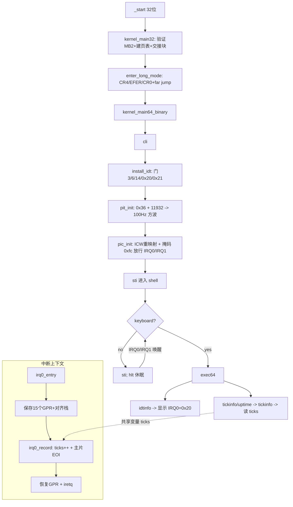

# Lesson 13: 8254 PIT 周期定时器（IRQ0 tick）与 IRQ1 键盘 — 精讲文档

> **课程主线位置**：操作系统内核第三阶段「外设中断」的第 2 课（异常/中断门体系 → 外设中断驱动）。
> **前置课程**：[Lesson 12: IRQ1 键盘生产/消费模型](../lesson-12-stable/README.md)
> **后续课程**：[Lesson 14: bitmap 物理页管理器](../lesson-14-stable/README.md)
> **一句话目标**：学会用 8254 PIT 通道 0 产生约 100 Hz 的周期中断，把 IRQ0 与 IRQ1 两个外设中断
> 同时接入 IDT，并通过 `tickinfo`/`uptime` 命令实时观察 tick 计数增长。

## 1. 课程定位（Mission）

- **一句话目标**：学完本课你能——在保留第 12 课 IRQ1 键盘驱动的基础上，初始化 8254 PIT 通道 0，
  让它以约 100 Hz 频率触发 IRQ0，写一个只做「计数 + EOI」的中断处理函数，并从 shell 中读出随时间增长的 tick。
- **在课程主线中的位置**：属于「外设中断」阶段。上一课（Lesson 12）建立了「IDT 门 + IRQ1 生产者/消费者
  环形缓冲」模型，本课在其上增加第二个外设中断源 IRQ0，为 Lesson 17/18 的调度器准备「时间心脏」；
  下一课（Lesson 14）则把本课的 `alloc64` 线性扫描分配器升级为 bitmap 物理页管理器。
- **前置知识清单**：
  1. Lesson 12 的 IRQ1 全 GPR 保存/恢复汇编存根、`cli`/`sti` 临界区、环形缓冲（本课全部沿用）。
  2. IDT 门结构（`idt_gate`）、`lidt` 指令、中断门/陷阱门类型字节（0x8e）的含义。
  3. `kernel64.ld` 的 `.data : { ... BYTE(0) }` 技巧——为什么零初始化全局变量必须落入文件映像。
  4. 8259A 主/从片端口（`0x20/0x21`、`0xa0/0xa1`）与 8086 模式 ICW 序列（Lesson 12 已初始化过）。
- **本课交付（可见结果）**：shell 新增 `tickinfo` 与 `uptime` 两个命令；`idtinfo` 显示 `IRQ0 vector: 0000000000000020`；
  隔一秒再跑 `tickinfo`，tick 值增加约 100；键盘与 #BP 路径保持可用。

## 2. 核心概念精讲

### 2.1 8254 PIT：周期定时中断的硬件基础

**定义**：8254（兼容 8253）是 PC 上的可编程间隔定时器，内部有三个独立的 16 位递减计数器
（通道 0/1/2），由系统总线提供 **1,193,182 Hz** 的基准时钟（通常记作 1.1931816 MHz）。

**为什么需要**：上一课我们只有「事件驱动的键盘」；但操作系统还需要「时间」——无论键盘有没有输入，
调度器都需要周期性的心跳来切走不干活的任务、实现 sleep、统计 uptime。PIT 通道 0 直接接在主 8259A
的 IRQ0 输入上，是最简单可靠的周期中断源。

**工作机制**：每个通道配一个数据端口（写初始计数值），所有通道共享一个命令端口 `0x43`。
写入命令字节 `0x36` 的含义：

| 位 | 值 | 含义 |
|----|----|------|
| 7-6 | 00 | 选择通道 0 |
| 5-4 | 11 | 先写低字节、再写高字节（16 位装载） |
| 3-1 | 011 | **模式 3（方波发生器）**：计数每两个时钟沿减 1，输出周期性方波，计到 0 自动重装 |
| 0 | 0 | 二进制计数（非 BCD） |

然后向通道 0 数据端口 `0x40` 先写除数低字节、再写高字节。除数 `11932`（0x2E9C）使
`1193182 / 11932 ≈ 99.998 ≈ 100` Hz，即每个 tick 约 10 ms。

```text
1193182 Hz  ──►  [PIT 通道0 mode3, divisor=11932]  ──►  约 100 Hz 方波 ──►  8259A 主片 IRQ0
```

**为什么选 100 Hz**：10 ms 粒度对教学足够细、又不会像毫秒级中断那样刷屏；除数 11932 落在 16 位
范围内（mode 3 要求计数值 ≥ 2）；100 Hz 也使「tick 数 == 厘秒数」，`uptime` 换算直观。

### 2.2 8259A PIC：中断向量重映射与屏蔽

**定义**：8259A 是 8 输入优先级中断控制器，PC 上以「主片 + 从片」级联成 15 条 IRQ。
主片端口 `0x20/0x21`，从片端口 `0xa0/0xa1`；IRQ0（PIT）和 IRQ1（键盘）都在主片上。

**为什么需要**：实模式下 8259A 默认把 IRQ0~IRQ7 映射到向量 8~15，正好与 CPU 异常向量重叠；
必须用 ICW2 重映射。本课沿用第 12 课的 ICW 序列：ICW1=`0x11`（初始化，边沿触发，级联），
ICW2=主片 `0x20` / 从片 `0x28`（新基址），ICW3=主片 `4` / 从片 `2`（级联走线），ICW4=`1`（8086 模式）。
**关键增量**：掩码从上一课的 `0xfd` 改为 `0xfc`——`0xfc = 0b11111100`，只把位 0（IRQ0）和位 1（IRQ1）
清 0（未屏蔽），其余全部屏蔽。掩码寄存器写 1 表示屏蔽，写 0 表示放行。

### 2.3 中断门与 IRQ0 处理全过程

**定义**：中断门（type 字节 `0x8e`）描述符从 IDT 装载到 CS:RIP 时，CPU 会自动清 IF（RFLAGS 中的中断
允许位），保证中断处理过程中不会再次被同一或更低优先级中断打断；`iretq` 时自动恢复 IF。

**机制**：一次 PIT tick 的完整路径——

```text
PIT 通道0 计到 0 ─► 输出方波 ─► 8259A 主片 IRQ0 (未屏蔽) ─► CPU INTR ─►
IF=1? ─► 硬件压栈 SS,RSP,RFLAGS,CS,RIP ─► 从 IDT[0x20] 取门 ─►
清 IF ─► 跳转 irq0_entry ─► 保存全部 GPR ─► call irq0_record ─►
ticks++ / EOI ─► 恢复全部 GPR ─► iretq（恢复 IF，返回被中断现场）
```

IRQ0 与 IRQ1 各有独立的存根：**先 `push` 保存 RAX~R15 全部通用寄存器，`cld` 清方向标志，
`and $-16` 对齐栈后调 C 函数，返回后逆序 `pop` 全部寄存器，最后 `iretq`**。
注意存根用 `%rbp` 保存「原始未对齐的 RSP」，因为 C 函数要求调用时栈 16 字节对齐，
但中断入口时栈里已压入 CPU 自动压的 5 个字段（SS/RSP/RFLAGS/CS/RIP），栈未必对齐。

### 2.4 volatile 全局状态与原始二进制内核

**定义**：`kernel64.c` 用 `-fpie` 编译、链接到地址 0，再用 `objcopy -O binary` 转成裸二进制，
由 `boot.S` 的 `.incbin` 嵌入。`objcopy` 只导出**有文件内容**的段：`.bss` 是 NOBITS（不占文件空间），
默认会被丢弃，导致 `ticks`、`kbd_queue` 等零初始化全局在成品内核里不存在。

**为什么需要**：本课新增 `static volatile u64 ticks;`——它被 IRQ0 处理函数写入、被 shell 命令读取，
一旦被 objcopy 丢弃，整个 tick 计数就是未定义行为。`kernel64.ld` 用
`.data : { *(.data .data.*) *(.bss .bss.* COMMON) BYTE(0) }` 把 `.bss`/`COMMON` 并入 `.data`，
末尾的 `BYTE(0)` 保证段里有真实字节，objcopy 因此把它物化成 PROGBITS 保留在裸二进制中。

### 2.5 cli/sti 临界区：并发读共享变量

**定义**：`ticks` 由中断上下文（IRQ0 处理函数）写入、由进程上下文（shell 命令 `tickinfo`）读取。
读取一个 64 位变量可能在两次 32 位半读取之间被打断，产生「撕裂值」（tearing）。

**工作机制**：`tickinfo` 在读取前 `cli`、读取后 `sti`（加 `"memory"` 约束禁止编译器把读操作挪出
临界区）。IRQ0 处理函数本来就运行在 IF=0 的中断门上下文，写 `ticks` 天然原子；所以只有读侧需要临界区。
这与 `kbd_dequeue` 对环形缓冲头尾指针的保护是同一套路（第 12 课）。

## 3. 源码精讲

### 3.1 文件清单与职责

| 文件 | 职责 | 本课增量（相对 Lesson 12） |
|------|------|------------------------------|
| `kernel64.c` | 64 位内核续体：IDT/PIC/PIT 初始化、shell、异常与 IRQ 处理 | **大**：新增 PIT 常量、`ticks` 全局、`pit_init`、`runtime_irq0_address`、`tickinfo`、`irq0_record`、`irq0_entry` 存根；`pic_init` 掩码改 `0xfc`；`install_idt`/`idtinfo` 加 IRQ0 |
| `kernel.c` | 32 位引导：Multiboot2 验证、long-mode 页表与交接块 | 未变化（diff 为空） |
| `boot.S` | i386 入口、long mode 切换、`.incbin` 嵌入 kernel64.bin | 未变化 |
| `kernel64.ld` | kernel64 续体链接脚本；`.data` 强制物化 `.bss`/`COMMON` | 未变化（机制自 Lesson 12 沿用，本课对 `ticks` 至关重要） |
| `linker.ld` | 外层 32 位 ELF 布局 | 未变化 |
| `Makefile` | 构建/校验/运行 | 未变化 |
| `grub.cfg` | GRUB 菜单项 | 微小变化：menuentry 标题改为 "TinyOS lesson 13: PIT IRQ0 timer + IRQ1 keyboard ring buffer" |

### 3.2 kernel64.c 精讲（仅本课增量）

#### 3.2.1 新增常量与全局状态

```c
#define PIT_COMMAND 0x43
#define PIT_CHANNEL0 0x40
#define PIT_RATE_HZ 100
#define PIT_DIVISOR 11932
...
static volatile u64 ticks;
```

- `PIT_COMMAND`/`PIT_CHANNEL0`：PIT 命令端口与通道 0 数据端口（I/O 地址）。
- `PIT_RATE_HZ = 100`：目标频率，只用于注释与文档一致性；实际频率由 `PIT_DIVISOR` 决定。
- `PIT_DIVISOR = 11932`：`1193182 / 11932 ≈ 100`。低字节 `0x9C`、高字节 `0x2E`。
- `static volatile u64 ticks;`：tick 计数。`volatile` 告诉编译器每次访问都真正读写内存，
  因为该变量会被中断处理函数在任意时刻修改；且必须是零初始化的全局，依赖 2.4 节所述的
  `.data`/`BYTE(0)` 机制存活在裸二进制中。它是本课「时间」的唯一真相来源。

#### 3.2.2 `pit_init()`：编程 PIT 通道 0

```c
static TEXT64 void pit_init(void){outb64(PIT_COMMAND,0x36);outb64(PIT_CHANNEL0,(u8)PIT_DIVISOR);outb64(PIT_CHANNEL0,(u8)(PIT_DIVISOR>>8));}
```

- 第 1 步：向命令端口写 `0x36`（通道 0 + 先低后高 + 模式 3 方波 + 二进制），见 2.1 节位分解。
- 第 2 步：向 `0x40` 写除数低字节 `(u8)PIT_DIVISOR`，即 `0x9C`。
- 第 3 步：再向 `0x40` 写高字节 `(u8)(PIT_DIVISOR>>8)`，即 `0x2E`。
- **边界与设计**：写命令字节后**必须先写低字节再写高字节**，顺序由命令字节第 5-4 位（`11`）约定，
  反序则计数值错乱；除数 `11932 < 65536` 恰好 16 位容纳，而模式 3 要求计数值 ≥ 2，均满足。
  此时通道 0 立即开始输出约 100 Hz 方波并向 8259A 主片 IRQ0 发出中断请求——但 CPU 是否响应，
  取决于 IDT[0x20] 是否装好门、PIC 是否放行（本课顺序：先 `install_idt`，再 `pit_init`，再 `pic_init`）。

#### 3.2.3 `pic_masks()` 与 `pic_init()`：放行 IRQ0

```c
static TEXT64 void pic_masks(u8 master,u8 slave){outb64(PIC1_DATA,master);outb64(PIC2_DATA,slave);}
static TEXT64 void pic_init(void){outb64(PIC1_COMMAND,0x11);io_wait64();outb64(PIC2_COMMAND,0x11);io_wait64();outb64(PIC1_DATA,0x20);io_wait64();outb64(PIC2_DATA,0x28);io_wait64();outb64(PIC1_DATA,4);io_wait64();outb64(PIC2_DATA,2);io_wait64();outb64(PIC1_DATA,1);io_wait64();outb64(PIC2_DATA,1);io_wait64();pic_masks(0xfc,0xff);}
```

- ICW1(`0x11`) → ICW2(主 `0x20`/从 `0x28`) → ICW3(主 `4`/从 `2`) → ICW4(`1`)，与第 12 课完全相同；
  每步之间的 `io_wait64()`（写 `0x80` 端口）给慢速 ISA 设备留出稳定时间，这是 8259A 编程的经典边界处理。
- **本课唯一增量在最后一行**：`pic_masks(0xfc,0xff)`。主片掩码 `0xfc` 把除 IRQ0、IRQ1 之外的全部
  主片输入屏蔽；从片 `0xff` 全屏蔽（本课不用从片）。对照第 12 课 `0xfd`（只放行 IRQ1），
  多放行的正是位 0 —— PIT 的 IRQ0。

#### 3.2.4 `install_idt()` 与 `runtime_irq0_address()`：装 IRQ0 门

```c
static TEXT64 u64 runtime_irq0_address(void){u64 v;__asm__ volatile("leaq irq0_entry(%%rip),%0":"=r"(v));return v;}
static TEXT64 void install_idt(struct long_mode_handoff*h){struct idt_gate *idt=(struct idt_gate *)(unsigned long)h->idt_address;struct idtr d;u32 i;for(i=0;i<IDT_ENTRIES;i++){idt[i].offset_low=0;idt[i].selector=0;idt[i].ist=0;idt[i].type=0;idt[i].offset_mid=0;idt[i].offset_high=0;idt[i].reserved=0;}set_gate(&idt[3],runtime_bp_address());set_gate(&idt[6],runtime_ud_address());set_gate(&idt[14],runtime_pf_address());set_gate(&idt[0x20],runtime_irq0_address());set_gate(&idt[0x21],runtime_irq1_address());d.limit=sizeof(struct idt_gate)*IDT_ENTRIES-1;d.base=(u64)(unsigned long)idt;__asm__ volatile("lidt %0"::"m"(d):"memory");}
```

- `runtime_irq0_address()`：用 `leaq irq0_entry(%rip)` 取得汇编存根的**运行时绝对地址**。
  由于 kernel64 是位置无关的 `.incbin` 裸代码，编译期常量地址不成立，必须由代码自己取 RIP 相对地址；
  与第 12 课 `runtime_irq1_address()` 完全同构。
- `install_idt()` 相对上一课的增量：`set_gate(&idt[0x20],runtime_irq0_address());` 把 IRQ0 装在
  向量 `0x20`（32 十进制），正好是主片 ICW2 基址；IRQ1 仍在 `0x21`。`set_gate` 写 `selector=0x08`
  （内核代码段）、`type=0x8e`（中断门，处理期间 IF=0）、64 位偏移分三段填充，`reserved=0`。
- **为什么先清空 256 个门再逐个设置**：`idt_backing_store`（kernel.c 中分配的 4 KiB 页）首次全零，
  但重复运行不安全，显式清零可保证未装的门（type=0）被 CPU 判为「未呈现」，杜绝野门跳转。
- `lidt` 载入 16 位 limit + 64 位 base 的描述符表寄存器；`"memory"` 约束通知编译器内存被修改。

#### 3.2.5 `irq0_record()` 与 `irq0_entry` 汇编存根

C 处理函数：

```c
/* IRQ0 acknowledges each PIT tick; IRQ1 alone reads 0x60 and enqueues make codes. */
TEXT64 void irq0_record(void){ticks++;outb64(PIC1_COMMAND,PIC_EOI);}
```

- `ticks++;`：记录一次 PIT tick。处于中断门上下文（IF=0），修改 64 位 `volatile` 变量不会被打断。
- `outb64(PIC1_COMMAND,PIC_EOI);`：向主片命令口写 EOI（`0x20`）。**缺了这一步，主片会认为 IRQ0
  仍在服务中，后续所有主片中断（含 IRQ1 键盘）都被挂起**——这是本课最重要的错误处理边界。
- 与 `irq1_record` 的职责划分：IRQ0 处理函数**只计数 + EOI**，绝不去读键盘端口 `0x60`；
  `0x60` 的唯一读者仍是 IRQ1 处理函数（第 12 课确立的「单一生产者」原则），避免两个中断抢读端口。

汇编存根（`__asm__` 字符串块中的新增片段）：

```c
".global irq0_entry\nirq0_entry:\n"
"pushq %rax\npushq %rbx\npushq %rcx\npushq %rdx\npushq %rbp\npushq %rsi\npushq %rdi\npushq %r8\npushq %r9\npushq %r10\npushq %r11\npushq %r12\npushq %r13\npushq %r14\npushq %r15\n"
"cld\nmovq %rsp,%rbp\nandq $-16,%rsp\ncall irq0_record\nmovq %rbp,%rsp\n"
"popq %r15\npopq %r14\npopq %r13\npopq %r12\npopq %r11\npopq %r10\npopq %r9\npopq %r8\npopq %rdi\npopq %rsi\npopq %rbp\npopq %rdx\npopq %rcx\npopq %rbx\npopq %rax\niretq\n"
```

- **保存**：按固定顺序 `push` 15 个 GPR（RAX、RBX、RCX、RDX、RBP、RSI、RDI、R8~R15）。RSP 由硬件
  中断帧（SS/RSP/RFLAGS/CS/RIP 已由 CPU 压栈）和 `iretq` 配合恢复，无需也不能入栈。
- **对齐**：`movq %rsp,%rbp` 先把「可能未对齐」的栈指针存到 RBP；`andq $-16,%rsp` 强制 16 字节对齐，
  满足 SysV x86_64 ABI 对 `call` 的栈对齐要求；`call irq0_record` 返回后 `movq %rbp,%rsp` 复原，
  丢弃 C 函数可能压栈的临时帧。之后**逆序** `pop` 全部寄存器。
- **收尾**：`iretq` 弹回 RIP/CS/RFLAGS/RSP/SS 并恢复 IF，回到被 tick 打断的那条指令继续执行。
- 为什么 RBP 出现在保存列表里还要用它存 RSP：RBP 是调用者保存寄存器（callee-saved），C 函数
  `irq0_record` 不能依赖它；但存根自己要用它暂存原始 RSP，所以它既要 `push`（对外部可见语义完整）
  又要在恢复阶段 `pop` 回来，一举两得。

#### 3.2.6 `tickinfo()` 与 shell 命令接线

```c
static TEXT64 void tickinfo(u16*c){u64 t;__asm__ volatile("cli":::"memory");t=ticks;__asm__ volatile("sti":::"memory");text64(c,"PIT channel 0: 0000000000000064 Hz\nticks: ");hex64(c,t);text64(c,"\nuptime (centiseconds): ");hex64(c,t);putc64(c,'\n');}
```

- **临界区**：`cli` → 读取 `ticks` 到局部变量 `t` → `sti`，防止 64 位读被 IRQ0 在中间打断产生撕裂值
  （见 2.5 节）。局部 `t` 把共享量「定格」后再做一系列 VGA 输出，避免输出过程中值变化。
- **输出格式**：第一行 `"PIT channel 0: 0000000000000064 Hz"` 中 `0x64` 就是十进制 100，直接来自
  `PIT_RATE_HZ` 的文档值（此处为字面串，非 `%d` 格式化）；随后打印 `ticks`，第三行再次打印同一值
  作为 `uptime (centiseconds)`——因为 100 Hz 下 1 tick = 10 ms = 1 厘秒，两个量数值相等。
- 接线：`exec64` 中新增 `else if(eq64(s,"tickinfo")||eq64(s,"uptime"))tickinfo(c);`——`uptime` 是
  `tickinfo` 的别名；`help` 命令列表追加 `tickinfo uptime`；`idtinfo` 追加
  `"IRQ0 vector: 0000000000000020\n"` 并修改首行为 `"IDT: exceptions + PIT IRQ0 + IRQ1\n"`。
- `kernel_main64_binary` 的初始化顺序（相对第 12 课增加 `pit_init()` 调用）：

```c
__asm__ volatile("cli":::"memory");install_idt(h);pit_init();pic_init();clear64(&c);text64(&c,"TinyOS lesson 13: PIT IRQ0 + IRQ1 keyboard ring buffer\n64-bit C continuation active; 100 Hz timer and keyboard input enabled\n");prompt64(&c);__asm__ volatile("sti":::"memory");
```

  顺序的意义：先 `cli`（继承第 12 课「开中断前设备必须就绪」的纪律），再装 IDT、编程 PIT、
  最后放行 PIC 掩码，然后才 `sti`——保证第一条 IRQ0 到来时 IDT 与 PIC 都已就绪。
  主循环本身不变：仍由 `kbd_dequeue` 消费环形缓冲，空时 `sti; hlt`；本课新增的效果是 **IRQ0 每 10 ms
  也会唤醒一次 `hlt`**，shell 的空闲等待因此从「键盘唤醒」变成「键盘或定时器唤醒」。

### 3.3 构建管线（Makefile / kernel64.ld）

- `make` 目标链与第 12 课一致：`kernel64.c` 以 `-m64 -ffreestanding -fpie -mno-red-zone` 编译 →
  `ld -T kernel64.ld` 生成 `kernel64.elf` → `objcopy -O binary` 成 `kernel64.bin` →
  `boot.S` 以 `-m32` 编译并 `.incbin` 嵌入 → 外层 `ld -m elf_i386 -T linker.ld` 生成 `kernel.elf` →
  `grub-mkrescue` 打包 ISO。
- `check` 目标用 `grub-file --is-x86-multiboot2 build/kernel.elf` 校验外层头，通过打印
  `Multiboot2 header check passed.`
- `kernel64.ld` 无需改动：`.data` 段把 `.bss .bss.* COMMON` 收编并 `BYTE(0)` 收尾，本课新增的
  `ticks`（零初始化）因此落入文件映像。可用 `readelf -SW build/kernel64.elf` 验证 `.data` 是
  `PROGBITS`（否则是 `NOBITS`，`objcopy` 会丢弃）。
- 本课没有新增任何编译标志或构建步骤——增量全部在 C 语义层。

### 3.4 主控制流



## 4. 数据流与运行逻辑

1. **启动**：GRUB 加载 `kernel.elf` → `_start` → 32 位 `kernel_main32` 验证 Multiboot2 并构建
   identity-mapped 页表 → 交接块 `long_mode_handoff`（含 `idt_address`）→ `enter_long_mode` 进入 64 位。
2. **初始化**：`kernel_main64_binary` 在 `cli` 下依次 `install_idt`（IRQ0 门装在 `0x20`）、
   `pit_init`（100 Hz 方波）、`pic_init`（掩码 `0xfc` 放行 IRQ0/IRQ1），打印两行横幅与 `tinyos>` 提示符，
   然后 `sti`。
3. **事件**：PIT 每约 10 ms 触发一次 IRQ0。CPU 经 IDT[0x20] 中断门进入 `irq0_entry`，
   保存 15 个 GPR 后调用 `irq0_record`：`ticks++`，向 `0x20` 写 EOI，恢复 GPR 后 `iretq` 回到被中断现场。
4. **命令**：用户输入 `tickinfo`（或 `uptime`）→ `exec64` 匹配 `eq64(s,"tickinfo")||eq64(s,"uptime")` →
   `tickinfo(c)` → 临界区读 `ticks` → 屏幕依次显示 `PIT channel 0: 0000000000000064 Hz`、`ticks: <t>`、
   `uptime (centiseconds): <t>`。
5. **键盘**：IRQ1 仍由唯一的 `irq1_record` 读取 `0x60` 并解码入环形缓冲；shell 用 `kbd_dequeue`
   在 `cli` 临界区出队——本课两条中断线互不抢端口。

## 5. 构建、运行与验证

依赖：`gcc`、`ld`、`objcopy`、`grub-file`、`grub-mkrescue`、`qemu-system-x86_64`（与课程一致）。

```bash
make clean && make -j"$(nproc)"   # 构建 kernel.iso
make check                        # grub-file 校验 Multiboot2，打印 "Multiboot2 header check passed."
make run                          # 启动 QEMU，成功画面在图形窗口，勿加 -display none
```

静态验证（`build/kernel64.elf`）：

```bash
readelf -rW build/kernel64.elf    # 期望：无重定位记录（.incbin 续体是位置无关的）
readelf -SW build/kernel64.elf    # 期望：.data 是 PROGBITS（.bss/COMMON 已被 BYTE(0) 物化）
objdump -d -Mintel build/kernel64.elf  # 期望：IDT 装 IRQ0/IRQ1 门；PIC 掩码 0xfc；
                                     #       PIT 写 0x43 命令口 + 0x40 数据口两次；
                                     #       irq0_entry/irq1_entry 均以 iretq 结尾
```

QEMU 验证（`make run`，等待 `tinyos>` 提示符，用 QEMU 监视器 `sendkey` 输入命令）：

1. 执行 `tickinfo`，等待至少一秒，再执行 `tickinfo`（或 `uptime`）。第二次的 tick 值应比第一次大约
   `100`（每秒 100 tick）。逐字输出样例（`<t>` 随时间增大）：

   ```text
   PIT channel 0: 0000000000000064 Hz
   ticks: <t>
   uptime (centiseconds): <t>
   ```

2. 执行 `idtinfo`，确认输出包含 `IRQ0 vector: 0000000000000020` 与 `IRQ1 vector: 0000000000000021`。
3. 执行 `help`、`kbdinfo`、普通命令，确认 IRQ1 键盘环形缓冲与命令解析不受定时器影响。
4. 执行 `bptest` 再执行 `help`，确认 #BP 仍能 `iretq` 回到 shell，且定时器/键盘继续工作。

## 6. 调试地图

| 现象 | 原因 | 检查方法 |
|------|------|----------|
| `tickinfo` 恒为 0，键盘正常 | PIT 未编程或 IRQ0 门未装/被屏蔽 | `idtinfo` 看 IRQ0 是否为 `0x20`；`objdump` 确认 `pit_init` 写 `0x43`/`0x40` 且 `pic_masks` 为 `0xfc,0xff` |
| 开中断后死机/黑屏/无响应 | IRQ0 处理函数没发 EOI，主片挂起后续所有中断 | 检查 `irq0_record` 是否含 `outb64(PIC1_COMMAND,PIC_EOI)`；存根必须以 `iretq` 结尾 |
| tick 值偶尔跳变/撕裂 | `tickinfo` 读 `ticks` 时未用 `cli/sti` 临界区 | 确认读 `ticks` 前 `cli`、读后 `sti`（见 `tickinfo`） |
| 键盘失灵但 tick 正常 | 主片掩码错：`0xfd` 只放行 IRQ1，IRQ0 被屏蔽，或误把 IRQ1 门装到 IRQ0 向量 | `pic_init` 必须 `pic_masks(0xfc,0xff)`；`install_idt` 中 `0x20`/`0x21` 各装各的门 |
| 重启后 tick/队列状态归零或行为随机 | `objcopy -O binary` 丢弃 NOBITS 的 `.bss`，`ticks` 不在二进制里 | `readelf -SW build/kernel64.elf` 看 `.data` 是否 PROGBITS；`kernel64.ld` 是否含 `BYTE(0)` |
| tick 速率不是约 100 Hz | 命令字节/装载顺序错，或除数错 | 命令字节应为 `0x36`（通道0+先低后高+模式3）；先写 `0x9C` 再写 `0x2E`；除数 `11932` |
| `uptime` 与 `ticks` 显示相同数字 | 这不是 bug：两者别名到 `tickinfo`，100 Hz 下 1 tick=10ms=1 厘秒 | 属预期行为，见 `exec64` 的 `tickinfo`/`uptime` 合并分支 |
| 键盘响应变「按时钟」或 hlt 频繁唤醒 | IRQ0 每 10 ms 唤醒 `sti; hlt`，属预期副作用 | 正常现象；`kbdinfo` 的 raw/make 计数应与输入匹配 |

## 7. 与 Linux 源码对照

| 对照点 | TinyOS 教学模型 | Linux 实现 | 教学模型简化了什么 |
|--------|----------------|------------|--------------------|
| PIT 初始化 | `pit_init()` 写 `0x36` + 除数 11932（100 Hz） | `drivers/clocksource/i8253.c` 的 `pit_set_mode`/`clockevent_i8253`；`include/linux/timex.h` 定义 `CLOCK_TICK_RATE = 1193182` | Linux 只把 PIT 当 boot 期 clockevent，随后切换到 TSC/HPET/APIC timer；本课不做任何校准 |
| 时间计数 | `ticks++`（100 Hz，== 厘秒） | Linux `jiffies`（`kernel/time/jiffies.c`），HZ 由 `kernel/Kconfig.hz` 配置（100/250/1000） | 本课没有 wrap-around 处理、没有 64 位溢出管理、没有 `jiffies_to_*` 换算函数 |
| 8259A 初始化 | `pic_init()` 手工写 ICW1~ICW4 + 掩码 | `arch/x86/kernel/i8259.c` 的 `init_8259A`（`make_8259A`） | 本课仅单写死配置、无 per-IRQ chip 结构、无 spurious IRQ 处理 |
| 中断存根 | 手写 15 个 `push`/`pop` + `iretq` | `arch/x86/entry/entry_64.S` 的 `DECLARE_IDTENTRY_IRQ`/`idtentry`，有宏生成、IST、错误码处理 | 本课不区分有无错误码、不用 IST（本课存根全部 `ist=0`）、不处理嵌套 |
| EOI | `outb64(PIC1_COMMAND, PIC_EOI)` | `arch/x86/kernel/i8259.c` 的 `mask_and_ack_8259A`/`unmask_8259A`（irq_chip 回调） | 本课无 ACK/EOI 分层、无自动屏蔽重放逻辑 |
| IRQ0 读键盘禁令 | `irq0_record` 只计数，`0x60` 唯一读者是 IRQ1 | 键盘驱动 `drivers/input/serio/i8042.c` 独占端口 | 本课没有端口互斥锁，仅靠「谁都不读」约定 |

权威来源：Intel SDM Vol.3（IDT、中断门、`iretq`）、Intel 8254/8259A 数据手册（命令字节与 ICW 序列）、
Multiboot2 规范（`grub-file` 校验依据）。「8259A 掩码写 1 表示屏蔽」与「PIT mode 3 计数值 ≥ 2」均以此为准。

## 8. 思考题与练习

1. **概念理解**：为什么 `PIT_DIVISOR = 11932` 而不是取整的 11931 或 11933？若把 `PIT_RATE_HZ` 改为
   250，除数约等于多少？是否仍能用 16 位装载（提示：`1193182/250 ≈ 4773`）？
2. **源码定位**：在 `kernel64.c` 中找出「中断门类型 0x8e」被设置的位置，说明为什么中断门（而非陷阱门）
   能保证 `irq0_record` 里 `ticks++` 不被同优先级中断打断。
3. **动手实验**：把 `pic_masks(0xfc,0xff)` 改回第 12 课的 `pic_masks(0xfd,0xff)`，重新 `make run`，
   观察 `tickinfo` 与键盘行为，解释「为什么 IRQ0 被屏蔽时 PIT 仍在计数方波，只是 CPU 收不到」。
4. **动手实验**：删掉 `irq0_record` 中的 `outb64(PIC1_COMMAND,PIC_EOI)`，重新运行，观察键盘与
   tick 的行为，验证 2.2 节「缺 EOI 会挂起整个主片」的说法。
5. **Linux 对照**：Linux 的 `jiffies` 与 TinyOS 的 `ticks` 有何异同？为什么 Linux 现代内核在
   boot 完成后用 HPET/APIC 定时器替代 PIT 作为主时钟源？

## 9. 本课小结与下一课预告

本课让系统第一次拥有了「时间」：我们用 8254 PIT 通道 0 的 mode 3 方波产生约 100 Hz 周期中断，
把 IRQ0 中断门装进 IDT 向量 `0x20`，并通过 8259A 掩码从 `0xfd` 放开到 `0xfc` 同时启用 IRQ0 与 IRQ1。
`irq0_record` 只做「`ticks++` + 主片 EOI」，其余交给同样保存全部 GPR 的 `irq0_entry` 存根，
`iretq` 干净返回。我们还理解了三个易错点：中断门自动清 IF 保证计数原子、EOI 缺失会挂死整个主片、
`objcopy` 会丢弃 `.bss` 所以必须靠 `kernel64.ld` 的 `BYTE(0)` 物化 `ticks`。`tickinfo`/`uptime`
用 `cli/sti` 临界区安全读取共享计数。这颗「时间心脏」正是后续调度器的前提。

下一课（Lesson 14）将升级物理内存管理：把本课 `alloc64` 的「线性扫描 + 历史表」分配器替换成
bitmap 位图物理页管理器，实现 `alloc/free/reserve` 三个操作，为后续动态页映射（Lesson 15）与
内核堆打地基。
