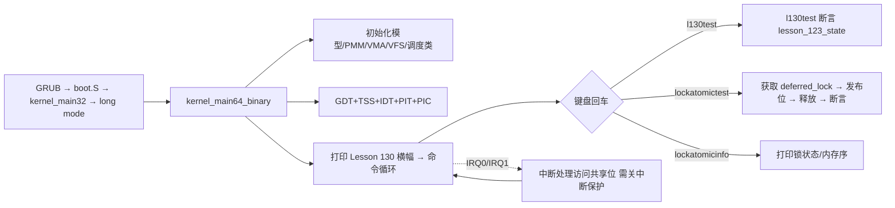

# Lesson 130: 锁依赖图 — 精讲文档

> **课号**：Lesson 130 ｜ **主题**：锁依赖图（lock dependency graph）
> **课程主线位置**：并发/诊断检查点阶段（Lesson 106–132），本课为 Lesson 106 原型的第 24 个检查点
> **前置课程**：[`../lesson-129-stable/README.md`](../lesson-129-stable/README.md)（事件过滤与采样）
> **后续课程**：[`../lesson-131-stable/README.md`](../lesson-131-stable/README.md)（死锁检测元数据）
> **一句话目标**：精讲「锁依赖图」——把每次「先持锁 A 再申请锁 B」的嵌套获取记录成一条有向边 A→B，图的环就是死锁隐患——并对照 Linux lockdep 的图构建/环检测算法，检查教学内核的锁原语与 `lockatomictest` 如何保证锁序纪律，用 `l130test` 检查点做确定性验证。

> **Course status: stable snapshot.** 本课为稳定快照：教学内核用固定容量、无宿主调用（freestanding）的方式，对 bounded concurrency、SMP、RCU、diagnostics 元数据进行确定性建模。**旧 README 记载的命令 `l123test` 不存在**，以源码为准勘误为 `l120test`–`l122test` 与 `l130test`，另加继承的进程、GUI、子系统回归命令。会话不变量保持不变。

本课是检查点课：`kernel64.c` 相对上一课（lesson-129）只有两处 diff 块——补全 `l122test()`、新增 `struct lesson_123_model`/`lesson_123_state` 与 `l130test()`，并把 `about`/开机横幅换成「锁依赖图」。锁机制本体由早期课程累积代码承载：`raw_spinlock_t`/`deferred_lock`、`raw_spin_lock_irqsave`/`raw_spin_unlock_irqrestore`、acquire/release 原子操作、`lockatomicinfo`/`lockatomictest`（Lesson 106 起），本课按「依赖图」主题重讲这些原语的锁序含义。

---

## 1. 课程定位（Mission）

**学完本课你能**：画出任意嵌套加锁序列的锁依赖图（节点=锁，边=「先持 A 再申请 B」）；说出「有向图出现环 ⇔ 存在锁序反转 ⇔ 可能死锁」的判定链；解释为什么**全局一致的锁序**（如恒按地址升序加锁）能保证无环；在教学内核中沿 `raw_spin_lock_irqsave`→临界区→`raw_spin_unlock_irqrestore` 走一遍「单锁图（一个节点、零条边、无环）」的退化情形；运行 `l130test`/`l122test` 与 `lockatomictest`/`lockatomicinfo` 验证。

**在课程主线中的位置**：Lesson 106 起进入并发/诊断检查点序列，其中锁原语自 Lesson 106 就位；Lesson 128–129 讲可观测性（容器与选择），本课把可观测性应用于**并发正确性**：锁依赖图是死锁静态检测（lockdep）的数据结构，下一课（Lesson 131）在此基础上加死锁检测元数据，Lesson 132 收束为崩溃诊断快照。

**前置知识清单**（学本课前必须掌握）：
1. 锁原语：`raw_spin_lock_irqsave`/`raw_spin_unlock_irqrestore`、`irq_save64`/`irq_restore64`（Lesson 106 起）。
2. 原子操作与内存序：`__atomic_exchange_n`（ACQUIRE）、`__atomic_store_n`（RELEASE）、`__atomic_load_n`（RELAXED）（Lesson 106 起）。
3. 有向图与环的基础知识（离散数学）：顶点、有向边、拓扑序、环检测。
4. 检查点模型约定：`lesson_N_model`/`lNtest()` 的 a/b/c/d 与 valid/active/ready/accounted 字段（Lesson 69 起）。

**本课交付（可见结果）**：
- 开机横幅与 `about` 显示 `Lesson 130: 锁依赖图`；
- 新命令 `l130test` 输出 `l130test: bounded concurrency, SMP, RCU, and diagnostics checkpoint passed`（异常时输出 `Lesson 123 fallback reported`）；
- `lockatomictest`/`lockatomicinfo` 展示单锁原语的锁序纪律与 acquire/release 配对。

---

## 2. 核心概念精讲

### 2.1 锁依赖图：把加锁顺序画成有向图

**直觉**：死锁的发生不需要「很多把锁」，只需要**顺序相反**。A 线程持有锁 1 想拿锁 2，同时 B 线程持有锁 2 想拿锁 1，两边互相等对方释放——这就是经典的 ABBA 死锁。要系统化地检查这种风险，内核记录每一次嵌套获取：**先持 X 再申请 Y，就记一条边 X→Y**。把所有边累积起来就是一个有向图。

**定义**：
- **顶点（node）**：一把锁（Linux 中是 `struct lock_class`）；
- **有向边（edge）**：`A → B` 表示「存在某执行路径在持有 A 期间申请 B」；
- **环（cycle）**：一条从某顶点出发又能回到该顶点的路径。

**判定定理**：锁依赖图**无环 ⇔ 任意路径上锁序一致 ⇔ 不会因锁序反转而相互等待**。反之，一旦出现环 A→B→C→A，就存在一组线程可以分别卡在环的各条边上，形成循环等待——死锁的必要条件。

```
合法（无环，拓扑序存在）:          死锁隐患（有环）:
  1 ──► 2 ──► 3                       1 ──► 2
                                          ▲    │
                                          │    ▼
                                          4 ◄── 3
```

**为什么环是隐患而非必然死锁**：环只说明「锁序可以反转」；真的死锁还需要各线程同时占据环上「自己的」那把锁。lockdep 的策略是**宁可误报也不放过**——检测到新依赖形成环就立即报警（`possible circular locking dependency detected`），把潜在死锁消灭在设计期。

### 2.2 Linux lockdep：运行时构建依赖图

`kernel/locking/lockdep.c` 的实现要点：
1. **锁类**：同一把锁的地址对应的 `struct lock_class`（图顶点）；同地址多次加锁合并为同一顶点；
2. **依赖边**：`struct lock_list` 挂在 `lock_class->locks_before/locks_after` 链表上，每条边 `A→B` 记录一次「A 后取 B」的事实，带 `file/line` 溯源；
3. **建图时机**：`lock_acquire`（每次拿锁）时调用 `add_lock_to_list` 建边，`check_noncircular` 沿出边做 DFS/BFS，若回到起点即检测到环，打印 `BUG()` 级别的依赖链；
4. **验证点**：`lockdep_assert_held`、`lockdep_is_held` 用于在代码里声明「此处必须持有某锁」。

### 2.3 教学模型的单锁图（退化情形）

教学内核只有一把自旋锁 `deferred_lock`（外加 `irq_save64` 的关中断保护）。它的锁依赖图是：
- 顶点集：`{deferred_lock}`；
- 边集：∅（任何路径上都不存在「持有 A 再申请 B」的嵌套，因为只有一把锁）；
- 环：无。

「单锁 + 关中断」是锁依赖图的平凡解——图无环性自动成立。教学内核用 `lockatomictest` 显式验证这把锁的**获取/释放配对**与**发布内存序**，把「图无环」这个静态结论落实为「锁序纪律 + acquire/release 配对」两个可运行断言。这与 Linux 中「lockdep 检测到环后要求重排锁序」的目标一致：不变量是「先校验后使用」。

### 2.4 检查点模型：l122test / l130test

本课把上一课的 `l129test` 拆成两步推进：`l122test()` 补全 `lesson_122_model` 的测试（四元组 122,123,124,125），`l130test()` 使用新增的 `lesson_123_model`（四元组 123,124,125,126）。断言仍为「四布尔位 + `b==a+1`」；主题轮换反映在横幅与命令名上。

---

## 3. 源码精讲

### 3.1 文件清单与职责

| 文件 | 职责 | 本课增量（相对 lesson-129） |
|---|---|---|
| `boot.S` | Multiboot2 头、32 位入口、进入 long mode、`.text64` 内嵌 `kernel64.bin` | 未变化 |
| `kernel.c` | 32 位侧：解析 MBI/内存图/帧缓冲，建立页表与用户镜像，`long_mode_handoff` 交接 | 未变化 |
| `kernel64.c` | 64 位主内核：命令循环、调度器、锁原语、全部检查点测试 | 见 3.2 增量列表 |
| `kernel64.ld` | 64 位裸二进制布局，三组 guard+payload 栈区及 ASSERT | 未变化 |
| `linker.ld` | 外层 ELF 布局 | 未变化 |
| `Makefile` | 构建 kernel.iso、`check` 校验、`run` | `check` 中 grep 串换为 `Lesson 130`/`l130test`/`锁依赖图` |
| `grub.cfg` | GRUB 菜单项 | 未变化 |

### 3.2 kernel64.c 精讲（本课增量 + 锁机制）

#### 本课增量一：检查点模型与测试

```c
static TEXT64 void l122test(u16*c){lesson_122_state=(struct lesson_122_model){122U,123U,124U,125U,1,1,1,1};int ok=lesson_122_state.valid&&lesson_122_state.active&&lesson_122_state.ready&&lesson_122_state.accounted&&lesson_122_state.b==lesson_122_state.a+1U;text64(c,"l122test: ");text64(c,ok?"bounded concurrency, SMP, RCU, and diagnostics checkpoint passed":"Lesson 122 fallback reported");putc64(c,'\n');}
```
- 上一课 `l129test` 使用 `lesson_122_state`；本课把它降格为独立命令 `l122test`，四元组 `{122U,123U,124U,125U}` 与四个布尔位整体赋值。
- 算法步骤：(1) 整体赋值模型；(2) 求 `ok=valid&&active&&ready&&accounted&&(b==a+1)`；(3) 打印 `"l122test: "` 前缀与成功/fallback 串。失败输出 `"Lesson 122 fallback reported"`，无副作用、可重复。

```c
struct lesson_123_model { u32 a,b,c,d; u8 valid,active,ready,accounted; };
static struct lesson_123_model lesson_123_state;
static TEXT64 void l130test(u16*c){lesson_123_state=(struct lesson_123_model){123U,124U,125U,126U,1,1,1,1};int ok=lesson_123_state.valid&&lesson_123_state.active&&lesson_123_state.ready&&lesson_123_state.accounted&&lesson_123_state.b==lesson_123_state.a+1U;text64(c,"l130test: ");text64(c,ok?"bounded concurrency, SMP, RCU, and diagnostics checkpoint passed":"Lesson 123 fallback reported");putc64(c,'\n');}
```
- 本课新增 `lesson_123_model` 结构与状态对象，`l130test()` 为其测试。四元组 `{123,124,125,126}`，成功串 `"bounded concurrency, SMP, RCU, and diagnostics checkpoint passed"`，fallback 串 `"Lesson 123 fallback reported"`。
- 设计动机：检查点按「一课一模型」推进，结构形态不变、仅课号四元组与 fallback 串递增——这是 106–132 序列公共的最小 diff 约定；「锁依赖图」主题本身不在模型字段中，而是由横幅与本课概念讲解承载。

#### 本课增量二：exec64 命令表与横幅

```c
else text64(c,"Lesson 130: 锁依赖图\n");
```
- `about` 与开机横幅 `"Lesson 130: 锁依赖图\nGETTICKS, GETPID, WRITE_CONSOLE, EXIT; unknown=-ENOSYS; bounded reclaim metadata\n"` 更新；命令表把上一课的 `l129test` 分支换成 `l122test` 与 `l130test` 两个分支，`help` 长串对应位置为 `...l121test l122test l130test resourceinfo...`。横幅串是 Makefile `check` 中 `grep -q '锁依赖图' README.md` 与 `grep -q 'Lesson 130' README.md` 的源码侧锚点。

#### 主题机制一：锁原语与依赖图的顶点

```c
typedef struct { volatile u32 locked; } raw_spinlock_t;
static raw_spinlock_t deferred_lock;
```
- `raw_spinlock_t` 是一个 32 位自旋标志，`locked` 为 1 表示被持有。`deferred_lock` 是本内核唯一实例化的锁——对应依赖图里唯一的顶点。
- 为什么命名 `deferred`：它保护的是「延迟发布」的共享位（如 `this_cpu()->softirq_pending`），与 Lesson 127 的 RCU 延迟回收语义呼应。

```c
static TEXT64 void raw_spin_lock_irqsave(raw_spinlock_t*l,irqflags_t*f){*f=irq_save64();while(atomic_exchange_acquire_u32(&l->locked,1)){} }
static TEXT64 void raw_spin_unlock_irqrestore(raw_spinlock_t*l,irqflags_t f){atomic_store_release_u32(&l->locked,0);irq_restore64(f);}
```
- 获取：先 `irq_save64` 保存 RFLAGS 并关中断，再用 `xchg`（`__atomic_exchange_n`, ACQUIRE 语义）把 `locked` 交换为 1；返回旧值非 0 则自旋。ACQUIRE 保证**抢锁后**的读不被重排到抢锁之前——临界区数据在「锁持有后」可见。
- 释放：`__atomic_store_n(...,0)`（RELEASE 语义）先发布临界区写入，再 `irq_restore64` 按保存的 IF 位恢复中断。RELEASE 保证**释放前**的写不被重排到释放之后——与 ACQUIRE 配对形成 happens-before。
- 锁序纪律：本内核所有临界区都是「单锁 + 关中断」，不存在嵌套获取，因此依赖图无环。对照 Linux：`raw_spin_lock_irqsave` 等价于 `local_irq_save` + `raw_spin_lock`，而 lockdep 会在此基础上记录依赖边。

#### 主题机制二：锁序纪律的验证点（lockatomictest）

```c
static TEXT64 void lockatomictest(u16*c){irqflags_t f;u8 v=0;atomic_fetch_or_relaxed_u8(&this_cpu()->softirq_pending,0);raw_spin_lock_irqsave(&deferred_lock,&f);v=atomic_load_relaxed_u8(&this_cpu()->softirq_pending);atomic_store_release_u8(&this_cpu()->softirq_pending,(u8)(v|1));raw_spin_unlock_irqrestore(&deferred_lock,f);text64(c,"lockatomictest: ");text64(c,atomic_load_relaxed_u8(&this_cpu()->softirq_pending)==1&&deferred_lock.locked==0?"irq-safe lock, atomic publication, per-CPU ordering passed":"BROKEN");putc64(c,'\n');}
```
- 步骤 1：无锁的 `atomic_fetch_or_relaxed_u8(...,0)` 空操作（relaxed，无同步需求）。
- 步骤 2：`raw_spin_lock_irqsave` 获取锁并关中断——进入依赖图「当前顶点 = deferred_lock」的临界区。
- 步骤 3：读改写 `softirq_pending` 位，用 `atomic_store_release_u8` 发布——RELEASE 保证位写入对后续抢到锁者可见。
- 步骤 4：`raw_spin_unlock_irqrestore` 释放锁并恢复中断。
- 断言：`softirq_pending==1`（发布生效）且 `deferred_lock.locked==0`（锁已归还，配对应答）。成功输出 `lockatomictest: irq-safe lock, atomic publication, per-CPU ordering passed`。
- 与依赖图的关系：这个测试验证的是「获取/释放配对」与「内存序发布」两条不变量；单锁图无环，因此无需检测环——教学内核把 lockdep 的「建图+检环」化简为「锁序纪律可验证」。

#### 主题机制三：per-CPU 与原子操作（锁的访问面）

```c
#define NR_CPUS 1U
struct cpu_local { u8 id,softirq_pending,work_head,work_tail,work_used; };
static struct cpu_local cpu_locals[NR_CPUS];
static TEXT64 struct cpu_local *this_cpu(void){return &cpu_locals[0];}
```
- `cpu_locals` 模拟每 CPU 私有数据，`this_cpu()` 固定返回第 0 项（单 CPU 教学模型）。`softirq_pending` 是锁保护的共享位。
- 对照 Linux `kernel/locking/lockdep.c`：真实 lockdep 需要按 CPU 维护锁状态栈（`struct lockdep_map` 的 `held_locks`）；教学模型把「当前持有锁集合」收敛为一个布尔位。

```c
static TEXT64 void lockatomicinfo(u16*c){text64(c,"locks/atomics/percpu: NR_CPUS ");hex64(c,NR_CPUS);text64(c," lock ");hex64(c,deferred_lock.locked);text64(c," cpu id/pending/work: ");hex64(c,this_cpu()->id);text64(c,"/");hex64(c,this_cpu()->softirq_pending);text64(c,"/");hex64(c,this_cpu()->work_used);text64(c," memory order: acquire/release/relaxed\n");}
```
- 打印锁状态与 per-CPU 位，固定说明内存序策略 `acquire/release/relaxed`——这是锁依赖图「边」上的内存序标注（每条依赖边要求 acquire 获取、release 释放）。

#### 继承的关键基础设施（本课引用，机制来自早期课）

```c
static TEXT64 u64 irq_save64(void){u64 flags;__asm__ volatile("pushfq; popq %0; cli":"=r"(flags)::"memory");return flags;}
static TEXT64 void irq_restore64(u64 flags){if(flags&(1ULL<<9))__asm__ volatile("sti":::"memory");}
```
- 锁依赖图的**排序保护**来自关中断：`irq_save64` 用 `pushfq/popq` 保存 RFLAGS 再 `cli`；`irq_restore64` 依 IF 位恢复。中断是隐式的「另一把锁」，若不关中断，IRQ0 处理程序可能打断临界区并反序申请——教学内核用「锁前必关中断」保证隐式锁序也一致。
- `softirq_run_budget`/`irq0_schedule` 运行于中断上下文，其访问 `work_used`/`softirq_pending` 也依赖同一关中断纪律。

### 3.3 构建管线（Makefile / linker）

- 构建链与 lesson-127/128/129 相同：`kernel64.c`（`-m64 -mno-red-zone -fpie ...`）→ `kernel64.ld` → `objcopy -O binary` → `boot.S` `.incbin` 内嵌 → 外层 `linker.ld` → `grub-mkrescue`。
- `check` 目标：`grub-file --is-x86-multiboot2 build/kernel.elf` + `grep -q '锁依赖图' README.md` + `grep -q 'l130test' kernel64.c` + `grep -q 'Lesson 130' README.md`，全过后打印 `Multiboot2 and Lesson 130 checks passed.`。
- 本课构建步骤相对上一课零新增——只有检查串随课号轮换。

### 3.4 主控制流


- 锁的获取/释放只在命令上下文（`lockatomictest`）与中断上下文（`softirq_run_budget`）出现；两处都由 `irq_save64`/`raw_spin_lock_irqsave` 保证串行，依赖图恒无环。

---

## 4. 数据流与运行逻辑

1. 开机：`kernel_main64_binary` 初始化后打印 `Lesson 130: 锁依赖图` 横幅并进入 `tinyos> ` 循环。
2. 输入 `l130test`：`exec64` 命中 `l130test` 分支 → 整体赋值 `lesson_123_state={123,124,125,126,1,1,1,1}` → 求 `ok` → 输出 `l130test: bounded concurrency, SMP, RCU, and diagnostics checkpoint passed`。
3. 输入 `lockatomictest`：`raw_spin_lock_irqsave(&deferred_lock,&f)` 进入临界区 → 读改写 `softirq_pending` 位 → `raw_spin_unlock_irqrestore` 释放 → 断言 `softirq_pending==1 && deferred_lock.locked==0` → 输出 `lockatomictest: irq-safe lock, atomic publication, per-CPU ordering passed`。
4. 输入 `lockatomicinfo`：打印 `locks/atomics/percpu: NR_CPUS 1 lock 0 cpu id/pending/work: 0/1/0 memory order: acquire/release/relaxed`（数值随运行状态）。
5. 输入 `about`：输出 `Lesson 130: 锁依赖图`。

---

## 5. 构建、运行与验证

**依赖**：`gcc`、`binutils`、`grub-mkrescue`、`grub-file`、`qemu-system-x86_64`（与 lesson-129 相同）。

**构建**（与 Makefile 一致）：
```bash
cd lessons/lesson-130-stable
make clean && make -j"$(nproc)"
make check
```
- `make check` 预期最后一行：`Multiboot2 and Lesson 130 checks passed.`

**运行**：
```bash
make run
```
成功画面在 QEMU 图形窗口，**勿加 `-display none`**。

**验证步骤**（输出串从源码逐字抄录）：
1. `about` → `Lesson 130: 锁依赖图`
2. `l130test` → `l130test: bounded concurrency, SMP, RCU, and diagnostics checkpoint passed`
3. `l122test` → `l122test: bounded concurrency, SMP, RCU, and diagnostics checkpoint passed`
4. `lockatomictest` → `lockatomictest: irq-safe lock, atomic publication, per-CPU ordering passed`
5. `lockatomicinfo` → 首行 `locks/atomics/percpu: NR_CPUS 1`，末段 `memory order: acquire/release/relaxed`

**如何判断成功**：`l130test` 输出成功串即检查点通过；`make check` 打印 `Multiboot2 and Lesson 130 checks passed.`。

---

## 6. 调试地图

| 现象 | 原因 | 检查方法 |
|---|---|---|
| `l130test` 输出 `Lesson 123 fallback reported` | `lesson_123_state` 四布尔位或 `b==a+1` 断言失败 | 检查 `l130test` 初始化 `{123U,124U,125U,126U,1,1,1,1}`；`about` 确认是 130 内核 |
| `make check` grep 失败 | README 缺 `Lesson 130`/`l130test`/`锁依赖图` | `grep -n 'Lesson 130\|l130test\|锁依赖图' README.md` |
| 输入 `l123test` 显示 `unknown command` | 该命令在源码中不存在（旧 README 误记） | 以源码为准输入 `l120test`–`l122test`/`l130test`；`help` 列出 `...l121test l122test l130test...` |
| `lockatomictest` 输出 `BROKEN` | `softirq_pending` 位未发布或 `deferred_lock.locked` 未清零 | 检查 `raw_spin_unlock_irqrestore` 是否调用 `atomic_store_release_u32`；确认 `irq_restore64` 的 IF 位恢复逻辑 |
| `lockatomicinfo` 显示 `lock 1`（锁被卡住） | 某临界区未释放锁或中断嵌套 | 检查所有 `raw_spin_lock_irqsave` 是否成对 `unlock_irqrestore`；`lockatomictest` 是否在断言后复位 |
| 锁序被破坏（假设将来引入第二把锁） | 存在 A→B 与 B→A 两条路径形成环 | 对照 lockdep 的 `check_noncircular`，为每个嵌套获取建立边并做环检测；教学内核应保持单锁避免该问题 |
| 中断在临界区内触发 | `raw_spin_lock_irqsave` 未真正关中断 | 用 `irq_save64` 的 `pushfq/popq` 检查 IF 位；确认 IRQ0/IRQ1 处理程序不打断 `deferred_lock` 临界区 |

---

## 7. 与 Linux 源码对照

| 对照点 | TinyOS 教学模型（本课） | Linux 实现 | 教学模型简化了什么 |
|---|---|---|---|
| 依赖图整体 | 单顶点 `deferred_lock`、零条边、无环（平凡解） | `kernel/locking/lockdep.c`：`struct lock_class` 顶点 + `lock_list` 依赖边 | 无动态建边、无环检测算法，把「无环」当作前提而非结论 |
| 边构建时机 | 无（不存在嵌套获取） | `lock_acquire` → `add_lock_to_list` 记录 `locks_before/locks_after` | 教学模型无多锁嵌套场景 |
| 环检测 | 无（单锁图天然无环） | `check_noncircular` 沿出边 DFS 检测回边，命中即 `possible circular locking dependency` | 教学模型未实现 DFS 与依赖链打印 |
| 锁序纪律 | 「锁前必关中断 + 获取/释放配对」由 `lockatomictest` 断言 | lockdep 将中断视为隐式依赖（`LOCK_USED_IN_INTERRUPT`），校验软硬中断上下文锁序 | 用单一布尔断言代替上下文状态机 |
| 内存序标注 | `lockatomicinfo` 声明 acquire/release/relaxed | lockdep 与 RCU 的 `lock_is_held`/`lockdep_depth` 跟踪每把锁的持有栈 | 无 per-lock 持有栈与深度计数 |
| 释放校验 | `deferred_lock.locked==0` 断言 | `kernel/locking/spinlock.c` `__raw_spin_unlock` + `debug_spin_unlock`（DEBUG_SPINLOCK） | 无 unlocked 异常检测与 dump_stack |

权威来源：Intel SDM（`xchg`/`lock` 前缀语义、RFLAGS.IF、`pushfq/popq`、`cli/sti`）、GNU GRUB（`grub-file` Multiboot2 校验）、Linux 内核源码路径如上表（lockdep 文献另见 Documentation/locking/lockdep-design.rst）。

---

## 8. 思考题与练习

1. **概念理解**：画出加锁序列「先 A 后 B」与「先 B 后 A」两条路径的依赖图，说明为什么这是一个环、以及它对应的死锁场景是什么。
2. **源码定位**：在 `kernel64.c` 中找到 `deferred_lock` 的全部获取/释放点，确认它们是否严格成对；说明该图为什么必然无环。
3. **动手实验**：在 `kernel64.c` 中新增第二把锁 `test_lock` 并在 `lockatomictest` 里先取 `deferred_lock` 再取 `test_lock`，记录新增的依赖边；讨论若要制造环还需要哪条反向路径（不要真正提交，只做纸上推演）。
4. **动手实验**：修改 `lockatomictest`，去掉 `raw_spin_unlock_irqrestore`，运行并观察 `lockatomicinfo` 里 `lock` 位——说明未配对释放如何使依赖图状态失配。
5. **Linux 对照**：对照 `kernel/locking/lockdep.c` 的 `check_noncircular` 与本课的「单锁无环」论证，列出真实 lockdep 比教学模型多做的四件事（如锁类合并、依赖链打印、软硬中断上下文、读锁语义）。

---

## 9. 本课小结与下一课预告

**小结**：本课是第 106 号并发/诊断原型的第 24 个检查点，主题「锁依赖图」。新增 `lesson_123_model` 与 `l130test()`，把 `l129test` 拆为 `l122test()`，命令表与横幅更新为 Lesson 130。核心结论：锁依赖图以「持有 A 时申请 B」为边、以环为死锁隐患；Linux lockdep 在运行时建图并用 `check_noncircular` 检环；教学内核用「单锁 + 关中断」的退化图天然避开环，并用 `lockatomictest` 把「获取/释放配对 + acquire/release 内存序」落实为可运行断言。`l130test`、`lockatomictest`、`lockatomicinfo` 构成可复现的验证面。

**下一课预告**：Lesson 131 主题为 **死锁检测元数据**（deadlock detection metadata）——在锁依赖图概念之上，为死锁检测补充「谁持有、谁在等、等待多久」的元数据字段（`lesson_124_model` 与 `l131test`）。衔接点：本课的「环即隐患」判定是下一课元数据记录的语义目标，`l122test`/`l130test` 的检查点推进方式将延续到 `l131test`。
