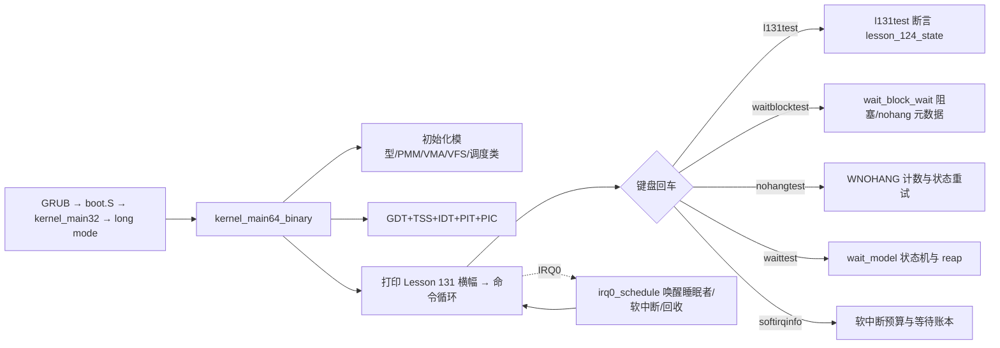

# Lesson 131: 死锁检测元数据 — 精讲文档

> **课号**：Lesson 131 ｜ **主题**：死锁检测元数据（deadlock detection metadata）
> **课程主线位置**：并发/诊断检查点阶段（Lesson 106–132），本课为 Lesson 106 原型的第 25 个检查点
> **前置课程**：[`../lesson-130-stable/README.md`](../lesson-130-stable/README.md)（锁依赖图）
> **后续课程**：[`../lesson-132-stable/README.md`](../lesson-132-stable/README.md)（崩溃诊断快照）
> **一句话目标**：精讲死锁检测依赖的**元数据**——谁持有锁、谁在等待、等待了多久、请求是否可能进展（nohang 语义）——这些数据是锁依赖图（上节课）之外的「运行时状态面」，并检查教学内核中信号量/等待队列/等待阻塞模型如何为检测器记账，用 `l131test` 检查点做确定性验证。

> **Course status: stable snapshot.** 本课为稳定快照：教学内核用固定容量、无宿主调用（freestanding）的方式，对 bounded concurrency、SMP、RCU、diagnostics 元数据进行确定性建模。**旧 README 记载的命令 `l124test` 不存在**，以源码为准勘误为 `l120test`–`l123test` 与 `l131test`，另加继承的进程、GUI、子系统回归命令。会话不变量保持不变。

本课是检查点课：`kernel64.c` 相对上一课（lesson-130）只有两处 diff 块——补全 `l123test()`、新增 `struct lesson_124_model`/`lesson_124_state` 与 `l131test()`，并把 `about`/开机横幅换成「死锁检测元数据」。死锁检测相关元数据由早期课程累积代码承载：信号量记账（`downs/ups/blocks/wakes/overflows`）、等待队列（`waitq` 的 `enqueues/wake_one/wake_all`）、等待阻塞模型（`wait_block_model` 的 `blocks/wakes/nohang_calls/ready_checks`）、线程睡眠态（`THREAD_SLEEPING`/`wake_tick`）、锁状态（`deferred_lock.locked`），本课按「检测元数据」主题统一精讲。

---

## 1. 课程定位（Mission）

**学完本课你能**：说出一套死锁/卡死检测器至少需要哪四类元数据——**持有者**（谁占着资源）、**等待者**（谁在等、等哪个队列）、**时长**（等了多久、是否有 deadline）、**可进展性**（不阻塞能否判断结果，即 WNOHANG）；在教学内核中沿 `sem_down`/`sem_up`、`wait_block_wait`、`thread_sleep_ticks`、`deferred_lock` 指出每类元数据对应的字段；运行 `l131test`/`l123test` 与 `waitblocktest`/`nohangtest`/`waittest`/`softirqtest`/`lockatomictest` 验证。

**在课程主线中的位置**：Lesson 130 讲锁依赖图（**静态**：图上的环即死锁隐患），本课讲死锁检测的**运行时元数据**（动态：当前谁持有、谁在等）。两者合起来就是 Linux lockdep + hung task 检测的完整图景。Lesson 132 收束为崩溃诊断快照——把本课的元数据在异常时「快照」成诊断现场。

**前置知识清单**（学本课前必须掌握）：
1. 锁依赖图与环判定：顶点/边/环（Lesson 130）。
2. 信号量与等待队列：`sem_down`/`sem_up`、`waitq_enqueue`/`waitq_wake_one`、`THREAD_BLOCKED_SEM`（Lesson 58/60 起）。
3. 等待/睡眠状态机：`THREAD_SLEEPING`、`wake_tick`、`wake_sleepers`、`tick_due`（Lesson 48 起）。
4. waitpid 语义：`WAIT_ZOMBIE`/`WAIT_DEAD`、`wait_model_wait`/`wait_model_reap`、WNOHANG（Lesson 50 起）。
5. 检查点模型约定：`lesson_N_model`/`lNtest()` 的 a/b/c/d 与 valid/active/ready/accounted 字段（Lesson 69 起）。

**本课交付（可见结果）**：
- 开机横幅与 `about` 显示 `Lesson 131: 死锁检测元数据`；
- 新命令 `l131test` 输出 `l131test: bounded concurrency, SMP, RCU, and diagnostics checkpoint passed`（异常时输出 `Lesson 124 fallback reported`）；
- `waitblocktest`/`nohangtest`/`waittest` 展示「阻塞-唤醒-重试-回收」的元数据流转，`softirqinfo`/`lockatomicinfo` 展示预算与锁状态。

---

## 2. 核心概念精讲

### 2.1 死锁检测元数据：检测器眼里的「等待现场」

**直觉**：光有锁依赖图只能回答「会不会死锁」（静态）。系统运行时，还需要回答「现在是不是卡住了、卡在哪」——这需要为每个等待动作记录元数据。

**四类元数据**：
1. **持有者（holder）**：资源被谁占用。Linux 中锁的 owner（`spinlock` 的 owner_cpu/task）、信号量计数值；
2. **等待者（waiter）**：谁在等、排在哪个等待队列。Linux waitqueue 的链表头与 `task_struct` 指针；
3. **时长（duration）**：从何时开始等、是否超时。Linux `task_struct` 里 hung task 检测用的 `state` 时间戳、`in_iowait`；
4. **可进展性（progressability）**：不阻塞能否立即判断结果——WNOHANG 语义，避免检测器自己陷进去。

教学内核为每类都配了账本字段，见下表。

| 类别 | 教学字段 | 意义 |
|---|---|---|
| 持有者 | `semaphore.count`/`max`、`deferred_lock.locked` | 资源剩余量/锁占用位 |
| 等待者 | `waitq.count`、`threads[id].state==THREAD_BLOCKED_SEM/BLOCKED_EVENT/BLOCKED_KBD`、`wake_tick` | 队列深度与线程阻塞态 |
| 时长 | `sleep_model.deadline_tick/wake_tick`、`timer_model.deadline_tick`、`wait_block_model.blocks` | 截止时刻与等待次数 |
| 可进展性 | `wait_block_model.nohang_calls/ready_checks`、`wait_model_wait` 的 WNOHANG 分支 | 非阻塞判断 |

### 2.2 死锁检测的两层分工（对照 Linux）

- **lockdep（静态/图）**：`kernel/locking/lockdep.c` 在**获取时**记录依赖边并检环；它的元数据是**每任务的持有锁栈**（`task_struct->held_locks`，记录每把锁的 class、深度、获取点），用于在报警时打印完整的依赖链。
- **hung task / softlockup（动态/等待）**：`kernel/hung_task.c` 周期扫描 `task_struct->state` 与 `task_struct->last_switch_time`；`kernel/watchdog.c` 用 NMI 检查 `softlockup`；它们的元数据是**「谁、何时开始等待/让出 CPU」**。
- 教学内核把两层元数据都精简成固定字段：`deferred_lock.locked`（持有）、`waitq.count`/线程 `state`（等待）、`wake_tick`/`deadline_tick`（时长）、`nohang_calls`/`ready_checks`（可进展性）。

### 2.3 教学模型的可进展性语义（WNOHANG）

Linux `waitpid(pid, status, WNOHANG)` 约定：没有已退出的子进程时**立即返回 0**，不阻塞。教学内核 `wait_block_wait(nohang)` 把这个语义做成元数据计数：
- `nohang=0`（阻塞等待）：子进程未 ZOMBIE 时记 `blocked=1; blocks++` 并返回 0（模拟入队）；
- `nohang=1`（非阻塞）：记 `nohang_calls++` 并直接返回「当前是否 ZOMBIE」。

这两条路径是检测器自身的防御：检测死锁的代码不能自己阻塞，所以检测动作必须带 nohang 语义——这与 `kernel/hung_task.c` 在 softirq 上下文中只读不改地扫描 `task_struct` 是同一个道理。

### 2.4 检查点模型：l123test / l131test

本课把上一课的 `l130test` 拆成两步推进：`l123test()` 补全 `lesson_123_model` 的测试（四元组 123,124,125,126），`l131test()` 使用新增的 `lesson_124_model`（四元组 124,125,126,127）。断言仍为「四布尔位 + `b==a+1`」；主题轮换反映在横幅与命令名上。

---

## 3. 源码精讲

### 3.1 文件清单与职责

| 文件 | 职责 | 本课增量（相对 lesson-130） |
|---|---|---|
| `boot.S` | Multiboot2 头、32 位入口、进入 long mode、`.text64` 内嵌 `kernel64.bin` | 未变化 |
| `kernel.c` | 32 位侧：解析 MBI/内存图/帧缓冲，建立页表与用户镜像，`long_mode_handoff` 交接 | 未变化 |
| `kernel64.c` | 64 位主内核：命令循环、调度器、等待/信号量/锁元数据、全部检查点测试 | 见 3.2 增量列表 |
| `kernel64.ld` | 64 位裸二进制布局，三组 guard+payload 栈区及 ASSERT | 未变化 |
| `linker.ld` | 外层 ELF 布局 | 未变化 |
| `Makefile` | 构建 kernel.iso、`check` 校验、`run` | `check` 中 grep 串换为 `Lesson 131`/`l131test`/`死锁检测元数据` |
| `grub.cfg` | GRUB 菜单项 | 未变化 |

### 3.2 kernel64.c 精讲（本课增量 + 检测元数据）

#### 本课增量一：检查点模型与测试

```c
static TEXT64 void l123test(u16*c){lesson_123_state=(struct lesson_123_model){123U,124U,125U,126U,1,1,1,1};int ok=lesson_123_state.valid&&lesson_123_state.active&&lesson_123_state.ready&&lesson_123_state.accounted&&lesson_123_state.b==lesson_123_state.a+1U;text64(c,"l123test: ");text64(c,ok?"bounded concurrency, SMP, RCU, and diagnostics checkpoint passed":"Lesson 123 fallback reported");putc64(c,'\n');}
```
- 上一课 `l130test` 使用 `lesson_123_state`；本课把它降格为独立命令 `l123test`，四元组 `{123U,124U,125U,126U}` 与四个布尔位整体赋值。
- 算法步骤：(1) 整体赋值模型；(2) 求 `ok=valid&&active&&ready&&accounted&&(b==a+1)`；(3) 打印 `"l123test: "` 前缀与成功/fallback 串。失败输出 `"Lesson 123 fallback reported"`，无副作用、可重复。

```c
struct lesson_124_model { u32 a,b,c,d; u8 valid,active,ready,accounted; };
static struct lesson_124_model lesson_124_state;
static TEXT64 void l131test(u16*c){lesson_124_state=(struct lesson_124_model){124U,125U,126U,127U,1,1,1,1};int ok=lesson_124_state.valid&&lesson_124_state.active&&lesson_124_state.ready&&lesson_124_state.accounted&&lesson_124_state.b==lesson_124_state.a+1U;text64(c,"l131test: ");text64(c,ok?"bounded concurrency, SMP, RCU, and diagnostics checkpoint passed":"Lesson 124 fallback reported");putc64(c,'\n');}
```
- 本课新增 `lesson_124_model` 结构与状态对象，`l131test()` 为其测试。四元组 `{124,125,126,127}`，成功串 `"bounded concurrency, SMP, RCU, and diagnostics checkpoint passed"`，fallback 串 `"Lesson 124 fallback reported"`。
- 设计动机：检查点按「一课一模型」推进，结构形态不变、仅课号四元组与 fallback 串递增——这是 106–132 序列公共的最小 diff 约定；「死锁检测元数据」主题本身不在模型字段中，而是由横幅与本课概念讲解承载。

#### 本课增量二：exec64 命令表与横幅

```c
else text64(c,"Lesson 131: 死锁检测元数据\n");
```
- `about` 与开机横幅 `"Lesson 131: 死锁检测元数据\nGETTICKS, GETPID, WRITE_CONSOLE, EXIT; unknown=-ENOSYS; bounded reclaim metadata\n"` 更新；命令表把上一课的 `l130test` 分支换成 `l123test` 与 `l131test` 两个分支，`help` 长串对应位置为 `...l122test l123test l131test resourceinfo...`。横幅串是 Makefile `check` 中 `grep -q '死锁检测元数据' README.md` 与 `grep -q 'Lesson 131' README.md` 的源码侧锚点。

#### 主题机制一：信号量元数据（持有者 + 等待者记账）

```c
struct semaphore { u8 count,max; volatile struct wait_queue waitq; u64 downs,ups,blocks,wakes,overflows; };
```
- `count`/`max` 是资源持有状态（检测器读它们判断「资源是否可获」）；`waitq` 是等待者队列；六个 `u64` 计数器是**账本元数据**——`downs/ups` 对称调用次数、`blocks` 阻塞次数、`wakes` 唤醒次数、`overflows` 越界次数。
- 死锁检测读这些计数即可判断「是否有线程永久阻塞」：`blocks` 只增而 `wakes` 不增，说明等待队列无人唤醒——卡死的指纹。

```c
static TEXT64 void sem_down(struct semaphore*s){u8 id=current_thread;for(;;){u64 flags=irq_save64();if(s->count){s->count--;s->downs++;irq_restore64(flags);return;}if(id&&threads[id].state==THREAD_RUNNING&&waitq_enqueue(&s->waitq,id)){s->blocks++;threads[id].state=THREAD_BLOCKED_SEM;}irq_restore64(flags);while(threads[id].state==THREAD_BLOCKED_SEM)__asm__ volatile("sti; hlt");}}
```
- 获取：关中断检查 `count`；有则减一并计数返回。没有则把当前线程入 `waitq`、`blocks++`、置 `THREAD_BLOCKED_SEM`，然后 `sti;hlt` 进入可中断休眠，等 `sem_up` 的 `waitq_wake_one` 把它置回 `THREAD_RUNNABLE`。
- 元数据用途：`blocks` 与 `wakes` 的差就是「当前仍在等待的累计次数」；配合 `waitq.count` 可算出实时等待深度。
- 边界：`waitq_enqueue` 失败（队列满 `WAIT_QUEUE_CAP`）时保持 `THREAD_RUNNING` 并重试循环，避免丢失信号量发放。

```c
static TEXT64 void sem_up(struct semaphore*s){u64 flags=irq_save64();u8 id;if(s->count<s->max){s->count++;s->ups++;}else s->overflows++;if(waitq_wake_one(&s->waitq,THREAD_BLOCKED_SEM,&id))s->wakes++;irq_restore64(flags);}
```
- 释放：`count<max` 时 `count++`，否则 `overflows++`（记账「越界释放」——检测器用它发现释放次数不对称）；随后尝试唤醒一个阻塞者并 `wakes++`。
- 对称性：`ups==downs` 与 `count` 最终回到初值是健康信号；`overflows>0` 意味着调用方破坏了信号量不变量。

#### 主题机制二：等待阻塞模型（可进展性元数据）

```c
struct wait_block_model { u64 blocks,wakes,nohang_calls,ready_checks; u8 blocked,woken; };
static TEXT64 int wait_block_wait(u8 nohang){wait_block_model.ready_checks++;if(nohang){wait_block_model.nohang_calls++;return wait_model.state==WAIT_ZOMBIE;}if(wait_model.state!=WAIT_ZOMBIE){wait_block_model.blocked=1;wait_block_model.blocks++;return 0;}wait_block_model.woken=1;return 1;}
```
- `ready_checks++` 每次调用都记；`nohang=1` 时走**非阻塞**路径——只记 `nohang_calls++` 并立即返回「是否 ZOMBIE」，绝不入队。这就是 WNOHANG 的元数据化。
- `nohang=0` 时：非 ZOMBIE 记 `blocked=1; blocks++` 返回 0（模拟入队等待）；ZOMBIE 记 `woken=1` 返回 1（假装刚被唤醒）。
- `waitblocktest` 断言：阻塞等待先失败（`a/b`）→ nohang 只计数不阻塞（`k/d`）→ `wait_block_exit` 模拟退出唤醒（`e/f`）→ 再 wait 成功并 reap（`g`）→ 输出 `waitblocktest: blocked wait, exit wake-one, status retry, and reap passed`。
- 与检测器的关系：`nohang_calls` 是「检测器进行非阻塞探查的次数」——检测代码自己绝不阻塞，这是 `kernel/hung_task.c` 的同一设计原则。

#### 主题机制三：睡眠时长元数据（wake_tick/deadline）

```c
struct sleep_model { u64 requested_ticks,deadline_tick,wake_tick,remaining_ticks,sleeps,wakes; u8 active,interrupted; };
static TEXT64 void thread_sleep_ticks(u64 delta){u64 flags;u8 id=current_thread;if(!delta)delta=1;flags=irq_save64();if(!idle_running&&threads[id].state==THREAD_RUNNING){threads[id].wake_tick=ticks+delta;threads[id].state=THREAD_SLEEPING;}irq_restore64(flags);while(threads[id].state==THREAD_SLEEPING)__asm__ volatile("sti; hlt");}
```
- `wake_tick=ticks+delta` 记录「应醒来时刻」；`wake_sleepers` 每 tick 用 `tick_due(ticks,wake_tick)` 判定是否到点并 `sleep_wakeups++`。
- 检测器读 `sleep_model.deadline_tick/wake_tick` 就能判断一个睡眠线程是否**超时未醒**——`tick_due` 的 `(u64)(now-deadline)<(1ULL<<63)` 无符号环形比较处理 tick 回绕。
- 与 hung task 的 `last_switch_time` 同构：睡眠起点被记成时间戳，超阈值即为可疑卡死。教学模型没有超时强杀，只提供元数据。

#### 主题机制四：锁与软中断状态元数据

```c
static TEXT64 void lockatomicinfo(u16*c){text64(c,"locks/atomics/percpu: NR_CPUS ");hex64(c,NR_CPUS);text64(c," lock ");hex64(c,deferred_lock.locked);text64(c," cpu id/pending/work: ");hex64(c,this_cpu()->id);text64(c,"/");hex64(c,this_cpu()->softirq_pending);text64(c,"/");hex64(c,this_cpu()->work_used);text64(c," memory order: acquire/release/relaxed\n");}
```
- `deferred_lock.locked` 是持有者元数据：锁卡在 1 且无人能释放即为死锁/活锁现场。
- `softirq_pending`/`work_used` 是延迟工作面元数据：`softirq_run_budget` 每 tick 消费，若 `pending` 恒置位而 `budget_exhaustions` 猛增，说明延迟工作堆积——`softirqinfo` 的 `pending/raises/runs/drops/budget` 构成该面的完整账本。

#### 继承的关键基础设施（本课引用，机制来自早期课）

```c
static TEXT64 u64 irq_save64(void){u64 flags;__asm__ volatile("pushfq; popq %0; cli":"=r"(flags)::"memory");return flags;}
static TEXT64 void irq_restore64(u64 flags){if(flags&(1ULL<<9))__asm__ volatile("sti":::"memory");}
static TEXT64 int waitq_wake_one(volatile struct wait_queue*q,u8 state,u8 *out){u8 id;if(!waitq_dequeue(q,&id))return 0;if(!id||id>=THREAD_COUNT||threads[id].state!=state)return 0;threads[id].state=THREAD_RUNNABLE;q->wake_one++;*out=id;return 1;}
```
- 所有元数据的读写都在 `irq_save64/irq_restore64` 保护下成对进行，保证检测器读到的计数与状态一致（单 CPU 下关中断即原子）。
- `waitq_wake_one` 同时更新状态与 `wake_one` 计数——「唤醒」既有动作也有账本，这是本课「元数据」主题的最小单位。

### 3.3 构建管线（Makefile / linker）

- 构建链与 lesson-127–130 相同：`kernel64.c`（`-m64 -mno-red-zone -fpie ...`）→ `kernel64.ld` → `objcopy -O binary` → `boot.S` `.incbin` 内嵌 → 外层 `linker.ld` → `grub-mkrescue`。
- `check` 目标：`grub-file --is-x86-multiboot2 build/kernel.elf` + `grep -q '死锁检测元数据' README.md` + `grep -q 'l131test' kernel64.c` + `grep -q 'Lesson 131' README.md`，全过后打印 `Multiboot2 and Lesson 131 checks passed.`。
- 本课构建步骤相对上一课零新增——只有检查串随课号轮换。

### 3.4 主控制流


- 元数据由三个写入源产生：命令测试（`waitblocktest` 等）、线程（`sem_down`/`thread_sleep_ticks`）、中断（`irq0_schedule`/`softirq_run_budget`）；消费者都是命令循环里的检查点与 info 命令。

---

## 4. 数据流与运行逻辑

1. 开机：`kernel_main64_binary` 初始化后打印 `Lesson 131: 死锁检测元数据` 横幅并进入 `tinyos> ` 循环。
2. 输入 `l131test`：`exec64` 命中 `l131test` 分支 → 整体赋值 `lesson_124_state={124,125,126,127,1,1,1,1}` → 求 `ok` → 输出 `l131test: bounded concurrency, SMP, RCU, and diagnostics checkpoint passed`。
3. 输入 `waitblocktest`：`wait_model_start`+`wait_block_start` → 阻塞等待失败（`blocks=1`）→ nohang 调用计数（`nohang_calls==1`）→ `wait_block_exit` 触发 `wakes==1` → 重试成功 → `wait_model_reap` → 输出 `waitblocktest: blocked wait, exit wake-one, status retry, and reap passed`。
4. 输入 `nohangtest`：空态 nohang 立即返回 0（`a`）、退出后 nohang 返回 1（`d/e`）、reap（`f`）→ 输出 `nohangtest: WNOHANG empty/ready results and one-shot reap passed`。
5. 输入 `about`：输出 `Lesson 131: 死锁检测元数据`。

---

## 5. 构建、运行与验证

**依赖**：`gcc`、`binutils`、`grub-mkrescue`、`grub-file`、`qemu-system-x86_64`（与 lesson-130 相同）。

**构建**（与 Makefile 一致）：
```bash
cd lessons/lesson-131-stable
make clean && make -j"$(nproc)"
make check
```
- `make check` 预期最后一行：`Multiboot2 and Lesson 131 checks passed.`

**运行**：
```bash
make run
```
成功画面在 QEMU 图形窗口，**勿加 `-display none`**。

**验证步骤**（输出串从源码逐字抄录）：
1. `about` → `Lesson 131: 死锁检测元数据`
2. `l131test` → `l131test: bounded concurrency, SMP, RCU, and diagnostics checkpoint passed`
3. `l123test` → `l123test: bounded concurrency, SMP, RCU, and diagnostics checkpoint passed`
4. `waitblocktest` → `waitblocktest: blocked wait, exit wake-one, status retry, and reap passed`
5. `nohangtest` → `nohangtest: WNOHANG empty/ready results and one-shot reap passed`
6. `waittest` → `waittest: bounded wait, exit status, zombie selection, and reap passed`
7. `lockatomictest` → `lockatomictest: irq-safe lock, atomic publication, per-CPU ordering passed`

**如何判断成功**：`l131test` 输出成功串即检查点通过；`make check` 打印 `Multiboot2 and Lesson 131 checks passed.`。

---

## 6. 调试地图

| 现象 | 原因 | 检查方法 |
|---|---|---|
| `l131test` 输出 `Lesson 124 fallback reported` | `lesson_124_state` 四布尔位或 `b==a+1` 断言失败 | 检查 `l131test` 初始化 `{124U,125U,126U,127U,1,1,1,1}`；`about` 确认是 131 内核 |
| `make check` grep 失败 | README 缺 `Lesson 131`/`l131test`/`死锁检测元数据` | `grep -n 'Lesson 131\|l131test\|死锁检测元数据' README.md` |
| 输入 `l124test` 显示 `unknown command` | 该命令在源码中不存在（旧 README 误记） | 以源码为准输入 `l120test`–`l123test`/`l131test`；`help` 列出 `...l122test l123test l131test...` |
| `waitblocktest` 输出 `BROKEN` | `wait_block_model` 的 blocks/wakes/nohang 计数不匹配 | 检查 `wait_block_wait` 的 nohang 分支与 `wait_block_exit` 的 `woken/wakes++` 时机 |
| `nohangtest` 输出 `BROKEN` | WNOHANG 空/就绪两态判断错误 | 检查 `nohang=1` 时是否直接返回 `wait_model.state==WAIT_ZOMBIE` 而不入队 |
| `waittest` 输出 `BROKEN` | `wait_model` 状态机（RUNNING→ZOMBIE→DEAD）被破坏 | 检查 `wait_model_exit/wait_model_wait/wait_model_reap` 的前置状态断言与 `waited` 标志 |
| 信号量 `blocks` 与 `wakes` 长期不等 | 等待队列唤醒丢失或计数不对称 | 运行 `pctest`+`pcgo`+`pcinfo`，检查 `S count/wait` 与 `I count/wait`；确认 `sem_up` 的 `wakes++` 与 `waitq_wake_one` 返回值配对 |
| `threadinfo` 显示线程长期 `sleeping` | `wake_tick` 未到或 `wake_sleepers` 未触发 | 检查 `thread_sleep_ticks` 的 `wake_tick=ticks+delta` 与 `tick_due` 无符号比较；`sleeptest` 应正常结束两个 worker |

---

## 7. 与 Linux 源码对照

| 对照点 | TinyOS 教学模型（本课） | Linux 实现 | 教学模型简化了什么 |
|---|---|---|---|
| 持有者元数据 | `deferred_lock.locked`、`semaphore.count` | `kernel/locking/lockdep.c` 的 `struct held_lock`（每任务持有栈）；`kernel/locking/spinlock_debug.c` | 单锁布尔位，无 per-task 持有栈与深度 |
| 等待者元数据 | `waitq.count` + 线程 `state==THREAD_BLOCKED_*` | `kernel/sched/wait.c`：`struct wait_queue_entry` 链表挂 `task_struct` | 固定容量数组队列，无双链与超时定时器 |
| 时长元数据 | `sleep_model.wake_tick/deadline_tick`、`tick_due` | `kernel/hung_task.c` 用 `task_struct->last_switch_time` 判饥饿 | 无阈值扫描任务，只记录不裁决 |
| WNOHANG 语义 | `wait_block_wait(nohang)` 的 `nohang_calls++` 非阻塞返回 | `kernel/exit.c` `do_wait` 的 `WNOHANG` 分支立即返回 0 | 元数据计数模拟，无真实 task 状态表扫描 |
| 释放不对称记账 | `sem_up` 的 `overflows++` | `kernel/locking/semaphore.c`：down 失败转 `__down` 睡眠；`up` 只唤醒 | 教学模型不区分失败与阻塞内部分支 |
| 唤醒记账 | `waitq_wake_one` 的 `wake_one++`、`sem_up` 的 `wakes++` | `kernel/sched/core.c` `try_to_wake_up`/`wake_up_process` | 无 sched_wakeup 追踪事件，仅计数 |

权威来源：Intel SDM（`sti/hlt` 可中断休眠语义、RFLAGS.IF、PIT IRQ0）、GNU GRUB（`grub-file` Multiboot2 校验）、Linux 内核源码路径如上表。

---

## 8. 思考题与练习

1. **概念理解**：说出死锁检测器的四类元数据，并说明为什么检测代码自身必须带 WNOHANG 语义（提示：检测器阻塞了还怎么检测死锁？）。
2. **源码定位**：在 `kernel64.c` 中找到 `sem_down` 里 `blocks++` 与 `waitq_enqueue` 的调用顺序，说明先入队后置 `THREAD_BLOCKED_SEM` 对 `waitq_wake_one` 检查 `state` 的意义。
3. **动手实验**：把 `sem_up` 的 `s->count<s->max` 条件去掉，运行 `softirqtest`/生产者-消费者，观察 `overflows` 计数变化，说明释放不对称记账如何暴露信号量错误。
4. **动手实验**：把 `WAIT_QUEUE_CAP` 从 `THREAD_COUNT-1` 改为 1，运行 `pctest`+`pcgo`，观察等待队列满时的重试行为是否仍然正确（注意 `sem_down` 的忙等循环）。
5. **Linux 对照**：对照 `kernel/hung_task.c` 的扫描机制与本课 `sleep_model`/`wake_tick` 元数据，列出教学模型在「超时判定、任务表扫描、阈值配置」上的三个简化点。

---

## 9. 本课小结与下一课预告

**小结**：本课是第 106 号并发/诊断原型的第 25 个检查点，主题「死锁检测元数据」。新增 `lesson_124_model` 与 `l131test()`，把 `l130test` 拆为 `l123test()`，命令表与横幅更新为 Lesson 131。核心结论：死锁检测需要「持有者、等待者、时长、可进展性」四类元数据；教学内核用 `semaphore` 计数、`waitq.count`、`wake_tick`/`deadline_tick`、`nohang_calls`/`ready_checks` 为每类记账；`waitblocktest`/`nohangtest` 验证阻塞与 WNOHANG 两条路径，`sem_up` 的 `overflows++` 暴露释放不对称。`l131test`、`waitblocktest`、`nohangtest`、`waittest`、`lockatomictest` 构成可复现的验证面。

**下一课预告**：Lesson 132 主题为 **崩溃诊断快照**（crash diagnostics snapshot）——死锁检测元数据的收束：在异常/崩溃时把内核状态（寄存器、栈指针、锁状态、各子系统账本）聚合成一次性快照（`lesson_125_model` 与 `l132test`）。衔接点：本课四类元数据正是下一课快照的内容清单，`l123test`/`l131test` 的检查点推进方式将延续到 `l132test`。
