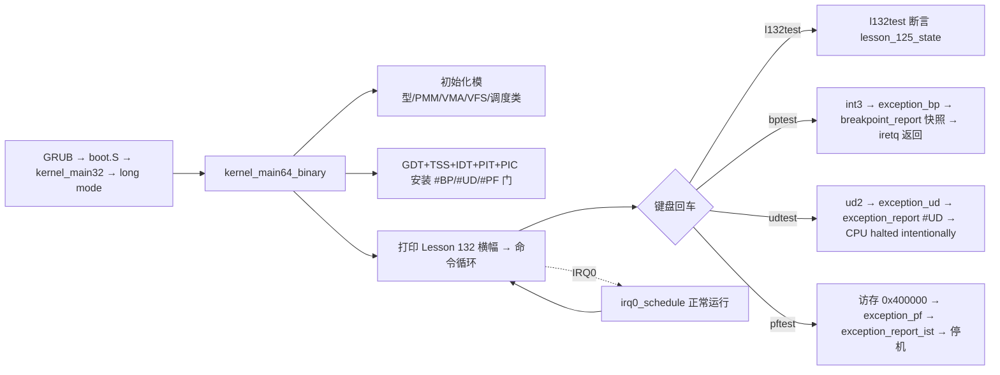

# Lesson 132: 崩溃诊断快照 — 精讲文档

> **课号**：Lesson 132 ｜ **主题**：崩溃诊断快照（crash diagnostics snapshot）
> **课程主线位置**：并发/诊断检查点阶段（Lesson 106–132），本课为 Lesson 106 原型的第 26 个（末个）检查点
> **前置课程**：[`../lesson-131-stable/README.md`](../lesson-131-stable/README.md)（死锁检测元数据）
> **后续课程**：并发/诊断阶段收束；下一批课程将从本快照基础转向新的主线（可观测性收尾后回到系统结构主题）
> **一句话目标**：精讲「崩溃诊断快照」——异常/致命故障发生时，把异常帧（vector/error/rip/cs/rflags）、栈指针、CR2、IST 栈范围等现场聚合成一次性只读报告并主动停机，作为诊断的第一现场；用 `l132test` 检查点收束整个 106–132 序列。

> **Course status: stable snapshot.** 本课为稳定快照：教学内核用固定容量、无宿主调用（freestanding）的方式，对 bounded concurrency、SMP、RCU、diagnostics 元数据进行确定性建模。**旧 README 记载的命令 `l125test` 不存在**，以源码为准勘误为 `l120test`–`l124test` 与 `l132test`，另加继承的进程、GUI、子系统回归命令。会话不变量保持不变。

本课是检查点课：`kernel64.c` 相对上一课（lesson-131）只有两处 diff 块——补全 `l124test()`、新增 `struct lesson_125_model`/`lesson_125_state` 与 `l132test()`，并把 `about`/开机横幅换成「崩溃诊断快照」。快照机制本体由早期课程累积代码承载：`exception_report`/`exception_report_ist`/`breakpoint_report`/`print_exception_frame`（Lesson 27/28 起）、`stackinfo`/`idtinfo`/`hhinfo`、`syscall_report` 的用户态现场，以及 `isttest`/`pftest`/`udtest`/`stackguardtest` 等主动触发崩溃的诊断命令，本课按「快照」主题统一精讲。

---

## 1. 课程定位（Mission）

**学完本课你能**：说出一个崩溃诊断快照至少应包含哪四块内容——**异常现场**（vector/error/rip/cs/rflags）、**地址现场**（CR2、栈指针、IST/rsp0 栈范围）、**子系统账本**（调度/锁/内存/PIT 计数）、**处理决策**（返回继续 or 主动停机）；在教学内核中沿 `exception_report` → `print_exception_frame` → `CPU halted intentionally` 走一遍崩溃快照的完整路径；运行 `l132test`/`l124test` 与 `bptest`（可返回）、`udtest`/`pftest`（致命停机）验证快照语义。

**在课程主线中的位置**：Lesson 106 起的并发/诊断检查点序列到本课收束。Lesson 128–129 讲事件容器与选择、Lesson 130–131 讲锁依赖图与死锁检测元数据，本课把这些可观测性数据在「崩溃时刻」聚合成快照——对应 Linux 的 oops/panic 输出（`kernel/panic.c`、`arch/x86/kernel/dumpstack.c`）与 crash dump 语义。这是 106–132 主题的收尾课。

**前置知识清单**（学本课前必须掌握）：
1. 异常帧布局：`struct exception_frame`（vector/error/rip/cs/rflags/rsp/ss）与 IST 帧变体（Lesson 27 起）。
2. 中断门与 IST：`set_gate`、`#PF` 用 IST1、`#BP` 返回语义（Lesson 27/30 起）。
3. 死锁检测元数据四类字段（Lesson 131）。
4. 检查点模型约定：`lesson_N_model`/`lNtest()` 的 a/b/c/d 与 valid/active/ready/accounted 字段（Lesson 69 起）。

**本课交付（可见结果）**：
- 开机横幅与 `about` 显示 `Lesson 132: 崩溃诊断快照`；
- 新命令 `l132test` 输出 `l132test: bounded concurrency, SMP, RCU, and diagnostics checkpoint passed`（异常时输出 `Lesson 125 fallback reported`）；
- `bptest` 演示「可返回」的断点快照（打印后 iretq 回 shell），`udtest`/`pftest` 演示致命快照（打印后 `CPU halted intentionally.`）。

---

## 2. 核心概念精讲

### 2.1 崩溃诊断快照：故障时刻的「现场照片」

**直觉**：内核崩溃的瞬间，一切变量仍在内存里，但进程可能继续跑、把现场踩烂。所以故障处理的第一步是**在改变任何状态之前，把关键状态打印出来**——这就是快照。它与日志（trace）的区别是：日志是**事前持续记录**，快照是**事发一次性定格**。

**四块内容**：
1. **异常现场**：`vector`（哪类异常）、`error code`（#PF 的可访问原因位）、`rip`（崩在哪条指令）、`cs`（内核/用户）、`rflags`；
2. **地址现场**：`cr2`（#PF 时触发缺页的地址）、当前 `rsp`、`rsp0`/IST 栈范围（判断栈是否在保护区域内）；
3. **子系统账本**：调度计数、锁状态、PMM、tick——来自前几课的元数据；
4. **处理决策**：快照后是「返回继续」（可恢复，如 `#BP`）还是「主动停机」（`CPU halted intentionally.`，不可恢复）。

### 2.2 Linux 对照：oops/panic 与 crash dump

- `kernel/panic.c`：`panic()` 打印 panic 信息后停机/重启；`oops` 是「可继续」的内核故障；
- `arch/x86/kernel/dumpstack.c`：`show_regs()`/`dump_stack()` 打印寄存器帧与调用栈——即本课 `print_exception_frame` 的对齐物；
- crash dump（`kernel/kexec_core.c` 等）：把内存镜像转储到磁盘/网络供事后分析——教学内核没有转储介质，以 VGA 打印 + 停机代替。
- **教学模型简化**：单 CPU、无 `dump_stack` 调用栈回溯（无栈帧遍历），打印异常帧后直接停机；`#BP` 保留「返回继续」路径以演示可恢复快照。

### 2.3 快照与「不可变」原则

崩溃快照的黄金原则：**打印时不允许再触发异常、不允许依赖可能已损坏的数据结构**。教学内核的做法：打印用 `clear64` 重置光标 + `text64/hex64` 纯 VGA 直写（不经过环形缓冲、不取锁）；`exception_report_ist` 打印后 `cli;hlt` 死循环——不再返回可能已损坏的执行流。`breakpoint_report` 是例外：`#BP` 是**用户故意触发**且帧完整，快照后可 iretq。

### 2.4 检查点模型：l124test / l132test

本课把上一课的 `l131test` 拆成两步推进：`l124test()` 补全 `lesson_124_model` 的测试（四元组 124,125,126,127），`l132test()` 使用新增的 `lesson_125_model`（四元组 125,126,127,128）。断言仍为「四布尔位 + `b==a+1`」；`l132test` 作为本序列末个检查点，四元组推进到 125–128。

---

## 3. 源码精讲

### 3.1 文件清单与职责

| 文件 | 职责 | 本课增量（相对 lesson-131） |
|---|---|---|
| `boot.S` | Multiboot2 头、32 位入口、进入 long mode、`.text64` 内嵌 `kernel64.bin` | 未变化 |
| `kernel.c` | 32 位侧：解析 MBI/内存图/帧缓冲，建立页表与用户镜像，`long_mode_handoff` 交接 | 未变化 |
| `kernel64.c` | 64 位主内核：命令循环、调度器、异常报告/快照机制、全部检查点测试 | 见 3.2 增量列表 |
| `kernel64.ld` | 64 位裸二进制布局，三组 guard+payload 栈区及 ASSERT | 未变化 |
| `linker.ld` | 外层 ELF 布局 | 未变化 |
| `Makefile` | 构建 kernel.iso、`check` 校验、`run` | `check` 中 grep 串换为 `Lesson 132`/`l132test`/`崩溃诊断快照` |
| `grub.cfg` | GRUB 菜单项 | 未变化 |

### 3.2 kernel64.c 精讲（本课增量 + 快照机制）

#### 本课增量一：检查点模型与测试

```c
static TEXT64 void l124test(u16*c){lesson_124_state=(struct lesson_124_model){124U,125U,126U,127U,1,1,1,1};int ok=lesson_124_state.valid&&lesson_124_state.active&&lesson_124_state.ready&&lesson_124_state.accounted&&lesson_124_state.b==lesson_124_state.a+1U;text64(c,"l124test: ");text64(c,ok?"bounded concurrency, SMP, RCU, and diagnostics checkpoint passed":"Lesson 124 fallback reported");putc64(c,'\n');}
```
- 上一课 `l131test` 使用 `lesson_124_state`；本课把它降格为独立命令 `l124test`，四元组 `{124U,125U,126U,127U}` 与四个布尔位整体赋值。
- 算法步骤：(1) 整体赋值模型；(2) 求 `ok=valid&&active&&ready&&accounted&&(b==a+1)`；(3) 打印 `"l124test: "` 前缀与成功/fallback 串。失败输出 `"Lesson 124 fallback reported"`，无副作用、可重复。

```c
struct lesson_125_model { u32 a,b,c,d; u8 valid,active,ready,accounted; };
static struct lesson_125_model lesson_125_state;
static TEXT64 void l132test(u16*c){lesson_125_state=(struct lesson_125_model){125U,126U,127U,128U,1,1,1,1};int ok=lesson_125_state.valid&&lesson_125_state.active&&lesson_125_state.ready&&lesson_125_state.accounted&&lesson_125_state.b==lesson_125_state.a+1U;text64(c,"l132test: ");text64(c,ok?"bounded concurrency, SMP, RCU, and diagnostics checkpoint passed":"Lesson 125 fallback reported");putc64(c,'\n');}
```
- 本课新增 `lesson_125_model` 结构与状态对象，`l132test()` 为其测试。四元组 `{125,126,127,128}`，成功串 `"bounded concurrency, SMP, RCU, and diagnostics checkpoint passed"`，fallback 串 `"Lesson 125 fallback reported"`。
- 设计动机：检查点按「一课一模型」推进，结构形态不变、仅课号四元组与 fallback 串递增——这是 106–132 序列公共的最小 diff 约定，`l132test` 的 125–128 四元组也标记了序列终点。

#### 本课增量二：exec64 命令表与横幅

```c
else text64(c,"Lesson 132: 崩溃诊断快照\n");
```
- `about` 与开机横幅 `"Lesson 132: 崩溃诊断快照\nGETTICKS, GETPID, WRITE_CONSOLE, EXIT; unknown=-ENOSYS; bounded reclaim metadata\n"` 更新；命令表把上一课的 `l131test` 分支换成 `l124test` 与 `l132test` 两个分支，`help` 长串对应位置为 `...l123test l124test l132test resourceinfo...`。横幅串是 Makefile `check` 中 `grep -q '崩溃诊断快照' README.md` 与 `grep -q 'Lesson 132' README.md` 的源码侧锚点。

#### 主题机制一：异常帧字段（快照的原始数据）

```c
struct exception_frame { u64 vector,error,rip,cs,rflags,rsp,ss; };
struct exception_frame_ist { u64 vector,error,rip,cs,rflags,rsp,ss; };
```
- `vector`：异常向量号（3=#BP、6=#UD、14=#PF）；`error`：#PF 时含 P/W/U 原因位，其余异常填 0；`rip` 为故障指令地址；`cs/rflags` 为故障时刻的代码段与标志；`rsp/ss` 为故障时刻栈指针与栈段。
- 两个结构字节相同（`_Static_assert(sizeof(struct exception_frame_ist)==56,...)`），区别在语义：IST 变体的 `rsp/ss` 跟在 CPL0 返回帧之后（CPU 用 IST 自动换栈），普通变体直接由 CPU 压栈。
- `_Static_assert(sizeof(struct idt_gate)==16,"idt gate")` 等编译期断言保证帧布局与 `set_gate`/汇编入口的压栈顺序一致——快照字段错位是崩溃诊断的最大陷阱。

#### 主题机制二：致命快照（exception_report / exception_report_ist）

```c
static TEXT64 void print_exception_frame(u16*c,struct exception_frame*f){text64(c,"\nvector: ");hex64(c,f->vector);text64(c,"\nerror:  ");hex64(c,f->error);text64(c,"\nrip:    ");hex64(c,f->rip);text64(c,"\ncs:     ");hex64(c,f->cs);text64(c,"\nrflags: ");hex64(c,f->rflags);}
```
- 逐字段十六进制打印异常帧——这是快照的第一块内容。`u16 c` 是 VGA 光标，所有打印直接写 `0xb8000`，不经过环形缓冲或锁，保证「打印本身不触发新故障」。

```c
TEXT64 void exception_report(struct exception_frame*f){u16 c=0;u64 cr2=0,rsp;clear64(&c);text64(&c,"TinyOS lesson 28 exception\nexception: ");if(f->vector==6)text64(&c,"#UD");else if(f->vector==14)text64(&c,"#PF");else text64(&c,"unknown");print_exception_frame(&c,f);__asm__ volatile("mov %%rsp,%0":"=r"(rsp));if(f->vector==6&&f->cs==USER_CS){text64(&c,"\nCPL3 #UD proof: user CS and kernel rsp0 active\nhandler rsp: ");hex64(&c,rsp);text64(&c,"\nrsp0: ");hex64(&c,runtime_tss.rsp0);text64(&c,"\nsaved user rsp: ");hex64(&c,f->rsp);text64(&c,"\nsaved user ss: ");hex64(&c,f->ss);text64(&c,"\nCPU halted intentionally.\n");}else {if(f->vector==14){__asm__ volatile("mov %%cr2,%0":"=r"(cr2));text64(&c,"\ncr2:    ");hex64(&c,cr2);}text64(&c,"\nCPU halted intentionally.\n");}for(;;)__asm__ volatile("cli; hlt");}
```
- 步骤 1：`clear64` 重置 VGA 光标，保证快照从屏幕顶部开始；打印标题 `TinyOS lesson 28 exception` 与异常名（#UD/#PF/unknown）。
- 步骤 2：`print_exception_frame` 打印异常现场。
- 步骤 3：地址现场——`mov %%rsp` 采样当前栈指针；CPL3 #UD 时额外打印 `rsp0` 与用户 `rsp/ss`（证明 CPU 已从用户栈切到内核 rsp0）；#PF 时读 `cr2`（触发缺页的地址）。
- 步骤 4：**处理决策**——`CPU halted intentionally.` 后 `cli;hlt` 死循环。快照完成即停机，绝不再回到可能已损坏的执行流。

```c
TEXT64 void exception_report_ist(struct exception_frame_ist*f){u16 c=0;u64 cr2=0,rsp;clear64(&c);__asm__ volatile("mov %%rsp,%0":"=r"(rsp));text64(&c,"TinyOS lesson 27 IST exception\nexception: #PF\nvector: ");hex64(&c,f->vector);text64(&c,"\nerror:  ");hex64(&c,f->error);text64(&c,"\nrip:    ");hex64(&c,f->rip);text64(&c,"\nsaved rsp: ");hex64(&c,f->rsp);text64(&c,"\nhandler rsp: ");hex64(&c,rsp);text64(&c,"\nIST1 range: ");hex64(&c,(u64)(unsigned long)__ist1_stack_start);hex64(&c," ");hex64(&c,runtime_tss.ist1);__asm__ volatile("mov %%cr2,%0":"=r"(cr2));text64(&c,"\ncr2:    ");hex64(&c,cr2);text64(&c,"\nCPU halted intentionally.\n");for(;;)__asm__ volatile("cli; hlt");}
```
- `#PF` 走 IST1：CPU 用 `TSS.ist1` 自动换栈，`f->rsp` 是被打断者的栈指针、`rsp` 是 handler 当前栈指针。
- 快照额外打印 `IST1 range: __ist1_stack_start runtime_tss.ist1`——验证 handler 栈落在 `kernel64.ld` 声明的 0x1000 字节 IST 栈内（三个 `ASSERT` 保证该范围）；若 `handler rsp` 超出该范围说明栈溢出。
- `cr2` 打印触发缺页的地址；同样以 `CPU halted intentionally.` + `cli;hlt` 收尾。

#### 主题机制三：可恢复快照（breakpoint_report / #BP）

```c
TEXT64 void breakpoint_report(struct exception_frame*f){u16 c=10*COLS;u64 *raw=(u64 *)f;text64(&c,"TinyOS lesson 27 breakpoint\nexception: #BP\nvector: ");hex64(&c,raw[0]);text64(&c,"\nerror:  ");hex64(&c,raw[1]);text64(&c,"\nrip:    ");hex64(&c,raw[3]);text64(&c,"\ncs:     ");hex64(&c,raw[4]);text64(&c,"\nrflags: ");hex64(&c,raw[5]);text64(&c,"\nreturning with iretq...\n");}
```
- `#BP` 是**可恢复**异常：打印快照后不 halt，由汇编入口 `exception_bp` 做 `addq $16,%rsp; popq %rbx; iretq` 返回。
- `u16 c=10*COLS` 从第 10 行开始打印，避免覆盖 shell 输出；`raw` 直接按 `u64` 数组访问帧（`raw[3]`=rip、`raw[5]`=rflags），帧布局与 `struct exception_frame` 一一对应。
- 快照语义的对照：`bptest` 输出 `triggering #BP` 后 `#BP returned to shell`——「快照 → 决策 → 恢复」的完整循环；而 `udtest`/`pftest` 则进入致命路径。

#### 主题机制四：系统状态快照命令

```c
static TEXT64 void stackinfo(u16*c){...text64(c,"idle guard/payload/end: ");...text64(c,"\nrsp0 guard/payload/end: ");...text64(c,"\nIST1 guard/payload/end: ");...}
```
- `stackinfo` 打印三组栈的 guard/payload/end 地址——崩溃时核对 `rsp` 落在哪个栈、是否越过 guard。`stackguardtest idle|rsp0|ist1` 主动访问 guard 页触发 `#PF`（IST1），演示 guard 页拦截栈溢出的快照路径。

```c
static TEXT64 void idtinfo(u16*c,struct long_mode_handoff*h){text64(c,"IDT: exceptions + DPL3 syscall gate + PIT IRQ0 + IRQ1\n#PF IST: 0000000000000001\nbase: ");hex64(c,phys_to_high(h->idt_address));...}
```
- `idtinfo` 输出 IDT 各向量配置（#PF 用 IST1、`int 0x80` DPL3），是「崩溃时该进哪个 handler、用哪条栈」的静态快照。
- `hhinfo`/`lminfo`/`tickinfo`/`meminfo`/`threadinfo`/`pcinfo`/`kbdinfo` 分别快照地址空间、时钟、内存、调度、生产者-消费者、键盘现场——它们构成崩溃快照的「子系统账本」面，与第 131 课的元数据分类衔接。

### 3.3 构建管线（Makefile / linker）

- 构建链与 lesson-127–131 相同：`kernel64.c`（`-m64 -mno-red-zone -fpie ...`）→ `kernel64.ld` → `objcopy -O binary` → `boot.S` `.incbin` 内嵌 → 外层 `linker.ld` → `grub-mkrescue`。
- `check` 目标：`grub-file --is-x86-multiboot2 build/kernel.elf` + `grep -q '崩溃诊断快照' README.md` + `grep -q 'l132test' kernel64.c` + `grep -q 'Lesson 132' README.md`，全过后打印 `Multiboot2 and Lesson 132 checks passed.`。
- 本课构建步骤相对上一课零新增——只有检查串随课号轮换。

### 3.4 主控制流


- 崩溃快照路径：命令 → 指令触发异常 → CPU 经 IDT 进 `exception_*` 汇编入口 → C 报告函数打印现场 → 可恢复（#BP iretq）或致命（`cli;hlt`）。

---

## 4. 数据流与运行逻辑

1. 开机：`kernel_main64_binary` 安装 IDT（`set_gate(&idt[3],runtime_bp_address(),0)`、`#UD` 向量 6、`#PF` 用 `IST1_INDEX`）后打印 `Lesson 132: 崩溃诊断快照` 横幅进入 `tinyos> `。
2. 输入 `l132test`：整体赋值 `lesson_125_state={125,126,127,128,1,1,1,1}` → 求 `ok` → 输出 `l132test: bounded concurrency, SMP, RCU, and diagnostics checkpoint passed`。
3. 输入 `bptest`：`int3` → CPU 查 IDT[3] → `exception_bp`（汇编压 `%rbx`、`$0`、`$3`）→ `breakpoint_report` 在第 10 行打印 `TinyOS lesson 27 breakpoint` 现场 → 返回汇编 `addq $16,%rsp; popq %rbx; iretq` → shell 输出 `#BP returned to shell`。
4. 输入 `udtest`：`ud2` → `exception_ud` → `exception_report` 打印 `exception: #UD` 与帧 → 输出 `CPU halted intentionally.` 后 `cli;hlt` 停机（QEMU 因 `-no-reboot -no-shutdown` 停在画面）。
5. 输入 `pftest`：读 `0x00400000`（未映射）→ `#PF` → `exception_report_ist` 打印 `IST1 range` 与 `cr2` → 停机。

---

## 5. 构建、运行与验证

**依赖**：`gcc`、`binutils`、`grub-mkrescue`、`grub-file`、`qemu-system-x86_64`（与 lesson-131 相同）。

**构建**（与 Makefile 一致）：
```bash
cd lessons/lesson-132-stable
make clean && make -j"$(nproc)"
make check
```
- `make check` 预期最后一行：`Multiboot2 and Lesson 132 checks passed.`

**运行**：
```bash
make run
```
成功画面在 QEMU 图形窗口，**勿加 `-display none`**。

**验证步骤**（输出串从源码逐字抄录）：
1. `about` → `Lesson 132: 崩溃诊断快照`
2. `l132test` → `l132test: bounded concurrency, SMP, RCU, and diagnostics checkpoint passed`
3. `l124test` → `l124test: bounded concurrency, SMP, RCU, and diagnostics checkpoint passed`
4. `bptest` → 先打印 `triggering #BP`，然后快照区以 `exception: #BP` 开头、以 `returning with iretq...` 结尾，最后 shell 打印 `#BP returned to shell`
5. `udtest` → 先打印 `triggering #UD`，然后快照区 `exception: #UD` 与 `CPU halted intentionally.`（QEMU 画面定格，需重启 `make run`）
6. `pftest` → 先打印 `triggering #PF`，然后快照区 `exception: #PF`、`cr2:    ` 与 `CPU halted intentionally.`

**如何判断成功**：`l132test` 输出成功串即检查点通过；`bptest` 能返回 shell（可恢复快照），`udtest`/`pftest` 打印完整现场后定格（致命快照）；`make check` 打印 `Multiboot2 and Lesson 132 checks passed.`。

---

## 6. 调试地图

| 现象 | 原因 | 检查方法 |
|---|---|---|
| `l132test` 输出 `Lesson 125 fallback reported` | `lesson_125_state` 四布尔位或 `b==a+1` 断言失败 | 检查 `l132test` 初始化 `{125U,126U,127U,128U,1,1,1,1}`；`about` 确认是 132 内核 |
| `make check` grep 失败 | README 缺 `Lesson 132`/`l132test`/`崩溃诊断快照` | `grep -n 'Lesson 132\|l132test\|崩溃诊断快照' README.md` |
| 输入 `l125test` 显示 `unknown command` | 该命令在源码中不存在（旧 README 误记） | 以源码为准输入 `l120test`–`l124test`/`l132test`；`help` 列出 `...l123test l124test l132test...` |
| `bptest` 卡死未回 shell | `exception_bp` 的返回路径（`addq $16,%rsp; popq %rbx; iretq`）与帧布局不符 | 检查 `struct exception_frame` 大小与 `_Static_assert`；确认压栈顺序 rbx/error/vector |
| `pftest` 快照里 `handler rsp` 超出 `IST1 range` | IST 栈被覆盖或 `kernel64.ld` 的 `__ist1_stack_end` 与 `runtime_tss.ist1` 不一致 | 运行 `stackinfo` 对照三组地址；检查 `kernel64.ld` 的 `ASSERT(__ist1_stack_end - __ist1_stack_start == 0x1000)` |
| `udtest` 快照无 `cr2` 字段 | `cr2` 只在 #PF 采样（正确行为） | 核对 `exception_report` 中 `f->vector==14` 分支；`udtest` 应只打印帧与停机 |
| 快照区显示乱码 | VGA 光标未复位或打印期间再次触发异常 | 确认 `clear64(&c)` 在报告函数开头；打印路径不经过环形缓冲/锁 |
| `isttest` 触发 #PF 后立即停机 | 预期行为（`isttest: triggering #PF on IST1 (fatal)`） | 对照 `exception_report_ist` 输出 `IST1 range` 与 `CPU halted intentionally.`，属正常崩溃路径 |

---

## 7. 与 Linux 源码对照

| 对照点 | TinyOS 教学模型（本课） | Linux 实现 | 教学模型简化了什么 |
|---|---|---|---|
| 崩溃报告整体 | `exception_report`/`exception_report_ist` 打印帧后 `cli;hlt` | `kernel/panic.c` `panic()`/oops 处理 + `arch/x86/kernel/dumpstack.c` `show_regs` | 无调用栈回溯（`dump_stack`）、无 printk/串口日志缓冲 |
| 寄存器快照 | `print_exception_frame` 六字段（vector/error/rip/cs/rflags） | `arch/x86/kernel/dumpstack.c` 打印全部通用寄存器 + `pt_regs` | 无完整 GPR 打印，只打异常帧 |
| 地址现场 | `cr2`（#PF）、`rsp`、`rsp0`/IST 范围 | `arch/x86/mm/fault.c` 打印 `CR2`/`RIP`/`RSP`/`RFLAGS`；`show_regs` 含段寄存器 | 无段寄存器与页表转储 |
| 可恢复 vs 致命 | `#BP` iretq 返回；`#UD`/`#PF` `CPU halted intentionally.` | oops 继续 + `panic` 停机；`TAINT` 标志记录已损坏状态 | 二元决策，无 TAINT 与继续执行的修复路径 |
| 栈范围核对 | `stackinfo`/`IST1 range` 与 `kernel64.ld` ASSERT | `arch/x86/kernel/stacktrace.c` 栈顶/栈底哨兵 + `CONFIG_VMAP_STACK` 异常栈检测 | 静态地址核对，无红区/哨兵页运行时扫描 |
| 快照内容清单 | 异常现场 + 地址现场 + `threadinfo`/`meminfo` 等子系统账本 | `kernel/panic.c` `dump_stack`/`show_state`/`sysrq` 各子系统快照 | 手动逐条命令，无统一 coredump 流程 |

权威来源：Intel SDM（异常向量 3/6/14、`#PF` error code 与 CR2、IST 机制、`int3`/`ud2` 指令）、GNU GRUB（`grub-file` Multiboot2 校验）、Linux 内核源码路径如上表。

---

## 8. 思考题与练习

1. **概念理解**：崩溃快照为什么必须在打印前 `clear64`、打印后「返回」或「停机」二选一？如果打印期间再触发一次异常会怎样？
2. **源码定位**：在 `kernel64.c` 中找到 `set_gate` 对 IDT[3]/[6]/[14] 的配置，说明 `#PF` 为什么用 `IST1_INDEX` 而 `#BP` 用 0，以及 `exception_report_ist` 里 `f->rsp` 与 `rsp` 的区别。
3. **动手实验**：修改 `breakpoint_report` 的起始行 `u16 c=10*COLS` 为 `0`，运行 `bptest`，观察快照是否覆盖 shell 输出——体会光标管理在快照显示中的角色。
4. **动手实验**：在 `kernel64.ld` 中把 `__ist1_stack_start` 的 `ALIGN(0x1000)` 改为 `ALIGN(0x800)`（仅练习、勿提交），重新构建观察 `ASSERT` 失败——体会编译期栈尺寸保证对崩溃诊断的支撑。
5. **Linux 对照**：对照 `arch/x86/kernel/dumpstack.c` 的 `show_regs` 与本课 `print_exception_frame`，列出教学模型未打印的寄存器/段信息，并说明真实内核为何需要它们。

---

## 9. 本课小结与下一课预告

**小结**：本课是第 106 号并发/诊断原型的第 26 个（末个）检查点，主题「崩溃诊断快照」。新增 `lesson_125_model` 与 `l132test()`，把 `l131test` 拆为 `l124test()`，命令表与横幅更新为 Lesson 132。核心结论：崩溃快照由「异常现场（帧字段）→ 地址现场（CR2/rsp/IST 范围）→ 子系统账本 → 处理决策（返回/停机）」四块构成；`exception_report`/`exception_report_ist` 以纯 VGA 直写打印后 `cli;hlt`，`breakpoint_report` 保留 iretq 返回路径；`stackinfo`/`idtinfo` 等命令提供静态快照面。`l132test`、`bptest`、`udtest`、`pftest` 构成可复现的验证面，`make check` 的 `Multiboot2 and Lesson 132 checks passed.` 是构建级成功标志。

**下一课预告**：并发/诊断检查点序列（Lesson 106–132）在本课收束。`l132test` 的四元组推进到 125–128，标记该原型终点。后续课程将把「快照内容清单」与前期积累的调度、锁、内存、VFS、GUI 机制整合，进入新的主线主题；衔接点：本课 `exception_report` 的「打印即定格」原则，可作为后续任何「状态可观测」功能的设计范式。
