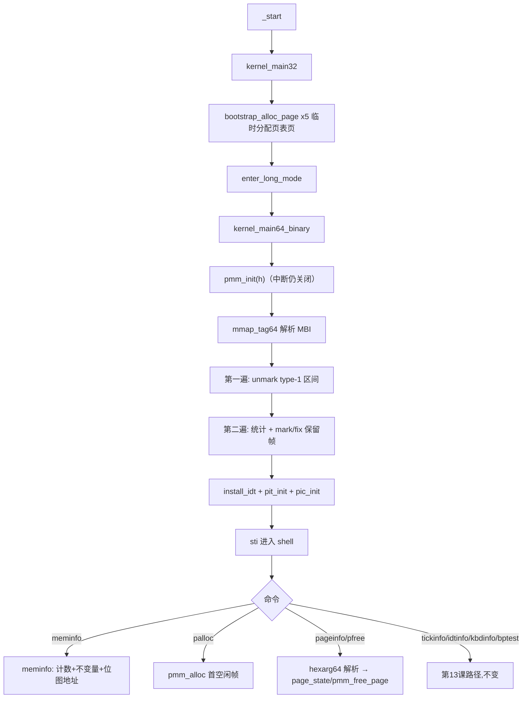

# Lesson 14: bitmap 物理页管理器（alloc / free / reserve） — 精讲文档

> **课程主线位置**：操作系统内核第三阶段「内存管理」的第 1 课（把第 9~13 课累积的临时分配逻辑正式化）。
> **前置课程**：[Lesson 13: 8254 PIT 周期定时器（IRQ0 tick）与 IRQ1 键盘](../lesson-13-stable/README.md)
> **后续课程**：[Lesson 15: 受控单槽动态页映射](../lesson-15-stable/README.md)
> **一句话目标**：学会用「每帧一位」的 bitmap 位图管理 identity 窗口内的 4 KiB 物理页帧，
> 实现 `pmm_alloc` / `pmm_free_page` / 固定保留（reserve）三套语义，并验证统计不变量
> `tracked = free + used`。

## 1. 课程定位（Mission）

- **一句话目标**：学完本课你能——用两个 128 字节位图（分配位图 `pmm_bitmap` + 不可变保留位图
  `pmm_fixed`）管理 4 MiB identity 窗口内的 1024 个物理页帧，从 Multiboot2 内存图中初始化「可用/保留」状态，
  通过 `palloc`/`pfree`/`pageinfo`/`meminfo` 命令完成分配、释放、状态查询与统计校验。
- **在课程主线中的位置**：属于「内存管理」阶段第 1 课。前 13 课只有一个 64 项历史的线性扫描分配器
  （`alloc64`），本课把它升级为可释放、可保留、可查状态的正式 PMM；下一课（Lesson 15）要用它动态映射
  页表，再往后是双别名（16）、调度器（17/18）——PMM 是整个后续模块的公共地基。
- **前置知识清单**：
  1. Multiboot2 内存图（mmap tag type=6）的遍历方法（第 9 课 `kernel.c` 的 `prepare_memory_map`）。
  2. `kernel64.ld` 的 `.data`/`BYTE(0)` 物化机制——本课两个位图数组也必须落入原始二进制。
  3. 第 13 课的 PIT/IRQ/IDT 体系（本课完全保留，仅新增 PMM 子系统）。
  4. C 语言位运算（`>>`、`&`、`|`、`~`）与 2 的幂取模（`n>>3`、`n&7`）。
- **本课交付（可见结果）**：`meminfo` 打印 PMM 状态与 `invariant tracked = free + used: yes`；
  `palloc` 返回帧地址、`pageinfo <hex>` 报告五种状态之一、`pfree <hex>` 释放已分配帧；键盘新增数字键
  支持，可输入十六进制地址。

## 2. 核心概念精讲

### 2.1 Bitmap（位图）：用一位管理一帧

**定义**：bitmap 物理页管理器用「每个物理页帧一个二进制位」记录其分配状态。本课 `PMM_MAX_PHYS =
0x00400000`（4 MiB identity 窗口）包含 `PMM_FRAMES = 1024` 个 4 KiB 帧，恰好
`PMM_BITMAP_BYTES = 128` 字节。

**为什么需要**：第 13 课的 `alloc64` 靠 `allocation_history[64]` 记「已分配」，只能分配、不能释放、
64 项封顶。bitmap 把「1024 帧的状态」压缩到 128 字节，O(1) 的标记/查询（位索引可算出帧号），
且天然支持释放（把位清零）。

**工作机制**：帧号 `n` 映射到字节 `pmm_bitmap[n>>3]` 的第 `n&7` 位（字节内 LSB 是位 0）：

```text
pmm_bitmap[0]  bit7 ... bit0  ──► 帧 7 ... 帧 0    (帧 i 的物理地址 = i * 0x1000)
pmm_bitmap[1]  bit7 ... bit0  ──► 帧 15 ... 帧 8
...
```

**为什么用两张位图**：分配状态必须可翻转（`mark`/`unmark`）；而「内核镜像、栈、MBI、页表、位图自身」
这些帧是**不可变保留**的——任何释放操作都不许归还它们。若只用一张位图，`pfree` 无法区分「这个帧为什么
占着」，可能误释放保留页。所以 `pmm_fixed` 用额外一位记录「永久保留」，`pfree` 检查到 `fixed` 就拒绝。

### 2.2 位操作集：bit / mark / unmark / fixed / fix

```c
static TEXT64 int bit(u32 n){return(pmm_bitmap[n>>3]>>(n&7))&1;}
static TEXT64 void mark(u32 n){pmm_bitmap[n>>3]|=(u8)(1U<<(n&7));}
static TEXT64 void unmark(u32 n){pmm_bitmap[n>>3]&=(u8)~(1U<<(n&7));}
static TEXT64 int fixed(u32 n){return(pmm_fixed[n>>3]>>(n&7))&1;}
static TEXT64 void fix(u32 n){pmm_fixed[n>>3]|=(u8)(1U<<(n&7));}
```

- `bit(n)`：返回分配位图中第 `n` 帧的状态，1 = 已占用，0 = 空闲。三步拆解：`n>>3` 定位字节，
  `n&7` 定位字节内位，`&1` 取出该位。
- `mark(n)`：`|= (1U<<(n&7))` 只把目标位置 1，其余位不变——读-改-写的最小单位是字节。
- `unmark(n)`：`&= ~(1U<<(n&7))` 只把目标位清 0。这是释放路径的核心原语。
- `fixed(n)` / `fix(n)`：与 `bit`/`mark` 同构，但操作的是**保留位图**。位图上只有置位原语 `fix`，
  **没有 `unfix`**——保留一旦建立，全系统生命周期内不可撤销。
- 索引换算：帧号 `n` 的物理地址 = `(u64)n*PAGE_SIZE`；反向换算 `(u32)(p/PAGE_SIZE)`。数组声明为
  `volatile`，因为 PMM 状态虽只在 shell 上下文改动，但位图内存被 `pmm_reserved` 直接取地址，
  必须保证真实读写。

### 2.3 pmm_init：fail-closed 的两遍扫描初始化

**定义**：`pmm_init` 在 64 位续体入口（开中断前）执行，把 Multiboot2 内存图折叠成位图。
初始化失败时**不回退、不假装可用**，而是把 `pmm_ready` 保持 0、`pmm_error` 指向具体原因，
`meminfo`/`palloc` 会显示该原因而非「分配器枯竭」。

**第一遍：从 mmap 解放可用帧**。位图先全部写 `0xff`（一切皆占用），再遍历 type-1 可用区间，
把区间内每帧 `unmark` 成空闲。区间按 `up`/`down` 对齐到页边界、钳制在 `PMM_MAX_PHYS` 内。

**第二遍：统计并固化保留**。对 0~1023 每一帧：若 mmap 说可用，则 `pmm_total++`，再问
`pmm_reserved(h,p)`——是则 `mark(i); fix(i)`（分配状态与保留状态同时置位，`used` 类），否则 `pmm_free++`。
最后 `pmm_used = pmm_total - pmm_free`，`pmm_ready=1; pmm_error="ready"`。

**保留集合**（`pmm_reserved` 逐一 overlap 检查）：低 1 MiB（`p<0x100000`）、整数溢出回绕
（`e<p`）、内核镜像、引导栈、Multiboot 信息块、五张页表页（`pml4/pdpt/pd/pt0/pt1`）、IDT 后备页、
以及**位图元数据自身**区间 `[pmm_bitmap, pmm_bitmap+2*PMM_BITMAP_BYTES)`——位图文件也在 identity
窗口内，必须自保留，否则分配器会把「记录分配状态的页」分配出去。

### 2.4 alloc / free / reserve 三种语义

| 操作 | 位图变化 | 统计变化 | 拒绝条件 |
|------|----------|----------|----------|
| `pmm_alloc`（分配） | `mark(首个空闲帧)` | `pmm_free--; pmm_used++` | PMM 未就绪；1024 帧全占 → 返回 0 |
| `pmm_free_page`（释放） | `unmark(该帧)` | `pmm_free++; pmm_used--` | 不是 `allocated` 状态（free/fixed/reserved/invalid/unavailable 一律拒绝） |
| `pmm_init` 保留（reserve） | `mark + fix` | 计入 `used` | 属于内核/栈/MBI/页表/IDT/位图/低内存 |

关键点：`pmm_free_page` 只对 `page_state(p) == "allocated"` 的帧动手，而 `fixed` 帧返回
`"fixed/reserved"`，**从不触碰 `pmm_fixed` 位**——这就是「reserve 不可撤销」的代码保证。

### 2.5 状态机 page_state 与统计不变量

`page_state(p)` 按顺序判定：PMM 未就绪 → `"PMM unavailable"`；未对齐或 `p>=PMM_MAX_PHYS` →
`"invalid"`；分配位为 0 → `"free"`；保留位为 1 → `"fixed/reserved"`；其余 → `"allocated"`。
顺序很重要：先查 free 再查 fixed，避免把「保留帧」误报为空闲。

统计不变量 `pmm_total == pmm_free + pmm_used` 由设计保证：`total` 在初始化时对「可用帧」计数，
`free` 是对「未保留可用帧」计数，`used` 恒等于 `total - free`（保留帧计入 used）；此后每次
alloc/free 都在两侧同步增减。`meminfo` 输出 `"yes"` 或 `"BROKEN"` 用于自检。

### 2.6 命令行解析：token64 / hexarg64

第 14 课命令开始携带参数（`pfree <hex>`、`pageinfo <hex>`），因此引入最小分词器：

- `space64`：判断空格/制表符。
- `token64(s, word, cap)`：跳过前导空白 → 拷贝首个非空白词 → 跳过尾随空白 → 返回剩余串。
  `cap` 越界返回 0（上层打印 `"command too long\n"`）。
- `noargs64(s)`：剩余为空才算「无参数」；所有无参命令带多余输入会打印 `usage:`。
- `hexarg64(s, &v)`：解析十六进制（允许 `0x`/`0X` 前缀），拒绝空串、非法字符、溢出
  （`n>(~0ULL>>4)` 即超过 60 位前检查）、以及多余的尾随 token。
- **配套键盘增量**：`scan64` 新增数字键（scancode `0x02`~`0x0b` → `'1'`~`'9'`,`'0'`）与空格键
  （`0x39` → `' '`）。没有这组映射，用户根本敲不出 `pfree 101000` 这类十六进制参数。

## 3. 源码精讲

### 3.1 文件清单与职责

| 文件 | 职责 | 本课增量（相对 Lesson 13） |
|------|------|------------------------------|
| `kernel64.c` | 64 位内核续体：PMM、shell、IDT/PIC/PIT、异常与 IRQ | **大**：新增 PMM 位图/统计/状态机/命令解析；删除 `alloc64`/`pinfo`/分配历史；`scan64` 加数字与空格；`kernel_main64_binary` 先 `pmm_init(h)` |
| `kernel.c` | 32 位引导 | **中**：删除 `ALLOCATION_HISTORY_MAX` 与交接块里的分配字段；`phys_alloc_page` 改名为临时 `bootstrap_alloc_page`，只用于 5 张页表页，不再交接分配状态 |
| `boot.S` | i386 入口、long mode 切换 | 未变化 |
| `kernel64.ld` | kernel64 链接脚本 | 未变化（位图数组落入 `.data`，靠既有 `BYTE(0)` 物化） |
| `linker.ld` | 外层 32 位 ELF 布局 | 未变化 |
| `Makefile` | 构建/校验/运行 | 未变化 |
| `grub.cfg` | GRUB 菜单项 | 微小变化：menuentry 标题改为 "TinyOS lesson 14: bitmap physical page manager" |

### 3.2 kernel.c 精讲：引导段只负责「交棒」

```c
struct long_mode_handoff {
    u64 pml4, pdpt, pd, pt0, pt1, idt_address;
    u64 kernel_start, kernel_end, stack_start, stack_end;
    u32 mbi_address, mbi_size;
};
```

- 交接块删掉了 `allocation_cursor`、`allocation_end`、`allocation_history[64]`、`allocated_pages`：
  引导段不再持有任何「持久分配状态」——它只负责为进入 long mode 分配 5 张页表页，之后内存管理的
  责任完全移交 64 位续体。
- `page_was_allocated`/`page_is_reserved` 合并为 `bootstrap_reserved`；`phys_alloc_page` 更名
  `bootstrap_alloc_page`，语义注释强调「Temporary allocator for the five paging pages; no allocator
  state is handed off」。分配算法（mmap 扫描 + overlap 跳过保留区）不变，只是不再写入交接块历史。
- `long_mode_handoff` 在 kernel.c 与 kernel64.c 两处定义必须保持字段一致（ABI 契约），
  本课同步删减了两处。

### 3.3 kernel64.c 精讲（本课新增部分）

#### 3.3.1 PMM 常量与全局状态

```c
#define PMM_MAX_PHYS 0x00400000ULL
#define PMM_FRAMES (PMM_MAX_PHYS / PAGE_SIZE)
#define PMM_BITMAP_BYTES (PMM_FRAMES / 8)
...
static volatile u8 pmm_bitmap[PMM_BITMAP_BYTES];
static volatile u8 pmm_fixed[PMM_BITMAP_BYTES];
static u64 pmm_total,pmm_free,pmm_used;
static u8 pmm_ready;
static const char *pmm_error;
```

- `PMM_MAX_PHYS = 0x400000`：管理器只覆盖第 9 课建立的 4 MiB identity 窗口，是刻意的教学边界。
- 由宏推导：1024 帧、128 字节/张位图，编译期决定数组大小，无动态分配。
- `pmm_error` 是 `const char *` 指向字面串（`"ready"`、`"MBI too small"` 等），只读、全局唯一
  「初始化结果」；`pmm_ready` 是它的布尔快照。
- 两个位图数组是零初始化全局，必须依赖 `kernel64.ld` 的 `.data` 物化（第 13 课 2.4 节机制），
  否则 `objcopy -O binary` 后位图存储不存在。

#### 3.3.2 `mmap_tag64()`：带错误定位的 MBI 遍历

```c
static TEXT64 const struct mb2_mmap_tag *mmap_tag64(struct long_mode_handoff*h){u32 off=8;if(h->mbi_size<16){pmm_error="MBI too small";return 0;}while(off<h->mbi_size){const struct mb2_tag*t;u32 r;if(h->mbi_size-off<8){pmm_error="truncated MBI tag";return 0;}t=(const struct mb2_tag*)((const u8*)(unsigned long)h->mbi_address+off);if(t->size<8||t->size>h->mbi_size-off){pmm_error="bad MBI tag size";return 0;}r=(t->size+7)&~7U;if(r<t->size||r>h->mbi_size-off){pmm_error="bad MBI tag alignment";return 0;}if(t->type==6){const struct mb2_mmap_tag*m=(const struct mb2_mmap_tag*)t;if(t->size<16||m->entry_size<sizeof(struct mb2_mmap_entry)||(t->size-16)%m->entry_size){pmm_error="bad mmap layout";return 0;}return m;}off+=r;}pmm_error="mmap tag missing";return 0;}
```

- 从 `off=8` 开始跳过 MBI 头 8 字节（total_size + reserved），逐个 tag 前进。
- 每步四道边界检查，命中即写具体 `pmm_error` 并返回 0：`size<8` → `"truncated MBI tag"`；
  `size` 越界 → `"bad MBI tag size"`；8 字节对齐后回绕/越界 → `"bad MBI tag alignment"`；
  找到 mmap tag 但布局非法（`entry_size` 过小或不能整除数据区）→ `"bad mmap layout"`。
- 全程遍历完还没见 type=6 → `"mmap tag missing"`。这套「错在哪儿、报在哪儿」的设计就是
  fail-closed 的入口：`pmm_error` 会一路浮到 `meminfo` 与 `mmap` 命令。

#### 3.3.3 `pmm_init()`：两遍扫描

```c
static TEXT64 void pmm_init(struct long_mode_handoff*h){const struct mb2_mmap_tag*m;u32 off,i;pmm_ready=0;pmm_error="not initialized";pmm_total=pmm_free=pmm_used=0;for(i=0;i<PMM_BITMAP_BYTES;i++){pmm_bitmap[i]=0xff;pmm_fixed[i]=0;}m=mmap_tag64(h);if(!m)return;for(off=0;off<m->size-16;off+=m->entry_size){const struct mb2_mmap_entry*e=(const struct mb2_mmap_entry*)((const u8*)m+16+off);u64 p,end;if(e->type!=1||e->addr+e->len<e->addr)continue;p=up(e->addr);end=down(e->addr+e->len);if(p>=PMM_MAX_PHYS)continue;if(end>PMM_MAX_PHYS)end=PMM_MAX_PHYS;while(p<end){unmark((u32)(p/PAGE_SIZE));p+=PAGE_SIZE;}}for(i=0;i<PMM_FRAMES;i++){u64 p=(u64)i*PAGE_SIZE;if(!bit(i)){pmm_total++;if(pmm_reserved(h,p)){mark(i);fix(i);}else pmm_free++;}}pmm_used=pmm_total-pmm_free;pmm_ready=1;pmm_error="ready";}
```

- 复位阶段：`ready=0`、`error="not initialized"`、计数清零、`pmm_bitmap` 全 `0xff`、`pmm_fixed` 全 0。
- 第一遍（解放）：对每个 type-1 且不溢出的区间，`up` 对齐起点、`down` 对齐终点；区间整体超出窗口则
  `continue`，终点超窗则钳到 `PMM_MAX_PHYS`；逐帧 `unmark`。注意帧号 `p/PAGE_SIZE` 只在 `< 4 MiB`
  区间内计算，绝无越界。
- 第二遍（统计+保留）：只对「mmap 可用（`!bit(i)`）」的帧计数 `pmm_total`；其中被 `pmm_reserved`
  判定保留的帧 `mark(i); fix(i)`（alloc 位与 fixed 位同时置位，**之后任何路径都不会清 fixed 位**），
  其余归 `pmm_free`。
- 收尾：`pmm_used = total - free` 保证不变量成立；`ready=1`，`error="ready"`。
- 调用时机：`kernel_main64_binary` 第一行 `pmm_init(h)`，此时中断仍处于关闭状态（`_start` 的 `cli`
  尚未被打开），位图构建不被打断。

#### 3.3.4 `pmm_alloc()` / `page_state()` / `pmm_free_page()`

```c
static TEXT64 u64 pmm_alloc(void){u32 i;if(!pmm_ready)return 0;for(i=0;i<PMM_FRAMES;i++)if(!bit(i)){mark(i);pmm_free--;pmm_used++;return(u64)i*PAGE_SIZE;}return 0;}
static TEXT64 const char *page_state(u64 p){u32 i;if(!pmm_ready)return "PMM unavailable";if((p&(PAGE_SIZE-1))||p>=PMM_MAX_PHYS)return "invalid";i=(u32)(p/PAGE_SIZE);if(!bit(i))return "free";if(fixed(i))return "fixed/reserved";return "allocated";}
static TEXT64 const char *pmm_free_page(u64 p){u32 i;const char*s=page_state(p);if(!eq64(s,"allocated"))return s;i=(u32)(p/PAGE_SIZE);unmark(i);pmm_free++;pmm_used--;return "freed";}
```

- `pmm_alloc`：线性扫描找第一个 `!bit(i)` 的帧。`mark` 后同步 `pmm_free--; pmm_used++`（不变量保持），
  返回帧地址 `(u64)i*PAGE_SIZE`。扫描策略保证「最早就绪的帧先被复用」，验证第 7 步中的复用现象正源于此。
  教学简化：不归零、无连续多帧、无伙伴合并。
- `page_state`：五态判定顺序固定——未就绪 > invalid（对齐 + 窗口上界）> free > fixed/reserved >
  allocated。返回的字符串直接就是命令输出文本（`"free"`、`"allocated"` 等），状态机与显示零转化。
- `pmm_free_page`：**先经 `page_state` 把关**——只有 `"allocated"` 才允许释放，其余原样返回拒绝原因
  （`"free"` 说明重复释放、`"fixed/reserved"` 说明试图归还保留页、`"invalid"` 说明地址非法）。
  释放动作是 `unmark` + `free++/used--`；全程不触碰 `pmm_fixed`，保留语义因此不可被释放破坏。

#### 3.3.5 `meminfo()` 与命令接线

```c
static TEXT64 void meminfo(u16*c){text64(c,"PMM: 4 KiB physical frames in identity window\nstatus:  ");text64(c,pmm_error);if(!pmm_ready){putc64(c,'\n');return;}text64(c,"\ntracked: ");hex64(c,pmm_total);text64(c,"\nfree:    ");hex64(c,pmm_free);text64(c,"\nused:    ");hex64(c,pmm_used);text64(c,"\ninvariant tracked = free + used: ");text64(c,pmm_total==pmm_free+pmm_used?"yes":"BROKEN");text64(c,"\nbitmap:  ");hex64(c,(u64)(unsigned long)pmm_bitmap);text64(c," +");hex64(c,PMM_BITMAP_BYTES);text64(c,"\nfixed:   ");hex64(c,(u64)(unsigned long)pmm_fixed);putc64(c,'\n');}
```

- 未就绪时只输出首行 + `pmm_error` 就返回（fail-closed 的可见面）；就绪时打印
  `tracked`/`free`/`used` 三计数、不变量判定（`pmm_total==pmm_free+pmm_used` 得 `"yes"` 否则
  `"BROKEN"`）、以及两张位图的基址与长度（`bitmap: <addr> +0000000000000080`）。
- `exec64` 全面重写：先用 `token64` 切出命令词，剩余串交给 `noargs64`/`hexarg64` 校验；`pfree` 与
  `pageinfo` 共享 `hexarg64` 分支，按词区分输出——`pfree` 成功打 `"freed\n"`，失败打
  `"cannot free: <原因>\n"`；`pageinfo` 打 `"page: <addr> state: <状态>\n"`。无参命令带多余 token
  一律 `usage:`。`help` 串更新为：

  ```text
  commands: help about clear lminfo meminfo palloc pfree <hex> pageinfo <hex> mmap idtinfo tickinfo uptime kbdinfo bptest udtest pftest
  ```

- 启动横幅更新为 `"TinyOS lesson 14: bitmap physical page manager"`（`about` 同名）。
- `mmap64` 复用 `mmap_tag64`，失败时输出 `"Multiboot2 mmap unavailable: "` + `pmm_error`。

### 3.4 构建管线

- 与第 13 课完全相同：`-m64 -ffreestanding -fpie -mno-red-zone` 编译 → `ld -T kernel64.ld` →
  `objcopy -O binary` → 外层 32 位 ELF → ISO。无新增标志。
- `kernel64.ld` 未变，但意义升级：`pmm_bitmap[128] + pmm_fixed[128]` 两个零初始化数组必须经
  `.data : { ... *(.bss .bss.* COMMON) BYTE(0) }` 物化为 PROGBITS，否则 `meminfo` 里的位图地址指向
  不存在的存储。验证方法：`readelf -SW build/kernel64.elf` 看 `.data` 是否 PROGBITS。

### 3.5 主控制流



## 4. 数据流与运行逻辑

1. **启动**：32 位引导只为 5 张页表页做临时分配，交接块不再携带任何分配历史；64 位续体第一件事
   `pmm_init`：位图全 `0xff` → mmap 区间 `unmark` → 保留帧 `mark+fix` → 统计就绪。
2. **命令**：`palloc` → `pmm_alloc` 扫出第一个空闲位 → `mark` + 计数同步 → 打印 `allocated: <addr>`。
   `pageinfo 101000` → `hexarg64` 解析 → `page_state` 判定 → 打印 `page: 0000000000101000 state: ...`。
   `pfree 101000` → 仅当 `allocated` 才 `unmark` → 打印 `freed`；否则 `cannot free: <状态>`。
3. **验证**：`meminfo` 显示 `tracked`/`free`/`used`，任意分配释放序列后都必须满足
   `invariant tracked = free + used: yes`；`pageinfo 0`/`pageinfo 100000` 显示 `fixed/reserved`
   （低内存与内核镜像），`pageinfo 1001` 显示 `invalid`（未对齐），`pageinfo 400000` 显示 `invalid`
   （超出窗口）。
4. **旁路**：PIT tick、键盘环形缓冲、#BP/#UD/#PF 路径与第 13 课逐字相同，仅横幅与 `about` 文本换代。

## 5. 构建、运行与验证

依赖与命令与第 13 课一致：

```bash
make clean && make -j"$(nproc)"   # 构建 kernel.iso
make check                        # grub-file 校验，打印 "Multiboot2 header check passed."
make run                          # QEMU，成功画面在图形窗口，勿加 -display none
```

静态验证（`build/kernel64.elf`）：

```bash
readelf -rW build/kernel64.elf    # 期望：无重定位（原始续体位置无关）
readelf -SW build/kernel64.elf    # 期望：.data 为 PROGBITS（位图数组被物化）
objdump -d -Mintel build/kernel64.elf  # 期望：出现 pmm_init、pmm_alloc、pmm_free_page 符号；
                                     #       保留 irq0_entry/irq1_entry 与 iretq
```

QEMU 验证（`make run`，等待 `tinyos>`，用 QEMU 监视器 `sendkey`）：

1. 运行 `meminfo`：状态行为 `status:  ready`，并打印 `invariant tracked = free + used: yes`。
2. 运行 `palloc`，记下打印的帧地址，再运行 `pageinfo <地址>`：报告 `state: allocated`。
3. 运行 `pfree <地址>` 后 `pageinfo <地址>`：报告 `state: free`。再次 `pfree` 报 `cannot free: free`；
   之后的 `palloc` 会复用最早空闲的帧。
4. 运行 `pageinfo 0`、`pageinfo 100000`、`pfree 0`：低内存与内核镜像为 `fixed/reserved`，不可释放。
   再检查边界：`pageinfo 1001`（未对齐）与 `pageinfo 400000`（超出窗口）报 `invalid`；
   `pfree xyz`、`palloc extra`、`pageinfo 101000 extra` 报各自的 `usage:`。
5. 运行 `tickinfo`，等待至少一秒再运行：tick 每秒增加约 100。
6. 运行 `help`、`kbdinfo`、`bptest` 再 `help`：键盘与 #BP 恢复路径不受影响。
7. 另起 QEMU 分别运行 `udtest`、`pftest`：各打印预期的致命异常报告，`pftest` 报告 CR2
   `0000000000400000`。

## 6. 调试地图

| 现象 | 原因 | 检查方法 |
|------|------|----------|
| `meminfo` 的 `status:` 不是 `ready` | MBI/mmap 解析失败，fail-closed 生效 | 看 `pmm_error` 具体串（`MBI too small`/`truncated MBI tag`/`bad MBI tag size`/`mmap tag missing` 等），对照 `mmap_tag64` 各分支 |
| `meminfo` 显示 `invariant ...: BROKEN` | 某路径改了位图没同步计数，或 alloc/free 计数不配对 | 检查 `pmm_alloc`/`pmm_free_page` 是否总是同时更新 `pmm_free` 与 `pmm_used`；重点查 `mark`/`unmark` 的调用点 |
| `palloc` 返回的帧与内核/栈/位图重叠 | `pmm_reserved` 漏掉了某个保留区间 | 核对 `pmm_reserved` 的 overlap 清单：内核、栈、MBI、5 张页表、IDT、位图自身 `[b,b+2*PMM_BITMAP_BYTES)` |
| `pfree` 能释放低内存/内核页 | 释放路径没区分 fixed 位 | `pmm_free_page` 必须先 `page_state` 且只接受 `"allocated"`；确认没有清 `pmm_fixed` 的代码路径 |
| 双击 `pfree` 同一地址不报错 | 状态判定顺序错，`free` 被当 `allocated` | `page_state` 必须先查 `!bit(i)` 再查 `fixed(i)`；第二次 `pfree` 应返回 `cannot free: free` |
| 输入 `palloc extra`/`pageinfo ... extra` 不报 usage | 参数解析没做「多余 token」检查 | `hexarg64` 解析后必须 `*s` 为空；`noargs64` 判断剩余串 |
| 键盘敲不出数字/空格 | `scan64` 缺数字与空格映射 | 确认含 `case 0x02..0x0b`（`'1'..'9'`,`'0'`）与 `case 0x39`（空格） |
| 位图地址看起来不对或运行时崩溃 | 位图数组没落入文件映像（NOBITS 被 objcopy 丢弃） | `readelf -SW build/kernel64.elf` 看 `.data` 是否 PROGBITS；`meminfo` 打印的 `bitmap:` 地址应在 identity 窗口内 |
| `pftest` CR2 不是 `0000000000400000` | 映射边界或测试地址被改动 | `pftest` 应读 `0x00400000`（identity 窗口上界之外一字节页） |

## 7. 与 Linux 源码对照

| 对照点 | TinyOS 教学模型 | Linux 实现 | 教学模型简化了什么 |
|--------|----------------|------------|--------------------|
| 位图帧管理 | `pmm_bitmap`/`pmm_fixed`，128 字节管 1024 帧 | 旧版 bootmem 分配器 `mm/bootmem.c`（`bdata->node_bootmem_map` 位图）；现代内核用 `mm/memblock.c` + buddy `mm/page_alloc.c` | 无伙伴合并、无迁移类型、无 per-zone 锁、无页描述符 `struct page` |
| 位操作原语 | `bit/mark/unmark/fix/fixed` | `include/linux/bitmap.h` 的 `bitmap_set`/`bitmap_clear`/`bitmap_find_next_zero_area`；帧号换算即 `pfn_to_page` | 按字节读改写而非整词（64 位）操作；无 `find_first_zero` 硬件加速 |
| 保留固定页 | `pmm_reserved` 内联 overlap 检查 + `fix` | `mm/memblock.c` 的 `memblock_reserve`/`memblock_add`；内核镜像用 `reserve_initrd`/`reserve_bootmem` | 只覆盖 4 MiB 窗口；保留清单写死在函数里而非可注册的 memblock 树 |
| fail-closed 初始化 | `pmm_ready`/`pmm_error` 显式传播 | `memblock` 层若早期 map 无效会 panic；`init_page_owner` 等有专门错误路径 | Linux 失败基本是致命 panic；本课允许 shell 继续跑并展示原因 |
| 释放安全 | `pmm_free_page` 只接受 `allocated` | buddy 的 `free_pages` 依赖 `PageReserved`（`include/linux/page-flags.h`，PG_reserved）拒绝释放保留页 | 无双重释放检测（Linux 有 `check_free_page`/debug_pagealloc） |
| 统计不变量 | `tracked = free + used` | `vmstat`（`mm/vmstat.c`）维护 `nr_free_pages` 等；`page_count` 引用计数 | 无引用计数、无 per-zone 计数 |

权威来源：Multiboot2 规范（mmap tag 布局与 type=1 可用区）、Intel SDM（identity 映射下的页帧语义）、
旧版 Linux bootmem 的 bitmap 设计（作为「位图式物理页管理」的参考教材）。

## 8. 思考题与练习

1. **概念理解**：为什么需要 `pmm_fixed` 和 `pmm_bitmap` 两张位图而不是一张？如果只用一张位图，
   `pfree` 无法区分哪两类帧？
2. **源码定位**：在 `pmm_reserved` 中找出「位图自保留」的实现，说明为什么必须包含
   `[pmm_bitmap, pmm_bitmap+2*PMM_BITMAP_BYTES)` 这段区间而不是只保一页。
3. **动手实验**：在 `pmm_free_page` 中删掉 `page_state` 把关（直接 `unmark`），重新 `make run`，
   执行 `pfree 0`，然后运行 `palloc` 观察返回地址——解释为什么低内存帧会被错误地分配出去。
4. **动手实验**：把 `PMM_MAX_PHYS` 改成 `0x00800000`（8 MiB），确认编译仍通过；解释
   `PMM_BITMAP_BYTES` 如何随之变化，以及为什么 identity 窗口外的新帧永远不会被 `palloc` 返回。
5. **Linux 对照**：Linux 为什么最终放弃 bitmap bootmem、改用 buddy + memblock？用
   `mm/bootmem.c` 的位图方案与本课对比，指出至少一个 bitmap 方案无法满足的分配需求。

## 9. 本课小结与下一课预告

本课把「能分配不能释放」的历史表分配器，升级为正式的 bitmap 物理页管理器：每帧一位、128 字节
管 1024 帧；`bit/mark/unmark/fixed/fix` 五个位原语支撑 `pmm_alloc`/`pmm_free_page`/固定保留三套语义；
`pmm_init` 用两遍扫描把 MBI 内存图折叠进位图并自保留位图元数据；`page_state` 五态判定与
`pmm_free_page` 的「只放行 allocated」保证释放安全；统计不变量 `tracked = free + used` 全程可验证。
我们还为命令加了 `token64`/`hexarg64` 解析与数字键键盘映射，让 shell 第一次支持带参命令。

下一课（Lesson 15）将基于这套 PMM 实现**受控单槽动态页映射**：用 `pmm_alloc` 拿到的物理帧去写页表
PTE，在身份映射之外建立按需的 4 KiB 动态映射/解除映射，为高半区双别名（Lesson 16）铺路。
