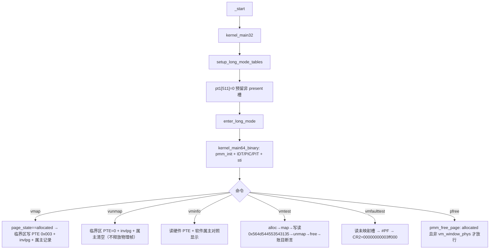

# Lesson 15: 受控单槽动态页映射（vmap / vunmap） — 精讲文档

> **课程主线位置**：操作系统内核第三阶段「内存管理」的第 2 课（内存管理 → 虚拟内存）。
> **前置课程**：[Lesson 14: bitmap 物理页管理器](../lesson-14-stable/README.md)
> **后续课程**：[Lesson 16: 双映射高半区运行时别名](../lesson-16-stable/README.md)
> **一句话目标**：学会在既有 4 MiB identity 映射之外，用 PMM 分配的物理帧动态映射/解除映射
> 一个受控的 4 KiB 虚拟槽（VA `0x3ff000`），并正确处理 PTE 写入与 `invlpg` TLB 失效。

## 1. 课程定位（Mission）

- **一句话目标**：学完本课你能——通过 `vmap <hex>` 把一个 PMM 已分配（`allocated`）的物理帧映射到
  唯一虚拟槽 `0x003ff000`，用 `vunmap` 解除映射，用 `vminfo` 观察槽状态/属主/PTE，
  并让 `vmtest` 端到端验证「分配→映射→写读→解除→释放」全程的 PMM 账目一致。
- **在课程主线中的位置**：属于「内存管理」阶段第 2 课，也是「虚拟内存」的启蒙课。第 14 课把
  物理页管理正式化；本课在其上第一次**写页表做动态映射**。刻意只开放一个 4 KiB 槽（单槽受控），
  不引入通用 VM 分配器——为 Lesson 16 的高半区双别名提供最小可行的映射基础设施。
- **前置知识清单**：
  1. 第 9 课的四级页表（PML4/PDPT/PD/PT）结构与 PTE 位（present=bit0、writable=bit1，`0x003`）。
  2. 第 14 课的 PMM：`page_state` 五态、`pmm_alloc`/`pmm_free_page` 语义与统计不变量。
  3. `long_mode_handoff` 交接块：`pt1` 是 PT1 页的**物理地址**，64 位续体据此定位 PTE。
  4. RFLAGS 第 9 位 = IF；`cli`/`sti` 与 `pushfq`/`popq`。
- **本课交付（可见结果）**：四个新命令 `vmap <hex>`、`vunmap`、`vminfo`、`vmtest`、`vmfaulttest`；
  `vminfo` 显示 `state: unmapped/mapped`、属主物理地址与原始 PTE；`vmtest` 打印
  `vmtest: map/write/read/unmap/free passed`；`vmfaulttest` 在单独 QEMU 会话中触发 #PF，
  CR2 为 `00000000003ff000`。

## 2. 核心概念精讲

### 2.1 为什么是「一个受控单槽」

**定义**：本课虚拟内存能力被刻意约束为：全局唯一一个 4 KiB 虚拟槽
`DYNAMIC_TEST_VA = 0x003ff000`（对应 `PT1[511]`），同一时刻至多映射一个物理帧，
由全局 `vm_window_phys` 记录当前属主物理地址（0 表示空槽）。

**为什么需要**：动态映射涉及 TLB 失效、状态同步、与 PMM 的交互三条正确性红线。先把范围压到单槽，
所有边界情况（重复映射、未映射即解除、映射中释放、未映射访问）都可穷举验证，避免一次引入
通用 VMA/页表分配带来的复杂性爆炸。这是典型的「教学脚手架」：Lesson 16 复用同一机制做双别名，
届时再放宽。

**为什么槽选 `0x3ff000`**：它是 identity 窗口（0~4 MiB）内的最后一个 4 KiB 页：
PML4[0] → PDPT[0] → PD[1] → PT1[511]。PT1 恰好是引导段建立的一张现存页表，只需把它的第 511 项
预留为非 present（引导时写 `pt1[PAGE_ENTRIES-1]=0`），64 位续体就能通过交接块的 `pt1` 物理地址
直接读写这个 PTE，**不需要任何编译期内核虚拟地址假设**。

### 2.2 PTE 的写入与 TLB 失效（invlpg）

**定义**：页表项（PTE）在 x86-64 中是一个 64 位值：低 12 位是属性位，高 52 位是物理地址。
本课用 `p | PTE_PRESENT_WRITABLE`（`0x003` = present + writable）构造映射；`*pte = 0` 解除映射。

**为什么需要 `invlpg`**：CPU 在分页模式下会把最近用到的页表项缓存进 TLB（转换后备缓冲）。
改了内存里的 PTE，**TLB 不会自动感知**；不清 TLB，旧映射可能继续生效（表现为
「vunmap 之后还能访问」或「读到旧帧」）。`invlpg <va>` 只作废指定虚拟地址的一条 TLB 项，
比 `mov cr3` 全刷新粒度更细。顺序必须严格：**先改 PTE、后 `invlpg`**。

### 2.3 IF 保持型临界区：irq_save64 / irq_restore64

**定义**：`map_page`/`unmap_page` 修改的是**全局页表**，IRQ0/IRQ1 中断随时可能触发；若在
「改 PTE」与「改 `vm_window_phys`」之间被中断插入，软件属主与硬件 PTE 就会脱节。

```c
static TEXT64 u64 irq_save64(void){u64 flags;__asm__ volatile("pushfq; popq %0; cli":"=r"(flags)::"memory");return flags;}
static TEXT64 void irq_restore64(u64 flags){if(flags&(1ULL<<9))__asm__ volatile("sti":::"memory");}
```

- `irq_save64`：`pushfq; popq` 读出 RFLAGS 存入返回变量，然后 `cli`。返回的 `flags` 保存了
  「进入临界区之前 IF 是开还是关」。
- `irq_restore64`：只有原 IF 为 1（`flags & (1ULL<<9)`）才 `sti`，否则保持关闭——**恢复现场而非
  无条件开中断**。这与第 12 课 `kbd_dequeue` 里无脑 `cli`/`sti` 的关键区别：`kbd_dequeue` 只在
  shell 上下文调用、IF 必为开；而本课工具要能被任意调用点复用，必须精确还原。
- 为什么比 `kbd_dequeue` 的临界区更短：`vminfo` 之类只是读 PTE，不构成状态变更，不需要关中断。

### 2.4 map_page / unmap_page：状态机与防悬挂映射

```c
static TEXT64 volatile u64 *vm_pte(struct long_mode_handoff*h){return &((volatile u64 *)(unsigned long)h->pt1)[DYNAMIC_PT1_INDEX];}
static TEXT64 const char *map_page(struct long_mode_handoff*h,u64 p){volatile u64*pte;u64 flags;const char*s=page_state(p);if(!eq64(s,"allocated"))return s;flags=irq_save64();pte=vm_pte(h);if(vm_window_phys||*pte){irq_restore64(flags);return "slot already mapped";}*pte=p|PTE_PRESENT_WRITABLE;invlpg64(DYNAMIC_TEST_VA);vm_window_phys=p;irq_restore64(flags);return "mapped";}
static TEXT64 const char *unmap_page(struct long_mode_handoff*h){volatile u64*pte;u64 flags;if(!vm_window_phys)return "slot already unmapped";flags=irq_save64();pte=vm_pte(h);*pte=0;invlpg64(DYNAMIC_TEST_VA);vm_window_phys=0;irq_restore64(flags);return "unmapped";}
```

**map_page 算法**：
1. 前置检查：`page_state(p)` 必须恰好是 `"allocated"`——PMM 还没分配、或已 fixed/reserved、
   或非法地址，一律原样返回该状态串作为拒绝原因。
2. 进入 IF 保存临界区。
3. 槽占用检查：`vm_window_phys || *pte`——软件属主**或**硬件 PTE 任一非空都算已映射
   （双保险，防止两处失同步），返回 `"slot already mapped"`。
4. 写 PTE `p|0x003` → `invlpg` → 记录 `vm_window_phys=p` → 恢复 IF → 返回 `"mapped"`。

**unmap_page 算法**：空槽直接返回 `"slot already unmapped"`；否则临界区内 `*pte=0` →
`invlpg` → `vm_window_phys=0` → 恢复 IF → 返回 `"unmapped"`。

**为什么 vunmap 不释放物理帧**：映射与物理所有权是两件事。`vunmap` 只解除虚拟到物理的映射；
帧的所有权仍在 PMM（`pmm_bitmap` 里该位仍是 allocated）。释放由调用者显式 `pfree <hex>` 完成，
对应「先解除、再归还」的纪律。反向约束由 `pmm_free_page` 兜底：

```c
static TEXT64 const char *pmm_free_page(u64 p){u32 i;const char*s=page_state(p);if(!eq64(s,"allocated"))return s;if(p==vm_window_phys)return "mapped";i=(u32)(p/PAGE_SIZE);unmark(i);pmm_free++;pmm_used--;return "freed";}
```

第 14 课的逻辑之上只加一行：`if(p==vm_window_phys)return "mapped";`——物理帧还挂在虚拟槽上时禁止
释放，从根上杜绝「悬空映射」（映射指向已归还、可能被重新分配给他处的物理页）。

### 2.5 vmtest：端到端自检脚本

`vmtest` 是教科书式的闭环测试：记录 `pmm_free` 初值 → `pmm_alloc` → `map_page` → 经槽写入固定
64 位模式 `0x564d544553543135`（ASCII 即 `"VM TEST 15"`）并读回比对 → `unmap_page` →
`pmm_free_page` → 断言 `pmm_free` 回到初值。任一环节失败打印对应原因，全过打印
`vmtest: map/write/read/unmap/free passed`。它同时验证了映射真实性（写槽能读回，说明 PTE 生效）
与账目可逆性（free 计数复原，说明不变量未破）。

## 3. 源码精讲

### 3.1 文件清单与职责

| 文件 | 职责 | 本课增量（相对 Lesson 14） |
|------|------|------------------------------|
| `kernel64.c` | 64 位内核续体 | **大**：新增 `DYNAMIC_TEST_VA`/`DYNAMIC_PT1_INDEX`/`PTE_PRESENT_WRITABLE` 常量、`vm_window_phys`、`irq_save64`/`irq_restore64`/`invlpg64`、`vm_pte`、`map_page`/`unmap_page`、`vminfo`、`vmtest`；`pmm_free_page` 加 `"mapped"` 保护；`exec64` 加五个 VM 命令 |
| `kernel.c` | 32 位引导 | **小**：`setup_long_mode_tables` 末尾加一行 `pt1[PAGE_ENTRIES-1]=0;`，把 VA `0x3ff000` 预置为非 present |
| `boot.S` | i386 入口、long mode 切换 | 未变化 |
| `kernel64.ld` | kernel64 链接脚本 | 未变化（`vm_window_phys` 零初始化全局靠 `.data`/`BYTE(0)` 物化） |
| `linker.ld` | 外层 ELF 布局 | 未变化 |
| `Makefile` | 构建/校验/运行 | 未变化 |
| `grub.cfg` | GRUB 菜单项 | 未变化（仍为第 14 课标题文本） |

### 3.2 kernel.c 精讲：预留槽位

```c
for(i=0;i<PAGE_ENTRIES;i++) { pt0[i]=((u64)i*PAGE_SIZE)|PTE_PRESENT_WRITABLE; pt1[i]=((u64)(i+PAGE_ENTRIES)*PAGE_SIZE)|PTE_PRESENT_WRITABLE; }
pt1[PAGE_ENTRIES-1]=0; /* VA 0x003ff000 begins non-present for Lesson 15. */
```

- 第 9 课的循环把 PT1 全部 512 项映射成 identity（`(i+512)*PAGE_SIZE`），覆盖 2 MiB~4 MiB。
- 本课唯一增量：循环后把 `pt1[511]` 清零。`PAGE_ENTRIES-1 = 511`，对应虚拟地址
  `(1*512 + 511)*0x1000 = 0x3ff000`（PD[1]→PT1 的第 511 项）。该页因此成为身份窗口中唯一的
  「未映射」页——正是 `vmfaulttest` 能触发 #PF、而 `vmap` 能接管的前提。
- 只动 PT1 不动 PT0/PT1 其他项，保证其余 3 MiB 身份映射不受影响；引导段不负责后续映射，
  具体 PTE 内容完全交给 64 位续体。

### 3.3 kernel64.c 精讲（本课新增部分）

#### 3.3.1 常量与槽状态

```c
#define DYNAMIC_TEST_VA 0x003ff000ULL
#define DYNAMIC_PT1_INDEX 511U
#define PTE_PRESENT_WRITABLE 0x003ULL
...
static u64 vm_window_phys;
```

- `DYNAMIC_TEST_VA`：唯一的动态映射虚拟地址，也出现在输出与 #PF 的 CR2 里。
- `DYNAMIC_PT1_INDEX`：该 VA 在 PT1 中的下标（51:39=0、38:30=0、29:21=1、20:12=511）。
- `PTE_PRESENT_WRITABLE = 0x003`：PTE 低 12 位的 present（bit0）+ writable（bit1）属性。
- `vm_window_phys`：软件侧的「当前映射的物理帧地址」，0 表示空槽。它是零初始化全局，
  依赖 `kernel64.ld` 物化进 `.data`（同第 14 课位图）。它的存在让命令层不必每次读硬件 PTE
  就能回答「有没有映射、映射到谁」。

#### 3.3.2 `vm_pte()`：经交接块物理地址定位 PTE

```c
static TEXT64 volatile u64 *vm_pte(struct long_mode_handoff*h){return &((volatile u64 *)(unsigned long)h->pt1)[DYNAMIC_PT1_INDEX];}
```

- 把交接块里的 `h->pt1`（PT1 页的物理地址，由第 9 课引导段写入）当数组基址，取第 511 项。
- 因为本课全程在 identity 映射下运行，物理地址 == 虚拟地址，直接解引用即可。
- `volatile` 保证对 PTE 的写不被编译器合并/重排（`map_page`/`unmap_page`/`vminfo` 三方共用）。
- 设计含义：**页表的位置不靠编译期符号，靠引导交接的物理地址**——这是后面高半区内核
  （Lesson 16 起）「运行时才知道内核位置」的预演。

#### 3.3.3 `map_page()` / `unmap_page()` 逐行

已在 2.4 节给出完整代码与算法。补充逐行注释：

```c
static TEXT64 const char *map_page(struct long_mode_handoff*h,u64 p){
    volatile u64*pte; u64 flags; const char*s=page_state(p);
    if(!eq64(s,"allocated")) return s;        /* 只允许映射 PMM 已分配帧，其余状态原样拒因 */
    flags=irq_save64();                       /* 保存 IF 并关中断 */
    pte=vm_pte(h);                            /* 定位 PT1[511] */
    if(vm_window_phys||*pte){ irq_restore64(flags); return "slot already mapped"; }
    *pte=p|PTE_PRESENT_WRITABLE;              /* 写 PTE：物理地址 + present + writable */
    invlpg64(DYNAMIC_TEST_VA);                /* 先改后刷：作废该 VA 的旧 TLB 项 */
    vm_window_phys=p;                         /* 同步软件属主 */
    irq_restore64(flags); return "mapped";
}
```

（函数在源码中为单行，此处按语义换行便于注释，字符与逻辑逐字对应。）

- 顺序敏感点：`*pte=` 与 `vm_window_phys=` 之间的 `invlpg` 不能被中断割裂，所以三者都在
  临界区内；`vm_window_phys` 作为「已映射」标志，又反过来被 `pmm_free_page` 依赖。
- 重复映射检查用「或」：任一来源显示占用即拒绝，宁可保守。

```c
static TEXT64 const char *unmap_page(struct long_mode_handoff*h){
    volatile u64*pte; u64 flags;
    if(!vm_window_phys) return "slot already unmapped";  /* 空槽拒绝（幂等保护） */
    flags=irq_save64(); pte=vm_pte(h);
    *pte=0;                                  /* PTE 清零 = 非 present */
    invlpg64(DYNAMIC_TEST_VA);               /* 清 TLB，防旧映射残留 */
    vm_window_phys=0;                        /* 软件属主清空 */
    irq_restore64(flags); return "unmapped";
}
```

#### 3.3.4 `vminfo()` 与命令接线

```c
static TEXT64 void vminfo(u16*c,struct long_mode_handoff*h){u64 pte=*vm_pte(h);text64(c,"VM slot: ");hex64(c,DYNAMIC_TEST_VA);text64(c,"\nstate:   ");text64(c,vm_window_phys?"mapped":"unmapped");text64(c,"\nowner:   ");hex64(c,vm_window_phys);text64(c,"\npte:     ");hex64(c,pte);putc64(c,'\n');}
```

- 直接读硬件 PTE 展示原始值（`hex64` 打满 16 位十六进制）；`state`/`owner` 来自软件镜像。
  两者对照即「硬件与软件是否同步」的肉眼检查。
- `exec64` 新增分支：`vmap <hex>` 走 `hexarg64` 后调 `map_page`，成功打
  `"mapped: <pa> at <va>"`、失败打 `"cannot map: <原因>"`；`vunmap` 直接打印返回串；
  `vminfo`/`vmtest`/`vmfaulttest` 为无参命令，多余 token 一律 `usage:`。
- `vmfaulttest` 读未映射的 `DYNAMIC_TEST_VA`：`p=*bad;` 触发 #PF，`exception_report` 显示
  CR2 = `00000000003ff000`（致命路径，须单独 QEMU 会话运行）。
- 既有 `pftest` 仍独立访问 `0x00400000`（身份窗口上界之外），CR2 必须保持 `0000000000400000`，
  两条 #PF 测试互不混淆。
- `pmm_free_page` 新增 `"mapped"` 拒因后，`pfree` 输出变成 `cannot free: mapped`，
  与 `pageinfo` 的 `allocated` 状态并存——「allocated 但挂着映射」是合法中间态。

### 3.4 构建管线

- 无新增编译标志与构建步骤；`readelf -lW build/kernel.elf` 可验证外层 ELF 的 LOAD 段不是 RWX
  （第 9 课 linker.ld 的 `ALIGN(MAXPAGESIZE)` 分离可写段的成果，本课继续遵守）。
- `kernel64.ld` 未变：`vm_window_phys` 与 PMM 位图一并落入 `.data` PROGBITS。

### 3.5 主控制流



## 4. 数据流与运行逻辑

1. **启动**：引导段建完四张页表后把 `pt1[511]` 清零（VA `0x3ff000` 非 present），交接块携带
   `pt1` 物理地址进入 64 位；`kernel_main64_binary` 先 `pmm_init` 再开设备与中断。
2. **映射**：`vmap <pa>` → `map_page` → 先验 `page_state(pa)=="allocated"` → 临界区内
   `PT1[511] = pa | 0x003` → `invlpg 0x3ff000` → `vm_window_phys=pa` → 屏幕
   `mapped: 0000000000XXXXXX at 00000000003ff000`。
3. **使用**：任何对 `0x3ff000` 的读写经页表落到 `pa`；`vmtest` 写入/读回
   `0x564d544553543135` 验证映射真实生效。
4. **解除与释放**：`vunmap` 仅清 PTE + 刷 TLB，`vm_window_phys` 归零；随后 `pfree <pa>` 才把帧
   归还 PMM。若顺序颠倒（先 pfree），`pmm_free_page` 报 `cannot free: mapped` 拦截。
5. **异常路径**：未映射时访问槽 → CPU 页故障 → IDT[14] `exception_pf` → CR2
   `00000000003ff000` → 致命 halt（单独会话）。

## 5. 构建、运行与验证

依赖与命令与第 13/14 课一致：

```bash
make clean && make -j"$(nproc)"   # 构建 kernel.iso
make check                        # grub-file 校验，打印 "Multiboot2 header check passed."
make run                          # QEMU，成功画面在图形窗口，勿加 -display none
```

静态验证（`build/kernel64.elf` 与 `build/kernel.elf`）：

```bash
readelf -rW build/kernel64.elf    # 期望：无续体重定位
readelf -SW build/kernel64.elf    # 期望：.data 为 PROGBITS（续体状态在原始二进制中）
readelf -lW build/kernel.elf      # 期望：外层 LOAD 段不含 RWX 组合
objdump -d -Mintel build/kernel64.elf  # 期望：出现 map_page、unmap_page 与 invlpg 指令；
                                     #       PT1[511] 初值为 0（非 present）
```

QEMU 验证（`make run`，等待 `tinyos>`，用 QEMU 监视器 `sendkey`）：

1. 运行 `vminfo`：`state:   unmapped` 且 `pte:     0000000000000000`。
2. 运行 `meminfo`、`palloc`，记下分配的 PA，运行 `vmap <PA>`：`vminfo` 显示相同 owner PA 与
   present+writable PTE（`pte` 低 12 位含 `003`）；`vmap` 前后 PMM 计数不变。
3. 映射状态下运行 `pfree <PA>`：报 `cannot free: mapped`。运行 `vunmap` 后再 `pfree <PA>`：成功。
4. 运行 `vmtest`：打印 `vmtest: map/write/read/unmap/free passed`，随后 `meminfo` 仍显示
   `invariant tracked = free + used: yes`。
5. 验证拒绝路径：未映射时 `vunmap`（`slot already unmapped`）、已映射时再次 `vmap`
   （`cannot map: slot already mapped`）、`vmap 1001`（`cannot map: invalid`）、`vmap 0`
   （`cannot map: fixed/reserved`）、`vmap 400000`（`cannot map: invalid`）、`vmap <PA> extra`
   与 `vminfo extra`（`usage:`）。
6. 单独 QEMU 会话运行 `vmfaulttest`：致命 #PF 报告 CR2 `00000000003ff000`；另一个会话运行
   `pftest`：CR2 仍为 `0000000000400000`。
7. 在相应会话回归 `tickinfo`、`kbdinfo`、`bptest`、`udtest`，确认 PIT、键盘 IRQ1、
   可恢复 #BP、致命 #UD 路径不受本课影响。

## 6. 调试地图

| 现象 | 原因 | 检查方法 |
|------|------|----------|
| `vminfo` 的 `state` 与 `pte` 不一致（如 state=mapped 但 pte=0） | 软件镜像 `vm_window_phys` 与硬件 PTE 未同步 | `map_page`/`unmap_page` 必须在同一临界区内同时改 `*pte` 与 `vm_window_phys`；顺序为写 PTE → invlpg → 改属主 |
| `vunmap` 后访问槽仍有效 | 改了 PTE 没刷 TLB，旧 TLB 项残留 | 确认 `unmap_page` 在 `*pte=0` 后调 `invlpg64(DYNAMIC_TEST_VA)`；顺序必须是先改后刷 |
| `pfree <PA>` 能释放正在映射的帧 | `pmm_free_page` 缺 `vm_window_phys` 检查 | 检查 `pmm_free_page` 是否有 `if(p==vm_window_phys)return "mapped";` |
| `vmtest` 报 `map failed` | 传入帧非 `allocated`（已 free 或 fixed）或槽被占 | 先 `palloc` 再 `vmap`；`vmtest` 前置要求空槽；`vminfo` 看 state |
| `vmtest` 报 `read/write mismatch` | 映射未真实生效（PTE 未落内存/没写对） | 检查 `*pte=p|PTE_PRESENT_WRITABLE` 是否写对槽；`vminfo` 看 pte 低 12 位应为 `003` |
| `vmtest` 报 `PMM accounting failed` | alloc/free 计数未复原 | 全程 only one alloc + one free；检查 `pmm_free_page` 同步 `pmm_free++/pmm_used--` |
| `vmap 0`/`vmap 100000` 被映射成功 | `page_state` 前置检查缺失 | `map_page` 第一行必须是 `page_state(p)` 判定；固定保留帧应返回 `fixed/reserved` |
| `vmfaulttest` 不触发 #PF 或 CR2 不是 `3ff000` | `pt1[511]` 未清零或 TLB 残留旧映射 | 引导段 `pt1[PAGE_ENTRIES-1]=0` 必须存在；`objdump` 核对；验证会话应重新启动 QEMU |
| shell 在 `vmap`/`vunmap` 后键盘/tick 失灵 | 临界区后没恢复 IF（IF 一直关着） | `irq_restore64` 只在 `flags&(1ULL<<9)` 时 `sti`；检查是否用无脑 `sti` 或忘调 restore |
| `pftest` 的 CR2 变了 | 与 VM 槽测试相互污染 | `pftest` 必须固定读 `0x00400000`，与 `DYNAMIC_TEST_VA`（`0x3ff000`）区分开 |

## 7. 与 Linux 源码对照

| 对照点 | TinyOS 教学模型 | Linux 实现 | 教学模型简化了什么 |
|--------|----------------|------------|--------------------|
| 动态映射 | `map_page` 直接写 `PT1[511] = p\|0x003` | `set_pte`/`mk_pte`（`arch/x86/include/asm/pgtable.h`），`remap_pfn_range`/`vmf_insert_page`（`mm/memory.c`） | 无权限/属性合并、无 COW、无 VMA 结构、无锁（单核单槽） |
| 解除映射 | `unmap_page` 清 PTE 不释放页 | `ptep_get_and_clear` + `zap_page_range`（`mm/memory.c`），映射页由 refcount 管理 | 无 `struct page` 引用计数；「先 vunmap 再 pfree」的两步纪律替代 refcount |
| TLB 失效 | 一条 `invlpg64` | `flush_tlb_page`/`__flush_tlb_one`（`arch/x86/mm/tlb.c`），配套 `mm->mmap_lock` 同步 | 单核、单地址空间，无需 IPI/broadcast TLB shootdown |
| 页表定位 | `vm_pte` 用交接块物理地址索引 | `pte_offset_map`（`include/linux/mm.h`）维护页表的虚拟映射 | 本课页表永远 identity 映射；Linux 要处理表页被换出/取消映射的情况 |
| 防悬挂映射 | `pmm_free_page` 检查 `vm_window_phys` | 页的 `_mapcount`（`mm/rmap.c`）；`try_to_unmap` 与 `put_page` 联动 | 无反向映射、无 mapcount 计数，只挡单个槽 |
| IF 临界区 | `irq_save64`/`irq_restore64` | `local_irq_save`/`local_irq_restore`（`include/linux/irqflags.h`） | 无 preemption count/softirq 嵌套，`cli` 即完全屏蔽 |
| 页故障 | `vmfaulttest` → 致命 #PF（不恢复） | `do_page_fault`（`arch/x86/mm/fault.c`）区分 major/minor、demand paging、COW、OOM | 无缺页处理逻辑——本课只演示「未映射会怎样」 |

权威来源：Intel SDM Vol.3A（4 级分页、PTE 位、`invlpg`、页故障与 CR2）、Intel SDM Vol.3B
（`invlpg` 与 TLB 一致性）。「先改 PTE 后刷 TLB」的顺序要求即来自 SDM 的 TLB 一致性模型。

## 8. 思考题与练习

1. **概念理解**：`map_page` 为什么用 `vm_window_phys || *pte` 而不是只查一项？什么情况下这两者
   会不一致？（提示：初始化时 `vm_window_phys` 必为 0，但 PTE 内容由引导段决定。）
2. **源码定位**：找出 `pmm_free_page` 中新增的 `"mapped"` 拒因，说明它如何把「先解除映射再释放」
   变成强制顺序；如果删除这行，`vmtest` 的哪个环节会失败？
3. **动手实验**：把 `unmap_page` 里的 `invlpg64(DYNAMIC_TEST_VA)` 注释掉，重新 `make run`：
   `vmap` 一个帧、写槽、`vunmap`、`pfree`、再 `vmap` **同一帧**并读槽——观察读到的内容，
   解释 TLB 残留如何让旧映射「复活」。
4. **动手实验**：把引导段的 `pt1[PAGE_ENTRIES-1]=0` 删掉，重新构建运行 `vminfo`，观察 pte 初值
   变成什么；再跑 `vmfaulttest`，解释为什么它不再触发预期的 #PF。
5. **Linux 对照**：Linux 为什么用页的引用计数（`_mapcount`）而不是「单槽属主」来防止释放被映射的页？
   如果要让本课支持「多槽任意映射」，`pmm_free_page` 的检查需要什么数据结构替代 `vm_window_phys`？

## 9. 本课小结与下一课预告

本课迈出了虚拟内存的第一步：在一个受控的 4 KiB 单槽上实现了动态映射与解除映射。我们学到：
引导段预留 `PT1[511]` 非 present 项、64 位续体凭交接块的物理地址定位 PTE（不靠编译期符号）、
写 `PTE = 物理地址 | 0x003` 构造 present+writable 映射、先改 PTE 后 `invlpg` 的 TLB 纪律、
用 `irq_save64`/`irq_restore64` 做 IF 保持型临界区保证「PTE 与软件属主」原子同步；
并让 `pmm_free_page` 拒绝释放挂在槽上的帧，从机制上杜绝悬空映射。`vmtest` 把整个闭环串起来
做端到端验证，`vmfaulttest` 则直观演示了未映射地址的 CR2 报告。

下一课（Lesson 16）将复用这套映射机制做**高半区双别名**：把内核同时映射到低地址（现有运行位置）
与高半区虚拟地址，让同一条代码在运行时拥有第二个虚拟身份——这是「高半区内核」与地址空间布局
分离的第一块基石。
