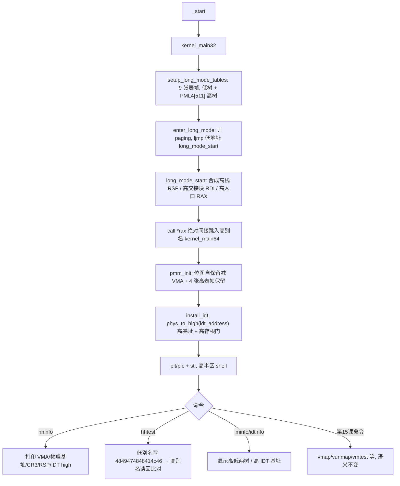

# Lesson 16: 双映射高半区内核（运行时别名） — 精讲文档

> **课程主线位置**：操作系统内核第三阶段「内存管理」的第 3 课（虚拟内存 → 地址空间布局）。
> **前置课程**：[Lesson 15: 受控单槽动态页映射](../lesson-15-stable/README.md)
> **后续课程**：[Lesson 17: 协作式线程调度](../lesson-17-stable/README.md)
> **一句话目标**：学会在保留低地址 identity 映射的同时，把整个 4 MiB 引导窗口双映射到高半区
> `0xffffffff80000000`，并让内核在运行时通过高半区别名切换栈、交接块与 IDT，实现「高半区内核」。

## 1. 课程定位（Mission）

- **一句话目标**：学完本课你能——让引导段在低映射之外再建一张独立的高半区页表树，boot.S 用
  **绝对间接转移**把执行流从低别名搬到高别名（`0xffffffff80000000` 起），64 位续体以高虚拟地址
  安装 IDT，并用 `hhinfo`/`hhtest` 直观验证「同一物理内存、两个虚拟身份」。
- **在课程主线中的位置**：属于「内存管理」阶段第 3 课。第 15 课学会了写 PTE 做单槽动态映射；
  本课把「写页表」升级为「整窗口双映射」，是真正的高半区内核（kernel virtual address）雏形，
  为 Lesson 17/18 的调度器运行在统一高地址内核空间做好准备。
- **前置知识清单**：
  1. 第 15 课的 PTE 构造（`p|0x003`）、`vm_pte` 经交接块定位页表、`invlpg`。
  2. 四级页表的索引划分：VA 的 47:39 / 38:30 / 29:21 / 20:12 四段对应 PML4/PDPT/PD/PT 下标。
  3. 规范地址规则：四级分页下位 47 是全地址符号位，`0xffffffff80000000` 因 bit47=1 而 canonical。
  4. 第 14 课的 `pmm_reserved` 保留清单机制（本课扩充）。
  5. `-fpie` + RIP 相对寻址：kernel64 裸续体是位置无关的，符号地址在运行时才被解析。
- **本课交付（可见结果）**：新增 `hhinfo`（显示 VMA/物理基址、高别名范围、CR3、当前 RSP、
  高 IDT 基址）与 `hhtest`（经低别名写、经高别名读同一字）；IDT 与 shell 全程运行在高半区。

## 2. 核心概念精讲

### 2.1 高半区内核与双映射（alias）

**定义**：同一物理页被两个虚拟地址同时映射，称为「别名」（alias）。本课把整个 4 MiB 引导窗口
（PA 0~0x3fffff）同时映射在低地址 `0x0000000000000000` 与高地址 `0xffffffff80000000`，
后者即 `KERNEL_VMA_BASE`。

**为什么需要高半区**：真实的操作系统把地址空间劈成「用户低半区 + 内核高半区」，内核永远驻留在
高半区，用户进程无论怎么切换地址空间都够不着内核。本课先做最朴素的一步：不引入用户态隔离，
只是让内核**住在高位**——`hhinfo` 里 `active RSP` 与 `IDT high` 都落在 `0xffffffff8...` 即证明
切换成功。低别名刻意保留，用于调试与兼容。

**地址布局**：

```text
KERNEL_VMA_BASE  = 0xffffffff80000000    高别名起点（canonical，bit47=1）
KERNEL_PHYS_BASE = 0x0000000000100000    内核物理装载基址（1 MiB）

低别名:  0000000000000000 - 00000000003fefff   → PA 0 - 0x3fefff（identity）
         00000000003ff000                      → 非 present（第 15 课 VM 槽）
高别名:  ffffffff80000000 - ffffffff803fffff   → PA 0 - 0x3fffff（4 MiB 全窗口）
```

### 2.2 两张独立页表树

低别名与高别名使用**两套独立的页表树**，拓扑显式区分：

```text
低树:  PML4[0]   -> LPDPT[0] -> LPD[0] -> LPT0          (PA 0 - 2 MiB)
                        LPD[1] -> LPT1          (PA 2 MiB - 4 MiB; LPT1[511] = VM 槽非 present)
高树:  PML4[511] -> HPDPT[510] -> HPD[0] -> HPT0       (PA 0 - 2 MiB)
                            HPD[1] -> HPT1       (PA 2 MiB - 4 MiB)
```

- `KERNEL_VMA_BASE` 的高 9 位（47:39）为 `0x1ff` = 511，所以高树从 **PML4[511]** 进入；
  再往下 9 位（38:30）= `0x1fe` = 510，故 **HPDPT[510]** 指向 HPD。
- 引导段因此要临时分配 **9 张**页表帧（低 5 + 高 4），全部经 `bootstrap_alloc_page` 分配、
  全部进交接块（`high_pdpt/high_pd/high_pt0/high_pt1`）并被 PMM 固化为 fixed 保留。
- 高树逐项复制低树的 PTE 内容（`hpt0[i]=i*PAGE_SIZE|0x003`、`hpt1[i]=(i+512)*PAGE_SIZE|0x003`），
  唯一差别是低树的 `pt1[511]=0` 槽位，高树该处照常 present——高别名覆盖完整 4 MiB。

### 2.3 绝对间接转移：低→高不是一次 rel32 call 能完成的

**问题**：`long_mode_start` 里那句「调用内核」从低地址跳到 `0xffffffff80000000 + offset`，
位移超过 ±2 GiB，`call rel32` 的 32 位相对位移无法跨越。boot.S 改用**绝对地址 + 间接调用**：

```asm
/* Low and high aliases are live.  Move stack, handoff, and control flow
 * to the high alias without a rel32 call that cannot span the boundary. */
.byte 0x48, 0xbc
.quad 0xffffffff80000000
.byte 0xb8
.long stack_top
.byte 0x48, 0x01, 0xc4, 0x48, 0x83, 0xe4, 0xf0, 0x48, 0x31, 0xed
...
.byte 0x48, 0xbf
.quad 0xffffffff80000000
.byte 0xb8
.long long_mode_handoff
.byte 0x48, 0x01, 0xc7
.byte 0x48, 0xb8
.quad 0xffffffff80000000
.byte 0xb9
.long kernel_main64
.byte 0x48, 0x01, 0xc8, 0xff, 0xd0
```

- `0x48 0xbc` + imm64 → `movabs` 把 `0xffffffff80000000` 装入 RSP；`0xb8` + imm32 把 32 位符号
  `stack_top` 装入 EAX（低地址，`< 4 MiB`）；`0x48 0x01 0xc4`（`add %rax,%rsp`）合成高栈顶；
  `and $-16,%rsp` 对齐、`xor %ebp,%ebp` 清帧指针。
- 交接块同样合成：`movabs imm64,%rdi` + `mov imm32,%eax` + `add %rax,%rdi` → RDI = 高地址交接块
  （SysV 第一参数约定不变）。
- 控制流合成：`movabs imm64,%rax`（高基址）+ `mov imm32,%ecx`（`kernel_main64` 低地址）+
  `add %rcx,%rax` → RAX = 高地址内核入口，`ff d0` = `call *%rax`（绝对间接调用）。
- **时机约束**：切换栈/交接块/控制流期间中断保持关闭（`_start` 起一直 `cli`），两条别名都在
  paging 开启状态下活着，地址相加在 64 位寄存器中完成，不存在半程不可寻址的危险区。

### 2.4 运行时地址语义：高别名下的符号地址

kernel64 续体是位置无关的（`-fpie`、链接于偏移 0、`objcopy` 成裸二进制再 `.incbin` 嵌入）。
它运行在哪个虚拟基址，RIP 相对取址（`leaq sym(%rip)`）就拿哪个基址的符号值。**进入高别名后，
`&symbol` 天然是 `0xffffffff80000000+offset`**。这带来两个连锁修正：

- `install_idt` 必须用 `phys_to_high(h->idt_address)` 作为 IDT 的虚拟基址（交接块里存的是物理
  地址），`lidt` 载入的才是高地址描述符表；中断门的目标（`runtime_*_address` 的 `leaq`）自动是
  高地址存根地址，异常/IRQ 返回后 RIP 仍落在高半区。
- `pmm_reserved` 里位图自保留的区间原来直接取 `(unsigned long)pmm_bitmap`；现在该值是高地址，
  必须**减 `KERNEL_VMA_BASE`** 还原成物理地址再参与 overlap 判断：

```c
static TEXT64 int pmm_reserved(struct long_mode_handoff*h,u64 p){u64 e=p+PAGE_SIZE,b=(u64)(unsigned long)pmm_bitmap-KERNEL_VMA_BASE,z=b+2*PMM_BITMAP_BYTES;...}
```

  同时保留清单追加了高树的 4 张页表帧（`high_pdpt/high_pd/high_pt0/high_pt1`）。

### 2.5 hhtest：双别名一致性实验

`hhtest` 是「同一物理存储、两个虚拟身份」的直接证据：取静态字 `hh_test_word` 的高地址
（`&hh_test_word`）与低地址（`&hh_test_word - KERNEL_VMA_BASE`），经低指针写入
`0x4849474848414c46`（ASCII `"FLAGHIGH"`），再经高指针读回比对——两者指向同一物理字节，
必然相等，打印 `hhtest: low/high aliases agree`。这是 Linux 等内核中「物理内存经多个虚拟映射可达」
这一事实的最小组件级演示。

## 3. 源码精讲

### 3.1 文件清单与职责

| 文件 | 职责 | 本课增量（相对 Lesson 15） |
|------|------|------------------------------|
| `kernel.c` | 32 位引导 | **大**：新增 `KERNEL_VMA_BASE`；交接块增加高树 4 字段与 `kernel_vma_base`/`kernel_phys_base`；页表帧从 5 张变 9 张，构建 PML4[511]/HPDPT[510]/HPD/HPT 高树 |
| `boot.S` | i386 入口、long mode 切换 | **中**：`long_mode_start` 改为「高基址+低符号」相加合成 RSP/RDI/RAX，`call *%rax` 绝对间接跳入高别名内核 |
| `kernel64.c` | 64 位内核续体 | **中**：`KERNEL_VMA_BASE`、`phys_to_high`、`hh_test_word`、`hhinfo`、`hhtest`；`install_idt`/`idtinfo` 用高 IDT 基址；`pmm_reserved` 减 VMA 并新增 4 张高表保留；`lminfo` 显示高低两树 |
| `kernel64.ld` | kernel64 链接脚本 | 未变化（`hh_test_word` 仍靠 `.data`/`BYTE(0)` 物化） |
| `linker.ld` | 外层 ELF 布局 | 未变化 |
| `Makefile` | 构建/校验/运行 | 未变化 |
| `grub.cfg` | GRUB 菜单项 | 微小变化：menuentry 标题改为 "TinyOS lesson 16: double-mapped higher-half kernel" |

### 3.2 kernel.c 精讲：九张表帧与高树装配

```c
#define KERNEL_VMA_BASE 0xffffffff80000000ULL
...
long_mode_handoff.high_pdpt=bootstrap_alloc_page(); long_mode_handoff.high_pd=bootstrap_alloc_page(); long_mode_handoff.high_pt0=bootstrap_alloc_page(); long_mode_handoff.high_pt1=bootstrap_alloc_page();
...
pml4[511]=long_mode_handoff.high_pdpt|PTE_PRESENT_WRITABLE; hpdpt[510]=long_mode_handoff.high_pd|PTE_PRESENT_WRITABLE; hpd[0]=long_mode_handoff.high_pt0|PTE_PRESENT_WRITABLE; hpd[1]=long_mode_handoff.high_pt1|PTE_PRESENT_WRITABLE;
for(i=0;i<PAGE_ENTRIES;i++) { pt0[i]=((u64)i*PAGE_SIZE)|PTE_PRESENT_WRITABLE; pt1[i]=((u64)(i+PAGE_ENTRIES)*PAGE_SIZE)|PTE_PRESENT_WRITABLE; hpt0[i]=((u64)i*PAGE_SIZE)|PTE_PRESENT_WRITABLE; hpt1[i]=((u64)(i+PAGE_ENTRIES)*PAGE_SIZE)|PTE_PRESENT_WRITABLE; }
pt1[PAGE_ENTRIES-1]=0; /* VA 0x003ff000 remains the low-only dynamic slot. */
```

- 9 张表帧与既有 5 张一样通过 `table_page_ok` 校验落在 1 MiB~4 MiB 身份窗口内，逐个 `zero_page`。
- 高树装配点：`pml4[511]`（VA 47:39=511）→ `high_pdpt`；`hpdpt[510]`（38:30=510）→ `high_pd`；
  `hpd[0]`/`hpd[1]` → `hpt0`/`hpt1`。四级全齐才能让 `0xffffffff80000000` 落下不 #PF。
- 高树 PTE 与低树逐项一致（同一物理页），唯一区别：低树 `pt1[511]=0`（保留给第 15 课 VM 槽），
  高树照常 present——高别名覆盖完整 4 MiB，物理页 `0x3ff000` 在高半区仍可达。
- 交接块填充 `kernel_vma_base=KERNEL_VMA_BASE`、`kernel_phys_base=0x00100000ULL`，
  `hhinfo` 直接打印这两个字段。

### 3.3 boot.S 精讲：低→高的绝对间接转移

已在 2.3 节逐字节解码。要点重申：

- **为什么合成而不是直接写死**：`stack_top`/`long_mode_handoff`/`kernel_main64` 是 32 位 ELF 的
  符号（低地址），代码在 64 位子模式下执行；用「imm64 高基址 + imm32 低符号 + add」两段式合成，
  既避开 rel32 够不着高地址的问题，又避免硬编码最终地址。
- **为什么是 `call *%rax` 而不是 `jmp`**：语义上内核入口是函数（返回后到 `1:` 处 `hlt`），
  `call` 正好压入返回地址；它同时证明转移是「绝对间接」的——RIP 一步跨入
  `0xffffffff80000000` 区间。
- 栈在 `call` 前已换成高别名（RSP=高栈顶、对齐、EBP 清零），`kernel_main64` 的局部变量、
  C 调用帧全部落在高半区栈上。

### 3.4 kernel64.c 精讲（本课新增部分）

#### 3.4.1 高地址换算与全局状态

```c
#define KERNEL_VMA_BASE 0xffffffff80000000ULL
...
static u64 hh_test_word;
static TEXT64 u64 phys_to_high(u64 p){return KERNEL_VMA_BASE+p;}
```

- `phys_to_high(p) = KERNEL_VMA_BASE + p`：物理地址 → 高虚拟地址。由于高别名是 4 MiB 窗口
  的严格偏移映射，物理地址直接加上基址即可，无需按页表层级换算。
- `hh_test_word`：`hhtest` 的共享测试字。它是静态全局，`&hh_test_word` 在运行时取到高地址；
  低别名版本是 `(u64)(unsigned long)&hh_test_word - KERNEL_VMA_BASE`。

#### 3.4.2 `install_idt()` / `idtinfo()` 的高 IDT

```c
static TEXT64 void install_idt(struct long_mode_handoff*h){struct idt_gate *idt=(struct idt_gate *)(unsigned long)phys_to_high(h->idt_address);...}
```

- 交接块的 `idt_address` 是 32 位引导分配的 IDT 后备页物理地址；内核此刻运行在高别名，
  `lidt` 的 base 必须是**高虚拟地址**，否则装载后 IDT 指向的 256 个门根本不可寻址。
- 门的目标地址 `runtime_bp_address()` 等由 `leaq sym(%rip)` 取得——执行在高半区，
  取到的是高地址存根，异常返回 RIP 自然回到高半区，全链路一致。
- `idtinfo` 打印的 `base:` 同样改为 `phys_to_high(h->idt_address)`。

#### 3.4.3 `hhinfo()` 与 `hhtest()`

```c
static TEXT64 void hhinfo(u16*c,struct long_mode_handoff*h){u64 cr3,rsp;__asm__ volatile("mov %%cr3,%0":"=r"(cr3));__asm__ volatile("mov %%rsp,%0":"=r"(rsp));text64(c,"higher-half kernel: enabled\nVMA base: ");hex64(c,h->kernel_vma_base);text64(c,"\nphysical base: ");hex64(c,h->kernel_phys_base);text64(c,"\nPML4[511], PDPT[510]\nhigh alias: ffffffff80000000 - ffffffff803fffff\nphysical:   0000000000000000 - 00000000003fffff\nCR3: ");hex64(c,cr3);text64(c,"\nactive RSP: ");hex64(c,rsp);text64(c,"\nIDT high: ");hex64(c,phys_to_high(h->idt_address));putc64(c,'\n');}
static TEXT64 void hhtest(u16*c){volatile u64 *low=(volatile u64 *)(unsigned long)((u64)(unsigned long)&hh_test_word-KERNEL_VMA_BASE);volatile u64 *high=&hh_test_word;*low=0x4849474848414c46ULL;if(*high==0x4849474848414c46ULL)text64(c,"hhtest: low/high aliases agree\n");else text64(c,"hhtest: alias mismatch\n");}
```

- `hhinfo` 用 `mov %cr3` 读当前 PML4 基址、`mov %rsp` 读活动栈；`active RSP` 落在
  `0xffffffff8...` 即证明「栈已切换高半区」；`IDT high` 证明描述符表也在高半区。首行
  `"higher-half kernel: enabled"` 与硬编码的 `high alias: ffffffff80000000 - ffffffff803fffff`
  与 `physical: 0000000000000000 - 00000000003fffff` 是验收格式串。
- `hhtest`：低指针写 `0x4849474848414c46`（小端字节序即 `"FLAGHIGH"`），高指针读回比对。
  `hh_test_word` 的存储（`.data`）在物理上只有一个副本，两个虚拟别名指向同一字节——
  读到同一值就证明双映射真实存在。

#### 3.4.4 PMM 保留清单适配

- `pmm_reserved` 相对第 15 课的变化：
  1. 位图自保留起点改为 `(unsigned long)pmm_bitmap - KERNEL_VMA_BASE`（还原物理地址）；
  2. 保留区间追加 `high_pdpt/high_pd/high_pt0/high_pt1` 四个 4 KiB 帧。
  若漏做第 1 项，`b` 会是高地址，overlap 全部判否，位图页可能被 `palloc` 分配出去；漏做第 2 项，
  高树表帧可能被分配走，破坏高别名。
- `lminfo` 扩展为同时列出低树（`pml4/pdpt/pd/pt0/pt1`）与高树（`high_pdpt/high_pd/high_pt0/
  high_pt1`）共 10 个地址，方便逐级核对。

### 3.5 构建管线

- 构建链不变；新增的静态检查是 `objdump -d -Mintel build/kernel.elf`：期望看到 `long_mode_start`
  中的 `movabs` + `add` + `call *%rax`（`ff d0`）序列与 `PML4[511]`/`PDPT[510]` 的装配；
  `readelf -rW build/kernel64.elf` 仍要求无重定位（高别名运行依赖纯 RIP 相对代码）。
- 外层 ELF 的 LOAD 段仍不得 RWX（`readelf -lW build/kernel.elf`）。

### 3.6 主控制流



## 4. 数据流与运行逻辑

1. **装配**：引导段 9 张页表帧（低 5 + 高 4）入交接块；`pml4[511]→hpdpt[510]→hpd[0/1]→
   hpt0/hpt1` 建立 4 MiB 高别名；`kernel_vma_base`/`kernel_phys_base` 入交接块。
2. **转移**：`enter_long_mode` 开 paging 后，`long_mode_start`（仍运行于低别名）逐项合成
   高地址栈/交接块/内核入口，`call *%rax` 一次性跨入 `0xffffffff80000000`。
3. **续体**：`kernel_main64_binary` 在高半区执行；`pmm_init` 用「符号高地址减 VMA」还原位图物理
   地址并保留 4 张高表；`install_idt` 用 `phys_to_high` 装载高 IDT；shell 与 IRQ 全部跑高地址。
4. **验证**：`hhinfo` 的 RSP/IDT 高地址证明切换；`hhtest` 写低读高证明物理共享；
   `meminfo` 的 `bitmap:` 现为高地址（减 VMA 即物理）；第 15 课的 VM 槽与 `pftest` 语义不变
   （低 `0x3ff000` 仍非 present、`0x400000` 仍越界）。
5. **异常**：`vmfaulttest` CR2 仍 `00000000003ff000`；`pftest` CR2 仍 `0000000000400000`；
   二者都在高半区报告，帧内容与低半区一致。

## 5. 构建、运行与验证

依赖与命令与前面各课一致：

```bash
make clean && make -j"$(nproc)"   # 构建 kernel.iso
make check                        # grub-file 校验，打印 "Multiboot2 header check passed."
make run                          # QEMU，成功画面在图形窗口，勿加 -display none
```

静态验证：

```bash
readelf -rW build/kernel64.elf    # 期望：无续体重定位、无未定义符号（高别名运行的前提）
readelf -SW build/kernel64.elf    # 期望：.data 为 PROGBITS（hh_test_word 等状态在原始二进制中）
readelf -lW build/kernel.elf      # 期望：外层 LOAD 段非 RWX
objdump -d -Mintel build/kernel.elf    # 期望：引导段分配 4 张高树帧、安装 PML4[511]/PDPT[510]；
                                      #       long_mode_start 含 movabs+add+call *%rax 绝对间接转移
objdump -d -Mintel build/kernel64.elf  # 期望：invlpg、PIC IRQ 存根、iretq 均在
```

QEMU 验证（`make run`，等待 `tinyos>`，用 QEMU 监视器 `sendkey`）：

1. 运行 `hhinfo`：报告 VMA base `ffffffff80000000`、4 MiB 高别名、高 `active RSP` 与 `IDT high`
   地址（均落在 `0xffffffff8...`）。
2. 运行 `hhtest`：打印 `hhtest: low/high aliases agree`。
3. 运行 `lminfo` 与 `meminfo`：低/高两树 10 个表地址可见，PMM `status:  ready`，
   `invariant tracked = free + used: yes`。
4. 回归第 15 课：`palloc`、`vmap <PA>`、映射态 `pfree` 拒绝（`cannot free: mapped`）、`vunmap`、
   `pfree <PA>`、`vmtest`（`vmtest: map/write/read/unmap/free passed`）。
5. 回归 `tickinfo`、`kbdinfo`、`bptest` 与普通命令输入。
6. 单独会话运行 `vmfaulttest`（致命 #PF，CR2 `00000000003ff000`）、`pftest`（致命 #PF，
   CR2 `0000000000400000`）、`udtest`（致命 #UD）。

## 6. 调试地图

| 现象 | 原因 | 检查方法 |
|------|------|----------|
| 进入 long mode 后立即 triple-fault | 高树缺链（PML4[511]/PDPT[510]/HPD/HPT 未接齐）或表帧非 present | 检查 `pml4[511]=high_pdpt|0x003`、`hpdpt[510]=high_pd|0x003`、`hpd[0/1]`；`objdump build/kernel.elf` 核对 |
| `hhinfo` 的 `active RSP` 仍是低地址 | boot.S 没合成高栈 | `long_mode_start` 必须 `movabs 高基址,%rsp` + `add 低符号,%rsp`；核对 `48 bc`/`48 01 c4` 字节序列 |
| `hhtest` 报 `alias mismatch` | 高低两树 PTE 内容不一致 | `hpt0[i]`/`hpt1[i]` 必须与 `pt0/pt1` 同值（`i*PAGE_SIZE`/`(i+512)*PAGE_SIZE`） |
| 中断/异常一触发就 #PF 或崩溃 | IDT 用低基址装载（`lidt` 指向不可寻址或低别名） | `install_idt` 必须 `phys_to_high(h->idt_address)`；`idtinfo` 的 `base:` 应为 `0xffffffff8...` |
| `palloc` 返回的帧与位图/高表重叠 | `pmm_reserved` 没减 VMA 或漏 4 张高表帧 | 检查 `b=(unsigned long)pmm_bitmap-KERNEL_VMA_BASE` 与 `high_pdpt/high_pd/high_pt0/high_pt1` 四项 |
| `meminfo` 的 `bitmap:` 落在低地址 | 显示用了物理换算而非符号值 | `bitmap:` 打印的是 `(unsigned long)pmm_bitmap`（运行期高地址），属预期；若想验证物理值需减 VMA |
| 内核入口跳错（hlt 在 `1:` 或死循环） | `call *%rax` 的 RAX 合成错 | `movabs 高基址,%rax` + `mov kernel_main64,%ecx` + `add %rcx,%rax` 三步缺一不可，最后 `ff d0` |
| `vmtest`/`vminfo` 行为异常 | 第 15 课槽位被高树改动 | `pt1[511]=0` 必须保留；高树 `hpt1[511]` present 不影响低槽（两个不同 PTE） |
| `bptest` 后 RIP 落在低地址 | 中断门目标地址用的是低存根 | `runtime_*_address` 的 `leaq` 必须发生在高半区执行后，取到的才是高地址存根 |

## 7. 与 Linux 源码对照

| 对照点 | TinyOS 教学模型 | Linux 实现 | 教学模型简化了什么 |
|--------|----------------|------------|--------------------|
| 高半区基址 | `KERNEL_VMA_BASE = 0xffffffff80000000` | `__START_KERNEL_map = 0xffffffff80000000`（`arch/x86/include/asm/page_64_types.h`） | Linux 另有 `PAGE_OFFSET` 直映射区（`0xffff888000000000`）与 vmalloc/固定映射区，本课只有一个 4 MiB 别名 |
| 低→高转移 | boot.S `movabs+add` 合成地址，`call *%rax` | `arch/x86/kernel/head_64.S` 的 `startup_64`：`leaq _text(%rip),%rbp` 后再 `addq` 高基址、重载栈与 IDT | 无 KASLR（随机化偏移）、无 `secondary_startup_64`、无 EFI/AP 处理器入口 |
| 物理↔虚拟换算 | `phys_to_high(p)=KERNEL_VMA_BASE+p`；`&sym-KERNEL_VMA_BASE` 还原物理 | `__va()`/`__phys_addr`（`arch/x86/include/asm/page.h`）；内核文本区用 `__START_KERNEL_map` 偏移 | 恒等偏移、4 MiB 窗口，无页表逐级换算、无保护段属性差异 |
| 双映射（alias） | 低树与高树两套独立表同时活着 | Linux 启动早期同时保留 identity map（EFI/头页）与内核映射，`init_top_pgt` 阶段后低映射被 `cleanup_highmap` 清理 | 本课低别名**永久保留**，不做清理与权限剥离 |
| 高地址 IDT | `install_idt` 用 `phys_to_high` 基址 | `arch/x86/kernel/idt.c` 的 `idt_setup_early_pf`/`idt_table`，运行于内核映射 | 无 per-CPU IDT、无 IST 栈切换 |
| 保留页清单 | `pmm_reserved` 手写 overlap 列表 | `memblock_reserve`/`reserve_real_mode`（`arch/x86/kernel/setup.c`） | 无 memblock 树，保留集硬编码 |

权威来源：Intel SDM Vol.3A（规范地址、PML4 高半区索引、4 级分页）、Intel SDM Vol.3B
（`call *r/m64` 绝对间接调用）、Multiboot2 规范（外层 ELF32 约束——这也是为什么转移必须
在 64 位子模式下手工合成高地址）。

## 8. 思考题与练习

1. **概念理解**：为什么高别名从 `PML4[511]` 进入，而低别名从 `PML4[0]` 进入？0xffffffff80000000
   的 47:39 位段为何是 511？提示：把它换算成 9 位无符号数。
2. **源码定位**：找出 boot.S 中「合成高地址」的三段 `movabs+add` 序列，说明为什么 `call rel32`
   无法完成这次跳转（位移范围是多少？）。如果 kernel64 被链接到 `0xffffffff80000000`（而不是 0），
   这份 boot.S 还需要合成地址吗？
3. **动手实验**：把 `install_idt` 的 `phys_to_high(h->idt_address)` 改回 `h->idt_address`
  （低 IDT），重新 `make run` 运行 `bptest`，观察会发生什么，解释原因。
4. **动手实验**：在 `pmm_reserved` 中删掉 `-KERNEL_VMA_BASE`，反复 `palloc` 多次，用
   `pageinfo` 观察位图自身所在页是否会被分配，并用 `meminfo` 验证 `invariant` 是否仍为 `yes`。
5. **Linux 对照**：Linux 为什么在启动后期移除低 identity 映射（`cleanup_highmap`）而本课保留？
   若要移除低别名，boot.S 的转移顺序要做哪些调整才能保证「切换前低映射还活着」？

## 9. 本课小结与下一课预告

本课完成了「高半区内核」的最小实现：引导段多分配 4 张表帧，从 `PML4[511]→HPDPT[510]→HPD→
HPT` 建立 4 MiB 高别名；boot.S 用 `movabs+add` 三段式合成高地址栈/交接块/入口，以 `call *%rax`
绝对间接跳入高半区；64 位续体运行在高地址后，`install_idt` 用 `phys_to_high` 装载高 IDT，
`pmm_reserved` 用「符号地址减 VMA」还原位图物理位置并新增 4 张高表保留。`hhinfo` 的 RSP/IDT
地址与 `hhtest` 的写低读高，分别从「运行位置」与「物理共享」两个角度证明了双映射成立。
贯穿始终的教训：位置无关代码的符号地址是**运行时随基址变化**的，任何把符号地址当物理地址用的
代码（PMM 自保留）都必须显式换算。

下一课（Lesson 17）将进入「进程/线程」阶段：在内核栈上保存与恢复 CPU 上下文，用 TCB 组织线程，
实现**协作式调度**——手动 `yield` 切换线程，为 Lesson 18 用 PIT 抢占式调度打好上下文切换基础。
