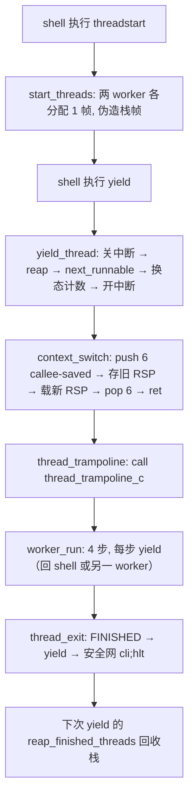

# Lesson 17: 协作式线程调度（TCB 与上下文切换） — 精讲文档

> **课程主线位置**：操作系统内核第四阶段「进程与调度」的第 1 课（CPU 多路复用）。
> **前置课程**：[Lesson 16: 双映射高半区内核](../lesson-16-stable/README.md)
> **后续课程**：[Lesson 18: PIT 抢占式调度](../lesson-18-stable/README.md)
> **一句话目标**：学会用 TCB（线程控制块）+ `context_switch` 汇编原语实现协作式 round-robin 调度——
> 仅在普通内核代码调用 `yield` 时切换线程，IRQ0/IRQ1 绝不参与选线程。

## 1. 课程定位（Mission）

- **一句话目标**：学完本课你能——定义三线程模型（shell + 两个确定性 worker），为每个 worker 分配
  独立的 4 KiB PMM 栈帧，用 `context_switch` 在保存/恢复「被调用者保存寄存器 + RSP」后切换执行流，
  并通过 `threadstart`/`yield`/`ps`/`threadinfo` 观察进度推进与栈回收。
- **在课程主线中的位置**：属于「进程与调度」阶段第 1 课，是操作系统「CPU 虚拟化」的核心启蒙。
  前 16 课建立的内存/映射/中断体系全部为本课服务；本课用**协作式**（不抢占）把「多线程」
  概念最小化落地，Lesson 18 再在 IRQ 返回边界上加 PIT 抢占。
- **前置知识清单**：
  1. SysV x86_64 调用约定：被调用者保存寄存器 = RBX/RBP/R12~R15；`call`/`ret` 的栈行为；
     函数入口 RSP ≡ 8 (mod 16)。
  2. 第 14 课的 `pmm_alloc`/`pmm_free_page` 与统计不变量；第 16 课的 `phys_to_high` 高别名换算。
  3. 第 16 课的 `irq_save64`/`irq_restore64`（IF 保持临界区）。
  4. 裸二进制内核中汇编符号如何被 C 声明为 `extern` 并调用（第 12~16 课模式）。
- **本课交付（可见结果）**：四个新命令；`threadstart` 一次性创建两个 worker（失败则一个也不建）；
  `yield` 轮流切换；`ps` 列出每个线程的状态/栈/切换次数/进度；`threadinfo` 显示调度器全局状态并
  明确 `IRQ0 schedules: no`。

## 2. 核心概念精讲

### 2.1 协作式调度：切换时机由代码自己决定

**定义**：协作式（cooperative）调度下，CPU 只有在线程主动调用 `yield` 时才可能换人；一个不主动
让出 CPU 的线程可以无限期独占。与之相对的是抢占式（preemptive，Lesson 18）：由定时器中断强制
在任意指令边界换人。

**为什么先学协作式**：抢占式要求「中断任意时刻打断 → 保存现场 → 换人 → 恢复现场」，正确性难度
高得多（嵌套、重入、原子性）。协作式把切换时机收敛到一个可控点 `yield`，能先把「上下文切换本身」
——保存/恢复寄存器、换栈、恢复执行——彻底讲透。

**本课的纪律**：`irq0_record` 仍是 `ticks++ + EOI`，`irq1_record` 仍是键盘入队 + EOI，
**两个 IRQ 处理函数都不碰调度器状态**。`threadinfo` 专门打印 `IRQ0 schedules: no` 来强调这一点。

### 2.2 TCB：线程的最小档案

```c
enum thread_state { THREAD_EMPTY, THREAD_RUNNING, THREAD_RUNNABLE, THREAD_FINISHED };
struct thread { u64 rsp,stack_phys,switches,progress; u8 state,id; };
static struct thread threads[THREAD_COUNT];
static u8 current_thread,round_robin,threads_started;
static u64 thread_switches;
```

- 固定 `THREAD_COUNT = 3` 个 TCB：`threads[0]` 是 shell，`threads[1]`/`threads[2]` 是两个 worker。
- 每个 TCB 保存：`rsp`（该线程被切走时的栈指针，即「复活点」）、`stack_phys`（worker 栈的物理帧；
  shell 为 0）、`switches`（被切入次数）、`progress`（worker 已完成的步骤数）、`state`/`id`。
- 四态语义：`THREAD_EMPTY`（槽位空闲）、`THREAD_RUNNING`（当前正在 CPU 上）、`THREAD_RUNNABLE`
  （就绪排队）、`THREAD_FINISHED`（已跑完，等待回收栈）。
- 全局量：`current_thread`（当前线程 id）、`round_robin`（下一轮扫描起点，环形指针）、
  `threads_started`（是否已创建）、`thread_switches`（累计切换次数）。
- **为什么 RSP 就能代表整个线程的「未来」**：协作式切换只发生在 `yield` 调用内部，此刻线程的
  局部状态全部在栈上（callee-saved 寄存器是唯一的非栈状态）。只要保存这些寄存器 + RSP，
  未来切回来 `ret` 即可精确回到 `context_switch` 返回点。

### 2.3 context_switch：最小上下文切换原语

```asm
".global context_switch\ncontext_switch:\n"
"pushq %rbx\npushq %rbp\npushq %r12\npushq %r13\npushq %r14\npushq %r15\n"
"movq %rsp,(%rdi)\nmovq %rsi,%rsp\n"
"popq %r15\npopq %r14\npopq %r13\npopq %r12\npopq %rbp\npopq %rbx\nret\n"
```

C 侧声明 `extern void context_switch(u64 *old_rsp,u64 new_rsp);`，按 SysV 传入：
RDI = `&threads[old].rsp`，RSI = `threads[next].rsp`。

- **保存**：push 6 个 callee-saved 寄存器（RBX/RBP/R12~R15）。volatile 寄存器（RAX/RCX/RDX/RSI/
  RDI/R8~R11）由 C 调用约定保证切回时恢复，无需保存——因为切回点是在 `context_switch` 内部，
  编译器会为 `yield_thread` 在调用点前保存好它需要的 volatile 寄存器。
- **换栈**：`movq %rsp,(%rdi)` 把当前（已压 6 个寄存器的）RSP 存入旧 TCB；`movq %rsi,%rsp`
  载入新 TCB 保存的 RSP。注意新栈上**已经预置了**一份「别人保存的 6 个寄存器」，所以——
- **恢复**：逆序 pop 6 个寄存器，`ret` 从新栈弹回调用 `context_switch` 的地址（对老线程）
  或弹回合成栈帧里的目标地址（对首次运行的新线程），两路汇合到「yield_thread 的返回点继续跑」。
- **这是教科书式的最小切换**：无中断帧、无 CR3 换页（所有线程共享同一高半区页表）、无浮点上下文。

### 2.4 线程栈的构造：合成 callee-saved 帧 + trampoline

新线程没有历史栈帧，`start_threads` 必须伪造一份「将来会被 context_switch 恢复」的栈：

```c
sp=(u64 *)(unsigned long)(phys_to_high(p)+THREAD_STACK_BYTES);sp-=7;sp[0]=sp[1]=sp[2]=sp[3]=sp[4]=sp[5]=0;sp[6]=runtime_thread_trampoline_address();threads[i].rsp=(u64)(unsigned long)sp;
```

- 栈顶 = `phys_to_high(p) + 0x1000`（高半区别名下的物理帧顶，第 16 课高别名已映射全部 4 MiB，
  无需新增页表、不占低 VM 槽）。
- `sp -= 7` 预留 7 个 u64：低 6 个是 context_switch 将 pop 的 6 个「假 callee-saved 寄存器」，
  `sp[6]` 是 `ret` 的目标——`thread_trampoline`。
- 首次切入时：context_switch `movq %rsi,%rsp` 指向 sp → pop 6 个 0 → `ret` 弹 `sp[6]`
  进入 trampoline，RSP 恰好停在 16 字节对齐的栈顶——满足 SysV「call 前 RSP ≡ 0 (mod 16)」，
  之后 `call thread_trampoline_c` 产生标准入口状态。

```asm
".global thread_trampoline\nthread_trampoline:\ncall thread_trampoline_c\n1: cli\nhlt\njmp 1b\n"
```

```c
TEXT64 void thread_trampoline_c(void){u8 id=current_thread;__asm__ volatile("sti":::"memory");worker_run(id);thread_exit();}
```

trampoline 进入 C（`sti` 保证 IF 打开），跑完 `worker_run` 后 `thread_exit` 永久退场；
`cli; hlt` 是永不触达的安全网（FINISHED 线程不会被再次选中）。

### 2.5 状态机：worker 的生命周期

```text
EMPTY ──threadstart──► RUNNABLE（两个 worker 原子创建）
RUNNABLE ──被 next_runnable 选中──► RUNNING ──yield──► RUNNABLE（让出）
RUNNING ──跑完 4 步──► FINISHED ──下次 yield 的 reap──► 栈回收、回 EMPTY 槽
```

- `worker_run(id)`：`while(progress<THREAD_STEPS){progress++; yield_thread();}`——每步 yield 一次，
  round-robin 行为可观察，且调度决策不进入中断上下文。
- `thread_exit`：置 `FINISHED` → `yield_thread`（此时该线程不会被再选）→ 安全网 hlt。
- `reap_finished_threads`：每次 `yield_thread` 开头清扫 `state==FINISHED` 且非当前的 worker，
  归还其 `stack_phys` 给 PMM 并清零字段——`meminfo` 的 free 计数因此回到 threadstart 前。

### 2.6 round-robin 选人：next_runnable

```c
static TEXT64 u8 next_runnable(void){u32 n;for(n=1;n<=THREAD_COUNT;n++){u8 i=(u8)((round_robin+n)%THREAD_COUNT);if(threads[i].state==THREAD_RUNNABLE||threads[i].state==THREAD_RUNNING){round_robin=i;return i;}}return current_thread;}
```

- 从 `round_robin+1` 起环形扫描 3 个槽，找第一个 `RUNNABLE`/`RUNNING`，记录为新的扫描起点；
  扫一圈没有可运行线程就返回 `current_thread`（保持现状，切换不发生）。
- 为什么包含 `RUNNING`：当前线程自己也是候选（此时它的 state 已在 yield 开头被降为 RUNNABLE，
  只有「无可切换对象」时 next 会等于自己）。`yield_thread` 用 `next==old` 短路跳过切换。
- 计数：选中后 `threads[next].switches++`、`thread_switches++`；`ps`/`threadinfo` 据此展示。

## 3. 源码精讲

### 3.1 文件清单与职责

| 文件 | 职责 | 本课增量（相对 Lesson 16） |
|------|------|------------------------------|
| `kernel64.c` | 64 位内核续体 | **大**：线程模型（TCB/状态机/选人/回收/栈构造）、`context_switch` 与 `thread_trampoline` 汇编、`threadstart`/`yield`/`ps`/`threadinfo` 命令、`pmm_free_page` 加 `"thread stack"` 拒因 |
| `kernel.c` | 32 位引导 | 未变化 |
| `boot.S` | 入口与 high-alias 转移 | 未变化 |
| `kernel64.ld` | kernel64 链接脚本 | 未变化（`threads[]` 等零初始化全局靠 `.data`/`BYTE(0)` 物化） |
| `linker.ld` | 外层 ELF 布局 | 未变化 |
| `Makefile` | 构建/校验/运行 | 未变化（静态验证新增 `nm -u` 查未定义符号） |
| `grub.cfg` | GRUB 菜单项 | 微小变化：menuentry 标题改为 "TinyOS lesson 17: cooperative threads" |

### 3.2 kernel64.c 精讲（本课新增部分）

#### 3.2.1 常量、TCB 与调度全局量

```c
#define THREAD_COUNT 3
#define THREAD_STACK_BYTES PAGE_SIZE
#define THREAD_STEPS 4
...
extern void context_switch(u64 *old_rsp,u64 new_rsp); extern void thread_trampoline(void);
```

- `THREAD_COUNT = 3`：0=shell、1/2=worker，固定槽位数组（教学简化，无动态 TCB 分配）。
- `THREAD_STACK_BYTES = PAGE_SIZE`：每个 worker 栈恰好一个 4 KiB 物理帧（高别名下自动可寻址）。
- `THREAD_STEPS = 4`：worker 的确定性步数，让进度可数、round-robin 可观察。
- `extern` 声明接住 `__asm__` 块里 `.global` 的两个汇编符号（第 12 课起的既有模式）。

#### 3.2.2 `start_threads()`：原子创建

```c
static TEXT64 int start_threads(void){u32 i;if(threads_started)return 0;if(!pmm_ready)return -1;for(i=1;i<THREAD_COUNT;i++){u64 p=pmm_alloc(),*sp;if(!p){while(i>1){i--;(void)pmm_free_page(threads[i].stack_phys);threads[i].state=THREAD_EMPTY;threads[i].stack_phys=0;}return -1;}threads[i].id=(u8)i;threads[i].state=THREAD_RUNNABLE;threads[i].stack_phys=p;threads[i].switches=threads[i].progress=0;sp=(u64 *)(unsigned long)(phys_to_high(p)+THREAD_STACK_BYTES);sp-=7;sp[0]=sp[1]=sp[2]=sp[3]=sp[4]=sp[5]=0;sp[6]=runtime_thread_trampoline_address();threads[i].rsp=(u64)(unsigned long)sp;}threads_started=1;return 1;}
```

- 返回值三态：`1` 成功、`0` 已启动过、`-1` 创建失败；`exec64` 据此打印三种消息。
- **原子性**：第二个 worker 的 `pmm_alloc` 若失败，回滚第一个 worker（`while(i>1)` 反向释放栈、
  复位为 `EMPTY`），保证「要么两个都建、要么一个都不建」——符合旧 README 承诺的
  「fails without partial creation」。
- 栈帧构造见 2.4 节：`phys_to_high(p)+THREAD_STACK_BYTES` 为高别名栈顶，`sp-=7` 后填
  6 个零 + trampoline 运行时地址。`runtime_thread_trampoline_address` 用 `leaq` 取 RIP 相对地址
  （高别名执行时自然得到高地址，与第 16 课 `install_idt` 同一原理）。

#### 3.2.3 `yield_thread()`：切换的主控

```c
static TEXT64 void yield_thread(void){u64 flags=irq_save64();u8 old,next;reap_finished_threads();old=current_thread;next=next_runnable();if(next==old){irq_restore64(flags);return;}if(threads[old].state==THREAD_RUNNING)threads[old].state=THREAD_RUNNABLE;threads[next].state=THREAD_RUNNING;current_thread=next;threads[next].switches++;thread_switches++;irq_restore64(flags);context_switch(&threads[old].rsp,threads[next].rsp);}
```

1. `irq_save64` 关中断进入临界区——**状态变更必须在 IF 关闭下进行**，避免 IRQ 在
   「改 state / 改 current_thread」之间插入造成脏状态。
2. `reap_finished_threads`：先回收已完成 worker 的栈（见 2.5）。
3. `next_runnable` 选下一个；`next==old` 则无可切换对象，恢复 IF 后直接返回（空转 yield）。
4. 状态迁移：旧线程 `RUNNING→RUNNABLE`（仅当它确实是 RUNNING），新线程 `→RUNNING`，
   `current_thread` 指向新线程，两个切换计数自增。
5. `irq_restore64` **恢复 IF 之后**再 `context_switch`——新线程切入时 IF 与调用者一致。
6. `context_switch` 保存旧 RSP、载入新 RSP；未来某次切回此处时 `ret` 让该线程继续。

#### 3.2.4 `pmm_free_page` 的线程栈保护

```c
static TEXT64 int thread_stack_owned(u64 p){u32 i;for(i=1;i<THREAD_COUNT;i++)if(threads[i].state!=THREAD_EMPTY&&threads[i].state!=THREAD_FINISHED&&threads[i].stack_phys==p)return 1;return 0;}
static TEXT64 const char *pmm_free_page(u64 p){u32 i;const char*s=page_state(p);if(!eq64(s,"allocated"))return s;if(p==vm_window_phys)return "mapped";if(thread_stack_owned(p))return "thread stack";i=(u32)(p/PAGE_SIZE);unmark(i);pmm_free++;pmm_used--;return "freed";}
```

- `thread_stack_owned` 遍历 worker 槽，凡 `state` 介于 `EMPTY` 与 `FINISHED` 之外（即还在
  RUNNABLE/RUNNING）且 `stack_phys==p` 的帧，视为线程栈。
- `pmm_free_page` 在既有 `"mapped"` 拒因之后新增 `if(thread_stack_owned(p))return "thread stack";`
  ——正在运行的线程栈绝不能被 `pfree` 释放（与第 15 课的「防悬挂映射」同构，防「悬挂线程栈」）。
- 回收只发生在调度器自己的 `reap_finished_threads` 里（先置 FINISHED、清 `stack_phys` 后释放），
  路径单一、杜绝误放。

#### 3.2.5 `ps` / `threadinfo`

```c
static TEXT64 void ps64(u16*c){u32 i;text64(c,"threads: id state stack-pa stack-high switches progress\n");for(i=0;i<THREAD_COUNT;i++){text64(c,"thread ");hex64(c,i);text64(c," ");text64(c,thread_state_name(threads[i].state));text64(c," ");hex64(c,threads[i].stack_phys);text64(c," ");hex64(c,threads[i].stack_phys?phys_to_high(threads[i].stack_phys):0);text64(c," ");hex64(c,threads[i].switches);text64(c," ");hex64(c,threads[i].progress);putc64(c,'\n');}}
static TEXT64 void threadinfo(u16*c){text64(c,"scheduler: cooperative round-robin\ncurrent: ");hex64(c,current_thread);text64(c,"\nnext scan: ");hex64(c,round_robin);text64(c,"\nstarted: ");text64(c,threads_started?"yes":"no");text64(c,"\nswitches: ");hex64(c,thread_switches);text64(c,"\nworker steps: ");hex64(c,threads[1].progress);text64(c," ");hex64(c,threads[2].progress);text64(c,"\nIRQ0 schedules: no\n");}
```

- `ps64`：表头 `threads: id state stack-pa stack-high switches progress`，每行 `thread <id> <state>
  <stack_pa> <stack_high> <switches> <progress>`；`stack_high` 为空槽时打 0。
- `thread_state_name` 把枚举映射为 `"running"`/`"runnable"`/`"finished"`/`"empty"` 字面串。
- `threadinfo`：调度器性质、当前线程、扫描起点、启动标志、总切换次数、两 worker 进度、
  以及本课纪律声明 `IRQ0 schedules: no`。
- `exec64` 接线：`threadstart` 三态输出 `threadstart: two workers ready; use yield` /
  `threadstart: already started` / `threadstart: PMM allocation failed`；`yield` 命令调
  `yield_thread()` 后打印 `yield: returned to shell`（worker 跑完让回后才执行到）。
- `kernel_main64_binary` 新增初始化：`threads[0].id=0; threads[0].state=THREAD_RUNNING;`
  ——shell 在 pmm_init 后立即登记为线程 0（RUNNING），此后其 RSP 由 context_switch 接管。
- 注意一个源码细节：`breakpoint_report`/`exception_report` 里的横幅串仍写的是
  `"TinyOS lesson 16 ..."`（本课未改这两处文本），验证/文档中须按源码逐字引用。

### 3.3 构建管线

- 构建链不变。静态验证在既有 `readelf -rW`/`readelf -SW` 之外**新增 `nm -u build/kernel64.elf`**：
  裸续体不应有未定义符号（`context_switch`/`thread_trampoline` 等汇编符号由本文件 `.global` 提供，
  `thread_trampoline_c` 由 C 提供，符号表必须闭合）。
- `objdump -d -Mintel build/kernel64.elf` 应能看到 `context_switch` 的 6 个 push/pop 与 `ret`、
  `thread_trampoline` 的 `call` 序列、以及保留的 `invlpg` 与 IRQ `iretq`。

### 3.4 主控制流



## 4. 数据流与运行逻辑

1. **创建**：`threadstart` → `start_threads` → 两个 `pmm_alloc`（各占一个 4 KiB 帧，`meminfo` 的
   free 减 2）→ 高别名栈帧伪造 → `threads_started=1`。
2. **切换**：`yield` → `yield_thread` →（回收）→ `next_runnable` 环形选人 → 换态 + 计数 →
   `context_switch` 交换 RSP。worker 每跑一步 yield 一次，因此「shell→w1→w2→shell→…」每轮三人
   各推进一格，`ps` 的 switches/progress 同步增长。
3. **退场**：worker 第 4 步后 `worker_run` 返回 → `thread_exit` 置 `FINISHED` → yield 换人 →
   下一次 yield 的 reap 阶段释放其栈帧（free 计数回涨）。
4. **回归**：IRQ0/IRQ1 处理函数与第 16 课逐字相同（不碰调度器）；`hhinfo`/`hhtest`/`vmtest`/
   `bptest` 等全部保留。

## 5. 构建、运行与验证

依赖与命令与前面各课一致：

```bash
make clean && make -j"$(nproc)"   # 构建 kernel.iso
make check                        # grub-file 校验，打印 "Multiboot2 header check passed."
make run                          # QEMU，成功画面在图形窗口，勿加 -display none
```

静态验证：

```bash
readelf -rW build/kernel64.elf    # 期望：无续体重定位
nm -u build/kernel64.elf          # 期望：无未定义符号（汇编与 C 符号闭合）
readelf -SW build/kernel64.elf    # 期望：.data 为 PROGBITS（TCB 数组等状态在原始二进制中）
objdump -d -Mintel build/kernel64.elf  # 期望：context_switch、保留的 invlpg、IRQ iretq
readelf -lW build/kernel.elf      # 期望：外层 LOAD 段非 RWX
```

QEMU 验证（`make run`，等待 `tinyos>`，用 QEMU 监视器 `sendkey`）：

1. 运行 `meminfo` 记录初始 free 计数。
2. 运行 `threadstart`（打印 `threadstart: two workers ready; use yield`），再运行 `ps`：
   线程 1、2 为 `runnable`，各有不同的 `stack-pa` 与对应的高别名 `stack-high`。
3. 反复运行 `yield`：`threadinfo` 显示 `switches` 与 `worker steps` 递增，且始终打印
   `IRQ0 schedules: no`；`yield` 命令每次都在 worker 让回后打印 `yield: returned to shell`。
4. 多次 yield 后运行 `ps`：两个 worker 均为 `finished`，`stack-pa` 归零；`meminfo` 的 free 计数
   回到第 1 步的初值（栈帧已回收）。
5. 回归 `hhinfo`、`hhtest`、`vmtest`、`tickinfo`（每秒 +100）、`kbdinfo`、`bptest`。
6. 单独会话运行 `vmfaulttest`（CR2 `00000000003ff000`）、`pftest`（CR2 `0000000000400000`）、
   `udtest`（致命 #UD）——结果与第 15/16 课一致。

## 6. 调试地图

| 现象 | 原因 | 检查方法 |
|------|------|----------|
| 首次 `yield` 后 #PF/崩溃 | 合成栈帧尺寸或 trampoline 地址错 | `start_threads` 必须 `sp-=7`、`sp[0..5]=0`、`sp[6]=runtime_thread_trampoline_address()`；首次切入后 RSP 应落在 16 对齐栈顶 |
| `ps` 显示 progress 不动 / 线程卡死 | `next_runnable` 选不到人，或 state 未正确迁移 | 检查 `RUNNABLE/RUNNING` 判定与 `yield_thread` 的 `RUNNING→RUNNABLE` 迁移；`threadinfo` 看 current/next scan |
| worker 永不退场（progress 停在 4） | `worker_run` 循环条件或 `thread_exit` 没执行 | `worker_run` 是 `while(progress<THREAD_STEPS)`；`thread_exit` 先置 `FINISHED` 再 yield |
| 栈帧不回收，free 计数不回来 | `reap_finished_threads` 条件不对 | 回收条件：`state==FINISHED` 且 `i!=current_thread` 且 `stack_phys` 非零；回收后必须清 `stack_phys` |
| `pfree <worker 栈>` 能释放 | 缺线程栈保护 | `pmm_free_page` 必须有 `if(thread_stack_owned(p))return "thread stack";` |
| 重复 `threadstart` 又创建 | `threads_started` 门失效 | `start_threads` 开头 `if(threads_started)return 0;` |
| 切换后 IF 关闭，shell 无响应 | 换态在开 IF 后进行，或恢复 IF 逻辑错 | `yield_thread` 必须 `irq_restore64` 之后才 `context_switch`；`irq_restore64` 只在原 IF=1 时 sti |
| `yield` 后打印两遍提示或乱序 | shell 的 yield 与 worker 让回路径混淆 | `exec64` 的 `yield` 分支在 `yield_thread()` 返回后才打印 `yield: returned to shell`——多线程下这是预期输出 |
| 栈被两个 worker 共用 | `stack_phys` 分配重复 | `start_threads` 循环内逐次 `pmm_alloc`；失败回滚用 `while(i>1)` 且复位 `EMPTY`/`stack_phys=0` |
| worker 里 `current_thread` 错 | trampoline 读 `current_thread` 时机错 | `thread_trampoline_c` 在进入时读 `current_thread`；`context_switch` 前必须已把 `current_thread` 设为目标线程 |

## 7. 与 Linux 源码对照

| 对照点 | TinyOS 教学模型 | Linux 实现 | 教学模型简化了什么 |
|--------|----------------|------------|--------------------|
| TCB | `struct thread`（rsp/stack_phys/switches/progress/state/id），固定 3 槽数组 | `task_struct`（`include/linux/sched.h`），含 `thread_struct`（`arch/x86/include/asm/processor.h`，保存 FS/GS/FPU 等） | 无内核栈页、无 PID 命名空间、无信号/锁/文件描述符等海量字段 |
| 上下文切换 | `context_switch` 汇编：6 个 callee-saved 寄存器 + RSP | `switch_to` 宏 + `__switch_to`（`arch/x86/kernel/process_64.c`）；保存 callee-saved、GS、内核 CR3、FPU | 无 FPU/AVX、无 `struct thread_struct`、无地址空间切换（所有线程共享页表） |
| 线程栈构造 | 合成 6 零 + trampoline 地址，首次切入进 `thread_trampoline` | `copy_thread`（`arch/x86/kernel/process.c`）伪造栈帧，首次调度进入 `ret_from_fork` | 无 `copy_thread_tls`、无 vfork 语义、无内核栈 vmalloc 池 |
| 就绪队列/选人 | 固定 3 槽数组 + `next_runnable` 环形扫描 | CFS 红黑树（`kernel/sched/fair.c`）、`pick_next_task`；RT 用 `SCHED_RR` 时间片 | 无虚拟运行时间 vruntime、无优先级、无负载均衡 |
| 主动让出 | `yield_thread` + `yield` 命令 | `sched_yield` 系统调用 → `do_sched_yield`/`yield_task_fair` | 无系统调用/用户态，直接在 shell 命令里调用 |
| 线程退出与回收 | `thread_exit` 置 FINISHED，`reap_finished_threads` 收栈 | `do_exit`（`kernel/exit.c`）→ `release_task` 由父进程/wait 回收 | 无僵尸态保留、无父子关系、无 `wait()` |
| 线程栈防释放 | `thread_stack_owned` 检查 | 内核栈属于内核资源，随 task 生命周期由 `free_thread_stack` 回收 | 无引用计数，靠状态位判断 |

权威来源：SysV x86-64 ABI（callee-saved 寄存器清单、栈对齐规则）、Intel SDM Vol.1（寄存器保存约定）、
Linux `arch/x86/kernel/process.c`（`copy_thread` 的栈帧伪造与 `ret_from_fork` 是同一思想的参考）。

## 8. 思考题与练习

1. **概念理解**：为什么 `context_switch` 只需要保存 callee-saved 寄存器（RBX/RBP/R12~R15）而不需要
   保存 RAX/RCX 等？如果 `yield_thread` 在 `context_switch` 之后还要用某个 volatile 寄存器，它靠什么保证值正确？
2. **源码定位**：在 `start_threads` 中找出合成栈帧的代码，解释 `sp-=7`、`sp[0..5]=0`、
   `sp[6]=runtime_thread_trampoline_address()` 三者与 `context_switch` 的 6 push + ret 的对应关系。
3. **动手实验**：把 `THREAD_STEPS` 从 4 改成 2，重新构建运行，观察 `ps` 中 progress 停在几、
   线程在何时进入 `finished`；再把 `THREAD_COUNT` 改成 4（注意数组与 `next_runnable` 的模运算），
   解释需要改哪些地方。
4. **动手实验**：删掉 `pmm_free_page` 里的 `thread_stack_owned` 检查，`threadstart` 后执行
   `pfree <worker 栈地址>` 再 `yield`，观察系统行为，解释「悬挂线程栈」如何导致崩溃。
5. **Linux 对照**：Linux 的 `ret_from_fork` 与本课的 `thread_trampoline` 扮演的角色有什么异同？
   为什么新线程首次进入时都要经过一个「trampoline」而不是直接跳 worker 函数？

## 9. 本课小结与下一课预告

本课建立了操作系统的第一个「多线程」：用固定 3 槽 TCB 数组描述线程（rsp/状态/栈/进度/切换数），
用 `context_switch` 汇编原语交换「6 个 callee-saved 寄存器 + RSP」，用合成栈帧让新线程首次切入时
精确进入 `thread_trampoline` 再落到 C。调度只在 `yield` 调用点发生（协作式），IRQ0/IRQ1 仍只做
`ticks++`/键盘入队，`threadinfo` 以 `IRQ0 schedules: no` 明示这一点。状态机
（RUNNABLE→RUNNING→FINISHED→回收）、round-robin 环形选人、以及 `pmm_free_page` 对线程栈的
`"thread stack"` 保护，共同构成一个正确、可观察、可验证的协作式调度器。

下一课（Lesson 18）将做最后一步质变：让 PIT 定时器中断在 **IRQ 返回边界**检查调度器，
把协作式升级为**抢占式**——线程无需主动 yield，时间片一到就被自动切走。
