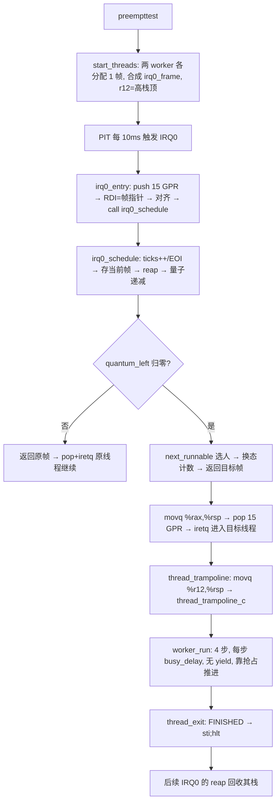

# Lesson 18: PIT 抢占式调度（IRQ0 返回帧切换） — 精讲文档

> **课程主线位置**：操作系统内核第四阶段「进程与调度」的第 2 课（协作式 → 抢占式），也是本阶段收官课。
> **前置课程**：[Lesson 17: 协作式线程调度](../lesson-17-stable/README.md)
> **后续课程**：本课之后进入系统调用的新阶段（课程主线在 Lesson 18 之后衔接下一组课程）。
> **一句话目标**：学会让 PIT 定时器中断在 **IRQ0 返回边界**完成抢占——线程不再主动 `yield`，
> 时间片一到（`TIME_SLICE_TICKS=2` 个 tick）就被自动切走，并以「保存/恢复完整 IRQ0 返回帧」的方式
> 保证任何指令点被中断都能精确恢复。

> 本课原 README 标注为 **stable snapshot（已验证、只读）**；本精讲文档保留其全部验证记录。

## 1. 课程定位（Mission）

- **一句话目标**：学完本课你能——把第 17 课的「`ret` 返回式协作切换」换成「IRQ0 中断帧调度」：
  处理器在任意指令点被 PIT 中断后，`irq0_entry` 保存全部 GPR 与硬件返回状态，C 侧 `irq0_schedule`
  在时间片耗尽时选出下一线程并**原样返回该线程的帧指针**，汇编用唯一一条 `iretq` 完成换人。
- **在课程主线中的位置**：属于「进程与调度」阶段的收官课。第 17 课的 TCB/状态机/选人全部复用，
  本课的质变在于**切换触发点**从「代码主动调用」移到「中断返回边界」——这是真实操作系统抢占式
  调度的最小实现，也为后续系统调用/用户态课程提供了「任意时刻可换人」的内核能力。
- **前置知识清单**：
  1. 第 17 课：TCB 数组、四态状态机、`next_runnable` 环形选人、`thread_stack_owned` 栈保护。
  2. 中断帧知识：同特权级（CPL0→CPL0）中断，CPU 只压栈 `RIP/CS/RFLAGS`（无 `SS/RSP`）；
     `iretq` 只恢复这三者，RSP 由「帧所在栈」隐含。
  3. 第 13 课 IRQ0 的「全 GPR 保存 + EOI + iretq」存根（本课改造它）。
  4. SysV x86_64 调用约定与栈对齐（第 17 课已用）。
- **本课交付（可见结果）**：`preempttest` 一次性创建两个**不 yield** 的 worker（`threadstart` 为其
  别名）；不执行任何 `yield`，仅靠 PIT 时间片推进，`threadinfo` 显示 `IRQ0 schedules: yes` 且两个
  worker 的进度计数自动增长到 4 后结束，`meminfo` 计数回涨。

## 2. 核心概念精讲

### 2.1 抢占式 vs 协作式：切换触发点

**定义**：抢占式调度允许系统在**任意指令边界**（本课为每次 PIT IRQ0 返回点）剥夺当前线程的 CPU。
线程无需、也无法决定何时被切走；它可能在任何指令之间被冻结、稍后原样恢复。

**为什么必须用「帧」而不是「yield 内的 context_switch」**：第 17 课的 `context_switch` 只能在
`yield_thread` 栈帧内换人——它依赖「被切换的代码恰好停在同一个函数调用中」。抢占式下线程可能
停在任意函数任意指令上，唯一完备的现场就是**CPU 中断压栈 + 我们主动压栈**的完整返回帧：
15 个 GPR（汇编保存）+ `RIP/CS/RFLAGS`（CPU 保存）。保存这份帧 = 冻结现场；恢复另一份帧 =
精确复活另一线程。

### 2.2 IRQ0 返回帧 ABI（irq0_frame）

```c
/* IRQ0 only, CPL0 frame: assembly pushes GPRs then CPU provides rip/cs/rflags. */
struct irq0_frame { u64 r15,r14,r13,r12,r11,r10,r9,r8,rdi,rsi,rbp,rdx,rcx,rbx,rax,rip,cs,rflags; };
```

```text
lowest address / struct irq0_frame
  r15 r14 r13 r12 r11 r10 r9 r8 rdi rsi rbp rdx rcx rbx rax
  rip cs rflags
highest address
```

- 帧的低 15 个字段是 `irq0_entry` 用 15 条 `pushq` 保存的 GPR（先压 RAX、后压 R15，因此 R15 在
  最低地址、RAX 其次），高 3 个字段 `rip/cs/rflags` 由 CPU 在中断入口自动压栈。
- CPL0 只有三字段返回状态：同特权级 `iretq` 弹回 `RIP/CS/RFLAGS`，**不弹回 `RSP/SS`**——被中断
  线程的栈指针由「帧指针 + 弹帧长度」隐含（帧就在该线程自己的栈上）。这是本课「帧即现场」的关键。
- `struct thread` 的字段 `rsp` 因此改名为 `frame`：TCB 保存的不再是函数返回栈指针，而是完整中断帧指针。

### 2.3 irq0_entry 汇编：保存 → 调度 → 换帧 → 唯一 iretq

```asm
".global irq0_entry\nirq0_entry:\n"
"pushq %rax\npushq %rbx\npushq %rcx\npushq %rdx\npushq %rbp\npushq %rsi\npushq %rdi\npushq %r8\npushq %r9\npushq %r10\npushq %r11\npushq %r12\npushq %r13\npushq %r14\npushq %r15\n"
"cld\nmovq %rsp,%rdi\nandq $-16,%rsp\nsubq $8,%rsp\ncall irq0_schedule\nmovq %rax,%rsp\n"
"popq %r15\npopq %r14\npopq %r13\npopq %r12\npopq %r11\npopq %r10\npopq %r9\npopq %r8\npopq %rdi\npopq %rsi\npopq %rbp\npopq %rdx\npopq %rcx\npopq %rbx\npopq %rax\niretq\n"
```

- 与第 13 课 IRQ0 存根相同的 15 个 push；之后不再调用「计数+EOI 小函数」，而是：
  1. `movq %rsp,%rdi`：**先把帧指针放进 RDI**（C 第一参数），因为下面就要改 RSP；
  2. `andq $-16,%rsp; subq $8,%rsp`：把栈对齐到 16 字节供 C 调用（`subq $8` 配合 push/ret 的
     8 字节栈行为，使 `irq0_schedule` 入口处于 SysV 约定的对齐态）；
  3. `call irq0_schedule`：调度函数返回 `%rax` = **要恢复的帧指针**（量子未耗尽时就是刚保存的
     `f` 本身，相当于「回到被中断线程」）；
  4. `movq %rax,%rsp`：换栈到目标帧；
  5. 逆序 pop 15 个 GPR，`iretq` 弹回目标线程的 `RIP/CS/RFLAGS`——全存根**只有一条 iretq**，
     无论切到谁都在这里返回。
- 注意它**不再调用第 17 课的 `context_switch`**：切换完全由帧指针交换表达。

### 2.4 irq0_schedule：量子、选人、换帧

```c
/* Called from IRQ0 only. It returns the exact frame restored by IRQ0's one iretq path. */
TEXT64 struct irq0_frame *irq0_schedule(struct irq0_frame *f){u8 old,next;ticks++;outb64(PIC1_COMMAND,PIC_EOI);threads[current_thread].frame=(u64)(unsigned long)f;reap_finished_threads();if(!threads_started)return f;if(quantum_left)quantum_left--;if(quantum_left)return f;old=current_thread;next=next_runnable();quantum_left=TIME_SLICE_TICKS;if(next==old)return f;if(threads[old].state==THREAD_RUNNING)threads[old].state=THREAD_RUNNABLE;threads[next].state=THREAD_RUNNING;current_thread=next;threads[next].switches++;preempt_switches++;return (struct irq0_frame *)(unsigned long)threads[next].frame;}
```

逐段：
1. **会计与 EOI**：`ticks++`（时间语义与第 13 课一致），立即向主片写 EOI，避免挂起后续中断。
2. **保存现场**：`threads[current_thread].frame=f`——无论是否切换，先冻结当前线程的返回帧。
3. **回收**：`reap_finished_threads()` 释放已 FINISHED worker 的栈（此刻当前帧是别人的栈，
   `i!=current_thread` 保证不释放正在使用的栈）。
4. **未启动短路**：`!threads_started` 直接返回 `f`（shell 自己），调度器在 `preempttest` 前不动作。
5. **量子递减**：`if(quantum_left) quantum_left--; if(quantum_left) return f;`——时间片还剩下时
   不切换，原帧返回。`TIME_SLICE_TICKS=2` 意味着一个线程连续占 2 个 tick（约 20 ms）。
6. **量子耗尽切换**：`next=next_runnable()`（第 17 课同款环形选人）；重置
   `quantum_left=TIME_SLICE_TICKS`；`next==old`（只剩自己）则原帧返回；否则状态迁移
   （old RUNNING→RUNNABLE、next →RUNNING、`current_thread=next`、两个计数自增）。
7. **返回新帧**：`return (struct irq0_frame *)(unsigned long)threads[next].frame;`——汇编据此换栈。

### 2.5 首次运行帧：合成 irq0_frame + r12 种子

新 worker 没有任何运行历史，`start_threads` 伪造一份完整 `irq0_frame`：

```c
f=(struct irq0_frame *)(unsigned long)(phys_to_high(p)+THREAD_STACK_BYTES-sizeof(*f));f->r15=f->r14=f->r13=f->r11=f->r10=f->r9=f->r8=f->rdi=f->rsi=f->rbp=f->rdx=f->rcx=f->rbx=f->rax=0;f->r12=phys_to_high(p)+THREAD_STACK_BYTES;f->rip=runtime_thread_trampoline_address();f->cs=0x08;f->rflags=0x202;threads[i].frame=(u64)(unsigned long)f;
```

- 帧放在高别名栈顶之下 `sizeof(*f)` 处；15 个 GPR 全 0，唯独 `r12 = 高栈顶`——这是给
  trampoline 的**栈种子**。
- `rip = thread_trampoline`、`cs=0x08`、`rflags=0x202`（bit9=IF 置位，bit1 保留位为 1）。
- 首次被切到时：`iretq` 直接跳到 trampoline，此时 RSP 正好位于高栈顶；trampoline 再
  `movq %r12,%rsp` 显式取种子设定栈：

```asm
".global thread_trampoline\nthread_trampoline:\nmovq %r12,%rsp\ncall thread_trampoline_c\n1: cli\nhlt\njmp 1b\n"
```

  之后 worker 的正常运行 `rsp` 由每次 PIT 中断帧的「所在栈」自然保持，无需再种。
- 第 17 课是「6 零 + 返回地址」的合成 callee-saved 帧；本课是「15 GPR + 3 硬件字段」的合成
  中断帧——两代切换机制的对应物。

### 2.6 非主动 worker 与确定性验证

```c
static TEXT64 void busy_delay(void){volatile u64 n;for(n=0;n<BUSY_SPINS;n++)__asm__ volatile("":::"memory");}
static TEXT64 void worker_run(u8 id){while(threads[id].progress<THREAD_STEPS){threads[id].progress++;busy_delay();}thread_exit();}
static TEXT64 void thread_exit(void){threads[current_thread].state=THREAD_FINISHED;for(;;)__asm__ volatile("sti; hlt");}
```

- worker **从不调用 `yield`**：每步只是 `progress++` + `busy_delay`（400 万次带 `"memory"` 约束的
  空转，保证不被编译器优化掉）。它们能推进到 4 并结束，**唯一可能的原因就是 PIT 抢占**——这正是
  `preempttest` 名称的含义。
- `thread_exit`：置 `FINISHED` 后 `sti; hlt` 永久挂起。FINISHED 线程不会被 `next_runnable`
  选中，其帧/栈随后由 `irq0_schedule` 里的 reap 回收；回收时另一个线程的栈正在使用，故不会
  在运行中的 `rsp` 底下释放活动栈。

## 3. 源码精讲

### 3.1 文件清单与职责

| 文件 | 职责 | 本课增量（相对 Lesson 17） |
|------|------|------------------------------|
| `kernel64.c` | 64 位内核续体 | **大**：`irq0_frame` 帧 ABI；`irq0_schedule` 取代 `irq0_record`；`struct thread` 的 `rsp`→`frame`；`quantum_left`/`preempt_switches`；`busy_delay`；合成中断帧的 `start_threads`；`thread_trampoline` 改 `movq %r12,%rsp`；`irq0_entry` 改「换帧 + 唯一 iretq」；删除 `context_switch`/`yield_thread` |
| `kernel.c` | 32 位引导 | 未变化 |
| `boot.S` | 入口与 high-alias 转移 | 未变化 |
| `kernel64.ld` | kernel64 链接脚本 | 未变化 |
| `linker.ld` | 外层 ELF 布局 | 未变化 |
| `Makefile` | 构建/校验/运行 | 未变化 |
| `grub.cfg` | GRUB 菜单项 | 微小变化：menuentry 标题改为 "TinyOS lesson 18: PIT preemptive scheduler" |

### 3.2 kernel64.c 精讲（本课新增/变更部分）

#### 3.2.1 新常量与 TCB 字段变更

```c
#define TIME_SLICE_TICKS 2
#define BUSY_SPINS 4000000ULL
...
struct thread { u64 frame,stack_phys,switches,progress; u8 state,id; };
static u64 preempt_switches,quantum_left;
```

- `TIME_SLICE_TICKS = 2`：量子 = 2 个 IRQ0 tick ≈ 20 ms；worker 4 步 × busy_delay 足够跨越多个
  量子，保证每步都被抢占过。
- `BUSY_SPINS = 4000000`：worker 每步的忙等长度，使单步运行时间大于一个量子、又足够短可交互。
- `struct thread` 首字段由 `rsp` 改为 `frame`：语义从「栈指针」升级为「IRQ0 返回帧指针」。
- `preempt_switches`（抢占切换总次数，替代 `thread_switches`）与 `quantum_left`（当前线程剩余量子）。

#### 3.2.2 `irq0_schedule()` 逐段精讲

见 2.4 节完整代码。要点补充：

- **为什么 EOI 放在最前**：`irq0_schedule` 全程可能做 reap（`pmm_free_page`）等较长路径，
  尽早 EOI 可避免 8259 挂起期间漏掉 IRQ1 键盘。
- **为什么先存帧再判量子**：无论切不切，被中断线程的现场都必须落袋，否则「量子未耗尽返回原帧」
  也会丢失现场信息。
- **帧指针是纯地址量**：切换 = 换一个指针，不复制任何栈内容——线程栈各自独立，帧互不重叠。
- **`reap_finished_threads` 复用第 17 课实现**，但调用方从 `yield_thread` 变成 IRQ0 上下文；
  由于它只释放「非当前」且 FINISHED 的栈，在中断上下文同样安全。

#### 3.2.3 `start_threads()`：合成首次运行帧

见 2.5 节代码。要点：

- 整体在 `irq_save64`/`irq_restore64` 临界区内完成（原子创建两个 worker；失败回滚并还原 IF）。
- 与第 17 课的差异：(a) 栈顶减 `sizeof(*f)` 布置完整中断帧而非 7 个 u64；(b) `r12` 承担栈种子
  （新栈没有历史 RSP，`iretq` 之后由 trampoline 从 r12 取栈）；(c) `rip/cs/rflags` 是硬件返回字段，
  不再是 `sp[6]` 的返回地址。
- 帧里 `rflags=0x202`：IF=1 使 worker 第一次进入就能被后续 PIT 抢占（否则一次运行到底，
  抢占无从演示）。
- 所有 GPR 清零是刻意为之：保证合成现场不含随机值；唯独 r12 例外并注释其职责。

#### 3.2.4 命令接线与诊断语义

- `preempttest` 与 `threadstart` **别名**（`eq64(word,"threadstart")||eq64(word,"preempttest")`），
  输出统一为 `preempttest: two non-yielding workers started` / `preempttest: already started` /
  `preempttest: PMM allocation failed`。
- `yield` 降级为诊断命令：直接打印 `yield: cooperative switching replaced by PIT preemption`，
  **不再触发任何切换**——证明协作路径已被抢占路径取代。
- `ps` 表头升级为 `threads: id state frame stack-pa stack-high switches progress`，新增 `frame`
  列（每个线程被保存的返回帧指针，0 表示尚无）。
- `threadinfo` 输出升级为 `scheduler: PIT preemptive IRQ0 return frames`，并新增 `quantum left:`
  与 `PIT ticks:` 两行，收尾改为 **`IRQ0 schedules: yes`**（第 17 课是 `no`，一字之差标志抢占生效）。
- `kernel_main64_binary` 在登记线程 0 后立即 `quantum_left=TIME_SLICE_TICKS;`，保证首个时间片从
  完整量子开始。

#### 3.2.5 汇编存根变更汇总

- `irq0_entry`：见 2.3 节；`irq0_record` 被删除，其职责并入 `irq0_schedule`。
- `thread_trampoline`：`call thread_trampoline_c` 之前插入 `movq %r12,%rsp`（首帧栈种子）。
- `context_switch`（第 17 课）**整体删除**，`nm -u` 未定义符号检查可佐证其不再被引用。
- `exception_bp/ud/pf`、`irq1_entry` 保持第 16/17 课原样（IRQ1 仍全 GPR + `iretq`，
  IRQ0 与 IRQ1 因此**帧结构不同**：IRQ0 走 `irq0_frame`，IRQ1 仍是普通函数返回路径）。

### 3.3 构建管线

- 构建链不变；静态验证仍含 `nm -u build/kernel64.elf`（确认无未定义符号，尤其
  `context_switch` 已彻底移除）。
- `objdump -d -Mintel build/kernel64.elf` 的验收点变化：IRQ0 为「全帧保存 + `movq %rax,%rsp`
  换帧 + 单条 `iretq`」；`thread_trampoline` 含 `movq %r12,%rsp`；保留 `invlpg`、IRQ1 与
  异常 `iretq` 路径；外层 LOAD 段仍非 RWX。

### 3.4 主控制流



## 4. 数据流与运行逻辑

1. **创建**：`preempttest`（或别名 `threadstart`）在关中断临界区内给 worker 1/2 各分配一个 PMM
   帧、各布一份合成 `irq0_frame`，`threads_started=1`、`quantum_left=2`。
2. **运行**：shell 进入普通循环（读键盘 / `sti; hlt`）。PIT 每 ~10 ms 触发 IRQ0；`irq0_entry`
   压全帧 → `irq0_schedule` 会计 EOI、存当前帧、递减量子；量子归零时选中下一个 RUNNABLE，
   返回其帧，汇编换栈 + 唯一 `iretq`。
3. **抢占**：worker 每步 `progress++` 后 `busy_delay` 忙等，从不 yield；经过若干量子被自动切走，
   `preempt_switches` 与 `switches` 递增；四个步骤全部靠抢占驱动完成，随后 `thread_exit` 置
   FINISHED 挂起。
4. **回收**：后续 IRQ0 的 `reap_finished_threads` 释放 FINISHED worker 的栈，`meminfo` free 回涨。
5. **回归**：IRQ1 键盘、`hhinfo`/`hhtest`/`vmtest`/`bptest` 等全部沿用第 16/17 课实现。

## 5. 构建、运行与验证

依赖与命令与前面各课一致：

```bash
make clean && make -j"$(nproc)"   # 构建 kernel.iso
make check                        # grub-file 校验，打印 "Multiboot2 header check passed."
make run                          # QEMU，成功画面在图形窗口，勿加 -display none
```

静态验证：

```bash
readelf -rW build/kernel64.elf    # 期望：无续体重定位
nm -u build/kernel64.elf          # 期望：无未定义符号（context_switch 已被移除）
readelf -SW build/kernel64.elf    # 期望：.data 为 PROGBITS（TCB 数组等在原始二进制中）
objdump -d -Mintel build/kernel64.elf  # 期望：IRQ0 保存全帧、movq %rax,%rsp 换帧、单条 iretq；
                                      #       thread_trampoline 含 movq %r12,%rsp；
                                      #       保留 invlpg、IRQ1、异常 iretq
readelf -lW build/kernel.elf      # 期望：外层 LOAD 段非 RWX
```

QEMU 验证（`make run`，等待 `tinyos>`，用 QEMU 监视器 `sendkey`）：

1. 运行 `meminfo` 记录初始 free 计数；运行 `preempttest` 后 `ps`：worker 1、2 各有独立的
   `stack-pa`（且处于 `runnable`）。
2. **不要运行 `yield`**。等待 PIT 时间自然流逝后运行 `threadinfo` 与 `ps`：两个 worker 的
   `progress` 都在推进、`preempt switches` 增加，并显示 `IRQ0 schedules: yes`。
3. 两个 worker 跑完后运行 `meminfo`：两张 worker 栈页已被 reap，PMM 计数回到第 1 步的值。
4. 回归 `hhinfo`、`hhtest`、`vmtest`、`tickinfo`、`kbdinfo`、可恢复的 `bptest`。
5. 单独会话运行 `vmfaulttest`、`pftest`、`udtest`：致命结果不变——CR2 `00000000003ff000`、
   CR2 `0000000000400000`、`#UD`。

## 6. 调试地图

| 现象 | 原因 | 检查方法 |
|------|------|----------|
| `preempttest` 后没有任何线程推进 | `irq0_schedule` 未生效或 `threads_started` 未置位 | `threadinfo` 看 `IRQ0 schedules: yes` 与 `preempt switches`；`quantum_left` 是否被递减；`start_threads` 是否返回 1 |
| 首个 worker 一被调度就 #PF | 合成帧错误：`rip`/`cs`/`rflags`/`r12` 种子错 | 检查 `f->r12=phys_to_high(p)+THREAD_STACK_BYTES`、`f->rip=runtime_thread_trampoline_address()`、`f->cs=0x08`、`f->rflags=0x202` |
| worker 一步跑到底不被抢占 | `rflags` 里 IF=0，或 `quantum_left` 初值/递减逻辑错 | `f->rflags` 必须含 0x202（IF=1）；`TIME_SLICE_TICKS` 递减顺序「先 -- 后判 0」 |
| 切换后 RIP 混乱/回不到原线程 | 帧指针交换错，`movq %rax,%rsp` 与 pop 顺序不符 | `irq0_schedule` 返回的必须是 `threads[next].frame`；`irq0_entry` pop 顺序必须与 push 相反、iretq 只出现一次 |
| `threadinfo` 的 `quantum left` 恒为 2 | 量子从不递减 | `irq0_schedule` 中 `if(quantum_left) quantum_left--;` 是否在 `!threads_started` 短路之后；`kernel_main64_binary`/`start_threads` 是否初始化 |
| worker 完成后栈不回收 | `reap_finished_threads` 条件或调用时机错 | 条件 `i!=current_thread && state==FINISHED && stack_phys`；`irq0_schedule` 必须每 tick 调 reap |
| `pfree <worker 栈>` 能释放 | 线程栈保护缺失 | `pmm_free_page` 必须有 `if(thread_stack_owned(p))return "thread stack";` |
| `yield` 命令还能切线程 | 协作路径残留 | `exec64` 的 `yield` 分支应只打印诊断串，不调 `yield_thread`；`nm -u` 不应再出现 `context_switch` |
| 键盘响应迟钝 | worker 每 2 tick 抢占 shell，shell 被切片 | 属预期抢占行为；`kbdinfo` 计数应仍正常，命令输入最终可达 |
| 回收后 `meminfo` 不变量 BROKEN | reap 与 alloc 计数不配对 | `reap_finished_threads` 经 `pmm_free_page`（free++/used--）；检查回滚路径是否双 free |

## 7. 与 Linux 源码对照

| 对照点 | TinyOS 教学模型 | Linux 实现 | 教学模型简化了什么 |
|--------|----------------|------------|--------------------|
| 中断返回帧 | `struct irq0_frame`（15 GPR + rip/cs/rflags） | `struct pt_regs`（`arch/x86/include/asm/ptrace.h`），入口汇编 `error_entry`/`idtentry` 保存全 GPR | 无错误码字段、无用户态额外段寄存器、无 `orig_ax` |
| 抢占时机 | IRQ0 返回边界由 `irq0_schedule` 决定换帧 | `ret_from_intr`/`sync_regs` + `preempt_count` 检查：内核抢占在 `TIF_NEED_RESCHED` 且 `preempt_count==0` 时触发（`arch/x86/entry/entry_64.S`） | 本课不区分用户/内核返回点，恒定抢占；无 preempt_disable 嵌套计数 |
| 时间片/量子 | `TIME_SLICE_TICKS=2` 个 100 Hz tick | CFS 用 `sched_slice`（`kernel/sched/fair.c`）按 vruntime 动态切；`SCHED_RR` 有 `RR_TIMESLICE`（`kernel/sched/rt.c`） | 固定 2 tick，无动态预算、无优先级 |
| 选人 | `next_runnable` 环形扫描 3 槽 | `pick_next_task` + CFS 红黑树 / RT 队列 | 无 vruntime、无负载、无 SMP 域 |
| 首次运行帧 | `start_threads` 合成 `irq0_frame`，`r12` 种栈，`thread_trampoline` 取栈 | `copy_thread` 伪造 `pt_regs`，`ret_from_fork` 首次进入（`arch/x86/kernel/process.c`、`entry_64.S`） | 无 `thread_struct`/FPU/GS 保存，栈种子直接放 r12 |
| 线程退出 | `thread_exit` 置 FINISHED 后 `sti;hlt` | `do_exit`（`kernel/exit.c`）→ 调度器移出 + `release_task` | 无 `TASK_DEAD` 宏态、无信号/退出码传播 |
| tick 会计 | `ticks++`（`irq0_schedule`） | `tick_periodic`（`kernel/time/tick-common.c`）→ `update_process_times` + `scheduler_tick` | 无 `TIF_NEED_RESCHED` 延迟标记，切换在中断内立即发生 |

权威来源：Intel SDM Vol.3A（中断帧布局、同 CPL `iretq` 只恢复 RIP/CS/RFLAGS、RFLAGS.IF）、
SysV x86-64 ABI（栈对齐）、Linux `arch/x86/entry/entry_64.S` 与 `include/asm/ptrace.h`
（抢占式切换与 pt_regs 的参考实现）。

## 8. 思考题与练习

1. **概念理解**：为什么同特权级（CPL0→CPL0）中断的帧只有 `RIP/CS/RFLAGS`，没有 `RSP/SS`？
   那么被抢占线程的栈指针是如何「随帧复活」的？对比：如果未来要支持用户态（CPL3→CPL0）抢占，
   帧需要新增哪两个字段？
2. **源码定位**：在 `irq0_schedule` 中找出「量子递减」与「量子耗尽切换」的分界，说明为什么
   `TIME_SLICE_TICKS=2` 意味着每个线程至少连续跑满 2 个 tick 才会被抢占。
3. **动手实验**：把 `TIME_SLICE_TICKS` 改成 1 与改成 10，分别重新构建运行并 `threadinfo`，
   观察 `preempt switches` 与 `worker steps` 的推进节奏差异，解释量子大小与切换频率的关系。
4. **动手实验**：删掉 `irq0_entry` 里的 `movq %rax,%rsp`（换帧那步），重新运行 `preempttest`，
   观察切换行为，解释为什么没有换帧就等于「永不切换」。
5. **Linux 对照**：Linux 的 `TIF_NEED_RESCHED` + `preempt_count` 模型与本课「量子耗尽立即在
   中断内换人」有什么区别？为什么 Linux 要在返回路径延迟抢占而不是在中断处理里直接切？

## 9. 本课小结与下一课预告

本课完成了调度器的最终形态——抢占式：PIT IRQ0 在任意指令点冻结现场（15 个 GPR + RIP/CS/RFLAGS
的 `irq0_frame`），`irq0_schedule` 在会计 EOI、保存当前帧、回收 finished 栈之后，按
`TIME_SLICE_TICKS=2` 的量子递减选人，量子耗尽时返回目标线程的帧指针；`irq0_entry` 用
`movq %rax,%rsp` 换帧后走唯一一条 `iretq` 复活目标。新线程的首次运行靠 `start_threads` 合成的
`irq0_frame`（r12 种栈、rip= trampoline、cs=0x08、rflags=0x202）完成。两个从不 `yield` 的
worker 仅靠抢占跑完 4 步，直观证明「时间片到点必换人」，`threadinfo` 的 `IRQ0 schedules: yes`
一锤定音。至此，TCB、上下文切换、调度策略、抢占机制四件套齐备。

本课之后课程进入新的阶段：在抢占式内核之上引入系统调用与用户态接口，把「线程」从内核对象扩展为
可被用户程序创建与管理的实体——届时抢占发生在用户态返回边界，帧结构也随之扩展。
