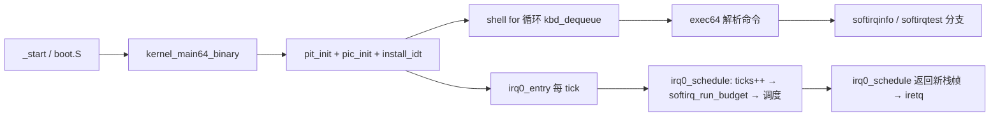

# Lesson 49: Linux 风格软中断、tasklet 与有界 workqueue — 精讲文档

> **课号**：Lesson 49 ｜ **主题**：softirq / tasklet / workqueue 有界推迟工作模型
> **课程主线位置**：中断/时钟子系统（第七阶段收尾）——在 48 课 PIT 抢占调度之后，
> 为「中断上下文产生的推迟工作」引入 Linux 式的处理次序与预算约束。
> **前置课程**：[../lesson-48-stable/README.md](Lesson 48：PIT 抢占调度)；
> **后续课程**：[../lesson-50-stable/README.md](Lesson 50：Linux 风格锁与原子操作)。
> **一句话目标**：学完本课你能讲清「为什么要在中断返回后、进程上下文里处理推迟工作」，
> 并能在 TinyOS 上用手动命令触发、运行、验证一套含预算的 softirq→tasklet→workqueue 三级模型。

## 1. 课程定位（Mission）

- **一句话目标**：看懂 TinyOS 的推迟工作三件套——`softirq_raise`/`tasklet_schedule`/
  `workqueue_submit` 如何提交，`softirq_run_budget` 如何按固定预算在 PIT 路径上排空，
  并用 `softirqtest` 自检「tasklet 合并、tasklet 先于 work、FIFO 出队、预算结转」。
- **主线位置**：本课处于中断与调度子系统的收尾段。上一课（48）让 IRQ0 成为抢占时钟源，
  本课把 IRQ0 的路径复用为「下半部执行点」——在每次时钟中断里先跑固定预算的软中断，
  再做线程切换。这正好对应 Linux 中 `irq_exit()` 里 `invoke_softirq()` 的位置。
- **前置知识清单**：
  1. PIT 编程与 IRQ0 中断入口（`irq0_entry` 保存现场 → `irq0_schedule` 返回新栈帧）。
  2. 位运算：`pending` 位图、`1U<<bit`、`&~1U` 清位。
  3. 环形队列（环形缓冲）的 head/tail/used 三计数与取模推进。
  4. Linux 中断模型中的 hardirq 与 softirq 两阶段概念（先有直觉即可）。
- **本课交付**：新增 `softirqinfo`（查询 pending/raises/runs/drops/budget 与 tasklet/work 占用）和
  `softirqtest`（全自动自检）两条命令；内核新增 3 个结构体、6 个静态数组/变量、6 个函数。

## 2. 核心概念精讲

### 2.1 为什么需要「推迟工作」（bottom half）

硬件中断处理器在关中断/最小上下文中执行，只应做「必须立即做」的事：
读设备寄存器、清中断标志、把数据塞进一个小缓冲、然后返回。如果在这里做大量计算，
会长时间屏蔽其他中断并拖垮实时性。因此 Linux 把工作分成两半（bottom half）：

- **上半部（top half / hardirq）**：中断现场里运行的 ISR，快进快出；
- **下半部（bottom half）**：中断返回后、进程上下文边界处运行的推迟工作。

本课就是 TinyOS 的「下半部」教学模型：软中断位 + tasklet 槽 + FIFO workqueue。

### 2.2 softirq：位图式「待办标记」

- **定义**：一组按位组织的挂起标志（pending bits）。某个下半部事件发生时只置位，
  不立即执行；执行点在稍后的受控时机统一扫描位图。
- **为什么**：置位是 O(1) 的、无锁的（在单核模型下只需普通赋值），且天然合并同类事件——
  同一 bit 在排空前重复置位不会重复执行，这就是「合并/合并计数」的来源。
- **机制**：`softirq_raise(bit)` 做范围检查后 `pending |= (1<<bit)`；`softirq_run_budget()`
  扫描 `pending` 的第 0 位（tasklet）与第 1 位（workqueue），执行完清零对应位。
- **例子**：键盘驱动产生按键 → `workqueue_submit` 置第 1 位 → 下一个 PIT tick 的
  `softirq_run_budget` 从队列取出一条处理 → 队列空则清第 1 位。

### 2.3 tasklet：有上限的「合并执行槽」

- **定义**：`tasklet_model` 是 `{pending, disabled, runs}` 的小槽位，调度语义为
  「同槽合并」：若已 pending 则重复调度被丢弃。
- **为什么**：Linux 的 tasklet（已废弃但历史上极为重要）允许多个 CPU 各自调度同一 tasklet，
  但同一 tasklet 一次只在一个 CPU 上运行，`tasklet_schedule` 用 `TASKLET_RUNNING` 标志做去重。
  TinyOS 用更朴素的方式建模：`if(!pending) { pending=1; raise(0); }`——pending 本身就是去重标志。
- **机制**：`TASKLET_CAP=2`，两个槽位编号 0/1，由 `softirq_run_budget` 里 `i<2` 的循环排空。
- **示意图**：

```
tasklet_schedule(0)  ─┐
tasklet_schedule(0)  ─┴─> pending[0]=1（第二次被合并丢弃）
tasklet_schedule(1)  ───> pending[1]=1
softirq_run_budget() ───> 预算内先排空 tasklet[0], tasklet[1]，再处理 work
```

### 2.4 workqueue：FIFO 有界工作队列

- **定义**：`work_model{kind,data,queued,runs}` 组成容量 `WORK_CAP=4` 的静态环形队列，
  配 `work_head/work_tail/work_used` 三个游标。
- **为什么**：tasklet 是「槽合并」，workqueue 是「逐条排队」——每一条提交都是一件独立工作，
  必须按提交顺序（FIFO）逐条完成，这对应 Linux `queue_work` 的语义。
- **机制**：`workqueue_submit` 写 `head`、推进 `head`、`work_used++`、置 softirq 第 1 位；
  `softirq_run_budget` 读 `tail`、`queued=0`、`runs++`、推进 `tail`、`work_used--`。
- **有界性**：队列满时 `workqueue_submit` 返回 0 并 `drops++`，不做动态分配、
  不阻塞——这就是「有界模型」的落点。

### 2.5 预算（budget）与结转（carry-over）

- `SOFTIRQ_BUDGET=2`：每次 `softirq_run_budget` 最多执行 2 个工作单元（tasklet 槽或 work 条）。
  预算耗尽而 `pending` 仍有位 → `budget_exhaustions++`，剩余工作留在数据结构里，
  等下一个 PIT tick 再次调用 `softirq_run_budget` 继续处理——这就是「结转到下一 tick」。
- 这对应 Linux 的 `MAX_SOFTIRQ_RESTART` 与 `ksoftirqd` 延迟机制：单次运行不能无限执行，
  宁可推迟到下一次机会，保证调度延迟上界可控。

## 3. 源码精讲

### 3.1 文件清单与职责

| 文件 | 职责 | 本课增量（相对 lesson-48） |
| --- | --- | --- |
| `boot.S` | 32→64 位引导、Multiboot2 头、GDT | 未变化 |
| `kernel.c` | 32 位早期初始化、PMM/PIT 初始化、long mode 交接 | 未变化（与 48 逐字节相同） |
| `kernel64.c` | 全部 64 位内核逻辑（本课主体） | 新增 softirq/tasklet/workqueue 数据结构与 6 个函数；`irq0_schedule` 与 `exec64` 各加一处改动 |
| `kernel64.ld` | 64 位裸二进制布局（文本/数据/守护栈） | 未变化 |
| `linker.ld` | 外层 ELF 段布局、Multiboot2 头放置 | 未变化 |
| `Makefile` | 构建/检查/运行 | `check` 目标新增 grep 断言（含对 README.md 的检查） |
| `grub.cfg` | GRUB 菜单项 | 仅 menuentry 标题更新为 lesson 49 |

### 3.2 kernel64.c：新常量、结构与全局状态

源码原文（`kernel64.c`，第 215–225 行附近）：

```c
#define SOFTIRQ_BITS 3U
#define TASKLET_CAP 2U
#define WORK_CAP 4U
#define SOFTIRQ_BUDGET 2U
struct tasklet_model { u8 pending,disabled; u64 runs; };
struct work_model { u8 kind,data,queued; u64 runs; };
struct softirq_model { u8 pending; u64 raises,runs,drops,budget_exhaustions; };
static struct tasklet_model tasklets[TASKLET_CAP];
static struct work_model workqueue[WORK_CAP];
static struct softirq_model softirq_model;
static u8 work_head,work_tail,work_used;
```

逐项解读：

- `SOFTIRQ_BITS 3`：位图宽度 3 位（位 0=tasklet，位 1=workqueue，位 2 保留）。范围检查的边界依据。
- `TASKLET_CAP 2` / `WORK_CAP 4`：静态数组容量，杜绝动态分配——「有界模型」的直接体现。
- `SOFTIRQ_BUDGET 2`：每次排空预算；`softirq_run_budget` 的 while 循环与内层 for 都以它为界。
- `tasklet_model`：`pending`=是否已调度；`disabled`=是否被禁用（禁用槽 `tasklet_schedule` 直接拒绝）；
  `runs`=累计执行次数（统计用）。
- `work_model`：`kind`/`data` 是工作载荷（教学上只存编号，不真正执行内容）；
  `queued`=是否在队；`runs`=已执行次数。
- `softirq_model`：`pending` 位图 + 四个统计计数器 `raises/runs/drops/budget_exhaustions`。
  `drops` 记录「raise 越界」或「workqueue 满」两类丢弃。
- `tasklets[2]`、`workqueue[4]`、`work_head/work_tail/work_used`：环形队列三件套，
  head=写入游标、tail=读取游标、used=在队条数。

### 3.3 提交侧函数精讲

```c
static TEXT64 void softirq_raise(u8 bit){if(bit>=SOFTIRQ_BITS){softirq_model.drops++;return;}softirq_model.pending|=(u8)(1U<<bit);softirq_model.raises++;}
static TEXT64 void tasklet_schedule(u8 id){if(id>=TASKLET_CAP||tasklets[id].disabled)return;if(!tasklets[id].pending){tasklets[id].pending=1;softirq_raise(0);}}
static TEXT64 int workqueue_submit(u8 kind,u8 data){if(work_used>=WORK_CAP){softirq_model.drops++;return 0;}workqueue[work_head]=(struct work_model){kind,data,1,0};work_head=(u8)((work_head+1)%WORK_CAP);work_used++;softirq_raise(1);return 1;}
```

**`softirq_raise(u8 bit)`**（3 行实质分析）：

1. 算法：先做范围检查 `bit>=SOFTIRQ_BITS`，越界则 `drops++` 并直接返回——坏调用不污染位图；
   合法则 `pending |= 1<<bit` 并 `raises++`。
2. 设计动机：位图置位天然可合并，重复 raise 同一 bit 只统计多次、位图不变，
   这正是 Linux `__raise_softirq_irqoff` 的核心语义（见第 7 节对照）。
3. 边界：参数来自内部调用点（只有 `tasklet_schedule(0)` 与 `workqueue_submit` 内部 `softirq_raise(1)`），
   但函数仍自带防御式检查，体现「越界丢弃计数」的可观测性。

**`tasklet_schedule(u8 id)`**：

1. 输入：槽位号 0 或 1。两个拒绝条件：`id>=TASKLET_CAP`（越界）或 `tasklets[id].disabled`（禁用）都静默返回。
2. 合并核心：`if(!tasklets[id].pending)` 才置位并 raise——重复调度被去重，
   这正是 `softirqtest` 中「连续两次 `tasklet_schedule(0)` 只算一次工作」的验证对象。
3. 与 Linux 的对应：Linux `tasklet_schedule` 用 `TASKLET_STATE_PENDING`/`TASKLET_STATE_RUNNING`
   状态位做跨 CPU 去重；TinyOS 单核模型里 pending 位本身即去重标志，简化且足够。

**`workqueue_submit(u8 kind,u8 data)`**：

1. 有界检查：`work_used>=WORK_CAP` 时 `drops++` 返回 0（提交失败），绝不扩容——有界性的落点。
2. 环形写入：`workqueue[work_head]={kind,data,1,0}`（queued=1），
   `head=(head+1)%WORK_CAP` 取模推进，`work_used++`，再 `softirq_raise(1)` 唤醒位 1。
3. 返回 1 表示入队成功；`softirqtest` 利用「第 5 条提交（kind=9）失败」来验证满队拒绝。

### 3.4 执行侧函数 `softirq_run_budget` 精讲

```c
static TEXT64 void softirq_run_budget(void){u8 budget=SOFTIRQ_BUDGET,i;while(budget&&softirq_model.pending){if(softirq_model.pending&1){for(i=0;i<TASKLET_CAP&&budget;i++)if(tasklets[i].pending&&!tasklets[i].disabled){tasklets[i].pending=0;tasklets[i].runs++;softirq_model.runs++;budget--;}}if(softirq_model.pending&2&&budget){if(work_used){struct work_model*w=&workqueue[work_tail];w->queued=0;w->runs++;work_tail=(u8)((work_tail+1)%WORK_CAP);work_used--;softirq_model.runs++;budget--;}}if(!tasklets[0].pending&&!tasklets[1].pending)softirq_model.pending&=(u8)~1U;if(!work_used)softirq_model.pending&=(u8)~2U;}if(softirq_model.pending)softirq_model.budget_exhaustions++;}
```

逐块解读（把单行源码按逻辑拆开，逐行对齐）：

```c
u8 budget=SOFTIRQ_BUDGET, i;              // 预算=2，本 tick 内最多执行 2 个单元
while(budget && softirq_model.pending) {  // 预算还有且仍有挂起位才继续
    if (softirq_model.pending & 1) {      // 位 0：tasklet 有挂起
        for (i=0; i<TASKLET_CAP && budget; i++)
            if (tasklets[i].pending && !tasklets[i].disabled) {
                tasklets[i].pending = 0;  // 清槽
                tasklets[i].runs++;       // 槽计数
                softirq_model.runs++;     // 总计数
                budget--;                 // 消耗预算
            }
    }
    if (softirq_model.pending & 2 && budget) {   // 位 1：workqueue 有挂起
        if (work_used) {                  // 队列非空
            struct work_model *w = &workqueue[work_tail];
            w->queued = 0;                // 出队标记
            w->runs++;                    // 工作执行计数
            work_tail = (work_tail+1) % WORK_CAP;  // 环形推进 tail
            work_used--;                  // 在队条数减一
            softirq_model.runs++;
            budget--;
        }
    }
    // 位图收缩：对应位排空后清除，避免下一轮 while 空转
    if (!tasklets[0].pending && !tasklets[1].pending) pending &= ~1U;
    if (!work_used) pending &= ~2U;
}
if (softirq_model.pending)                 // 预算耗尽仍有挂起 → 结转计数
    softirq_model.budget_exhaustions++;
```

实质分析：

1. **次序保证**：while 每一轮先跑 tasklet 槽再跑 work 条，且 work 分支只在 `budget` 剩余时才进——
   这实现了 README 与测试串所说的「tasklet 先于 work」的 Linux bottom-half 次序。
2. **边界与统计**：tasklet 槽还要查 `disabled`；位图收缩逻辑把已排空的位清零，
   使外层 while 在「预算已用光但 pending 位还挂着」的场景能正确跳出（位清除后再判断条件）。
3. **结转语义**：循环退出后若 `pending` 非零说明预算耗尽，`budget_exhaustions++`；
   数据仍保留在 tasklets/workqueue 中，由下一个 PIT tick 再次调用本函数续跑——不丢工作、也不无限执行。

### 3.5 查询与自检命令

```c
static TEXT64 void softirqinfo(u16*c){text64(c,"softirq pending/raises/runs/drops/budget: ");hex64(c,softirq_model.pending);hex64(c,"/");hex64(c,softirq_model.raises);hex64(c,"/");hex64(c,softirq_model.runs);hex64(c,"/");hex64(c,softirq_model.drops);hex64(c,"/");hex64(c,softirq_model.budget_exhaustions);text64(c," tasklets/work: ");hex64(c,tasklets[0].pending+tasklets[1].pending);hex64(c,"/");hex64(c,work_used);putc64(c,'\n');}
static TEXT64 void softirqtest(u16*c){u64 r=softirq_model.runs;u8 i;softirq_model=(struct softirq_model){0};work_head=work_tail=work_used=0;for(i=0;i<TASKLET_CAP;i++)tasklets[i]=(struct tasklet_model){0,0,0};tasklet_schedule(0);tasklet_schedule(0);tasklet_schedule(1);for(i=0;i<WORK_CAP;i++)workqueue_submit(i,0);int a=workqueue_submit(9,0)==0;softirq_run_budget();int b=!tasklets[0].pending&&!tasklets[1].pending&&work_used==2;softirq_run_budget();int d=work_used==0&&softirq_model.budget_exhaustions>=1;text64(c,"softirqtest: ");text64(c,a&&b&&d&&softirq_model.runs==r+6?"tasklet coalescing, FIFO work, and budget carry-over passed":"BROKEN");putc64(c,'\n');}
```

**`softirqinfo(u16 *c)`**：把 `pending/raises/runs/drops/budget_exhaustions` 五个计数
与「tasklet 挂起槽总数 / workqueue 在队数」用 `hex64` 以十六进制逐段打印，行尾 `\n`。
注意它不修改任何状态，是纯查询命令。

**`softirqtest(u16 *c)`** 逐步解读（自检剧本）：

1. `r=softirq_model.runs` 先记住执行前总 runs，用于最后「净增 6」的断言。
2. 整体复位：`softirq_model={0}`、环形游标清零、tasklets 逐槽清零——测试与运行态隔离。
3. 调度剧本：`tasklet_schedule(0)` 两次（验证合并：第二次应被丢弃）、`tasklet_schedule(1)` 一次；
   随后连续 `workqueue_submit(0..3)` 填满 4 条。
4. `a = workqueue_submit(9,0)==0`：第 5 条应被满队拒绝 → `a` 验证「有界拒绝」。
5. 第一次 `softirq_run_budget()`：预算 2 消耗在 2 个 tasklet 槽上 → `b` 断言
   「两个 tasklet 已排空且 work 剩 2 条（4−2=2）」——验证 tasklet 先于 work 的次序。
6. 第二次 `softirq_run_budget()`：排空剩余 2 条 work，因 bit 1 仍挂起 → `d` 断言
   「队列空且 budget_exhaustions≥1」——验证结转计数。
7. 输出串：`"tasklet coalescing, FIFO work, and budget carry-over passed"` 或 `"BROKEN"`；
   且要求 `runs == r+6`（2 槽 + 4 条 = 6 个单元）。该串在 Makefile 的验证命令中被照抄核对。

### 3.6 `irq0_schedule` 的挂钩（本课唯一的中断路径改动）

源码改动仅一处（`kernel64.c` 中 `irq0_schedule` 开头）：

```c
TEXT64 struct irq0_frame *irq0_schedule(struct irq0_frame *f){u8 old,next;ticks++;softirq_run_budget();outb64(PIC1_COMMAND,PIC_EOI);...
```

- 新插入的调用点是 `ticks++` 之后、`outb64(PIC_EOI)` 之前（EOI 之前说明仍在硬中断上下文，
  这正好模拟 Linux 在 `irq_exit()` 检查 `TIF_NEED_RESCHED`/`softirq_pending` 的时机）。
- 每次 PIT tick 都触发一次有界排空：这是「下半部执行点 = 时钟中断」这一教学设计的骨架。
- `softirq_run_budget` 在此被调用时不会切换线程、不会进入用户态，只消费 CPU 时间片内的
  微秒级预算，随后才走原有调度逻辑。

### 3.7 `exec64` 的新命令分支

在 `sleeptimetest` 分支之后新增两段（本课在 `exec64` 的全部增量）：

```c
}else if(eq64(word,"softirqinfo")){if(!noargs64(arg))usage64(c,"softirqinfo");else softirqinfo(c);}
}else if(eq64(word,"softirqtest")){if(!noargs64(arg))usage64(c,"softirqtest");else softirqtest(c);}
```

- 带参数时走 `usage64`；无参数时分别调用 `softirqinfo(c)` / `softirqtest(c)`。
- **已知怪癖（如实记录）**：`help` 输出的命令列表**没有**加入 `softirqinfo`/`softirqtest`，
  `about` 与启动横幅仍显示 "TinyOS lesson 43"。这是既有代码未同步更新，属教学快照的现状，
  验证时应以源码中的实际字符串为准。

### 3.8 构建管线（Makefile）

- `CFLAGS64 = -m64 -ffreestanding -fpie ... -mno-red-zone -mno-sse -mno-sse2 -mno-mmx`：
  64 位裸机标志，与上一课一致，未变化。
- 构建链：`kernel64.c → kernel64.o → kernel64.elf(用 kernel64.ld 链接) → objcopy 出裸 bin`；
  `boot.S → boot.o`（`.incbin "build/kernel64.bin"` 嵌入）；`boot.o+kernel.o → kernel.elf`（linker.ld）；
  `grub-mkrescue` 打 ISO。
- `check` 目标（本课有新增断言）：
  - `grub-file --is-x86-multiboot2 build/kernel.elf` 校验 Multiboot2 头；
  - `grep -q 'softirq' README.md`、`grep -q 'tasklet' README.md`、`grep -q 'workqueue' README.md`——
    **README 必须包含这三个词**（本文均已包含）；
  - `grep -q 'softirqinfo' kernel64.c` 等 5 条对 kernel64.c 符号的断言；
  - 全部通过输出 `Multiboot2 and lesson 49 checks passed.`
- `run` 目标：`qemu-system-x86_64 -accel tcg -cdrom build/kernel.iso -serial stdio -no-reboot -no-shutdown`，
  画面输出在 QEMU 图形窗口，勿加 `-display none`。

### 3.9 主控制流



- 运行期路径：PIT 每 tick → `irq0_entry`（汇编压入 15 个 GPR）→ `irq0_schedule(f)`
  → `ticks++; softirq_run_budget();` → 原有抢占调度 → 返回目标栈帧 → `iretq`。
- 命令期路径：键盘 → `exec64` → `softirqinfo`/`softirqtest` 分支 → 直接打印，不经过 IRQ0。

## 4. 数据流与运行逻辑

以一次典型验证为例，串起「命令 → 数据结构 → PIT → 输出」：

1. 启动横幅后输入 `softirqtest` 回车。
2. `exec64` 命中 `softirqtest` 分支，调用 `softirqtest(&c)`。
3. 函数先清零全部状态，然后：
   - 两次 `tasklet_schedule(0)` + 一次 `tasklet_schedule(1)` → `tasklets[0].pending=1`、
     `tasklets[1].pending=1`、`softirq_model.pending` 置位 0、`raises=2`；
   - 4 次 `workqueue_submit(0..3)` → `work_used=4`、`pending` 置位 1、`raises=6`；
   - 第 5 次提交返回 0 → `a=1`（有界拒绝验证），`drops=1`；
4. 第一次 `softirq_run_budget()`：预算 2 全部用于两个 tasklet 槽 → `b=1`，`work_used` 仍为 4；
   第二次调用：排空 2 条 work（`work_used=2`），剩余 bit 1 挂起 → `budget_exhaustions` 计数。
5. 输出：`softirqtest: tasklet coalescing, FIFO work, and budget carry-over passed`。

而 `softirqinfo` 则把当前五个计数与两个队列占用打印为十六进制串，例如
`softirq pending/raises/runs/drops/budget: 0/6/6/1/1 tasklets/work: 0/2`（数值随历史累积变化，
格式串以源码 `softirqinfo` 为准）。注意：`softirqtest` 会清零状态，所以先跑 `softirqinfo`
再跑 `softirqtest` 可以看到计数归零后被剧本重新填充。

## 5. 构建、运行与验证

**依赖**：`gcc`、`ld`、`objcopy`、`grub-mkrescue`、`grub-file`、`qemu-system-x86_64`、`xorriso`（grub-mkrescue 后端）。

**构建**（与 Makefile 一致）：

```bash
cd /home/dongyu/.zcode/workspace/default/lessons/lesson-49-stable
make clean && make -j"$(nproc)"
make check
```

**运行**：

```bash
make run
```

**验证步骤**（输出串逐字抄录自源码，屏幕在 QEMU 图形窗口）：

1. 启动后输入 `help` 回车：列出命令（注意：命令串中**不含** softirqinfo/softirqtest，见 3.7 的怪癖说明）。
2. 输入 `softirqinfo` 回车，预期看到形如
   `softirq pending/raises/runs/drops/budget: 0/0/0/0/0 tasklets/work: 0/0`
   的行（初值全零）。
3. 输入 `softirqtest` 回车，预期输出（源码第 375 行逐字抄录）：
   `softirqtest: tasklet coalescing, FIFO work, and budget carry-over passed`
4. 再次输入 `softirqinfo`，观察 `runs` 与 `drops` 等计数已被 `softirqtest` 剧本修改。
5. `make check` 全部通过时打印 `Multiboot2 and lesson 49 checks passed.`

## 6. 调试地图

| 现象 | 原因 | 检查方法 |
| --- | --- | --- |
| 输入 `softirqtest` 显示 `BROKEN` | 断言 `a&&b&&d&&runs==r+6` 中某一项失败 | 在 `softirqinfo` 观察 pending/runs/drops/budget；确认 tasklet 合并是否生效（连续两次 schedule 只跑一次） |
| `workqueue_submit` 永远返回 0 | `work_used` 未随出队递减，或游标取模错误 | 检查 `softirq_run_budget` 中 `work_used--` 与 `work_tail` 推进是否成对；`softirqinfo` 看 work 占用 |
| `budget_exhaustions` 恒为 0 | `pending` 位未被预算耗尽场景留下（如 budget 太大或位未挂起） | 确认 `SOFTIRQ_BUDGET=2`、队列有 4 条 work 且只跑一次 budget 的场景 |
| 屏幕在 `softirqtest` 后无换行/花屏 | `putc64` 对 `\n` 的列对齐计算与 `c` 游标不一致 | 检查 `putc64` 的 `*c+=COLS-*c%COLS` 分支与 `text64` 循环 |
| IRQ0 之后 shell 卡死 | `softirq_run_budget` 中内层循环无限（如预算未递减） | 核对 for 条件 `i<TASKLET_CAP&&budget`，确认每次执行都 `budget--` |
| `make check` 报 grep 失败 | README 缺 `softirq`/`tasklet`/`workqueue` 关键字 | 用 `grep -n 'softirq\|tasklet\|workqueue' README.md` 检查 |
| `about`/横幅仍显示 lesson 43 | 旧字符串未随课更新（历史快照行为） | 接受现状；以源码字符串为准，不影响本课功能 |

## 7. 与 Linux 源码对照

| 对照点 | TinyOS 教学模型 | Linux 对应实现 | 简化说明 |
| --- | --- | --- | --- |
| softirq 位图与 raise | `softirq_raise`：位图 `pending \|= 1<<bit` + `raises++` | `kernel/softirq.c` 的 `__raise_softirq_irqoff`（`local_irq_save` 后置位 `softirq_pending`） | Linux 有 per-CPU `__softirq_pending` 与 `raise_softirq_irqoff`，TinyOS 只有一份全局位图，且不保存/恢复 IRQ 状态（调用方已关中断） |
| 下半部执行时机 | `irq0_schedule` 里 `ticks++` 后立即 `softirq_run_budget()` | `kernel/softirq.c` 的 `irq_exit()`/`__do_softirq`，在硬中断返回路径检查 `pending` 后调用 | Linux 在返回用户态路径上触发，且 `MAX_SOFTIRQ_RESTART` 次后转交 `ksoftirqd`；TinyOS 只在 PIT 中断里做有界排空 |
| tasklet 合并去重 | `tasklet_schedule`：`if(!pending){pending=1;raise(0);}` | `kernel/tasklet.c` 的 `tasklet_schedule`（`TASKLET_STATE_PENDING`/`TASKLET_STATE_RUNNING` 状态位） | Linux 需跨 CPU 原子位操作；TinyOS 单核下 pending 位即去重标志 |
| 推迟工作次序 | `softirq_run_budget` 先排空 tasklet 槽、后出队 work | Linux 中 tasklet 通过 `TASKLET_SOFTIRQ`（软中断 6）执行，普通 work 由 `WORKQUEUE_SOFTIRQ`/worker 线程执行，存在调度层次差异 | TinyOS 把两者硬编码进同一个 `while` 循环的先后分支，次序固定且可见 |
| FIFO 有界 workqueue | `workqueue_submit` 满队 `drops++` 返回 0，静态数组 | `kernel/workqueue.c` 的 `queue_work`→`insert_work`（链表入队，动态分配 worker pool） | Linux 会阻塞/唤醒 worker 线程并动态创建；TinyOS 满队即丢并计数，绝不阻塞或分配 |
| 预算与结转 | `SOFTIRQ_BUDGET=2`，`budget_exhaustions++` 后下 tick 续跑 | `kernel/softirq.c` 的 `MAX_SOFTIRQ_RESTART` 与 `ksoftirqd` 唤醒 | Linux 限制的是「重启次数」并转交线程；TinyOS 限制的是「单次执行单元数」，两者都保证有界 |

**权威来源**：Intel SDM（中断与异常处理、PIC/8259A、PIT 8254 通道编程）；
Linux `kernel/softirq.c`、`kernel/tasklet.c`、`kernel/workqueue.c`（对照参考）。

## 8. 思考题与练习

1. **概念理解**：为什么 tasklet 是「合并」语义而 workqueue 是「FIFO 逐条」语义？
   试举例说明哪种场景更适合用合并、哪种更适合逐条排队。
2. **源码定位**：在 `kernel64.c` 中找到 `SOFTIRQ_BUDGET` 被使用的全部位置，
   说明如果把它改成 4，`softirqtest` 的输出会如何变化（提示：第二次 `softirq_run_budget`
   是否还会触发 `budget_exhaustions`）。
3. **动手实验**：把 `TASKLET_CAP` 改为 3、`WORK_CAP` 改为 5，重新构建运行 `softirqtest`。
   观察断言 `b`（`work_used==2`）是否仍然成立，解释原因。
4. **动手实验**：在 `softirqinfo` 前手动调用两次 `tasklet_schedule(0)` 后再调用
   `softirq_run_budget()`（需临时写一个命令），验证合并计数与 runs 递增行为。
5. **Linux 对照**：查阅 `kernel/softirq.c` 中 `__do_softirq` 的 `MAX_SOFTIRQ_RESTART` 逻辑，
   对比它与本课 `SOFTIRQ_BUDGET` 在「有界性」上的异同。

## 9. 本课小结与下一课预告

- 本课新增了推迟工作三件套：`softirq_raise` 位图标记、`tasklet_schedule` 合并槽、
  `workqueue_submit` FIFO 有界队列，均由 `SOFTIRQ_BUDGET=2` 的 `softirq_run_budget`
  在每次 PIT tick 里按「tasklet 先、work 后」的次序有界排空。
- 执行点选择在 `irq0_schedule` 的 `ticks++` 之后，复用了既有时钟中断路径，
  让「下半部执行点」可被精确观察和验证。
- 预算耗尽时工作不丢失，而是通过 `budget_exhaustions` 计数结转给下一个 tick，
  体现「宁可推迟、不可无限」的实时设计原则。
- 全部状态是静态数组，无动态分配、无阻塞、无真实锁——这是「有界模型」的边界声明。
- 两条新命令 `softirqinfo`/`softirqtest` 让状态可查、语义可自检。
- 已知现状：help/about/横幅字符串未同步（见 3.7），验证以源码为准。
- **下一课预告**：Lesson 50 将在「并发访问」层面为这些共享状态加上真正的防护——Linux 风格自旋锁、
  原子操作、per-CPU 数据与内存序。上一课模型假设单核无竞争；下一课要回答
  「两个执行体同时碰同一份计数时会发生什么、如何用 `lock; xadd` 之类指令保证正确」。
