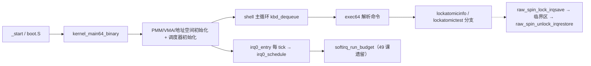

# Lesson 50: Linux 风格锁、原子操作、per-CPU 数据与内存序 — 精讲文档

> **课号**：Lesson 50 ｜ **主题**：IRQ 安全自旋锁、acquire/release/relaxed 原子操作、
> 单 CPU（`NR_CPUS=1`）的 per-CPU 数据模型与内存序标注。
> **课程主线位置**：并发/同步子系统——上一课 49 的 softirq 模型假设「单核、关中断即互斥」，
> 本课把这些隐式假设显式化：引入锁元数据与原子语义，为后续模块边界（51）和
> 综合用户空间（52–54）铺路。
> **前置课程**：[../lesson-49-stable/README.md](Lesson 49：softirq/tasklet/workqueue 推迟工作模型)；
> **后续课程**：[../lesson-51-stable/README.md](Lesson 51：模块边界、导出符号与启动初始化)。
> **一句话目标**：学完本课你能说清「`lock; xchg` 为什么能当锁」「`atomic_store_release` 为什么
> 保证先写数据后公开指针」「per-CPU 数据为什么能免锁」，并在 TinyOS 上用
> `lockatomicinfo`/`lockatomictest` 亲手验证这三件事。

## 1. 课程定位（Mission）

- **一句话目标**：看懂 TinyOS 的锁/原子/per-CPU 三件套——`raw_spin_lock_irqsave` +
  `raw_spin_unlock_irqrestore` 构造 IRQ 安全的临界区，五个 `__atomic_*` 包装提供
  relaxed/acquire/release 三种内存序，`cpu_locals[NR_CPUS]` + `this_cpu()` 演示
  「每 CPU 一份数据、各写各的」的免锁思路。
- **主线位置**：本课是并发原语课。上一课（49）用「PIT 中断 + 单核」回避了真实竞争，
  本课把这些前提摆上台面：锁为何要 `irqsave`（防中断抢占）、原子读改写为何用
  `__atomic_exchange_n`（防 CPU 间撕裂）、per-CPU 为何能并行不争。
- **前置知识清单**：
  1. 上一课（49）的 softirq 位图与 workqueue 环形队列（本课 `cpu_local` 正是其 per-CPU 版）。
  2. `cli`/`sti` 与 RFLAGS.IF 位（`pushfq/popq` 保存标志）。
  3. GCC 内建原子函数 `__atomic_load_n`/`__atomic_store_n`/`__atomic_exchange_n`/`__atomic_fetch_or`
     及其内存序参数（`__ATOMIC_RELAXED`/`__ATOMIC_ACQUIRE`/`__ATOMIC_RELEASE`）。
  4. x86-64 指令 `xchg`/`lock` 前缀与缓存一致性（Intel SDM 第 8 章）的基本概念。
- **本课交付**：新增 `lockatomicinfo`（查询 NR_CPUS、锁状态、per-CPU 推迟状态与内存序词汇）和
  `lockatomictest`（自检加锁/释放/原子发布/per-CPU 归属）两条命令；
  内核新增 1 个常量、1 个结构体、1 个锁变量、7 个原子/锁/percpu 函数。

## 2. 核心概念精讲

### 2.1 为什么上一课不用锁，本课却要「造」锁

上一课（49）的 `softirq_model` 是全局唯一实例，所有访问发生在两种上下文：
shell 命令执行（`softirqtest`）或 PIT 中断（`softirq_run_budget`）。单核机器上，
只要 shell 在关键段里关中断，就不会被打断——所以无需锁。

但 Linux 必须面对多核：两个 CPU 同时执行 `irq0_schedule`，`pending` 位图就会出现
「读-改-写」撕裂。本课用一个「即使单核也显式存在」的锁模型把问题框出来：
锁的形态（`volatile u32 locked` + 原子交换）与用法（`irqsave` 保存并屏蔽中断）都是
真锁的形状，只是 `NR_CPUS=1` 使竞争永远不会实际发生。这是教学上的**显式化**而非多核实现。

### 2.2 原子操作与内存序（memory ordering）

- **原子**：对单个内存位置的读改写（RMW）在执行期间不可分割。x86-64 上由 `lock` 前缀
  （总线/缓存锁）保证；GCC 的 `__atomic_exchange_n` 等内建函数在 x86 上编译成
  `lock xchg`、`lock xadd`、`cmpxchg` 等指令。
- **为什么需要序（ordering）**：CPU 与编译器都可能重排无依赖的访存。生产者可能先公开
  「数据就绪」标志、再真正写出数据；消费者若按错误顺序读，会读到旧值。
- **relaxed**：只保证原子，不承诺与其他访问的顺序——适合计数器、统计值。
- **release**：写屏障语义——release 之前的普通写不会越过该操作后移到 release 之后，
  用于「先写数据，再发布指针/标志」。
- **acquire**：读屏障语义——acquire 之后的普通读不会越过该操作前移到 acquire 之前，
  用于「读指针/标志，再读其指向的数据」。
- 本课的词汇表：`atomic_load_relaxed_u8`（读）、`atomic_store_release_u8`（发布写）、
  `atomic_fetch_or_relaxed_u8`（读改写）、`atomic_exchange_acquire_u32`（锁竞争读）、
  `atomic_store_release_u32`（解锁发布写）。

### 2.3 自旋锁（spinlock）与 IRQ 安全

- **定义**：`raw_spinlock_t { volatile u32 locked; }`，`locked==0` 表示空闲，1 表示已持锁。
- **上锁**：`while(atomic_exchange_acquire_u32(&l->locked, 1)) {}`——用原子交换把 1 写进
  `locked` 并返回旧值；若旧值是 0 说明「我抢到了」（交换前空闲）；若旧值是 1 说明已被持有，
  原地自旋。这就是经典 test-and-set 自旋锁（TTAS 的简化版）。
- **IRQ 安全**：`raw_spin_lock_irqsave` 在自旋**前**用 `irq_save64` 保存 RFLAGS 并 `cli`，
  保证持锁期间没有中断插入同一执行流；`raw_spin_unlock_irqrestore` 在释放后用保存的标志
  恢复 IF 位。这对应 Linux `spin_lock_irqsave` 的语义：锁、关中断一次完成。
- **为什么 `irqsave` 而不是 `cli`**：保存旧值才能在不改变调用方原有中断状态的前提下恢复，
  支持嵌套使用（可重入于不同锁）。

### 2.4 per-CPU 数据

- **定义**：`struct cpu_local` 给每个 CPU 一份独立副本，访问者通过 `this_cpu()` 拿到自己那份。
  本课 `NR_CPUS=1`，所以 `this_cpu()` 直接返回 `&cpu_locals[0]`。
- **为什么**：如果同一数据只被「自己的 CPU」读写，就无需任何锁——这就是 per-CPU 思想的
  免锁收益。本课把上一课的 `softirq_pending`/`work_head`/`work_tail`/`work_used` 从全局
  模型搬进 `cpu_local`，演示「推迟状态本来就是 per-CPU 的」这一 Linux 事实
  （`__softirq_pending` 就是 per-CPU 变量）。
- **机制**：数组下标 = CPU 编号；真实 Linux 里 `this_cpu_ptr()` 是编译器把段寄存器
  （`%gs`）与 percpu 基址相加（`arch/x86/include/asm/percpu.h` 的 `__percpu_this`）。

### 2.5 发布/观察（publication / observation）模式

这是 `lockatomictest` 想验证的核心叙事：

```
线程 A（写者）:  data = 42;  atomic_store_release_u8(&pending, 1);
线程 B（读者）:  if (atomic_load_acquire(&pending) == 1) 读 data;  // 必看到 42
```

release 写保证 data 的写入先于 pending 位发布；acquire 读保证读者看到位后再读 data
不会读到旧值。本课 `lockatomictest` 用一条命令串演示同一 CPU 上的该模式，
`NR_CPUS=1` 下序的标注价值是「意图文档化」——真实保证要在多核才能被观察。

## 3. 源码精讲

### 3.1 文件清单与职责

| 文件 | 职责 | 本课增量（相对 lesson-49） |
| --- | --- | --- |
| `boot.S` | 32→64 位引导、Multiboot2 头、GDT | 未变化 |
| `kernel.c` | 32 位早期初始化 | 未变化（与 49 逐字节相同） |
| `kernel64.c` | 64 位内核主体 | 新增锁/原子/per-CPU 定义与 2 条命令；`exec64` 加 2 个分支 |
| `kernel64.ld` | 64 位裸二进制布局 | 未变化 |
| `linker.ld` | 外层 ELF 布局 | 未变化 |
| `Makefile` | 构建/检查/运行 | `check` 目标更新 grep 断言（含 README 关键字） |
| `grub.cfg` | GRUB 菜单项 | 仅 menuentry 标题更新为 lesson 50 |

### 3.2 新常量、类型与全局状态

源码原文（`kernel64.c`，第 226–241 行附近）：

```c
#define NR_CPUS 1U
struct cpu_local { u8 id,softirq_pending,work_head,work_tail,work_used; };
static struct cpu_local cpu_locals[NR_CPUS];
static TEXT64 u64 irq_save64(void);
static TEXT64 void irq_restore64(u64 flags);
typedef struct { volatile u32 locked; } raw_spinlock_t;
typedef unsigned long irqflags_t;
static raw_spinlock_t deferred_lock;
static TEXT64 u8 atomic_load_relaxed_u8(volatile u8*p){return __atomic_load_n(p,__ATOMIC_RELAXED);}
static TEXT64 void atomic_store_release_u8(volatile u8*p,u8 v){__atomic_store_n(p,v,__ATOMIC_RELEASE);}
static TEXT64 u8 atomic_fetch_or_relaxed_u8(volatile u8*p,u8 v){return __atomic_fetch_or(p,v,__ATOMIC_RELAXED);}
static TEXT64 u32 atomic_exchange_acquire_u32(volatile u32*p,u32 v){return __atomic_exchange_n(p,v,__ATOMIC_ACQUIRE);}
static TEXT64 void atomic_store_release_u32(volatile u32*p,u32 v){__atomic_store_n(p,v,__ATOMIC_RELEASE);}
static TEXT64 void raw_spin_lock_irqsave(raw_spinlock_t*l,irqflags_t*f){*f=irq_save64();while(atomic_exchange_acquire_u32(&l->locked,1)){} }
static TEXT64 void raw_spin_unlock_irqrestore(raw_spinlock_t*l,irqflags_t f){atomic_store_release_u32(&l->locked,0);irq_restore64(f);}
static TEXT64 struct cpu_local *this_cpu(void){return &cpu_locals[0];}
```

逐项解读：

- `NR_CPUS 1U`：per-CPU 数组容量；README 明确声明「模型 `NR_CPUS=1`，关中断是本地串行化，
  不是 SMP 安全的证明」。
- `cpu_local`：把上一课 49 的 `softirq_pending`、`work_head/work_tail/work_used` 搬进每 CPU 记录，
  并加 `id` 标识 CPU。`u8` 字段与位图/环形游标尺寸匹配。
- `raw_spinlock_t`：`volatile u32 locked`——`volatile` 阻止编译器缓存该字段于寄存器。
- `irqflags_t = unsigned long`：保存 RFLAGS 的载体（RFLAGS 是 64 位寄存器，用 u64 表达）。
- `deferred_lock`：本课唯一的锁实例，语义上是「推迟工作状态」的临界区门。
- 五个 `atomic_*` 包装：统一走 GCC `__atomic_*` 内建，符号名即文档——读者一眼看出
  「这个读是 relaxed、那个写是 release」。

### 3.3 IRQ 保存/恢复（既有函数，本课的关键依赖）

```c
static TEXT64 u64 irq_save64(void){u64 flags;__asm__ volatile("pushfq; popq %0; cli":"=r"(flags)::"memory");return flags;}
static TEXT64 void irq_restore64(u64 flags){if(flags&(1ULL<<9))__asm__ volatile("sti":::"memory");}
```

- `irq_save64`：`pushfq` 把 RFLAGS 压栈、`popq` 取到 C 变量，然后 `cli` 关中断；`"memory"`
  约束阻止编译器把访存重排出临界区。
- `irq_restore64`：仅当保存的标志里 IF=1（bit 9）才 `sti`——若调用方本来关着中断，解锁也不重新开。
- 这两个函数从更早课程沿用至今，本课把它们变成 `raw_spin_lock_irqsave` 的组成部分。

### 3.4 锁原语精讲

```c
static TEXT64 void raw_spin_lock_irqsave(raw_spinlock_t*l,irqflags_t*f){*f=irq_save64();while(atomic_exchange_acquire_u32(&l->locked,1)){} }
static TEXT64 void raw_spin_unlock_irqrestore(raw_spinlock_t*l,irqflags_t f){atomic_store_release_u32(&l->locked,0);irq_restore64(f);}
```

**`raw_spin_lock_irqsave(l, f)`**：

1. `*f = irq_save64()`：先保存旧 RFLAGS 并 `cli`——持锁期间当前执行流不会被 IRQ 打断，
   这是「IRQ 安全」的落点，对应 Linux `__raw_spin_lock_irqsave` 里
   `local_irq_save` + `do_raw_spin_lock` 的顺序。
2. `while(atomic_exchange_acquire_u32(&l->locked,1)){}`：原子交换 1 并取回旧值；
   旧值为 0 → 成功进入临界区；旧值为 1 → 原地自旋。acquire 序保证「锁成功后再读保护数据」
   不会乱序。
3. 设计动机：单函数一次完成「保存标志 + 关中断 + 抢锁」，与 Linux `spin_lock_irqsave`
   三合一 API 对齐；`f` 是指针，方便调用者把标志带出临界区。

**`raw_spin_unlock_irqrestore(l, f)`**：

1. `atomic_store_release_u32(&l->locked,0)`：release 写零——保证临界区内所有写先于解锁发布，
   读者 acquire 到锁后才能看到完整数据（发布/观察配对的锁侧）。
2. `irq_restore64(f)`：按保存的标志恢复 IF；若进入时中断本来开着，这里重新开。
3. 边界：单核模型下锁不竞争，循环必然一次通过；函数不会在锁未持有时被误调（无所有权检查），
   这是教学简化，README 已声明「不做动态锁调试」。

### 3.5 原子辅助函数精讲

```c
static TEXT64 u8 atomic_load_relaxed_u8(volatile u8*p){return __atomic_load_n(p,__ATOMIC_RELAXED);}
static TEXT64 void atomic_store_release_u8(volatile u8*p,u8 v){__atomic_store_n(p,v,__ATOMIC_RELEASE);}
static TEXT64 u8 atomic_fetch_or_relaxed_u8(volatile u8*p,u8 v){return __atomic_fetch_or(p,v,__ATOMIC_RELAXED);}
static TEXT64 u32 atomic_exchange_acquire_u32(volatile u32*p,u32 v){return __atomic_exchange_n(p,v,__ATOMIC_ACQUIRE);}
static TEXT64 void atomic_store_release_u32(volatile u32*p,u32 v){__atomic_store_n(p,v,__ATOMIC_RELEASE);}
```

- 五个包装各对应 Linux `include/linux/atomic/atomic-instrumented.h` 或
  `arch/x86/include/asm/atomic.h` 中一个常见原语：`atomic_read`（relaxed load）、
  `atomic_set`（store）、`atomic_fetch_or`（RMW）、`atomic_xchg`（exchange）、
  `smp_store_release`/`smp_load_acquire`（release/acquire 语义）。
- `atomic_exchange_acquire_u32` 在 x86-64 上编译为 `xchg`（自带 lock 语义，无需 `lock` 前缀，
  见 Intel SDM `XCHG` 指令），是自旋锁的核心。
- `atomic_fetch_or_relaxed_u8` 用 `lock or` 原子地置位——本课用它演示「对 per-CPU 位图
  做原子 RMW 却不需要锁」。
- `volatile` 指针参数保证编译器不把访问折叠/缓存；`TEXT64` 保证这些函数落在 `.text64` 段
  被高地址别名执行。

### 3.6 per-CPU 访问与查询/自检命令

```c
static TEXT64 struct cpu_local *this_cpu(void){return &cpu_locals[0];}
static TEXT64 void lockatomicinfo(u16*c){text64(c,"locks/atomics/percpu: NR_CPUS ");hex64(c,NR_CPUS);text64(c," lock ");hex64(c,deferred_lock.locked);text64(c," cpu id/pending/work: ");hex64(c,this_cpu()->id);hex64(c,"/");hex64(c,this_cpu()->softirq_pending);hex64(c,"/");hex64(c,this_cpu()->work_used);text64(c," memory order: acquire/release/relaxed\n");}
static TEXT64 void lockatomictest(u16*c){irqflags_t f;u8 v=0;atomic_fetch_or_relaxed_u8(&this_cpu()->softirq_pending,0);raw_spin_lock_irqsave(&deferred_lock,&f);v=atomic_load_relaxed_u8(&this_cpu()->softirq_pending);atomic_store_release_u8(&this_cpu()->softirq_pending,(u8)(v|1));raw_spin_unlock_irqrestore(&deferred_lock,f);text64(c,"lockatomictest: ");text64(c,atomic_load_relaxed_u8(&this_cpu()->softirq_pending)==1&&deferred_lock.locked==0?"irq-safe lock, atomic publication, per-CPU ordering passed":"BROKEN");putc64(c,'\n');}
```

**`this_cpu()`**：`&cpu_locals[0]`——`NR_CPUS=1` 下「当前 CPU」就是 0 号槽。
这是 `__this_cpu_ptr()`/`this_cpu_ptr()` 的教学替身：真实实现依赖 `%gs` 段寻址。

**`lockatomicinfo(u16 *c)`**（纯查询）：

1. 输出 `NR_CPUS`、`deferred_lock.locked`、`cpu id`、per-CPU 的 `softirq_pending` 与 `work_used`。
2. 行尾固定注明内存序词汇表 `memory order: acquire/release/relaxed`——把三种序写成
   屏幕上的「文档」。
3. 不修改任何状态，可任意时刻调用；`deferred_lock.locked` 在非临界区调用时恒为 0。

**`lockatomictest(u16 *c)`** 逐步解读：

1. `atomic_fetch_or_relaxed_u8(&this_cpu()->softirq_pending, 0)`：OR 0 是「无操作式」原子访问，
   演示对 per-CPU 位图做原子 RMW 的调用形状（值不变，只热身）。
2. `raw_spin_lock_irqsave(&deferred_lock,&f)`：进入临界区，保存/关闭中断并抢锁。
3. `v=atomic_load_relaxed_u8(...)`（relaxed 读）→ `atomic_store_release_u8(..., v|1)`
   （release 写）：把 `softirq_pending` 置位 1，构成「临界区内、带序标注的发布」。
4. `raw_spin_unlock_irqrestore(&deferred_lock,f)`：release 写 0 解锁并恢复中断状态。
5. 断言 `atomic_load_relaxed_u8(...)==1 && deferred_lock.locked==0`：读到置位且锁已空闲。
   全过输出 `lockatomictest: irq-safe lock, atomic publication, per-CPU ordering passed`，
   否则输出 `BROKEN`。

### 3.7 `exec64` 的新命令分支

在 `softirqtest` 分支之后新增两段（本课在 `exec64` 的全部增量）：

```c
}else if(eq64(word,"lockatomicinfo")){if(!noargs64(arg))usage64(c,"lockatomicinfo");else lockatomicinfo(c);}
}else if(eq64(word,"lockatomictest")){if(!noargs64(arg))usage64(c,"lockatomictest");else lockatomictest(c);}
```

- 与上一课相同的模式：带参数走 `usage64`，无参数调用实现函数。
- **已知怪癖（如实记录）**：`help` 命令列表、`about`、启动横幅仍未更新（继续显示
  "TinyOS lesson 43"，help 中也没有 lockatomicinfo/lockatomictest）。验证以源码字符串为准。

### 3.8 构建管线（Makefile）

- 编译/链接/ISO 管线与 49 课完全一致，无新增构建步骤。
- `check` 目标断言（本课更新）：
  - `grub-file --is-x86-multiboot2 build/kernel.elf`：Multiboot2 头校验；
  - `grep -q 'lock' README.md`、`grep -q 'atomic' README.md`、`grep -q 'per-CPU' README.md`——
    **README 必须包含这三个关键字**（本文均已包含，且 `per-CPU` 以连字符形式出现）；
  - `grep -q 'lockatomicinfo' kernel64.c`、`grep -q 'lockatomictest' kernel64.c`、
    `grep -q 'raw_spin_lock_irqsave' kernel64.c`、`grep -q 'atomic_store_release' kernel64.c`；
  - 全部通过打印 `Multiboot2 and lesson 50 checks passed.`
- `run` 目标：`qemu-system-x86_64 -accel tcg -cdrom build/kernel.iso -serial stdio
  -no-reboot -no-shutdown`；VGA 画面在图形窗口，勿加 `-display none`。

### 3.9 主控制流



- 运行期路径：PIT tick → `irq0_schedule` → `softirq_run_budget` 等既有逻辑不动；
  本课新增的锁不挂在任何热路径上，只被命令显式驱动，便于观察。
- 命令期路径：键盘 → `exec64` → `lockatomicinfo`/`lockatomictest` → 临界区操作 → 打印。

## 4. 数据流与运行逻辑

以 `lockatomictest` 为例串起完整路径：

1. 启动后输入 `lockatomictest` 回车。
2. `exec64` 命中分支，调用 `lockatomictest(&c)`。
3. 内部数据流：
   - `atomic_fetch_or_relaxed_u8(&cpu_locals[0].softirq_pending, 0)`：原子访问位图（值为 0）；
   - `raw_spin_lock_irqsave(&deferred_lock,&f)`：`f=旧RFLAGS`；`cli`；`xchg` 抢锁（`locked=1`）；
   - `v = atomic_load_relaxed_u8(...)` → 读到 0；`atomic_store_release_u8(..., 0|1)` → 位图=1；
   - `raw_spin_unlock_irqrestore`：`locked=0`；若 `f` 的 IF=1 则 `sti`；
4. 断言两个条件（位图==1、锁==0）后打印
   `lockatomictest: irq-safe lock, atomic publication, per-CPU ordering passed`。

`lockatomicinfo` 则输出形如
`locks/atomics/percpu: NR_CPUS 1 lock 0 cpu id/pending/work: 0/1/0 memory order: acquire/release/relaxed`
的行（数值随测试历史变化，格式串以源码为准）。先跑 `lockatomictest` 再跑 `lockatomicinfo`
可以看到 `pending` 字段变为 1、`lock` 字段保持 0。

## 5. 构建、运行与验证

**依赖**：`gcc`、`ld`、`objcopy`、`grub-mkrescue`、`grub-file`、`qemu-system-x86_64`、`xorriso`。

**构建**（与 Makefile 一致）：

```bash
cd /home/dongyu/.zcode/workspace/default/lessons/lesson-50-stable
make clean && make -j"$(nproc)"
make check
```

**运行**：

```bash
make run
```

**验证步骤**（输出串逐字抄录自源码，屏幕在 QEMU 图形窗口）：

1. 启动后输入 `lockatomicinfo` 回车，预期看到行：
   `locks/atomics/percpu: NR_CPUS 1 lock 0 cpu id/pending/work: 0/0/0 memory order: acquire/release/relaxed`
   （初值状态；`lock` 恒为 0，因为命令不在临界区内运行）。
2. 输入 `lockatomictest` 回车，预期输出（源码第 391 行逐字抄录）：
   `lockatomictest: irq-safe lock, atomic publication, per-CPU ordering passed`
3. 再次输入 `lockatomicinfo`，观察 `cpu id/pending/work` 的 `pending` 字段已从 0 变 1，
   且 `lock` 仍为 0（证明解锁成功写回）。
4. 可继续输入 `softirqtest`（49 课命令仍可用）确认软中断模型未被本课破坏。
5. `make check` 通过时打印 `Multiboot2 and lesson 50 checks passed.`

## 6. 调试地图

| 现象 | 原因 | 检查方法 |
| --- | --- | --- |
| `lockatomictest` 显示 `BROKEN` | 断言 `pending==1 && locked==0` 中某一项失败 | 临界区后 `lockatomicinfo` 观察 `lock` 字段；若为 1 说明 `unlock` 未执行或被跳过 |
| `deferred_lock.locked` 恒为 1 | `raw_spin_unlock_irqrestore` 未复位（如标志恢复顺序颠倒） | 检查 `atomic_store_release_u32(&l->locked,0)` 是否在 `irq_restore64` 之前执行 |
| 锁循环死等（shell 卡死） | `atomic_exchange_acquire_u32` 交换失败返回恒 1，或 `locked` 初始化非 0 | 确认 `deferred_lock` 是静态零初始化；`xchg` 的返回值语义（返回**旧**值） |
| 中断在临界区内发生 | 忘记 `irq_save64` 的 `cli`，或恢复标志错误地提前 `sti` | 检查 `raw_spin_lock_irqsave` 先保存后 `cli`；`irq_restore64` 按 IF 位条件恢复 |
| `atomic_store_release_u8` 后的读看不到新值 | 读侧用了错误序（如 relaxed 读且编译器重排） | 核对读侧用 `atomic_load_acquire`（本课断言用 relaxed 读也成立，因为单核 + 同一命令串内可见） |
| `make check` 报 grep 失败 | README 缺 `lock`/`atomic`/`per-CPU` 关键字 | `grep -n 'lock\|atomic\|per-CPU' README.md` 检查 |
| `this_cpu()` 返回错误槽 | `NR_CPUS` 与实际 CPU 号不符 | 单核模型下恒为 0 号槽；若未来改 `NR_CPUS`，需引入真实 CPU 号来源 |
| help/about 仍显示旧课 | 字符串未同步（历史快照行为） | 接受现状；以源码字符串为准，不影响本课功能 |

## 7. 与 Linux 源码对照

| 对照点 | TinyOS 教学模型 | Linux 对应实现 | 简化说明 |
| --- | --- | --- | --- |
| 自旋锁类型与抢锁 | `raw_spinlock_t{volatile u32 locked}` + `atomic_exchange_acquire_u32` 循环 | `include/linux/spinlock.h` 的 `spinlock_t`/`raw_spinlock_t`；`arch/x86/include/asm/spinlock.h` 的 `native_queued_spin_lock`（MCS/queued spinlock，`xchg` 进入 pending 状态） | Linux 用排队锁避免缓存行颠簸并保证公平；TinyOS 是最朴素 test-and-set |
| IRQ 安全上锁 | `raw_spin_lock_irqsave`：`irq_save64()`+抢锁一条龙 | `kernel/locking/spinlock.c` 的 `_raw_spin_lock_irqsave`→`local_irq_save`+`do_raw_spin_lock` | Linux 拆成多层包装（`spin_lock_irqsave` 宏/`__raw`），TinyOS 合并为单函数 |
| 原子 API 形状 | `atomic_load_relaxed_u8`/`atomic_store_release_u8`/`atomic_fetch_or_relaxed_u8`/`atomic_exchange_acquire_u32`/`atomic_store_release_u32` | `include/linux/atomic/atomic-instrumented.h`（KCSAN 插桩版 `atomic_read`/`atomic_fetch_or`/`atomic_xchg`）；`arch/x86/include/asm/atomic.h` 的 `atomic_xchg`（`xchg`） | Linux 提供全家族（inc/dec/cmpxchg/…），TinyOS 只挑本课需要的 5 个；内存序直接写在内建参数里 |
| 内存序标注 | `__ATOMIC_RELAXED/ACQUIRE/RELEASE` 内建 | `Documentation/memory-barriers.txt` 的 acquire/release 规则；`include/linux/atomic.h` 的 `smp_load_acquire`/`smp_store_release` | Linux 区分 `smp_`（需要时才加屏障）与强制版；TinyOS 统一用编译器内建 |
| per-CPU 数据 | `cpu_locals[NR_CPUS]` 数组 + `this_cpu()` 返回 0 号槽 | `include/linux/percpu.h` 的 `this_cpu_ptr()`/`__per_cpu_offset`；`arch/x86/include/asm/percpu.h` 用 `%gs` 段寻址 | Linux 每 CPU 一份真实内存并经段寄存器偏移；TinyOS `NR_CPUS=1`，数组即模型 |
| 发布/观察模式 | `lockatomictest` 临界区内 release 置位 + 断言读到 1 | `Documentation/memory-barriers.txt`「manipulation of atomic types」；RCU/队列发布惯用法 | TinyOS 是单核单命令串，序的「保证」多于「可观察」，教学价值在词汇与形状 |

**权威来源**：Intel SDM（`LOCK` 前缀、`XCHG`、缓存一致性、内存序）；
Linux `include/linux/spinlock.h`、`arch/x86/include/asm/atomic.h`、
`include/linux/atomic/atomic-instrumented.h`、`include/linux/percpu.h`、
`kernel/locking/spinlock.c`、`Documentation/memory-barriers.txt`。

## 8. 思考题与练习

1. **概念理解**：为什么 `raw_spin_lock_irqsave` 要在抢锁**之前**保存并关闭中断？
   如果改成「先抢锁、后关中断」会出什么问题（提示：中断里也抢同一把锁）。
2. **源码定位**：在 `kernel64.c` 中找到 `irq_save64` 的实现，说明
   `"pushfq; popq %0; cli"` 三条指令各自的作用；`"memory"` 约束为什么要写。
3. **动手实验**：把 `lockatomictest` 中的 `atomic_store_release_u8` 改为
   `atomic_store_relaxed_u8`（需先在文件里定义该包装），重新构建运行，
   观察断言结果与编译器是否给出警告（`-Wextra -Werror` 下可能编译失败）。
4. **动手实验**：把 `NR_CPUS` 临时改为 2，观察 `this_cpu()` 的返回值与
   `lockatomicinfo` 的打印是否仍然正确；思考单核模型下这个改动是否「真的」产生两个 CPU。
5. **Linux 对照**：阅读 `arch/x86/include/asm/spinlock.h` 中 `native_queued_spin_lock`
   的 `xchg` 用法，对比它与本课 `raw_spin_lock_irqsave` 的 while 循环在公平性上的差异。

## 9. 本课小结与下一课预告

- 本课把「单核即安全」的隐式假设显式化：`raw_spinlock_t`、`irqflags_t`、`deferred_lock`
  构成了一个真形状的 IRQ 安全自旋锁，`raw_spin_lock_irqsave`/`raw_spin_unlock_irqrestore`
  一次完成「保存标志+关中断+原子抢锁」与「release 解锁+恢复中断」。
- 五个 `__atomic_*` 包装让 relaxed/acquire/release 三种内存序成为符号名，
  `lockatomictest` 演示了「临界区内、release 发布、断言可见」的完整数据流。
- `cpu_locals[NR_CPUS=1]` + `this_cpu()` 演示 per-CPU 免锁思想，`lockatomicinfo`
  把锁状态与 per-CPU 推迟状态可视化。
- 与 Linux 的对应关系清楚：spinlock、atomic-instrumented、percpu、memory-barriers
  都是既有权威对照点；TinyOS 只取教学必要子集。
- 已知现状：help/about/横幅字符串仍未同步更新（历史快照行为），验证以源码为准。
- **下一课预告**：Lesson 51 将把「代码边界」本身变成教学对象——模块边界、导出符号表与
  启动初始化序列（对照 `kernel/module.c`、`init/main.c`），回答「内核如何组织成可初始化的
  模块集合，符号如何被导出与解析」，本课引入的锁与 per-CPU 状态将是模块间接口的一部分。
