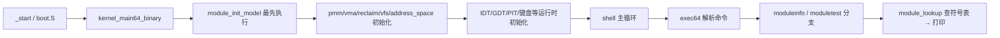

# Lesson 51: 模块边界、导出符号与启动初始化序列 — 精讲文档

> **课号**：Lesson 51 ｜ **主题**：有界模块元数据模型、显式初始化顺序、固定导出符号解析。
> **课程主线位置**：模块/初始化子系统——前两课（49 softirq、50 锁/原子/per-CPU）提供了
> 「共享状态与互斥」原语，本课把「哪些代码构成一个模块、模块如何被登记、模块暴露什么符号、
> 启动时按什么顺序初始化」变成教学对象，为 52 课的综合性用户空间搭建边界框架。
> **前置课程**：[../lesson-50-stable/README.md](Lesson 50：锁、原子操作、per-CPU 数据与内存序)；
> **后续课程**：[../lesson-52-stable/README.md](Lesson 52：综合用户空间——init、shell、文件/进程协同与管道)。
> **一句话目标**：学完本课你能讲清 Linux 里 `EXPORT_SYMBOL`、模块生命周期与
> `start_kernel` 初始化顺序在教学内核里如何被「固定记录 + 固定哈希」有界建模，
> 并用 `moduleinfo`/`moduletest` 亲手验证初始化顺序与符号解析。

## 1. 课程定位（Mission）

- **一句话目标**：看懂 TinyOS 的模块模型——`module_init_model` 在启动最前端登记
  core/vfs 两个模块与 pmm/vfs 两个导出符号，`module_lookup` 按哈希精确解析，
  `moduletest` 验证「已知符号命中、未知符号拒绝、模块已初始化」三件事。
- **主线位置**：本课位于「组织内核自身」的收尾段。前面各课都是纵向添加能力
  （内存→调度→VFS→进程→中断→锁），本课开始横向看待内核：把功能切分为模块、
  定义模块边界与可见性、规定初始化次序。这是 52 课把所有子系统「协同起来」
  之前的最后一块结构性拼图。
- **前置知识清单**：
  1. `kernel_main64_binary` 的初始化调用序列（PMM→VMA→reclaim→VFS→地址空间→IDT→PIT）。
  2. 上一课（50）的锁/原子/per-CPU 词汇（模块边界语义与其一脉相承）。
  3. 哈希思想：用固定数值标识名字，比较 `name_hash` 代替字符串比较。
  4. Linux 的 `EXPORT_SYMBOL`、`module_init`、`start_kernel` 基本概念（先有直觉）。
- **本课交付**：新增 `moduleinfo`（查询模块/导出计数与已加载模块的初始化状态）和
  `moduletest`（自检初始化顺序与符号解析）两条命令；内核新增 2 个常量、
  2 个结构体、3 个全局状态、4 个函数，并在启动序列最前端插入 `module_init_model()`。

## 2. 核心概念精讲

### 2.1 模块边界（module boundary）

- **定义**：内核代码被划分为若干边界清晰的单元（core、vfs、pmm……），每个单元持有
  「名字、初始化/退出调用计数、是否加载、是否已初始化」的元数据。
- **为什么**：真实 Linux 用 `.ko` 文件 + 链接器段（`__ksymtab`）表达模块与导出符号；
  教学内核没有文件加载器，于是用固定记录数组 `modules[MODULE_MAX]` 表达「边界」——
  边界就是元数据记录，有界、无动态装载。
- **机制**：`module_init_model` 把数组清零后按序填充两个记录；
  `moduleinfo` 只打印 `loaded` 为真的模块，模拟「已加载模块列表」。
- **与 Linux 的对应**：`include/linux/module.h` 的 `struct module`（`list_head`、`name`、
  `init`/`exit` 函数指针、`sect_attrs`、`state` 等）；TinyOS 只保留
  `name_hash`/`init_calls`/`exit_calls`/`loaded`/`initialized` 五个字段。

### 2.2 导出符号（exported symbol）与解析

- **定义**：模块对外可见的符号表 `exported_symbols[SYMBOL_MAX]`，每条记录
  `name_hash`（符号名哈希）、`owner`（属主模块编号）、`exported`/`valid`（可见性与有效性）。
- **为什么**：模块间互调必须经过「符号解析」这道显式门——调用方提交名字，
  内核查表，命中才放行。Linux 里这是 `kallsyms`/`__ksymtab` 的职责。
- **机制**：`module_lookup(name)` 线性扫描 4 个槽，`valid && exported && name_hash==name`
  同时成立才返回 1；每次调用 `module_lookups++`（可观测的查询计数）。
- **名字的表示**：用 4 字节 ASCII 大端码作哈希——`0x706d6d`='pmm'、`0x766673`='vfs'、
  `0x6d697373`='miss'。比较整数比比较字符串更贴近「哈希索引」的教学意图。

### 2.3 初始化顺序（initialization order）

- **定义**：`kernel_main64_binary` 里各子系统 `xxx_init` 的先后次序。
  本课把 `module_init_model()` 放在**最前端**（先于 `pmm_init`），模拟 Linux 中
  「模块框架先于依赖它的子系统就绪」。
- **为什么**：模块子系统要为其他子系统提供「登记与解析」能力，所以必须最先初始化；
  这正是 Linux `start_kernel` 里 `module_init()` 之前 `setup_arch`→`mm_init`→
  `sched_init`→`init_IRQ`… 固定顺序链的教学投影。
- **机制**：`moduletest` 的 `d` 条件直接检查 `modules[0].initialized && modules[1].initialized`——
  若 `module_init_model` 没在启动时被调用，这两个字段保持 0，测试即 `BROKEN`。

### 2.4 为什么一切「固定、有界」

README 快照声明：TinyOS **不解析 ELF 重定位、不加载外部代码、不暴露可写导出表、
不执行不可信的构造器**。这意味着：

- 无动态分配（数组容量固定 `MODULE_MAX=3`、`SYMBOL_MAX=4`）；
- 无重定位/链接器（`module_lookup` 只做表查找）；
- 无运行期修改（`module_init_model` 只在启动时执行一次）。

这是「模型而非实现」的边界声明，与 Linux 的可装载模块形成刻意对照。

## 3. 源码精讲

### 3.1 文件清单与职责

| 文件 | 职责 | 本课增量（相对 lesson-50） |
| --- | --- | --- |
| `boot.S` | 32→64 位引导、Multiboot2 头、GDT | 未变化 |
| `kernel.c` | 32 位早期初始化 | 未变化（与 50 逐字节相同） |
| `kernel64.c` | 64 位内核主体 | 新增模块/符号模型与 4 个函数；`kernel_main64_binary` 插入 `module_init_model()`；`exec64` 加 2 个分支 |
| `kernel64.ld` | 64 位裸二进制布局 | 未变化 |
| `linker.ld` | 外层 ELF 布局 | 未变化 |
| `Makefile` | 构建/检查/运行 | `check` 目标更新 grep 断言（含 README 关键字） |
| `grub.cfg` | GRUB 菜单项 | 仅 menuentry 标题更新为 lesson 51 |

### 3.2 新常量、结构体与全局状态

源码原文（`kernel64.c`，第 209–215 行附近）：

```c
#define MODULE_MAX 3U
#define SYMBOL_MAX 4U
struct module_model { u64 name_hash,init_calls,exit_calls; u8 loaded,initialized; };
struct symbol_model { u64 name_hash,owner; u8 exported,valid; };
static struct module_model modules[MODULE_MAX];
static struct symbol_model exported_symbols[SYMBOL_MAX];
static u64 module_inits,module_exports,module_lookups;
```

逐项解读：

- `MODULE_MAX 3U` / `SYMBOL_MAX 4U`：有界容量。模块表 3 个槽（本课只用 0/1 号），
  符号表 4 个槽（只用 0/1 号）。
- `module_model`：`name_hash`=模块名哈希；`init_calls`/`exit_calls`=初始化/退出调用计数
  （Linux `module_init`/`module_exit` 的计数投影）；`loaded`=是否已装载；
  `initialized`=是否完成初始化。
- `symbol_model`：`name_hash`=符号名哈希；`owner`=属主模块槽号；`exported`=是否可见；
  `valid`=记录是否有效（对应「空槽」判定）。
- `module_inits/module_exports/module_lookups`：三个全局统计，`moduleinfo` 直接打印。

### 3.3 `module_init_model` 精讲

```c
static TEXT64 void module_init_model(void){u32 i;for(i=0;i<MODULE_MAX;i++)modules[i]=(struct module_model){0,0,0,0,0};for(i=0;i<SYMBOL_MAX;i++)exported_symbols[i]=(struct symbol_model){0,0,0,0};modules[0]=(struct module_model){0x636f7265,1,0,1,1};modules[1]=(struct module_model){0x766673,1,0,1,1};exported_symbols[0]=(struct symbol_model){0x706d6d,0,1,1};exported_symbols[1]=(struct symbol_model){0x766673,1,1,1};module_inits=2;module_exports=2;module_lookups=0;}
```

逐段解读（把单行源码按逻辑拆开，逐行对齐）：

```c
for (i=0;i<MODULE_MAX;i++) modules[i] = {0,0,0,0,0};      // 清空全部模块记录
for (i=0;i<SYMBOL_MAX;i++) exported_symbols[i] = {0,0,0,0}; // 清空全部符号记录
modules[0] = {0x636f7265 /*'core'*/, 1, 0, 1, 1};   // 模块0：名字 core，init 计 1，loaded=1，initialized=1
modules[1] = {0x766673    /*'vfs' */, 1, 0, 1, 1};   // 模块1：名字 vfs，init 计 1，loaded=1，initialized=1
exported_symbols[0] = {0x706d6d /*'pmm'*/, 0, 1, 1}; // 符号0：pmm，属主模块0，exported=1，valid=1
exported_symbols[1] = {0x766673 /*'vfs'*/, 1, 1, 1}; // 符号1：vfs，属主模块1，exported=1，valid=1
module_inits=2; module_exports=2; module_lookups=0;  // 统计初值
```

实质分析：

1. **初始化顺序的落点**：`kernel_main64_binary` 把 `module_init_model()` 作为
   `task_names_keep()` 之后、`pmm_init` 之前的第一个子系统调用（见 3.6），
   模块框架先于依赖它的子系统就绪。
2. **可重复性**：函数开头全量清零数组再填充，即使被调用两次结果也一致
   （幂等初始化），这是固定记录模型的安全特征。
3. **哈希编码**：`name_hash` 用 4 字节大端 ASCII——`0x636f7265` 正是 `'c','o','r','e'` 的
   字节序排列，`0x766673` 是 `'v','f','s'`（高位补零）。注释里写明原名，方便读码。

### 3.4 `module_lookup` 精讲

```c
static TEXT64 int module_lookup(u64 name){u32 i;module_lookups++;for(i=0;i<SYMBOL_MAX;i++)if(exported_symbols[i].valid&&exported_symbols[i].exported&&exported_symbols[i].name_hash==name)return 1;return 0;}
```

1. 每次调用先 `module_lookups++`，让查询行为可观测（`moduleinfo` 显示该计数）。
2. 线性扫描 `SYMBOL_MAX=4` 个槽；命中条件是三条**同时**成立：
   `valid`（槽有效）、`exported`（已导出）、`name_hash==name`（名字匹配）。
3. 返回 1/0；`moduletest` 用它做两个方向的验证——已知符号命中、未知符号拒绝。
   边界：O(4) 线性查找是教学简化；Linux 用 kallsyms 排序表 + 二分或树，见第 7 节对照。

### 3.5 `moduleinfo` 与 `moduletest` 精讲

```c
static TEXT64 void moduleinfo(u16*c){u32 i;text64(c,"modules initialized/exports/lookups: ");hex64(c,module_inits);hex64(c,"/");hex64(c,module_exports);hex64(c,"/");hex64(c,module_lookups);putc64(c,'\n');for(i=0;i<MODULE_MAX;i++)if(modules[i].loaded){text64(c,"module ");hex64(c,i);text64(c," initialized ");hex64(c,modules[i].initialized);putc64(c,'\n');}}
static TEXT64 void moduletest(u16*c){int a=module_lookup(0x706d6d),b=module_lookup(0x6d697373),d=modules[0].initialized&&modules[1].initialized;text64(c,"moduletest: ");text64(c,a&&!b&&d?"module init order and exported-symbol lookup passed":"BROKEN");putc64(c,'\n');}
```

**`moduleinfo(u16 *c)`**（纯查询）：

1. 第一行打印 `module_inits/module_exports/module_lookups` 三个十六进制计数。
2. 随后逐槽遍历 `modules[]`，只对 `loaded` 为真的槽打印
   `module <i> initialized <val>`——模拟「已加载模块列表」。
3. 初值输出形如 `modules initialized/exports/lookups: 2/2/0` 加上
   `module 0 initialized 1`、`module 1 initialized 1` 两行。

**`moduletest(u16 *c)`** 逐步解读：

1. `a = module_lookup(0x706d6d)`：查 `'pmm'`——导出表里存在，命中 → `a=1`。
2. `b = module_lookup(0x6d697373)`：查 `'miss'`——表中不存在，拒绝 → `b=0`。
   注意 `0x6d697373` 大端读作 `m,i,s,s`，「miss」即「未命中」的自我注解。
3. `d = modules[0].initialized && modules[1].initialized`：验证两个模块都已被
   `module_init_model` 初始化——若启动序列漏调该函数，`d=0`。
4. 输出串：三条件（`a && !b && d`）全过打印
   `moduletest: module init order and exported-symbol lookup passed`，否则 `BROKEN`。

### 3.6 启动序列的改动

源码原文（`kernel_main64_binary` 开头，第 622 行）：

```c
ENTRY64 void kernel_main64_binary(struct long_mode_handoff*h){u16 c=0,n=0;task_names_keep();active_sched_class=&fair_sched_class;sched_enqueues=sched_dequeues=sched_picks=0;module_init_model();pmm_init(h);vma_init();reclaim_init();vfs_init();address_space_init(&kernel_address_space,h);
```

- 唯一的改动是插入 `module_init_model();`，位置在调度器变量清零之后、`pmm_init(h)` 之前。
- 语义：模块登记先于一切依赖模块概念的子系统；`moduletest` 的 `d` 断言即检测这次插入。
- 该行后面的初始化序列（`pmm_init→vma_init→reclaim_init→vfs_init→address_space_init`）
  与上一课完全相同，未变化。

### 3.7 `exec64` 的新命令分支

在 `lockatomictest` 分支之后新增两段（本课在 `exec64` 的全部增量）：

```c
}else if(eq64(word,"moduleinfo")){if(!noargs64(arg))usage64(c,"moduleinfo");else moduleinfo(c);}
}else if(eq64(word,"moduletest")){if(!noargs64(arg))usage64(c,"moduletest");else moduletest(c);}
```

- 与 49/50 课相同模式：带参数走 `usage64`，无参数调用实现。
- **已知怪癖（如实记录）**：`help` 命令列表、`about`、启动横幅仍未更新（继续显示
  "TinyOS lesson 43"，help 中也没有 moduleinfo/moduletest）。验证以源码字符串为准。

### 3.8 构建管线（Makefile）

- 编译/链接/ISO 管线与 50 课完全一致，无新增构建步骤。
- `check` 目标断言（本课更新）：
  - `grub-file --is-x86-multiboot2 build/kernel.elf`：Multiboot2 头校验；
  - `grep -q 'module' README.md`、`grep -q 'symbol' README.md`、
    `grep -q 'initialization' README.md`——**README 必须包含这三个关键字**（本文均已包含）；
  - `grep -q 'moduleinfo' kernel64.c`、`grep -q 'moduletest' kernel64.c`、
    `grep -q 'module_lookup' kernel64.c`；
  - 全部通过打印 `Multiboot2 and lesson 51 checks passed.`
- `run` 目标：`qemu-system-x86_64 -accel tcg -cdrom build/kernel.iso -serial stdio
  -no-reboot -no-shutdown`；VGA 画面在图形窗口，勿加 `-display none`。

### 3.9 主控制流



- 启动期路径：`module_init_model()` 先于所有子系统初始化执行 → 模块/符号表就绪 →
  之后的子系统才能「按模块视角」被描述。
- 命令期路径：`moduleinfo` 查询计数与已加载模块；`moduletest` 走两次 `module_lookup`。

## 4. 数据流与运行逻辑

以 `moduletest` 为例串起完整路径：

1. 启动：`kernel_main64_binary` 调用 `module_init_model()`，把
   `modules[0]`（core）、`modules[1]`（vfs）标为 initialized=1、loaded=1，
   `exported_symbols[0]`（pmm）、`exported_symbols[1]`（vfs）标为 exported=1、valid=1；
   `module_inits=2`、`module_exports=2`、`module_lookups=0`。
2. 输入 `moduletest` 回车 → `exec64` 命中分支 → `moduletest(&c)`。
3. 数据流：`module_lookup(0x706d6d)` 扫描符号表命中 `exported_symbols[0]` → 返回 1，
   `module_lookups` 变为 1；`module_lookup(0x6d697373)` 全表无匹配 → 返回 0，
   `module_lookups` 变为 2；`modules[0].initialized && modules[1].initialized` 均为 1。
4. 输出（源码逐字抄录）：`moduletest: module init order and exported-symbol lookup passed`。

`moduleinfo` 则打印两行式结果（数值以实际状态为准，格式串以源码为准）：

```
modules initialized/exports/lookups: 2/2/2
module 0 initialized 1
module 1 initialized 1
```

先跑 `moduletest` 再跑 `moduleinfo`，可以看到 `lookups` 计数从 0 变为 2——查询行为被
显式记录，这是本课「可观测性」设计的一部分。

## 5. 构建、运行与验证

**依赖**：`gcc`、`ld`、`objcopy`、`grub-mkrescue`、`grub-file`、`qemu-system-x86_64`、`xorriso`。

**构建**（与 Makefile 一致）：

```bash
cd /home/dongyu/.zcode/workspace/default/lessons/lesson-51-stable
make clean && make -j"$(nproc)"
make check
```

**运行**：

```bash
make run
```

**验证步骤**（输出串逐字抄录自源码，屏幕在 QEMU 图形窗口）：

1. 启动后输入 `moduleinfo` 回车，预期看到：
   `modules initialized/exports/lookups: 2/2/0`，随后两行
   `module 0 initialized 1` 与 `module 1 initialized 1`（初值状态）。
2. 输入 `moduletest` 回车，预期输出（源码第 402 行逐字抄录）：
   `moduletest: module init order and exported-symbol lookup passed`
3. 再次输入 `moduleinfo`，观察 `lookups` 计数已变为 2（两次 `module_lookup` 调用）。
4. 可继续输入 `lockatomictest`（50 课命令）与 `softirqtest`（49 课命令）确认旧功能完好。
5. `make check` 通过时打印 `Multiboot2 and lesson 51 checks passed.`

## 6. 调试地图

| 现象 | 原因 | 检查方法 |
| --- | --- | --- |
| `moduletest` 显示 `BROKEN` | `a`、`!b`、`d` 三者至少一项失败 | 用 `moduleinfo` 观察 `initialized` 字段与三个计数；确认 `module_lookup` 扫描条件是否少写了 `valid`/`exported` |
| `module_lookup(0x706d6d)` 返回 0 | `exported_symbols[0]` 的 `name_hash` 或 `exported`/`valid` 未正确设置 | 核对 `module_init_model` 里 `{0x706d6d,0,1,1}` 的字段顺序（name_hash, owner, exported, valid） |
| `module_lookup(0x6d697373)` 返回 1（本应拒绝） | 误把未知哈希写进了符号表，或比较条件过宽 | 检查符号表是否只有 2 条有效记录；确认条件用 `==` 而非前缀匹配 |
| `d`（initialized）为 0 | `module_init_model` 未被调用或调用位置不对 | 检查 `kernel_main64_binary` 开头是否在 `pmm_init` 之前有 `module_init_model();` |
| `moduleinfo` 不打印任何 module 行 | `modules[i].loaded` 全为 0（结构体零初始化顺序错位） | 检查结构体字段顺序：`{name_hash, init_calls, exit_calls, loaded, initialized}` |
| 启动横幅/help 仍显示旧课 | 字符串未同步（历史快照行为） | 接受现状；以源码字符串为准，不影响本课功能 |
| `make check` 报 grep 失败 | README 缺 `module`/`symbol`/`initialization` 关键字 | `grep -n 'module\|symbol\|initialization' README.md` 检查 |

## 7. 与 Linux 源码对照

| 对照点 | TinyOS 教学模型 | Linux 对应实现 | 简化说明 |
| --- | --- | --- | --- |
| 模块元数据 | `modules[MODULE_MAX]` 固定记录（`name_hash/init_calls/exit_calls/loaded/initialized`） | `include/linux/module.h` 的 `struct module`（`list_head`、`name`、`state`、`init`/`exit` 指针、`sect_attrs`） | Linux 模块挂全局链表、含内核模块文件与属性，TinyOS 只有静态数组，无装载/卸载 |
| 模块生命周期 | `module_init_model` 一次性登记，`loaded`/`initialized` 置 1 | `kernel/module/main.c` 的 `load_module`/`do_init_module`/`free_module` 状态机（`MODULE_STATE_COMING→LIVE→GOING`） | Linux 可反复装载/卸载并执行构造器；TinyOS 只演示「已加载+已初始化」终态 |
| 导出符号与解析 | `exported_symbols[]` 线性扫描 + 哈希匹配 | `kernel/module/kallsyms.c` 与 `include/linux/module.h` 的 `__ksymtab`（`EXPORT_SYMBOL` 宏生成段）；`find_symbol` 走排序表 | Linux 用符号段 + 排序/二分；TinyOS 固定 4 槽顺序查找，无字符串表 |
| 初始化顺序 | `module_init_model()` 置于 `kernel_main64_binary` 最前 | `init/main.c` 的 `start_kernel`：`setup_arch→mm_init→sched_init→init_IRQ→…→rest_init` | Linux 是数百个调用的长链；TinyOS 只把「模块框架最先」这一原则显式化 |
| 边界安全性 | 无动态装载、无重定位、无可写导出表 | `kernel/module/main.c` 的 `module_alloc`/重定位处理/`EXPORT_SYMBOL` 写权限管理 | TinyOS 静态声明「不加载外部代码」，从源头规避这类复杂度 |

**权威来源**：Linux `include/linux/module.h`、`kernel/module/main.c`、`kernel/module/kallsyms.c`、
`init/main.c`（对照参考）。本课没有硬件规范依赖，权威点全部落在 Linux 源码结构本身。

## 8. 思考题与练习

1. **概念理解**：`name_hash` 用 4 字节大端 ASCII 表示。为什么教学内核用「哈希比较」
   而不是直接存字符串？如果 `moduletest` 要查询 `0x766673`（vfs），它属于哪个模块？
2. **源码定位**：在 `kernel64.c` 中找出 `module_init_model` 的调用位置，
   说明它为什么必须放在 `pmm_init` 之前；如果移到 `vfs_init` 之后，
   `moduletest` 的哪个断言会失败。
3. **动手实验**：在 `exported_symbols` 里追加第三条记录（例如
   `0x736368`='sch'，属主模块 0），修改 `moduletest` 增加 `module_lookup(0x736368)`
   的断言，重新构建运行 `moduletest`，验证新符号可解析。
4. **动手实验**：把 `MODULE_MAX` 改为 4，并在 `module_init_model` 里登记一个
   `modules[2]`，观察 `moduleinfo` 第三行打印；确认 `moduletest` 的 `d` 条件
   不需要 `modules[2]` 也能通过（分析原因）。
5. **Linux 对照**：浏览 `init/main.c` 的 `start_kernel`，列出 8 个初始化调用并说明
   它们的依赖顺序；对比 TinyOS `kernel_main64_binary` 的 8 行初始化序列，
   找出「模块框架最先」的对应点。

## 9. 本课小结与下一课预告

- 本课用固定记录建模「模块边界」：`modules[MODULE_MAX]` 存 core/vfs 两个模块的
  名字哈希与 loaded/initialized 状态，容量 3、无动态装载。
- 导出符号是显式门：`exported_symbols[SYMBOL_MAX]` 存 pmm/vfs 两条导出记录，
  `module_lookup` 以「valid && exported && 哈希相等」三条件精确解析，未知符号一律拒绝。
- 初始化顺序被显式编码：`module_init_model()` 是 `kernel_main64_binary` 的第一个
  子系统调用，先于 `pmm_init`；`moduletest` 的 `d` 断言直接检测这一点。
- 三个统计计数（inits/exports/lookups）让「模块框架行为」可被 `moduleinfo` 观测，
  延续了 49/50 课的「命令驱动验证」风格。
- 边界声明明确：不解析 ELF 重定位、不加载外部代码、无可写导出表、不执行不可信构造器——
  这是教学模型与 Linux 可装载模块之间的刻意差距。
- 已知现状：help/about/横幅字符串仍未同步更新，验证以源码为准。
- **下一课预告**：Lesson 52 是里程碑课——综合用户空间：init、shell、文件/进程协同与管道。
  本课的模块边界、前课的锁/软中断、更早的 VFS/进程/管道将首次被编排进同一个
  「启动→init→shell→命令→输出」的完整链路，README 会在「数据流与运行逻辑」里
  给出 init/shell/文件/进程/管道协同的完整路径。
