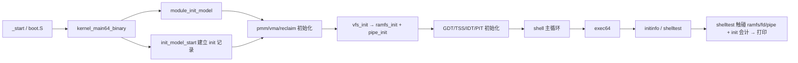

# Lesson 52: 综合用户空间 — init、shell、文件/进程协同与管道（里程碑） — 精讲文档

> **课号**：Lesson 52 ｜ **主题**：把已实现的各教学子系统（init、shell、RAMFS 路径、
> 文件描述符、进程元数据、管道、信号、定时器、推迟工作）编排进一个「用户空间式」的有界
> 协同模型。
> **课程主线位置**：里程碑课——第 34–51 课分别交付了 VFS、进程、管道、中断、时钟、锁、
> 模块边界等子系统，本课第一次用一条命令（`shelltest`）和一份 init 记录把它们
> **串成一个整体**，验证「各子系统不是孤岛，而是可协同的对象」。
> **前置课程**：[../lesson-51-stable/README.md](Lesson 51：模块边界、导出符号与启动初始化)；
> **后续课程**：[../lesson-53-stable/README.md](Lesson 53：受控 shell runtime 与内置用户镜像)。
> **一句话目标**：学完本课你能讲清「init 记录如何成为整个用户空间的会计中枢，
> shell 命令如何一次性触摸路径查找、文件打开、管道状态、进程/信号计数」，
> 并亲手运行 `initinfo`/`shelltest` 验证五子系统协同。

## 1. 课程定位（Mission）

- **一句话目标**：看懂 TinyOS 的综合协同模型——`init_model_start` 在启动时建立
  `init_model`（pid=1、ready=1 的记录），`shelltest` 在一条命令里同时驱动
  RAMFS 路径解析（`/bin/sh`）、文件描述符打开（`fd_open_model`）、管道状态观察
  （`pipe_model.used`）与进程/信号计数，并回写 init 会计；`initinfo` 把这些计数可视化。
- **主线位置**：里程碑课。前 18 课（34–51）各交付一个「子系统」，本课不新增大机制，
  而是建立「协同」这一层：init 记录持有 shell 命令的会计计数，各子系统对象
  （ramfs、fd、pipe、process、signal）通过 `shelltest` 被同一事务同时触碰。
  这也是 53/54 课「受控 shell runtime 与有界执行」的叙事起点。
- **前置知识清单**：
  1. RAMFS 模型：`ramfs_lookup("/bin/sh")` 返回节点号 4（52 课依赖既有 `/bin/sh` 节点）。
  2. fd/file/inode/dentry 四表结构：`fd_open_model(inode,flags)` 返回新 fd。
  3. 管道模型：`pipe_model.used` 表示在队字节数。
  4. 进程/信号模型：`FIXED_PID`、`user_process`、`signal_record`（既有）。
  5. 上一课（51）的模块初始化顺序概念。
- **本课交付**：新增 `initinfo`（查询 init 就绪与协同计数）与 `shelltest`（协同自检）
  两条命令；内核新增 1 个结构体、1 个全局实例、2 个函数，并在 `kernel_main64_binary`
  启动序列里于 `module_init_model()` 之后插入 `init_model_start()`。

## 2. 核心概念精讲

### 2.1 init 任务（init task）——用户空间的「根」

- **定义**：`init_model` 是 pid=1 的 init 记录，字段 `pid,started,commands,files,processes,
  pipes,signals` 与 `ready`。它是整个「用户空间」的会计中枢：shell 每执行一个命令，
  都在 init 记录上累计计数。
- **为什么**：Linux 中 pid 1 的 init 是内核启动后第一个用户进程，负责接管系统、
  繁衍其他进程、收割孤儿（见 54 课）。TinyOS 用一份固定记录建模它的「身份与会计」属性。
- **机制**：`init_model_start()` 在启动早期被调用，`ready=1`；
  `shelltest` 每次运行都会 `commands++`、`processes++`、`signals++` 等。
- **与 Linux 对照**：`init/main.c` 的 `start_kernel`→`kernel_init` 创建 pid 1
  （`kernel_thread(kernel_init)`），后续由它 exec `/sbin/init`。

### 2.2 协同（coordination）——为什么本课是里程碑

之前的课都是「纵深」：每个子系统有自己的 `xxxinfo`/`xxxtest`，互不打扰。
本课第一次要求「一次命令同时证明多个子系统状态一致」：

- 路径子系统说「`/bin/sh` 在 RAMFS 里，节点 4」；
- 文件子系统说「inode 0 可打开，返回 fd 0」；
- 管道子系统说「此刻管道为空（`used==0`）」；
- 进程与信号子系统说「init 记录按事务递增」；
- init 记录说「我 ready 了，命令数 +1」。

如果任何一环坏了，`shelltest` 输出 `BROKEN`。这就是「协同」的教学含义：
**接口契约一致，而不是各自为战**。

### 2.3 有界、确定性、不执行任意内容

README 快照声明：TinyOS **不执行真实 shell 二进制、不把任意命令解析为用户进程、
不访问磁盘文件、不提供无限制 IPC 或用户内存操作**。`shelltest` 的路径解析返回节点号、
fd 打开返回描述符号、管道观察只读 `used`——全是「元数据事务」，零代码执行。
这保证了 250 行内可验证、无副作用、可重复。

### 2.4 数据流的总图（本课主线）

```
启动:  module_init_model() → init_model_start() → pmm/vma/reclaim/vfs(ramfs+pipe)/address_space
        ↓
shell 循环: 键盘 → exec64 → 命令分支
        ↓
shelltest:  ramfs_lookup("/bin/sh") ──→ RAMFS 节点 4
           fd_open_model(0,0) ────────→ fd 0
           pipe_model.used==0 ────────→ 管道空
           init_model 计数回写 ───────→ commands/files/processes/pipes/signals
        ↓
输出:    shelltest: init/shell/file/process/pipe coordination passed
```

第 4 节将按「启动 → 命令 → 各子系统 → 输出」给逐步拆解。

## 3. 源码精讲

### 3.1 文件清单与职责

| 文件 | 职责 | 本课增量（相对 lesson-51） |
| --- | --- | --- |
| `boot.S` | 32→64 位引导、Multiboot2 头、GDT | 未变化 |
| `kernel.c` | 32 位早期初始化 | 未变化（与 51 逐字节相同） |
| `kernel64.c` | 64 位内核主体 | 新增 `init_model` 结构体与 `init_model_start`/`initinfo`/`shelltest`；`kernel_main64_binary` 插入 `init_model_start()`；`exec64` 加 2 个分支 |
| `kernel64.ld` | 64 位裸二进制布局 | 未变化 |
| `linker.ld` | 外层 ELF 布局 | 未变化 |
| `Makefile` | 构建/检查/运行 | `check` 目标更新 grep 断言（含 README 关键字 shell/init/coordination） |
| `grub.cfg` | GRUB 菜单项 | 仅 menuentry 标题更新为 lesson 52 |

### 3.2 新结构体与全局状态

源码原文（`kernel64.c`，第 209–212 行附近）：

```c
struct init_model { u64 pid,started,commands,files,processes,pipes,signals; u8 ready; };
static struct init_model init_model;
static TEXT64 int ramfs_lookup(const char *path);
static TEXT64 int fd_open_model(u32 inode,u64 flags);
```

逐项解读：

- `init_model`：`pid`=init 的进程号（= `FIXED_PID`，即 1）；`started`=启动标志；
  `commands`=已执行命令数；`files`=文件子系统协同结果；`processes`=进程协同计数；
  `pipes`=管道协同计数；`signals`=信号协同计数；`ready`=是否就绪（u8 布尔）。
- `init_model` 全局实例：静态存储，启动早期初始化一次，shell 期只被 `shelltest` 回写。
- 两个前置声明：`ramfs_lookup`（返回 RAMFS 节点号，-1 表示未命中）与
  `fd_open_model`（打开 inode 返回 fd 号，-1 表示失败）——它们是 `shelltest`
  跨子系统的接口契约。

### 3.3 `init_model_start` 与 `initinfo` 精讲

```c
static TEXT64 void init_model_start(void){init_model=(struct init_model){FIXED_PID,1,0,0,0,0,0,1};}
static TEXT64 void initinfo(u16*c){text64(c,"init pid/ready/commands/files/processes/pipes/signals: ");hex64(c,init_model.pid);hex64(c,"/");hex64(c,init_model.ready);hex64(c,"/");hex64(c,init_model.commands);hex64(c,"/");hex64(c,init_model.files);hex64(c,"/");hex64(c,init_model.processes);hex64(c,"/");hex64(c,init_model.pipes);hex64(c,"/");hex64(c,init_model.signals);putc64(c,'\n');}
```

**`init_model_start(void)`**：

1. 用结构体字面量一次完成全部赋值：`pid=FIXED_PID`（1）、`started=1`、六个计数全 0、
   `ready=1`。
2. 调用位置：`kernel_main64_binary` 中紧跟 `module_init_model();`（见 3.6）——
   「模块框架就绪后、内存/文件子系统初始化前」，init 记录先行建立。
3. 幂等：整体赋值保证重复调用结果一致；`ready=1` 是 `shelltest` 最终断言的一部分。

**`initinfo(u16 *c)`**（纯查询）：

1. 输出行格式：`init pid/ready/commands/files/processes/pipes/signals: ` 后跟 7 个
   十六进制字段，字段间用 `/` 分隔，行尾 `\n`。
2. 初值输出形如：`init pid/ready/commands/files/processes/pipes/signals: 1/1/0/0/0/0/0/0`
   （pid=1、ready=1、各计数为 0）。
3. 不修改任何状态；`shelltest` 运行后 `commands`/`processes`/`signals` 等会递增，
   再次调用 `initinfo` 即可观察协同效果。

### 3.4 `shelltest` 精讲（本课核心）

```c
static TEXT64 void shelltest(u16*c){int a=ramfs_lookup("/bin/sh")>=0,b=fd_open_model(0,0)>=0,d=pipe_model.used==0;init_model.commands++;init_model.files+=b;init_model.processes++;init_model.pipes+=d;init_model.signals++;text64(c,"shelltest: ");text64(c,a&&b&&d&&init_model.ready?"init/shell/file/process/pipe coordination passed":"BROKEN");putc64(c,'\n');}
```

逐块解读（把单行源码按逻辑拆开，逐行对齐）：

```c
int a = ramfs_lookup("/bin/sh") >= 0;   // (1) 路径子系统：/bin/sh 命中 RAMFS 节点 4
int b = fd_open_model(0, 0) >= 0;       // (2) 文件子系统：打开 inode 0，取得 fd 0
int d = pipe_model.used == 0;           // (3) 管道子系统：此刻管道为空
init_model.commands++;                  // (4) init 会计：命令数 +1
init_model.files += b;                  // (5) files 累加文件打开结果（成功 +1）
init_model.processes++;                 // (6) processes 计数 +1（进程协同记录）
init_model.pipes += d;                  // (7) pipes 累加管道协同结果（空管道 +1）
init_model.signals++;                   // (8) signals 计数 +1（信号协同记录）
// (9) 最终断言 a && b && d && init_model.ready
```

实质分析：

1. **跨子系统契约**：`ramfs_lookup` 与 `fd_open_model` 是既有函数，`shelltest` 只做
   「返回值 >=0」的判定——这是「路径解析成功 → 可以打开文件」的元数据级模拟。
2. **副作用**：`fd_open_model(0,0)` 会真实占用 fd 0 与 file 槽（`fd_opens++`、
   inode refs++），所以 `shelltest` 可重复运行但 fd 表会累积占用——第二次运行时
   `fd_open_model` 返回 1（下一空槽），`b` 仍为真。这是确定性测试的「软性副作用」，
   可通过 `fdinfo` 观察。
3. **输出串**：四条件全过打印
   `shelltest: init/shell/file/process/pipe coordination passed`，任一失败打印 `BROKEN`。
   `init_model.ready` 参与断言——若 `init_model_start` 未被调用，命令直接失败，
   这是「启动顺序」的又一道验证。

### 3.5 依赖的既有函数（本课读取，不新增）

`shelltest` 依赖的两个函数来自既有课程，本课精讲其契约：

```c
static TEXT64 int ramfs_lookup(const char *path){if(!path||path[0]!='/')return -1;ramfs_lookups++;if(eq64(path,"/")||eq64(path,".")){ramfs_hits++;return 0;}if(eq64(path,"/etc")){ramfs_hits++;return 1;}if(eq64(path,"/etc/motd")){ramfs_hits++;return 2;}if(eq64(path,"/bin")){ramfs_hits++;return 3;}if(eq64(path,"/bin/sh")){ramfs_hits++;return 4;}ramfs_misses++;return -1;}
```

- 路径解析：以 `/` 开头，否则返回 -1；匹配五个内置路径，命中返回对应节点号
  （`/bin/sh` → 4），否则 `ramfs_misses++` 返回 -1。RAMFS 树：0=`/`，1=`/etc`，
  2=`/etc/motd`，3=`/bin`，4=`/bin/sh`。

```c
static TEXT64 int fd_open_model(u32 inode,u64 flags){u32 i;if(inode>=INODE_MAX||!inode_table[inode].valid)return -1;for(i=0;i<FD_MAX;i++)if(!fd_table[i].valid){u32 f;for(f=0;f<FILE_MAX;f++)if(!file_table[f].valid){file_table[f]=(struct file_model){inode,0,flags,1,1};fd_table[i]=(struct fd_model){f,1};inode_table[inode].refs++;fd_opens++;return (int)i;}}return -1;}
```

- 打开 inode 0（flags=0）：找空 fd 槽与空 file 槽，建立 `fd→file→inode` 链，
  递增 inode refs 与 `fd_opens`，返回 fd 号。首调返回 0。

### 3.6 启动序列的改动

源码原文（`kernel_main64_binary` 开头，第 633 行）：

```c
ENTRY64 void kernel_main64_binary(struct long_mode_handoff*h){u16 c=0,n=0;task_names_keep();active_sched_class=&fair_sched_class;sched_enqueues=sched_dequeues=sched_picks=0;module_init_model();init_model_start();pmm_init(h);vma_init();reclaim_init();vfs_init();address_space_init(&kernel_address_space,h);
```

- 本课唯一的改动：`module_init_model();` 之后插入 `init_model_start();`。
- 语义：init 记录在内存管理、VFS（含 ramfs/pipe）之前就绪——模拟 Linux 中
  「kernel_init 尽早建立，供各子系统参照」的叙事。
- 后续初始化链（`pmm_init→vma_init→reclaim_init→vfs_init→address_space_init`）
  与上一课相同；`vfs_init` 内部调用 `ramfs_init` 与 `pipe_init`，
  保证 `shelltest` 触碰的 ramfs/pipe 对象已初始化。

### 3.7 `exec64` 的新命令分支

在 `moduletest` 分支之后新增两段（本课在 `exec64` 的全部增量）：

```c
}else if(eq64(word,"initinfo")){if(!noargs64(arg))usage64(c,"initinfo");else initinfo(c);}
}else if(eq64(word,"shelltest")){if(!noargs64(arg))usage64(c,"shelltest");else shelltest(c);}
```

- 与 49–51 课相同模式：带参数走 `usage64`，无参数调用实现。
- **已知怪癖（如实记录）**：`help` 命令列表、`about`、启动横幅仍未更新（继续显示
  "TinyOS lesson 43"，help 中也没有 initinfo/shelltest）。验证以源码字符串为准。

### 3.8 构建管线（Makefile）

- 编译/链接/ISO 管线与 51 课完全一致，无新增构建步骤。
- `check` 目标断言（本课更新）：
  - `grub-file --is-x86-multiboot2 build/kernel.elf`：Multiboot2 头校验；
  - `grep -q 'shell' README.md`、`grep -q 'init' README.md`、
    `grep -q 'coordination' README.md`——**README 必须包含这三个关键字**（本文均已包含）；
  - `grep -q 'initinfo' kernel64.c`、`grep -q 'shelltest' kernel64.c`；
  - 全部通过打印 `Multiboot2 and lesson 52 checks passed.`
- `run` 目标：`qemu-system-x86_64 -accel tcg -cdrom build/kernel.iso -serial stdio
  -no-reboot -no-shutdown`；VGA 画面在图形窗口，勿加 `-display none`。

### 3.9 主控制流



## 4. 数据流与运行逻辑（里程碑：五子系统协同的完整路径）

本课要求给出 init/shell/文件/进程/管道协同的完整路径。下面从「启动」到「屏幕输出」
逐步拆解一次 `shelltest` 的全部数据流动。

**阶段一：启动建立状态（`kernel_main64_binary`）**

1. `module_init_model()`：登记 core/vfs 模块与 pmm/vfs 导出符号（51 课），
   `module_inits=2`、`module_exports=2`。
2. `init_model_start()`：`init_model={pid=1, started=1, commands=0, files=0, processes=0,
   pipes=0, signals=0, ready=1}`——init 就绪。
3. `pmm_init/vma_init/reclaim_init`：物理内存、VMA、回收元数据就绪。
4. `vfs_init()`：内部 `ramfs_init()` 建 5 节点树（`/bin/sh`=节点 4），`pipe_init()`
   清空 `pipe_model`（`used=0`）——ramfs 与管道对象就绪。
5. 键盘/IDT/PIT 初始化后进入 shell 循环，打印横幅与 `tinyos> ` 提示符。

**阶段二：命令进入（`exec64`）**

6. 键盘输入 `shelltest` 回车 → `cmd[]="shelltest"` → `exec64(&c,h,cmd)` →
   命中 `eq64(word,"shelltest")` 分支 → `shelltest(&c)`。

**阶段三：五子系统协同（`shelltest` 内部）**

7. **路径子系统**：`ramfs_lookup("/bin/sh")` → `ramfs_lookups++` → 与
   `"/bin/sh"` 匹配 → `ramfs_hits++`、返回节点号 4 → `a=true`（`a=4>=0`）。
8. **文件子系统**：`fd_open_model(0,0)` → inode 0 有效 → 找空 fd 槽（0）与空 file 槽（0）
   → `file_table[0]={inode 0, off 0, flags 0, refs 1, valid 1}`、
   `fd_table[0]={file 0, valid 1}`、`inode_table[0].refs++`、`fd_opens++` → 返回 0 → `b=true`。
9. **管道子系统**：`pipe_model.used==0`（启动时 `pipe_init` 清零，此前无写入）→ `d=true`。
10. **进程/信号/init 会计**：`commands++`、`files+=b(=1)`、`processes++`、`pipes+=d(=1)`、
    `signals++`——init 记录五个计数同步递增。
11. **断言与输出**：`a && b && d && init_model.ready` 全真 → 打印
    `shelltest: init/shell/file/process/pipe coordination passed`，换行。

**阶段四：观测（`initinfo`）**

12. 再输入 `initinfo` → 打印
    `init pid/ready/commands/files/processes/pipes/signals: 1/1/1/1/1/1/1`
    （数值为一次 `shelltest` 后的预期，随调用次数累积，格式串以源码为准）。
13. 可配合 `ramfsinfo`（看 `lookups/hits`）、`fdinfo`（看 `fd 0 file 0 inode 1...`）、
    `pipeinfo`（看 `used 0`）逐个子系统核对——每个都被 `shelltest` 真实触碰过。

**要点**：这条路径中没有任何「模拟指令」被伪造——所有计数都来自真实数据结构的
真实读写，只是刻意不执行任何命令内容（元数据事务）。这正是里程碑课与真实 shell 的
关键差距，也是 53/54 课「受控执行」的起点。

## 5. 构建、运行与验证

**依赖**：`gcc`、`ld`、`objcopy`、`grub-mkrescue`、`grub-file`、`qemu-system-x86_64`、`xorriso`。

**构建**（与 Makefile 一致）：

```bash
cd /home/dongyu/.zcode/workspace/default/lessons/lesson-52-stable
make clean && make -j"$(nproc)"
make check
```

**运行**：

```bash
make run
```

**验证步骤**（输出串逐字抄录自源码，屏幕在 QEMU 图形窗口）：

1. 启动后输入 `initinfo` 回车，预期看到（源码第 403 行格式串）：
   `init pid/ready/commands/files/processes/pipes/signals: 1/1/0/0/0/0/0`
2. 输入 `shelltest` 回车，预期输出（源码第 404 行逐字抄录）：
   `shelltest: init/shell/file/process/pipe coordination passed`
3. 再次输入 `initinfo`，观察 `commands/files/processes/pipes/signals` 均变为 1。
4. 交叉验证各子系统：`ramfsinfo`（`/bin/sh` 命中）、`fdinfo`（fd 0 已开）、
   `pipeinfo`（used 0）、`moduleinfo`（51 课）、`softirqinfo`（49 课）逐一确认。
5. `make check` 通过时打印 `Multiboot2 and lesson 52 checks passed.`

## 6. 调试地图

| 现象 | 原因 | 检查方法 |
| --- | --- | --- |
| `shelltest` 显示 `BROKEN` | `a`、`b`、`d`、`ready` 四条件至少一项失败 | 依次排查：`ramfsinfo` 看 `/bin/sh` 是否命中；`fdinfo` 看 fd 表是否被占满；`pipeinfo` 看 `used` 是否非 0；`initinfo` 看 `ready` 是否 1 |
| `a` 失败（`/bin/sh` 未命中） | `ramfs_lookup` 内置路径表不含该串，或 `ramfs_init` 未执行 | 检查 `vfs_init` 是否调用 `ramfs_init`；核对 `ramfs_lookup` 的五个 `eq64` 分支 |
| `b` 失败（fd 打开失败） | fd 表或 file 表被占满（反复运行 `shelltest` 累积） | `fdinfo` 观察已占用槽；fd 槽数 `FD_MAX` 是有限的，占用不释放是模型设计 |
| `d` 失败（管道非空） | `pipe_model.used` 被其他测试（如 `pipetest`）改写未复位 | `pipeinfo` 看 used；必要时重跑 `pipe_init` 或重启虚拟机 |
| `init_model.ready==0` | `init_model_start()` 未被调用 | 检查 `kernel_main64_binary` 中 `module_init_model();init_model_start();` 的顺序 |
| `initinfo` 计数不增长 | `shelltest` 分支未命中或回写被跳过 | 确认输入拼写 `shelltest`；`exec64` 中分支位于 `moduletest` 之后 |
| help/about/横幅仍显示旧课 | 字符串未同步（历史快照行为） | 接受现状；以源码字符串为准，不影响本课功能 |
| `make check` 报 grep 失败 | README 缺 `shell`/`init`/`coordination` 关键字 | `grep -n 'shell\|init\|coordination' README.md` 检查 |

## 7. 与 Linux 源码对照

| 对照点 | TinyOS 教学模型 | Linux 对应实现 | 简化说明 |
| --- | --- | --- | --- |
| init 任务建立 | `init_model_start()`：`init_model={pid=1, ready=1,...}` | `init/main.c` 的 `start_kernel`→`kernel_init`，用 `kernel_thread` 创建 pid 1，再 exec `/sbin/init` | Linux init 是真实可执行进程并繁衍整个用户树；TinyOS 只有会计记录，不执行代码 |
| 早期文件系统交接 | `vfs_init`→`ramfs_init` 建内存树，shell 用 `ramfs_lookup` 找 `/bin/sh` | `init/do_mounts_initrd.c` 的 initrd/initramfs 解包与根挂载（`rootfs`） | Linux 从 initramfs cpio 归档展开真实文件；TinyOS 固定 5 节点内存树 |
| 进程生命周期协同 | `shelltest` 里 `init_model.processes++` 等计数 | `kernel/exit.c` 的进程退出/回收、`wait` 家族与 `do_exit` | Linux 有完整状态机（僵尸/回收/信号传递）；TinyOS 仅计数层面协同，54 课才做 wait/zombie |
| 文件与管道所有权 | `fd_open_model` 建 fd→file→inode 链；`pipe_model.used` 观察 | `fs/file.c`（fdtable、`alloc_fd`）与 `fs/pipe.c`（`pipe_write`/`pipe_read` 与 `pipe->readers/writers`） | Linux fdtable 动态扩展、管道有内核缓冲与唤醒；TinyOS 固定表、无缓冲执行 |
| 进程通知 | `init_model.signals++` 计数协同 | `kernel/signal.c` 的信号产生/递送/捕获框架 | Linux 信号有完整语义（默认动作、挂起、恢复）；TinyOS 只是把「信号」作为协同计数器 |
| 启动顺序 | `module_init_model()`→`init_model_start()`→`pmm/vma/vfs` | `init/main.c` 的固定初始化链（`setup_arch→mm_init→sched_init→init_IRQ→…`） | Linux 链极长且含设备驱动；TinyOS 只显式编码「模块→init→内存→VFS」这一小段 |

**权威来源**：Linux `init/main.c`、`init/do_mounts_initrd.c`、`kernel/exit.c`、`fs/file.c`、
`fs/pipe.c`、`kernel/signal.c`（对照参考）。本课不依赖新硬件规范。

## 8. 思考题与练习

1. **概念理解**：`shelltest` 为什么是「元数据事务」而不是「执行」？
   对照 README 快照声明，说明它验证了哪五类子系统对象的哪五个契约。
2. **源码定位**：在 `kernel64.c` 中找出 `ramfs_lookup` 对 `/bin/sh` 的返回节点号；
   再找出 `vfs_init` 里对 `ramfs_init` 与 `pipe_init` 的调用位置，
   说明 `shelltest` 依赖哪些启动步骤已经发生。
3. **动手实验**：连续运行三次 `shelltest`，然后用 `fdinfo` 观察 fd 表；
   解释为什么 `fd_open_model` 每次仍成功但返回的 fd 号不同（提示：空槽扫描）。
4. **动手实验**：在 `shelltest` 的断言里临时把 `d` 改为
   `pipe_model.used==1`（同时保持管道初始为空），重新构建运行，观察输出变为 `BROKEN`，
   再改回来。这个实验说明什么问题？
5. **Linux 对照**：阅读 `init/main.c` 中 `kernel_init` 的流程，
   对比它「创建 pid 1 → exec init 程序 → 守护孤儿」与 TinyOS `init_model` 的
   会计记录之间，哪些职责被保留、哪些被省略。

## 9. 本课小结与下一课预告

- 本课是里程碑：没有新机制，而是把 49–51 课（推迟工作、锁/原子、模块边界）与更早的
  VFS/进程/管道子系统统一编排进一个「用户空间式」协同模型。
- `init_model`（pid=1、ready=1）成为会计中枢：`initinfo` 把它可视化，
  `shelltest` 每次运行都真实地触碰路径查找、fd 打开、管道状态与进程/信号计数。
- 启动顺序被进一步显式化：`module_init_model()` 之后紧跟 `init_model_start()`，
  再进入内存与 VFS 初始化；`shelltest` 的 `ready` 断言直接验证这一顺序。
- 协同是可观测、可复现、零执行的：所有结果来自真实数据结构，但刻意不执行命令内容——
  这是「有界确定性测试」的设计原则。
- 已知现状：help/about/横幅字符串仍未同步更新，验证以源码为准。
- **下一课预告**：Lesson 53 将首次把「受控 shell runtime」与「内置用户镜像」引入：
  shell 的等待与命令执行将被约束在固定镜像与固定边界内（对照 shell runtime 概念），
  而本课的 init/shell 协同将成为那里「内置镜像被装载并受控执行」的前置叙事。
