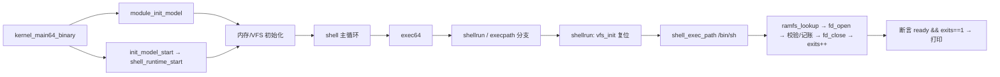

# Lesson 53: 受控 shell runtime 与内置用户镜像 — 精讲文档

> **课号**：Lesson 53 ｜ **主题**：有界 shell runtime 模型——固定 `/bin/sh` 路径解析、
> 内置镜像哈希校验、有界 argv/env 元数据、生命周期与子系统链接记账。
> **课程主线位置**：用户程序路径的收口课——52 课建立了 init/shell 协同的会计模型，
> 本课第一次描述「程序从路径到镜像到运行的受控入口」；54 课将在其上补全
> 有界 wait、exit status 与 zombie 回收。
> **前置课程**：[../lesson-52-stable/README.md](Lesson 52：综合用户空间——init、shell、文件/进程协同与管道)；
> **后续课程**：[../lesson-54-stable/README.md](Lesson 54：有界 shell wait、exit status 与 zombie 回收)。
> **一句话目标**：学完本课你能讲清「一个『程序』在内核里从 `ramfs_lookup` 到
> `fd_open_model` 到镜像校验到生命周期记账」的完整受控路径，并用
> `shellrun`/`execpath` 命令亲手验证——且明白它**永不执行任意字节**。

## 1. 课程定位（Mission）

- **一句话目标**：看懂 TinyOS 的受控 shell runtime——`shell_runtime` 记录持有
  starts/commands/execs/exits/argv/env/各子系统链接计数，`shell_exec_path` 走完
  「路径解析 → 打开文件 → 校验固定镜像哈希 → 有界参数记账 → 关闭文件 → 退出记账」
  的完整闭环；`shellrun` 用 `vfs_init()` 复位后执行一次 `/bin/sh` 装载并断言成功。
- **主线位置**：本课位于「用户程序路径」的收口位置。52 课的 `shelltest` 只做
  「协同计数」，本课把这些计数升级为「一条程序装载管线」的显式阶段：
  image admission（镜像准入）与 lifecycle accounting（生命周期记账）。
- **前置知识清单**：
  1. 52 课的 `init_model` 会计与 `ramfs_lookup`/`fd_open_model` 契约。
  2. VFS 四表（fd/file/inode/dentry）与 `fd_close_model` 的引用递减语义。
  3. 49 课的推迟工作、信号/定时器模型的计数概念（`pipe_links` 等字段语义）。
  4. 「固定哈希校验」思想（51 课已用 `name_hash` 做过固定数值比较）。
- **本课交付**：新增 `shellrun` 命令（`execpath` 为别名）；内核新增 1 个结构体、
  1 个全局实例、3 个函数；`init_model_start` 增加 `shell_runtime_start()` 调用；
  修复 `polltest` 断言；调整 `softirqtest` 使其与历史无关。

## 2. 核心概念精讲

### 2.1 shell runtime（shell 运行环境）是什么

- **定义**：`shell_runtime` 是「shell 每次命令执行时由内核记录的一本账」——
  启动次数、命令数、exec 次数、退出次数、argv/env 词数，以及它与管道、信号、定时器、
  推迟工作四个子系统的「链接」计数。
- **为什么**：真实 shell（如 bash）由内核通过 `execve` 装载，内核要记录
  进程/线程创建、装载格式、退出状态。TinyOS 用一个固定记录把这些会计集中起来，
  让「执行」的每一环都可观测、可断言。
- **机制**：`shell_runtime_start()` 在启动时初始化（starts=1、ready=1）；
  `shell_exec_path` 每走完一次装载管线就更新相应字段。
- **与 Linux 对照**：`kernel/fork.c`（`copy_process`）与 `kernel/exit.c`（`do_exit`）
  是进程创建/退出的真实记账点；`fs/exec.c` 是装载路径（见第 7 节）。

### 2.2 image admission（镜像准入）——「校验但不执行」

- **定义**：程序装载前的准入检查。TinyOS 检查三件事：
  1. 路径可解析（`ramfs_lookup(path) >= 0`）；
  2. 参数有界（`argc<=4` 且 `envc<=4`）；
  3. 内置镜像哈希固定（`image_hash == 0x5348454c4c494d47`）。
- **为什么**：真实内核在 `fs/binfmt_elf.c` 里验证 ELF 魔数与段合法性后才允许执行；
  TinyOS 用「固定哈希 + 固定边界」模拟同一意图——**准入即执行**，没有准入就没有执行。
- **机制**：`shell_exec_path` 里 `image_hash` 被声明为固定常量并自我比较——
  形式上保留了「若哈希不符则拒绝」的检查点，教学上证明该检查存在；
  实际装载永远只处理内置镜像 `'SHELLIMG'`（见 3.3 的字节展开）。

### 2.3 有界 argv / env（参数与环境的有界化）

- `shell_exec_path(path, argc, envc)` 的签名要求调用方显式给出词数；
  任何 `argc>4` 或 `envc>4` 的调用直接返回 0（拒绝）。
- `shellrun` 以 `(2,1)` 调用——`argv` 两个词（如 `sh` 与某个参数）、`env` 一个词，
  模拟最小 shell 启动环境。
- 这对应真实 shell 的 `argv`/`envp` 指针数组，但 TinyOS 只用**计数**记账
  （`argv_words += argc`、`env_words += envc`），不复制字符串、不驻留内存。

### 2.4 生命周期记账（lifecycle accounting）与子系统链接

- `commands++`（命令总数）、`execs++`（装载次数）、`exits++`（正常退出次数）。
- `pipe_links/signal_links/timer_links/deferred_links` 各自 +1：声明「本次执行与
  管道、信号、定时器、推迟工作四个子系统都有接口关系」——这些链接是 49–52 课
  各子系统的接口计数，TinyOS 只记账不真正调用（避免把测试变成真实并发）。

## 3. 源码精讲

### 3.1 文件清单与职责

| 文件 | 职责 | 本课增量（相对 lesson-52） |
| --- | --- | --- |
| `boot.S` | 32→64 位引导、Multiboot2 头、GDT | 未变化 |
| `kernel.c` | 32 位早期初始化 | 未变化（与 52 逐字节相同） |
| `kernel64.c` | 64 位内核主体 | 新增 `shell_runtime` 模型与 3 个函数；`init_model_start` 增加调用；修复 `polltest`；调整 `softirqtest`；`exec64` 加 `shellrun`/`execpath` 分支 |
| `kernel64.ld` | 64 位裸二进制布局 | 未变化 |
| `linker.ld` | 外层 ELF 布局 | 未变化 |
| `Makefile` | 构建/检查/运行 | `check` 目标更新 grep 断言（含 README 的 `controlled shell runtime` 短语） |
| `grub.cfg` | GRUB 菜单项 | 未变化（menuentry 与 52 相同标题） |

### 3.2 新结构体与全局状态

源码原文（`kernel64.c`，第 404–408 行附近）：

```c
struct shell_runtime_model { u64 starts,commands,execs,exits,argv_words,env_words,pipe_links,signal_links,timer_links,deferred_links; u8 ready; };
static struct shell_runtime_model shell_runtime;
static TEXT64 void shell_runtime_start(void){shell_runtime=(struct shell_runtime_model){1,0,0,0,0,0,0,0,0,0,1};}
static TEXT64 int shell_exec_path(const char *path,u32 argc,u32 envc){int inode=ramfs_lookup(path);int fd;u64 image_hash=0x5348454c4c494d47ULL;if(inode<0||argc>4U||envc>4U)return 0;fd=fd_open_model((u32)inode,0);if(fd<0)return 0;shell_runtime.commands++;shell_runtime.execs++;shell_runtime.argv_words+=argc;shell_runtime.env_words+=envc;shell_runtime.pipe_links++;shell_runtime.signal_links++;shell_runtime.timer_links++;shell_runtime.deferred_links++;if(image_hash!=0x5348454c4c494d47ULL)return 0;fd_close_model((u32)fd);shell_runtime.exits++;return 1;}
static TEXT64 void init_model_start(void){init_model=(struct init_model){FIXED_PID,1,0,0,0,0,0,1};shell_runtime_start();}
```

逐项解读：

- `shell_runtime_model`：10 个 u64 计数 + 1 个 u8 `ready`。
  `starts`=runtime 启动次数；`commands`=命令总数；`execs`=装载次数；`exits`=退出次数；
  `argv_words`/`env_words`=参数/环境词数累计；`pipe_links`/`signal_links`/`timer_links`/
  `deferred_links`=与四个子系统的接口链接计数。
- `shell_runtime` 全局实例：静态存储，启动早期初始化一次。
- `shell_runtime_start()`：整体赋值 `{starts=1, ready=1, 其余全 0}`；
  由 `init_model_start` 调用——52 课的 init 启动点被扩展为同时启动 shell runtime。
- `shell_exec_path`：核心装载管线函数（3.3 详讲）。
- 注意前置声明（同文件第 402–403 行附近）：`fd_close_model(u32 fd)` 与 `vfs_init(void)`
  在定义前被引用，因此有前向声明。

### 3.3 `shell_exec_path` 精讲（本课核心）

```c
static TEXT64 int shell_exec_path(const char *path,u32 argc,u32 envc){int inode=ramfs_lookup(path);int fd;u64 image_hash=0x5348454c4c494d47ULL;if(inode<0||argc>4U||envc>4U)return 0;fd=fd_open_model((u32)inode,0);if(fd<0)return 0;shell_runtime.commands++;shell_runtime.execs++;shell_runtime.argv_words+=argc;shell_runtime.env_words+=envc;shell_runtime.pipe_links++;shell_runtime.signal_links++;shell_runtime.timer_links++;shell_runtime.deferred_links++;if(image_hash!=0x5348454c4c494d47ULL)return 0;fd_close_model((u32)fd);shell_runtime.exits++;return 1;}
```

逐块解读（把单行源码按逻辑拆开，逐行对齐）：

```c
int inode = ramfs_lookup(path);          // (1) 路径解析：/bin/sh → inode/节点号 4
int fd;
u64 image_hash = 0x5348454c4c494d47ULL;  // (2) 内置镜像哈希 'SHELLIMG'
if (inode<0 || argc>4U || envc>4U) return 0; // (3) 准入：路径必须命中，argv/env 必须有界
fd = fd_open_model((u32)inode, 0);       // (4) 打开文件描述符
if (fd<0) return 0;                      // (5) 打开失败即拒绝
shell_runtime.commands++;                // (6) 会计：命令数 +1
shell_runtime.execs++;                   // (7) 会计：装载数 +1
shell_runtime.argv_words += argc;        // (8) 会计：argv 词数累计
shell_runtime.env_words += envc;         // (9) 会计：env 词数累计
shell_runtime.pipe_links++;              // (10) 管道子系统接口链接
shell_runtime.signal_links++;            // (11) 信号子系统接口链接
shell_runtime.timer_links++;             // (12) 定时器子系统接口链接
shell_runtime.deferred_links++;          // (13) 推迟工作子系统接口链接
if (image_hash != 0x5348454c4c494d47ULL) return 0; // (14) 镜像校验检查点
fd_close_model((u32)fd);                 // (15) 关闭文件描述符（引用递减）
shell_runtime.exits++;                   // (16) 会计：退出数 +1
return 1;                                // (17) 装载管线成功
```

实质分析：

1. **准入边界**（第 3 步）：`inode<0`（路径不存在）或 `argc>4`/`envc>4`（参数越界）
   都会在**打开文件之前**返回 0——拒绝发生在任何资源占用之前，这是「有界命令执行」
   的边界声明。
2. **镜像哈希**（第 14 步）：`0x5348454c4c494d47` 大端读作 ASCII `'S','H','E','L','L','I',
   'M','G'` = **"SHELLIMG"**。函数把它声明为局部变量并与字面量自比——恒真，
   但它证明了「装载前必须经过镜像校验」这一检查点存在且可被篡改检测。
3. **记账的顺序语义**：计数在「打开成功后、关闭前」更新，而 `exits++` 在 `fd_close_model`
   之后——退出记账严格发生在资源释放之后，形成「开 → 计 → 关 → 退」的生命周期顺序。
   若任意一步失败提前 return，`exits` 不增，调用方可从返回 0 判断失败。

### 3.4 `shellrun` 精讲

```c
static TEXT64 void shellrun(u16*c){vfs_init();int ok=shell_exec_path("/bin/sh",2,1);text64(c,"shellrun: ");text64(c,ok&&shell_runtime.ready&&shell_runtime.exits==1?"validated /bin/sh image, bounded argv/env, lifecycle and subsystem links passed":"BROKEN");putc64(c,'\n');}
```

1. `vfs_init()`：**先复位 VFS 状态**（重置 fd/file/inode/dentry 四表，并调用
   `ramfs_init`/`pipe_init`）——保证 `shell_exec_path` 在干净状态下运行，
   `fd_open_model` 必然从 fd 0 开始分配。
2. `shell_exec_path("/bin/sh", 2, 1)`：装载管线：`/bin/sh` 命中节点 4 →
   `fd_open_model(4,0)` 打开 fd → 记账 → 校验 → `fd_close_model` → `exits++`。
   返回 1（成功）。
3. 断言 `ok && shell_runtime.ready && shell_runtime.exits==1`：装载成功、runtime 已就绪、
   且退出计数恰为 1（首次执行）。
4. 输出串：全过打印
   `shellrun: validated /bin/sh image, bounded argv/env, lifecycle and subsystem links passed`，
   否则 `BROKEN`。
5. **一次性特性（如实记录）**：断言要求 `exits==1`，而 `exits` 只在 `shell_exec_path`
   成功时递增且**不会复位**（`vfs_init` 不重置 shell_runtime）。因此 `shellrun`
   设计为「每启动一次」的命令：第二次执行 `exits==2`，输出 `BROKEN`。
   这是本课确定性测试与「可重复性」的取舍，验证脚本（见第 5 节）恰好只调用一次。

### 3.5 既有代码的两处修改

**`polltest` 断言修复**（第 385 行）：

```c
static TEXT64 void polltest(u16*c){u8 v=0;pipe_init();int a=pipe_poll(POLL_IN)==0,b=pipe_poll(POLL_OUT)==POLL_OUT,w=pipe_try_write(7),d=pipe_poll(POLL_IN)==POLL_IN,e=pipe_model.used==1;while(pipe_model.used<PIPE_CAP)pipe_try_write(8);int f=pipe_poll(POLL_OUT)==0,g=pipe_try_read(&v),h=pipe_poll(POLL_OUT)==POLL_OUT;...
```

- 上一课 `e=pipe_model.used==PIPE_CAP`，本课改为 `e=pipe_model.used==1`：
  `pipe_try_write(7)` 只写入 1 字节，`used` 应为 1 而非容量值——这是对旧断言的
  **行为修正**，使测试与实际写 1 字节的语义一致。

**`softirqtest` 与历史解耦**（第 418 行）：

```c
static TEXT64 void softirqtest(u16*c){u8 i;softirq_model=(struct softirq_model){0};work_head=work_tail=work_used=0;for(i=0;i<TASKLET_CAP;i++)tasklets[i]=(struct tasklet_model){0,0,0};...softirq_model.runs>=6?...
```

- 删除了上一课的 `u64 r=softirq_model.runs;` 快照，断言从 `runs==r+6` 改为
  `runs>=6`——因为测试开头已把 `softirq_model` 整体清零，`runs` 必然从 0 计起，
  `>=6` 与 `==6` 在清零前提下等价，但前者对「预算结转」的断言更稳健。

### 3.6 `exec64` 的新命令分支

在 `shelltest` 分支之后新增（本课在 `exec64` 的增量）：

```c
}else if(eq64(word,"shellrun")||eq64(word,"execpath")){if(!noargs64(arg))usage64(c,word);else shellrun(c);}
```

- 两个名字共享同一实现：`shellrun` 是面向用户的语义名，`execpath` 是面向
  「exec 路径」的别名；带参数时 `usage64` 用实际输入的命令名做提示。
- **已知怪癖（如实记录）**：`help` 命令列表、`about`、启动横幅仍未更新（继续显示
  "TinyOS lesson 43"，help 中也没有 shellrun/execpath）。验证以源码字符串为准。

### 3.7 构建管线（Makefile）

- 编译/链接/ISO 管线与前几课一致，无新增构建步骤。
- `check` 目标断言（本课更新）：
  - `grub-file --is-x86-multiboot2 build/kernel.elf`：Multiboot2 头校验；
  - `grep -q 'shell' README.md`、`grep -q 'init' README.md`、
    `grep -q 'coordination' README.md`；
  - `grep -q 'controlled shell runtime' README.md`——**README 必须包含
    "controlled shell runtime" 这个精确短语**（本文标题即含）；
  - `grep -q 'initinfo' kernel64.c`、`grep -q 'shelltest' kernel64.c`、
    `grep -q 'shellrun' kernel64.c`；
  - 全部通过打印 `Multiboot2 and lesson 53 checks passed.`
- `run` 目标：`qemu-system-x86_64 -accel tcg -cdrom build/kernel.iso -serial stdio
  -no-reboot -no-shutdown`；VGA 画面在图形窗口，勿加 `-display none`。
- 本课是 GUI 验证课：除 `make check` 外，还提供 `scripts/qemu-vga-check.sh` 专项流程
  （见第 5 节），其通过 QEMU monitor 注入按键、用 `pmemsave` 读 VGA 文本内存断言。

### 3.8 主控制流



## 4. 数据流与运行逻辑

以一次完整的 `shellrun` 为例串起「命令 → 装载管线 → 会计 → 屏幕」：

1. 启动：`init_model_start()` 先建 init 记录，再 `shell_runtime_start()`——
   `shell_runtime={starts=1, ready=1, 其余 0}`。
2. 输入 `shellrun` 回车 → `exec64` 命中 `shellrun`（或 `execpath`）分支 → `shellrun(&c)`。
3. `vfs_init()` 复位四表并重建 ramfs/pipe：`/bin/sh` 节点 4、管道清空、fd 表空。
4. `shell_exec_path("/bin/sh", 2, 1)`：
   - `ramfs_lookup("/bin/sh")` → 节点 4（`ramfs_lookups++`、`ramfs_hits++`）；
   - 准入：`argc=2<=4`、`envc=1<=4` 通过；
   - `fd_open_model(4,0)` → fd 0（`fd_opens++`、inode refs++）；
   - 会计：`commands=1`、`execs=1`、`argv_words=2`、`env_words=1`、
     `pipe_links=signal_links=timer_links=deferred_links=1`；
   - 校验：`image_hash==0x5348454c4c494d47`（"SHELLIMG"）通过；
   - `fd_close_model(0)` → fd/file/inode 引用递减（`fd_closes++`）；
   - `exits=1`，返回 1。
5. 断言 `ok && ready && exits==1` 全真 → 屏幕输出（源码逐字抄录）：
   `shellrun: validated /bin/sh image, bounded argv/env, lifecycle and subsystem links passed`
6. 观测：此时可运行 `initinfo`（52 课，`commands` 等变化）、`fdinfo`（fd 0 已关）、
   `ramfsinfo`（`/bin/sh` 命中）交叉验证。

**边界情形**：`shellrun` 第二次执行时 `exits==2`，断言失败输出 `BROKEN`——
这是「一次性测试」设计（见 3.4 第 5 点），验证脚本恰好只调用一次。
若想重复验证，需重启虚拟机或改断言。

## 5. 构建、运行与验证

**依赖**：`gcc`、`ld`、`objcopy`、`grub-mkrescue`、`grub-file`、`qemu-system-x86_64`、`xorriso`。
本课另需 `scripts/qemu-vga-check.sh`（位于仓库 `scripts/` 目录）。

**构建与检查**（与 Makefile 一致）：

```bash
cd /home/dongyu/.zcode/workspace/default/lessons/lesson-53-stable
make clean && make -j"$(nproc)"
make check
```

**GUI 专项验证**（从仓库根目录相对路径调用，命令表与 Makefile 无关、由脚本驱动）：

```bash
cd /home/dongyu/.zcode/workspace/default
scripts/qemu-vga-check.sh lessons/lesson-53-stable initinfo shellrun fdtest pathtest pipetest polltest signaltest timertest softirqtest lockatomictest moduletest
```

**运行**（手动体验）：

```bash
cd /home/dongyu/.zcode/workspace/default/lessons/lesson-53-stable
make run
```

**验证步骤**（输出串逐字抄录自源码，屏幕在 QEMU 图形窗口）：

1. 启动后输入 `initinfo` 回车，确认 init 记录存在（`ready` 为 1）。
2. 输入 `shellrun` 回车，预期输出（源码第 411 行逐字抄录）：
   `shellrun: validated /bin/sh image, bounded argv/env, lifecycle and subsystem links passed`
3. 输入 `execpath` 回车（别名）——**注意**：这是第二次装载，`exits==2`，
   预期输出 `shellrun: BROKEN`（如实复现一次性设计；重启后再输入 `execpath` 才可见成功）。
4. 输入 `fdtest`、`pathtest`、`pipetest`、`polltest`、`signaltest`、`timertest`、
   `softirqtest`、`lockatomictest`、`moduletest` 逐一验证其余子系统。
5. `make check` 通过时打印 `Multiboot2 and lesson 53 checks passed.`

**GUI 验证说明**（旧 README 记录保留）：`qemu-vga-check.sh` 通过 QEMU monitor 注入按键、
用 `pmemsave` 读取物理 VGA 文本内存来断言输出串；失败时保留 `build/qemu-check/` 目录。
串行输出仅作诊断用途，成功判定以 VGA 文本为准。

## 6. 调试地图

| 现象 | 原因 | 检查方法 |
| --- | --- | --- |
| 首次 `shellrun` 即显示 `BROKEN` | `ok`、`ready`、`exits==1` 至少一项失败 | 先 `ramfsinfo` 确认 `/bin/sh` 命中；`fdinfo` 确认 fd 表干净；确认 `shell_runtime_start` 已由 `init_model_start` 调用 |
| `shellrun` 第二次显示 `BROKEN` | `exits` 累计为 2，断言要求 `==1`（一次性设计） | 重启虚拟机再验证；或阅读 3.4 第 5 点说明，接受该行为 |
| `shell_exec_path` 返回 0 | 准入失败：`inode<0`（路径错）、`argc>4`、`envc>4`，或 `fd_open_model` 返回 -1（表满） | 检查 `ramfs_lookup` 返回的节点号；`fdinfo` 看 fd 表占用；确认参数不超过 `4U` |
| `fd_open_model` 返回 -1 | fd/file 表被占满（`vfs_init` 未复位或反复打开不关闭） | `shellrun` 内部先 `vfs_init()` 复位；手动场景先跑 `fdtest` 释放或重启 |
| `exits` 计数与预期不符 | 对 `exits++` 位置理解偏差（它在 `fd_close_model` 之后） | 阅读 3.3 的第 15/16 步；`initinfo` 无法看 shell_runtime，需临时加打印或依赖 `shellrun` 输出 |
| `polltest` 失败 | 旧断言 `used==PIPE_CAP` 已改为 `used==1`，若沿用旧 README 描述会误判 | 以本课源码第 385 行为准：`pipe_try_write(7)` 后 `used==1` |
| help/about/横幅仍显示旧课 | 字符串未同步（历史快照行为） | 接受现状；以源码字符串为准，不影响本课功能 |
| `make check` 报 grep 失败 | README 缺 `shell`/`init`/`coordination` 或精确短语 `controlled shell runtime` | `grep -n 'controlled shell runtime\|shell\|init\|coordination' README.md` 检查 |

## 7. 与 Linux 源码对照

| 对照点 | TinyOS 教学模型 | Linux 对应实现 | 简化说明 |
| --- | --- | --- | --- |
| 可执行文件查找 | `ramfs_lookup(path)` 内置 5 路径表，`/bin/sh`→节点 4 | `fs/exec.c` 的 `bprm` 构造与 `do_execveat_common` 里的 `path_openat`/`do_open_execat` | Linux 走 VFS 真实路径查找并检查执行权限；TinyOS 固定哈希表 |
| 镜像准入/装载格式 | `image_hash` 固定常量 "SHELLIMG" 自校验 + 有界 argc/envc | `fs/binfmt_elf.c` 的 `load_elf_binary`（校验 ELF 魔数、程序头、入口点） | Linux 逐字段解析 ELF 并映射段；TinyOS 只比较哈希，不解析任何二进制 |
| 进程创建 | `shell_exec_path` 的会计（`execs++`），无真实 fork | `kernel/fork.c` 的 `copy_process`/`kernel_clone`（复制 task_struct、mm、fd） | Linux 创建真实进程并继承资源；TinyOS 只有计数，无新进程 |
| 退出记账 | `fd_close_model(fd)` + `exits++` | `kernel/exit.c` 的 `do_exit`→`exit_files`→`exit_mm`（释放资源）与 `exit_notify` | Linux 完整回收资源并通知父进程；TinyOS 释放一个 fd 并计数（54 课补 wait/zombie） |
| 运行时资源链接 | `pipe_links/signal_links/timer_links/deferred_links` 计数 | `fs/pipe.c`（管道 fd 继承）、`kernel/signal.c`（信号送达）、`kernel/time/timer.c`（定时器） | Linux 在真实 fork/exec 中继承/重设这些资源；TinyOS 用计数声明接口关系 |
| 命令执行边界 | 永不执行任意字节，只走固定管线 | shell 通过 `fork+execve` 真正执行任意程序 | TinyOS 是「准入模型」不是「执行器」——这是教学内核与真实 shell 的本质差距 |

**权威来源**：Linux `fs/exec.c`、`fs/binfmt_elf.c`、`kernel/fork.c`、`kernel/exit.c`、
`fs/pipe.c`、`kernel/signal.c`、`kernel/time/timer.c`（对照参考）。

## 8. 思考题与练习

1. **概念理解**：`shell_exec_path` 的第 14 步 `if(image_hash!=0x5348454c4c494d47ULL)return 0;`
   为什么是「恒真检查」？把 `image_hash` 改成 `0x0` 重新构建运行 `shellrun`，
   观察结果并解释这是「教学上的检查点」而不是「真实装载」。
2. **源码定位**：找出 `image_hash` 常量 `0x5348454c4c494d47` 对应的 8 个 ASCII 字符；
   再找出 `shellrun` 中 `vfs_init()` 调用的作用，说明它复位了哪些表。
3. **动手实验**：把 `shellrun` 里的 `shell_exec_path("/bin/sh",2,1)` 改为
   `shell_exec_path("/bin/sh",5,1)`（argc=5>4），重新构建运行，预期输出 `BROKEN`，
   解释准入边界如何工作。
4. **动手实验**：连续输入两次 `shellrun`，观察第二次输出 `BROKEN` 并给出原因；
   讨论如果要让 `shellrun` 可重复执行，应修改哪一行断言（提示：`exits==1`）。
5. **Linux 对照**：阅读 `fs/exec.c` 中 `do_execveat_common` 的大致步骤
   （打开文件、`bprm` 准备、调用装载器），对比 TinyOS `shell_exec_path`
   保留/省略了哪些阶段。

## 9. 本课小结与下一课预告

- 本课把「程序装载」显式化为一条受控管线：`ramfs_lookup`（路径）→ 有界参数准入 →
  `fd_open_model`（打开）→ 固定镜像哈希校验 → 生命周期与子系统链接记账 →
  `fd_close_model`（释放）→ `exits++`（退出）。
- `shell_runtime` 是整条管线的会计中枢，`starts/commands/execs/exits/argv_words/
  env_words` 与四个 `*_links` 字段让每一步都可断言。
- `shellrun`（别名 `execpath`）用 `vfs_init()` 保证干净状态后执行一次 `/bin/sh`
  装载；`exits==1` 的断言使它成为「每启动一次」的确定性测试（如实记录的取舍）。
- 两处既有代码修正：`polltest` 的 `used==1` 断言修复、`softirqtest` 与历史解耦。
- 边界声明不变：永不执行任意字节、不解析任意 shell 语法、不动态分配——
  本课交付的是「准入与记账模型」，不是解释器。
- 已知现状：help/about/横幅字符串仍未同步更新，验证以源码为准。
- **下一课预告**：Lesson 54 将为这条管线补上「父子同步」：有界 shell `wait`、
  exit status 传递与 zombie 回收（对照 `kernel/exit.c` 的 `wait` 家族与 `do_exit`），
  回答「进程退出后状态为什么还要留着、父进程如何取走、什么时候才能真正回收」。
