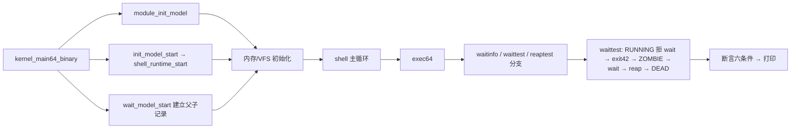

# Lesson 54: 有界 shell wait、exit status 与 zombie 回收 — 精讲文档

> **课号**：Lesson 54 ｜ **主题**：受控 shell runtime 的父子同步收尾——单一固定
> 父子关系的 wait 语义、exit status 发布、zombie 状态与 reap 回收。
> **课程主线位置**：用户程序/进程生命周期段（第 3 阶段收尾）——53 课完成了
> 「程序装载管线」（shell_exec_path），本课回答「子进程退出之后呢？」：
> 退出码保存在哪、父进程如何取走、什么时候真正回收。
> **前置课程**：[../lesson-53-stable/README.md](Lesson 53：受控 shell runtime 与内置用户镜像)；
> **后续课程**：[../lesson-55-stable/README.md](Lesson 55：阻塞 wait/wake 与 WNOHANG)。
> **一句话目标**：学完本课你能讲清 Linux 进程的
> `RUNNING → ZOMBIE → (父进程 wait) → DEAD` 生命周期在教学内核里的有界模型，
> 并用 `waitinfo`/`waittest`（别名 `reaptest`）亲手验证退出码发布、zombie 选择与回收。

## 1. 课程定位（Mission）

- **一句话目标**：看懂 TinyOS 的 wait 模型——`wait_model` 记录一对固定父子
  （parent=init/pid 1、child=pid 2），`wait_model_exit` 发布退出码并进入 `WAIT_ZOMBIE`，
  `wait_model_wait` 只在 zombie 态选中它，`wait_model_reap` 在「已 wait 且 zombie」时
  才转入 `WAIT_DEAD`；`waittest` 把整个生命周期串成自检。
- **主线位置**：本课为 49–53 的「推迟工作→锁→模块→协同→装载」链路补上进程生命周期的
  **终点**：为什么进程退出后不能立刻消失、为什么必须等父进程取走状态。
  55 课将在此基础上做「wait-before-exit 的阻塞等待与 WNOHANG」。
- **前置知识清单**：
  1. 53 课的 `shell_runtime` 与 `exits++`（退出记账的既有约定）。
  2. Linux 进程状态枚举：`TASK_RUNNING`/`EXIT_ZOMBIE`/`EXIT_DEAD`
     （`kernel64.c` 第 112 行附近的 `enum task_state` 早已定义这些值）。
  3. `FIXED_PID`=1 与 `SECOND_PID`=2（52/53 课 init 模型的 pid 约定）。
  4. 状态机思想：合法迁移有先后（exit→wait→reap），非法迁移被拒绝。
- **本课交付**：新增 `waitinfo`（查询父子状态）与 `waittest`（别名 `reaptest`，
  生命周期自检）两条命令；内核新增 1 个结构体、1 个全局实例、4 个状态常量、
  5 个函数，并在 `kernel_main64_binary` 里于 `init_model_start()` 之后插入
  `wait_model_start()`。

## 2. 核心概念精讲

### 2.1 为什么进程退出后不能立刻「消失」

- **定义**：子进程执行 `exit(code)` 时，内核把退出码保存在进程表里、把状态标为
  zombie，然后**保留进程记录**等父进程来读；父进程调用 `wait()` 取走状态后，
  记录才真正被回收。
- **为什么**：父进程需要知道「我的孩子以什么码退出」（0 通常表示成功）。
  如果内核在孩子一 exit 就销毁记录，退出码就永远丢了。这就是 zombie（僵尸）
  存在的意义：**一个只含退出状态的空壳**。
- **机制**（TinyOS 三步）：`wait_model_exit(code)` 发布状态并变 zombie →
  `wait_model_wait()` 观察（`waited=1`）→ `wait_model_reap()` 回收变 dead。
- **示意图**：

```
   [RUNNING] --exit(42)--> [ZOMBIE, exit_code=42] --wait--> [ZOMBIE, waited=1]
                               ^                                    |
                         不能直接回收                       --reap--> [DEAD]
```

`reap` 要求 `waited && state==ZOMBIE`——**必须先 wait 才能 reap**，
否则状态会丢失。这是 Linux `wait` 语义的核心约束。

### 2.2 exit status（退出状态）的发布

- `exit_code` 是 `wait_model` 的一个 u64 字段，`wait_model_exit` 只允许在
  `WAIT_RUNNING` 态写入（「运行中的进程才能自杀退出」）。
- `waittest` 用退出码 42 做验证：`b=wait_model_exit(42)` 后，
  `e` 断言 `state==WAIT_ZOMBIE && exit_code==42`——状态与码同时被检查。
- 与 Linux 的对应：`kernel/exit.c` 的 `do_exit` 里 `set_task_state` + 记录
  `exit_code`，父进程经 `wait` 读出。TinyOS 用固定字段，不编码信号位等额外信息。

### 2.3 zombie 与回收（reaping）

- **有界性**：Linux 的 zombie 可能堆积（父进程不 wait），内核允许它们占着
  pid 与少量内存直到父进程退出后被 init 收养回收。TinyOS 只有**一对固定父子**，
  所以 zombie 至多一个——这就是「有界」的落点：无 pid 池、无进程表扫描。
- **顺序约束**：`wait_model_reap` 检查 `waited && state==WAIT_ZOMBIE`；
  `wait_model_wait` 检查 `state==WAIT_ZOMBIE`。两条都是「拒绝非法迁移」的边界。
- `waittest` 的第一步 `a=!wait_model_wait()` 专门验证「还没 exit 就 wait 是失败的」——
  对应 Linux 中「wait 没有可收割子进程时阻塞/返回错误」的有界版。

### 2.4 与既有状态枚举的关系

`kernel64.c` 早已定义（51 课引入）：

```c
enum task_state { TASK_RUNNING=0, ..., EXIT_DEAD=16, EXIT_ZOMBIE=32 };
```

本课用一组独立的 `WAIT_*` 常量（`WAIT_RUNNING=1/WAIT_ZOMBIE=2/WAIT_DEAD=3`）表达
「wait 对象自己的状态机」。两者同构（running→zombie→dead），但一个在 task 表、
一个在 wait 记录里——这是「父子关系元数据」独立于「任务状态」的教学分层。

## 3. 源码精讲

### 3.1 文件清单与职责

| 文件 | 职责 | 本课增量（相对 lesson-53） |
| --- | --- | --- |
| `boot.S` | 32→64 位引导、Multiboot2 头、GDT | 未变化 |
| `kernel.c` | 32 位早期初始化 | 未变化（与 53 逐字节相同） |
| `kernel64.c` | 64 位内核主体 | 新增 `wait_model` 与 5 个函数；`kernel_main64_binary` 插入 `wait_model_start()`；`exec64` 加 `waitinfo`/`waittest`/`reaptest` 分支 |
| `kernel64.ld` | 64 位裸二进制布局 | 未变化 |
| `linker.ld` | 外层 ELF 布局 | 未变化 |
| `Makefile` | 构建/检查/运行 | `check` 目标更新 grep 断言（含 README 的 `bounded shell wait` 短语） |
| `grub.cfg` | GRUB 菜单项 | 未变化（menuentry 与 52/53 相同标题） |

### 3.2 新结构体、常量与全局状态

源码原文（`kernel64.c`，第 412–419 行附近）：

```c
struct wait_model { u64 parent_pid,child_pid,exit_code,wait_calls,reaps,statuses; u8 state,waited; };
static struct wait_model wait_model;
#define WAIT_RUNNING 1U
#define WAIT_ZOMBIE 2U
#define WAIT_DEAD 3U
static TEXT64 void wait_model_start(void){wait_model=(struct wait_model){FIXED_PID,SECOND_PID,0,0,0,0,WAIT_RUNNING,0};}
```

逐项解读：

- `wait_model`：`parent_pid`=父进程（`FIXED_PID`=1，即 init）；
  `child_pid`=子进程（`SECOND_PID`=2）；`exit_code`=退出码；`wait_calls`=wait 调用计数；
  `reaps`=回收计数；`statuses`=状态发布计数；`state`（u8）=`WAIT_*` 状态；
  `waited`（u8）=父进程是否已取走状态。
- `WAIT_RUNNING/WAIT_ZOMBIE/WAIT_DEAD`：三态常量，与 `enum task_state` 的
  `TASK_RUNNING/EXIT_ZOMBIE/EXIT_DEAD` 语义同构（见 2.4）。
- `wait_model_start()`：整体赋值 `{parent=1, child=2, 计数全 0, WAIT_RUNNING, 未 wait}`；
  由 `kernel_main64_binary` 在 `init_model_start()` 之后调用（见 3.5）。

### 3.3 wait 三函数精讲

```c
static TEXT64 int wait_model_exit(u64 code){if(wait_model.state!=WAIT_RUNNING)return 0;wait_model.exit_code=code;wait_model.state=WAIT_ZOMBIE;wait_model.statuses++;return 1;}
static TEXT64 int wait_model_wait(void){wait_model.wait_calls++;if(wait_model.state!=WAIT_ZOMBIE)return 0;wait_model.waited=1;return 1;}
static TEXT64 int wait_model_reap(void){if(!wait_model.waited||wait_model.state!=WAIT_ZOMBIE)return 0;wait_model.state=WAIT_DEAD;wait_model.reaps++;return 1;}
```

**`wait_model_exit(u64 code)`**（子进程退出）：

1. 前置检查：`state!=WAIT_RUNNING` 时直接返回 0——只有运行中的记录能退出，
   防止「重复 exit」或「僵尸再 exit」。
2. 三连赋值：`exit_code=code`（发布状态）、`state=WAIT_ZOMBIE`（进入僵尸态）、
   `statuses++`（发布计数）。
3. 返回 1 表示发布成功。这是整个 wait 状态机的「入口」，模拟 `do_exit` 的记录段。

**`wait_model_wait(void)`**（父进程等待）：

1. 无条件 `wait_calls++`——每次 wait 尝试都被记录（可观测）。
2. 前置检查：`state!=WAIT_ZOMBIE` 时返回 0——子进程还在跑（`WAIT_RUNNING`）
   或已被回收（`WAIT_DEAD`）都不能取到状态。
3. 成功后 `waited=1` 返回 1。注意它**不改变 state**：zombie 保持 zombie，
   直到 reap 才转 dead——这正是「wait 只取走状态、reap 才回收记录」的语义分离。

**`wait_model_reap(void)`**（回收）：

1. 前置检查双条件：`!waited`（父进程还没取状态）或 `state!=WAIT_ZOMBIE` 都返回 0。
2. 满足后 `state=WAIT_DEAD`（最终态）、`reaps++`。
3. 设计动机：`waited` 前置强制「先 wait 再 reap」的合法顺序——直接 reap 一个
   未被观察的 zombie 会丢失退出码，这正是 Linux 禁止的行为（`kernel/exit.c` 里
   `wait` 是回收的必经之路）。

### 3.4 `waitinfo` 与 `waittest` 精讲

```c
static TEXT64 void waitinfo(u16*c){text64(c,"wait parent/child/state/code/calls/reaps: ");hex64(c,wait_model.parent_pid);hex64(c,"/");hex64(c,wait_model.child_pid);hex64(c,"/");hex64(c,wait_model.state);hex64(c,"/");hex64(c,wait_model.exit_code);hex64(c,"/");hex64(c,wait_model.wait_calls);hex64(c,"/");hex64(c,wait_model.reaps);putc64(c,'\n');}
static TEXT64 void waittest(u16*c){wait_model_start();int a=!wait_model_wait(),b=wait_model_exit(42),d=wait_model_wait(),e=wait_model.state==WAIT_ZOMBIE&&wait_model.exit_code==42,f=wait_model_reap(),g=wait_model.state==WAIT_DEAD;text64(c,"waittest: ");text64(c,a&&b&&d&&e&&f&&g?"bounded wait, exit status, zombie selection, and reap passed":"BROKEN");putc64(c,'\n');}
```

**`waitinfo(u16 *c)`**（纯查询）：

1. 输出行格式：`wait parent/child/state/code/calls/reaps: ` 后跟 6 个十六进制字段，
   字段间 `/` 分隔，行尾 `\n`。
2. 初值输出形如：`wait parent/child/state/code/calls/reaps: 1/2/1/0/0/0`
   （父 1、子 2、state=1=WAIT_RUNNING、exit_code 0、calls 0、reaps 0）。
3. 不修改任何状态，可在生命周期任意时刻调用观察。

**`waittest(u16 *c)`** 逐步解读（完整生命周期剧本）：

1. `wait_model_start()`：**先复位**——所以 `waittest` 可重复执行（与 53 课
   `shellrun` 的一次性设计不同）。
2. `a = !wait_model_wait()`：在 RUNNING 态调用 wait → 返回 0 → `a=1`。
   验证「子进程未退出时 wait 取不到状态」。
3. `b = wait_model_exit(42)`：发布退出码 42、进 zombie → 返回 1。
4. `d = wait_model_wait()`：zombie 态 wait 成功，`waited=1` → 返回 1。
5. `e = state==WAIT_ZOMBIE && exit_code==42`：确认「仍是 zombie 且退出码正确保留」。
6. `f = wait_model_reap()`：`waited && ZOMBIE` → 转 DEAD、`reaps++` → 返回 1。
7. `g = state==WAIT_DEAD`：确认最终态。
8. 输出串：六条件全过打印
   `waittest: bounded wait, exit status, zombie selection, and reap passed`，
   否则 `BROKEN`。

### 3.5 启动序列的改动

源码原文（`kernel_main64_binary` 开头，第 656 行）：

```c
ENTRY64 void kernel_main64_binary(struct long_mode_handoff*h){u16 c=0,n=0;task_names_keep();active_sched_class=&fair_sched_class;sched_enqueues=sched_dequeues=sched_picks=0;module_init_model();init_model_start();wait_model_start();pmm_init(h);vma_init();reclaim_init();vfs_init();address_space_init(&kernel_address_space,h);
```

- 本课唯一的改动：`init_model_start();` 之后插入 `wait_model_start();`。
- 语义：父子 wait 关系在内存/VFS 初始化之前就绪——与 init、shell_runtime 的启动
  顺序一致（模块→init→wait→内存→VFS），构成「用户空间协调对象先行」的启动链。

### 3.6 `exec64` 的新命令分支

在 `shellrun`/`execpath` 分支之后新增两段（本课在 `exec64` 的全部增量）：

```c
}else if(eq64(word,"waitinfo")){if(!noargs64(arg))usage64(c,"waitinfo");else waitinfo(c);}
}else if(eq64(word,"waittest")||eq64(word,"reaptest")){if(!noargs64(arg))usage64(c,word);else waittest(c);}
```

- `waitinfo` 独立；`waittest` 与 `reaptest` 共享同一实现（`reaptest` 强调「回收」视角）。
- **已知怪癖（如实记录）**：`help` 命令列表、`about`、启动横幅仍未更新（继续显示
  "TinyOS lesson 43"，help 中也没有 waitinfo/waittest/reaptest）。验证以源码字符串为准。

### 3.7 构建管线（Makefile）

- 编译/链接/ISO 管线与前几课一致，无新增构建步骤。
- `check` 目标断言（本课更新）：
  - `grub-file --is-x86-multiboot2 build/kernel.elf`：Multiboot2 头校验；
  - `grep -q 'shell' README.md`、`grep -q 'parent' README.md`、
    `grep -q 'status' README.md`、`grep -q 'zombie' README.md`——
    **README 必须包含这四个关键字**；
  - `grep -q 'bounded shell wait' README.md`——**精确短语**（本文标题即含）；
  - `grep -q 'waitinfo' kernel64.c`、`grep -q 'shelltest' kernel64.c`、
    `grep -q 'shellrun' kernel64.c`、`grep -q 'waittest' kernel64.c`；
  - 全部通过打印 `Multiboot2 and lesson 54 checks passed.`
- `run` 目标：`qemu-system-x86_64 -accel tcg -cdrom build/kernel.iso -serial stdio
  -no-reboot -no-shutdown`；VGA 画面在图形窗口，勿加 `-display none`。
- 本课沿用 GUI 验证：`scripts/qemu-vga-check.sh`（见第 5 节）。

### 3.8 主控制流



## 4. 数据流与运行逻辑

以一次 `waittest` 为例串起完整生命周期：

1. 启动：`wait_model_start()` 建立 `wait_model={parent=1, child=2, exit_code=0,
   state=WAIT_RUNNING(1), waited=0, 各计数 0}`。
2. 输入 `waittest` 回车 → `exec64` 命中 → `waittest(&c)`。
3. 内部先 `wait_model_start()` 复位（保证可重复）。
4. 状态机逐拍推进：
   - `wait_model_wait()`：state==1(RUNNING)≠2(ZOMBIE) → 返回 0；
     `wait_calls` 0→1；`a=!0=1`。
   - `wait_model_exit(42)`：state==1 允许 → `exit_code=42`、`state=2(ZOMBIE)`、
     `statuses` 0→1；`b=1`。
   - `wait_model_wait()`：state==2 → `waited=1`、`wait_calls` 1→2；`d=1`。
   - `e = (state==2 && exit_code==42)` = 1。
   - `wait_model_reap()`：`waited && state==2` → `state=3(DEAD)`、`reaps` 0→1；`f=1`。
   - `g = (state==3)` = 1。
5. 六条件 `a&&b&&d&&e&&f&&g` 全真 → 屏幕输出（源码逐字抄录）：
   `waittest: bounded wait, exit status, zombie selection, and reap passed`

观测路径：此时输入 `waitinfo` 看到
`wait parent/child/state/code/calls/reaps: 1/2/3/2a/2/1`（state=3=DEAD、exit_code=42
的十六进制为 `2a`、wait_calls=2、reaps=1——数值以实际为准，格式串以源码为准）。
再输入 `waittest` 可再次复位并重放整个剧本（可重复性验证）。

**边界情形**：若在 `waittest` 之间直接调用 `wait_model_reap`（等价的命令未暴露，
只能通过改代码），会因 `!waited` 被拒绝——这正是「先 wait 再 reap」约束的体现，
可在源码中阅读验证。

## 5. 构建、运行与验证

**依赖**：`gcc`、`ld`、`objcopy`、`grub-mkrescue`、`grub-file`、`qemu-system-x86_64`、`xorriso`。
本课另需 `scripts/qemu-vga-check.sh`（仓库 `scripts/` 目录）。

**构建与检查**（与 Makefile 一致）：

```bash
cd /home/dongyu/.zcode/workspace/default/lessons/lesson-54-stable
make clean && make -j"$(nproc)"
make check
```

**GUI 专项验证**（从仓库根目录相对路径调用，命令表与旧 README 记录一致）：

```bash
cd /home/dongyu/.zcode/workspace/default
scripts/qemu-vga-check.sh lessons/lesson-54-stable waitinfo waittest shellrun fdtest pathtest pipetest polltest signaltest timertest softirqtest lockatomictest moduletest
```

**运行**（手动体验）：

```bash
cd /home/dongyu/.zcode/workspace/default/lessons/lesson-54-stable
make run
```

**验证步骤**（输出串逐字抄录自源码，屏幕在 QEMU 图形窗口）：

1. 启动后输入 `waitinfo` 回车，预期看到（源码第 420 行格式串）：
   `wait parent/child/state/code/calls/reaps: 1/2/1/0/0/0`
   （state=1 即 WAIT_RUNNING）。
2. 输入 `waittest` 回车，预期输出（源码第 421 行逐字抄录）：
   `waittest: bounded wait, exit status, zombie selection, and reap passed`
3. 再次输入 `waitinfo`，观察 `state` 变为 3（WAIT_DEAD）、`exit_code` 为 `2a`（42）、
   `wait_calls` 为 `2`、`reaps` 为 `1`。
4. 再次输入 `waittest`（可重复性验证），预期仍为 passed。
5. 回归：`shellrun`、`fdtest`、`pathtest`、`pipetest`、`polltest`、`signaltest`、
   `timertest`、`softirqtest`、`lockatomictest`、`moduletest` 逐一确认。
6. `make check` 通过时打印 `Multiboot2 and lesson 54 checks passed.`

**GUI 验证说明**（旧 README 记录保留）：`qemu-vga-check.sh` 通过 QEMU monitor 注入命令、
检查物理 VGA 文本内存；串行输出仅作诊断。失败时保留 `build/qemu-check/`。

## 6. 调试地图

| 现象 | 原因 | 检查方法 |
| --- | --- | --- |
| `waittest` 显示 `BROKEN` | `a`、`b`、`d`、`e`、`f`、`g` 至少一项失败 | 用 `waitinfo` 观察 state/exit_code；确认顺序：先 `wait_model_exit` 后 `wait_model_wait` 后 `wait_model_reap` |
| `a` 失败（RUNNING 态 wait 返回 1） | `wait_model_wait` 的状态检查被改/漏写 | 核对 `if(wait_model.state!=WAIT_ZOMBIE)return 0;` 是否在 `wait_calls++` 之后仍生效 |
| `b` 失败（exit 被拒） | state 不是 `WAIT_RUNNING`（可能模型未复位） | `waittest` 开头有 `wait_model_start()`；若手动改状态则需先复位 |
| `e` 失败（退出码丢失） | `exit_code` 在 wait/reap 之间被覆盖 | 确认只有 `wait_model_exit` 写 `exit_code`；reap 不触碰 `exit_code`（设计如此） |
| `f` 失败（reap 被拒） | `!waited` 或 state 非 zombie | 必须先 `wait_model_wait()` 成功（`waited=1`）再 reap；检查顺序 |
| `g` 失败（未到 DEAD） | reap 未执行或提前被其他路径改写 | `waitinfo` 看 state 是否仍为 2；确认 `reaps++` 位置 |
| `waitinfo` 显示 state=3 但仍可 `waittest` | `waittest` 开头 `wait_model_start()` 复位使测试可重复 | 这是设计行为（与 53 课 shellrun 的一次性设计相反），并非错误 |
| help/about/横幅仍显示旧课 | 字符串未同步（历史快照行为） | 接受现状；以源码字符串为准，不影响本课功能 |
| `make check` 报 grep 失败 | README 缺 `shell`/`parent`/`status`/`zombie` 或精确短语 `bounded shell wait` | `grep -n 'bounded shell wait\|shell\|parent\|status\|zombie' README.md` 检查 |

## 7. 与 Linux 源码对照

| 对照点 | TinyOS 教学模型 | Linux 对应实现 | 简化说明 |
| --- | --- | --- | --- |
| 退出状态发布 | `wait_model_exit`：`exit_code=code`、`state=WAIT_ZOMBIE` | `kernel/exit.c` 的 `do_exit`：`set_special_state(EXIT_ZOMBIE)`、记录 `tsk->exit_code`、`exit_notify` 通知父进程 | Linux 还处理信号、文件/内存释放、通知；TinyOS 只发布码与状态 |
| 僵尸状态 | `WAIT_ZOMBIE` 三态之一，至多一个 | `EXIT_ZOMBIE`：`task_struct` 保留退出码与少量字段，`release_task` 前不销毁 | Linux zombie 可堆积（靠 init 收养）；TinyOS 单一固定子进程天然有界 |
| wait 选择与状态观察 | `wait_model_wait`：只在 `WAIT_ZOMBIE` 时置 `waited=1` | `kernel/exit.c` 的 `wait_consider_task`/`wait_task_zombie`；`kernel/wait.c` 的等待队列机制 | Linux 支持 waitpid 精确选择、WNOHANG、阻塞唤醒；TinyOS 单一父子、同步返回 |
| 回收（reap） | `wait_model_reap`：要求 `waited && ZOMBIE`，转 `WAIT_DEAD` | `kernel/exit.c` 的 `release_task`：`__exit_signal`、`free_task`（`put_task_struct` 后释放） | Linux 真正释放 task_struct 与内存；TinyOS 只翻转状态常量 |
| 与装载链的关系 | `wait_model` 是 53 课 `shell_runtime` 的后续：装载后还有退出/wait | `fs/exec.c` 装载程序后，进程生命周期由 `kernel/exit.c` 接管 | TinyOS 用两个独立记录分别建模「装载」与「退出/wait」，叙事连续 |
| 状态机边界 | 每个函数一个前置检查，非法迁移返回 0 | Linux 用 `smp_*` 屏障、状态位操作与等待队列保证并发安全 | TinyOS 单核顺序执行，检查即拒绝，无并发 |

**权威来源**：Linux `kernel/exit.c`（exit status、zombie 状态与 `release_task`）、
`kernel/wait.c`（等待与状态观察）、`fs/exec.c`（受控镜像准入的继承来源）。

## 8. 思考题与练习

1. **概念理解**：为什么 `wait_model_reap` 要求 `waited==1`？如果允许直接 reap 一个
   未被 wait 的 zombie，会发生什么（提示：退出码会丢失）？这与 Linux 的
   `release_task` 必须先经过 `wait` 有什么关系？
2. **源码定位**：找出 `wait_model` 三个函数各自的前置检查；再用 `waitinfo` 在
   `waittest` 前后各观察一次，记录 `state`/`exit_code`/`wait_calls`/`reaps` 的变化。
3. **动手实验**：把 `waittest` 中的 `wait_model_exit(42)` 改成 `wait_model_exit(7)`，
   重新构建运行，观察 `e` 断言与输出；再运行 `waitinfo` 看 `exit_code` 为 `7`。
4. **动手实验**：在 `waittest` 的 `wait_model_reap()` 之前插入第二次
   `wait_model_wait()`，重新构建运行——它仍返回 1 吗？`wait_calls` 会如何变化？
   这说明了什么（zombie 可被 wait 多次，但只能 reap 一次）？
5. **Linux 对照**：阅读 `kernel/exit.c` 中 `wait_task_zombie` 与 `release_task` 的
   职责划分，对比 TinyOS `wait_model_wait`（取状态）与 `wait_model_reap`（回收）的
   两段式设计。

## 9. 本课小结与下一课预告

- 本课用 `wait_model` 建模「一对固定父子的 wait 关系」：parent=init(pid 1)、
  child=pid 2，天然有界（至多一个 zombie）。
- `wait_model_exit` 只允许在 RUNNING 态发布退出码并转入 `WAIT_ZOMBIE`；
  `wait_model_wait` 只在 ZOMBIE 态置 `waited`（取状态但不改变状态）；
  `wait_model_reap` 要求「已 wait 且 zombie」才转入 `WAIT_DEAD`。
- `waittest`（别名 `reaptest`）把 `RUNNING 拒 wait → exit(42) → ZOMBIE → wait →
  reap → DEAD` 六个断言串成自检，且以 `wait_model_start()` 复位保证可重复执行。
- `waitinfo` 把父子/状态/退出码/调用与回收计数可视化，可随时观测生命周期位置。
- 三态常量与既有的 `enum task_state`（`TASK_RUNNING/EXIT_ZOMBIE/EXIT_DEAD`）同构，
  但独立于任务表——父子关系元数据与任务状态是两层教学概念。
- 已知现状：help/about/横幅字符串仍未同步更新，验证以源码为准。
- **下一课预告**：Lesson 55 将回答本课回避的问题——「如果父进程在子进程 exit 之前
  就 wait 呢？」即阻塞 wait/wake 与 WNOHANG：wait-before-exit 的阻塞语义、
  子进程退出时的唤醒发布，以及非阻塞观察标志，把本课的三态模型升级为带阻塞/唤醒的
  同步模型。
