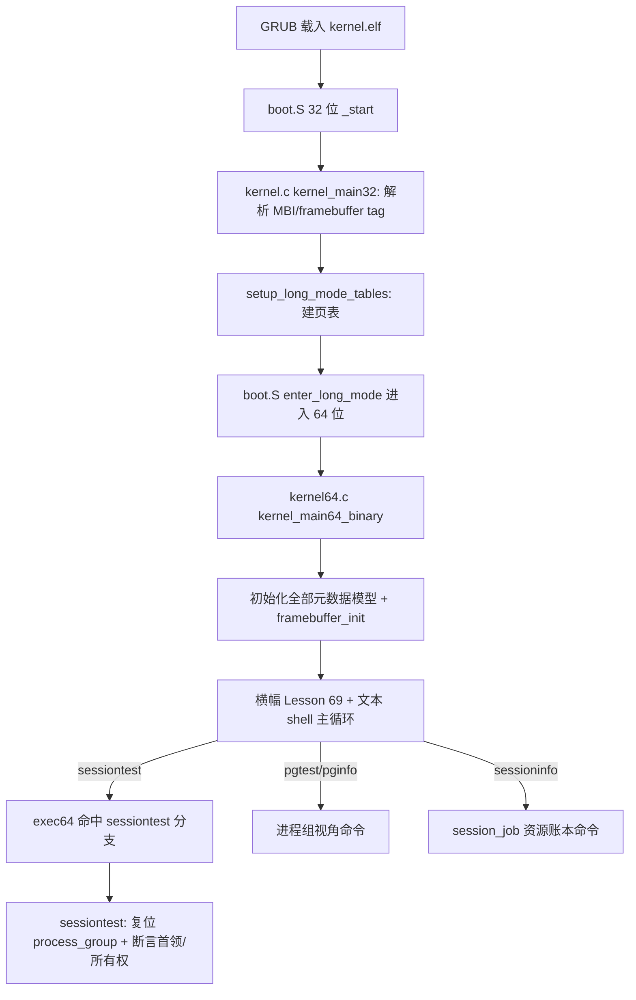

# Lesson 69: session 首领与控制终端所有权 — 精讲文档

> **课号**：Lesson 69
> **主题**：session 首领（session leader）与控制终端（controlling terminal）所有权
> **课程主线位置**：第 5 阶段「进程组/session/调度/COW（68–87）」第二课
> **前置课程**：[Lesson 68（进程组与 session 元数据）](../lesson-68-stable/README.md)
> **后续课程**：[Lesson 70（前台进程组切换与停止组保护）](../lesson-70-stable/README.md)
> **本课一句话目标**：在进程组模型之上，用 `sessiontest` 验证「只有 session 首领能建立 session」与「控制终端所有权归首领」两条确定性不变量，进一步理解 session 的组织与所有权规则。

> **Course status: stable snapshot (validated; verified build artifacts included).**

---

## 1. 课程定位（Mission）

- **一句话目标**：学完本课你能说清 session 首领的两个职责——「创建/代表整个 session」和「持有控制终端」——并解释为什么 `sessiontest` 断言 `leader==pgid && session==leader && controlled` 就覆盖了「首领建 session + 控制终端所有权」这两个概念。
- **主线位置**：这是第 5 阶段的第二课。Lesson 68 把进程组/session 作为**静态初值**立起来；本课把目光从「进程组内部」移到「session 层面」，验证 session 首领的合法性与控制终端所有权归属。Lesson 70 将把 `foreground` 变成可切换的状态机（前台/后台/停止组），本课为它打好「谁是首领、谁拥有终端」的底层事实。本课延续 **「固定元数据 + 确定性验证」** 教学模型：无任意用户代码、无真实 TTY、无信号派发。
- **前置知识清单**：
  1. `struct process_group_model` 六个字段与 Lesson 68 的四条不变量（`pgid==leader`、`session==pgid`、`member_count==2`、`foreground&&controlled`）；
  2. session 概念：多个进程组组成 session，sid 取 session 首领 PID；
  3. 控制终端概念：session 唯一的 `/dev/tty`，前台组独占输入；
  4. `exec64` 命令分支与 `noargs64`/`usage64` 约定；
  5. 文本主线框架（Lesson 68 已回退 GUI，主循环是纯文本 shell）。
- **本课交付（可见结果）**：
  - 新命令 `sessiontest`：断言 session 首领合法性与控制终端所有权，输出 `sessiontest: leader-only session creation and controlling-terminal ownership passed`；
  - 回归：`pginfo`/`pgtest`（Lesson 68 命令）继续可用，`sessioninfo`（Lesson 60 继承的 session_job 模型）继续可用；
  - 全部文本诊断命令与 GUI 回归命令继续可用。

---

## 2. 核心概念精讲

### 2.1 session 首领（session leader）

- **定义**：session 首领是**创建该 session 的进程**，且它的 PID 就是 session ID（sid）。首领进程的进程组也随之为整个 session 的「初始进程组」。
- **为什么需要**：session 需要有一个「主人」来代表整体：终端关闭时向谁报告、控制终端归谁所有、session 是否还能存活——都锚定在首领身上。
- **工作机制**：在 POSIX 中，进程调用 `setsid()` 成为 session 首领；前提是调用者**不是进程组首领**（否则 `setsid` 失败 `EPERM`）。教学模型把这个规则浓缩成一条不变量：`leader==pgid`（组里只有组首领才有资格成为 session 首领），并且 `session==leader`（sid 取首领 PID）。
- **示意图**：

```text
session (sid = leader 的 PID = 100)
   └── 进程组 (pgid=100, leader=pid 100)   ← 首领同时是组首领与 session 首领
        ├── pid 100
        └── pid 101
   controlled = 1  (该 session 被一个控制终端管理)
```

### 2.2 控制终端（controlling terminal）及其所有权

- **定义**：每个 session 至多拥有一个控制终端（`/dev/tty`）；「所有权」指该终端归 session 所有，只有 session 首领能获取或释放它（`TIOCSCTTY`/`TIOCNOTTY`）。
- **为什么需要**：终端输入与信号需要「定向到谁」的权威来源——控制终端把 session 与其上的键盘输入、`Ctrl-C`/`Ctrl-Z` 信号绑定起来，防止多个 session 抢同一个 tty。
- **工作机制**：教学模型用 `controlled=1` 表示「session 受控于一个终端」，并把它绑定到首领合法性上：`sessiontest` 要求 `controlled` 为真且 `leader==pgid`、`session==leader`——即「合法首领 + 受控终端」才构成有效 session。
- **教学边界**：模型不模拟 `tty_struct`、不派发 `SIGINT/SIGTSTP`；所有权只是布尔位。真实终端语义见 Linux `drivers/tty/`，本课只立概念。

### 2.3 从静态元数据到「首领-所有权」不变量（本课核心视角）

- **定义**：Lesson 68 验证「进程组身份」；本课验证「session 层面谁说了算」。两条不变量共同回答：*这个 session 是谁的、它的终端是谁的*。
- **为什么需要**：job control 的一切（前后台切换、停止组、终端信号）都依赖「首领」与「所有权」这两个锚点；先锁死锚点，后续状态转换才有意义。
- **工作机制**：`sessiontest` 用与 `pgtest` 相同的复位初值 `{100,100,100,2,1,1}`，但断言的是**另一组不变量**：`leader==pgid`（组首领资格）、`session==leader`（首领即 sid 来源）、`controlled`（拥有控制终端）。三取交即「合法 session 首领持有控制终端」。
- **对比 Lesson 68 的 `pgtest`**：`pgtest` 断言 `pgid==leader && session==pgid && member_count==2 && foreground&&controlled`（含成员数与前台位）；`sessiontest` 聚焦 `leader==pgid && session==leader && controlled`（不含成员数与前台位）。两者是对同一结构体从「进程组视角」和「session 视角」的两次观察。

### 2.4 本课的三条不变量速查

| 不变量 | 含义 | 对应 POSIX/Linux 规则 |
|---|---|---|
| `leader==pgid` | 只有组首领（其 PID == 组号）能成为 session 首领 | `setsid()` 要求调用者 `pid==pgid`，否则 `EPERM` |
| `session==leader` | sid 取 session 首领的 PID | `signal->pids[PIDTYPE_SID]` 初始化为调用者 PID |
| `controlled` | session 拥有控制终端 | `signal->tty` 指向所属 `tty_struct`；`TIOCSCTTY` 获取 |

这三条用「与」组合后，`sessiontest` 同时验证「首领合法性」与「终端所有权」两个概念，且任何一条被破坏都会让输出转为 fallback 文案，可立即定位。

---

## 3. 源码精讲（本课最长章节）

### 3.1 文件清单与职责

| 文件 | 职责 | 本课增量（相对 Lesson 68） |
|---|---|---|
| `boot.S` | Multiboot2 header、32 位启动、进入 long mode | 未变化 |
| `kernel.c` | 32 位阶段：解析 MBI、framebuffer tag、建页表 | 未变化 |
| `kernel64.c` | 64 位内核：文本 shell + 回归命令 + 进程组/session 模型 | 关键增量：新增 `sessiontest()`；`exec64` 增加 `sessiontest` 分支；`about` 与启动横幅改为 Lesson 69 |
| `kernel64.ld` | 64 位 continuation 链接脚本 | 未变化 |
| `linker.ld` | 外层 32 位 ELF 段布局 | 未变化 |
| `Makefile` | 构建/检查/运行 | 变化：`check` 改为 grep `'session 首领与控制终端所有权'`、`'sessiontest'`（kernel64.c）、`'Lesson 69'` |
| `grub.cfg` | GRUB menuentry | 未变化（文本 menuentry） |

### 3.2 kernel64.c 精讲

#### 3.2.1 sessiontest（本课唯一新函数，关键函数 ≥3 行分析）

```c
static TEXT64 void sessiontest(u16*c){
  process_group=(struct process_group_model){100,100,100,2,1,1};
  int ok=process_group.leader==process_group.pgid&&
          process_group.session==process_group.leader&&
          process_group.controlled;
  text64(c,"sessiontest: ");
  text64(c,ok?"leader-only session creation and controlling-terminal ownership passed":"session fallback reported");
  putc64(c,'\n');}
```

- **签名与职责**：`void sessiontest(u16*c)`，复位进程组模型后验证「session 首领合法性 + 控制终端所有权」；
- **输入输出**：无参数（exec64 保证 `noargs64`），输出 VGA 文本；先复位再断言，保证确定性；
- **算法步骤**：① 复位 `process_group={100,100,100,2,1,1}`；② 计算 `ok`；③ 打印前缀 `sessiontest: ` 与通过/fallback 文案；
- **不变量逐条解析**：
  1. `leader==pgid`：**首领资格**——组首领（其 PID 等于组号）才有权成为 session 首领，对应 POSIX 中「进程组首领不能 setsid」的镜像（模型里初值恰好是首领，故合法）；
  2. `session==leader`：**sid 来源**——session ID 由首领 PID 决定，首领即 sid；
  3. `controlled`：**所有权**——该 session 拥有一个控制终端；
- **边界与错误处理**：任何一条不满足输出 `session fallback reported`，不 panic；与 `pgtest`/`pginfo` 共用同一结构体与复位初值，无交叉污染；
- **为什么这样设计**：用「三条件取交」把「首领建 session」「终端归 session」两个独立概念压缩进一个布尔，是最小可验证集合；后续 Lesson 70 会在 `foreground` 上做状态转换，届时 `controlled` 会从「静态为真」变成「动态可交接」。预期输出（逐字抄录自源码）：

```text
sessiontest: leader-only session creation and controlling-terminal ownership passed
```

#### 3.2.2 exec64 新增分支与横幅变化

```c
else if(eq64(word,"sessiontest")){if(!noargs64(arg))usage64(c,"sessiontest");else sessiontest(c);}
```

- 位于 `pgtest` 分支之后，统一形态（`noargs64` 拒参、`usage64` 提示、否则调用）；
- `about` 输出改为 `Lesson 69: session 首领与控制终端所有权\n`；
- 启动横幅改为：

```text
Lesson 69: session 首领与控制终端所有权
GETTICKS, GETPID, WRITE_CONSOLE, EXIT; unknown=-ENOSYS; bounded reclaim metadata
```

- `help` 清单仍沿用文本主线样式，`sessiontest`/`pginfo`/`pgtest` 均未列入清单（与 Lesson 68 的「help 不全」约定一致，命令以本文档与 `about` 为准）。

#### 3.2.3 与既有命令的关系

- `pginfo`/`pgtest`（Lesson 68）：观察/验证进程组视角，本课不变；
- `sessioninfo`（Lesson 60 继承）：打印 `session init/shell/jobs/commands/waits/reaps: 0000000000000001/0000000000000001/0000000000000002/...`，描述的是 init/shell 两个 job 的**资源账本**，与 `sessiontest` 的**首领/所有权元数据**是两个不同模型（session_job vs process_group），并存不冲突；
- `sessiontest` 复用 `process_group` 结构体——说明 Lesson 68 的六字段模型在 Lesson 69 被复用而非推翻，是本阶段「同一个模型逐步加断言」的典型做法。

### 3.3 kernel.c 精讲

未变化。32 位阶段保持 Lesson 68 的简单 framebuffer 模型（无 Bochs VBE/PCI/RGB 位域），与进程组/session 主线无关。

### 3.4 构建管线（Makefile / linker）

- 编译/链接/iso 流程与 Lesson 68 完全一致（`-m64 -ffreestanding -fpie -mno-red-zone ...` → kernel64.bin → `.incbin` 嵌入 → `grub-mkrescue`）；
- `check` 目标变化：`grub-file --is-x86-multiboot2` + grep README `'session 首领与控制终端所有权'` + grep kernel64.c `'sessiontest'` + grep README `'Lesson 69'`；
- 无新增编译标志；`run` 命令不变。

### 3.5 主控制流



---

## 4. 数据流与运行逻辑

**sessiontest 命令的数据流**：

1. 用户在 `tinyos>` 输入 `sessiontest` 回车；
2. 主循环 `kbd_dequeue` → `\n` → `exec64(&c,h,cmd)`；
3. `exec64` 命中 `eq64(word,"sessiontest")` 分支 → `noargs64` 通过 → `sessiontest(c)`；
4. `sessiontest` 把 `process_group` 复位为 `{100,100,100,2,1,1}`，断言 `leader==pgid && session==leader && controlled` 全真；
5. VGA 输出 `sessiontest: leader-only session creation and controlling-terminal ownership passed`。

**与既有命令的对比数据流**：`pginfo`/`pgtest` 读同一结构体不同视角（身份 vs 状态）；`sessioninfo` 读 session_job 数组（资源账本）。三条命令互不修改对方模型，体现了「同一结构体多视角、不同模型并存」的课程设计。

**命令行输入解析细节**：`exec64` 的 `token64` 把 `sessiontest` 解析进 `word[24]`（命令长度上限 23 字符），`sessiontest` 恰好 11 字符，安全；`noargs64` 确认无额外参数后才允许执行，带参数输入会输出 `usage: sessiontest`。这与 `pginfo`/`pgtest` 完全对称，保证三个命令的交互行为一致。

---

## 5. 构建、运行与验证

依赖：`gcc`、`ld`、`objcopy`、`grub-mkrescue`、`grub-file`、`qemu-system-x86_64`。

```bash
cd lessons/lesson-69-stable
make -j"$(nproc)"
make check          # 预期：Multiboot2 and Lesson 69 checks passed.
make run            # QEMU 图形窗口（文本 shell）+ 串口 stdio
```

**验证步骤**（在 `tinyos>` 提示符下）：

| 命令 | 预期输出（逐字抄录自 kernel64.c） |
|---|---|
| `sessiontest` | `sessiontest: leader-only session creation and controlling-terminal ownership passed` |
| `pginfo` | `pginfo: pgid/leader/session/members: 0000000000000064/0000000000000064/0000000000000064/0000000000000002` |
| `pgtest` | `pgtest: bounded process-group leader, session, foreground, and controlling-terminal metadata passed` |
| `sessioninfo` | `session init/shell/jobs/commands/waits/reaps: 0000000000000001/0000000000000001/0000000000000002/0000000000000000/0000000000000000/0000000000000000` |
| `about` | `Lesson 69: session 首领与控制终端所有权` |
| 回归 | `guiinfo`/`desktest`/`shellgui`/`meminfo`/`taskvalidate` 等全部通过 |

**如何判断成功**：`make check` 打印 `Multiboot2 and Lesson 69 checks passed.`；QEMU 中 `sessiontest` 输出与上表逐字一致；本课为确定性文本验证，无 GUI 画面依赖。

---

## 6. 调试地图

| 现象 | 原因 | 检查方法 |
|---|---|---|
| `sessiontest` 输出 fallback | `leader==pgid`、`session==leader`、`controlled` 三条中某条不成立 | 逐条打印三条件布尔值；确认初值 `{100,100,100,2,1,1}` 中 leader/session/pgid 均为 100 且 controlled=1 |
| `sessiontest` 显示 unknown command | exec64 未加分支或命令名拼写不一致 | grep kernel64.c 确认 `eq64(word,"sessiontest")` 分支存在 |
| `sessiontest` 提示 usage | `noargs64(arg)` 未通过 | 确认命令后无尾随空格 |
| `about`/横幅仍显示 Lesson 68 | kernel64.c 横幅字符串未更新 | grep `Lesson 69` 应命中启动横幅与 `about` 分支 |
| `make check` 失败 | README/kernel64.c 关键词缺失 | `check` grep `'session 首领与控制终端所有权'`、`'sessiontest'`、`'Lesson 69'` |
| `sessioninfo` 输出与预期不符 | 混淆了 session_job 模型与 process_group 模型 | `sessioninfo` 读的是 `session_jobs[2]` 资源账本；`sessiontest` 读的是 `process_group`；两者不是同一个结构体 |
| 输入 `sessiontest` 后 `process_group` 值变化影响 `pginfo` | 复位初值被其他命令改写 | 每条命令都先复位再打印，理论上无污染；若怀疑，先 `pginfo` 再 `sessiontest` 再 `pginfo` 对照 |

---

## 7. 与 Linux 源码对照

- **session 首领**：Linux 中 `task_struct->signal->pids[PIDTYPE_SID]` 记录 sid，`signal->leader` 标记首领；`ksys_setsid()`（`kernel/sys.c`）要求调用者 `pid==pgid` 才允许建新 session（防止组首领 setsid）。TinyOS 的 `leader==pgid` 正是这条规则的静态形式；`session==leader` 对应 `pids[PIDTYPE_SID]` 初始化为调用者 PID。
- **控制终端所有权**：Linux 中 `task_struct->signal->tty` 指向 `struct tty_struct`，`tty->session` 记录所有者 session；`TIOCSCTTY` 只有无控制终端的 session 首领能成功获取，`TIOCNOTTY` 释放。TinyOS 的 `controlled` 布尔位是该机制的抽象。对照文件：`drivers/tty/tty_io.c`、`drivers/tty/tty_jobctrl.c`、`include/linux/sched/signal.h`。
- **教学模型简化了什么**：无 `struct tty_struct`、无设备节点、无 `TIOCSCTTY/TIOCNOTTY` 系统调用、无信号派发；所有权只是字段。真实语义以 POSIX.1-2017 与 Linux 源码为准。
- 权威来源：POSIX.1-2017（`setsid`/`tcsetpgrp`/`tcgetpgrp`）、Linux `kernel/sys.c`、`drivers/tty/tty_jobctrl.c`。

---

## 8. 思考题与练习

1. **概念理解**：`sessiontest` 与 `pgtest` 都对同一结构体复位，为什么断言集合不同？各自覆盖了哪个概念层面？
2. **源码定位**：`sessiontest` 里为什么没有断言 `member_count==2` 和 `foreground`？如果补上这两条，测试还通过吗？这说明什么？
3. **动手实验**：把 `sessiontest` 的 `controlled` 断言删除，输出变为什么？再把初值里 `controlled` 改成 0，`sessiontest` 与 `pgtest` 各输出什么？
4. **动手实验**：在 `exec64` 中给 `sessiontest` 加一个别名命令 `sessid`（复用同一函数），验证 `sessid` 与 `sessiontest` 输出一致；思考这种别名机制与 `shellrun`/`execpath` 共用的写法有什么异同。
5. **Linux 对照**：阅读 `kernel/sys.c` 的 `ksys_setsid()`，它检查「调用者 PGID == 调用者 PID」。TinyOS 的 `leader==pgid` 与它是什么对应关系？如果模型里 leader=101 而 pgid=100，`sessiontest` 会报 fallback——这与真实 setsid 的 `EPERM` 失败在语义上是否等价？

---

## 9. 本课小结与下一课预告

- 本课在 Lesson 68 的进程组模型之上，新增 `sessiontest` 验证 session 层面两条不变量：首领资格（`leader==pgid`）与 sid 来源（`session==leader`），外加控制终端所有权（`controlled`）；
- 明确了「首领-所有权」两个锚点：session 首领代表整个 session，控制终端归 session 所有且由首领负责获取/释放；
- 对比了同一结构体的两种视角：`pgtest`（进程组身份/状态）与 `sessiontest`（session 首领/所有权），并澄清 `sessioninfo` 属于另一套 session_job 资源账本模型；
- 代码增量极小但语义关键：新函数 + 一个命令分支 + 横幅/check 文案更新，全部符合「固定元数据 + 确定性验证」教学模型；
- 32 位阶段、构建链路、GUI 回归策略均未变，验证完全确定可进 CI。

下一课 [Lesson 70（前台进程组切换与停止组保护）](../lesson-70-stable/README.md) 将把 `foreground` 从「静态为真」推进为**状态机**：支持前台进程组切换（terminal handoff）、停止组保护（stopped-group protection）与确定性前台选择。届时你会看到 `sessiontest` 的 `controlled` 如何从所有权布尔升级为可交接的状态，并新增一组前台/停止状态的确定性命令。
