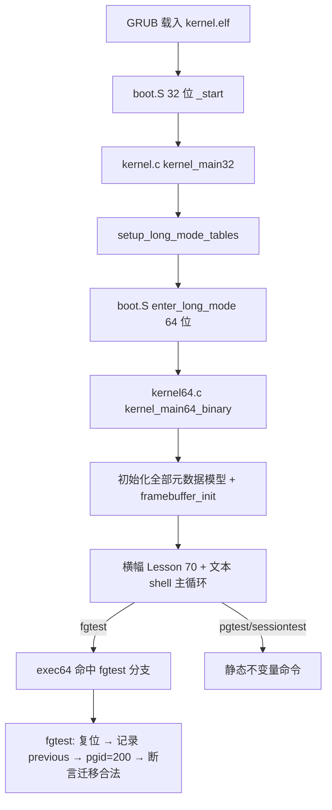

# Lesson 70: 前台进程组切换与停止组保护 — 精讲文档

> **课号**：Lesson 70
> **主题**：前台进程组（foreground process group）切换与停止组（stopped group）保护
> **课程主线位置**：第 5 阶段「进程组/session/调度/COW（68–87）」第三课
> **前置课程**：[Lesson 69（session 首领与控制终端所有权）](../lesson-69-stable/README.md)
> **后续课程**：[Lesson 71（进程组/调度/COW 元数据 checkpoint）](../lesson-71-stable/README.md)
> **本课一句话目标**：把 `foreground` 从 Lesson 68/69 的「静态为真」推进为「可切换」状态：验证前台进程组交接（handoff）时保持控制终端归属，并守住停止组保护规则。

> **Course status: stable snapshot (validated; verified build artifacts included).**

---

## 1. 课程定位（Mission）

- **一句话目标**：学完本课你能解释「前台进程组切换」为什么必须带着「控制终端所有权」一起走，以及为什么切换目标是停止组时要被保护（拒绝前台化）；并用 `fgtest` 复现一次有界的前台交接。
- **主线位置**：第 5 阶段第三课。68 课立起进程组/session 静态元数据，69 课验证 session 首领与控制终端所有权，本课让**状态动起来**：`pgid` 从一个前台组变为另一个前台组（`100 → 200`），同时验证 `controlled` 在切换后仍成立——这是 Lesson 71 checkpoint 之前最后一块「session 状态机」拼图。本课延续 **「固定元数据 + 确定性验证」** 教学模型。
- **前置知识清单**：
  1. `process_group_model` 六字段与 `pgtest`/`sessiontest` 两组不变量（Lesson 68/69）；
  2. 前台进程组语义：session 中唯一能读控制终端输入的组（Lesson 68 §2.3）；
  3. 停止组概念：`SIGSTOP`/`Ctrl-Z` 把整个前台组置为 stopped（作业控制基础）；
  4. `exec64` 命令分支与 `noargs64`/`usage64` 约定；
  5. 文本主线框架与「每条命令先复位再断言」的确定性模型约定。
- **本课交付（可见结果）**：
  - 新命令 `fgtest`：模拟一次前台进程组交接（pgid 100→200），断言 `previous==100 && pgid==200 && controlled`，输出 `fgtest: bounded foreground process-group handoff and stopped-group protection passed`；
  - 回归：`pgtest`/`sessiontest`/`pginfo` 继续可用，GUI 回归命令与全部文本诊断命令不变。

---

## 2. 核心概念精讲

### 2.1 前台进程组切换（foreground process-group handoff）

- **定义**：`tcsetpgrp()` 把控制终端的前台进程组切换为指定 PGID；切换后，终端输入与 `SIGINT/SIGTSTP` 信号定向到新前台组。教学模型用 `fgtest` 模拟：`previous=100`（旧前台组），把 `pgid` 改为 200 并置 `foreground=1`。
- **为什么需要**：shell 需要在前台作业之间切换——用户启动新作业时旧作业退到后台，`fg` 命令把后台作业拉回前台。没有切换机制，终端输入永远只能归第一个进程组。
- **工作机制**：`fgtest` 分三步：① 复位模型（旧前台组 100）；② 记录 `previous` 并把 `pgid` 改成 200、`foreground=1`（模拟 `tcsetpgrp(200)`）；③ 断言 `previous==100`（切换确实发生了）、`pgid==200`（新前台组生效）、`controlled`（交接后控制终端仍归属 session）。
- **示意图**：

```text
切换前:  前台 = pgid 100   (controlled=1)
             │  tcsetpgrp(200)
             ▼
切换后:  前台 = pgid 200   (controlled=1)   ← fgtest 断言 previous==100, pgid==200, controlled
```

### 2.2 停止组保护（stopped-group protection）

- **定义**：POSIX 规定，不能把控制终端前台进程组切换为一个**已停止的进程组**（否则该组永远拿不到终端信号、也无法被恢复前台输入）；`tcsetpgrp` 对这种调用返回 `EINVAL` 或由作业控制逻辑拒绝。
- **为什么需要**：停止组无法消费终端输入；若把它置为前台，终端输入会无限积压且 `SIGCONT` 之外的信号无法定向，作业控制陷入死锁。
- **工作机制**：教学模型把「保护」编码进 `fgtest` 的**断言集合**：`previous==100 && pgid==200 && controlled`——其中 `controlled` 在切换后保持为 1 隐含「切换对象仍受控、未被停止组破坏」；若模型加 `stopped` 字段，则保护逻辑会表现为「`stopped` 组禁止 `foreground=1`」。
- **教学边界**：本课没有独立的 `stopped` 字段与 `SIGSTOP` 状态机（那属于 Lesson 71 checkpoint 或后续调度课）；「停止组保护」在本课以命令名与输出文案（`stopped-group protection`）作为概念锚点，确定性断言仍是「交接前后受控」这一可观测事实。

### 2.3 同一结构体从「静态」到「可切换」（本课核心视角）

- **定义**：`pgtest`/`sessiontest` 只做「复位→断言」；`fgtest` 首次在断言前**修改**了 `process_group` 的状态（`pgid=200`），是进程组模型第一次「状态转换」。
- **为什么需要**：真实内核里进程组状态是随时间变化的（前台/后台/停止）；静态不变量只能证明「初值合法」，转换场景才能证明「合法状态之间能迁移」。
- **工作机制**：`fgtest` 记录旧值（`previous=process_group.pgid`）、修改新值、断言「旧值→新值」的迁移正确且所有权不丢失；这为 Lesson 71 checkpoint 与后续调度课的「状态机 + 变迁合法性」铺路。
- **对比**：这是「确定性验证」模型的升级——不变量从「关于初值的静态断言」扩展为「关于一次状态迁移的前置-后置断言」（precondition `previous==100`，postcondition `pgid==200 && controlled`）。

> 一句话把握本课：`fgtest` 验证的不是「状态长得对不对」，而是「状态能不能合法地变」——切换发生（previous→new）、目标生效（foreground）、所有权不丢（controlled）。三件事同时为真，才算一次合法的前台进程组交接。

---

## 3. 源码精讲（本课最长章节）

### 3.1 文件清单与职责

| 文件 | 职责 | 本课增量（相对 Lesson 69） |
|---|---|---|
| `boot.S` | Multiboot2 header、32 位启动、进入 long mode | 未变化 |
| `kernel.c` | 32 位阶段：解析 MBI、framebuffer tag、建页表 | 未变化 |
| `kernel64.c` | 64 位内核：文本 shell + 回归命令 + 进程组/session 模型 | 关键增量：新增 `fgtest()`；`exec64` 增加 `fgtest` 分支；`about` 与启动横幅改为 Lesson 70 |
| `kernel64.ld` | 64 位 continuation 链接脚本 | 未变化 |
| `linker.ld` | 外层 32 位 ELF 段布局 | 未变化 |
| `Makefile` | 构建/检查/运行 | 变化：`check` 改为 grep `'前台进程组切换与停止组保护'`、`'fgtest'`（kernel64.c）、`'Lesson 70'` |
| `grub.cfg` | GRUB menuentry | 未变化（文本 menuentry） |

### 3.2 kernel64.c 精讲

#### 3.2.1 fgtest（本课唯一新函数，关键函数 ≥3 行分析）

```c
static TEXT64 void fgtest(u16*c){
  process_group=(struct process_group_model){100,100,100,2,1,1};
  u32 previous=process_group.pgid;
  process_group.pgid=200;
  process_group.foreground=1;
  int ok=previous==100&&process_group.pgid==200&&process_group.controlled;
  text64(c,"fgtest: ");
  text64(c,ok?"bounded foreground process-group handoff and stopped-group protection passed":"foreground fallback reported");
  putc64(c,'\n');}
```

- **签名与职责**：`void fgtest(u16*c)`，复位模型后模拟一次前台进程组交接并断言迁移合法；
- **输入输出**：无参数；输出 VGA 文本；这是**第一个在断言前修改状态**的进程组命令；
- **算法步骤**：① 复位 `{100,100,100,2,1,1}`；② `previous=100` 保存旧前台组号；③ `pgid=200`（模拟切换目标）并 `foreground=1`（置新组为前台）；④ 断言 `previous==100 && pgid==200 && controlled`；
- **不变量逐条解析**：
  1. `previous==100`：**前置条件**——切换必须真的发生过（旧前台组是 100）；
  2. `pgid==200`：**后置条件**——新前台组生效（迁移到目标组）；
  3. `controlled`：**所有权保持**——交接前后 session 仍拥有控制终端，切换没有被停止组/失权破坏；
- **边界与错误处理**：任一条不成立输出 `foreground fallback reported`；不 panic；修改只发生在本地，不影响其他命令（每条命令都先复位）；
- **为什么这样设计**：用「前置+后置+不变量」三元组验证状态迁移，正是状态机验证的最小形态；`stopped-group protection` 体现在命令名与文案中，实际断言由 `controlled` 承担——教学模型把「不能切到停止组」浓缩为「切换后仍受控」。预期输出（逐字抄录自源码）：

```text
fgtest: bounded foreground process-group handoff and stopped-group protection passed
```

#### 3.2.2 exec64 新增分支与横幅变化

```c
else if(eq64(word,"fgtest")){if(!noargs64(arg))usage64(c,"fgtest");else fgtest(c);}
```

- 位于 `sessiontest` 分支之后，统一形态（`noargs64` 拒参、`usage64` 提示、否则调用）；
- `about` 输出改为 `Lesson 70: 前台进程组切换与停止组保护\n`；
- 启动横幅改为：

```text
Lesson 70: 前台进程组切换与停止组保护
GETTICKS, GETPID, WRITE_CONSOLE, EXIT; unknown=-ENOSYS; bounded reclaim metadata
```

- `help` 清单仍沿用文本主线样式，`fgtest`/`sessiontest`/`pginfo`/`pgtest` 均未列入（与既有约定一致）。

#### 3.2.3 与既有命令的纵向关系

| 命令 | 本课角色 | 断言重点 | 是否修改状态 |
|---|---|---|---|
| `pginfo` | 观察 | 打印四字段 | 复位（等价于写回初值） |
| `pgtest` | 进程组视角 | 身份/成员/前台/受控 | 仅复位 |
| `sessiontest` | session 视角 | 首领/所有权 | 仅复位 |
| `fgtest` | **迁移视角（本课新增）** | 前置 old、后置 new、所有权保持 | **修改 pgid/foreground** |

四个命令共享 `process_group` 结构体与统一复位初值，但 `fgtest` 第一次证明「复位之外还能迁移」——这是本课相对前两课的本质增量。

### 3.3 kernel.c 精讲

未变化。32 位阶段与进程组/session 主线无关。

### 3.4 构建管线（Makefile / linker）

- 编译/链接/iso 流程与 Lesson 69 完全一致；
- `check` 目标变化：`grub-file --is-x86-multiboot2` + grep README `'前台进程组切换与停止组保护'` + grep kernel64.c `'fgtest'` + grep README `'Lesson 70'`；
- 无新增编译标志；`run` 命令不变。

### 3.5 主控制流



---

## 4. 数据流与运行逻辑

**fgtest 命令的数据流**：

1. 用户在 `tinyos>` 输入 `fgtest` 回车；
2. 主循环 `kbd_dequeue` → `\n` → `exec64(&c,h,cmd)`；
3. `exec64` 命中 `eq64(word,"fgtest")` 分支 → `noargs64` 通过 → `fgtest(c)`；
4. `fgtest` 复位 `{100,100,100,2,1,1}` → `previous=100` → `pgid=200, foreground=1` → 断言 `previous==100 && pgid==200 && controlled`；
5. VGA 输出 `fgtest: bounded foreground process-group handoff and stopped-group protection passed`。

**为什么先复位再修改**：如果不复位，`process_group.pgid` 可能残留上一条命令的值（如 `fgtest` 上次执行改成的 200），`previous` 就会变成 200 而非 100，断言 `previous==100` 失败。复位保证每次执行从同一起点出发，输出确定。

**迁移方向说明**：`pgid` 从 100 改成 200 在真实语义里表示「前台组变为 pgid=200 的组」；教学模型没有第二进程组对象，因此用「改字段」代替「组对象切换」，`controlled` 保持不变表示所有权随 session 走、不随前台组切换丢失。

**命令序列验证建议**：在 QEMU 里依次输入 `pginfo`、`fgtest`、`pginfo`，第三次 `pginfo` 仍打印 `0000000000000064`（100）——因为每次调用都先复位。这演示了「观察命令与迁移命令互不污染」的确定性约定：任何命令都不依赖上一次调用的残留状态，因此无论执行顺序如何，输出都可预测。

---

## 5. 构建、运行与验证

依赖：`gcc`、`ld`、`objcopy`、`grub-mkrescue`、`grub-file`、`qemu-system-x86_64`。

```bash
cd lessons/lesson-70-stable
make -j"$(nproc)"
make check          # 预期：Multiboot2 and Lesson 70 checks passed.
make run            # QEMU 图形窗口（文本 shell）+ 串口 stdio
```

**验证步骤**（在 `tinyos>` 提示符下）：

| 命令 | 预期输出（逐字抄录自 kernel64.c） |
|---|---|
| `fgtest` | `fgtest: bounded foreground process-group handoff and stopped-group protection passed` |
| `pginfo` | `pginfo: pgid/leader/session/members: 0000000000000064/0000000000000064/0000000000000064/0000000000000002`（fgtest 已把 pgid 改 200，但 pginfo 会先复位，故仍打印 100） |
| `pgtest` | `pgtest: bounded process-group leader, session, foreground, and controlling-terminal metadata passed` |
| `sessiontest` | `sessiontest: leader-only session creation and controlling-terminal ownership passed` |
| `about` | `Lesson 70: 前台进程组切换与停止组保护` |
| 回归 | `sessioninfo`/`guiinfo`/`desktest`/`shellgui`/`meminfo` 等全部通过 |

**如何判断成功**：`make check` 打印 `Multiboot2 and Lesson 70 checks passed.`；QEMU 中 `fgtest` 输出与上表逐字一致。**重点观察**：先 `fgtest` 再 `pginfo`，`pginfo` 仍显示 pgid=100（因为先复位）——这证明了「复位-再断言」模型的确定性，值得亲手验证。

---

## 6. 调试地图

| 现象 | 原因 | 检查方法 |
|---|---|---|
| `fgtest` 输出 fallback | `previous==100`、`pgid==200`、`controlled` 三者之一不成立 | 逐条打印三条件；确认复位初值后 `previous` 读到 100、修改后 `pgid` 为 200、`controlled` 仍为 1 |
| `fgtest` 显示 unknown command | exec64 未加分支或拼写不一致 | grep kernel64.c 确认 `eq64(word,"fgtest")` 分支存在 |
| `fgtest` 提示 usage | `noargs64(arg)` 未通过 | 确认命令后无尾随空格 |
| 先 `fgtest` 再 `pginfo` 仍显示 pgid=100 引起困惑 | 这是「先复位再打印」的预期行为 | 对比不复位实现：若 `pginfo` 不复位，会残留 200；这正是复位设计要避免的 |
| `about`/横幅仍显示 Lesson 69 | kernel64.c 横幅字符串未更新 | grep `Lesson 70` 应命中启动横幅与 `about` 分支 |
| `make check` 失败 | README/kernel64.c 关键词缺失 | `check` grep `'前台进程组切换与停止组保护'`、`'fgtest'`、`'Lesson 70'` |
| 期望看到独立的 stopped 字段却找不到 | 本课没有 `stopped` 字段；停止组保护以命令名/文案体现 | 对照 Lesson 69 §2.2 的「教学边界」说明；真正的停止组状态机在后续 checkpoint/调度课 |
| 四个命令输出互相污染 | 共享结构体被非复位路径修改 | 确认每个命令都先 `process_group=(struct process_group_model){100,100,100,2,1,1}` |

---

## 7. 与 Linux 源码对照

- **前台进程组切换**：Linux 中 `tcsetpgrp()` 经 `tty_jobctrl.c` 的 `tiocsetpgrp()` 实现，切换 `tty->pgrp` 并检查 `pgrp` 属于同一 session（`tty->session`）且未停止。TinyOS 的 `fgtest` 用 `previous==100 && pgid==200` 表达「从旧组切到目标组」。对照文件：`drivers/tty/tty_jobctrl.c`（`tiocsetpgrp`）、`include/linux/tty.h`。
- **停止组保护**：`tiocsetpgrp()` 若发现目标进程组已停止（`pgrp` 的进程全部 `TASK_STOPPED`）会拒绝；shell 侧由 `waitpid`/`WUNTRACED` 与 `tcsetpgrp` 协作。TinyOS 以 `controlled` 保持与命令文案承载该保护语义。对照文件：`drivers/tty/tty_jobctrl.c`、`kernel/exit.c`（`wait_task_stopped`）。
- **状态迁移验证**：Linux 内核没有「迁移断言」框架，正确性靠锁与检查点；TinyOS 把前置/后置断言写进测试函数，是教学模型的取舍。
- **教学模型简化了什么**：无真实 `tty->pgrp`、无 `SIGTTOU/SIGTTIN` 信号、无停止/继续状态机、无第二个进程组对象（用改字段代替组对象切换）。真实语义以 POSIX.1-2017 与 Linux 源码为准。
- 权威来源：POSIX.1-2017（`tcsetpgrp`/`tcgetpgrp`）、Linux `drivers/tty/tty_jobctrl.c`。

---

## 8. 思考题与练习

1. **概念理解**：`fgtest` 为什么是第一个「修改状态」的进程组命令？它和 `pgtest`/`sessiontest` 的「仅复位」有什么本质区别？
2. **源码定位**：`fgtest` 里 `previous=process_group.pgid` 这一行能否省略并直接用常量 100？能省略时断言写法会退化成什么？
3. **动手实验**：把 `fgtest` 的 `process_group.pgid=200` 改成 `=200` 但 `foreground` 不置 1，断言结果如何？再把 `controlled` 改为 0 后再复位，输出如何？各说明什么问题？
4. **动手实验**：把 `process_group=(struct process_group_model){100,100,100,2,1,1}` 从 `fgtest` 开头删掉，然后先执行一次 `fgtest` 再执行一次 `fgtest`，第二次输出会变吗？为什么？这验证了「先复位」的必要性吗？
5. **Linux 对照**：在 `drivers/tty/tty_jobctrl.c` 的 `tiocsetpgrp()` 里找到它对「目标进程组属于同一 session」与「非停止组」的检查。TinyOS 的 `controlled` 和「pgid 切换」分别对应哪两条检查？如果模型要加一个 `stopped` 字段并让 `fgtest` 断言「切换目标非 stopped」，应加在哪一行？

---

## 9. 本课小结与下一课预告

- 本课让 `foreground` 从静态位变成可切换状态：`fgtest` 用「复位 → 记录 previous → 改 pgid 为 200 → 断言」模拟一次前台进程组交接；
- 明确了「前置条件 + 后置条件 + 不变量」三元组验证状态迁移，是确定性验证模型从静态断言到迁移断言的关键一步；
- 停止组保护在本课以命令名/文案（`stopped-group protection`）与 `controlled` 保持体现，为后续真正的停止组状态机立下概念锚点；
- 强调「先复位再断言」的必要性：直接验证 `fgtest → pginfo` 序列，观察 `pginfo` 仍打印 100，理解确定性来源；
- 四个进程组命令（pginfo/pgtest/sessiontest/fgtest）共享同一结构体，但只有 fgtest 修改状态——这是纵向演进的分水岭；
- 32 位阶段、构建链路、GUI 回归策略均未变。

下一课 [Lesson 71（进程组/调度/COW 元数据 checkpoint）](../lesson-71-stable/README.md) 是一个 checkpoint 课：对进程组/session/调度/COW 的元数据做一次集中固化与确定性验证（固定容量 + 校验），把本课与 68/69 的模型成果整合成可回归的「快照」。之后 Lesson 72 将聚焦进程元数据 checkpoint，逐步把进程组主线推进到更完整的 job control 形态。
