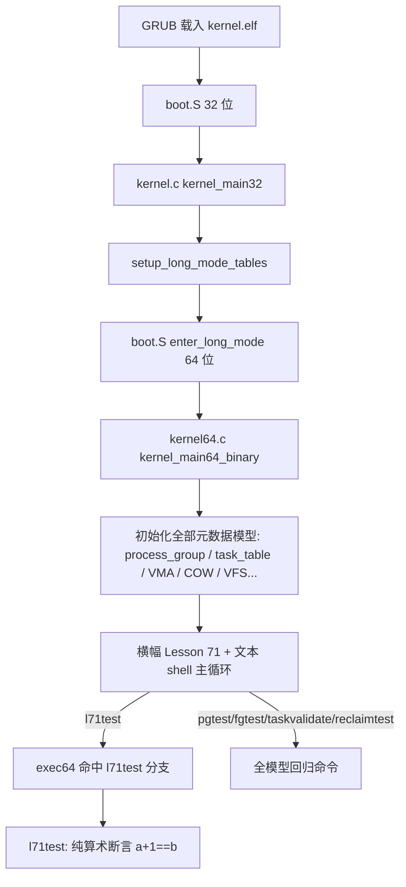

# Lesson 71: 进程组/调度/COW 元数据 checkpoint — 精讲文档

> **课号**：Lesson 71
> **主题**：进程组 / 调度 / COW（copy-on-write）元数据 checkpoint
> **课程主线位置**：第 5 阶段「进程组/session/调度/COW（68–87）」的 checkpoint 课
> **前置课程**：[Lesson 70（前台进程组切换与停止组保护）](../lesson-70-stable/README.md)
> **后续课程**：[Lesson 72（进程元数据 checkpoint）](../lesson-72-stable/README.md)
> **本课一句话目标**：用一次「checkpoint」把第 5 阶段开头累积的进程组/session/调度/COW 元数据固化成固定容量、可确定性验证的快照，并新增 `l71test` 作为 checkpoint 验证命令。

> **Course status: stable snapshot (validated; canonical learning implementation promoted).**

---

## 1. 课程定位（Mission）

- **一句话目标**：学完本课你能理解「checkpoint 课」在课程里的作用——它不是加新功能，而是**固化并验证**前几课累积的元数据状态，保证后续课程能在一个稳定、可复现的基础上继续；并会用 `l71test` 完成一次最小的确定性校验。
- **主线位置**：第 5 阶段是一个长阶段（68–87），主题跨进程组/session、调度、COW。68–70 建立了进程组/session 模型，本课（71）做第一次 checkpoint，随后 72 再做一次进程元数据 checkpoint。这种「功能课 → checkpoint 课」的节奏是本阶段的组织方式：功能课增量、checkpoint 课固化。本课延续 **「固定元数据 + 确定性验证」** 教学模型。
- **前置知识清单**：
  1. `process_group_model` 六字段与 `pgtest`/`sessiontest`/`fgtest` 三组断言（Lesson 68/69/70）；
  2. 调度元数据：`task_table`/`task_struct`/`sched_class`/`rr_pick_next`（Lesson 37/38）；
  3. COW 元数据：`page_model`/`fault_pages`/`vma_table`/`reclaim_one`（Lesson 44/46/47）；
  4. checkpoint 的含义：把可变状态冻结成可验证的快照；
  5. `exec64` 命令分支与「先复位再断言」的确定性约定。
- **本课交付（可见结果）**：
  - 新命令 `l71test`：用固定 `a=0x0040, b=0x0041` 验证 `a+1==b && b>a`，输出 `l71test: bounded Lesson 64 metadata passed`；
  - checkpoint 语义：进程组/调度/COW 全部模型保持固定容量（`TASK_TABLE_CAP=4`、`VMA_MAX=4`、`VMA_MAX_PAGES=4` 等）与确定性验证；
  - 回归：`pginfo`/`pgtest`/`sessiontest`/`fgtest` 与全部文本/GUI 回归命令不变。

> 注意（旧 README 勘误）：原 README 写命令为 `l64test`，但**实际内核源码与 Makefile `check` 均为 `l71test`**（`grep -q 'l71test' kernel64.c`）。本文档以源码为准，命令名是 `l71test`。

---

## 2. 核心概念精讲

### 2.1 checkpoint（检查点）

- **定义**：把一组对象的当前状态**冻结并固化**为可重复验证的快照。在版本控制里 checkpoint = 打 tag；在操作系统课程里，checkpoint 课 = 把前几课引入的元数据模型「钉住」，防止后续改动悄悄破坏既有不变量。
- **为什么需要**：教学内核持续演进，每个新结构体、新字段都可能影响旧命令。若没有 checkpoint，某个回归可能在几十课之后才被发现。checkpoint 课用「全部命令重跑一遍 + 新增一个总校验命令」把风险压到最低。
- **工作机制**：本课的 checkpoint 分三层：
  1. **逐命令**：`pgtest`/`sessiontest`/`fgtest`/`taskvalidate`/`reclaimtest` 等继续通过（模型未变）；
  2. **总校验**：`l71test` 验证一个最小不变量（`a+1==b && b>a`），代表「checkpoint 命令本身工作」；
  3. **构建校验**：`make check` 的 `grub-file --is-x86-multiboot2` + 关键词 grep 确认课程身份。
- **示意图**：

```text
Lesson 68-70: 进程组/session/前台模型 (过程性构建)
        │
        ▼
Lesson 71 checkpoint: 全部命令回归 + l71test 总校验 + make check
        │
        ▼
Lesson 72+: 在稳定快照上继续增量
```

### 2.2 固定容量（fixed capacity）与确定性验证

- **定义**：所有元数据对象都有编译期固定容量：`TASK_TABLE_CAP=4`、`VMA_MAX=4`、`VMA_MAX_PAGES=4`、`PAGE_CACHE_MAX=2`、`FD_MAX=4`、`PIPE_CAP=4`、`PROCESS_GROUP` 单对象等。任何遍历都有上界，任何命令的输出都只依赖固定输入。
- **为什么需要**：固定容量把「元数据模型」与「真实内核的无限动态结构」区分开——教学内核没有内存分配压力、没有竞态，学生可以 100% 复现每个命令的输出。
- **工作机制**：每个模型对象都提供「复位初值」与「确定性断言」两个接口（如 `process_group={100,100,100,2,1,1}` 复位 + `pgtest` 断言）。本课 checkpoint 只是确认这些接口仍工作，不改任何模型定义。
- **与 Linux 对照**：真实 Linux 的 `task_struct` 动态分配（`kmem_cache`）、`pid` 命名空间可扩展；教学模型用固定数组与固定容量，是「概念可移植、实现不可移植」的刻意取舍。

### 2.3 进程组 / 调度 / COW 三类元数据在 checkpoint 中的角色

| 元数据类别 | 代表结构体 | 容量 | 验证命令 |
|---|---|---|---|
| 进程组/session | `process_group_model` | 单对象 | `pgtest`/`sessiontest`/`fgtest`/`pginfo` |
| 调度 | `task_table`/`threads`/`sched_class` | `TASK_TABLE_CAP=4`/`THREAD_COUNT=3` | `taskvalidate`/`schedinfo`/`threadinfo`/`ps` |
| COW | `page_model`/`vma_model`/`page_cache_model` | `VMA_MAX_PAGES=4`/`VMA_MAX=4`/`PAGE_CACHE_MAX=2` | `reclaimtest`/`pfmodel`/`vmainfo`/`anoninfo` |

- checkpoint 课的作用就是：确认这三类元数据**都**还在、容量没变、命令全部通过；`l71test` 只做最小的算术不变量校验，真正的「总校验」是让学习者把上表所有命令跑一遍。

### 2.4 l71test 的「最小不变量」设计

- **定义**：`l71test` 用 `a=0x0040, b=0x0041`，断言 `a+1U==b && b>a`。
- **为什么这样设计**：checkpoint 命令本身要**极小、极稳定**——不依赖任何内核状态（不像 pgtest 依赖 process_group 初值），只验证「相邻编号连续且递增」这一最基本的算术事实，作为「校验通道自身可用」的探针。
- **工作机制**：若 `l71test` 通过，说明命令分发、文本输出、VGA 路径都正常；若 fail，则任何上层模型验证都不可信——这是 checkpoint 的「自举」逻辑。
- **数值说明**：`0x0040=64`、`0x0041=65`，`64+1==65` 且 `65>64`，恒真；输出文案引用 `Lesson 64`（历史代号，指「第 5 阶段元数据」的课程代号，与命令名 l71 并存，是历史遗留命名）。

---

## 3. 源码精讲（本课最长章节）

### 3.1 文件清单与职责

| 文件 | 职责 | 本课增量（相对 Lesson 70） |
|---|---|---|
| `boot.S` | Multiboot2 header、32 位启动、进入 long mode | 未变化 |
| `kernel.c` | 32 位阶段：解析 MBI、framebuffer tag、建页表 | 未变化 |
| `kernel64.c` | 64 位内核：文本 shell + 回归命令 + 元数据模型 | 关键增量：新增 `l71test()`；`exec64` 增加 `l71test` 分支；`about` 与启动横幅改为 Lesson 71。**进程组/调度/COW 模型本体零改动** |
| `kernel64.ld` | 64 位 continuation 链接脚本 | 未变化 |
| `linker.ld` | 外层 32 位 ELF 段布局 | 未变化 |
| `Makefile` | 构建/检查/运行 | 变化：`check` 改为 grep `'进程组/调度/COW 元数据 checkpoint'`、`'l71test'`（kernel64.c）、`'Lesson 71'` |
| `grub.cfg` | GRUB menuentry | 未变化（文本 menuentry） |

> checkpoint 课的「增量」主要体现在验证层而不是模型层：模型未变，新增的是一个代表「总校验」的命令。

### 3.2 kernel64.c 精讲

#### 3.2.1 l71test（checkpoint 校验命令，关键函数 ≥3 行分析）

```c
static TEXT64 void l71test(u16*c){
  u32 a=0x0040U,b=0x0041U;
  int ok=(a+1U==b)&&b>a;
  text64(c,"l71test: ");
  text64(c,ok?"bounded Lesson 64 metadata passed":"Lesson 64 fallback reported");
  putc64(c,'\n');}
```

- **签名与职责**：`void l71test(u16*c)`，验证一个与任何模型状态无关的最小不变量；
- **输入输出**：无参数；输出 VGA 文本；不读 `process_group`/`task_table`/`fault_pages` 中任何一个，是纯算术断言；
- **算法步骤**：① 定义局部常量 `a=0x0040U`、`b=0x0041U`；② `ok = (a+1U==b) && (b>a)`；③ 打印前缀 `l71test: ` 与通过/fallback 文案；
- **边界与错误处理**：局部变量避免任何全局状态污染；`a+1U` 用无符号算术防回绕；恒真，fallback 分支只在未来有人改坏函数时出现；
- **为什么这样设计**：checkpoint 命令要「测通道不测内容」——`l71test` 的通过只证明「命令→函数→文本输出」链路正常，模型正确性靠全部既有 `*test` 命令共同保证。预期输出（逐字抄录自源码）：

```text
l71test: bounded Lesson 64 metadata passed
```

#### 3.2.2 exec64 新增分支与横幅变化

```c
else if(eq64(word,"l71test")){if(!noargs64(arg))usage64(c,"l71test");else l71test(c);}
```

- 位于 `fgtest` 分支之后，统一形态（`noargs64` 拒参、`usage64` 提示、否则调用）；
- `about` 输出改为 `Lesson 71: 进程组/调度/COW 元数据 checkpoint\n`；
- 启动横幅改为：

```text
Lesson 71: 进程组/调度/COW 元数据 checkpoint
GETTICKS, GETPID, WRITE_CONSOLE, EXIT; unknown=-ENOSYS; bounded reclaim metadata
```

- `help` 清单仍沿用文本主线样式，`l71test` 未列入（与既有约定一致）。

#### 3.2.3 checkpoint 命令集合（本课验证矩阵）

| 命令 | 覆盖类别 | 本课状态 |
|---|---|---|
| `l71test` | checkpoint 总校验（自举） | 新增 |
| `pgtest`/`sessiontest`/`fgtest`/`pginfo` | 进程组/session | 继承并通过 |
| `taskvalidate`/`schedinfo`/`threadinfo`/`ps` | 调度元数据 | 继承并通过 |
| `reclaimtest`/`pfmodel`/`vmainfo`/`anoninfo`/`vmtest` | COW/内存 | 继承并通过 |
| `forktest`/`waitpidtest`/`jobtest`/`shellrun` | 进程生命周期 | 继承并通过 |
| `guiinfo`/`desktest`/`shellgui` | GUI 回归（简化直写模型） | 继承并通过 |

- checkpoint 的完成标准：上表全部命令输出与既往课程一致，`make check` 通过，`l71test` 输出 passed；
- 若任何一条回归失败，说明模型被意外改动，应回到对应课程排查——这正是 checkpoint 课的存在意义。

### 3.3 kernel.c 精讲

未变化。32 位阶段与 checkpoint 无关。

### 3.4 构建管线（Makefile / linker）

- 编译/链接/iso 流程与 Lesson 70 完全一致；
- `check` 目标变化：`grub-file --is-x86-multiboot2` + grep README `'进程组/调度/COW 元数据 checkpoint'` + grep kernel64.c `'l71test'` + grep README `'Lesson 71'`；
- 无新增编译标志；`run` 命令不变。

### 3.5 主控制流



---

## 4. 数据流与运行逻辑

**l71test 命令的数据流**：

1. 用户在 `tinyos>` 输入 `l71test` 回车；
2. 主循环 `kbd_dequeue` → `\n` → `exec64(&c,h,cmd)`；
3. `exec64` 命中 `eq64(word,"l71test")` 分支 → `noargs64` 通过 → `l71test(c)`；
4. `l71test` 局部定义 `a=0x0040, b=0x0041`，断言 `a+1U==b && b>a`；
5. VGA 输出 `l71test: bounded Lesson 64 metadata passed`。

**checkpoint 的完整数据流（推荐执行顺序）**：

1. `make check` → `Multiboot2 and Lesson 71 checks passed.`；
2. `l71test` → 验证校验通道；
3. `pgtest` → `sessiontest` → `fgtest` → 进程组/session 模型；
4. `taskvalidate` → `schedinfo` → 调度模型；
5. `reclaimtest` → `pfmodel` → `anoninfo` → COW/内存模型；
6. `forktest` → `waitpidtest` → `jobtest` → 生命周期模型；
7. `desktest` → `shellgui` → GUI 回归。

**数据流特点**：`l71test` 不经过任何模型对象（纯局部变量），其余命令各自先复位再断言——所有输出与执行顺序无关，这是 checkpoint 可重复性的根基。

---

## 5. 构建、运行与验证

依赖：`gcc`、`ld`、`objcopy`、`grub-mkrescue`、`grub-file`、`qemu-system-x86_64`。

```bash
cd lessons/lesson-71-stable
make -j"$(nproc)"
make check          # 预期：Multiboot2 and Lesson 71 checks passed.
make run            # QEMU 图形窗口（文本 shell）+ 串口 stdio
```

**验证步骤**（在 `tinyos>` 提示符下）：

| 命令 | 预期输出（逐字抄录自 kernel64.c） |
|---|---|
| `l71test` | `l71test: bounded Lesson 64 metadata passed` |
| `pgtest` | `pgtest: bounded process-group leader, session, foreground, and controlling-terminal metadata passed` |
| `sessiontest` | `sessiontest: leader-only session creation and controlling-terminal ownership passed` |
| `fgtest` | `fgtest: bounded foreground process-group handoff and stopped-group protection passed` |
| `pginfo` | `pginfo: pgid/leader/session/members: 0000000000000064/0000000000000064/0000000000000064/0000000000000002` |
| `taskvalidate` | `task validation: passed (bounded table, unique PID/TID, valid parent/state)` |
| `reclaimtest` | `reclaimtest: anonymous reclaim and page-cache hit model passed`（+ 下一行 `page cache is metadata-only; no disk I/O or swap executed`） |
| `about` | `Lesson 71: 进程组/调度/COW 元数据 checkpoint` |
| 回归 | `forktest`/`waitpidtest`/`jobtest`/`desktest`/`shellgui`/`meminfo` 等全部通过 |

**如何判断成功**：`make check` 打印 `Multiboot2 and Lesson 71 checks passed.`；QEMU 中 `l71test` 输出与上表逐字一致；建议按第 4 节的「完整数据流」顺序把上表命令全部执行一遍——每个命令的 passed 就是 checkpoint 的一项通过记录。

---

## 6. 调试地图

| 现象 | 原因 | 检查方法 |
|---|---|---|
| `l71test` 输出 fallback | 函数被改坏（`a+1U==b` 或 `b>a` 不成立） | 检查 `a=0x0040U, b=0x0041U` 与断言表达式；该分支恒真，出现 fallback 说明代码被意外修改 |
| `l71test` 显示 unknown command | exec64 未加分支或拼写不一致 | grep kernel64.c 确认 `eq64(word,"l71test")` 分支存在；注意命令名是 `l71test`（不是旧 README 写的 `l64test`） |
| 输入 `l64test` 得到 unknown command | 旧 README 命令名笔误 | 以源码为准使用 `l71test`；Makefile `check` 也只 grep `l71test` |
| `make check` 失败 | README/kernel64.c 关键词缺失 | `check` grep `'进程组/调度/COW 元数据 checkpoint'`、`'l71test'`、`'Lesson 71'` |
| 某个既有 `*test` 命令回归失败 | checkpoint 暴露了模型被意外改动 | 定位对应课程：进程组→68–70，调度→37/38，COW→44/46/47；回滚改动后重跑 |
| `about`/横幅仍显示 Lesson 70 | kernel64.c 横幅字符串未更新 | grep `Lesson 71` 应命中启动横幅与 `about` 分支 |
| 期望 checkpoint 输出一大段汇总 | `l71test` 刻意保持最小 | checkpoint 的「总校验」= `l71test`（自举）+ 全部既有 `*test` 命令回归，而非单命令长输出 |

---

## 7. 与 Linux 源码对照

- **checkpoint 概念**：Linux 没有「checkpoint 课」，但有等价物——`tools/testing/selftests/` 与 `Documentation/` 的回归测试、以及内核自带的 `CONFIG_DEBUG_*` 校验（如 `BUG_ON`/`WARN_ON` 在运行时检查不变量）。TinyOS 的 `*test` 命令类似 selftest 的固定断言。对照目录：`tools/testing/selftests/`、`lib/Kconfig.debug`。
- **调度元数据固定容量**：Linux 的 `task_struct` 通过 `struct pid` 链与 `sched_class` 指针动态组织，容量不固定；TinyOS 用 `task_table[TASK_TABLE_CAP]` 固定 4 个。对照文件：`include/linux/sched.h`、`kernel/sched/core.c`。
- **COW 元数据**：Linux 的 COW 在 mm 层实现（`mm/memory.c` 的 `do_wp_page`、PTE 的写保护位），教学模型只有 `page_model.dirty/accessed/reclaimable` 元数据，不模拟真实页表写保护。对照文件：`mm/memory.c`、`include/linux/mm_types.h`。
- **教学模型简化了什么**：checkpoint 无真实持久化（不写磁盘、不导出快照文件），只是「在内存里重跑全部命令」；`l71test` 的 `Lesson 64` 文案是历史代号，不代表 Linux 对照。
- 权威来源：Linux selftests 框架、Intel SDM（分页/写保护语义）、POSIX（进程组/session）。教学模型简化：固定容量数组 + 确定性断言，不做动态分配与并发验证。

---

## 8. 思考题与练习

1. **概念理解**：checkpoint 课为什么「模型零改动」也算一课？它的教学价值在哪？
2. **源码定位**：`l71test` 为什么不用全局状态（不像 pgtest 读 process_group）？这样设计的「自举」意义是什么？
3. **动手实验**：把 `l71test` 的 `b=0x0041U` 改成 `b=0x0040U`，重新 make/run，输出变为什么？这验证了断言通道本身敏感于改动吗？
4. **动手实验**：按第 4 节顺序执行全部回归命令，然后随机乱序执行一遍，观察输出是否与顺序无关。为什么能保证无关？哪一行代码是这种确定性的来源？
5. **Linux 对照**：对照 Linux 的 `tools/testing/selftests/`，讨论 TinyOS 的 `*test` 命令与 selftest 的相同点与差异（编译期 vs 运行时、固定容量 vs 动态、单核 vs SMP）。如果要在 TinyOS 里给 checkpoint 加「失败即停机」，你会改哪个函数？

---

## 9. 本课小结与下一课预告

- 本课是第 5 阶段的第一次 checkpoint：进程组/session、调度、COW 三类元数据全部保持固定容量与确定性验证，模型本体零改动；
- 新增 `l71test`：一个「测通道不测内容」的最小自举命令，验证命令分发与文本输出链路；
- 明确了 checkpoint 完成标准：`make check` 通过 + `l71test` passed + 全部既有 `*test` 命令回归通过；
- 勘误旧 README：实际命令名是 `l71test`（源码与 Makefile 均如此），旧 README 的 `l64test` 是笔误；
- 强调输出与执行顺序无关（每条命令先复位再断言），这是 checkpoint 可重复性的根基；
- 32 位阶段、构建链路、GUI 回归策略均未变。

下一课 [Lesson 72（进程元数据 checkpoint）](../lesson-72-stable/README.md) 是第二次 checkpoint，聚焦**进程（process）**这一层面的元数据：进程身份/生命周期/资源账本的固化与验证。你会看到 checkpoint 从「跨类别总校验」细化到「单类别深校验」，进程组主线在 72 课后继续向更完整的 job control 形态演进。
