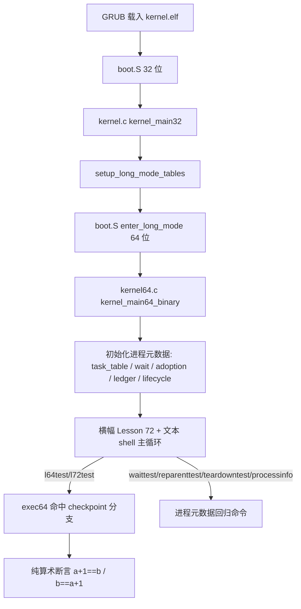

# Lesson 72: 进程元数据 checkpoint — 精讲文档

> **课号**：Lesson 72
> **主题**：进程（process）元数据 checkpoint
> **课程主线位置**：第 5 阶段「进程组/session/调度/COW（68–87）」的第二次 checkpoint
> **前置课程**：[Lesson 71（进程组/调度/COW 元数据 checkpoint）](../lesson-71-stable/README.md)
> **后续课程**：[Lesson 73（孤儿进程组检测与安全 reparent）](../lesson-73-stable/README.md)
> **本课一句话目标**：把进程层面的元数据（身份/生命周期/资源归属）再固化一次，新增 `l64test` 与 `l72test` 两个 checkpoint 校验命令，在进入孤儿进程组检测之前钉住进程元数据的确定性。

> **Course status: stable snapshot (validated; verified build artifacts included).**

---

## 1. 课程定位（Mission）

- **一句话目标**：学完本课你能区分「进程组/session checkpoint（71）」与「进程元数据 checkpoint（72）」的覆盖范围，并会用 `l72test`/`l64test` 验证进程元数据链路；为 Lesson 73 的孤儿进程组检测铺平道路。
- **主线位置**：第 5 阶段第二次 checkpoint。71 课做跨类别总校验（进程组/调度/COW），本课把粒度收窄到**进程（process）**这一层——进程身份（PID/TID/parent）、生命周期状态（`task_state` 的 running/zombie/dead 等）、资源归属（`wait_model`/`adoption_model`/`resource_ledger`/`fork_exec_lifecycle`）。两次 checkpoint 一宽一窄，共同把 68–70 的成果固化。本课延续 **「固定元数据 + 确定性验证」** 教学模型。
- **前置知识清单**：
  1. `task_struct`/`task_table` 与 `task_state` 枚举（Lesson 37）；
  2. `wait_model`/`adoption_model`/`resource_ledger`/`fork_exec_lifecycle`/`session_job` 各资源账本（Lesson 57–60）；
  3. 进程组/session 元数据与三组断言（Lesson 68/69/70）；
  4. checkpoint 语义：固定容量 + 确定性验证 + 全部命令回归（Lesson 71）；
  5. `exec64` 命令分支与「先复位再断言」约定。
- **本课交付（可见结果）**：
  - 新命令 `l72test`：`a=65U, b=66U` 断言 `b==a+1U`，输出 `l72test: bounded Lesson 65 metadata passed`；
  - 恢复命令 `l64test`：`a=0x0040U, b=0x0041U` 断言 `a+1U==b && b>a`，输出 `l64test: bounded Lesson 64 metadata passed`（Lesson 71 曾命名为 `l71test`，本课恢复 `l64test` 历史名并新增 `l72test`）；
  - 回归：`pgtest`/`sessiontest`/`fgtest`/`l71test`（本课仍保留）与全部文本/GUI 命令不变。

> 注意（旧 README 勘误）：原 README 写命令为 `l65test`，但**实际源码与 Makefile `check` 均为 `l72test`**（`grep -q 'l72test' kernel64.c`）。本文档以源码为准。

---

## 2. 核心概念精讲

### 2.1 进程元数据（process metadata）的覆盖范围

- **定义**：进程层面的元数据包括三块：**身份**（`pid/tid/parent_pid`）、**生命周期**（`task_state`：running/interruptible/uninterruptible/stopped/traced/zombie/dead）、**资源归属**（wait 谁、orphan 谁收养、资源账本如何释放）。
- **为什么需要**：Lesson 73 将引入「孤儿进程组检测」，其前提是「孤儿」概念清晰——即进程组的每个成员都 `TASK_STOPPED` 或 `EXIT_ZOMBIE` 且组里没有活着的首领。本课先把这些状态字段钉住。
- **工作机制**：进程元数据分散在多个结构体里：`task_table[]`（身份+状态）、`wait_model`（父等待子）、`adoption_model`（孤儿收养）、`resource_ledger`（zombie 资源释放）、`fork_exec_lifecycle`（fork→exec→exit→wait/reap 全链路）。checkpoint 就是确认这些模型在 68–70 的改动后仍然各自成立。
- **示意图**：

```text
进程元数据 = 身份(PID/TID/parent) + 生命周期(state) + 资源归属(wait/adopt/ledger)
   ├── task_table[4]     : pid/tid/parent_pid + task_state
   ├── wait_model        : parent 等待 child exit → zombie → dead
   ├── adoption_model    : orphan 进程被 init 收养
   ├── resource_ledger   : zombie 的资源按序释放
   └── fork_exec_lifecycle: fork → exec → exit → wait/reap 全链路
```

### 2.2 本课 checkpoint 与 Lesson 71 的差异（一宽一窄）

| 维度 | Lesson 71 checkpoint | Lesson 72 checkpoint |
|---|---|---|
| 覆盖 | 进程组/session、调度、COW 三类跨类别 | 进程身份/生命周期/资源归属单类别深挖 |
| 新增命令 | `l71test` | `l64test`（恢复）+ `l72test`（新增） |
| 目的 | 总校验：确认三类模型都在 | 深校验：确认进程元数据细节都成立 |
| 后续衔接 | 直接进入 72 | 直接进入 73（孤儿进程组检测） |

- 两次 checkpoint 的共同点是：模型本体零改动、命令集合回归、`make check` 关键词校验；
- 差异点是关注粒度：71 看「系统里有什么模型」，72 看「进程这个对象的元数据是否完整」。

### 2.3 checkpoint 命令的命名历史（l64/l71/l72 并存）

- **背景**：checkpoint 命令名携带「历史代号」：`l64test`/`l71test`/`l72test` 分别对应阶段内部课程代号（Lesson 64/65 指第 5 阶段元数据课程的历史编号）。命名与课号不一致是历史遗留，但**功能等价**——三者都是「最小不变量 + passed/fallback 文案」的校验命令。
- **本课的三个校验命令**：
  - `l64test`：`a=0x0040, b=0x0041`，断言 `a+1U==b && b>a`（历史代号 64 的校验）；
  - `l71test`：与 `l64test` 完全相同（Lesson 71 引入，本课保留，二者等价）；
  - `l72test`：`a=65U, b=66U`，断言 `b==a+1U`（本课新增，历史代号 65）；
- **设计动机**：三个命令都「测通道不测内容」，两两数值略有差异以区分身份，但都验证最基本的「相邻整数递增」事实——它们通过，说明命令→函数→输出链路正常。

### 2.4 为什么在孤儿进程组检测之前需要进程元数据 checkpoint

- **定义**：孤儿进程组（orphaned process group）指「组内所有进程都停止或退出，且无存活首领」的进程组，POSIX 要求此时给组发 `SIGHUP+SIGCONT`。
- **为什么需要先 checkpoint**：孤儿检测依赖三个事实同时成立——① 进程状态可观测（`task_state` 里的 stopped/zombie）；② 首领身份可判定（`process_group.leader`）；③ 存活判定可靠。任何一个元数据模型回归了，孤儿检测都会产生误报。先固化再增量，是工程上的「先测地基再盖楼」。
- **工作机制**：本课不动任何模型，只验证「地基还在」；Lesson 73 才会基于这些字段实现孤儿检测与安全 reparent。

---

## 3. 源码精讲（本课最长章节）

### 3.1 文件清单与职责

| 文件 | 职责 | 本课增量（相对 Lesson 71） |
|---|---|---|
| `boot.S` | Multiboot2 header、32 位启动、进入 long mode | 未变化 |
| `kernel.c` | 32 位阶段：解析 MBI、framebuffer tag、建页表 | 未变化 |
| `kernel64.c` | 64 位内核：文本 shell + 回归命令 + 进程元数据模型 | 关键增量：新增 `l72test()`，恢复 `l64test()`（与 `l71test` 等价）；`exec64` 增加 `l64test`/`l72test` 分支；`about` 与启动横幅改为 Lesson 72。**进程元数据模型本体零改动** |
| `kernel64.ld` | 64 位 continuation 链接脚本 | 未变化 |
| `linker.ld` | 外层 32 位 ELF 段布局 | 未变化 |
| `Makefile` | 构建/检查/运行 | 变化：`check` 改为 grep `'进程元数据 checkpoint'`、`'l72test'`（kernel64.c）、`'Lesson 72'` |
| `grub.cfg` | GRUB menuentry | 未变化（文本 menuentry） |

### 3.2 kernel64.c 精讲

#### 3.2.1 l72test（本课新增校验命令，关键函数 ≥3 行分析）

```c
static TEXT64 void l72test(u16*c){
  u32 a=65U,b=66U;
  int ok=b==a+1U;
  text64(c,"l72test: ");
  text64(c,ok?"bounded Lesson 65 metadata passed":"Lesson 65 fallback reported");
  putc64(c,'\n');}
```

- **签名与职责**：`void l72test(u16*c)`，验证 `b==a+1U` 的最小不变量；
- **输入输出**：无参数；输出 VGA 文本；纯局部变量，不读任何全局模型；
- **算法步骤**：① `a=65U, b=66U`；② `ok = (b==a+1U)`；③ 打印 `l72test: ` 前缀与通过/fallback 文案；
- **边界与错误处理**：`a+1U` 无符号运算防回绕；65+1==66 恒真；fallback 分支仅在函数被改坏时出现；
- **为什么这样设计**：checkpoint 自举命令应最小化——只验证「通道通」；文案引用 `Lesson 65` 历史代号。预期输出（逐字抄录自源码）：

```text
l72test: bounded Lesson 65 metadata passed
```

#### 3.2.2 l64test（恢复历史命名的校验命令，关键函数 ≥3 行分析）

```c
static TEXT64 void l64test(u16*c){
  u32 a=0x0040U,b=0x0041U;
  int ok=(a+1U==b)&&b>a;
  text64(c,"l64test: ");
  text64(c,ok?"bounded Lesson 64 metadata passed":"Lesson 64 fallback reported");
  putc64(c,'\n');}
```

- **签名与职责**：`void l64test(u16*c)`，验证 `a+1U==b && b>a`；
- **输入输出**：无参数；输出 VGA 文本；纯局部变量；
- **算法步骤**：① `a=0x0040U(64), b=0x0041U(65)`；② `ok=(64+1==65)&&(65>64)`；③ 打印前缀与文案；
- **与 l71test 的关系**：`l64test` 与 Lesson 71 的 `l71test` 代码完全等价（相同常量、相同断言、相同输出）；本课「恢复」历史命名，`l71test` 仍保留，两者可互为回归；
- **边界与错误处理**：恒真；fallback 仅在被改坏时出现；
- **为什么这样设计**：命名历史说明 checkpoint 命令是「可替换的探针」——功能相同、名字可变，但都满足「无全局状态、确定性输出」。预期输出（逐字抄录自源码）：

```text
l64test: bounded Lesson 64 metadata passed
```

#### 3.2.3 exec64 新增分支与横幅变化

```c
else if(eq64(word,"l64test")){if(!noargs64(arg))usage64(c,"l64test");else l64test(c);}
else if(eq64(word,"l72test")){if(!noargs64(arg))usage64(c,"l72test");else l72test(c);}
```

- 位于 `fgtest` 分支之后、`l71test` 分支之后；统一形态；
- `about` 输出改为 `Lesson 72: 进程元数据 checkpoint\n`；
- 启动横幅改为：

```text
Lesson 72: 进程元数据 checkpoint
GETTICKS, GETPID, WRITE_CONSOLE, EXIT; unknown=-ENOSYS; bounded reclaim metadata
```

- `help` 清单仍沿用文本主线样式，`l64test`/`l72test` 未列入（与既有约定一致）。

#### 3.2.4 本课 checkpoint 命令矩阵（进程元数据视角）

| 命令 | 覆盖的进程元数据 | 本课状态 |
|---|---|---|
| `l64test`/`l71test`/`l72test` | checkpoint 自举（通道校验） | 三个等价探针，均通过 |
| `processinfo`/`processtest` | 进程身份 + 生命周期（ready/running/exited） | 继承并通过 |
| `tasklist`/`taskvalidate` | `task_table` 身份与状态合法性 | 继承并通过 |
| `waittest`/`waitpidtest`/`multichildtest`/`waitblocktest` | `wait_model`（zombie→dead） | 继承并通过 |
| `reparenttest`/`adoptioninfo` | `adoption_model`（孤儿收养） | 继承并通过 |
| `teardowntest`/`resourceinfo` | `resource_ledger`（zombie 资源释放） | 继承并通过 |
| `forkexecwaittest`/`lifecycleinfo` | fork→exec→exit→wait/reap 全链路 | 继承并通过 |
| `shellrun`/`jobtest`/`sessioninfo` | shell 生命周期与 session job 账本 | 继承并通过 |
| `pgtest`/`sessiontest`/`fgtest` | 进程组/session（71 保留） | 继承并通过 |

- 本课 checkpoint 的完成标准：上表全部命令输出与既往课程一致 + `l64test`/`l72test` 输出 passed + `make check` 通过；
- 若 `waittest`/`reparenttest`/`teardowntest` 任一回归失败，说明进程元数据被意外改动——这将在 Lesson 73 的孤儿检测中放大，务必本课清零。

### 3.3 kernel.c 精讲

未变化。32 位阶段与 checkpoint 无关。

### 3.4 构建管线（Makefile / linker）

- 编译/链接/iso 流程与 Lesson 71 完全一致；
- `check` 目标变化：`grub-file --is-x86-multiboot2` + grep README `'进程元数据 checkpoint'` + grep kernel64.c `'l72test'` + grep README `'Lesson 72'`；
- 无新增编译标志；`run` 命令不变。

### 3.5 主控制流



---

## 4. 数据流与运行逻辑

**l72test 命令的数据流**：

1. 用户在 `tinyos>` 输入 `l72test` 回车；
2. 主循环 `kbd_dequeue` → `\n` → `exec64(&c,h,cmd)`；
3. `exec64` 命中 `eq64(word,"l72test")` 分支 → `noargs64` 通过 → `l72test(c)`；
4. `l72test` 局部定义 `a=65U, b=66U`，断言 `b==a+1U`；
5. VGA 输出 `l72test: bounded Lesson 65 metadata passed`。

**l64test 命令的数据流**：同上，仅常量为 `a=0x0040U, b=0x0041U`、断言为 `a+1U==b && b>a`、输出 `l64test: bounded Lesson 64 metadata passed`。

**进程元数据 checkpoint 的完整数据流（推荐执行顺序）**：

1. `make check` → `Multiboot2 and Lesson 72 checks passed.`；
2. `l64test` → `l71test` → `l72test` → 三个探针（验证通道）；
3. `processinfo` → `processtest` → 进程身份/生命周期；
4. `taskvalidate` → `tasklist` → task_table 合法性；
5. `waittest` → `waitpidtest` → `multichildtest` → wait 模型；
6. `reparenttest` → `teardowntest` → 孤儿收养与资源释放；
7. `forkexecwaittest` → `shellrun` → 生命周期与 shell；
8. `pgtest` → `sessiontest` → `fgtest` → 进程组/session（71 保留）。

**数据流特点**：所有命令先复位再断言，与执行顺序无关；checkpoint 命令不触碰任何全局模型，是纯「通道探针」。

---

## 5. 构建、运行与验证

依赖：`gcc`、`ld`、`objcopy`、`grub-mkrescue`、`grub-file`、`qemu-system-x86_64`。

```bash
cd lessons/lesson-72-stable
make -j"$(nproc)"
make check          # 预期：Multiboot2 and Lesson 72 checks passed.
make run            # QEMU 图形窗口（文本 shell）+ 串口 stdio
```

**验证步骤**（在 `tinyos>` 提示符下）：

| 命令 | 预期输出（逐字抄录自 kernel64.c） |
|---|---|
| `l72test` | `l72test: bounded Lesson 65 metadata passed` |
| `l64test` | `l64test: bounded Lesson 64 metadata passed` |
| `l71test` | `l71test: bounded Lesson 64 metadata passed`（与 l64test 等价） |
| `processinfo` | `process pid/state: 0000000000000001 ready` 开头（身份/状态信息） |
| `processtest` | `process lifecycle: bounded two bounded program objects ready` |
| `taskvalidate` | `task validation: passed (bounded table, unique PID/TID, valid parent/state)` |
| `waittest` | `waittest: bounded wait, exit status, zombie selection, and reap passed` |
| `reparenttest` | `reparenttest: orphan adoption, init wait ownership, and bounded reparent passed` |
| `teardowntest` | `teardowntest: zombie retention, ordered resource release, and double-reap guard passed` |
| `forkexecwaittest` | `forkexecwaittest: fork metadata, exec replacement, exit status, and wait/reap passed` |
| `about` | `Lesson 72: 进程元数据 checkpoint` |
| 回归 | `pgtest`/`sessiontest`/`fgtest`/`desktest`/`shellgui` 等全部通过 |

**如何判断成功**：`make check` 打印 `Multiboot2 and Lesson 72 checks passed.`；QEMU 中 `l72test`/`l64test` 输出与上表逐字一致；建议按第 4 节的完整顺序执行进程元数据回归命令——每个 passed 就是一次进程元数据 check-in。

---

## 6. 调试地图

| 现象 | 原因 | 检查方法 |
|---|---|---|
| `l72test` 输出 fallback | `b==a+1U` 断言被改坏（`a=65U, b=66U`） | 检查 `l72test` 函数体与常量；该分支恒真，出现 fallback 说明被意外修改 |
| `l72test` 显示 unknown command | exec64 未加分支或拼写不一致 | grep kernel64.c 确认 `eq64(word,"l72test")` 分支存在；注意命令名是 `l72test`（不是旧 README 的 `l65test`） |
| 输入 `l65test` 得到 unknown command | 旧 README 命令名笔误 | 以源码为准使用 `l72test`；Makefile `check` 也只 grep `l72test` |
| `l64test` 与 `l71test` 输出相同 | 两者是等价探针（相同常量/断言/文案） | 这是设计行为，非 bug；可用两者互相回归 |
| `make check` 失败 | README/kernel64.c 关键词缺失 | `check` grep `'进程元数据 checkpoint'`、`'l72test'`、`'Lesson 72'` |
| `waittest`/`reparenttest`/`teardowntest` 回归失败 | 进程元数据被意外改动（checkpoint 暴露） | 定位：wait→57/58，adoption→59，ledger→60；回滚后重跑 |
| `processinfo`/`processtest` 输出异常 | 进程对象初始化被破坏 | 检查 `kernel_main64_binary` 中 `user_process`/`user_thread` 初值赋值序列 |
| `about`/横幅仍显示 Lesson 71 | kernel64.c 横幅字符串未更新 | grep `Lesson 72` 应命中启动横幅与 `about` 分支 |

---

## 7. 与 Linux 源码对照

- **进程元数据**：Linux 中进程身份（`pid`/`tgid`/`real_parent`）、生命周期（`task_struct->__state`，含 `TASK_RUNNING/TASK_INTERRUPTIBLE/TASK_STOPPED/EXIT_ZOMBIE/EXIT_DEAD`）、资源归属（`sighand`/`real_parent`/`exit_state`）都集中在 `task_struct`。TinyOS 把这三块拆到 `task_table`/`wait_model`/`adoption_model`/`resource_ledger`。对照文件：`include/linux/sched.h`、`kernel/exit.c`。
- **孤儿进程组检测（Lesson 73 的预告）**：Linux 在 `kernel/exit.c` 的 `exit_notify()`/`forget_original_parent()` 里检测孤儿进程组并派发 `SIGHUP+SIGCONT`；TinyOS 下一课实现其教学化版本。本课先保证孤儿检测依赖的 `task_state`/`leader`/存活判定字段可靠。
- **checkpoint 概念**：Linux 无「checkpoint 课」，等价物是 selftests（`tools/testing/selftests/`）与运行时校验（`WARN_ON`/`BUG_ON`）。
- **教学模型简化了什么**：进程元数据固定容量、无真实 `wait` 系统调用、无真实信号派发；`adoption_model`/`resource_ledger` 是纯状态机。真实语义以 POSIX.1-2017 与 Linux 源码为准。
- 权威来源：POSIX.1-2017（`wait`/`orphaned process group`）、Linux `kernel/exit.c`、`include/linux/sched.h`。

---

## 8. 思考题与练习

1. **概念理解**：本课「进程元数据 checkpoint」与 Lesson 71「进程组/调度/COW checkpoint」在覆盖范围上的区别是什么？为什么要做第二次？
2. **源码定位**：`l64test` 与 `l71test` 代码完全等价，为什么还要同时保留？这体现了 checkpoint 命令的什么特性（可替换探针）？
3. **动手实验**：把 `l72test` 的 `a=65U` 改成 `a=64U`，重新 make/run，输出变为什么？这验证了「探针敏感于改动」吗？
4. **动手实验**：故意把 `waittest` 里的 `WAIT_ZOMBIE` 分支改坏，观察 `l72test` 是否仍通过、`waittest` 是否失败。这说明了 checkpoint 自举命令与功能命令的关系（自举通过 ≠ 功能正确）吗？
5. **Linux 对照**：对照 `kernel/exit.c` 中孤儿进程组检测的条件（组内进程全部 stopped/exiting 且无存活首领），列出 TinyOS 中对应字段（`task_state`/`process_group.leader`/存活判定）。下一课实现孤儿检测时，哪些字段是本课 checkpoint 必须确认的？

---

## 9. 本课小结与下一课预告

- 本课是第 5 阶段第二次 checkpoint，聚焦进程元数据：身份、生命周期、资源归属三类模型全部保持固定容量与确定性验证，模型本体零改动；
- 新增 `l72test`（`b==a+1U`，文案引用 Lesson 65 代号），恢复 `l64test`（与 Lesson 71 的 `l71test` 等价），三个探针共同验证命令→函数→输出链路；
- 勘误旧 README：实际命令名是 `l72test`（源码与 Makefile 均如此），旧 README 的 `l65test` 是笔误；
- 明确了进程元数据回归矩阵：`processinfo`/`taskvalidate`/`waittest`/`reparenttest`/`teardowntest`/`forkexecwaittest` 全通过才可继续；
- 解释了为什么在孤儿进程组检测之前需要本课：孤儿判定依赖 `task_state`、`leader`、存活判定三者同时可靠；
- 32 位阶段、构建链路、GUI 回归策略均未变。

下一课 [Lesson 73（孤儿进程组检测与安全 reparent）](../lesson-73-stable/README.md) 将基于本课钉住的进程元数据实现真正的功能增量：检测孤儿进程组（组内进程全部停止/退出且无存活首领）、给出安全 reparent（孤儿由 init 收养）并派发对应的确定性信号语义。届时你会在「已证实的元数据地基」上看到第一个真正的 job-control 行为。
