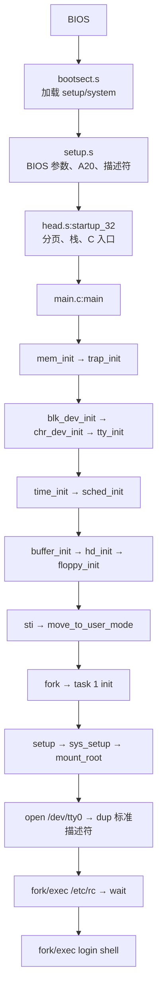

# Linux 0.11 启动顺序源码串讲

本文把固定版本 Linux 0.11 的启动、内核初始化、第一个用户进程和初始 shell 串成一条源码阅读路线。源码副本的 commit、来源和归属见 [`source-revision.txt`](../source-revision.txt) 与 [`SOURCE-PROVENANCE.md`](../SOURCE-PROVENANCE.md)。这是历史 32 位内核，不应套用现代 Linux x86-64 的启动或系统调用 ABI。

阅读时区分三类结论：源码中确实出现的调用关系；BIOS、磁盘和处理器提供的硬件/ABI 约定；根据多个模块拼出的教学模型。

## 1. 从磁盘镜像到启动链

`tools/build.c` 将三个输入拼成线性镜像：

```text
disk offset 0       : boot sector, 512 bytes
 disk offset 512    : setup, 4 sectors (512..2559)
 disk offset 2560   : system payload
```

boot sector 末尾必须有 `0xAA55` 签名。这里的 offset 是镜像中的字节位置，不是 `startup_32` 或 C 代码运行时的线性地址；boot sector 后续还会把 setup 和 system 读入约定的内存位置。详见 [`image-layout.md`](image-layout.md) 和 [`annotations/build-image.md`](annotations/build-image.md)。

本教学轨道只读源码和校验副本，不执行 `make disk`、安装脚本或真实磁盘写入。

## 2. BIOS → `boot/bootsect.s`

BIOS 将启动设备的第一个扇区装入内存并跳转到 boot sector。`boot/bootsect.s` 的任务不是初始化完整内核，而是完成最早的搬运和交接：保存启动设备信息，使用 BIOS 磁盘服务读取 setup 以及后续 system 扇区，然后把控制权交给 setup。

```text
BIOS
  → boot/bootsect.s:go
  → load_setup/read_it
  → boot/setup.s
```

阅读重点：启动盘号从哪里来、磁盘读取循环如何推进、system 被加载到哪里，以及 setup 接手时哪些寄存器和内存区域已经有意义。逐段注释见 [`annotations/bootsect.s.md`](annotations/bootsect.s.md)。

## 3. `boot/setup.s`：从实模式到保护模式

setup 运行在 boot sector 之后，继续完成进入 32 位内核环境前的过渡工作。它读取或保存 BIOS 提供的硬件参数，处理 A20，准备 GDT/IDT 描述符，并切换到保护模式入口。

```text
bootsect.s
  → setup.s
  → enable A20 / load descriptor tables
  → protected-mode entry
```

这些步骤依赖 x86 和 BIOS 约定，不应误读成 C 语言初始化。setup 的输出是 `head.s` 可以使用的处理器模式、描述符和硬件信息。逐段注释见 [`annotations/setup.s.md`](annotations/setup.s.md)。

## 4. `boot/head.s:startup_32`：建立 C 运行环境

`startup_32` 是保护模式下的早期入口。它设置内核使用的段环境，建立初始页目录/页表，打开分页并准备内核栈，最后跳到 `init/main.c:main`。

```text
boot/setup.s
  → boot/head.s:startup_32
  → setup_paging
  → kernel stack
  → init/main.c:main
```

这里的 early paging 只负责让最初的内核代码和地址空间可运行；它不等同于 `fork` 后的用户页共享和写时复制。后者在 `mm/memory.c` 的页表复制、写保护和缺页处理路径中发生。逐段注释见 [`annotations/head.s.md`](annotations/head.s.md)。

## 5. `main()`：严格按源码初始化

不要套用现代 Linux 的初始化印象，直接按 `source/init/main.c:main` 阅读：

```text
mem_init
  → trap_init
  → blk_dev_init
  → chr_dev_init
  → tty_init
  → time_init
  → sched_init
  → buffer_init
  → hd_init
  → floppy_init
  → sti
  → move_to_user_mode
  → fork
```

| 顺序 | 调用 | 作用与后续依赖 |
|---:|---|---|
| 1 | `mem_init` | 建立物理内存可分配范围和页引用状态；后续页表、buffer 和进程创建依赖它。 |
| 2 | `trap_init` | 安装异常入口和 IDT 基础；处理器异常才有可用的内核入口。 |
| 3 | `blk_dev_init` | 初始化块设备请求框架；磁盘和 buffer 的 I/O 路径依赖它。 |
| 4 | `chr_dev_init` | 初始化字符设备框架；TTY、console 等字符设备依赖它。 |
| 5 | `tty_init` | 准备 TTY 数据结构和相关设备状态。 |
| 6 | `time_init` | 设置时间相关状态和时钟基础。 |
| 7 | `sched_init` | 准备 task、TSS/LDT，并安装 timer gate 与 `int 0x80` system gate；之后才能可靠调度和进入系统调用。 |
| 8 | `buffer_init` | 建立 buffer cache；文件系统和块设备读取依赖它。 |
| 9 | `hd_init` | 初始化硬盘设备和中断路径。 |
| 10 | `floppy_init` | 初始化软盘设备。 |
| 11 | `sti` | 在必要的内核入口就绪后开启硬件中断。 |
| 12 | `move_to_user_mode` | 将当前执行环境转入用户特权级，准备创建第一个用户任务。 |
| 13 | `fork` | 创建 task 1；随后由它执行 `init()`。 |

`main()` 没有独立的 filesystem-init 调用。根文件系统挂载被推迟到 task 1：

```text
main:fork
  → init()
  → setup()
  → sys_setup()
  → mount_root()
```

`sti` 是一个重要边界：前面的初始化在中断仍受控的环境中完成，开启中断后，timer、磁盘和字符设备回路才会异步参与运行。`main.c` 的逐段说明见 [`annotations/main.c.md`](annotations/main.c.md)。

## 6. `fork`、task 1 与调度

`fork` 通过系统调用入口进入 `sys_fork`，再到 `kernel/fork.c:copy_process`。新 task 获得自己的 task 结构，但初始地址空间可以共享父进程的页：

```text
sys_fork
  → copy_process
  → copy_page_tables
  → shared pages + write protection
  → runnable child
  → schedule / switch_to
```

`mem_map` 记录物理页引用数；任一方写入共享只读页时，缺页路径分配新页并复制内容，这才是用户进程层面的 COW。调度器在 `sched.c:schedule` 中选择可运行任务，必要时按 `counter = (counter >> 1) + priority` 重新分配时间片，再执行 `switch_to`。父子任务从 `fork` 返回时得到不同返回值，因此可以走不同的用户态路径。

详见 [`modules/process-scheduler.md`](modules/process-scheduler.md) 和 [`modules/memory.md`](modules/memory.md)。

## 7. task 1 挂载根文件系统并打开控制台

task 1 的 `init()` 先执行：

```text
setup()
  → sys_setup()
  → mount_root()
  → open /dev/tty0
  → dup(0)
  → dup(0)
```

`mount_root()` 建立 root device、superblock 和根 inode；它依赖前面已经完成的内存、buffer、块设备初始化。打开 `/dev/tty0` 时，路径解析和设备打开会跨越多个模块：

```text
open_namei
  → namei / get_dir
  → find_entry
  → iget
  → bread / getblk
  → character-device open
  → TTY/console
```

这样，标准输入、输出、错误描述符才能绑定到控制台。详见 [`modules/filesystem.md`](modules/filesystem.md) 与 [`modules/devices-tty.md`](modules/devices-tty.md)。

## 8. `/etc/rc`、shell 与 `exec`

打开控制台后，`init()` 不是直接执行 login shell。真实流程是：

```text
init()
  → fork child
  → child exec /bin/sh /etc/rc
  → parent wait
  → repeat fork
  → child exec login shell
```

`execve` 的内核路径为：

```text
sys_execve
  → do_execve
  → read program header
  → validate a.out/ZMAGIC
  → copy_strings
  → change_ldt
  → create_tables
  → user image and stack
```

代码段、数据段和参数环境被重新组织；程序正文按该版本的加载策略进入用户地址空间，缺页和页表代码负责后续内存访问。详见 [`annotations/exec.c.md`](annotations/exec.c.md)、[`modules/filesystem.md`](modules/filesystem.md) 和 [`modules/user-space.md`](modules/user-space.md)。

## 9. 贯穿启动流程的系统调用回路

用户程序通过历史 32 位 ABI 发起系统调用：

```text
user wrapper
  → int 0x80
  → kernel/system_call.s:system_call
  → eax range check (0..71, total 72)
  → sys_call_table[eax]
  → C implementation
  → signal/reschedule checks
  → iret
```

入口保存的栈帧包含 `eax`、`ebx`、`ecx`、`edx`、段寄存器和返回现场。`eax` 是调用号，`ebx/ecx/edx` 最多承载三个参数；这不是现代 x86-64 `syscall` 的 `rdi/rsi/rdx` 约定。

三个与启动直接相关的例子：

- `open`：`sys_open → open_namei → namei/iget/bread`，最终连接到 inode、buffer 和设备层；
- `execve`：`sys_execve → do_execve`，连接到程序头解析、页表和用户栈；
- `fork`：`sys_fork → copy_process → copy_page_tables`，连接到 COW 和调度器。

完整寄存器、调用表和返回路径见 [`syscall-abi.md`](syscall-abi.md)；跨模块图见 [`call-graphs.md`](call-graphs.md)。

## 10. 一张总图



## 11. 建议的源码阅读练习

1. 从 `source/init/main.c:main` 对照上表，逐项标出每个函数写入的全局状态。
2. 从 `source/boot/head.s:startup_32` 向后追到 C 入口，再反查 boot sector 如何把 system 读入内存。
3. 从 `source/kernel/system_call.s:system_call` 用 `eax=5` 追 `sys_open`，直到 `/dev/tty0` 的字符设备打开。
4. 用 `eax=11` 追 `sys_execve` 到 `fs/exec.c:do_execve`，记录页表、段描述符和用户栈的变化。
5. 用 `eax=2` 追 `sys_fork` 到 `copy_process`，解释父子返回值、共享页和调度时机。

## 12. 只读验证

在 `linux011-course/` 目录执行：

```bash
python3 scripts/check-source-study.py
sha256sum -c source.sha256
grep -nE 'startup_32|setup_paging' source/boot/head.s
grep -nE 'mem_init|trap_init|sched_init|move_to_user_mode|fork' source/init/main.c
grep -nE 'system_call|sys_call_table|nr_system_calls' source/kernel/system_call.s source/include/linux/sys.h
```

这些命令只读取源码、文档和校验值。不要在普通环境执行源码中的 Makefile、`make disk`、安装脚本、真实磁盘写入目标或 QEMU。
